# 稳定扩散 1 与 2 -你需要知道什么

> 原文：<https://www.assemblyai.com/blog/stable-diffusion-1-vs-2-what-you-need-to-know/>

自几周前发布以来，开源社区一直忙于探索稳定扩散 2。在某些情况下，用户报告的性能明显低于[稳定扩散 1](https://www.assemblyai.com/blog/how-to-run-stable-diffusion-locally-to-generate-images/) 。

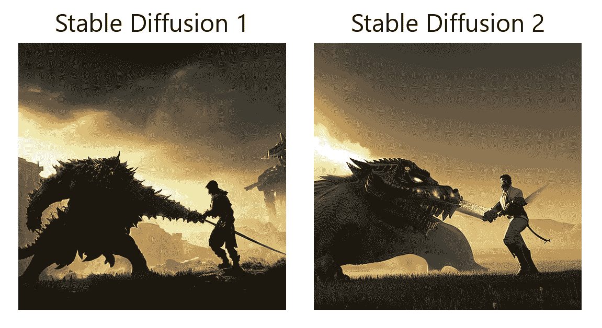

在本文中，我们将总结稳定扩散 1 与稳定扩散 2 争论中的所有要点。我们将在第一部分中查看这些差异存在的实际原因*为什么*，但是如果您想直接了解实际差异，您可以跳下[负面提示](#negative-prompts)部分。我们开始吧！

版本注释

这篇文章发表的第二天，稳定扩散 2.1 发布。2.1 旨在解决 2.0 相对于 1.5 的许多缺点。这篇文章的内容仍然与理解稳定扩散 1 和 2 相关，但是读者应该确保额外阅读附加的 **[稳定扩散 2.1](#stable-diffusion-21)** 部分，以了解全貌。

## OpenCLIP

稳定扩散 2 做出的最重要的转变是替换文本编码器。稳定扩散 1 使用 OpenAI 的[剪辑](https://www.assemblyai.com/blog/how-dall-e-2-actually-works/#step-1linking-textual-and-visual-semantics)，这是一个开源模型，可以学习标题对图像的描述程度。虽然[模型本身](https://github.com/openai/CLIP)是开源的，但是**训练 CLIP 的数据集是不公开的**。

稳定扩散 2 代之以使用 [OpenCLIP](https://github.com/mlfoundations/open_clip) ，这是 CLIP 的开源版本，**使用已知数据集**对其进行了训练——这是过滤掉 NSFW 图像的 [LAION-5B](https://laion.ai/blog/laion-5b/) 的美学子集。稳定性 AI [称](https://stability.ai/blog/stable-diffusion-v2-release)open CLIP“极大地提高了”生成图像的“质量”，事实上，在[指标](https://discord.com/channels/1002292111942635562/1045349359044280360/1045377265946599565)上[优于未发布版本的 CLIP](https://twitter.com/EMostaque/status/1570501470751174656?s=20&t=KujwSWSefNl45yy0wmzVlg)。

### 为什么这很重要

撇开这些模型的相对性能不谈，**从 CLIP 到 OpenCLIP** **的转变是[稳定扩散 1](https://www.assemblyai.com/blog/stable-diffusion-in-keras-a-simple-tutorial/) 和稳定扩散 2 之间许多差异的根源**。

特别是，稳定扩散 2 的许多用户声称，它不能像稳定扩散 1 一样代表名人或艺术风格，尽管事实上稳定扩散 2 的训练数据是**而不是**故意过滤以去除艺术家。这种差异源于这样一个事实，即 **CLIP 的训练数据比 LAION 数据集有更多的名人和艺术家**。由于 CLIP 的数据集不对公众开放，因此不可能单独使用 LAION 数据集来恢复相同的功能。换句话说，稳定扩散 1 的许多规范提示方法对于稳定扩散 2 来说都已经过时了。

### 这意味着什么

这种向完全开源、开放数据模型的转变标志着稳定扩散故事的一个重要转变。开源社区有责任对 Stable Diffusion 2 进行微调，并构建人们希望看到的功能，但这实际上是 Stable Diffusion 的意图 *ab initio -* 一个由社区驱动的完全开放的项目。虽然一些用户可能会在这一点上对稳定扩散 2 *的相对性能感到失望*，StabilityAI 团队已经花费了超过 100 万个小时来创建一个坚实的基础。

此外，虽然创作者没有明确提到，但这种从使用 CLIP 的转变可能会为项目贡献者提供一些潜在责任问题的保护，这是很重要的，因为知识产权诉讼的浪潮肯定会在像这样的模型中出现。

考虑到这一背景，现在是时候讨论稳定扩散 1 和 2 之间的实际差异了。

## 负面提示

我们从检查**负提示**开始，与稳定扩散(SD)1 相比，它似乎对稳定扩散(SD) 2 的强劲性能更为重要，如下所示:

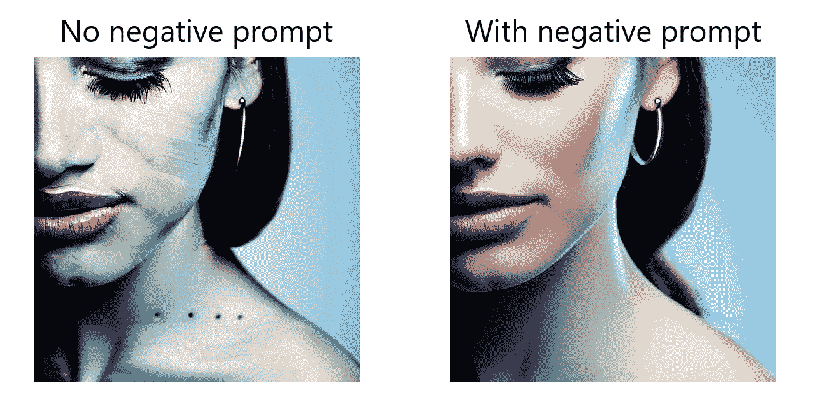

(modified from [source](https://discord.com/channels/1002292111942635562/1045349359044280360/1047481092187377726))

现在让我们更详细地看看负面提示。

### 简单提示

首先，我们向稳定扩散 1.5 和稳定扩散 2 提供提示“*无限池*”，并给出 **no** 否定提示。显示了来自每个模型的三个图像，其中每一列对应于不同的随机种子。

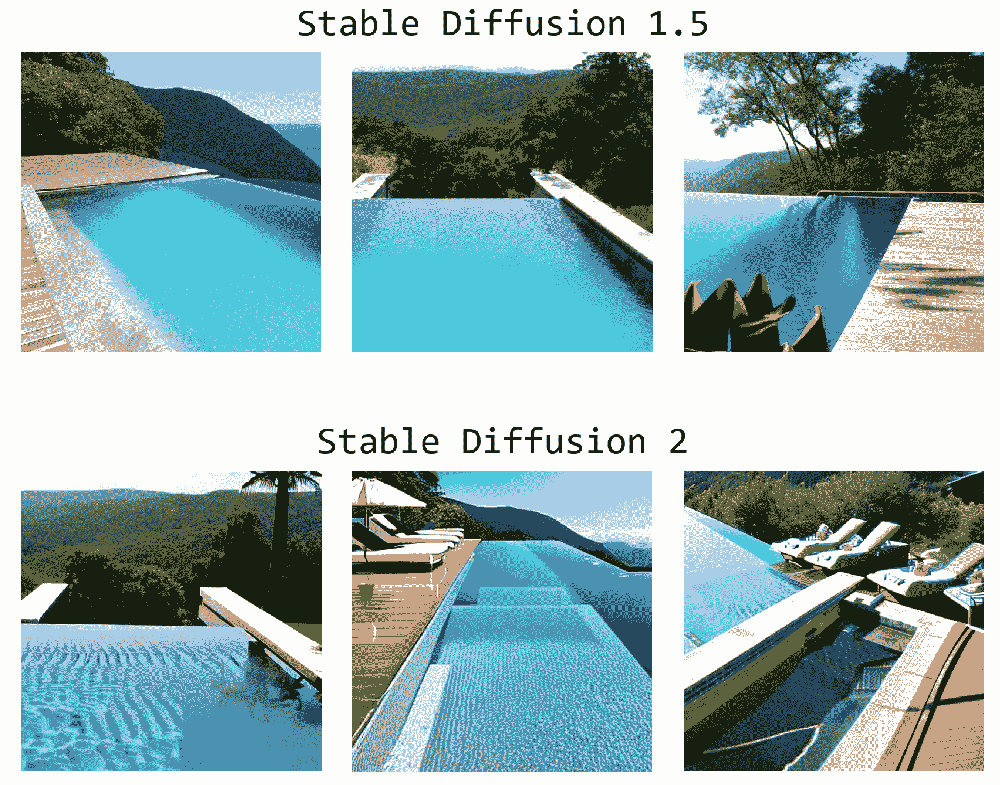

设置

*   **提示**:“无限池”
*   **尺寸** : 512x512
*   **导航刻度** : 12
*   **步数** : 50
*   **采样器** : DDIM

正如我们所见，稳定扩散 1.5 似乎比稳定扩散 2 整体表现更好。在 SD 2 中，最左边的图像有一个在图像内不太适合的补丁，最右边的图像几乎是不连贯的。

现在我们以同样的方式从相同的起始噪声中生成图像，**这次使用** **负提示**。我们添加负面提示“*丑，贴瓷砖，手画的不好，脚画的不好，脸画的不好，出框，突变，变异，多余的四肢，多余的腿，多余的胳膊，毁容，畸形，斗鸡眼，身体出框，模糊，糟糕的艺术，糟糕的解剖，模糊，文字，水印，粒状*”，这是[艾玛德莫斯塔克](https://twitter.com/EMostaque)使用的[负面提示](https://twitter.com/EMostaque/status/1596864150134984705?s=20&t=r1HPLR9CXSUn2vSmzpE5OA)。

添加了负面提示后，SD 1.5 通常表现更好，尽管中间图像的字幕对齐可能较差。对于 SD 2，改进更加剧烈，尽管总体性能仍然不如 SD 1.5

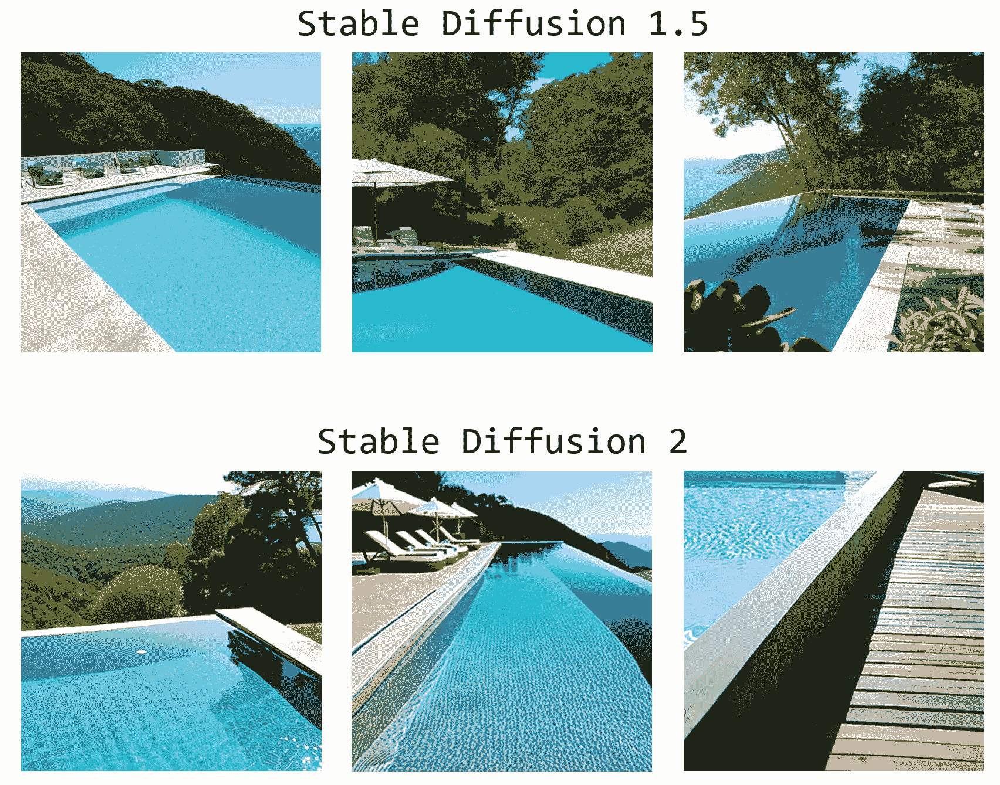

设置

*   **提示**:“无限池”
*   **尺寸** : 512x512
*   **导航刻度** : 12
*   **步数** : 50
*   **采样器** : DDIM
*   **负面提示**:“丑、平铺、手画得不好、脚画得不好、脸画得不好、画框外、突变、变异、多肢、多腿、多臂、毁容、变形、斗鸡眼、身体画框外、模糊、糟糕的艺术、糟糕的解剖、模糊、文本、水印、粒状”

我们直接比较了有和没有负面提示的 SD 2 性能。检验揭示了对**负面提示对 SD 2** 至关重要这一命题的支持。

下面我们可以看到 SD 1.5 和 2 生成的最终图像的比较，有和没有负面提示，从相同的随机种子开始。

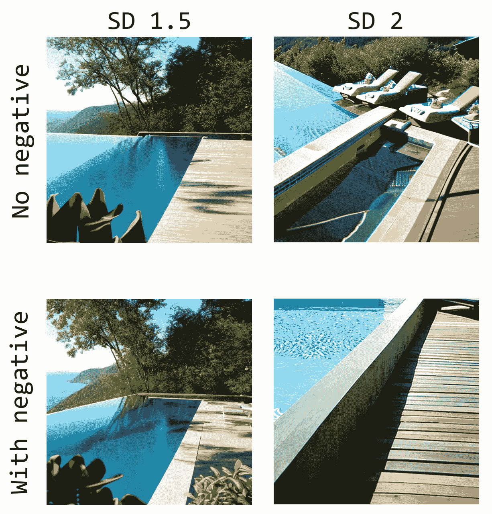

### 复杂提示

我们运行与上面相同的实验，这一次有一个更复杂的(肯定的)提示。这一次，我们使用的不是“ *infinity pool* ”，而是“ *infinity pool，背景是热带森林，高分辨率，细节，8 k，dslr，良好的照明，光线追踪，逼真的*”。虽然我们可以省略“*和背景中的热带森林*”部分，以便隔离纯粹的美学添加，但我们包括它是为了更好地探索更复杂提示的语义匹配。

同样，我们显示的结果没有负面的提示。图像看起来不再像照片一样真实，标题的排列也更好了。水的质感也用 SD 1.5 好很多。

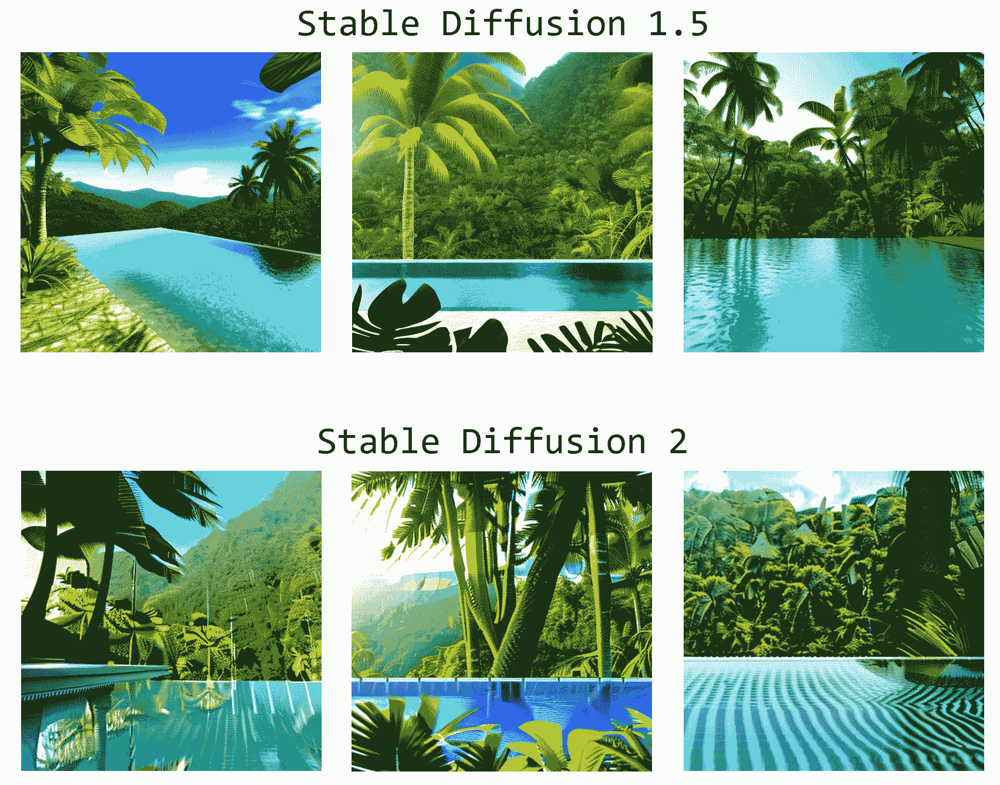

设置

*   **提示**:“以热带森林为背景的无限泳池，高分辨率，细节，8 k，dslr，良好的照明，光线追踪，逼真”
*   **尺寸** : 512x512
*   **导航刻度** : 12
*   **步数** : 50
*   **采样器** : DDIM

一旦我们添加了与上一个例子相同的否定提示，我们会看到一些有趣的结果。特别是，似乎负面提示实际上可能对 SD 1 有负面影响，但普遍有助于 SD 2。SD 2 的每张图片都有负面提示，而 SD 1 的标题排列似乎普遍下降。有趣的是，添加负面提示似乎会将生成的图像推向真实感。

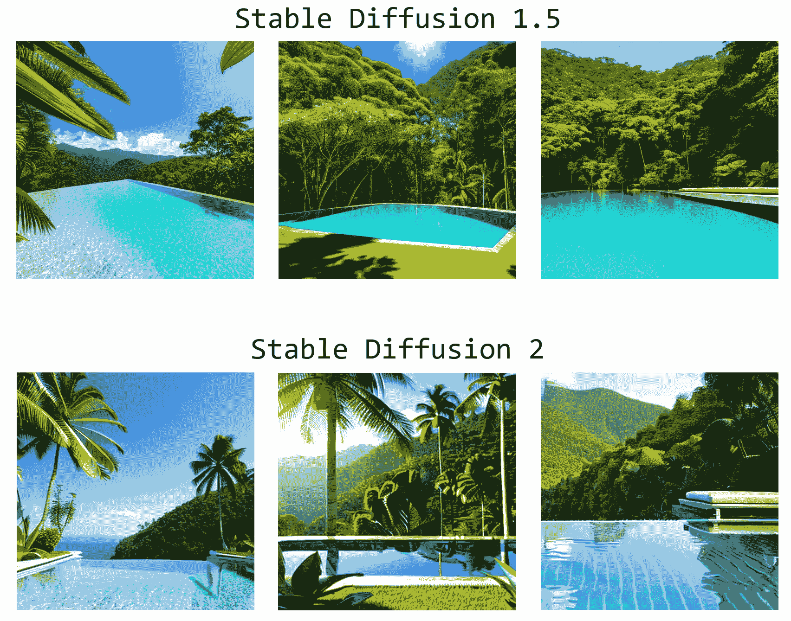

设置

*   **提示**:“以热带森林为背景的无限泳池，高分辨率，细节，8 k，dslr，良好的照明，光线追踪，逼真”
*   **尺寸** : 512x512
*   **导航刻度** : 12
*   **步数** : 50
*   **采样器** : DDIM
*   **负面提示**:“丑、平铺、手画得不好、脚画得不好、脸画得不好、画框外、突变、变异、多肢、多腿、多臂、毁容、变形、斗鸡眼、身体画框外、模糊、糟糕的艺术、糟糕的解剖、模糊、文本、水印、粒状”

我们再次直接比较不同随机种子生成的图像，有和没有 SD 2 的负面提示。

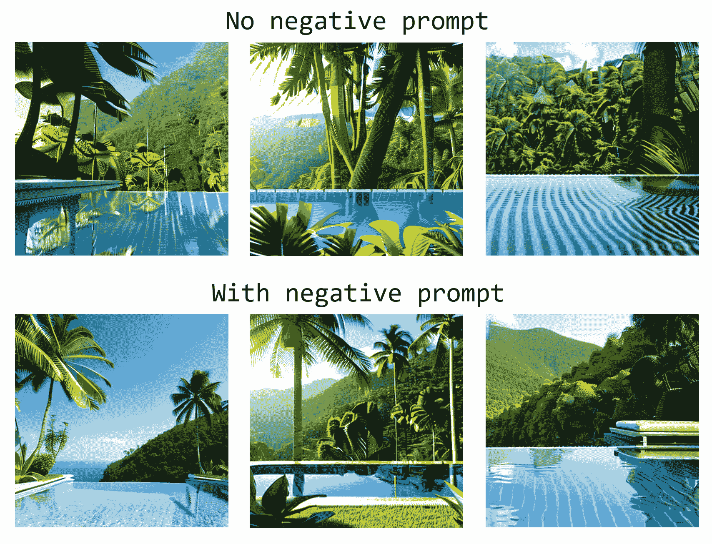

最后，我们再次展示了一个带有/不带有负提示矩阵的 SD 1.5/SD2 vs:

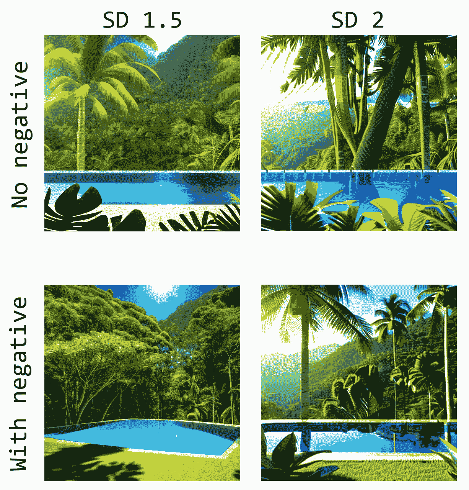

### 文本倒置

除了普通的负面提示，稳定扩散还支持[文本反转](https://textual-inversion.github.io/)。文本反转是一种方法，其中少量参考图像可用于生成表示图像的新“单词”。一旦学会了，这个“单词”就可以像往常一样在提示中使用，让我们能够生成与参考图像精确对应的图像。在下面的例子中，一个小图形的 4 个图像被*反转*为“S_*”。然后，这个“单词”照常在各种提示中使用，忠实地将参考图像与其他语义概念相结合:

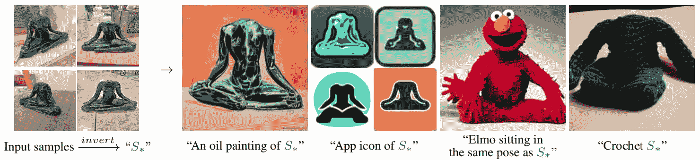

(image modified from [source](https://textual-inversion.github.io/))

在下面的例子中，我们使用稳定扩散 2.0 从基本提示“*一个美味的汉堡*”中创建了几个图像。该提示然后用肯定提示或文本反转标记和/或否定提示或文本反转标记来增强。例如，第二行中最右边的图像用引用中途的文本倒置标记和正常的负面提示“*丑陋、无聊、糟糕的解剖*”来增强基本提示。

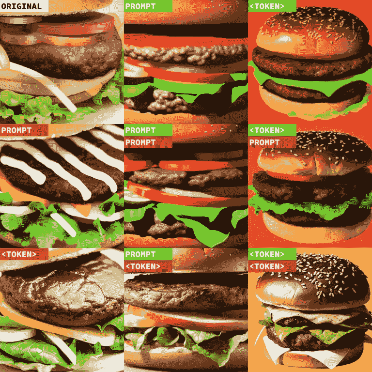

([source](https://minimaxir.com/2022/11/stable-diffusion-negative-prompt/))

正如我们所看到的，文本反转的使用显著提高了稳定扩散 2.0 的性能。上面的图片摘自 Max Woolf 的博客文章,它对这个话题进行了很好的处理。

## 名人

鉴于 LAION 包含的名人图像比 CLIP 的训练数据少，因此许多 SD 2 用户观察到的生成名人图像的能力比 SD 1.5 差可能并不奇怪。

下面我们展示了 SD 1.5 和 SD 2 在有和没有负面提示的情况下从 3 个随机种子(列)生成的图像。提示是“*基努·里维斯*”[这张图片的全分辨率](https://raw.githubusercontent.com/AssemblyAI-Examples/stable-diffusion-1-v-2/main/keanu.png)版本也有。

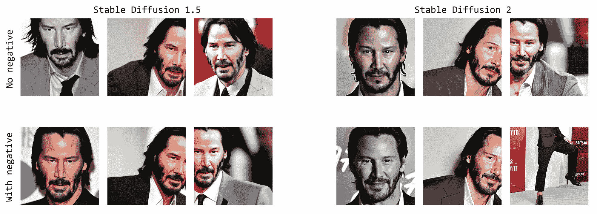

([full resolution](https://raw.githubusercontent.com/AssemblyAI-Examples/stable-diffusion-1-v-2/main/keanu.png))

设置

*   **提示**:“基努·里维斯”
*   **尺寸** : 512x512
*   **导航刻度** : 7
*   **步数** : 50
*   **种子** : 119
*   **采样器** : DDIM
*   **负面提示**:“丑、平铺、手画得不好、脚画得不好、脸画得不好、画框外、突变、变异、多肢、多腿、多臂、毁容、变形、斗鸡眼、身体画框外、模糊、糟糕的艺术、糟糕的解剖、模糊、文本、水印、粒状”

总的来说，在这个特定的提示方面，SD 2 的性能与 SD 1.5 相当。话虽如此，稳定扩散 2 描述名人的能力似乎在与语义概念结合时崩溃了。我们在下面给出了两个这样的提示的比较，其中图像中的每一列都对应于一个给定的随机种子。这一次，我们在所有情况下都使用负面提示。

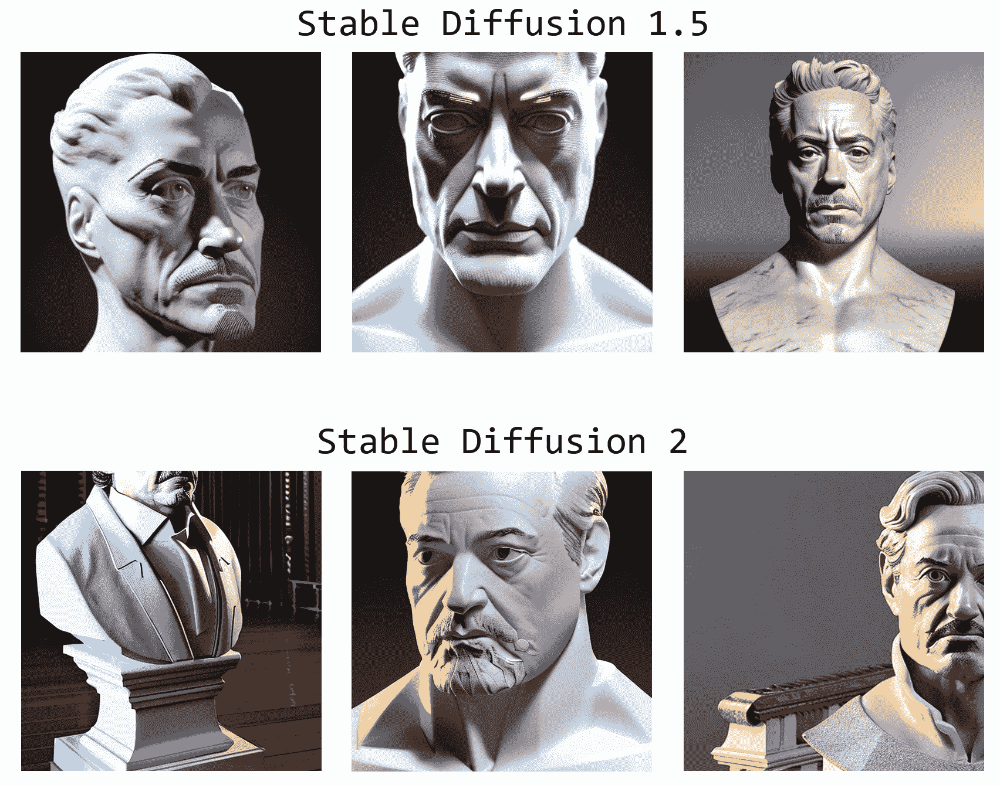

设置

*   **提示**:“博物馆里的小罗伯特·唐尼汉白玉半身像，电影灯光，超细节，8 k 真实感，全局照明，辐射光，冻伤 3 引擎，cryengine，artstation 上的趋势，数字艺术，幻想背景”
*   **尺寸** : 512x512
*   **导航刻度** : 12
*   **步数** : 50
*   **种子** : 120-122
*   **采样器** : DPM-Solver++
*   **否定提示**:“难看、平铺、脱帧、变形、模糊、艺术差、模糊、水印、有颗粒”

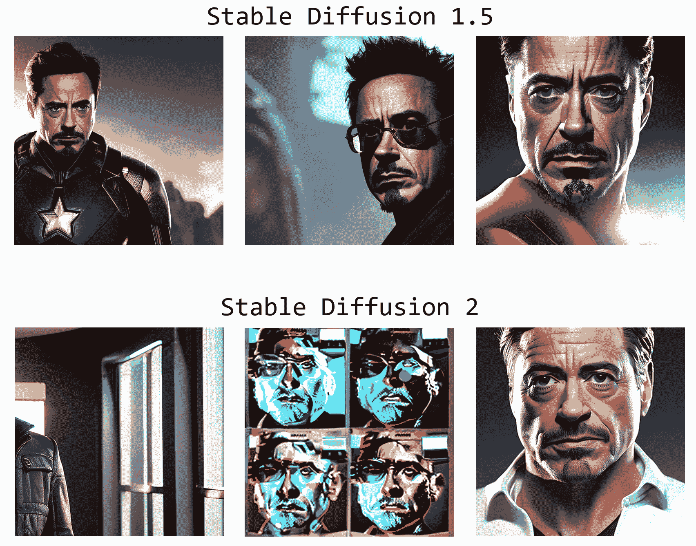

设置

*   **提示**:“小罗伯特·唐尼工作室照片，电影灯光，超细节，8 k 真实感，全局照明，辐射光，冻伤 3 引擎，cryengine，artstation 趋势，数字艺术”
*   **尺寸** : 512x512
*   **导航刻度** : 7
*   **步数** : 50
*   **种子** : 119-121
*   **采样器** : DPM-Solver++
*   **负面提示**:“丑、平铺、手画得不好、脚画得不好、脸画得不好、画框外、突变、变异、多肢、多腿、多臂、毁容、变形、斗鸡眼、身体画框外、模糊、糟糕的艺术、糟糕的解剖、模糊、文本、水印、粒状”

正如我们所看到的，在这方面，稳定扩散 1.5 往往优于稳定扩散 2(在某一点上，它甚至似乎描绘了史蒂夫·卡雷尔而不是小罗伯特·唐尼)。虽然这种差异是意料之中的，但从山谬·里维的例子中得出的结果来看，其幅度可能比预期的要大。

## 艺术形象

正如在 [OpenCLIP](#openclip) 部分中提到的，除了包含比剪辑训练数据更少的名人图像之外，LAION 数据集还包含更少的艺术图像。这意味着生成风格化的图像更加困难，并且“*_ _ _ _*风格中的“_____”的规范方法不再像在稳定扩散 1 中那样起作用。下面我们比较了稳定扩散 1.5 和稳定扩散 2 的 4 个随机种子的图像，我们试图以 [Greg Rutkowski](https://www.artstation.com/rutkowski) 的风格生成图像。

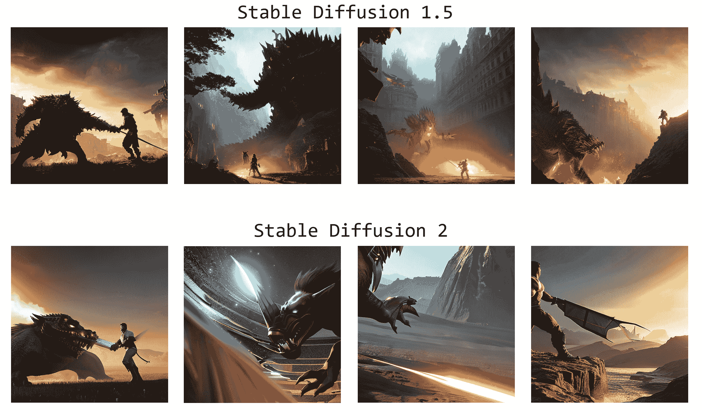

([full resolution](https://github.com/AssemblyAI-Examples/stable-diffusion-1-v-2/blob/main/greg_rutkowski.png))

设置

*   **提示**:“怪物与英雄战斗，格雷格·鲁特考斯基，浪漫主义，电影灯光，超细节，8 k 现实，全局照明，辐射光，artstation 趋势，数字艺术”
*   **尺寸** : 512x512
*   **导航刻度** : 9
*   **步数** : 50
*   **种子** : 119-122
*   **采样器** : DPM-Solver++
*   **负面提示**:“丑、平铺、手画得不好、脚画得不好、脸画得不好、画框外、突变、变异、多肢、多腿、多臂、毁容、变形、斗鸡眼、身体画框外、模糊、糟糕的艺术、糟糕的解剖、模糊、文本、水印、粒状”

结果是激烈的——稳定扩散 1.5 再次明显战胜了稳定扩散 2(开箱即用)。虽然使用不明确引用艺术家的其他描述符来增加提示，但仍然可以使用 SD 2 生成风格化的图像，性能仍然不如 SD 1.5，如下所示:

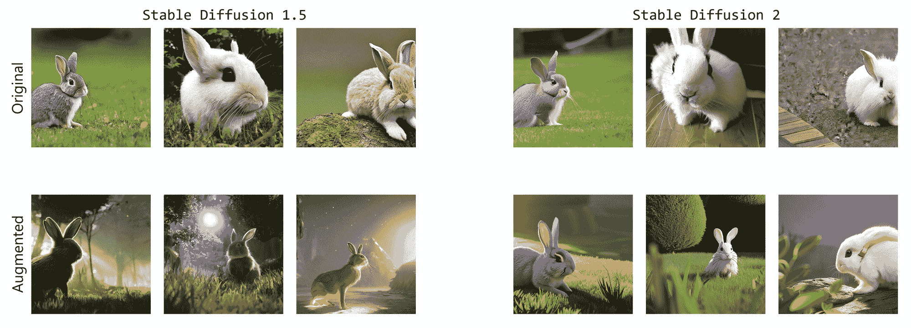

([full resolution](https://github.com/AssemblyAI-Examples/stable-diffusion-1-v-2/blob/main/rabbits.png))

设置

*   **“原创”提示**:“一只可爱的兔子”
*   **“增强”提示**:“一只可爱的兔子，电影灯光，超细节，8 k 真实感，全局照明，辐射光，冻伤 3 引擎，cryengine，artstation 上的趋势，数字艺术，幻想背景”
*   **尺寸** : 512x512
*   **导航刻度** : 9
*   **步数** : 50
*   **种子** : 119-122
*   **采样器** : DPM-Solver++
*   **否定提示**:“难看、平铺、脱帧、变形、模糊、艺术差、模糊、水印、有颗粒”

另一方面，一些用户发现 SD 2 非常有能力生成照片般逼真的图像 *:*

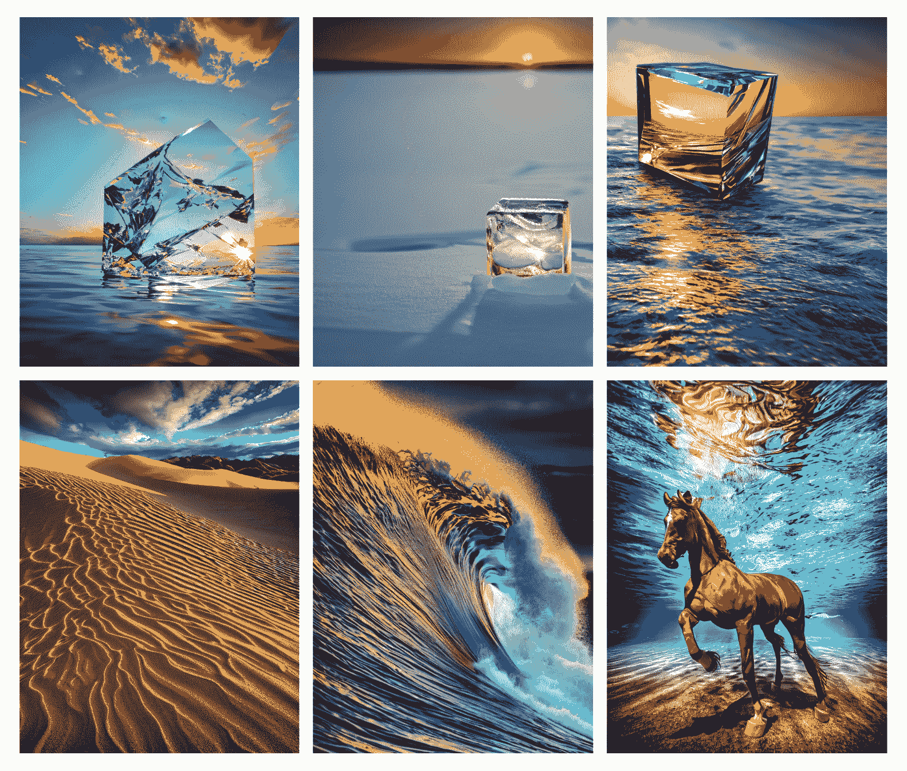

(modified from [source](https://www.reddit.com/r/StableDiffusion/comments/z7ghbf/not_only_is_stable_diffusion_20_not_bad_but/))

## 语篇连贯

与稳定扩散 1 相比，稳定扩散 2 可能具有现成优势的一个地方是文本一致性。大多数文本到图像模型在表现文本方面都很糟糕。这一点都不奇怪——虽然我们人类很容易解析文本，但我们必须记住，单词是极其复杂的语言系统的一部分，按照特殊的规则排列以传达意思。此外，这些单词本身是由字母以近乎随机的方式组成的；而且，*更进一步，*这些字母的实际视觉表现可以有很大的不同(例如，比较[乔克曼](https://learn.microsoft.com/en-us/typography/font-list/jokerman)和[康萨拉](https://learn.microsoft.com/en-us/typography/font-list/consolas)字体)。这些考虑因素(以及其他因素)为这些模型无法正确传达文本(尤其是简单文字之外的文本)提供了一些解释。

也就是说，稳定扩散 2 似乎比稳定扩散 1 在传达文本方面稍好。下面我们提供几张图片进行比较:

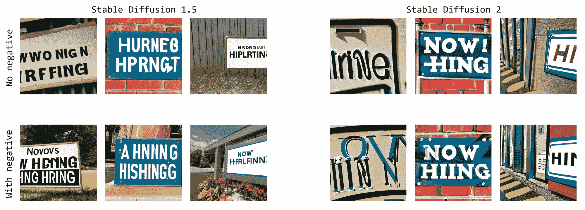

([full resolution](https://github.com/AssemblyAI-Examples/stable-diffusion-1-v-2/blob/main/now_hiring.png))

正如我们所看到的，这两种情况下的结果都不理想，负面的提示在这方面似乎没有什么效果。虽然很难提出一种客观的方法来衡量这些模型生成文本的效果，但可以说一般人会认为稳定扩散 2 略好一些。

## 其他型号

除了从 CLIP 到 OpenCLIP 的转变，Stable Diffusion 2 还发布了一些其他出色的功能，我们将在下面进行总结。

### 深度模型

一个深度模型与 SD 2 一起发布。该模型接收 2D 图像并返回该图像的预测深度图。然后，除了文本之外，该信息还可以用于调节图像生成，从而允许用户生成新的保持忠实于参考图像几何形状的图像。

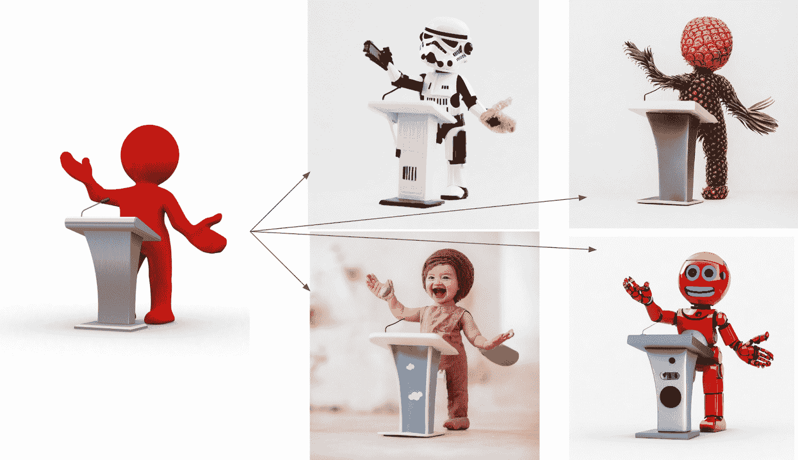

([source](https://stability.ai/blog/stable-diffusion-v2-release))

下面我们可以看到一系列这样的图像，它们都保持着相同的基本几何结构。

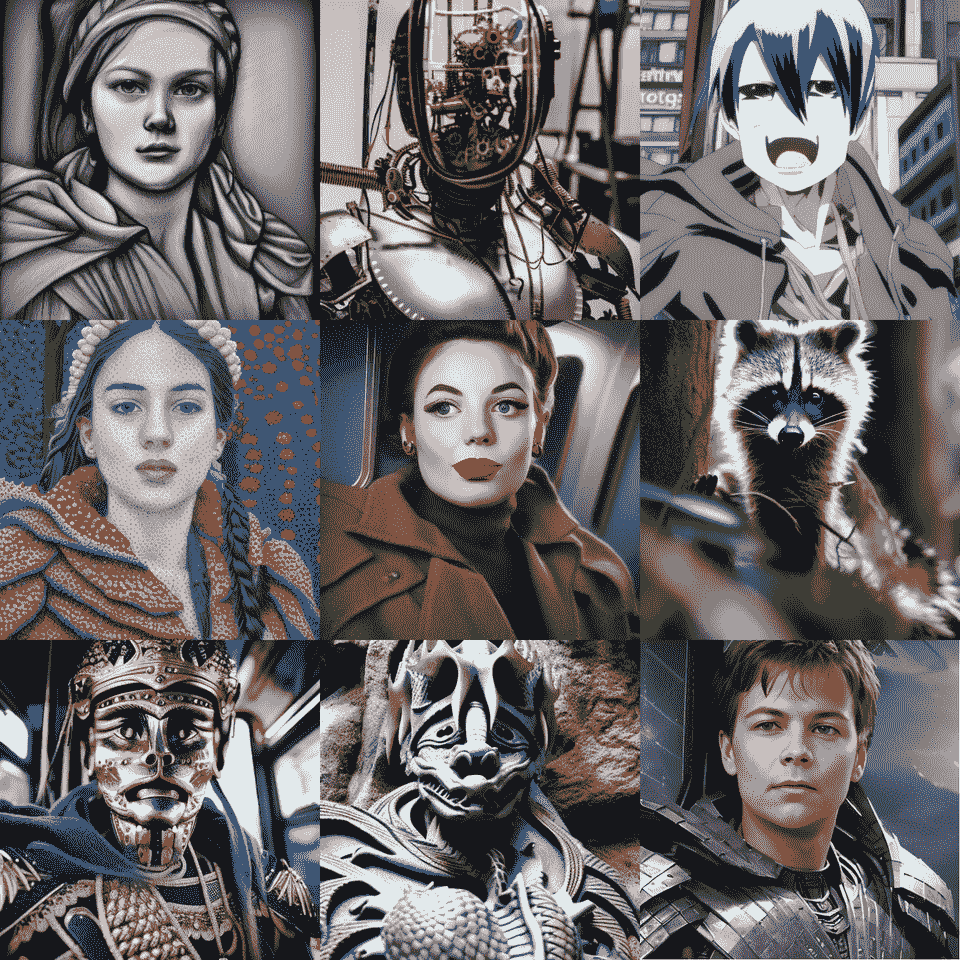

([source](https://www.reddit.com/r/StableDiffusion/comments/z4s94h/stable_diffusion_v2_depth2img_test/))

### 放大模型

稳定扩散 2 还发布了一个放大模型，可以将图像放大到原来边长的 4 倍。这意味着升级后的图像面积是原来的 16 倍！

下面我们可以看到放大之前生成的图像的结果:

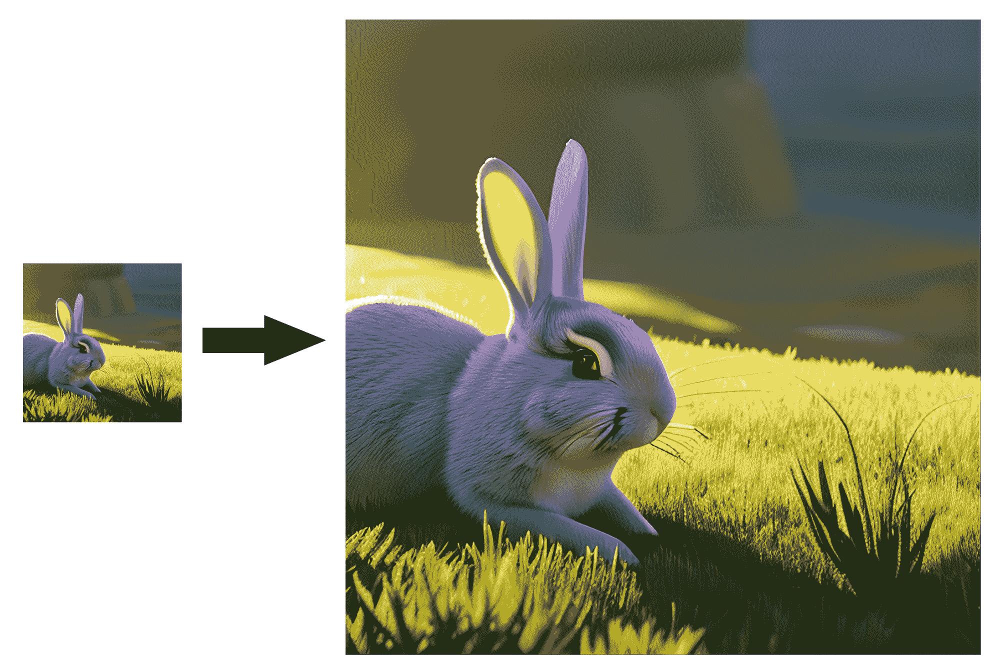

如果我们放大每张照片中兔子的眼睛，差异会立即显现出来，给人留下非常深刻的印象。

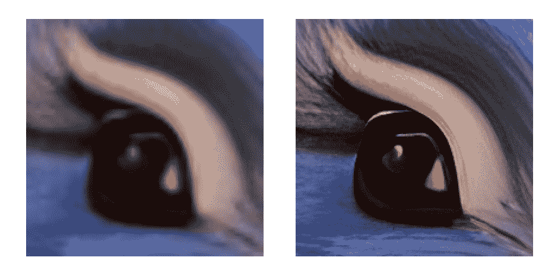

### 修复模型

稳定扩散 2 还带有一个更新的[修复模型](https://www.assemblyai.com/blog/stable-diffusion-in-keras-a-simple-tutorial/#image-inpainting)，它可以让你修改图像的子部分，以使补丁符合美学:

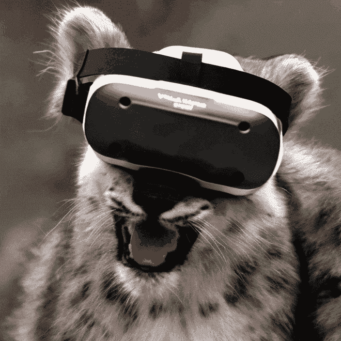

([source](https://stability.ai/blog/stable-diffusion-v2-release))

### 768 x 768 型号

最后，稳定扩散 2 现在提供了对 768 x 768 图像的支持——超过稳定扩散 1 的 512 x 512 图像的两倍。

## 稳定扩散 2.1

稳定扩散 2.1 是在稳定扩散 2.0 发布后不久发布的。SD 2.1 旨在解决 2.0 相对于 1.5 的许多缺点。让我们看看 2.1 是如何做到这一点的。

### NSFW 滤波器

2.1 相对于 2.0 最大的变化是**一个改进的 NSFW 滤波器**。回想一下，2.0 是在 LAION 数据集的子集上训练的，该数据集使用 NSFW 过滤器过滤不适当的内容，这反过来导致描绘人类的能力相对较低。

稳定扩散 2.1 也用这样的滤波器训练，尽管滤波器本身被修改为**限制更少**。特别是，过滤器抛出更少的**假阳性**，这大大增加了能够通过过滤器和训练模型的图像数量。训练数据的增加使得**描绘人物的能力得到了提高**。我们再次展示了几幅小罗伯特·唐尼的图像，它们是用相同的设置创建的，除了用来生成它们的模型版本，这次包括了稳定扩散 2.1。

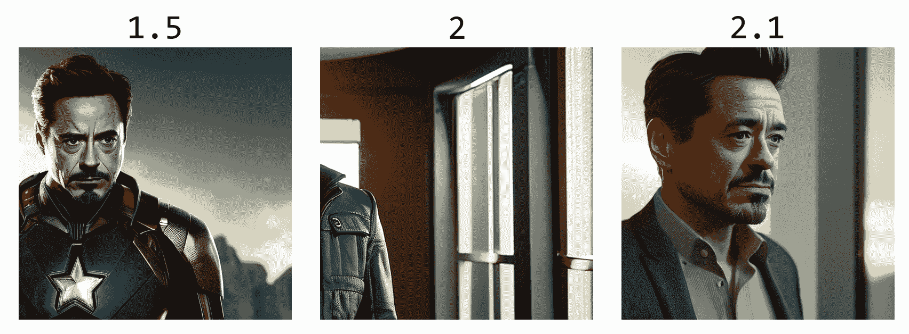

An image of Robert Downey Jr. created with each model using identical settings

设置

*   **提示**:“小罗伯特·唐尼工作室照片，电影灯光，超细节，8 k 真实感，全局照明，辐射光，冻伤 3 引擎，cryengine，artstation 趋势，数字艺术”
*   **尺寸** : 512x512
*   **导航刻度** : 7
*   **步数** : 50
*   **种子** : 119
*   **采样器** : DPM-Solver++
*   **负面提示**:“丑、平铺、手画得不好、脚画得不好、脸画得不好、画框外、突变、变异、多肢、多腿、多臂、毁容、变形、斗鸡眼、身体画框外、模糊、糟糕的艺术、糟糕的解剖、模糊、文本、水印、粒状”

正如我们所看到的，稳定扩散 2.1 是稳定扩散 2 的显著改进，能够实际描绘小罗伯特·唐尼。此外，SD 2.1 的皮肤纹理甚至比 SD 1.5 更好。

### 艺术风格

不幸的是，SD 2.1 描绘特定艺术家风格的能力仍然明显低于 SD 1.5。下面我们再一次看到用相同的设置创建的图像，除了用来创建它们的模型。这些照片意在捕捉格雷格·鲁特考斯基的风格。

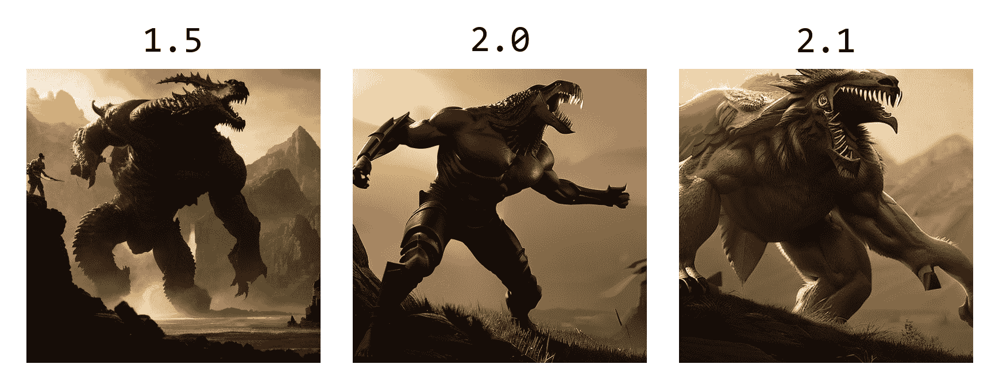

设置

*   **提示**:“怪物与英雄战斗，格雷格·鲁特考斯基，浪漫主义，电影灯光，超细节，8 k 现实，全局照明，辐射光，artstation 趋势，数字艺术”
*   **尺寸** : 512x512
*   **导航刻度** : 9
*   **步数** : 50
*   **种子** : 158
*   **采样器** : DPM-Solver++
*   **负面提示**:“丑、平铺、手画得不好、脚画得不好、脸画得不好、画框外、突变、变异、多肢、多腿、多臂、毁容、变形、斗鸡眼、身体画框外、模糊、糟糕的艺术、糟糕的解剖、模糊、文本、水印、粒状”

正如我们所看到的，稳定扩散 1.5 仍然在这方面占主导地位。

### 常规图像

我们重复上一节中关于普通与“增强”提示的实验，同样只改变模型版本。

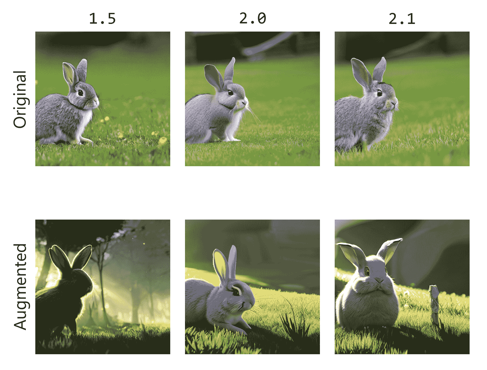

设置

*   **“原创”提示**:“一只可爱的兔子”
*   **“增强”提示**:“一只可爱的兔子，电影灯光，超细节，8 k 真实感，全局照明，辐射光，冻伤 3 引擎，cryengine，artstation 上的趋势，数字艺术，幻想背景”
*   **尺寸** : 512x512
*   **导航刻度** : 9
*   **步数** : 50
*   **种子** : 119
*   **采样器** : DPM-Solver++
*   **否定提示**:“难看、平铺、脱帧、变形、模糊、艺术差、模糊、水印、有颗粒”

正如我们所见，2.1 的“原始”纹理是对 2.0 的改进。2.1 的“增强”图像比 2.0 更加风格化，但总体上非常相似。

## 结论

虽然这些实验肯定不是严格或详尽的，但它们提供了对稳定扩散 1 和稳定扩散 2 的相对性能的一些见解。

如果您对文本到图像模型有更多问题，请查看以下资源以进一步了解:

1.  如何建立一个文本到图像的模型？
2.  什么是无分类器指导？
3.  [什么是提示工程？](https://www.assemblyai.com/blog/how-to-run-stable-diffusion-locally-to-generate-images/#prompt-engineering)
4.  [DALL-E2 是如何工作的？](https://www.assemblyai.com/blog/how-dall-e-2-actually-works/)
5.  [Imagen 是如何工作的？](https://www.assemblyai.com/blog/how-imagen-actually-works/)

或者，考虑关注我们的 [YouTube](https://www.youtube.com/c/AssemblyAI) 频道、 [Twitter](https://twitter.com/AssemblyAI) 或[时事通讯](https://assemblyai.us17.list-manage.com/subscribe?u=cb9db7b18b274c2d402a56c5f&id=2116bf7c68)来了解我们最新的教程和深度探索！