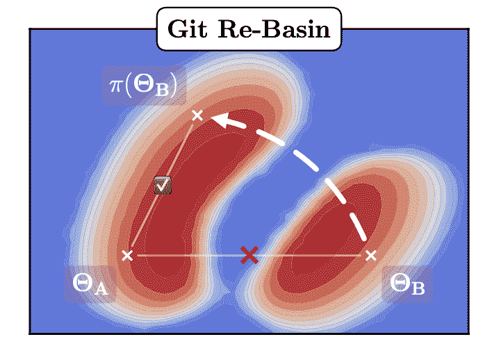
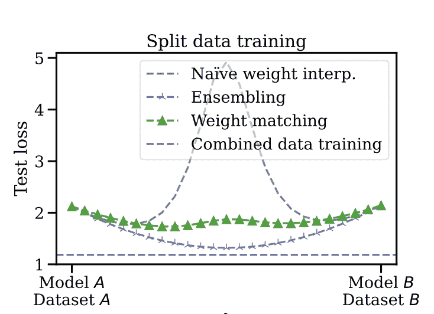

# 人工智能研究综述-合并模型模置换对称

> 原文：<https://www.assemblyai.com/blog/ai-research-review-merging-models-modulo-permutation-symmetries/>

本周的人工智能研究综述是 [Git Re-Basin:合并模型模置换对称](https://arxiv.org/pdf/2209.04836.pdf)。

## Git 重组:合并模型模置换对称

### 这篇论文有什么令人兴奋的地方

在[这篇论文](https://arxiv.org/pdf/2209.04836.pdf)中，作者表明足够宽的神经网络的损失景观本质上具有单个盆地。这导致计算相同函数的相同模型权重的许多排列。

### 主要发现

模型权重之间的线性插值是 SGD(随机梯度下降)的突发行为，而不是模型属性。

在两个不同的数据集上训练的两个模型(具有相同的架构),具有不同的参数集，例如学习速率、辍学等，可以被合并而没有损失成本。

作者提出了三种方法来寻找不同模型的神经元之间的映射。

[Source](https://arxiv.org/pdf/2209.04836.pdf)

作者讨论了选择排列的三种方法:

*   匹配激活:为了完成相同的任务，两个模型必须学习相似的特征——可以假设在这种情况下，激活之间将存在线性关系。
*   匹配重量:直接检查模型重量，而不是激活。
*   用直通估计器学习排列

[Source](https://arxiv.org/pdf/2209.04836.pdf)

### 我们的外卖

本文的发现可能有助于分布式模型训练。

它还为联合学习引入了新的途径——可以在数据集上训练模型而不损害隐私，然后与现有模型合并以提高性能。

最后，该论文还提供了模型优化的新途径——根据不同数据训练的不同模型，收敛到几乎相同的流域，表明存在全局最小值。