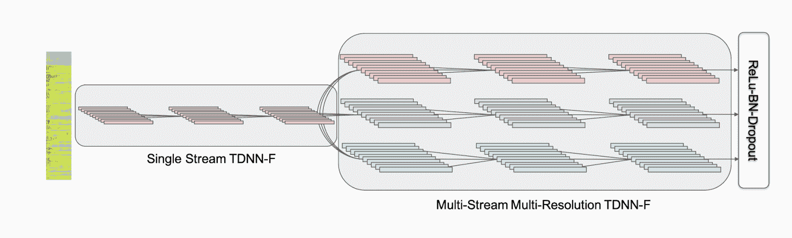

# 人工智能研究评论-多流 CNN

> 原文：<https://www.assemblyai.com/blog/ai-research-review-multistream-cnn/>

本周的 AI 研究综述是 *[多流 CNN 进行鲁棒声学建模](https://arxiv.org/pdf/2005.10470.pdf)*

## 用于鲁棒声学建模的多流 CNN

### 这篇论文有什么令人兴奋的地方

多流 CNN 建立在这样一种思想上，即通过在不同的模型上使用不同的膨胀率，各层正在以多种分辨率学习特征的“不同”视图。

### 主要发现

TDNN-F 中的卷积矩阵被分解成具有正交约束的两个因子，这显然提高了这一特定任务的性能。

多流 CNN 基本上是 N 个不同卷积层的堆栈，并行处理输入，并在最终层连接输出。

[Source](https://arxiv.org/pdf/2005.10470.pdf)

### 我们的外卖

多分辨率优化有助于模型跨不同的“视点”学习更健壮的特征这种方法可以与不同的建模技术一起使用。

由于其数学特性，TDNN-F 层对标准 conv1d 层进行了改进。