# MinImagen -构建你自己的图像文本到图像模型

> 原文：<https://www.assemblyai.com/blog/minimagen-build-your-own-imagen-text-to-image-model/>

DALL-E 2 于今年早些时候发布，凭借其令人印象深刻的文本到图像的功能风靡全球。只有一个场景的输入描述，DALL-E 2 输出场景的现实和语义上似乎合理的图像，就像你可以在下面看到的从输入标题**“一碗汤，这是通往另一个维度的门户，作为数字艺术】**:

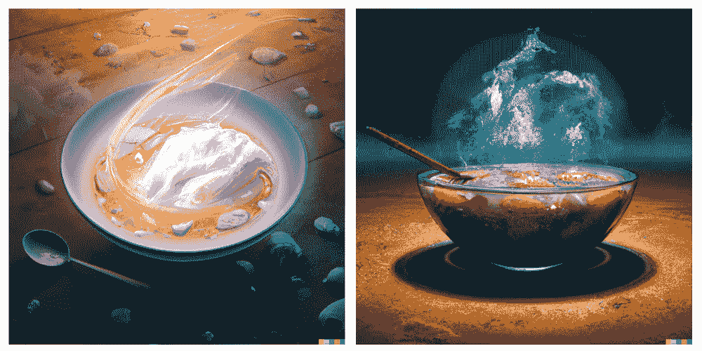

([source](https://openai.com/dall-e-2/))

就在 DALL-E 2 发布一个月后，谷歌宣布了一款竞争机型 **[Imagen](https://www.assemblyai.com/blog/how-imagen-actually-works/)** 被发现比 DALL-E 2 还要好的*。以下是一些示例图像:*


*"A dragon fruit wearing karate belt in the snow*" and "*a photo of a Corgi dog riding a bike in Times Square. It is wearing sunglasses and a beach hat*" ([source](https://imagen.research.google/)).

无论是 DALL-E 2 还是 Imagen 的骄人成绩，都依赖于前沿的深度学习研究。虽然对于获得最先进的结果来说是必要的，但在 Imagen 等模型中使用这种前沿研究使非专业研究人员更难理解它们，从而阻碍了这些模型和技术的广泛采用。

因此，本着民主化的精神，我们将在本文中学习如何用 PyTorch 构建 Imagen。特别是，我们将构建一个 Imagen 的最小实现——称为**MinImagen**——它隔离了 Imagen 的显著特征，这样我们就可以专注于理解 Imagen 的整体操作原理，将重要的实现方面与附带的实现方面分开。

包装说明

注意:如果你对实现细节不感兴趣，只想使用 MinImagen，它已经打包好了，可以安装在

`pip install minimagen`

查看下面的[部分或相应的](#training-and-sampling-from-minimagen) [GitHub 库](https://github.com/AssemblyAI-Examples/MinImagen)获取使用提示。[文档](https://assemblyai-examples.github.io/MinImagen/minimagen.html)包含了关于使用软件包的更多细节和信息。

## 介绍

文本到图像模型在过去几年中取得了长足的进步，GLIDE、DALL-E 2、Imagen 等模型就是证明。这些进步在很大程度上是由于最近对[扩散模型](https://www.assemblyai.com/blog/diffusion-models-for-machine-learning-introduction/)的研究热潮，这是一种新的生成模型范式/框架。

虽然有一些关于扩散模型和文本到图像模型的理论方面的好资源，但是关于如何实际构建这些模型的实用信息并不丰富。对于将扩散模型仅作为一个更大系统的*组件的模型来说尤其如此，这在文本到图像模型中很常见，如 **DALL-E 2** 中的[编码优先生成器](https://www.assemblyai.com/blog/how-dall-e-2-actually-works/#how-dall-e-2-works-a-birds-eye-view)链，或 **Imagen** 中的[超分辨率链](https://www.assemblyai.com/blog/how-imagen-actually-works/#how-imagen-works-a-birds-eye-view)。*

MinImagen 剥离了当前最佳实践的华而不实之处，以便出于教育目的隔离 Imagen 的显著特征。本文的其余部分结构如下:

1.  **Imagen/扩散模型的回顾:**为了在我们开始编码之前定位自己，我们将简要回顾 Imagen 本身和更一般的扩散模型。这些评论只是作为复习资料，所以在阅读复习资料时，您应该已经对这两个主题有了实际的理解。你可以查看我们的[机器学习扩散模型介绍](https://www.assemblyai.com/blog/diffusion-models-for-machine-learning-introduction/)和我们的[Imagen 如何实际工作的专用指南](https://www.assemblyai.com/blog/how-imagen-actually-works/)来了解更多信息。
2.  **构建扩散模型:**在我们的回顾之后，我们将首先在 PyTorch 中构建`[GaussianDiffusion](https://github.com/AssemblyAI-Examples/MinImagen/blob/ad5fab36e810ed0c4c3cba7ba9df2c892d7ef2c4/minimagen/diffusion_model.py#L8)`类，它定义了 Imagen 中使用的扩散模型。
3.  **构建去噪 U 网:**然后我们将构建扩散模型所依赖的去噪 U 网，在`[Unet](https://github.com/AssemblyAI-Examples/MinImagen/blob/ad5fab36e810ed0c4c3cba7ba9df2c892d7ef2c4/minimagen/Unet.py#L25)`类中显示。
4.  **构建 MinImagen:** 接下来，我们将使用 T5 文本编码器和扩散模型链将所有这些片段放在一起，以构建我们的(Min)Imagen 类，`[Imagen](https://github.com/AssemblyAI-Examples/MinImagen/blob/ad5fab36e810ed0c4c3cba7ba9df2c892d7ef2c4/minimagen/Imagen.py#L22)`。
5.  **使用 MinImagen:** 最后，一旦 Imagen 被完全定义，我们将学习如何从 Imagen 进行训练和采样。

模型重量

敬请期待！我们将在未来几周训练 MinImagen，并发布一个检查点，以便您可以生成自己的图像。确保[关注我们的新闻简报](https://assemblyai.us17.list-manage.com/subscribe?u=cb9db7b18b274c2d402a56c5f&id=2116bf7c68)以了解我们发布的最新内容。

事不宜迟，是时候进入 Imagen 和扩散模型的概述了。如果您已经从理论角度熟悉了 Imagen 和扩散模型，并希望跳到 PyTorch 实现细节，请单击此处的。

## Imagen 是什么？

Imagen 是 Google 几个月前发布的文本到图像模型。它接收一个**文本提示**并输出一个**图像**，该图像反映了包含在提示中的语义信息。


为了生成图像，Imagen 首先使用一个**文本编码器**来生成提示的代表性编码。接下来，一个以编码为条件的**图像生成器**，从高斯噪声(“电视静态”)开始，逐步去噪，生成一个反映字幕描述场景的小图像。最后，两个**超分辨率**模型依次将图像放大到更高的分辨率，再次以编码信息为条件。


文本编码器是一个**预训练的 T5 文本编码器**，在训练过程中被冻结。基本图像生成模型和超分辨率模型都是**扩散模型**。

想要更详细地了解 Imagen 的工作原理吗？

查看我们的专用文章，深入了解 Imagen。

[Check it Out](https://www.assemblyai.com/blog/how-imagen-actually-works/)

## 什么是扩散模型？

扩散模型是一类生成模型，这意味着它们用于*生成*新颖的数据，通常是图像。扩散模型通过在一系列时间步中用高斯噪声破坏训练图像来训练，然后学习撤销这个噪声处理。

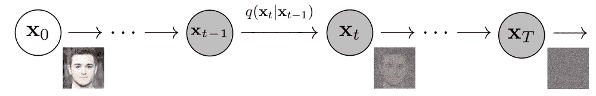

特别地，模型被训练来预测给定时间步长的图像的噪声分量。

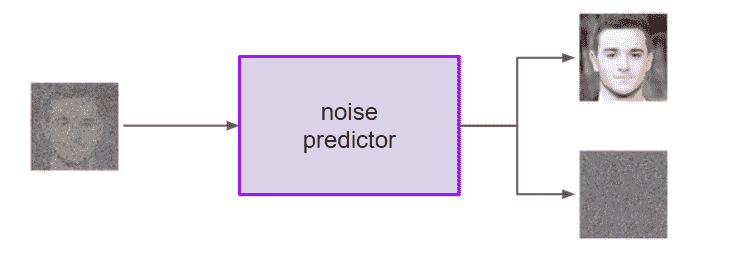

一旦经过训练，该去噪模型就可以迭代地应用于随机采样的高斯噪声，对其进行“去噪”以生成新的图像。

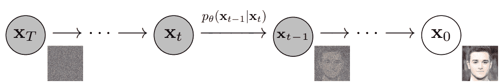

扩散模型构成了一种*元模型*，它协调了*另一个*模型- **噪声预测模型**的训练。因此，我们仍然需要决定实际使用哪种类型的模型来进行噪声预测。一般来说，U 网都是选这个角色的。Imagen 中的 U-Net 具有这样的结构:

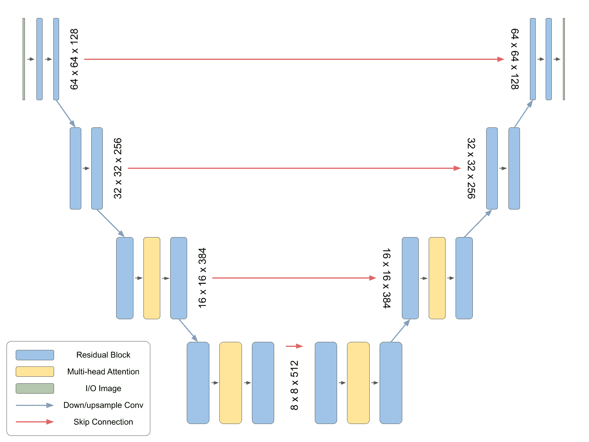

该架构基于[扩散模型击败图像合成](https://openreview.net/pdf?id=AAWuCvzaVt)论文中的模型。对于 **MinImagen** ，我们对这个架构做了一些小改动，包括

1.  移除全局注意力层(未图示)，
2.  用变压器编码器替换注意层，以及
3.  将变换编码器放置在每层序列的末尾，而不是在残差块之间，以便允许可变数量的残差块。

想要更详细地了解扩散模型是如何工作的吗？

查看我们的专用文章，深入了解扩散模型。

[Check it Out](https://www.assemblyai.com/blog/diffusion-models-for-machine-learning-introduction/)

## 在 PyTorch 中构建您自己的图像

随着我们的 Imagen/扩散模型概述的完成，我们终于准备好开始构建我们的 Imagen 实施。首先，打开一个终端，克隆[项目库](https://github.com/AssemblyAI-Examples/MinImagen):

```py
git clone https://github.com/AssemblyAI-Examples/MinImagen.git
```

在本教程中，我们将**分离出与 Imagen 实现本身相关的源代码**的重要部分，省略参数验证、设备处理等细节。即使是 Imagen 的最小实现也相对较大，因此为了隔离指导性信息，这种方法是必要的。 **MinImagen 的源代码被彻底注释**(相关文档[在此](https://assemblyai-examples.github.io/MinImagen/minimagen.html))，所以关于任何省略细节的信息应该很容易找到。

该项目的每一个大的组成部分——扩散模型、去噪 U-Net 和 Imagen——都被放在下面它自己的部分。我们将从构建`[GaussianDiffusion](https://assemblyai-examples.github.io/MinImagen/minimagen.html#minimagen.diffusion_model.GaussianDiffusion)`类开始。

归属注释

这个实现在很大程度上是王飞 Imagen 实现的简化版本，你可以在 GitHub [这里](https://github.com/lucidrains/imagen-pytorch)找到。

## 建立扩散模型

扩散模型`[GaussianDiffusion](https://github.com/AssemblyAI-Examples/MinImagen/blob/0f305c29922274e1faefe9e93be441fdb7ed0efa/minimagen/diffusion_model.py#L8)`类可以在`[minimagen.diffusion_model](https://github.com/AssemblyAI-Examples/MinImagen/blob/main/minimagen/diffusion_model.py)`中找到。点击[此处](#summary)，跳转到本节的摘要。

### 初始化

`GaussianDiffusion`初始化函数只有一个参数——扩散过程中的时间步数。

```py
class GaussianDiffusion(nn.Module):

    def __init__(self, *, timesteps: int):
    	super().__init__()
```

首先，扩散模型需要一个**方差表**，它指定了在扩散过程中给定时间步长添加到图像的高斯噪声的方差。变更进度应该是增加的，但是在如何定义这个进度上有[一些灵活性](https://arxiv.org/pdf/2205.11487.pdf#page=20)。出于我们的目的，我们实现了来自原始[去噪扩散概率模型](https://arxiv.org/abs/2006.11239) (DDPM)论文的方差调度，其是从 t=0 时的 **0.0001 到 t=T 时的 **0.02 的线性间隔调度。****

```py
class GaussianDiffusion(nn.Module):

    def __init__(self, *, timesteps: int):
    	super().__init__()

        self.num_timesteps = timesteps

        scale = 1000 / timesteps
        beta_start = scale * 0.0001
        beta_end = scale * 0.02
        betas = torch.linspace(beta_start, beta_end, timesteps, dtype=torch.float64)
```

根据这个时间表，我们计算了几个值(在 DDPM 论文中也有详细说明),这些值将在以后的计算中使用:


```py
class GaussianDiffusion(nn.Module):

    def __init__(self, *, timesteps: int):
    	# ...

        alphas = 1\. - betas
        alphas_cumprod = torch.cumprod(alphas, axis=0)
        alphas_cumprod_prev = F.pad(alphas_cumprod[:-1], (1, 0), value=1.)
```

初始化函数的[其余部分将上述值和一些派生值注册为缓冲区，这些值类似于参数，只是它们*不需要梯度*。**所有的值最终都是从差异表**中得到的，它们的存在是为了使一些计算更加简单和清晰。计算派生值的细节并不重要，但是我们将在下面指出任何时候使用这些派生值中的一个。](https://github.com/AssemblyAI-Examples/MinImagen/blob/0f305c29922274e1faefe9e93be441fdb7ed0efa/minimagen/diffusion_model.py#L36)

### 正向扩散过程

现在我们可以继续定义`GaussianDiffusion`的`[q_sample](https://github.com/AssemblyAI-Examples/MinImagen/blob/0f305c29922274e1faefe9e93be441fdb7ed0efa/minimagen/diffusion_model.py#L125)`方法，它负责[正向扩散](https://www.assemblyai.com/blog/diffusion-models-for-machine-learning-introduction/#diffusion-modelsa-deep-dive)过程。给定一个输入图像 *x_0* ，我们通过从下面的分布中采样，将其噪声化到扩散过程中给定的时间步长 *t* :

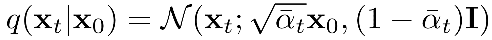

([source](https://arxiv.org/pdf/2006.11239.pdf))

从上面的分布中取样等同于下面的计算，这里我们突出显示了在`__init__`中定义的中的[两个。](https://github.com/AssemblyAI-Examples/MinImagen/blob/0f305c29922274e1faefe9e93be441fdb7ed0efa/minimagen/diffusion_model.py#L45)

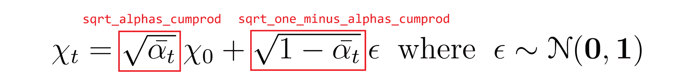

See the "mathematical note" dropdown [here](https://www.assemblyai.com/blog/diffusion-models-for-machine-learning-introduction/#diffusion-modelsa-deep-dive) for details on this equivalence

也就是说，**在时间 *t* 的图像的噪声版本可以通过简单地将噪声添加到图像**来采样，其中原始图像和噪声都由时间步长所规定的它们各自的系数来缩放。现在让我们通过将方法`[q_sample](https://github.com/AssemblyAI-Examples/MinImagen/blob/0f305c29922274e1faefe9e93be441fdb7ed0efa/minimagen/diffusion_model.py#L125)`添加到`GaussianDiffusion`类来在 PyTorch 中实现这个计算:

```py
class GaussianDiffusion(nn.Module):

    def __init__(self, *, timesteps: int):
    	# ...

    def q_sample(self, x_start, t, noise=None):
        noise = default(noise, lambda: torch.randn_like(x_start))

        noised = (
                extract(self.sqrt_alphas_cumprod, t, x_start.shape) * x_start +
                extract(self.sqrt_one_minus_alphas_cumprod, t, x_start.shape) * noise
        )

        return noised
```

`x_start`是形状为`(b, c, h, w)`的 PyTorch 张量，`t`是形状为`(b,)`的 PyTorch 张量，它为每幅图像给出了我们想要对每幅图像进行噪声处理的时间步长，`noise`允许我们可选地提供定制噪声，而不是样本高斯噪声。

我们简单地执行并返回上述等式中的计算，使用来自上述缓冲器的元素作为系数。当`None`被提供时，`[default](https://github.com/AssemblyAI-Examples/MinImagen/blob/0f305c29922274e1faefe9e93be441fdb7ed0efa/minimagen/helpers.py#L25)`函数对随机高斯噪声进行采样，`[extract](https://github.com/AssemblyAI-Examples/MinImagen/blob/0f305c29922274e1faefe9e93be441fdb7ed0efa/minimagen/helpers.py#L56)`根据`t`从缓冲器中提取合适的值。

### 反向扩散过程

最终，我们的目标是从这个分布中取样:


([source](https://arxiv.org/pdf/2006.11239.pdf))

给定一幅图像和它的噪声对应物，**这种分布告诉我们如何在扩散过程中“及时返回”一步**，稍微去噪噪声图像。与上面类似，从这个分布中取样相当于计算

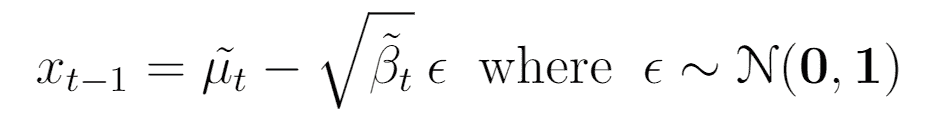

为了进行这种计算，我们需要分布的均值和方差。差异是差异计划的**确定性函数:**


([source](https://arxiv.org/pdf/2006.11239.pdf))

另一方面，**均值取决于原始图像和噪声图像**(尽管系数也是方差表的确定性函数)。平均的形式是:

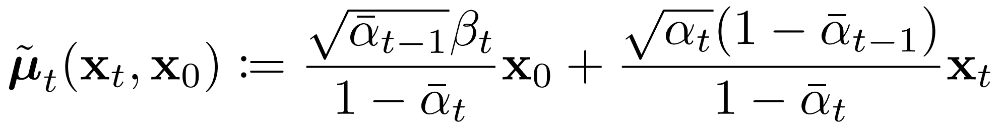

([source](https://arxiv.org/pdf/2006.11239.pdf))

照此推论，**我们就不会有 *x_0*** “原始形象”，因为这正是我们**试图生成的**(一个小说形象)。**这就是我们的可训练 U-Net 进入画面**的地方——我们用它从 *x_t* 预测 *x_0* 。

在实践中，当 U-Net 学习预测图像的*噪声分量*时，可以看到[更好的结果](https://www.assemblyai.com/blog/diffusion-models-for-machine-learning-introduction/#final-objective)，由此我们可以计算*x0*。一旦我们有了 *x_0* ，我们就可以用上面的公式计算分布均值，给出我们需要从后验样本中采样的内容(即，将图像去噪回一个时间步长)。从视觉上看，整个过程如下所示:

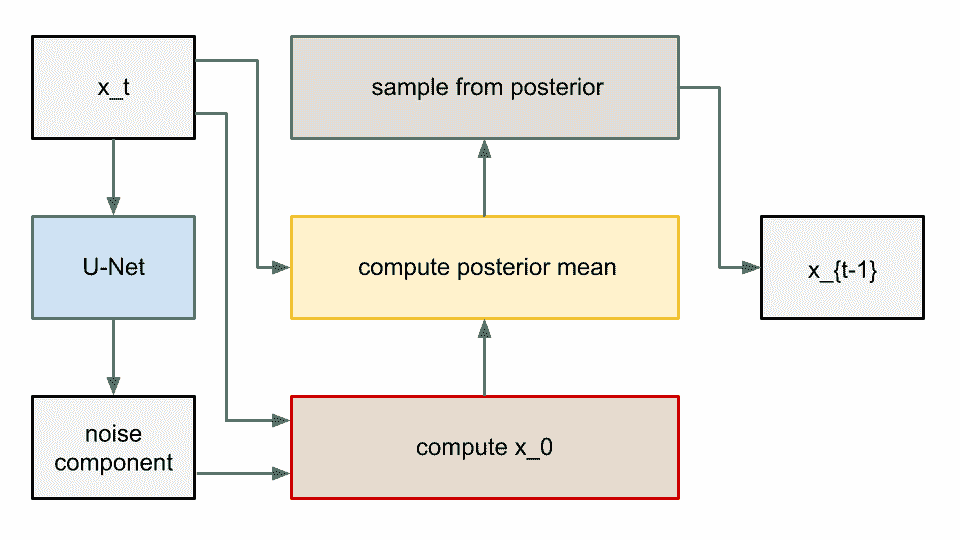

从后面(图中的绿色块)采样的函数将在`[Imagen](https://assemblyai-examples.github.io/MinImagen/minimagen.html#minimagen.Imagen.Imagen)`类中定义，但我们现在将定义其余两个函数。首先，我们实现了计算 *x_0* 的函数，给出了噪声图像及其噪声分量(图中的红色块)。从上面，我们有:

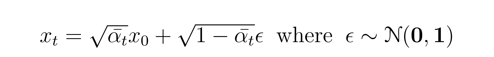

重新排列它以隔离 *x_0* 产生了下面的结果，其中两个[缓冲器](https://github.com/AssemblyAI-Examples/MinImagen/blob/556ce32679903ff59baf0bf0dd890dc5434f51d0/minimagen/diffusion_model.py#L48)再次被突出显示。

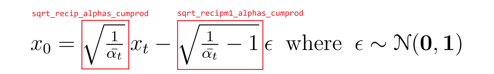

也就是说，为了计算 *x_0* ，我们简单地从 *x_t* 中减去噪声(由 U-Net 预测)，其中噪声图像和噪声本身都由时间步长所规定的各自的系数来缩放。现在让我们在 PyTorch 中实现这个函数`[predict_start_from_noise](https://github.com/AssemblyAI-Examples/MinImagen/blob/0f305c29922274e1faefe9e93be441fdb7ed0efa/minimagen/diffusion_model.py#L147)`:

```py
class GaussianDiffusion(nn.Module):

    def __init__(self, *, timesteps: int):
    	# ...

    def q_sample(self, x_start, t, noise=None):
        # ...

    def predict_start_from_noise(self, x_t, t, noise):
        return (
                extract(self.sqrt_recip_alphas_cumprod, t, x_t.shape) * x_t -
                extract(self.sqrt_recipm1_alphas_cumprod, t, x_t.shape) * noise
        )
```

现在我们有了一个计算 *x_0* 的函数，我们可以回过头来计算后验均值和方差(图中的黄色块)。我们在下面重复上面的功能定义，根据需要突出显示在`_init__`中定义的[缓冲器](https://github.com/AssemblyAI-Examples/MinImagen/blob/556ce32679903ff59baf0bf0dd890dc5434f51d0/minimagen/diffusion_model.py#L63)。

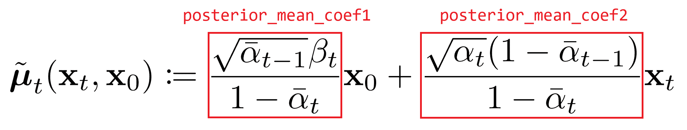

让我们在 PyTorch 中实现一个函数`[q_posterior](https://github.com/AssemblyAI-Examples/MinImagen/blob/0f305c29922274e1faefe9e93be441fdb7ed0efa/minimagen/diffusion_model.py#L87)`来计算这些变量:

```py
class GaussianDiffusion(nn.Module):

    def __init__(self, *, timesteps: int):
    	# ...

    def q_sample(self, x_start, t, noise=None):
        # ...

    def predict_start_from_noise(self, x_t, t, noise):
        return (
                extract(self.sqrt_recip_alphas_cumprod, t, x_t.shape) * x_t -
                extract(self.sqrt_recipm1_alphas_cumprod, t, x_t.shape) * noise
        )

    def q_posterior(self, x_start: torch.tensor, x_t: torch.tensor, t: torch.tensor, **kwargs):
        posterior_mean = (
                extract(self.posterior_mean_coef1, t, x_t.shape) * x_start +
                extract(self.posterior_mean_coef2, t, x_t.shape) * x_t
        )
        posterior_variance = extract(self.posterior_variance, t, x_t.shape)
        posterior_log_variance_clipped = extract(self.posterior_log_variance_clipped, t, x_t.shape)
        return posterior_mean, posterior_variance, posterior_log_variance_clipped
```

在实践中，我们同时返回方差和方差的对数(`posterior_log_variance_clipped`，其中“clipped”意味着我们在取对数之前将值从 0 推到 1e-20)。使用方差对数的原因是我们计算中的数值稳定性，我们将在后面指出这一点。

### 摘要

概括地说，在本节中，我们定义了`[GaussianDiffusion](https://github.com/AssemblyAI-Examples/MinImagen/blob/0f305c29922274e1faefe9e93be441fdb7ed0efa/minimagen/diffusion_model.py#L8)`类，它负责定义扩散过程操作。我们首先实现了`[q_sample](https://github.com/AssemblyAI-Examples/MinImagen/blob/0f305c29922274e1faefe9e93be441fdb7ed0efa/minimagen/diffusion_model.py#L125)`，它执行*前向扩散过程*，在扩散过程中将图像噪声化到给定的时间步长。我们还实现了`[predict_start_from_noise](https://github.com/AssemblyAI-Examples/MinImagen/blob/0f305c29922274e1faefe9e93be441fdb7ed0efa/minimagen/diffusion_model.py#L147)`和`[q_posterior](https://github.com/AssemblyAI-Examples/MinImagen/blob/0f305c29922274e1faefe9e93be441fdb7ed0efa/minimagen/diffusion_model.py#L87)`，它们用于计算在*反向扩散* *过程*中使用的参数。

## 建立噪声预测模型

现在是时候给我们的噪音预测模型——U-Net 去噪了。这个模型相当复杂，所以为了简洁起见，我们将检查它的向前传递，在相关的地方引入相关的对象。只研究正向传递将有助于我们理解 U-Net 是如何操作的，同时忽略对我们学习如何构建 Imagen 没有指导意义的不必要的细节。

U-Net 类`[Unet](https://github.com/AssemblyAI-Examples/MinImagen/blob/0f305c29922274e1faefe9e93be441fdb7ed0efa/minimagen/Unet.py#L25)`可以在`[minimagen.Unet](https://github.com/AssemblyAI-Examples/MinImagen/blob/main/minimagen/Unet.py)`中找到。点击[此处](#summary-1)，跳转到本节的摘要。

### 概观

回想一下，Imagen 的 U-Net 架构类似于下图所示。我们做了一些修改，最明显的是将注意块(对我们来说是一个转换器编码器)放在 U-Net 中每一层的*端*处。


### 生成时间调节向量

请记住，我们的 U-Net 是一个*条件*模型，这意味着它取决于我们输入的文本标题。没有这种调节，*就没有办法告诉模型我们想要在生成的图像中呈现什么*。此外，由于我们对所有时间步长使用相同的 U-Net，我们需要以时间步长信息为条件，以便模型知道在任何给定时间应该消除多大的噪声(记住，我们的方差表随着 *t* 而变化)。现在让我们看看我们[是如何产生这个时间调节信号](https://github.com/AssemblyAI-Examples/MinImagen/blob/0f305c29922274e1faefe9e93be441fdb7ed0efa/minimagen/Unet.py#L506)的。这些计算的[图](https://www.assemblyai.com/blog/conteimg/2022/07/time_encoding-2.png)可以在本节末尾看到。

作为模型的输入，我们接收形状为`(b,)`的**时间向量**，它为批中的每个图像提供时间步长。我们首先将这个向量通过一个模块，该模块从它们中生成**隐藏状态**:

```py
class Unet(nn.Module):
    def __init__(self, *args, **kwargs):
    	# ...

        self.to_time_hiddens = nn.Sequential(
            SinusoidalPosEmb(dim),
            nn.Linear(dim, time_cond_dim),
            nn.SiLU()
        )

    def forward(self, *args, **kwargs):

    	time_hiddens = self.to_time_hiddens(time)
```

首先，每次生成唯一的**位置编码向量**(`SinusoidalPostEmb()`)，它将给定图像的时间步长的整数值映射成我们可以用于时间步长调节的代表性向量。关于位置编码的回顾，请参见这里的下拉列表。接下来，这些编码被投影到更高维度的空间(`time_cond_dim`)，并通过`SiLU`非线性。结果是一个大小为`(b, time_cond_dim)`的张量，它构成了时间步长的隐藏状态。

这些隐藏状态然后以两种方式用于**。首先，生成一个时间调节张量`t`,我们将使用它在 U-Net 中的每一步提供时间步长调节。这些是用简单的线性层从`time_hiddens`生成的。第二，用一个简单的线性层从`time_hiddens`再次生成时间*标记* `time_tokens`，这些标记被连接到我们稍后将生成的主要文本条件标记。我们有这两种用途的原因是因为**时间调节必须在 U-Net 中的任何地方**提供 **(通过简单的加法)，而主调节令牌仅在 U-Net 的特定块/层中的交叉注意**操作中使用**。让我们看看如何在 PyTorch 中实现这些功能:****

```py
`class Unet(nn.Module):
    def __init__(self, *args, **kwargs):
    	# ...

        self.to_time_cond = nn.Sequential(
            nn.Linear(time_cond_dim, time_cond_dim)
        )

        self.to_time_tokens = nn.Sequential(
            nn.Linear(time_cond_dim, cond_dim * NUM_TIME_TOKENS),
            Rearrange('b (r d) -> b r d', r=NUM_TIME_TOKENS)
        )

    def forward(self, *args, **kwargs):
    	# ...
        t = self.to_time_cond(time_hiddens)
        time_tokens = self.to_time_tokens(time_hiddens)`
```

**`t`的形状为`(b, time_cond_dim)`，与`time_hiddens`相同。`time_tokens`的形状是`(b, NUM_TIME_TOKENS, cond_dim)`，其中`NUM_TIME_TOKENS`定义了应该生成多少个时间标记，这些时间标记将连接在主条件文本标记上。默认值为 2。 [einops 重排](https://github.com/arogozhnikov/einops/blob/4ee1c9fa9d758cd5d544f4f9cd1b0bcff98f571b/einops/layers/torch.py#L12)层将张量从`(b, NUM_TIME_TOKENS*cond_dim)`重塑为`(b, NUM_TIME_TOKENS, cond_dim)`。**

**下图总结了时间编码过程:**

**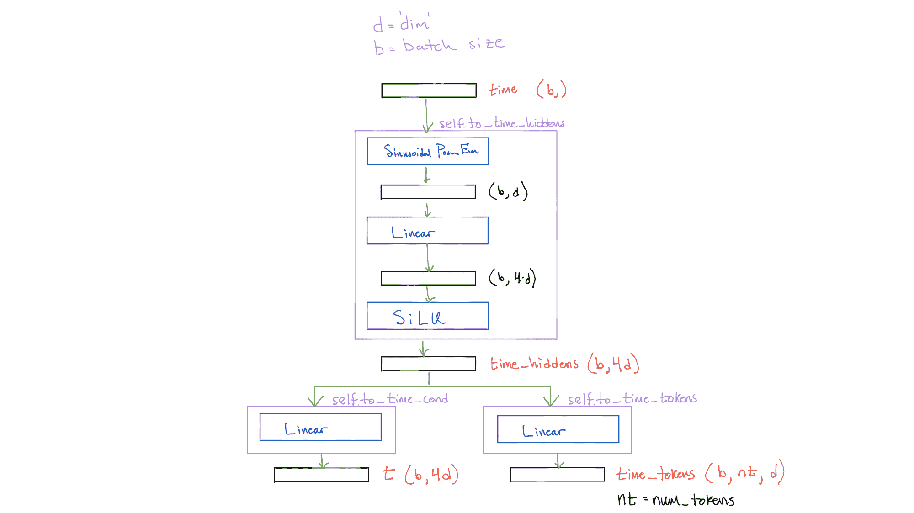**

### **生成文本条件向量**

**现在是时候[生成我们的**文本条件**](https://github.com/AssemblyAI-Examples/MinImagen/blob/0f305c29922274e1faefe9e93be441fdb7ed0efa/minimagen/Unet.py#L536) 对象了。从我们的文本编码器中，我们有两个张量-批处理字幕的**文本嵌入**`text_embeds`，以及**文本掩码**`text_mask`，它告诉我们批处理中每个字幕中有多少单词。这些张量分别为`(b, max_words, enc_dim)`和`(b, max_words)`大小，其中`max_words`为该批最长字幕中的字数，`enc_dim`为文本编码器的编码维数。**

**在这一点上，我们还结合了[无分类器制导](https://www.assemblyai.com/blog/how-imagen-actually-works/#classifier-free-guidance)；因此，给定所有的移动部件，让我们看一个可视化的例子来理解在高层次上发生了什么。下面的[图](https://raw.githubusercontent.com/AssemblyAI-Examples/MinImagen/maimg/conditioning_diagram.png)再次总结了所有的计算。**

#### **视觉示例**

**让我们假设我们有三个标题- ' *一个非常大的红色房子*'、*一个男人*'和'*一只快乐的狗*。我们的文本编码器提供以下功能:**

**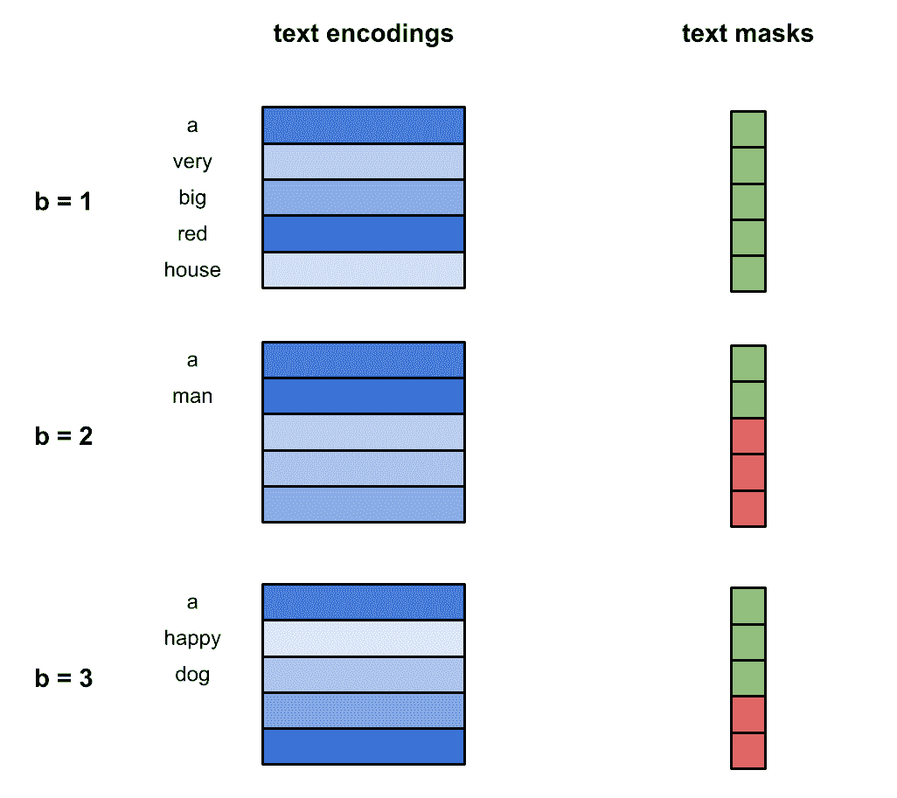**

**我们将嵌入向量投影到更高的维度(更大的水平宽度)，并将掩码和嵌入张量(垂直方向上的额外条目)填充到标题中允许的最大字数，**一个我们选择的值**，此处设为 6:**

**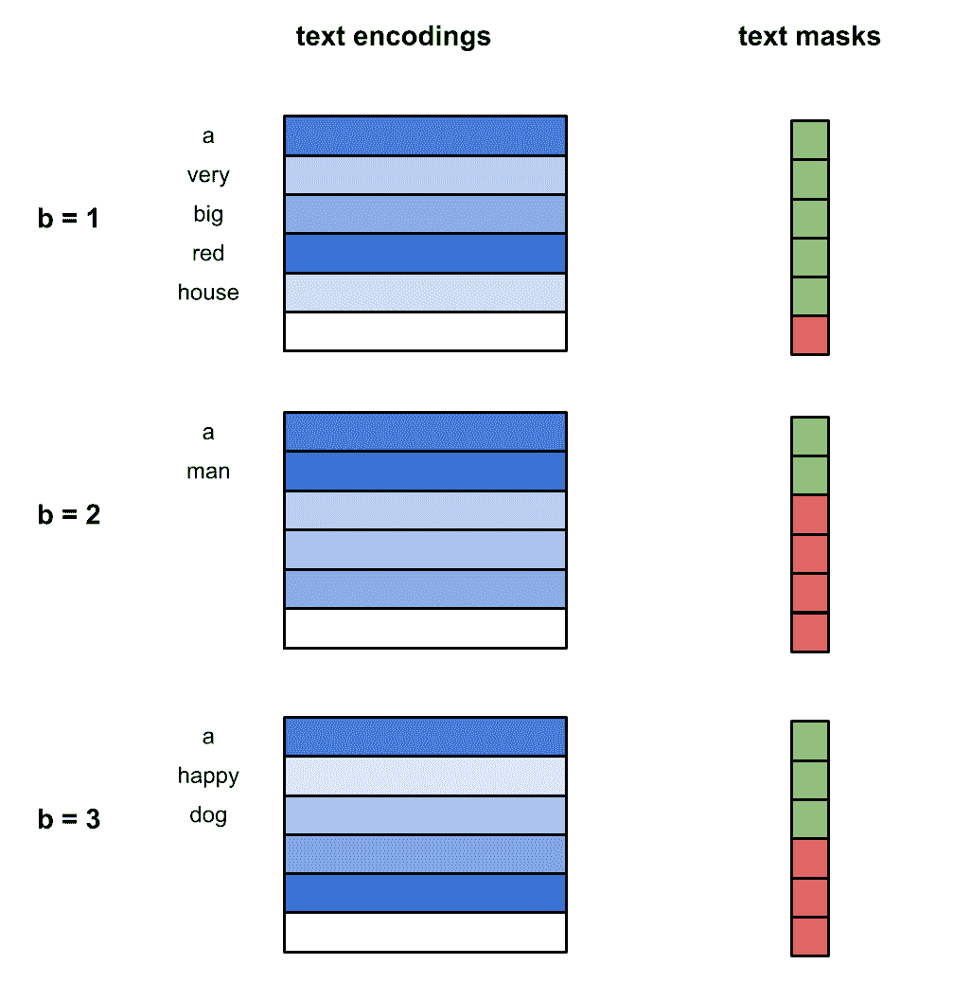**

**从这里开始，我们通过*随机决定以固定概率丢弃哪些批次实例*来合并 **[无分类器指导](https://www.assemblyai.com/blog/how-imagen-actually-works/#classifier-free-guidance)** 。让我们假设最后一个实例被删除，这是通过改变文本掩码实现的。**

**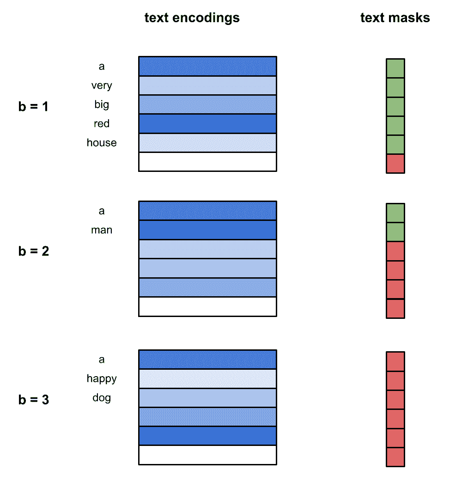**

**继续进行无分类器引导，我们生成空向量用于丢弃的元素。**

****

**我们将文本掩码为红色的地方的编码替换为 NULL:**

**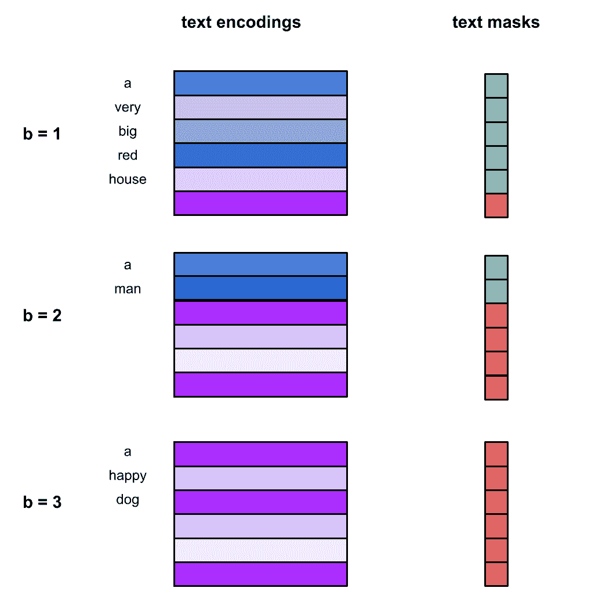**

**为了获得最终的主条件记号`c`，我们简单地将上面生成的`time_tokens`连接到这些文本条件张量。沿着 num_tokens/word 维度发生连接，以留下形状`(b, NUM_TIME_TOKENS + max_text_len, cond_dim)`的最终主要条件表征。**

**最后，我们还指跨越单词维度的池，以获取形状为`(b, cond_dim)`的张量，然后投影到时间条件向量维度，以产生形状为`(b, 4*cond_dim)`的张量。在根据无分类器指导向量沿着批维度丢弃必要的实例之后，我们**将** this 添加到`t`以获得最终的时间步长调节`t`。**

#### **对应代码**

**这些操作对应的代码有点繁琐，只是重复/实现了上面的过程，这里就省略代码了。请随意查看源代码中的`[Unet._text_condition](https://github.com/AssemblyAI-Examples/MinImagen/blob/0f305c29922274e1faefe9e93be441fdb7ed0efa/minimagen/Unet.py#L536)`方法，探索这个函数是如何实现的。下图总结了整个条件生成过程，因此可以在新标签中随意打开[这张图片](https://raw.githubusercontent.com/AssemblyAI-Examples/MinImagen/maimg/conditioning_diagram.png)，并在浏览代码时直观地跟随，以便保持方向感。**

**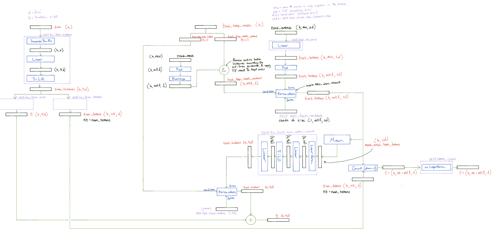

(this image is compressed - see a full resolution version [here](https://raw.githubusercontent.com/AssemblyAI-Examples/MinImagen/maimg/conditioning_diagram.png))** 

### **构建 U-Net**

**现在我们有了我们需要的两个条件张量——通过注意力应用的主条件张量`c`和通过加法应用的时间条件张量`t`——我们可以继续定义 U-Net 本身。如上所述，我们继续检查`Unet`的`[forward](https://github.com/AssemblyAI-Examples/MinImagen/blob/0f305c29922274e1faefe9e93be441fdb7ed0efa/minimagen/Unet.py#L354)`方法，根据需要在`__init__`中引入对象。**

#### **初始卷积**

**首先，我们需要执行一个[初始卷积](https://github.com/AssemblyAI-Examples/MinImagen/blob/0f305c29922274e1faefe9e93be441fdb7ed0efa/minimagen/Unet.py#L168)，以将我们的输入图像转换为网络的预期通道数。我们利用`[minimagen.layers.CrossEmbedLayer](https://github.com/AssemblyAI-Examples/MinImagen/blob/0f305c29922274e1faefe9e93be441fdb7ed0efa/minimagen/layers.py#L254)`，它本质上是一个初始层。**

**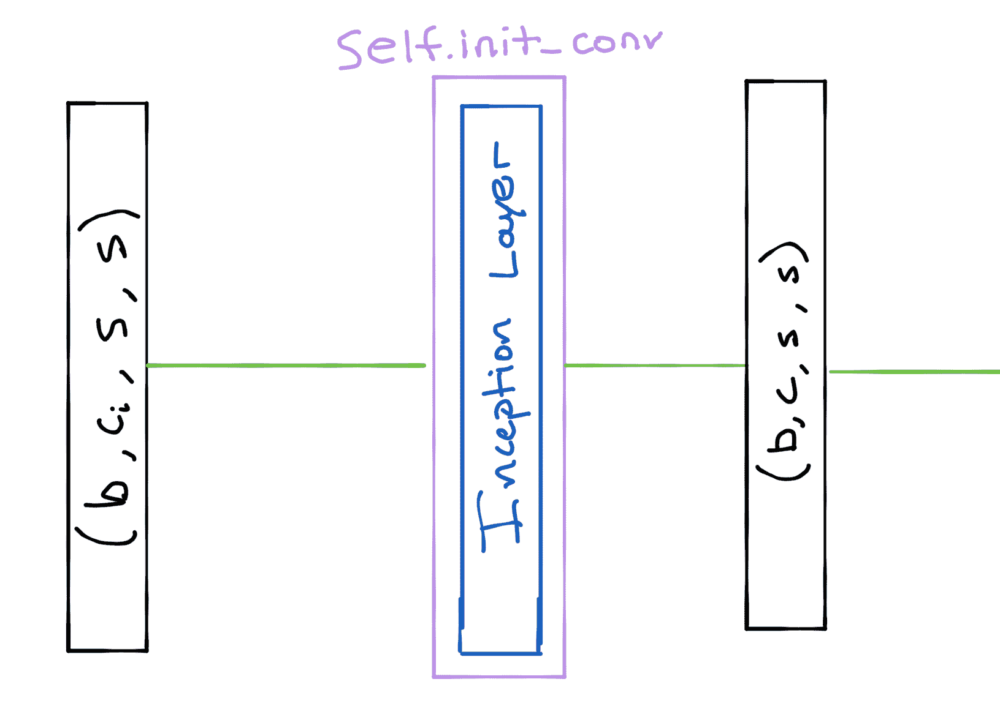**

```py
`class Unet(nn.Module):
    def __init__(self, *args, **kwargs):
    	# ...
        self.init_conv = CrossEmbedLayer(channels, dim_out=dim, kernel_sizes=(3, 7, 15), stride=1)

    def forward(self, *args, **kwargs):
    	# ...
        x = self.init_conv(x)`
```

#### **初始 ResNet 块**

**接下来，我们将图像传递到 U-Net 这一层的初始 ResNet 块(`[minimagen.layers.ResnetBlock](https://github.com/AssemblyAI-Examples/MinImagen/blob/0f305c29922274e1faefe9e93be441fdb7ed0efa/minimagen/layers.py#L371)`)，称为`[init_block](https://github.com/AssemblyAI-Examples/MinImagen/blob/0f305c29922274e1faefe9e93be441fdb7ed0efa/minimagen/Unet.py#L418)`。**

```py
`class Unet(nn.Module):
    def __init__(self, *args, **kwargs):
    	# ...
        self.init_block = ResnetBlock(current_dim, current_dim, cond_dim=layer_cond_dim, time_cond_dim=time_cond_dim, groups=groups)

    def forward(self, *args, **kwargs):
    	# ...
        x = init_block(x, t, c)`
```

**ResNet 块首先通过初始的`[block1](https://github.com/AssemblyAI-Examples/MinImagen/blob/0f305c29922274e1faefe9e93be441fdb7ed0efa/minimagen/layers.py#L412)` ( `[minimagen.layers.block](https://github.com/AssemblyAI-Examples/MinImagen/blob/0f305c29922274e1faefe9e93be441fdb7ed0efa/minimagen/layers.py#L107)`)传递图像，产生与输入大小相同的输出张量。**

**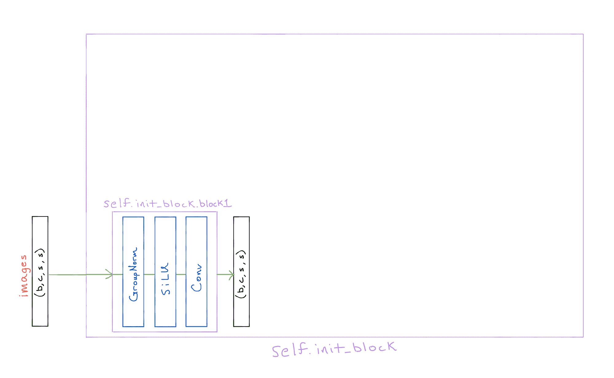**

**接下来，利用主条件标记执行剩余交叉注意(`[minimagen.layers.CrossAttention](https://github.com/AssemblyAI-Examples/MinImagen/blob/0f305c29922274e1faefe9e93be441fdb7ed0efa/minimagen/layers.py#L180)`)**

**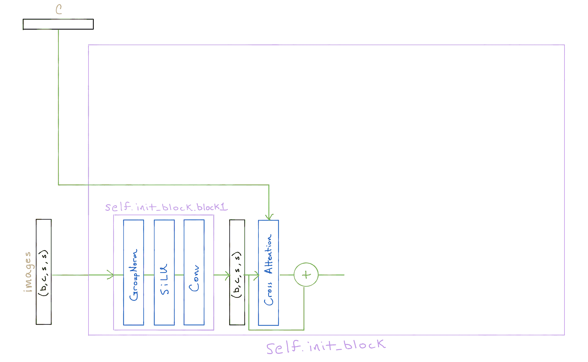**

**之后，我们将时间编码通过一个简单的 [MLP](https://github.com/AssemblyAI-Examples/MinImagen/blob/0f305c29922274e1faefe9e93be441fdb7ed0efa/minimagen/layers.py#L396) 来获得合适的维度，然后将它分成两个大小的`(b, c, 1, 1)`张量。**

**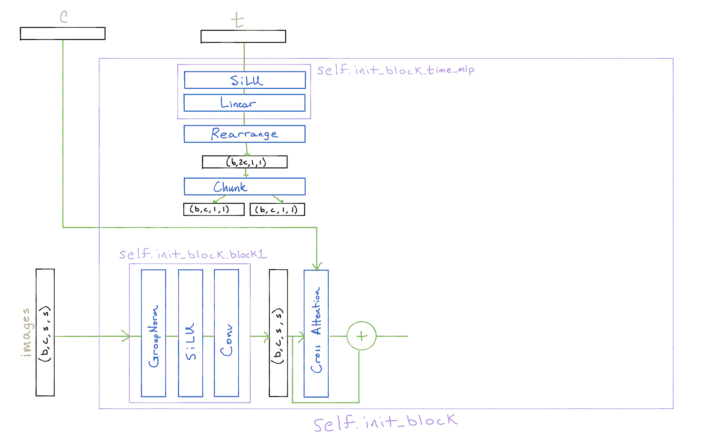**

**我们最后将图像通过另一个与`block1`相同的[卷积模块](https://github.com/AssemblyAI-Examples/MinImagen/blob/0f305c29922274e1faefe9e93be441fdb7ed0efa/minimagen/layers.py#L107)，除了它通过使用时间步长嵌入的[缩放移位](https://github.com/AssemblyAI-Examples/MinImagen/blob/0f305c29922274e1faefe9e93be441fdb7ed0efa/minimagen/layers.py#L140)来合并时间步长信息。**

**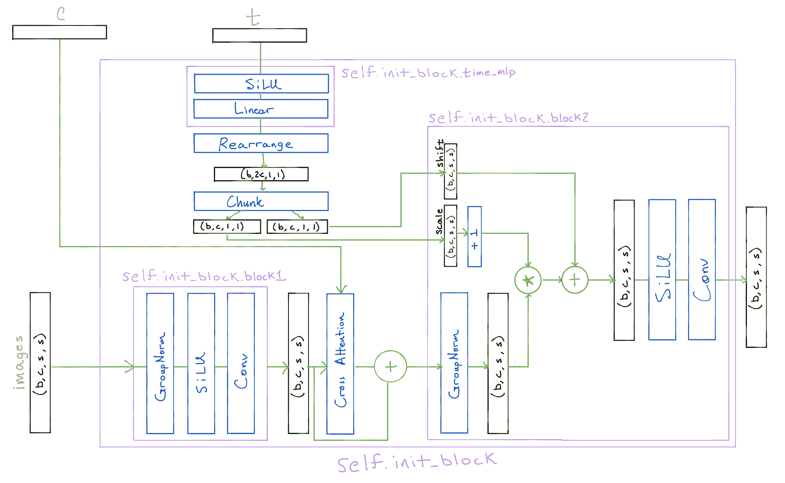**

**`init_block`的最终输出与输入张量具有相同的形状。**

#### **剩余的 ResNet 块**

**接下来，我们让图像通过一系列与`init_block`相同的 [ResNet 块](https://github.com/AssemblyAI-Examples/MinImagen/blob/0f305c29922274e1faefe9e93be441fdb7ed0efa/minimagen/layers.py#L371)，除了它们只在时间步长上进行调节。我们将输出保存在`[hiddens](https://github.com/AssemblyAI-Examples/MinImagen/blob/0f305c29922274e1faefe9e93be441fdb7ed0efa/minimagen/Unet.py#L408)`中，以便稍后跳过连接。**

```py
`class Unet(nn.Module):
    def __init__(self, *args, **kwargs):
    	# ...
        self.resnet_blocks = nn.ModuleList(
                    [
                        ResnetBlock(current_dim, current_dim, time_cond_dim=time_cond_dim, groups=groups)
                        for _ in range(layer_num_resnet_blocks)
                    ]

    def forward(self, *args, **kwargs):
    	# ...
        hiddens = []
        for resnet_block in self.resnet_blocks:
                x = resnet_block(x, t)
                hiddens.append(x)`
```

**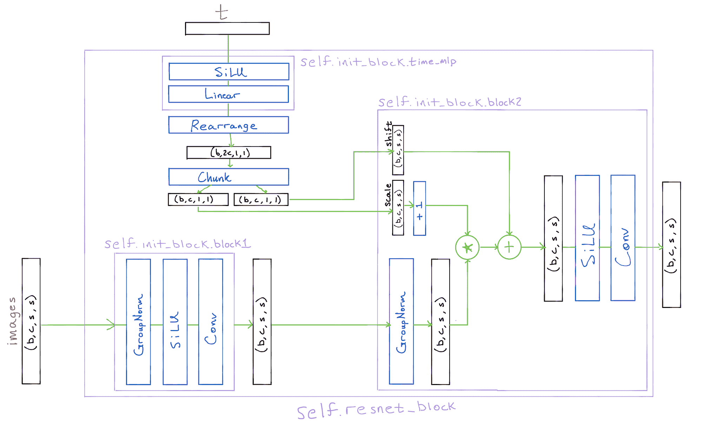**

#### **最终变压器块**

**在使用 ResNet 块进行处理之后，我们可以选择将图像通过一个[转换器编码器](https://github.com/AssemblyAI-Examples/MinImagen/blob/0f305c29922274e1faefe9e93be441fdb7ed0efa/minimagen/Unet.py#L426) ( `[minimagen.layers.TransformerBlock](https://github.com/AssemblyAI-Examples/MinImagen/blob/0f305c29922274e1faefe9e93be441fdb7ed0efa/minimagen/layers.py#L468)`)。**

```py
`class Unet(nn.Module):
    def __init__(self, *args, **kwargs):
    	# ...
        self.transformer_block = TransformerBlock(dim=current_dim, heads=ATTN_HEADS, dim_head=ATTN_DIM_HEAD)

    def forward(self, *args, **kwargs):
    	# ...
        x = self.transformer_block(x)
        hiddens.append(x)`
```

**transformer 块应用多头注意力(下面的紫色块)，然后通过一个`[minimagen.layers.ChanFeedForward](https://github.com/AssemblyAI-Examples/MinImagen/blob/0f305c29922274e1faefe9e93be441fdb7ed0efa/minimagen/layers.py#L148)`层传递输出，这是一系列卷积，它们之间有层规范，它们之间有 GeLU。**

**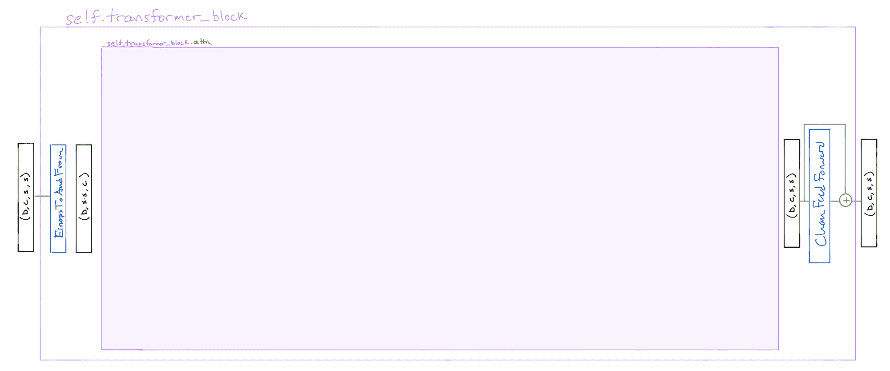** **详图

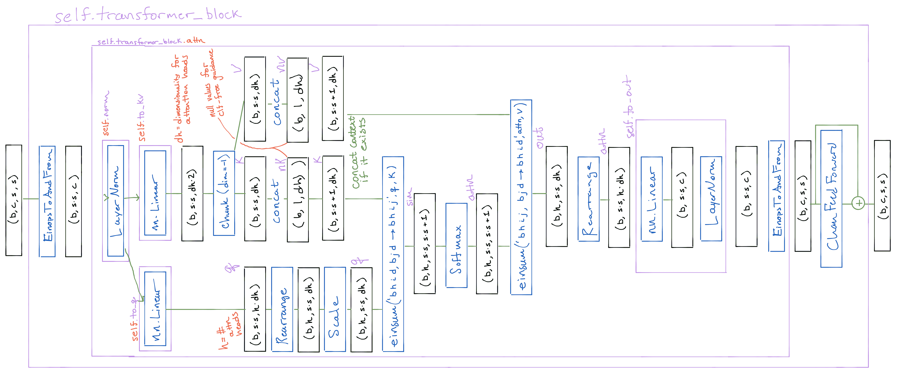** **#### 向下采样

作为 U 网这一层的最后一步，图像被[下采样](https://github.com/AssemblyAI-Examples/MinImagen/blob/0f305c29922274e1faefe9e93be441fdb7ed0efa/minimagen/Unet.py#L430)到空间宽度的一半。

```py
class Unet(nn.Module):
    def __init__(self, *args, **kwargs):
    	# ...
        self.post_downsample = Downsample(current_dim, dim_out)

    def forward(self, *args, **kwargs):
    	# ...
        x = post_downsample(x)
```

其中[下采样操作](https://github.com/AssemblyAI-Examples/MinImagen/blob/0f305c29922274e1faefe9e93be441fdb7ed0efa/minimagen/layers.py#L308)是简单的固定卷积。

```py
def Downsample(dim, dim_out=None):
    dim_out = default(dim_out, dim)
    return nn.Conv2d(dim, dim_out, kernel_size=4, stride=2, padding=1)
```

#### 中间层

对 U 网的每一层重复上述 ResNet 块、(可能的)变换器编码器和下采样序列，直到我们达到最低空间分辨率/最大通道深度。在这一点上，我们[通过另外两个 Resnet 块](https://github.com/AssemblyAI-Examples/MinImagen/blob/0f305c29922274e1faefe9e93be441fdb7ed0efa/minimagen/Unet.py#L436)传递图像，这两个 ResNet 块**在主条件令牌上做**条件(就像每个 ResNet 层的`init_block`)。可选地，我们通过这些块之间的剩余[注意力](https://github.com/AssemblyAI-Examples/MinImagen/blob/0f305c29922274e1faefe9e93be441fdb7ed0efa/minimagen/layers.py#L14)层传递图像。

```py
class Unet(nn.Module):
    def __init__(self, *args, **kwargs):
    	# ...
                self.mid_block1 = ResnetBlock(mid_dim, mid_dim, cond_dim=cond_dim, time_cond_dim=time_cond_dim,
                                      groups=resnet_groups[-1])
        self.mid_attn = EinopsToAndFrom('b c h w', 'b (h w) c',
                                        Residual(Attention(mid_dim, heads=ATTN_HEADS,
                                                           dim_head=ATTN_DIM_HEAD))) if attend_at_middle else None
        self.mid_block2 = ResnetBlock(mid_dim, mid_dim, cond_dim=cond_dim, time_cond_dim=time_cond_dim,
                                      groups=resnet_groups[-1])

    def forward(self, *args, **kwargs):
    	# ...
        x = self.mid_block1(x, t, c)
        if exists(self.mid_attn):
            x = self.mid_attn(x)
        x = self.mid_block2(x, t, c)
```

#### 上采样轨迹

U-Net 的上采样轨迹很大程度上是下采样轨迹的镜像反转，除了我们(a) [在任何给定层的每个 resnet 块之前连接](https://github.com/AssemblyAI-Examples/MinImagen/blob/8445a5aeff34d5f818b9c659d9bd71941533f999/minimagen/Unet.py#L444)来自下采样轨迹的相应跳跃连接，以及(b)我们使用[上采样](https://github.com/AssemblyAI-Examples/MinImagen/blob/0f305c29922274e1faefe9e93be441fdb7ed0efa/minimagen/layers.py#L502)操作而不是下采样操作。这种上采样操作是最近邻上采样，之后是空间尺寸保持卷积

```py
def Upsample(dim, dim_out=None):
    dim_out = default(dim_out, dim)

    return nn.Sequential(
        nn.Upsample(scale_factor=2, mode='nearest'),
        nn.Conv2d(dim, dim_out, 3, padding=1)
    ) 
```

为了简洁起见，这里不再重复上采样轨迹代码，但是[可以在源代码中找到](https://github.com/AssemblyAI-Examples/MinImagen/blob/8445a5aeff34d5f818b9c659d9bd71941533f999/minimagen/Unet.py#L446)。

在上采样轨迹结束时，[最终卷积层](https://github.com/AssemblyAI-Examples/MinImagen/blob/8445a5aeff34d5f818b9c659d9bd71941533f999/minimagen/Unet.py#L326)将图像带到适当的输出通道深度(通常为 3)。

### 摘要

概括地说，在本节中，我们定义了`[Unet](https://github.com/AssemblyAI-Examples/MinImagen/blob/556ce32679903ff59baf0bf0dd890dc5434f51d0/minimagen/Unet.py#L25)`类，它负责定义通过扩散训练的去噪 U-Net。我们首先学习了如何[为给定的时间步长和标题生成条件张量](https://github.com/AssemblyAI-Examples/MinImagen/blob/556ce32679903ff59baf0bf0dd890dc5434f51d0/minimagen/Unet.py#L389)，然后将此条件信息合并到 U-Net 的[正向传递](https://github.com/AssemblyAI-Examples/MinImagen/blob/556ce32679903ff59baf0bf0dd890dc5434f51d0/minimagen/Unet.py#L354)，该传递通过一系列 [ResNet 模块](https://github.com/AssemblyAI-Examples/MinImagen/blob/556ce32679903ff59baf0bf0dd890dc5434f51d0/minimagen/layers.py#L371)和[变压器编码器](https://github.com/AssemblyAI-Examples/MinImagen/blob/556ce32679903ff59baf0bf0dd890dc5434f51d0/minimagen/layers.py#L468)发送图像，以便预测给定图像的噪声成分

## 建筑图像

概括地说，我们已经构建了一个定义和实现扩散过程“元模型”的`[GaussianDiffusion](https://github.com/AssemblyAI-Examples/MinImagen/blob/8445a5aeff34d5f818b9c659d9bd71941533f999/minimagen/diffusion_model.py#L8)`对象，它反过来利用我们的`[Unet](https://github.com/AssemblyAI-Examples/MinImagen/blob/8445a5aeff34d5f818b9c659d9bd71941533f999/minimagen/Unet.py#L25)`类进行训练。现在让我们来看看我们是如何将这些部分组合在一起构建 Imagen 本身的。我们将再次查看 Imagen 中的两个主要功能- `[forward](https://github.com/AssemblyAI-Examples/MinImagen/blob/8445a5aeff34d5f818b9c659d9bd71941533f999/minimagen/Imagen.py#L575)`用于训练，`[sample](https://github.com/AssemblyAI-Examples/MinImagen/blob/8445a5aeff34d5f818b9c659d9bd71941533f999/minimagen/Imagen.py#L424)`用于图像生成，再次根据需要在`__init__`中引入对象。

在`[minimagen.Imagen](https://github.com/AssemblyAI-Examples/MinImagen/blob/main/minimagen/Imagen.py)`中可以找到`[Imagen](https://github.com/AssemblyAI-Examples/MinImagen/blob/556ce32679903ff59baf0bf0dd890dc5434f51d0/minimagen/Imagen.py#L22)`类。点击[此处](#summary-2)，跳转到本节的摘要。

### Imagen 向前传球

Imagen 前向传递包括(1)对训练图像加噪声，(2)用 U-Net 预测噪声分量，然后(3)返回预测噪声和真实噪声之间的损失。

首先，我们随机采样时间步长以对训练图像进行噪声处理，然后对条件文本进行编码，将嵌入和遮罩放置在与输入图像张量相同的设备上:

```py
from minimagen.t5 import t5_encode_text

class Imagen(nn.Module):
    def __init__(self, timesteps):
        self.noise_scheduler = GaussianDiffusion(timesteps=timesteps)
        self.text_encoder_name = 't5_small'

    def forward(self, images, texts):
        times = self.noise_scheduler.sample_random_times(b, device=device)

        text_embeds, text_masks = t5_encode_text(texts, name=self.text_encoder_name)
        text_embeds, text_masks = map(lambda t: t.to(images.device), (text_embeds, text_masks))
```

回想一下，Imagen 有一个生成小图像的**基础**模型和放大图像的**超分辨率**模型。因此，我们需要调整图像的大小，以适合正在使用的 U-Net。如果 U-Net 是一个超分辨率模型，我们还需要将训练图像**首先**缩小到低分辨率条件尺寸**，然后**放大到 U-Net 的适当尺寸。这模拟了在 Imagen 的超分辨率链中将一个 U-Net 的输出上采样到下一个 U-Net 的输入大小(允许后一个 U-Net 以前一个 U-Net 的输出为条件)。

我们还**向低分辨率调节**图像添加噪声，用于[噪声调节增强](https://www.assemblyai.com/blog/how-imagen-actually-works/#robust-cascaded-diffusion-models)，为整批图像选取一个噪声水平。

```py
#...
from minimagen.helpers import resize_image_to
from einops import repeat

class Imagen(nn.Module):
    def __init__(self, timesteps):
    	# ...
        self.lowres_noise_schedule = GaussianDiffusion(timesteps=timesteps)

    def forward(self, images, texts):
    	# ...
        lowres_cond_img = lowres_aug_times = None
        if exists(prev_image_size):
            lowres_cond_img = resize_image_to(images, prev_image_size, pad_mode='reflect')
            lowres_cond_img = resize_image_to(lowres_cond_img, target_image_size, 
            					pad_mode='reflect')

            lowres_aug_time = self.lowres_noise_schedule.sample_random_times(1, device=device)
            lowres_aug_times = repeat(lowres_aug_time, '1 -> b', b=b)

        images = resize_image_to(images, target_image_size)
```

最后，我们计算并返回损失:

```py
#...
from minimagen.helpers import resize_image_to
from einops import repeat

class Imagen(nn.Module):
    def __init__(self, timesteps):
    	# ...

    def forward(self, images, texts, unet):
    	# ...
        return self._p_losses(unet, images, times, text_embeds=text_embeds, 
        			text_mask=text_masks, 
                            	lowres_cond_img=lowres_cond_img, 
                            	lowres_aug_times=lowres_aug_times)
```

让我们来看看`[_p_losses](https://github.com/AssemblyAI-Examples/MinImagen/blob/8445a5aeff34d5f818b9c659d9bd71941533f999/minimagen/Imagen.py#L512)`看看我们是如何计算损失的。

首先，我们使用扩散模型正向过程对输入图像和低分辨率调节图像(如果 U-Net 是超分辨率模型)进行去噪。

```py
#...

class Imagen(nn.Module):
    def __init__(self, timesteps):
    	# ...

    def p_losses(self, x_start, times, lowres_cond_img=None):
    	# ...
        noise = torch.randn_like(x_start)

        x_noisy = self.noise_scheduler.q_sample(x_start=x_start, t=times, noise=noise)

        lowres_cond_img_noisy = None
        if exists(lowres_cond_img):
            lowres_aug_times = default(lowres_aug_times, times)
            lowres_cond_img_noisy = self.lowres_noise_schedule.q_sample(
                            		x_start=lowres_cond_img, t=lowres_aug_times, 
                        		noise=torch.randn_like(lowres_cond_img))
```

接下来，我们使用 U-Net 来**预测噪声图像的噪声成分**，如果 U-Net 用于超分辨率，则除了低分辨率图像之外，还将文本嵌入作为调节信息。 [`cond_drop_prob`](https://github.com/AssemblyAI-Examples/MinImagen/blob/8445a5aeff34d5f818b9c659d9bd71941533f999/minimagen/Unet.py#L376) 给出了[无分类器引导](https://www.assemblyai.com/blog/how-imagen-actually-works/#classifier-free-guidance)的退出概率。

```py
#...

class Imagen(nn.Module):
    def __init__(self, timesteps):
    	# ...
        self.cond_drop_prob = 0.1

    def p_losses(self, x_start, times, text_embeds, text_mask, lowres_cond_img=None):
    	# ...
        pred = unet.forward(
            x_noisy,
            times,
            text_embeds=text_embeds,
            text_mask=text_mask,
            lowres_noise_times=lowres_aug_times,
            lowres_cond_img=lowres_cond_img_noisy,
            cond_drop_prob=self.cond_drop_prob,
        )
```

然后，我们根据`[self.loss_fn](https://github.com/AssemblyAI-Examples/MinImagen/blob/8445a5aeff34d5f818b9c659d9bd71941533f999/minimagen/Imagen.py#L67)`计算实际增加的噪声和 U-Net 预测的噪声之间的损耗，默认为 L2 损耗。

```py
#...

class Imagen(nn.Module):
    def __init__(self, timesteps):
    	# ...
        self.loss_fn = torch.nn.functional.mse_loss

    def p_losses(self, x_start, times, text_embeds, text_mask, lowres_cond_img=None):
    	# ...
        return self.loss_fn(pred, noise) 
```

这就是用 Imagen 得到损失的全部代价！一旦我们建立了扩散模型/U-Net 主干，这是一个相当简单的过程。

### 使用 Imagen 采样

最终，我们想要做的是用 Imagen 进行**采样。也就是说，我们希望能够生成带有文本标题的新颖图像。回想一下上面的内容，这需要计算正向过程的后验均值:**


既然我们已经定义了预测噪声分量的 U 网，我们就有了计算后验均值所需的所有数据。

首先，我们使用 U-Net 的`[forward](https://github.com/AssemblyAI-Examples/MinImagen/blob/556ce32679903ff59baf0bf0dd890dc5434f51d0/minimagen/Unet.py#L354)`(或`[forward_with_cond_scale](https://github.com/AssemblyAI-Examples/MinImagen/blob/556ce32679903ff59baf0bf0dd890dc5434f51d0/minimagen/Unet.py#L473)`)方法获得噪声预测(蓝色)，然后使用之前介绍的 U-Net 的`[predict_start_from_noise](https://github.com/AssemblyAI-Examples/MinImagen/blob/8445a5aeff34d5f818b9c659d9bd71941533f999/minimagen/diffusion_model.py#L147)`方法计算 *x_0* (红色)，该方法执行以下计算:


其中 *x_t* 是噪声图像，ε是 U-Net 的噪声预测。接下来， *x_0* 被[动态阈值化](https://www.assemblyai.com/blog/how-imagen-actually-works/#large-guidance-weight-samplers)，然后与 *x_t* 一起传递到 U-Net(黄色)的 into`[q_posterior](https://github.com/AssemblyAI-Examples/MinImagen/blob/8445a5aeff34d5f818b9c659d9bd71941533f999/minimagen/diffusion_model.py#L87)`方法中，以获得分布平均值。


这整个过程都包含在`Imagen`的`[_p_mean_variance](https://github.com/AssemblyAI-Examples/MinImagen/blob/8445a5aeff34d5f818b9c659d9bd71941533f999/minimagen/Imagen.py#L261)`函数中。

```py
#...

class Imagen(nn.Module):
    def __init__(self, timesteps):
    	# ...
        self.dynamic_thresholding_percentile = 0.9

    def _p_mean_variance(self, unet, x, t, *, noise_scheduler 
    			text_embeds=None, text_mask=None):

        # Get the noise prediction from the unet (blue block)
        pred = unet.forward_with_cond_scale(x, t, text_embeds=text_embeds, text_mask=text_mask)

        # Calculate the starting images from the noise (yellow block)
        x_start = noise_scheduler.predict_start_from_noise(x, t=t, 

        # Dynamically threshold
        s = torch.quantile(
            rearrange(x_start, 'b ... -> b (...)').abs(),
            self.dynamic_thresholding_percentile,
            dim=-1
        )

        s.clamp_(min=1.)
        s = right_pad_dims_to(x_start, s)
        x_start = x_start.clamp(-s, s) / s

        # Return the forward process posterior parameters (green block)
        return noise_scheduler.q_posterior(x_start=x_start, x_t=x, t=t, t_next=t_next)
```

从这里，我们有了从后验样本采样所需的一切，也就是说在扩散过程中“返回一个时间步长”。也就是说，我们试图从以下分布中取样:

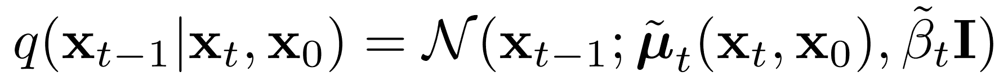

我们在上面看到，从这个分布中取样相当于计算


由于我们用`[_p_mean_variance](https://github.com/AssemblyAI-Examples/MinImagen/blob/8445a5aeff34d5f818b9c659d9bd71941533f999/minimagen/Imagen.py#L261)`计算了后验均值和(对数)方差，我们现在可以用`[_p_sample](https://github.com/AssemblyAI-Examples/MinImagen/blob/8445a5aeff34d5f818b9c659d9bd71941533f999/minimagen/Imagen.py#L329)`实现上面的计算，计算方差的平方根以保证数值稳定性。

```py
class Imagen(nn.Module):
    def __init__(self, timesteps):
    	# ...
        self.dynamic_thresholding_percentile = 0.9

    @torch.no_grad()
    def _p_sample(self, unet, x, t, *, text_embeds=None, text_mask=None):

        b, *_, device = *x.shape, x.device

        # Get posterior parameters
        model_mean, _, model_log_variance = self.p_mean_variance(unet, x=x, t=t, 
        					text_embeds=text_embeds, text_mask=text_mask)

        # Get noise which we will use to calculate the denoised image
        noise = torch.randn_like(x)

        # No more denoising when t == 0
        is_last_sampling_timestep = (t == 0)
        nonzero_mask = (1 - is_last_sampling_timestep.float()).reshape(b, 
        							*((1,) * (len(x.shape) - 1)))

        # Get the denoised image. Equivalent to mean * sqrt(variance) but calculate this way to be more numerically stable
        return model_mean + nonzero_mask * (0.5 * model_log_variance).exp() * noise 
```

此时，我们已经对 Imagen **中的随机噪声输入进行了一个时间步长**的降噪处理。为了生成图像，我们需要在每个时间步长为*做这件事，从在 *t=T* 随机采样的高斯噪声开始，并“及时返回”直到我们到达 *t=0* 。因此，我们使用`[_p_sample_loop](https://github.com/AssemblyAI-Examples/MinImagen/blob/8445a5aeff34d5f818b9c659d9bd71941533f999/minimagen/Imagen.py#L373)`在时间步长上循环运行`[_p_sample](https://github.com/AssemblyAI-Examples/MinImagen/blob/8445a5aeff34d5f818b9c659d9bd71941533f999/minimagen/Imagen.py#L329)`:*

```py
class Imagen(nn.Module):
    def __init__(self, *args, **kwargs):
    	# ...

    @torch.no_grad()
    def p_sample_loop(self, unet, shape, *, lowres_cond_img=None, lowres_noise_times=None, 
    			noise_scheduler=None, text_embeds=None, text_mask=None):

        device = self.device

        # Get starting noisy images
        img = torch.randn(shape, device=device)

	# Get sampling timesteps (final_t, final_t-1, ..., 2, 1, 0)
	batch = shape[0]
        timesteps = noise_scheduler.get_sampling_timesteps(batch, device=device)

	# For each timestep, denoise the images slightly
        for times in tqdm(timesteps, desc='sampling loop time step', total=len(timesteps)):
            img = self.p_sample(
                unet,
                img,
                times,
                text_embeds=text_embeds,
                text_mask=text_mask)

	# Clamp the values to be in the allowed range and potentialy
   	# unnormalize back into the range (0., 1.)
        img.clamp_(-1., 1.)
        unnormalize_img = self.unnormalize_img(img)
        return unnormalize_img
```

`[_p_sample_loop](https://github.com/AssemblyAI-Examples/MinImagen/blob/8445a5aeff34d5f818b9c659d9bd71941533f999/minimagen/Imagen.py#L373)`是我们用 **one unet** 生成图像的方式。Imagen 包含 U-Net 的*链* ，因此，最后，`[sample](https://github.com/AssemblyAI-Examples/MinImagen/blob/8445a5aeff34d5f818b9c659d9bd71941533f999/minimagen/Imagen.py#L424)`函数通过链中的*每个* U-Net 迭代传递生成的图像，并处理其他采样要求，如生成文本编码/掩码、将当前采样的 U-Net 放在 GPU 上(如果可用)等。`[eval_decorator](https://github.com/AssemblyAI-Examples/MinImagen/blob/8445a5aeff34d5f818b9c659d9bd71941533f999/minimagen/helpers.py#L35)`如果不是在调用`sample`时，将模型设置为评估模式。

```py
class Imagen(nn.Module):
    def __init__(self, *args, **kwargs):
    	# ...
        self.noise_schedulers = nn.ModuleList([])
        for i in num_unets:
        	self.noise_schedulers.append(GaussianDiffusion(timesteps=timesteps))

    @torch.no_grad()
    @eval_decorator
    def sample(self, texts=None, batch_size=1, cond_scale=1., lowres_sample_noise_level=None, return_pil_images=False, device=None):
    	# Put all Unets on the same device as Imagen
        device = default(device, self.device)
        self.reset_unets_all_one_device(device=device)

	# Get the text embeddings/mask from textual captions (`texts`)
        text_embeds, text_masks = t5_encode_text(texts, name=self.text_encoder_name)
        text_embeds, text_masks = map(lambda t: t.to(device), (text_embeds, text_masks))

        batch_size = text_embeds.shape[0]

        outputs = None

        is_cuda = next(self.parameters()).is_cuda
        device = next(self.parameters()).device

        lowres_sample_noise_level = default(lowres_sample_noise_level, 
        					self.lowres_sample_noise_level)

		# Iterate through each Unet
        for unet_number, unet, channel, image_size, noise_scheduler, dynamic_threshold in tqdm(
                zip(range(1, len(self.unets) + 1), self.unets, self.sample_channels, 
                	self.image_sizes, self.noise_schedulers, self.dynamic_thresholding)):

	  # If GPU is available, place the Unet currently being sampled from on the GPU
            context = self.one_unet_in_gpu(unet=unet) if is_cuda else null_context()

            with context:
                lowres_cond_img = lowres_noise_times = None
                shape = (batch_size, channel, image_size, image_size)

                # If on a super-res model, noise the previous unet's images for conditioning
                if unet.lowres_cond:
                    lowres_noise_times = self.lowres_noise_schedule.get_times(batch_size, 
                                            			lowres_sample_noise_level,
                          		                 	device=device)

                    lowres_cond_img = resize_image_to(img, image_size, pad_mode='reflect')
                    lowres_cond_img = self.lowres_noise_schedule.q_sample(
                    		x_start=lowres_cond_img,
                    		t=lowres_noise_times,
                    		noise=torch.randn_like(lowres_cond_img))
                    		shape = (batch_size, self.channels, image_size, image_size)

				# Generate an image with the current U-Net
                img = self.p_sample_loop(
                    unet,
                    shape,
                    text_embeds=text_embeds,
                    text_mask=text_masks,
                    cond_scale=cond_scale,
                    lowres_cond_img=lowres_cond_img,
                    lowres_noise_times=lowres_noise_times,
                    noise_scheduler=noise_scheduler,
                )

                # Output the image if at the end of the super-resolution chain
                outputs = img if unet_number == len(self.unets) + 1 else None

        # Return tensors or PIL images
        if not return_pil_images:
            return outputs

        pil_images = list(map(T.ToPILImage(), img.unbind(dim=0)))

        return pil_images
```

### 摘要

概括地说，在本节中，我们定义了`[Imagen](https://github.com/AssemblyAI-Examples/MinImagen/blob/556ce32679903ff59baf0bf0dd890dc5434f51d0/minimagen/Imagen.py#L22)`类，首先检查它的`[forward](https://github.com/AssemblyAI-Examples/MinImagen/blob/556ce32679903ff59baf0bf0dd890dc5434f51d0/minimagen/Imagen.py#L575)`通过哪些噪声训练图像，预测它们的噪声成分，然后返回预测值和真实噪声值之间的平均 L2 损耗。然后，我们看了一下`[sample](https://github.com/AssemblyAI-Examples/MinImagen/blob/556ce32679903ff59baf0bf0dd890dc5434f51d0/minimagen/Imagen.py#L424)`，它用于通过组成 Imagen 实例的 U 网的连续应用来生成图像。

## MinImagen 的培训和样品

MinImagen 可以安装

```py
pip install minimagen
```

MinImagen 包隐藏了上面讨论的所有实现细节，并公开了一个与 Imagen 一起工作的高级 API，在这里记录为。让我们看看如何使用`minimagen`包从 MinImagen 实例中训练和采样。你也可以查看 MinImagen 的 [GitHub repo](https://github.com/AssemblyAI-Examples/MinImagen/blob/main/README.md#usage---command-line) 来查看关于使用提供的脚本进行训练/生成的信息。

### 训练最小值

为了训练 Imagen，我们需要首先执行一些导入。

```py
import os
from datetime import datetime

import torch.utils.data
from torch import optim

from minimagen.Imagen import Imagen
from minimagen.Unet import Unet, Base, Super, BaseTest, SuperTest
from minimagen.generate import load_minimagen, load_params
from minimagen.t5 import get_encoded_dim
from minimagen.training import get_minimagen_parser, ConceptualCaptions, get_minimagen_dl_opts, \
    create_directory, get_model_size, save_training_info, get_default_args, MinimagenTrain, \
    load_testing_parameters
```

接下来，我们使用 GPU(如果有的话)确定将在哪个设备上进行训练，然后实例化一个 MinImagen 参数解析器。当从命令行运行脚本时，解析器将允许我们指定[相关参数](https://github.com/AssemblyAI-Examples/MinImagen#trainpy)。

```py
# Get device
device = torch.device("cuda:0" if torch.cuda.is_available() else "cpu")

# Command line argument parser
parser = get_minimagen_parser()
args = parser.parse_args()
```

现在，我们将创建一个带有时间戳的培训目录，该目录将存储来自培训的所有信息。`create_directory()`函数返回一个[上下文管理器](https://docs.python.org/3/library/contextlib.html)，允许我们临时进入目录读取文件、保存文件等。

```py
# Create training directory
timestamp = datetime.now().strftime("%Y%m%d_%H%M%S")
dir_path = f"./training_{timestamp}"
training_dir = create_directory(dir_path)
```

由于这是一个示例脚本，我们用替代值替换了一些命令行参数，这将降低计算负载，以便我们可以快速训练并查看结果，从而了解 MinImagen 是如何训练的。

```py
# Replace some cmd line args to lower computational load.
args = load_testing_parameters(args)
```

接下来，我们将使用[概念标题](https://ai.google.com/research/ConceptualCaptions/)数据集的子集创建数据加载器。如果您想使用不同的数据集，请查看`[MinimagenDataset](https://github.com/AssemblyAI-Examples/MinImagen/blob/cc470d3354867a2f534bcb0d7206cf466fc91a88/minimagen/training.py#L214)`。

```py
# Replace some cmd line args to lower computational load.
args = load_testing_parameters(args)

# Load subset of Conceptual Captions dataset.
train_dataset, valid_dataset = ConceptualCaptions(args, smalldata=True)

# Create dataloaders
dl_opts = {**get_minimagen_dl_opts(device), 'batch_size': args.BATCH_SIZE, 'num_workers': args.NUM_WORKERS}
train_dataloader = torch.utils.data.DataLoader(train_dataset, **dl_opts)
valid_dataloader = torch.utils.data.DataLoader(valid_dataset, **dl_opts)
```

现在是时候创建将在 MinImagen 的 U 网链中使用的 U 网了。生成图像的基础模型是一个`[BaseTest](https://github.com/AssemblyAI-Examples/MinImagen/blob/cc470d3354867a2f534bcb0d7206cf466fc91a88/minimagen/Unet.py#L695)`实例，放大图像的超分辨率模型是一个`[SuperTest](https://github.com/AssemblyAI-Examples/MinImagen/blob/cc470d3354867a2f534bcb0d7206cf466fc91a88/minimagen/Unet.py#L725)`实例。这些模型被有意设计得很小，这样我们可以快速训练它们，看看如何训练一个 MinImagen 实例。参见`[Base](https://github.com/AssemblyAI-Examples/MinImagen/blob/cc470d3354867a2f534bcb0d7206cf466fc91a88/minimagen/Unet.py#L637)`和`[Super](https://github.com/AssemblyAI-Examples/MinImagen/blob/cc470d3354867a2f534bcb0d7206cf466fc91a88/minimagen/Unet.py#L667)`了解更接近原始 Imagen 实现的模型。

我们加载这些 U-网的参数，然后用一个 list comprehension 实例化实例。

```py
# Use small U-Nets to lower computational load.
unets_params = [get_default_args(BaseTest), get_default_args(SuperTest)]
unets = [Unet(**unet_params).to(device) for unet_params in unets_params]
```

现在我们终于可以实例化实际的 MinImagen 实例了。我们首先指定一些参数，然后创建实例。

```py
# Specify MinImagen parameters
imagen_params = dict(
    image_sizes=(int(args.IMG_SIDE_LEN / 2), args.IMG_SIDE_LEN),
    timesteps=args.TIMESTEPS,
    cond_drop_prob=0.15,
    text_encoder_name=args.T5_NAME
)

# Create MinImagen from UNets with specified imagen parameters
imagen = Imagen(unets=unets, **imagen_params).to(device)
```

为了保持记录，我们为未指定的参数填充默认值，[获得 MinImagen 实例的大小](https://github.com/AssemblyAI-Examples/MinImagen/blob/cc470d3354867a2f534bcb0d7206cf466fc91a88/minimagen/training.py#L584)，然后[保存所有这些信息](https://github.com/AssemblyAI-Examples/MinImagen/blob/cc470d3354867a2f534bcb0d7206cf466fc91a88/minimagen/training.py#L596)等等。

```py
# Fill in unspecified arguments with defaults to record complete config (parameters) file
unets_params = [{**get_default_args(Unet), **i} for i in unets_params]
imagen_params = {**get_default_args(Imagen), **imagen_params}

# Get the size of the Imagen model in megabytes
model_size_MB = get_model_size(imagen)

# Save all training info (config files, model size, etc.)
save_training_info(args, timestamp, unets_params, imagen_params, model_size_MB, training_dir)
```

最后，我们可以使用`[MinimagenTrain](https://github.com/AssemblyAI-Examples/MinImagen/blob/cc470d3354867a2f534bcb0d7206cf466fc91a88/minimagen/training.py#L344)`训练 MinImagen 实例:

```py
# Create optimizer
optimizer = optim.Adam(imagen.parameters(), lr=args.OPTIM_LR)

# Train the MinImagen instance
MinimagenTrain(timestamp, args, unets, imagen, train_dataloader, valid_dataloader, training_dir, optimizer, timeout=30)
```

为了训练实例，将脚本保存为`minimagen_train.py`，然后在终端中运行以下命令:

```py
python minimagen_train.py
```

注意——您可能需要将`python`改为`python3`，和/或将`minimagen_train.py`改为`-m minimagen_train`。

训练完成后，您将看到一个新的[训练目录](https://github.com/AssemblyAI-Examples/MinImagen/blob/main/README.md#user-content-training-directory)，其中存储了训练的所有信息，包括模型配置和重量。要了解如何使用这个培训目录来生成图像，请转到下一部分。

`train.py`

注意，上面的脚本是所提供的[训练](https://github.com/AssemblyAI-Examples/MinImagen/blob/main/train.py)文件的精简版本。你可以在这里阅读更多关于使用这个脚本[训练 MinImagen 实例的信息。](https://github.com/AssemblyAI-Examples/MinImagen/blob/main/README.md#trainpy)

### 用 MinImagen 生成图像

现在我们有了一个“训练过的”MinImagen 实例，我们可以用它来生成图像。幸运的是，这个过程要简单得多。首先，我们将再次执行必要的导入并定义一个参数解析器，这样我们就可以指定包含已训练的极小极大权重的[训练目录](https://github.com/AssemblyAI-Examples/MinImagen/blob/main/README.md#user-content-training-directory)的位置。

```py
from argparse import ArgumentParser
from minimagen.generate import load_minimagen, sample_and_save

# Command line argument parser
parser = ArgumentParser()
parser.add_argument("-d", "--TRAINING_DIRECTORY", dest="TRAINING_DIRECTORY", help="Training directory to use for inference", type=str)
args = parser.parse_args()
```

接下来，我们可以定义我们想要为其生成图像的标题列表。我们现在只指定一个标题。

```py
# Specify the caption(s) to generate images for
captions = ['a happy dog']
```

现在我们要做的就是运行`sample_and_save()`，指定要使用的标题和训练目录，每个标题的图像都会生成并保存。

```py
# Use `sample_and_save` to generate and save the iamges
sample_and_save(captions, training_directory=args.TRAINING_DIRECTORY)
```

或者，您可以加载一个 MinImagen 实例并将它(而不是一个训练目录)输入到`sample_and_save()`，但是在这种情况下，用于生成图像的 MinImagen 实例的信息将不会被保存，所以不建议这样做。

```py
minimagen = load_minimagen(args.TRAINING_DIRECTORY)
sample_and_save(captions, minimagen=minimagen) 
```

就是这样！一旦生成完成，您将看到一个名为`generated_images_<TIMESTAMP>`的新目录，其中存储了用于生成图像的标题、用于生成图像的训练目录以及图像本身。每个图像文件名中的数字对应于用来生成它的标题的索引。

`inference.py`

注意，上面的脚本是所提供的[推理](https://github.com/AssemblyAI-Examples/MinImagen/blob/main/inference.py)文件的精简版本。你可以在这里阅读更多关于使用这个脚本[训练 MinImagen 实例的信息。](https://github.com/AssemblyAI-Examples/MinImagen/blob/main/README.md#inferencepy)

## 最后的话

最先进的文本到图像模型的令人印象深刻的结果不言自明，MinImagen 为理解这种模型的实际工作提供了坚实的基础。要了解更多机器学习内容，请随时查看我们的[博客](https://www.assemblyai.com/blog/)或 [YouTube](https://www.youtube.com/c/AssemblyAI) 频道。或者，在 [Twitter](https://twitter.com/AssemblyAI) 上关注我们，或者关注我们的时事通讯，以便及时了解我们未来发布的内容。

[Follow the AssemblyAI Newsletter](https://assemblyai.us17.list-manage.com/subscribe?u=cb9db7b18b274c2d402a56c5f&id=2116bf7c68)**