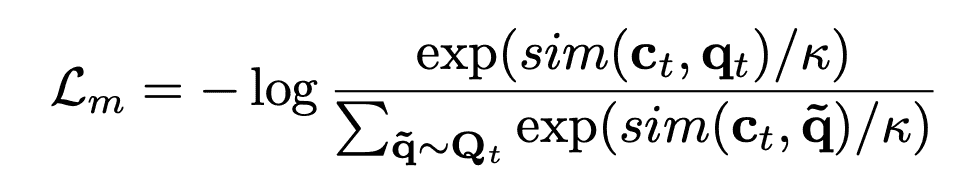
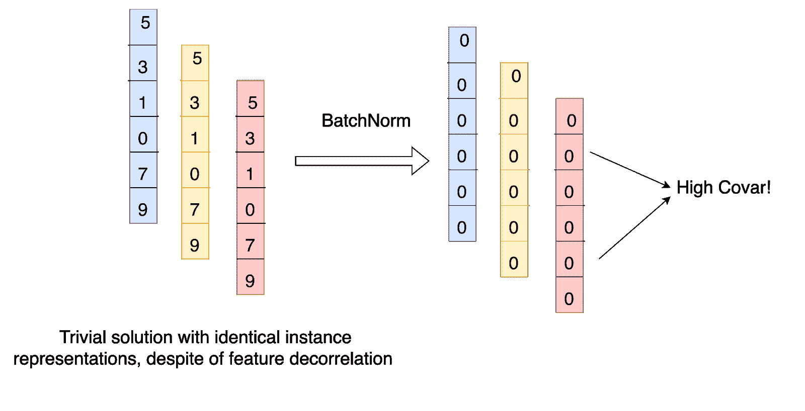
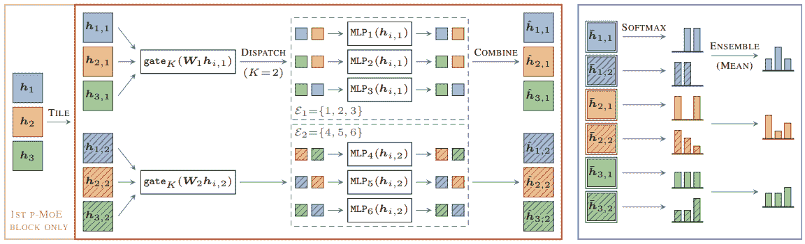

# 深度学习论文摘要-冗余减少和稀疏 moe

> 原文：<https://www.assemblyai.com/blog/deep-learning-paper-recap-redundancy-reduction-and-sparse-moes/>

本周深度学习论文点评是 [*巴洛双胞胎:通过冗余约简的自监督学习*](https://arxiv.org/pdf/2103.03230.pdf) 和 [*稀疏 MoEs 遇见高效系综*](https://arxiv.org/pdf/2110.03360.pdf) *。*

## 巴洛双胞胎:通过冗余减少的自我监督学习

### 这篇论文有什么令人兴奋的地方

大多数自监督学习算法是基于对比学习的，这需要负实例来防止崩溃。

[*Source*](https://arxiv.org/pdf/2103.03230.pdf)

[这篇论文](https://arxiv.org/pdf/2103.03230.pdf)提出了一个优雅、新颖的自我监督学习(SSL)解决方案，不需要负面实例。

这是第一个基于去相关特性而不是实例的 SSL 解决方案。

### 主要发现

Barlow Twins 通过测量两个相同网络的输出之间的互相关矩阵，并使其尽可能接近单位矩阵，自然地避免了崩溃，这两个网络由样本的失真版本馈送。

在巴洛孪晶丢失之前对特征进行批量归一化对于防止崩溃也是至关重要的(编码器为所有图像输出相同的特征)，因为批量归一化会将所有特征减少到 0，这将导致特征之间的高相关性(和高丢失)。

[*Source*](https://arxiv.org/pdf/2103.03230.pdf)

### 我们的外卖

Barlow Twins 是首批基于特征去相关的 SSL 技术之一，其性能优于 SimCLR 等最先进的对比方法。

## 稀疏 moe 满足高效集成

### 这篇论文有什么令人兴奋的地方

混合专家(MoE)是一种神经网络，它在令牌级别使用动态路由来执行大型模型的子图。这使它们能够在保持相同计算要求的同时，拥有比高密度磁盘更多的参数。在每秒浮点运算次数(FLOPS)相同的情况下，与密集模型相比，他们表现出了令人印象深刻的质量提升。有些人把 MoE 称为动态合奏。使用 MoE 和传统模型集合的预测性能之间有什么区别？[本文](https://arxiv.org/pdf/2110.03360.pdf)就此话题展开调查。

下图同时使用了稀疏 MoE 和模型集合。h1、h2 和 h3 是一批中的不同输入，每个模型是一个 MoE，集合中有两个模型。

[*Source*](https://arxiv.org/pdf/2110.03360.pdf)

### 主要发现

稀疏 MoE 和系综具有互补的特征和优点。它们可以一起使用，以实现更高的精度、更强的鲁棒性和更好的校准。这意味着 MoE 不是传统模型预测集合的替代或替换。

他们发现，即使在 MoE 中使用的专家数量增加，通过向静态集合中添加更多的模型也有额外的价值。这个观察结果是令人惊讶的，因为稀疏 MoE 似乎已经包含了静态集合的影响。

### 我们的外卖

在 NLP 建模任务中，稀疏的专家混合已经被证明比密集的专家混合提供了附加值。它们通常具有与它们所取代的密集模型相同的计算成本。乍一看，它们似乎是创建模型集合的一种不同且更有效的方式，这可能导致错误的假设，即进一步的模型集合不会增加多少价值。事实证明并非如此，这两种方法可以结合使用，以获得更高质量的预测。