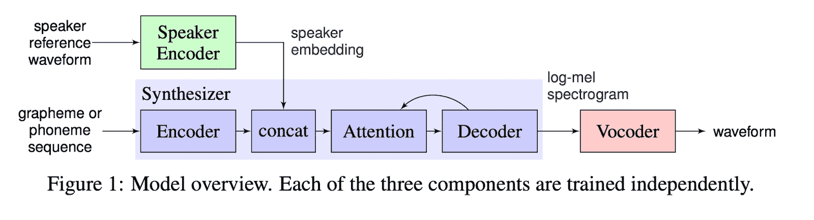

# 深度学习论文摘要-迁移学习

> 原文：<https://www.assemblyai.com/blog/deep-learning-paper-recap-transfer-learning/>

本周的深度学习论文复习是 [*将学习从说话人验证转移到多说话人文本语音合成*](https://arxiv.org/pdf/1806.04558.pdf) *。*

## 从说话人确认到多说话人文本语音合成的迁移学习

### 这篇论文有什么令人兴奋的地方

[本文](https://arxiv.org/pdf/1806.04558.pdf)展示了来自训练集中看不见的说话者的 5 秒音频足以生成高质量的语音克隆。以前最先进的(SOTA)模型需要[几十分钟](https://google.github.io/tacotron/publications/speaker_adaptation/)。

研究人员将扬声器编码器和 TTS(文本到语音)网络解耦，这降低了每一步的数据质量要求，并实现了零触发学习。旧的 TTS 管道通常是端到端的，需要高质量的标记说话人音频数据，并且不能很好地概括训练中没有看到的说话人声音。

### 主要发现

通过在说话人验证任务中以自我监督的方式在大的未标记音频数据的训练数据集上进行训练，说话人编码器网络学习生成固定维度的说话人嵌入向量，该向量表示从音频内容中抽象出的说话人语音的特征。

然后，该说话者嵌入被馈送到与用户输入文本嵌入连接的标准 TTS 管道中，在最终的声码器网络将其转换为波形之前，在此将其转换为 log-mel 频谱图。

以前的端到端流水线需要带有说话者和转录标签的标记音频数据来训练，但是通过分离说话者编码器网络和 TTS 流水线，说话者编码器网络只需要未标记的音频数据来训练，TTS 流水线只需要转录的音频数据(没有说话者信息)来训练，这两者都比前者丰富得多。

[*Source*](https://arxiv.org/pdf/1806.04558.pdf)

[https://www.youtube.com/embed/0sR1rU3gLzQ?feature=oembed" frameborder="0" allow="accelerometer; autoplay; clipboard-write; encrypted-media; gyroscope; picture-in-picture" allowfullscreen="" title="Google's AI Clones Your Voice After Listening for 5 Seconds! 🤐](https://www.youtube.com/embed/0sR1rU3gLzQ?feature=oembed" frameborder="0" allow="accelerometer; autoplay; clipboard-write; encrypted-media; gyroscope; picture-in-picture" allowfullscreen="" title="Google)

### 我们的外卖

通过调整这个管道，例如添加虚拟的说话者嵌入、随机文本生成和音频增强，这种方法可以用来生成无限的高质量标记数据吗？