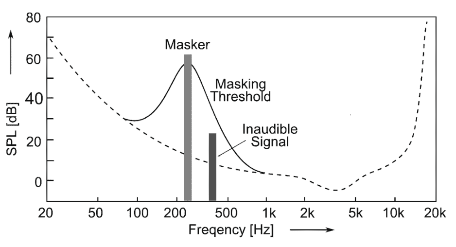
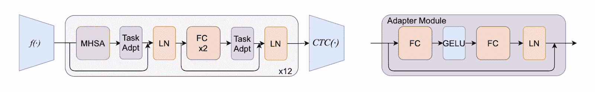

# 深度学习论文摘要-自动语音识别

> 原文：<https://www.assemblyai.com/blog/deep-learning-paper-recap-automatic-speech-recognition/>

本周的深度学习论文摘要是自动语音识别的 [*不易察觉、稳健且有针对性的对抗示例*](https://arxiv.org/pdf/1903.10346.pdf) 和 *[自动语音识别的自我监督语音模型的高效适配器转移](https://arxiv.org/abs/2202.03218)*

## 用于自动语音识别的不易察觉的、健壮的和有针对性的对抗示例

### 这篇论文有什么令人兴奋的地方

[这篇论文](https://arxiv.org/pdf/1903.10346.pdf)提出了一种新的方法来生成样本，这些样本不仅是隐形的，而且对空中播放也是鲁棒的。

[*Source*](https://arxiv.org/pdf/1903.10346.pdf)

### 主要发现

生成的这种对立样本具有以下性质:

*   **察觉不到**:被攻击的音频听起来与原始音频极其相似，以至于人类无法区分两者。
*   **健壮**:被攻击的音频即使在空中播放也应该有效。例如，由扬声器播放的音频样本，由麦克风记录，然后提供给模型。

### 我们的外卖

虽然不易察觉的攻击是隐形的，成功率很高，但不易察觉+鲁棒的攻击需要改进，目前只有 50%的成功率。重采样音频似乎削弱了攻击。

## *用于自动语音识别的自监督语音模型的有效适配器转移*

### 这篇论文有什么令人兴奋的地方

为每个下游任务微调预训练的 wav2vec 模型会导致每个任务有一个大模型，部署起来很昂贵。然而，[本文](https://arxiv.org/abs/2202.03218)表明应用适配器减少了在微调过程中需要适应的参数数量。而不是 90%的参数，只需要微调 10%的参数。这使我们能够为每个下游任务重用 90%的参数。

### 主要发现

作者在 wav2vec 模型的每个转换器编码器模块中插入适配器层。在每个适配器层内部，他们先进行线性向下投影，然后进行线性向上投影。他们还增加了跳跃连接。

[Source](https://arxiv.org/abs/2202.03218)

作者用英语语音数据训练了整个模型。然后，他们用法语语音数据进行了两项实验:

*   他们微调了整个网络(95.6%的参数)
*   他们只微调了适配器层(9.2%的参数)

结果以法语测试数据的单词错误率(WER)来衡量。这两个实验表现出相似的性能:

*   40.2% WER 微调孔网
*   39.4% WER 仅微调适配器层

### 我们的外卖

适配器表明，不需要为下游任务微调整个模型。相反，只需对小心插入模型的特定适配器层进行微调就足够了。

使用适配器将允许我们为每个下游任务重用 90%的参数，而不是为每个任务部署一个微调的模型。