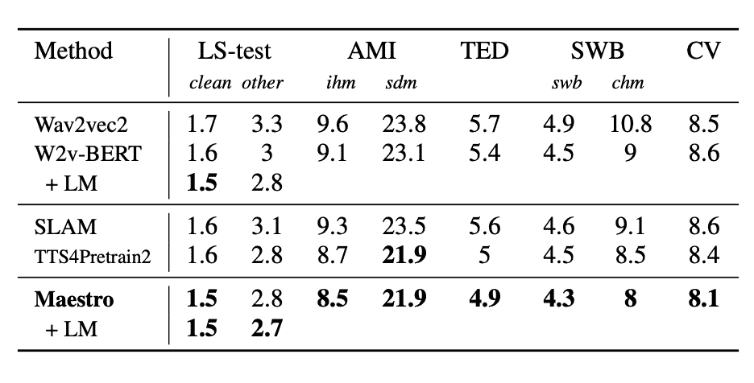
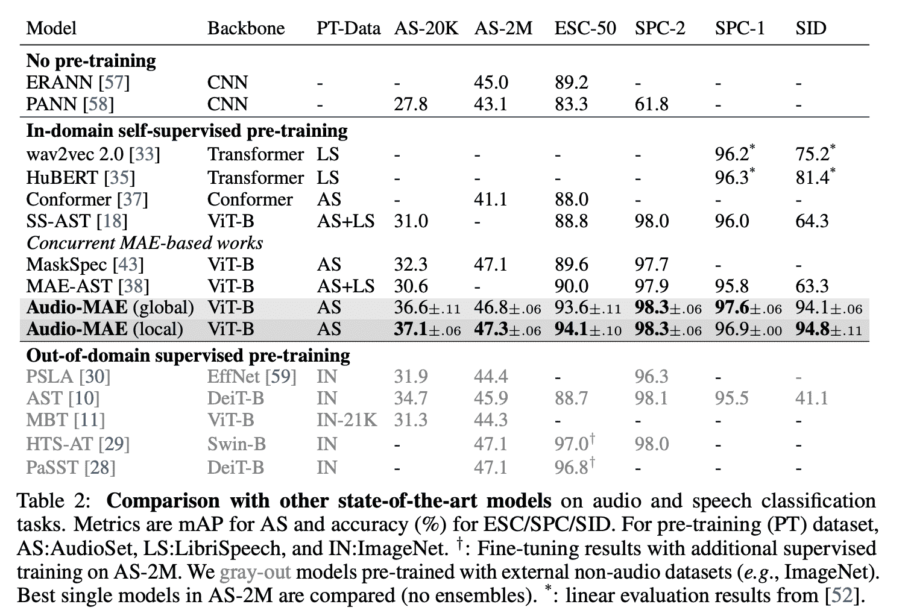

# 深度学习论文摘要-形态匹配和屏蔽自动编码器

> 原文：<https://www.assemblyai.com/blog/deep-learning-paper-recaps-modality-matching-and-masked-autoencoders/>

本周深度学习论文重述的是 [*MAESTRO:通过模态匹配*](https://arxiv.org/pdf/2204.03409.pdf) 和 [*进行匹配的语音文本表示监听*](https://paperswithcode.com/paper/masked-autoencoders-that-listen) *的屏蔽自动编码器。*

## MAESTRO:通过模态匹配匹配语音文本表示

### **这篇论文有什么令人兴奋的地方？**

[本文](https://arxiv.org/pdf/2204.03409.pdf)探索了一种从语音和文本模态中高效学习统一表示的新方法。研究人员提出的方法在 ASR 任务中优于 SOTA。

*Monolingual ASR -* [*Source*](https://arxiv.org/pdf/2204.03409.pdf)

*Multilingual ASR -* [*Source*](https://arxiv.org/pdf/2204.03409.pdf)

### **主要发现**

在该论文中，模态匹配算法学习统一语音和文本表示。它允许我们通过利用纯文本输入来合并词汇信息，并且可以帮助改善单语和多语言设置中的 ASR 性能。

只需要少量的监督数据就可以有效地统一表示。

### **我们的外卖**

学习联合语音和文本表示允许两种模态之间的知识共享。由于纯文本数据更容易收集，它可以帮助提高 ASR 模型的准确性，特别是在低语音资源语言上。

## 监听的屏蔽自动编码器

### **这篇论文有什么令人兴奋的地方？**

在本文中，作者提出了一种新颖的基于图像的音频掩蔽自动编码器扩展。

该模型的工作原理是将 mel 声谱图分割成小块，屏蔽约 80%的小块，然后将未屏蔽的小块传递到编码器，并将所有重新排序的小块传递到解码器。目标是重建整个声谱图，尽管 MSE 损失仅在被掩蔽的面片和它们的基础真值对上计算。

这篇论文证明了自动编码器可以和新颖的对比自我监督学习方法一样好。

*[Source](https://paperswithcode.com/paper/masked-autoencoders-that-listen)*

### **主要发现**

屏蔽自动编码器预训练不仅可以扩展到静态图像，还可以扩展到时间信息，例如音频和视频。极高的修补比率也可能导致质量和偏差设置方面更健壮的模型。

作者还表明，对于言语领域，局部注意力比整体注意力更有效。这可以用光谱图中相邻特征高度相关的事实来解释。

### **我们的外卖**

屏蔽的自动编码器又回来了——它们可以产生与新的对比模型相竞争的结果。高修补率消除了特征过度拟合和偏差，从而使模型对一般特征非常健壮。