# Imagen 的实际工作原理

> 原文：<https://www.assemblyai.com/blog/how-imagen-actually-works/>

当机器学习世界仍在接受今年早些时候发布的 [DALL-E 2](https://www.assemblyai.com/blog/how-dall-e-2-actually-works/) 的令人印象深刻的结果时，谷歌加大了赌注，发布了自己的文本到图像模型 **Imagen，**，这似乎进一步推动了字幕条件图像生成的边界。

上个月刚刚发布的 Imagen 可以在只给出场景描述的情况下生成高质量、高分辨率的图像，而不管这样的场景在现实世界中可能有多么合理或可信。下面你可以看到这些图片的几个例子，下面有相应的标题:

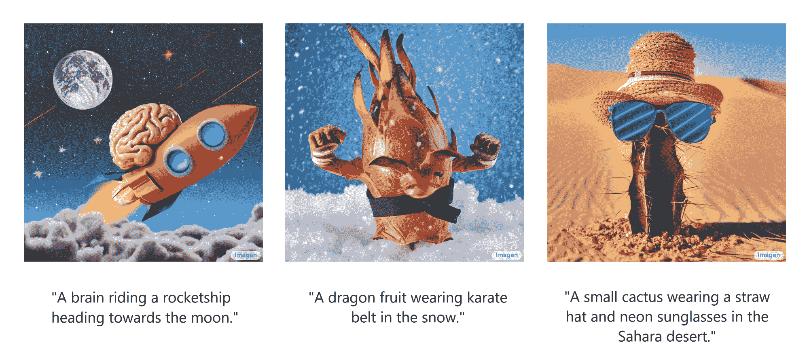

Images created by Imagen given the corresponding captions (adapted from [source](https://imagen.research.google/))

这些令人印象深刻的结果无疑让许多人想知道 Imagen 实际上是如何工作的。在本文中，我们将从几个层面解释 Imagen 是如何工作的。

首先，我们将从**鸟瞰图**来检查 Imagen，以便理解它的高级组件以及它们之间的关系。然后，我们将更详细地讨论这些组件，每个组件都有自己的小节，以便理解它们本身是如何工作的。最后，我们将对 Imagen 进行一次**深度探索**，这是为机器学习研究人员、学生和从业者准备的。

事不宜迟，我们开始吧！

## 介绍

在过去的几年里，机器学习的**文本到图像领域**已经取得了重大进展。文本到图像模型接受场景的简短文本描述，然后生成反映所描述场景的图像。输入描述(或“标题”)和输出图像示例如下所示:

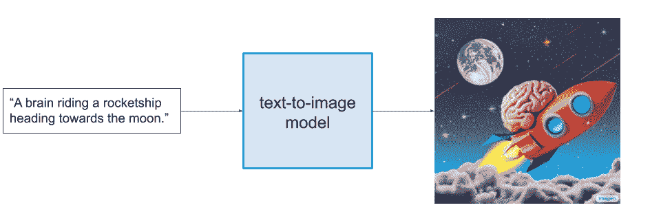

Input and output of a text-to-image model (image and description pulled from [source](https://imagen.research.google/))

值得注意的是，高性能的文本到图像模型将**必然能够以语义上合理的方式组合不相关的概念和对象**。因此，这些模型必须克服一些挑战，比如捕捉空间关系、理解基数，以及正确解释描述中的单词如何相互关联。如果我们更仔细地检查上图中的图像，我们可以看到 Imagen 在这些方面的表现很好。

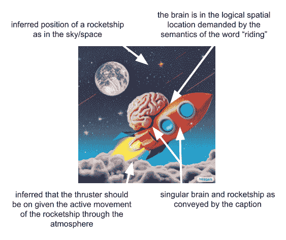

Imagen captures semantic and logical relationship well (image adapted from [source](https://imagen.research.google/))

很难夸大这些模型是多么令人印象深刻。他们没有使用数据库来搜索并返回与描述相匹配的图像，他们甚至没有以一种清晰的方式将预先存在的子图像“缝合”在一起，以使结果与标题相对应。相反，它们生成的**完全是** **新颖**的图像，在视觉上传达了字幕中包含的语义信息。

想学习如何构建 Imagen？

查看我们的 MinImagen 文章，在这篇文章中，我们学习了如何一步一步地构建一个最小的 Imagen 实现，包括一个完整的工作库！

[Check it out](https://www.assemblyai.com/blog/minimagen-build-your-own-imagen-text-to-image-model/)

既然我们了解了什么是文本到图像模型，我们可以从一个鸟瞰图来看看文本到图像模型 **Imagen** 如何工作。

## Imagen 如何工作:鸟瞰

在本节中，我们将了解 Imagen 的主要组件是做什么的，以及它们是如何相互关联的。首先，我们将查看 Imagen 的总体架构，并对其工作原理进行高级解释，然后在下面的小节中更彻底地检查每个组件。

下面是一个简短的视频，概述了 Imagen 的工作原理，并对下面发生的事情进行了细分:

<https://www.assemblyai.com/blog/content/media/2022/06/birds_eye.mp4>

How Imagen works (bird's-eye view)

1.  首先，字幕被输入到**文本编码器**中。这个编码器将文本标题转换成数字表示，然后**将语义信息封装在文本**中。
2.  接下来，图像生成模型通过从噪声或“电视静电”开始创建图像，并慢慢将其转换为输出图像。为了指导这个过程，图像生成模型接收文本编码作为输入，其效果是**告诉模型标题**中有什么，以便它可以创建相应的图像。输出是一个小图像，它直观地反映了我们输入到文本编码器的标题。
3.  然后，小图像被传递到一个**超分辨率模型**，该模型将图像放大到更高的分辨率。该模型还将文本编码作为输入，这有助于模型决定如何表现，因为它“填补了缺失信息的空白”,这些信息必然是由于我们的图像大小翻两番而产生的。结果是一个我们想要的**中等大小的图像**。
4.  最后，这个中等大小的图像然后被传递到另一个超分辨率模型中，这个模型的操作与前一个模型几乎相同，只是这次它将我们的中等大小的图像扩展为高分辨率的图像。结果是 1024 x 1024 像素的图像，直观地反映了标题中的语义。

在最高级别，这就是它的全部！要更详细地了解 Imagen 的每个主要组件，请查看下面的小节。否则，你可以直接跳到[章节深入了解 Imagen 的工作原理，或者直接跳到](https://www.assemblyai.com/blog/how-imagen-actually-works/#how-imagen-works-a-deep-dive)[的最后一句话](https://www.assemblyai.com/blog/how-imagen-actually-works/#final-words)。

### 文本编码器

在这一小节中，我们将仔细看看 **Imagen 的文本编码器**。从上面的视频中我们可以看出，文本编码器对 Imagen 的性能至关重要。它调节 Imagen 的所有其他组件，并负责以一种有用的方式对文本标题进行编码。

Imagen 中的文本编码器是一个 Transformer 编码器。如果你对变形金刚不熟悉，不用担心。这里最重要的细节是，这种编码器确保**文本编码理解标题中的单词如何相互关联**(通过一种称为“自我关注”的方法)。这是**非常重要的**，因为英语通过其句法结构对信息进行编码，从而影响给定句子的语义。

如果 Imagen 只关注单个单词，而不关注它们之间的关系，我们可以获得捕捉字幕单个元素的高质量图像，但不能以适当反映字幕语义的方式描绘它们。我们可以在下面的例子中看到这种差异，在这个例子中，如果不考虑词与词之间的关系，结果会非常糟糕(尽管很好笑):

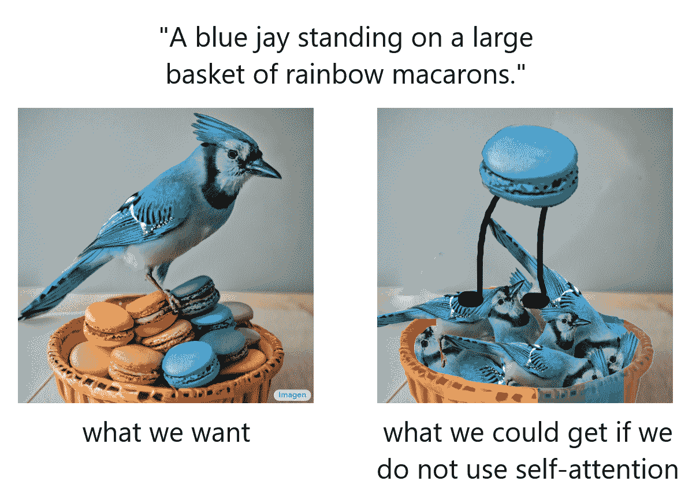

小纸条

虽然上面的例子旨在强调对变压器编码器/自我关注的需要，但结果甚至不如“不正确”的图像好。例如，如果没有理解单词之间句法关系的手段，该模型将不会理解“站立”需要直接和间接宾语，因此将无法正确地描绘这一概念。

文本编码器在训练期间被冻结，这意味着它不会学习或改变它创建编码的方式。只有*和*被用来生成编码，这些编码被提供给模型的其余部分，而**是经过**训练的。

现在，我们对 Imagen 的文本编码器有了更多的了解，让我们看看实际生成图像的组件。

### 图像生成器

文本编码器为 Imagen 的标题输入生成一个有用的表示，但是我们仍然需要设计一个方法来*生成*一个使用这个表示的图像。为了做到这一点，Imagen 使用了一个**扩散模型**，这是一种生成模型，由于它在几个任务上的最先进的性能，近年来获得了极大的欢迎。在继续之前，现在让我们看一下扩散模型的简要回顾。

#### 什么是扩散模型？

扩散模型是一种创建类似于一组训练数据的数据的方法。他们通过添加噪声来破坏训练数据，然后通过逆转这一噪声过程来学习恢复数据。给定一个输入图像，扩散模型将在一系列**时间步长**中用高斯噪声反复破坏图像，最终留下纯高斯噪声，或“电视静态”。

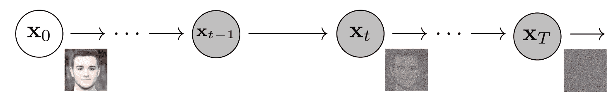

Diffusion Models' iterative noising process (modified from [source](https://arxiv.org/pdf/2006.11239.pdf))

然后，扩散模型将反向工作，学习如何在每个时间步隔离和消除噪声，撤销刚刚发生的破坏过程。

一旦经过训练，模型就可以“一分为二”，我们可以从随机采样的高斯噪声开始，使用扩散模型逐渐去噪，以生成图像。

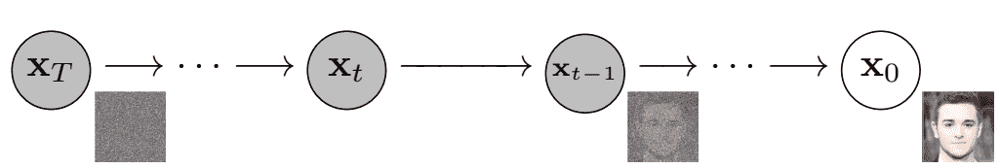

A Diffusion Model starts from noise and "denoises" it to generate images (modified from [source](https://arxiv.org/pdf/2006.11239.pdf))

下面我们可以看到一个从纯高斯噪声生成手写数字的例子:

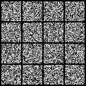

A Diffusion Model can generate novel handwritten digits from Gaussian noise ([source](https://www.assemblyai.com/blog/diffusion-models-for-machine-learning-introduction/))

对于扩散模型的完整处理，请随意查看我们的文章。

[Introduction to Diffusion Models for Machine Learning](https://www.assemblyai.com/blog/diffusion-models-for-machine-learning-introduction/)

#### 字幕条件

总之，训练的扩散模型从高斯噪声开始，然后迭代地生成与其被训练的图像相似的图像。在这一点上可能很明显，我们无法**控制**实际输出什么图像——我们只是将高斯噪声输入到模型中，它就会吐出一个看起来像是属于训练数据集的随机图像。回想一下**我们的目标是创建图像，这些图像封装了我们输入到 Imagen 中的标题**的语义信息，因此我们需要一种将标题合并到扩散过程中的方法。我们如何做到这一点？

回想一下，我们的文本编码器产生了标题的代表性编码。这种“编码”实际上是一系列向量。为了将这种编码信息注入到扩散模型中，我们将这些向量汇集在一起，并以它们为条件建立我们的扩散模型。通过调节这个向量，扩散模型学习如何调整它的去噪过程，以便产生与字幕很好对准的图像。这个过程可以在下面的视频中看到:

<https://www.assemblyai.com/blog/content/media/2022/06/cap_cond.mp4>

Conditioning the image-generation process on the caption.

### 图像超分辨率

图像发生器或“基本”模型输出一个小的 64x64 图像。为了将该模型上采样到最终的 1024×1024 版本，我们使用超分辨率模型来智能地上采样图像。

对于超分辨率模型，Imagen 再次使用扩散模型。整体流程与基础模型基本相同；除此之外，我们不是只对字幕编码进行调节，而是对正在进行上采样的较小图像进行调节。整个过程可以在下面的视频中看到:

<https://www.assemblyai.com/blog/content/media/2022/06/super_res.mp4>

这个超分辨率模型的输出实际上不是我们的最终输出，而是一个*中等*大小的图像。为了将该图像放大到最终的 1024x1024 分辨率，然而*使用了另一个*超分辨率模型。这两种超分辨率架构大致相同，因此我们不会深入讨论第二种超分辨率模型的细节。

**第二超分辨率模型的输出是 Imagen** 的最终输出。

### 摘要

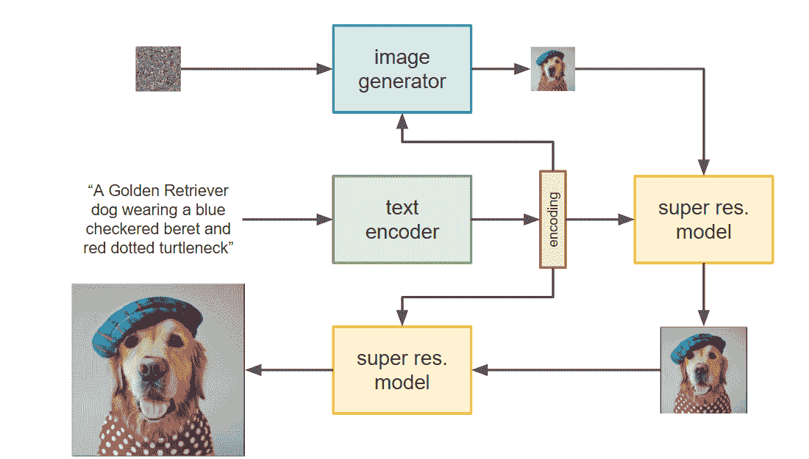

总之，**字幕被输入到预训练和冻结的变压器编码器**中，该编码器输出一系列矢量(文本编码)。这些向量很重要，因为它们对标题中的单词如何相互关联进行编码，并充当模型所有其他组件的条件信息。

文本编码然后被传递到**图像生成扩散模型**，该模型从高斯噪声开始，然后逐渐去除噪声，以生成反映字幕内语义信息的新图像。该模型的输出是 64x64 像素的图像。

在此之后，使用另外两个扩散模型**将该图像超解析为最终的 1024×1024 大小**，再次以文本编码为条件(以及较低分辨率的图像)。

现在我们已经对 Imagen 有了一个大致的了解，我们可以在下一节深入了解细节。或者，可以随意跳到[结果和分析](https://www.assemblyai.com/blog/how-imagen-actually-works/#results-and-analysis)或[最终结果](https://www.assemblyai.com/blog/how-imagen-actually-works/#final-words)。

## Imagen 是如何工作的:深入探讨

在下面的章节中，我们将深入研究 Imagen 的每个组件，突出某些结构特征设计选择逻辑。我们从文本编码器开始。

## 文本编码器

Imagen 中的文本编码器是 Google 在 2019 年发布的语言模型 T5([**T**ext-**T**o-**T**ext**T**transfer**T**transformer](https://arxiv.org/abs/1910.10683))的编码器网络。T5 是一个文本到文本的模型，它通过将许多自然语言处理任务组织成文本到文本的问题，作为这些任务的通用框架。我们可以在下图中看到这种方法的几个例子，其中翻译、句子可接受性确定(cola)、句子相似性估计(stsb)和摘要都是以这种方式进行的。

([source](https://ai.googleblog.com/2020/02/exploring-transfer-learning-with-t5.html))

T5 旨在为任何可以以这种文本到文本的方式转换的 NLP 任务进行微调。

迁移学习概述

回想一下，迁移学习是一种技术，通过这种技术，在大型、多样化和通用的数据集上训练非常大的模型(称为“预训练”)，以便提供具有“通用知识”的基础模型。给定一个任务和相关数据集，然后根据需要修改模型，并在特定于任务的数据集上进行训练(称为“微调”)，使用“一般知识”来更快地学习特定任务。

在计算机视觉领域中，这个过程可以表现为训练自动编码器，以便学习对任何任务都有用的特征图，假设所有对象都由相同的元素组成-边缘、角、纹理、颜色等。一旦学习了这些特征图，就可以提取编码器，并且例如可以在其上构建分类器，然后在特定于任务的数据集上进行训练，利用已经学习的特征提取器，以便更快地学习分类网络，在这种情况下，确定输入图像是否是比萨饼之一。

<video width="700" autoplay="" muted="" loop=""><source src="https://github.com/AssemblyAI-Examples/how-Imagen-actually-works/raw/main/transfer_learning.mp4" type="video/mp4">

### Imagen 为什么用 T5？

一些其他的文本到图像模型，如 DALL-E 2，使用文本编码器，这些编码器根据图像-标题对和一个相关的目标进行训练，该目标是为了链接相同语义概念的文本和视觉表示而明确设计的。这种以图像相邻方式训练的编码器，似乎比不考虑图像域而训练的 NLP 专用文本编码器更自然地映射到文本到图像生成的问题。因此，询问 Imagen 作者为什么选择 T5 作为 Imagen 的文本编码器是明智的。

使用 T5 的主要直觉是**超大型语言模型**，仅仅凭借其庞大的规模，**仍然可以学习有用的表示**，尽管事实上它们并没有明确地接受任何文本/图像任务的训练。除了某些语言模型的规模非常大之外，语言模型在纯文本语料库上训练也是事实，纯文本语料库可能显著大于成对文本/图像的数据集。可以说，用来训练模型的数据集的大小和质量比模型本身的细节更重要。事实上，由于其数据集，T5 的性能与 BERT 相当，即使只有 [25%的训练时间](https://www.youtube.com/watch?v=eKqWC577WlI&t=2480s)。庞大的模型和大规模、多样化的数据集的结合为学习可能在其他领域有用的强大的文本表示留下了大量的空间。

因此，这一选择所解决的核心问题是**在独立于图像生成任务的大规模数据集上训练的大规模语言模型对于非专业文本编码器来说是否是值得的权衡**。Imagen 的作者将赌注压在了大型语言模型上，这一赌注看起来回报不错。

## 图像生成器

如上所述，Imagen 中的图像生成器是一个扩散模型，考虑到他们过去几年令人难以置信的进步，这是一个不足为奇的选择。你可以在上面的中找到扩散模型的简要回顾[，或者查看我们专门的](https://www.assemblyai.com/blog/how-imagen-actually-works/#image-generator)[机器学习扩散模型介绍](https://www.assemblyai.com/blog/diffusion-models-for-machine-learning-introduction/)以获得完整的处理。

假设对扩散模型有了基本的理解，我们现在将探索 Imagen 实现的细节。

### 网络体系结构

扩散模型实际上是一种“元模型”框架，它告诉我们***如何使用*** ***神经模型**对图像去噪。神经模型本身的架构还有待讨论或建立，并且对神经模型的唯一相关限制是其输入和输出维度必须相同。也就是说，图像在扩散过程中不能改变尺寸。*

*考虑到这种限制，作者选择了一种常见的 U-Net 架构，这种架构通常不修改由 [Nichol 和 Dhariwal](https://arxiv.org/pdf/2102.09672.pdf) 实现的架构。我们可以看到 U-Net 的总体架构如下:*

*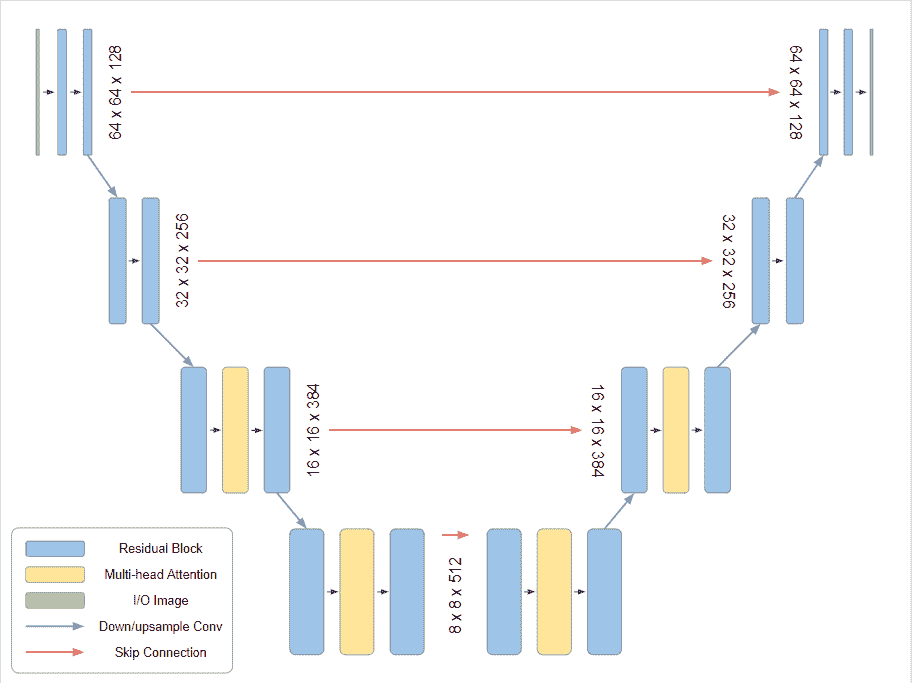

replace* 

*每个残差块由两个子块组成，这些子块中的每一个都依次由批归一化、ReLU 和 3×3 卷积组成。*

*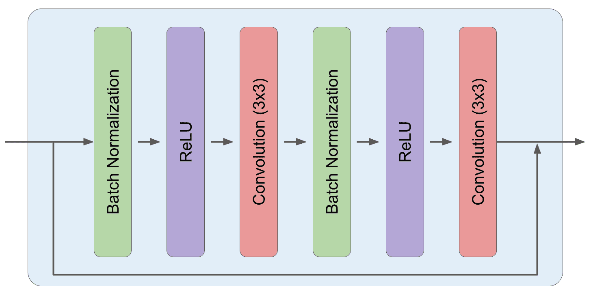*

### *时间步长调节*

*在 Imagen 中(以及通常作为整体的扩散模型)，在每个时间步使用相同的去噪 U-Net。回想一下，在扩散模型中，不同数量的噪声在不同的时间步长被去除。因此，我们必须设计一种方法将时间步长信息注入模型(即时间步长上的*条件*)。Imagen 作者利用了最初的 Transformer 论文中介绍的一种技术，称为**位置编码**。*

 *位置编码-其他详细信息

最初的语言转换器旨在用于句子，在这种上下文中，单词的顺序至关重要；然而，Transformer 编码器对**集合**进行操作，这意味着词序对它们来说并不重要。为了将位置信息注入到变压器中，作者使用了一种巧妙的方法，为每个单词索引生成一个**唯一位置编码向量**，其中位置向量的维数与单词嵌入向量的维数相同。通过将这些位置编码添加到字嵌入中，创建了位置编码的字嵌入，其将位置信息注入到变换器中。

这种现象在下面的视频中被形象化了。很容易看出，尽管单词“really”的两个实例具有相同的单词嵌入，但是由于它们的位置编码向量不同，它们的位置编码单词嵌入是不同的。

<video width="700" autoplay="" muted="" loop=""><source src="https://github.com/AssemblyAI-Examples/how-Imagen-actually-works/raw/main/pos_enc.mp4" type="video/mp4">*  *在 Imagen 中，为每个时间步长生成唯一的**时间步长编码向量**(对应于原始位置嵌入实现中的“单词位置”)。在 U-网中的不同分辨率下，该向量被投影为具有 *c* 分量，其中 *c* 是在该分辨率下 U-网中的通道数量。投影后，向量的每个分量都被添加到图像中相应的通道(跨越其高度和宽度)。

对于具有 8 个通道的 3×3 图像的情况，该过程在下面被可视化:

<https://www.assemblyai.com/blog/content/media/2022/06/time_enc.mp4>

虽然这不是 Imagen 中时间步长调节的确切工作方式，但它非常接近，事实上与其他一些扩散模型注入时间步长信息的方式相同。请注意，*任何*扩散模型都需要某种形式的时间步长编码(至少通常是这样实现的),并且不是 Imagen 独有的。

### 字幕条件

我们还没有将图像标题中的信息整合到扩散模型 U-Net 中，所以我们现在需要这样做。这种字幕调节以两种方式发生。

首先，来自 T5 文本编码器的输出向量被汇集并添加到从上面嵌入的时间步长中。下图显示了这一过程:

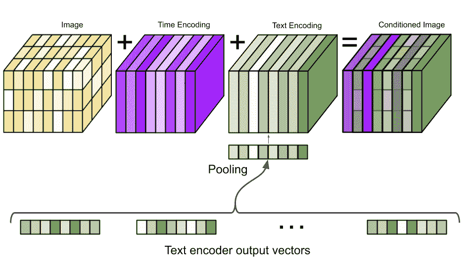

接下来，通过在几个分辨率的文本嵌入上添加交叉注意力，该模型以整个编码序列*为条件。交叉注意通过将文本嵌入序列连接到每个自我注意层的键值对来实现。*

实施细节

此外，我们发现层规范化对于注意力层和池层中的文本嵌入都至关重要。

### 无分类器制导

Imagen 还利用了无分类器的指导。无分类器引导是一种以图像多样性为代价增加扩散模型的图像保真度的方法。该方法如此命名是因为它是用于相同目的的称为分类器指导的先前方法的相关和更简单的版本/扩展。

分类器导航

分类器指导是一种折衷扩散模型生成的图像的保真度和多样性的方法。这种方法需要一个经过训练的分类器模型，用于将扩散过程推向高类别概率的特征区域。也就是说，分类器用于将图像导向分类器自己的模式。

考虑以下等式:

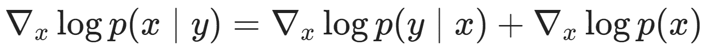

如果 *x* 是图像， *y* 是类别标签，那么我们可以看到类别标签上条件对数概率密度的梯度相当于**无条件**对数梯度**加上分类器对数梯度对应的条件项**。缩放条件项相当于将分类器分布的权重推向其模式，鼓励向更可能用于给定类别的图像的扩散过程。在下面的视频中，你可以看到将高斯(蓝色)的权重推向它的模式如何影响它在几个点(红色)的导数。

<video width="700" autoplay="" muted="" controls="" loop=""><source src="https://github.com/AssemblyAI-Examples/how-Imagen-actually-works/raw/main/class_guide.mp4" type="video/mp4">

如前所述，这种方法的理论成本是多样性，因为将鼓励图像具有给定类别中经常观察到的特征。这种方法的实际成本是:( 1)除了扩散模型之外，还需要训练分类器，以及(2)当条件项被缩放得太高时(“指导权重”太高),图像质量差。

无分类器制导的工作原理是将一个扩散模型同时训练成有条件和无条件的*。为了做到这一点，扩散模型被转换为条件模型，并且用随机丢弃一小部分时间的条件信息来训练(通过用空值替换条件信息)。为了无条件地使用模型，空值只是作为“条件信息”提供给模型。*

*给定这样的模型，无分类器制导通过在推理期间在无条件和有条件梯度之间*插值来松散地工作。通过放大条件梯度的效果(即，使“**指导权重**”大于 1)，可以获得更好的样本:**

*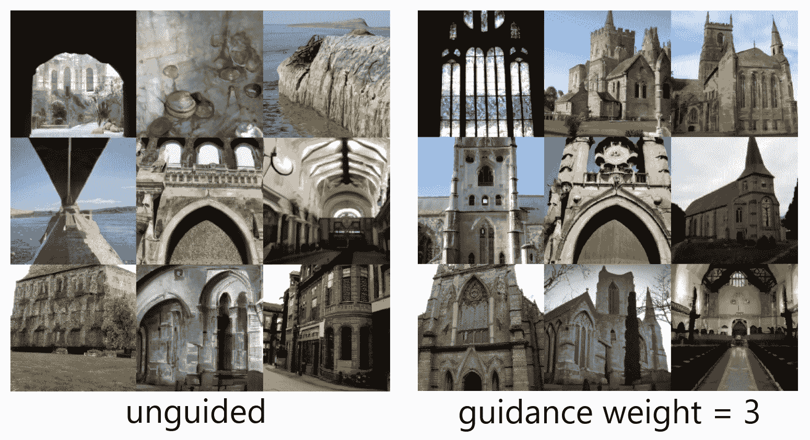

Comparison of unguided and guided GLIDE images generated by the prompt "a religious place" ([source](https://arxiv.org/pdf/2112.10741.pdf))* 

*虽然无分类器导航首先是由 [Ho 和 Salimans](https://openreview.net/pdf?id=qw8AKxfYbI) 引入的，但它很快就被用于 OpenAI 的 [GLIDE](https://arxiv.org/pdf/2112.10741.pdf) 中，以便创建非常高质量(尽管多样性较低)的图像。关于分类器/无分类器导航的大量资源，请查看[这篇](https://benanne.github.io/2022/05/26/guidance.html)文章。*

*根据 Imagen 的论文， **Imagen 非常依赖无分类器指导来进行有效的文本处理**。*

### *大型制导重量取样器*

*无分类器导航是一种非常有效的方法来改善生成图像的字幕对齐，但是[已经](https://arxiv.org/pdf/2112.10741.pdf) [之前](https://arxiv.org/abs/2105.05233) [观察到](https://arxiv.org/abs/2204.06125)极高的导航权重会产生饱和且不自然的图像，从而损害保真度。*

*Imagen 的作者研究了这一现象，发现这是由**训练测试不匹配**引起的。特别地，训练数据的像素值被缩放到范围[-1，1]，但是**高指导权重导致网络输出在给定的时间步长超过这些界限**。更糟糕的是，由于同一个模型在扩散过程中反复应用于其自身的输出，这种效应随着扩散过程的进行而加剧，甚至可能导致发散。*

*高制导权重被发现对于实现最先进的图像质量是至关重要的，因此通过简单地使用较低的制导权重来避免这个问题不是一个选项。相反，作者通过设计两种阈值像素值的方法来解决这个问题- **静态阈值**和**动态阈值**。这些方法解决了上述训练测试不匹配的问题，特别是发现动态阈值对 Imagen 的性能至关重要。*

#### *静态阈值*

*在静态阈值处理中，每个时间步长的像素值被简单地限制在范围[-1，1]内。这个过程可以在下面的例子中看到。*

*为了销售的例子，让我们的像素值正态分布。对这些值应用静态阈值处理意味着像素边界(浅红色区域)之外的任何分布权重对于负值被推至-1，对于正值被推至 1。正如我们所见，随着分布方差的增长，出现极值的概率也在增长。*

*<https://www.assemblyai.com/blog/content/media/2022/06/static_threshold.mp4>

*

*Visualization of static thresholding. Distribution weight outside of the pixel bounds are pushed onto the pixel value extrema.*

*虽然这有一定的缓解效果，但随着制导重量的增加，图像仍然会过饱和，并且不太详细。因此，作者设计了一种更好的阈值分割方法——动态阈值分割法。*

#### *动态阈值*

*利用动态阈值处理，选择某个百分比的绝对像素值。在每个时间步，如果百分点值 *s* 超过 1，则像素值被阈值化为[- *s* 、 *s* ]并除以 *s* 。这个过程可以在下面的视频中看到:*

*<https://www.assemblyai.com/blog/content/media/2022/06/dynamic_threshold.mp4>

*

*Visualization of dynamic thresholding. The distribution has a "gravitational pull" back towards 0, affecting all pixels and not just saturated ones.*

*动态阈值处理具有将所有像素值带回到范围[-1，1]的效果，但是对所有像素进行操作，而不仅仅是那些处于极端的像素。在迭代应用的模型下，有一个回到 0 的“引力”平衡了发散的可能性。*

*作者发现，这种方法导致更好的照片真实感和对准，特别是对于大制导重量。*

#### *比较*

*下面是几个图像，描述了增加三个模型的指导权重的效果——一个是未设定阈值的，一个是静态设定阈值的，一个是动态设定阈值的。每个型号都显示了两个不同的点(“pt1”和“pt2”)，这两个点在不同型号之间是相同的。对于每个模型和每个点，对应于不同的制导重量(唯一的变化)显示几个图像。*

*

As the guidance weight is turned up (down each column), differences in quality can be observed based on thresholding method. (adapted from [source](https://arxiv.org/pdf/2205.11487.pdf#page=20&zoom=100,144,692))* 

*正如我们所看到的，静态阈值处理提高了性能，至少对于高引导权重(即使饱和)产生了合理的图像，不像非阈值处理的图像几乎完全是黑色的。动态阈值处理显著提高了性能，即使在高指导权重下也能产生合理且不饱和的图像。虽然静态和动态阈值处理在低指导权重下产生相似的结果，但是在高指导权重下图像饱和度的差异变得更加明显。当比较两种方法的左栏时，这些差异尤其明显。*

## *超分辨率模型*

*回想一下，图像生成器扩散模型(或“基本模型”)输出 64x64 图像。Imagen 使用两种条件扩散模型将图像分辨率提高到 1024x1024。现在让我们检查这些模型。*

### *中小型架构*

*中小型(STM)超分辨率模型“接受”(取决于)基本模型生成的 64x64 图像，并将其超分辨率为 256x256 图像。STM 模型是另一种扩散模型，并且除了低分辨率图像之外，还取决于字幕编码。交叉注意的实现类似于基本模型。*

*STM 模型的架构是另一个 U-Net，也是像图像生成器一样改编自 [Nichol 和 Dhariwal](https://arxiv.org/abs/2102.09672) 。作者对该模型进行了一些修改，以提高记忆效率、推理时间和收敛速度。他们把这个模型叫做*高效 U 网*，比未修改的版本每秒步数快 2-3 倍。*

 *其他详细信息

高效 U-Net 做了如下修改:

1.  **移动模型参数:**模型参数通过在较低的维度上增加更多的残差块，从高分辨率块向低分辨率块移动。因为这些块具有更多的通道，所以模型容量增加，而没有严重的存储器/计算成本。
2.  **缩放跳过连接:**随着较低分辨率下残余块数量的增加，跳过连接被缩放 1/sqrt(2)以提高收敛速度。
3.  **改变操作顺序:**在下采样块中，它们改变下采样和卷积操作的顺序，使得卷积在下采样操作之后发生，对于上采样块反之亦然。这在不降低性能的情况下提高了向前传球的速度。*  *### 中型到大型架构

中到大(MTL)超分辨率模型将 STM 模型生成的 256x256 图像超分辨率为 1024x1204 图像。MTL 模型非常类似于 STM 模型，是以字幕编码和 STM 输出图像为条件的扩散模型。

除了移除了自我关注层之外，该架构通常类似于 STM 模型。由于该模型中没有自我注意层，与基本模型和 STM 模型相比，增加了明确的交叉注意层来关注文本嵌入。

### 稳健的级联扩散模型

Imagen 在超分辨率模型中使用噪声调节增强，以使它们意识到添加的噪声量。这种调节提高了样本质量和模型处理由较低分辨率模型产生的伪影的能力。**作者发现这种方法对于生成高保真图像至关重要**。

噪声调节增强通过用高斯噪声破坏超分辨率模型所基于的低分辨率图像，然后根据破坏噪声水平调节超分辨率模型来工作。在训练期间，随机选择破坏噪声水平或“增强水平”，而在推断期间，该值被扫描以找到最佳样本质量。

这些过程的伪代码可以在下面看到，其中作者使用了 JAX 软件包。

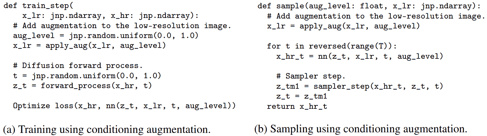

([source](https://arxiv.org/pdf/2205.11487.pdf#page=44&zoom=100,144,324))

想知道这个伪代码为什么说`jnp`？

这是谷歌的 JAX 包，它越来越受机器学习的欢迎！看看下面我们对 JAX 的概述。

[Check it out](https://www.assemblyai.com/blog/why-you-should-or-shouldnt-be-using-jax-in-2022/)

## 深度潜水总结

总的来说，输入字幕被送入 T5 编码器，该编码器在训练期间被冻结。文本编码以基本扩散模型为条件，该模型使用具有低分辨率的自我关注层的 U-Net 来生成图像。文本编码调节通过添加到时间步长调节张量(“位置编码”)以及通过键值连接到自我注意层的交叉注意来发生。实现了动态阈值和无分类器引导。

在生成基本模型图像之后，它通过两个以上的扩散模型以获得超分辨率，除了时间步长和文本编码的条件之外，扩散模型还以它们正在上采样的图像为条件。这些模型使用噪声调节增强来提高质量和消除伪像。

结果是与输入标题匹配的 1024x1024 图像。

## 结果和分析

### 数量的

COCO 是一个用于评估文本到图像模型的数据集，FID 用于测量图像保真度，CLIP 用于测量图像字幕对齐。作者发现 **Imagen 在 COCO 上实现了 7.27** 的最新零拍 FID，超过了 DALL-E 2，甚至超过了在 COCO 上接受过*训练*的模特。

### 定性的

作者指出，FID 和 CLIP 都有局限性。FID 与人类感知质量不完全一致，CLIP 在计数方面无效。因此，他们使用人工评估来评估质量和字幕相似性，从 COCO 验证集中随机选择 200 个真实字幕图像对作为基线。受试者分批观看 50 张这样的图片。

质量管理

还使用了交错的“对照”试验，并且只有当评价人正确回答了至少 80%的对照问题时，才包括评价人数据。这为每幅图像的图像质量获得了 73 个评级，为每幅图像的图像标题对齐获得了 51 个评级。

#### 质量

为了探究 Imagen 生成的图像的质量，要求人类评价者使用问题“*在 Imagen 生成的图像和参考图像之间进行选择，哪个图像更逼真(看起来更真实)？*”。报告了评分者选择 Imagen 生成的图像而不是参考图像的次数百分比，称为**偏好率**。

Imagen 获得了 39.2%的真实感偏好率。

#### 标题相似度

为了探究图像-标题对齐，给评定者看一幅图像和一个标题，并问“*标题是否准确地描述了上面的图像？*”。评定者必须回答“*是*”、“*有点*”或“*否*”。响应分别被评分为 100、50 和 0，并且对于模型样本和参考图像独立获得，两者都被报告。

**作者发现 Imagen 与原始参考图像的字幕相似度不相上下**。

#### 拉丝机

注意到 COCO 的几个缺点，作者还介绍了 **DrawBench** -一组全面而富有挑战性的提示，旨在支持文本到图像模型的评估和比较。

下面显示了 Imagen 与 DALL-E 2、GLIDE、VQGAN+CLIP 和 Laten Diffusion 在拉丝设备上的比较结果，其中条形高度对应于图像保真度和对齐度的用户偏好率(95%置信区间)。**显而易见，Imagen 优于所有其他型号**。

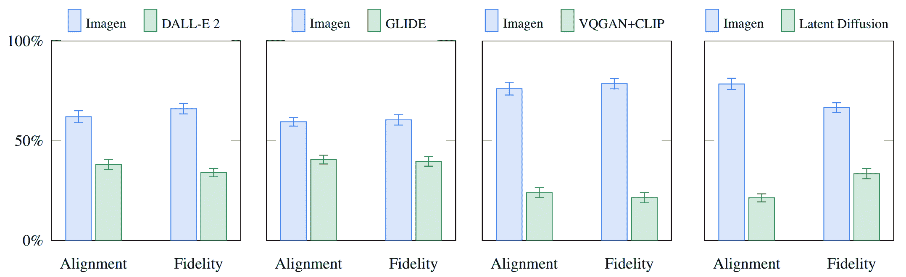

### 为什么 Imagen 比 DALL-E 2 好？

准确回答*为什么* Imagen 比 DALL-E 2 好很难；然而，性能差距的一个不可忽视的部分似乎源于两种模型对标题/提示编码方式的差异。

DALL-E 2 使用对比目标来确定文本编码与图像(本质上是剪辑)的相关程度。文本和图像编码器调整它们的参数，使得相似字幕-图像对的余弦相似性最大化，而不同字幕-图像对的余弦相似性最小化。虽然这个目标在文本到图像领域非常直观，特别是在反映 DALL-E 2 中先验子模型的使用时，但是它有什么缺点呢？我们看到三种可能的选择。

#### 纯粹的尺寸

很有可能，性能差距的一个显著部分源于这样一个事实，即 Imagen 的文本编码器比 DALL-E 2 的大得多，并且根据更多的数据进行训练。作为这一假设的证据，我们可以在文本编码器按比例增加时检查 Imagen 的性能。下面我们看到 Imagen 性能的帕累托曲线，它是编码器尺寸和 U-Net 尺寸的函数。

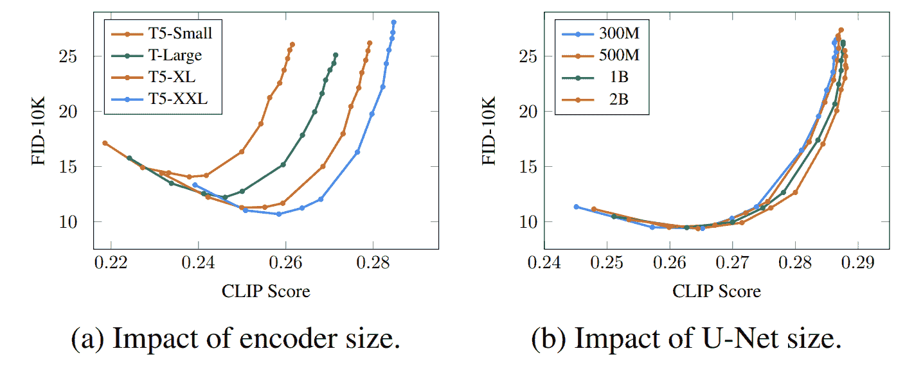

放大文本编码器的效果高得惊人，放大 U-Net 的效果低得惊人。这一结果表明，相对简单的扩散模型可以产生高质量的结果**，只要它们以强大的编码为条件**。

鉴于 T5 文本编码器比剪辑文本编码器大得多，再加上自然语言训练数据必然比图像-字幕对更丰富，性能差距很大程度上可能归因于这种差异，Imagen 作者注意到了这一事实。

#### 图像编码器拐杖

在剪辑训练期间，文本编码器和图像编码器都被调整以满足目标函数的要求。为了满足这些需求，这些模型中的每一个在多大程度上被调整是有一定自由度的。特别是，CLIP 中的图像编码器可能比文本编码器更快地学会产生更丰富的编码，以适应文本编码器相对较低的性能。这将具有降低整体损失的效果，但同时作为文本编码器的支柱。这种依赖可能会降低文本编码器的表达能力，导致在用于 DALL-E 2 时性能下降。

这个观察有些不直观。剪辑产生了一个空间，在这个空间中，相同概念的文本和视觉表现被理解并与 DALL-E 2 中的先验映射。另一方面，在 Imagen 中，将文本编码映射到视觉概念的责任落在了图像生成器的肩上。然而，在 DALL-E 2 中，先验的弱化“起点”可能会降低先验的有效性，这最终会传播到图像生成子模型。

#### 不同数据点中的相似概念

剪辑文本编码方法的下一个潜在缺点是，最大化对应字幕图像对的余弦相似性同时最小化不同字幕图像对的余弦相似性的总体目标*没有考虑不同数据点*中的相似概念。特别是，如果两个字幕非常相似，它们将被正确地映射到相似的矢量上，**，但是剪辑物镜将把这些矢量推开**。更糟糕的是，它们将被推得离得一样远，就像它们中的任何一个与一个高度不相似的字幕向量在一起一样远。根据训练数据集的性质，这种损失有可能削弱已学习的编码。鉴于文本编码对文本到图像扩散模型的重要性，这种行为可能会削弱生成图像的质量。

虽然这些因素中的任何一个都可能导致性能差距，但 Imagen 的其他实施细节肯定与我们的分析相关，其中一些在下面的“关键要点”部分列出。

### 关键要点

除了上面关于 DALL-E 2 的说明，作者还列出了 Imagen 的几个关键要点，包括:

1.  **缩放文本编码器非常有效**
2.  **缩放文本编码器比 U-Net 尺寸更重要**
3.  **动态阈值至关重要**
4.  **超分辨率模型中的噪声调节增强至关重要**
5.  **通过交叉注意力的文本调节至关重要**
6.  **高效的 U-Net 至关重要**

这些见解为研究扩散模型的其他研究人员提供了有价值的方向，并且不仅仅在文本到图像的子域中有用。

## 最后的话

Imagen 的结果不言而喻，标志着在文本到图像生成和更广泛的生成模型领域的又一次巨大成功。Imagen 还增加了扩散模型的伟大成就，这些模型在过去几年中以一系列荒谬的令人印象深刻的结果席卷了机器学习世界。

查看我们关于[扩散模型](https://www.assemblyai.com/blog/diffusion-models-for-machine-learning-introduction/)的文章以了解更多关于它们的信息，或者查看我们关于 [DALL-E 2](https://www.assemblyai.com/blog/how-dall-e-2-actually-works/) 的文章以了解更多关于先前的文本到图像生成之王的信息。否则，请随时关注我们的时事通讯，以便及时了解未来类似的文章。

喜欢这篇文章吗？

关注我们的时事通讯，了解更多类似的内容！

[Follow](https://assemblyai.us17.list-manage.com/subscribe?u=cb9db7b18b274c2d402a56c5f&id=2116bf7c68)**