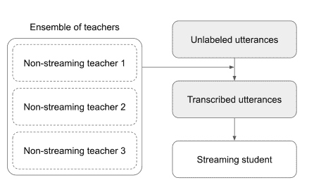
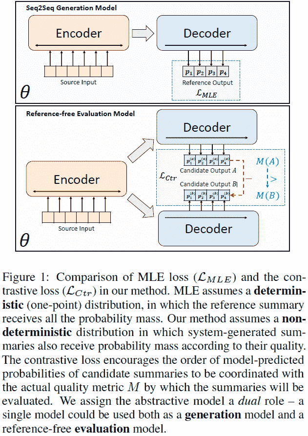

# 深度学习论文摘要-流式 ASR 和摘要

> 原文：<https://www.assemblyai.com/blog/deep-learning-paper-recap-streaming-asr-summarization/>

本周的深度学习论文摘要是 [*通过提取 CTC 和 RNN-T 模型的集合*](https://arxiv.org/pdf/2104.14346.pdf) 和 [*BRIO:给抽象概括带来秩序*](https://arxiv.org/pdf/2203.16804v1.pdf) 来弥合流式和非流式 ASR 系统之间的差距

## 通过提取 CTC 和 RNN-T 模型的集合来弥合流式和非流式 ASR 系统之间的差距

### 这篇论文有什么令人兴奋的地方

流式模型通常被限制为随意的，没有未来的上下文，并且还遭受更高的单词错误率。[本文](https://arxiv.org/pdf/2104.14346.pdf)弥合了流模式和非流模式之间的差距。

论文中描述的学生模型在先前工作的流模型的基础上有了很大的改进。对于新的语言模型，[单词错误率(WER)](https://www.assemblyai.com/blog/word-error-rate/) 在西班牙语上降低了 41%，在葡萄牙语上降低了 27%，在法语上降低了 13%。

[*Source*](https://docs.google.com/presentation/d/1UHIsKvfdFLxiXJTFrA4uq2LsXvpXQLWGjxUbRkcTvUo/edit#slide=id.g135bd17ca8f_0_4)

### 主要发现

使用至少一个 CTC 老师导致学生 wer 较低。例如，接受过 CTC 模型培训的 RNN-T 学生比接受过 RNN-T 教师培训的学生表现更好。将 CTC 和 RNN-T 结合使用效果最佳。

RNN-T 学生模型胜过他们的 CTC 老师。在 CTC 老师的指导下，RNN-T 学生模型较少出现删除错误。

### 我们的外卖

这种将非流模型提取为流模型的方式极大地将研究重点缩小到异步模型，并加快了研究速度。

这种培训分流学生模型的方法不仅大大提高了结果，而且缩小了非分流教师和分流学生之间的差距。

## BRIO:给抽象概括带来秩序

### 这篇论文有什么令人兴奋的地方

概括模型通常使用最大似然估计(MLE)来训练。MLE 假设理想模型会将所有概率质量分配给参考摘要。

当模型必须比较几个偏离参考值的候选值时，这可能会导致推理时的性能降低。

[本文](https://arxiv.org/pdf/2203.16804v1.pdf)提出了一种训练方法，在该方法中，不同的候选人根据他们的素质被分配概率质量。

这种方法赋予模型双重角色:

*   作为生成模型(使用 MLE 训练)，它以自回归方式生成输出摘要。
*   作为一个评估模型(使用对比损失进行训练)，它可以用于对候选人的质量进行评分。

[*Source*](https://arxiv.org/pdf/2104.14346.pdf)

### 主要发现

他们的方法在几个众所周知和广泛使用的数据集上建立了新的最先进的结果。

他们的模型估计候选人的概率与候选人的质量水平高度相关。

### 我们的外卖

BRIO 提出了一种新颖的训练方法，可以用来提高[文本摘要](https://www.assemblyai.com/blog/text-summarization-nlp-5-best-apis/)模型的性能。

他们的方法也有可能应用于其他条件文本生成任务，如机器翻译。