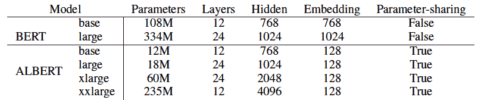
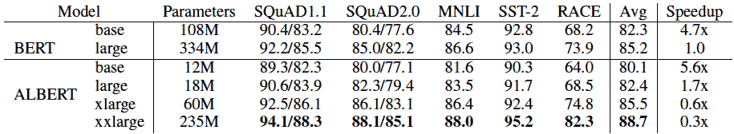
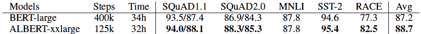

# 回顾-阿尔伯特:一个自我监督学习语言表达的简装伯特

> 原文：<https://www.assemblyai.com/blog/review-albert/>

本周的深度学习论文评论是 [ALBERT:一个用于语言表达自我监督学习的 Lite BERT】。](https://arxiv.org/abs/1909.11942)

## 这篇论文有什么令人兴奋的地方

在 [transformer-type 模型](https://arxiv.org/abs/1706.03762)的世界中已经变得很明显，特别是当它们属于自然语言处理时，在预处理自然语言表示时增加模型大小通常会导致下游任务的性能提高。然而，这种想法有局限性，在某种程度上，由于 GPU/TPU 内存的限制和较长的训练时间，保持增加模型大小变得困难。

本文旨在通过提出两种参数缩减技术来解决这一问题，这两种技术显著减少了 [BERT](https://arxiv.org/abs/1810.04805) 的内存消耗和训练时间。第一种技术是嵌入参数的因子分解，它将单词块嵌入大小与隐藏层大小分离，从而显著减少嵌入参数的数量。第二种技术是跨层参数共享，其中跨层共享前馈网络和注意力参数的权重，这进一步减少了需要训练的总参数的数量。

## 
主要发现

下面是本文分析的 BERT 和 ALBERT 模型的主要构型:

上述配置已经过一系列不同的下游任务标准基准测试。实验表明，与 BERT-large 相比，ALBERT 的最佳配置在 GLUE、RACE 和 SQuAD 基准上建立了新的最先进的结果，同时具有更少的参数。下表显示了不同的 ALBERT 和 BERT 配置在这些基准测试中的对比情况。

这里需要注意的一点是，尽管 ALBERT-xxlarge 在上表中的表现比 BERT-large 好，但训练速度明显下降。作者承认这一点，并解释说这是因为 ALBERT-xxlarge 是一个更大的网络，尽管它的参数明显更少。然而，作者实验了在大致相同的时钟时间内训练两种配置，而不是相同的训练步骤数，ALBERT-xxlarge 仍然优于 BERT-large，如下表所示。

## 我们的外卖

本文表明，有一些方法可以在不增加参数数量的情况下增加模型的大小(层数),并且仍然可以实现最先进的性能。这是一个强大的想法，特别是在 GPU/TPU 内存可访问性有限的情况下。这将是令人兴奋地看到新的研究旨在减少超参数的数量，以及加快训练和推理时间的阿尔伯特一样的变压器。

## 参考

*   ALBERT:一个用于自我监督语言表达学习的 Lite BERT
*   [注意力是你所需要的一切](https://arxiv.org/abs/1706.03762)
*   [伯特:语言理解深度双向转换器的预训练](https://arxiv.org/abs/1810.04805)