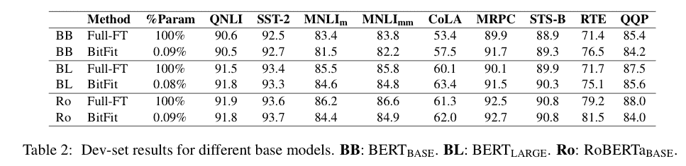
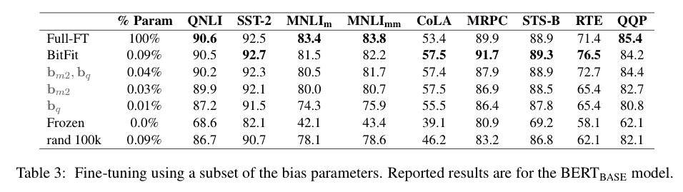

# BitFit:基于转换器的屏蔽语言模型的简单参数高效微调

> 原文：<https://www.assemblyai.com/blog/bitfit/>

## **这篇论文有什么令人兴奋的地方**

这项工作属于参数有效微调的范畴，目标是使用尽可能少的参数来实现几乎与微调整个模型相同的精度。

作者提出了一种新的方法，即在微调时，冻结变压器编码器中除偏置项以外的所有参数。换句话说，研究人员仅使用偏差参数对下游任务进行微调。结果相当令人惊讶，因为尽管只使用了总参数**的 **0.08%** ，但它在 GLUE 基准测试任务上取得了与完全微调模型相当的结果。**

## **主要发现**

虽然预先训练好的基于转换器的语言模型，如 BERT 在许多 NLP 任务中表现得更好，但是训练这些模型并在生产中部署它们是非常昂贵的。这使得研究人员想出了不同的有效微调技术。

BitFit 通过冻结预训练 LM 中的所有参数并仅更新偏置项来解决这个问题。对于中小型数据集，这种策略的性能几乎与完全微调的模型相同，有时甚至更好。

下面是 BitFit 和 Full-FT 的对比表。

如果我们允许任务在性能上有小的下降，我们可以通过仅使用查询向量和第二 MLP 层(其包括总参数的 0.04%)的偏差来更进一步。作者的另一个问题是偏差项是否特殊，或者我们是否可以用其他随机参数达到同样的效果。为了测试这一点，他们随机选择了 10 万个参数来微调模型。而且它的表现明显不如 BitFit。

## **我们的外卖**

对一小组参数的微调为更容易的部署打开了大门。由于大多数参数没有改变，我们可以部署一个模型，并在不同的任务中重用它。让一个可重用的模型用于多个任务还会显著减少内存消耗。