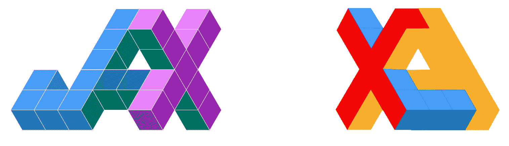
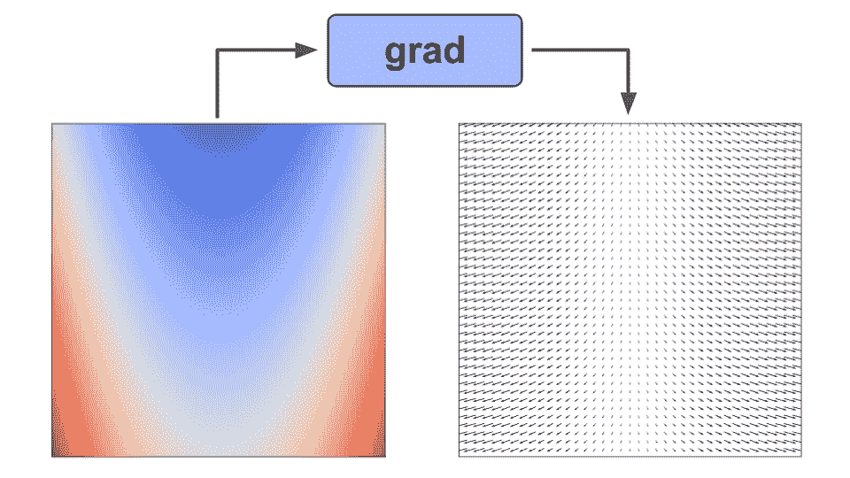
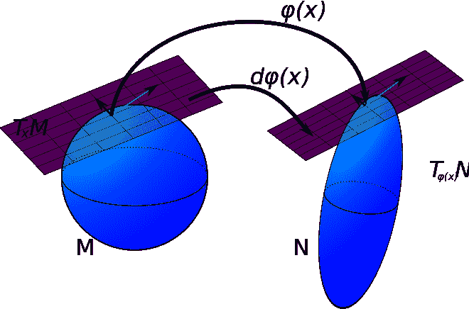
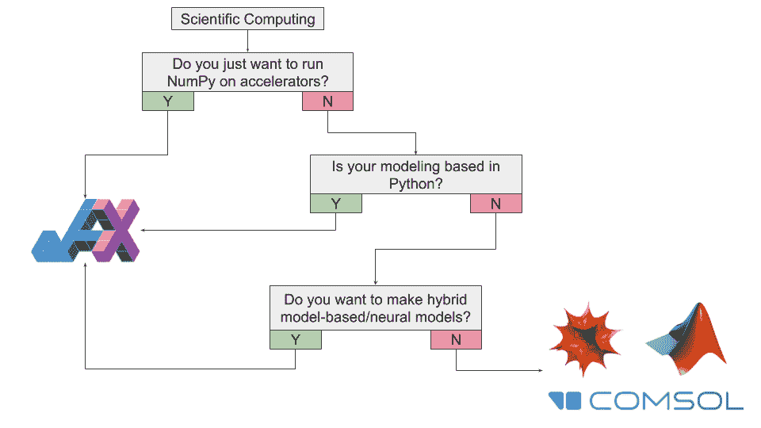
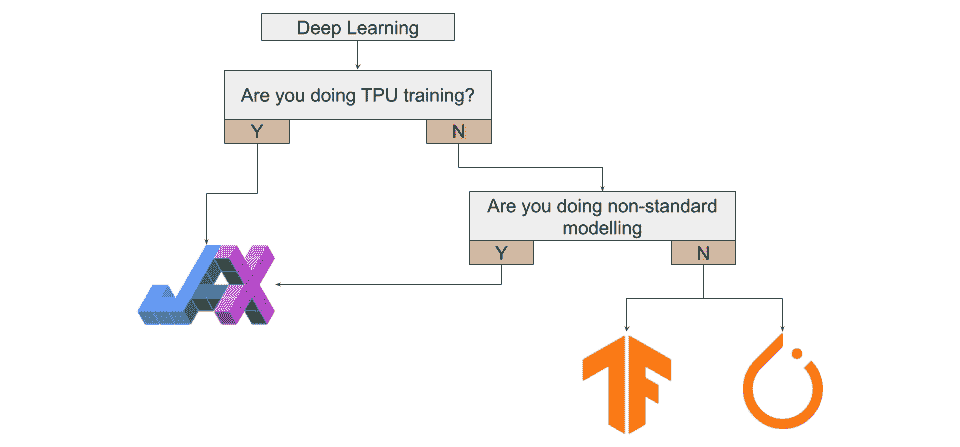
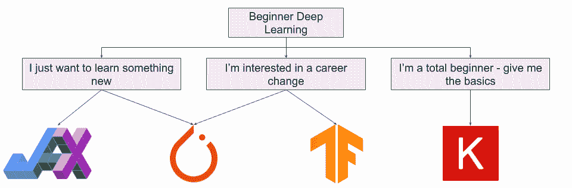
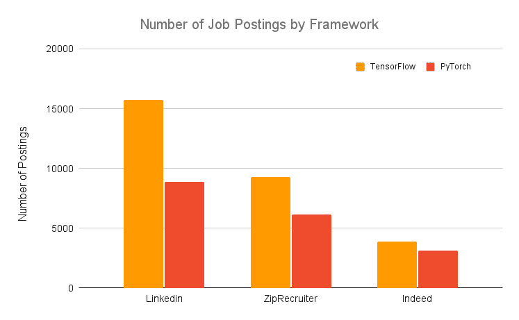
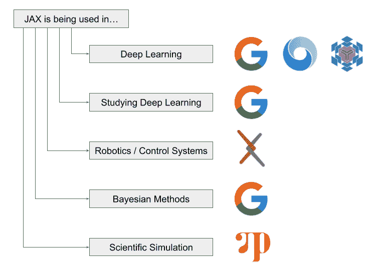

# 为什么你应该(或不应该)在 2023 年使用谷歌的 JAX

> 原文：<https://www.assemblyai.com/blog/why-you-should-or-shouldnt-be-using-jax-in-2022/>

自从[谷歌的 JAX](https://github.com/google/jax) 在 2018 年末亮相以来，它的受欢迎程度一直在稳步增长，这是有充分理由的。DeepMind [在 2020 年](https://deepmind.com/blog/article/using-jax-to-accelerate-our-research)宣布，它正在使用 JAX 加速其研究，越来越多的出版物和项目从谷歌大脑和其他人都在使用 JAX。**伴随着所有这些讨论，JAX 似乎是下一个大的深度学习框架，对吗？**

不对。在这篇文章中，我们将阐明 JAX 是什么(不是)，为什么你应该关心(或者不应该，但是你可能应该)，以及你是否应该(或者不应该)使用它。

让我们开始吧！

建议说明

如果你已经熟悉 JAX，并且想跳过基准测试，你可以跳到我们关于何时使用它的建议

## 谷歌的 JAX 是什么？

也许最好从 JAX 是什么开始*而不是*。JAX 是*不是*深度学习框架或库，它本身也不是被设计成深度学习框架或库。总而言之， **JAX 是一个高性能的数值计算库，它包含了可组合的函数转换**[[1](https://www.assemblyai.com/blog/why-you-should-or-shouldnt-be-using-jax-in-2022/#references)。正如我们所见，深度学习只是 JAX 所能做的一小部分:


JAX lies at the intersection of Scientific Computing and Function Transformations, yielding a wide range of capability beyond the ability to train Deep Learning models

## 我为什么要关心 JAX？

简而言之-**。这是 JAX 与任何用例相关的普遍方面。**

**让我们用 NumPy 和 JAX 对一个矩阵的前三次幂求和。首先是我们的 NumPy 实现:**

```py
`def fn(x):
  return x + x*x + x*x*x

x = np.random.randn(10000, 10000).astype(dtype='float32')
%timeit -n5 fn(x)` 
```

```py
`5 loops, best of 5: 478 ms per loop` 
```

**我们发现这个计算大约需要 **478 ms** 。接下来，我们用 JAX 实现这个计算:**

```py
`jax_fn = jit(fn)
x = jnp.array(x)
%timeit jax_fn(x).block_until_ready()`
```

```py
`100 loops, best of 5: 5.54 ms per loop` 
```

**JAX 完成这个计算只用了 5.54 毫秒，比 T2 快了 86 倍。**

**...那就是 8600%。**

**

JAX has the potential to be orders of magnitude faster than NumPy (n.b. JAX is using TPU and NumPy is using CPU in order to highlight that JAX's speed ceiling is much higher than NumPy's)** 

### **观点**

**事情并不像“使用 JAX，你的程序会快 86 倍”那么简单，但是仍然有大量的理由使用 JAX。由于 JAX 为高性能科学计算提供了一个通用基础，它将因不同原因对不同领域的不同人有用。从根本上说，**如果你在*任何与科学计算***、**相关的领域，你都应该关心 JAX** 。**

**以下是您可能希望使用 JAX 的一些原因:**

****1。加速器上的 NumPy**-NumPy 是使用 Python 进行科学计算的基础包之一，但是它只与 CPU 兼容。JAX 提供了一个 NumPy 的实现(有一个几乎相同的 API ),可以非常容易地在 T2 的 GPU T4 和 TPU T5 上运行。对于许多用户来说，光是这个*就足以证明使用 JAX 的合理性。***

****2。XLA** - XLA，或加速线性代数，是一个全程序优化编译器，专为线性代数设计。JAX 建立在 XLA 的基础上，大大提高了计算速度的上限[1](https://www.assemblyai.com/blog/why-you-should-or-shouldnt-be-using-jax-in-2022/#references)。**

****3。JIT** - JAX 允许你使用 XLA[7](https://www.assemblyai.com/blog/why-you-should-or-shouldnt-be-using-jax-in-2022/#references) 将你的*自己的*函数转换成即时(JIT)编译版本。这意味着你可以通过在你的计算函数中添加一个简单的函数装饰器来提高计算速度。**

****4。自动分化**——JAX 文献称 JAX 为“亲笔签名和 XLA，走到一起”[1](https://www.assemblyai.com/blog/why-you-should-or-shouldnt-be-using-jax-in-2022/#references) 。自动微分的能力在科学计算的许多领域是至关重要的，JAX 提供了几个强大的自动微分工具。**

****5。深度学习**——虽然它本身不是一个深度学习框架，但 JAX 无疑为深度学习提供了一个绰绰有余的基础。有许多建立在 JAX 之上的图书馆寻求建立深度学习能力，包括[亚麻](https://github.com/google/flax)、[俳句](https://github.com/deepmind/dm-haiku)和[挽歌](https://github.com/poets-ai/elegy)。在我们最近的 [PyTorch vs TensorFlow](https://www.assemblyai.com/blog/pytorch-vs-tensorflow-in-2022/) 文章[中，我们甚至强调 JAX 是一个值得关注的“框架”，建议将其用于](https://www.assemblyai.com/blog/pytorch-vs-tensorflow-in-2022/#what-if-i%E2%80%99m-a-researcher)基于 TPU 的深度学习研究。JAX 对黑森的高效计算也与深度学习相关，因为它们使高阶优化技术更加可行。**

****6。通用可区分编程范式**——虽然使用 JAX 来构建和训练深度学习模型肯定是可能的，但它也为*通用可区分编程提供了一个框架。这意味着 JAX 可以通过使用基于模型的机器学习方法来解决问题，利用在给定领域通过几十年的研究建立起来的*先验知识*。***

 **想了解更多关于基于模型的差异化编程吗？

查看我们对差异化编程的介绍！

[Check it out](https://www.assemblyai.com/blog/differentiable-programming-a-simple-introduction/)**

## **XLA**

***点击[此处](https://www.assemblyai.com/blog/why-you-should-or-shouldnt-be-using-jax-in-2022/#summary)跳转到本节的摘要。***

### **什么是 XLA？**

**XLA，或加速线性代数，是 JAX 如此强大的基础。XLA 由谷歌开发，是一个特定领域、基于图形的实时编译器[2](https://www.assemblyai.com/blog/why-you-should-or-shouldnt-be-using-jax-in-2022/#references) ，用于线性代数，可以通过各种全程序优化[3](https://www.assemblyai.com/blog/why-you-should-or-shouldnt-be-using-jax-in-2022/#references) 显著提高计算速度。**

**在一个例子[2](https://www.assemblyai.com/blog/why-you-should-or-shouldnt-be-using-jax-in-2022/#references) 中，仅从*计算的角度来看，XLA 将 BERT 训练速度提高了几乎**的 7.3 倍***，但由于使用了 XLA *而降低了内存使用量*还支持梯度累加，导致计算吞吐量惊人地**提高了 12 倍**。**

**

XLA can significantly improve the training process for neural networks** 

**XLA 已经融入了 JAX 的 DNA 单从他们的商标就可以看出 JAX 的成功有多依赖 XLA。**

****

### **为什么 XLA 如此重要？**

**回答 XLA 为何如此重要，可能会引发一场技术性很强(也很长)的讨论。出于我们的目的，可以说 XLA 很重要，因为它通过*融合低级操作*显著提高了执行速度并降低了内存使用。**

 **其他详细信息

XLA 并不将单个操作预编译成计算内核，而是将整个图编译成一系列计算内核，这些计算内核是专门为图生成的*。*

这种方法通过不执行不必要的内核启动来提高速度，并利用本地信息进行优化[【3】](https://www.assemblyai.com/blog/why-you-should-or-shouldnt-be-using-jax-in-2022/#references)。由于 XLA 没有在操作序列中物化中间数组(而是将值保存在 GPU 寄存器中，并将它们流式传输[【3】](https://www.assemblyai.com/blog/why-you-should-or-shouldnt-be-using-jax-in-2022/#references))，使用 XLA 也减少了内存消耗。

考虑到(I)内存通常是 GPU 计算的限制因素，以及(ii) XLA 不会浪费时间来执行无关的数据移动，这种降低的内存消耗带来了*进一步的*速度提升。** 

**虽然操作融合(或*内核融合*)是 XLA 的旗舰功能，但应该注意的是，XLA 还执行了一系列*其他全程序优化，如专门针对已知的张量形状(允许更积极的常数传播)，分析和调度内存使用以消除中间存储缓冲区[4](https://www.assemblyai.com/blog/why-you-should-or-shouldnt-be-using-jax-in-2022/#references) ，执行内存布局操作，如果不是所有的值都被返回，则只计算请求值的子集[[5](https://www.assemblyai.com/blog/why-you-should-or-shouldnt-be-using-jax-in-2022/#references)。***

**由于所有 JAX 操作都是根据 XLA 的操作实现的，JAX 有一个统一的计算语言，允许它在 CPU、TPU 和 GPU 之间无缝运行，库调用得到及时编译和执行[1](https://www.assemblyai.com/blog/why-you-should-or-shouldnt-be-using-jax-in-2022/#references) 。**

### **摘要**

**如果上面的行话对你没有意义，不要担心-只要知道 XLA 是一个非常快速的编译器，它是使 JAX 在各种硬件上使用起来独特强大和简单的基础。**

## **JAX 变换**

***点击[此处](#summary-1)跳转到本节的摘要。***

### **什么是函数变换？**

**到目前为止，我们已经讨论了 XLA 以及它如何允许 JAX 在加速器上实现 NumPy 但请记住，这只是我们对 JAX 定义的一半。JAX 不仅为强大的科学计算提供工具，也为可组合函数转换提供工具。**

**很简单，函数转换是函数上的*操作符，其输出是*另一个函数*。如果我们对一个标量值函数 *f(x)* 使用梯度函数变换，那么我们得到一个向量值函数*f’(x)*，它给出了函数在 *f(x)* 的定义域中任意一点的梯度。***

**

Using `grad()` on our function allows us to get the gradient at any point in the domain** 

****JAX 为这种功能转换引入了一个可扩展的系统**，并且有四个典型用户感兴趣的主要转换:**

1.  **`grad()`用于评估输入函数的梯度函数**
2.  **`vmap()`用于自动矢量化的操作**
3.  **`pmap()`便于并行计算，以及**
4.  **将函数转换成即时编译版本**

**让我们依次看看这些转变，并谈谈它们为什么如此令人兴奋。如果你想玩一些互动的例子，可以在 YouTube 上免费查看我们的 [JAX 速成班](https://www.youtube.com/watch?v=juo5G3t4qAo)，或者是与[相关的 Colab 笔记本](https://colab.research.google.com/drive/1_-e5MUrGfS7r1veKiVADuiLI_9e1UAih?usp=sharing)。**

### **用`grad()`自动微分**

**为了能够训练机器学习模型，人们需要能够执行反向传播。与 TensorFlow 或 PyTorch 通过计算图反向传播来计算损失函数在某个*点*的梯度不同，JAX `grad()`函数变换输出梯度*函数*，然后可以在其域中的任何点对其进行评估。**

#### ***哪里*可以区分？**

**自动微分在 JAX 非常强大，部分源于 JAX 在计算梯度时的灵活性。有了`grad()`，可以**通过原生 Python 和 NumPy 函数**[6](https://www.assemblyai.com/blog/why-you-should-or-shouldnt-be-using-jax-in-2022/#references) 进行区分，比如循环、分支、递归、闭包和“ [PyTrees](https://jax.readthedocs.io/en/latest/pytrees.html) ”(比如字典)。**

**让我们看一个例子——我们将使用 Python 控制流定义一个修正的立方体函数`f(x) = abs(x3)`。这个实现显然不是计算效率最高的方法，但是它帮助我们突出了`grad()`如何通过本地 Python 控制流和嵌套在条件中的循环工作。**

```py
`def rectified_cube(x):
  r = 1

  if x < 0.:
    for i in range(3):
      r *= x
    r = -r
  else:
    for i in range(3):
        r *= x

  return r

gradient_function = grad(rectified_cube)

print(f"x = 2   f(x) = {rectified_cube(2.)}   f'(x) =  3*x^2 = {gradient_function(2.)}")
print(f"x = -3  f(x) = {rectified_cube(-3.)}  f'(x) = -3*x^2 = {gradient_function(-3.)}")`
```

```py
`x = 2   f(x) = 8.0   f'(x) =  3*x^2 = 12.0
x = -3  f(x) = 27.0  f'(x) = -3*x^2 = -27.0`
```

**我们可以看到，在`x=2`和`x=-3` *求函数及其导数时，得到了预期的结果。***

#### **到*什么程度*我能区分？**

**通过重复应用`grad()`，JAX 可以很容易地将*区分为任何订单*。**

```py
`# for x >= 0: f(x)=x^3 => f'(x)=3*x^2 => f''(x)=3*2*x => f'''(x)=6
third_deriv = grad(grad(grad(rectified_cube)))
for i in range(5):
  print(third_deriv(float(i)))`
```

```py
`6.0
6.0
6.0
6.0
6.0`
```

**我们可以看到，对我们的函数的三阶导数的几个输入的评估给出了`f '''(x)=6` *的恒定期望输出。***

**从更一般的角度来看，以快速和简单的方式获取多重导数的能力对于深度学习之外的许多更一般的计算领域具有实际用途，例如动力系统的研究。**

#### ***我能区分什么*？**

##### **标量值函数**

**如您所料，`grad()`采用**标量值函数**的**梯度**，这意味着一个将标量/向量映射到标量的函数。这种函数的梯度对于例如反向传播是有用的，其中我们通过从(标量)损失函数反向传播来训练模型，以更新我们的模型权重。**

**虽然`grad()`对于各种各样的项目来说已经足够，但这并不是 JAX 能够实现的唯一差异化。**

##### **向量值函数**

**对于将向量映射成向量的**向量值** **函数**，与梯度类似的是**雅可比矩阵**。通过对应于正向模式微分和反向模式微分的函数变换`jacfwd()`和`jacrev()`，JAX 返回一个函数，该函数在对域中的一点求值时产生雅可比矩阵。**

```py
`def mapping(v):
  x = v[0]
  y = v[1]
  z = v[2]
  return jnp.array([x*x, y*z])

# 3 inputs, 2 outputs
# [d/dx x^2 , d/dy x^2, d/dz x^2]
# [d/dx y*z , d/dy y*z, d/dz y*z]

# [2*x , 0, 0]
# [0 , z, y]

f = jax.jacfwd(mapping)
v = jnp.array([4., 5., 9.])
print(f(v))`
```

```py
`[[8\. 0\. 0.]
 [0\. 9\. 5.]]`
```

**例如，您也可以使用雅可比矩阵，以便更有效地计算数据矩阵中每个数据相对于权重矩阵的函数梯度。**

#### **黑森人**

**从机器学习的角度来看，JAX 最令人兴奋的一个方面可能是它让计算变得非常简单，让 T2 变得非常容易，让 T4 变得高效。因为有了 XLA， **JAX 计算黑森的速度比 PyTorch** 快得多，这使得实现****高阶优化技术，如 [AdaHessian](https://arxiv.org/abs/2006.00719) 更加实际。这个事实*本身*就足以成为一些实践者使用 JAX 的理由。******

******让我们尝试在 PyTorch 中计算输入平方和的 Hessian 值:******

```py
****`def torch_fn(X):
  return pt.sum(pt.mul(X,X))

X = pt.randn((1000,))
%timeit -n 10 -r 5 pt.autograd.functional.hessian(torch_fn, X, vectorize=False)
%timeit -n 100 -r 10 pt.autograd.functional.hessian(torch_fn, X, vectorize=True)`****
```

```py
****`10 loops, best of 5: 107 ms per loop
100 loops, best of 10: 3.33 ms per loop`****
```

******计算需要大约 **107 毫秒**，但是使用[实验矢量化功能](https://pytorch.org/docs/stable/generated/torch.autograd.functional.hessian.html)将执行时间减少到 **3.33 毫秒**。让我们在 JAX 尝试同样的计算:******

```py
**`def jax_fn(X):
  return jnp.sum(jnp.square(X))

jit_jax_fn = jit(jacfwd(jacrev(jax_fn)))

X = jnp.array(X)
%timeit jit_jax_fn(X).block_until_ready()`**
```

```py
**`The slowest run took 47.27 times longer than the fastest. This could mean that an intermediate result is being cached.
1000 loops, best of 5: 90.5 µs per loop`**
```

****使用 JAX，计算只需要 90.5 秒，比 PyTorch 的矢量化版本快 36 倍。****

****

JAX can be very fast at calculating Hessians, making higher-order optimization much more feasible**** 

#### ****向前推/向后拉****

****JAX 甚至可以计算出**雅可比向量乘积**和**向量雅可比乘积**。考虑光滑流形之间的光滑映射。JAX 可以计算这个地图的向前推进，将一个流形上的点的切向量映射到另一个流形上的切向量。****

****

[Image source](https://en.wikipedia.org/wiki/Pushforward_(differential))**** 

****如果这部分比较混乱或者不熟悉，不用担心！这是一个高级主题，可能对一般用户来说(就其本身而言)不相关或不感兴趣。我们指出这种能力的存在只是为了强调这样一个事实，即 JAX 为*各种各样的计算任务*提供了*非常强大的基础*。例如，前推在[微分几何](https://en.wikipedia.org/wiki/Differential_geometry)领域很重要，我们可以用 JAX 来研究。****

### ****使用`vmap()`自动矢量化****

****越过数学到更实际/计算的转换，我们到达`vmap()`。考虑这样一种情况，我们希望对一组对象重复应用一个函数。例如，让我们考虑将两个数字列表相加的任务。实现这种操作的简单方法是简单地利用一个`for`循环——即对于第一个列表中的每个数字，将它添加到第二个列表中的相应值，并将结果写入一个新列表。****

****<https://www.assemblyai.com/blog/content/media/2022/02/not_vectorized-1.mp4>

****

*****Unvectorized* vector-addition****

****通过`vmap()`转换，JAX 执行相同的计算，但是**将循环下推到原始操作以获得更好的性能**[6](https://www.assemblyai.com/blog/why-you-should-or-shouldnt-be-using-jax-in-2022/#references) ，从而产生计算的自动矢量化版本。****

****<https://www.assemblyai.com/blog/content/media/2022/02/vectorized.mp4>

****

*****Vectorized* vector-addition****

****当然，我们可以简单地将我们的列表定义为 JAX 数组，并使用 JAX 的数组加法，但是由于许多原因,`vmap()`仍然很有用。****

****一个基本原因是，我们可以用更原生的 Python 代码编写操作，然后`vmap()`它，导致高度 Python 化和可能更可读的代码。另一个原因当然是**将**推广到没有*简单的矢量化替代方案*可以实现的情况。****

### ****使用`pmap()`自动并行化****

****分布式计算逐年变得越来越重要，尤其是在深度学习领域，SOTA 模型已经发展到绝对天文数字的规模，如下图所示。例如，GPT-4 号将拥有超过 **100 *万亿*个参数**。****

****

[Data source](https://www.alignmentforum.org/posts/GzoWcYibWYwJva8aL/parameter-counts-in-machine-learning)**** 

****我们已经在上面讨论过，由于 XLA，JAX 可以在*一个*加速器上轻松计算，但是 JAX 也可以用*多个*加速器轻松计算，**用单个命令** - `pmap()`执行 SPMD 程序**的分布式训练**。****

****考虑向量矩阵乘法的例子。假设我们通过顺序计算向量与矩阵每一行的点积来执行这个计算。我们需要通过硬件一次一个地推进这些计算。****

****<https://www.assemblyai.com/blog/content/media/2022/02/not_parallel-2.mp4>

****

*****Unparallelized* vector-matrix multiplication****

****有了 JAX，我们可以*轻松地*通过**简单地将我们的操作包装在`pmap()`** 中，将这些计算分布在 4 个 TPU 上。这允许我们在每个 TPU 上同时执行一个点积，显著提高了我们的计算速度(对于大型计算)。****

****<https://www.assemblyai.com/blog/content/media/2022/02/parallelized.mp4>

****

*****Parallelized* vector-matrix multiplication****

****这里非常值得注意的是对我们代码的改变是多么的小。由于 JAX 是建立在 XLA 上的，我们可以轻松地改变我们将计算映射到硬件的方式。****

### ****用`jit()`进行实时编译****

#### ****什么是实时编译？****

****实时编译(JIT compilation)是一种介于解释和提前(AOT)编译之间的代码执行方法。重要的事实是, **JIT 编译器会在运行时将代码编译成快速的可执行文件**,代价是第一次运行较慢。****

 ****其他详细信息

使用 JIT 编译，代码是在运行时编译的，所以在程序第一次运行时会有一些**初始开销，因为代码需要编译*和执行*。因此，AOT 编译可能在第一遍就胜过 JIT 然而，对于重复执行，JIT 编译的程序将使用*先前编译的缓存代码非常快速地执行*。**

如果 JIT 编译的程序是 AOT 编译的，那么从理论上讲，JIT 编译的程序甚至可以比相同的程序运行得更快(T0 )( T1 ),因为 JIT 编译器可以利用代码在执行它的同一台机器上编译的事实，使用本地信息来提高优化。

界线会变得模糊。例如，当 Python 运行时，它被编译成字节码，然后被 Python 的虚拟机(例如 CPython)解释，或者被编译成机器码(PyPy)。如果这些细节令人困惑，不要担心。重要的一点是，JIT 编译的 JAX 程序允许它们极快地执行。**** 

#### ****JAX 的及时编辑****

****XLA 原语是 JIT 编译的，但是 JAX *也*让你 **JIT 编译你自己的 Python 函数到 XLA 优化的内核**，要么作为函数装饰器`@jit`，要么作为函数本身`jit()`[1](https://www.assemblyai.com/blog/why-you-should-or-shouldnt-be-using-jax-in-2022/#references)。****

****JIT 不是一次一个操作地将内核分派到 GPU，而是使用 XLA 将操作序列一起编译到一个内核中，给出一个端到端编译的高效 XLA 实现[6](https://www.assemblyai.com/blog/why-you-should-or-shouldnt-be-using-jax-in-2022/#references)[7](https://www.assemblyai.com/blog/why-you-should-or-shouldnt-be-using-jax-in-2022/#references)**。******

****举个例子，让我们定义一个函数来计算一个矩阵值的前三次幂的和。我们在一个 5000 x 5000 的矩阵上计算这个函数三次——一次用 NumPy，一次用 JAX，一次用 JAX 在这个函数的 JIT 编译版本上。首先，我们在 CPU 上进行实验:****

```py
**`def fn(x):
  return x + x*x + x*x*x

x_np = np.random.randn(5000, 5000).astype(dtype='float32')
x_jnp = jnp.array(x_np)

%timeit -n5 -r5 fn(x_np)
%timeit fn(x_jnp).block_until_ready()
jitted = jit(fn)
jitted(x_jnp)
%timeit jitted(x_jnp).block_until_ready()`**
```

```py
**`WARNING:absl:No GPU/TPU found, falling back to CPU. (Set TF_CPP_MIN_LOG_LEVEL=0 and rerun for more info.)
5 loops, best of 5: 151 ms per loop
10 loops, best of 5: 109 ms per loop
100 loops, best of 5: 17.7 ms per loop`**
```

****

JAX is significantly faster for element-wise computations, especially when `jit` is used**** 

****我们看到 **JAX 几乎比 NumPy** 快 40%，当我们 JIT 这个函数时，我们发现 **JAX 比 NumPy** 快 8.5 倍。这些结果已经令人印象深刻，但让我们加大赌注，让 JAX 在 TPU 上计算:****

****

When JAX performs the same calculation on a TPU, its relative performance jumps even further (NumPy computations still performed on CPU given that it does not support TPU computation)**** 

****在这种情况下，我们看到 JAX 比 NumPy 快 9.3 倍，如果我们在 TPU 上运行 JIT 函数和计算，我们会发现 JAX 比 NumPy 快 57 倍。****

****当然，这种速度的大幅提高并不是没有代价的。JAX 对 JIT 允许哪些函数进行了限制，尽管像上面这样只涉及 NumPy 操作的函数通常是允许的。此外，通过 Python 控制流进行 JIT 还有一些限制，所以在编写函数时，您必须记住这一点。****

 ****提醒一句

在使用`jit`之前，你应该确保你了解它是如何工作的，以及在什么情况下允许使用它。如果你没有这种理解，但还是试图使用`jit`，你要么会得到令你困惑的错误消息(如果你幸运的话)，要么会得到**未被跟踪的、不受欢迎的副作用，这些副作用会悄悄地破坏你结果的准确性**(如果你不幸的话)。**** 

****要了解更多关于 JIT 及其局限性的信息，请查阅 [JAX 文档](https://jax.readthedocs.io/en/latest/notebooks/Common_Gotchas_in_JAX.html#pure-functions)。****

### ****摘要****

****JAX 有 4 个主要的函数转换- `grad()`用于自动微分函数，`vmap()`用于自动矢量化运算，`pmap()`用于 SPMD 程序的并行计算，以及`jit()`用于将函数转换成 JIT 编译版本。这些转换(大部分)是可组合的，非常强大，并且有可能将您的程序加速几倍。****

## ****有什么条件？****

*****点击[此处](#summary-2)跳转到本节的摘要。*****

****我们在上面看到了 XLA 和基本 JAX 变换如何有潜力显著提高程序的性能。虽然 JAX 非常强大，有潜力在许多领域大幅提高生产率，但它的使用需要谨慎。尤其是如果你正在考虑从 [PyTorch 或 TensorFlow](https://www.assemblyai.com/blog/pytorch-vs-tensorflow-in-2022/) 转移到 JAX，你应该明白 JAX 的底层哲学与这两个深度学习框架截然不同。我们现在来说说主要区别。****

### ****功能范式****

****使 JAX 与众不同的主要特征是它的**转换和编译被设计成只为功能纯的程序**工作。虽然如果您只是想使用 JAX 在 GPU 或 TPU 上进行 NumPy 计算，这一事实可能不相关，但它与大量潜在的 JAX 应用程序相关，因此您应该确保在开始之前理解采用这一范式的含义。****

****一个纯函数的核心特征，有时称为*数值函数*、**、**，是*参照透明性*的特征——一个纯函数可以在任何时候用它的求值结果**替换，而程序不能分辨出其中的区别**。在给定相同输入*的情况下，函数应该总是对程序产生相同的影响，而不管它执行的时间或环境。*****

****原则上这听起来很简单，但是如果您没有函数式编程的经验，那么肯定存在一个学习曲线。下面是一些必要(但不充分！)函数为纯函数的条件:****

*   ****它不能通过访问或分配其作用域之外的变量来改变程序的状态****
*   ****它不能有 I/O 流——所以不能打印、请求输入或访问时间****
*   ****它不能有可变函数作为参数(并发进程可以修改)****

****JAX 的函数式方法导致了一些新来者应该做好准备的特性，比如不能就地修改数组和[显式 PRNG 处理](https://jax.readthedocs.io/en/latest/jax.random.html#prng-keys)。****

### ****未追踪的副作用****

****在 JAX 运行一个不纯的函数时，副作用**可能不会表现出来**。如果你不小心，像作用域外封装这样的副作用会**悄悄地抛出你的计算结果**。这在某些行业(医疗保健、自主系统等)有可能是灾难性的。)，所以如果你打算利用 JAX，你应该确定你了解如何写纯函数。****

### ****摘要****

****JAX 的函数变换被设计成只与*纯*函数(有时被称为*数字*函数)一起工作。**如果你不小心，未被追踪的副作用可能会悄悄地破坏你预期计算的准确性**。****

## ****我应该在 2023 年使用 JAX 吗？****

****一如既往，这个问题的答案是“看情况”。移民 JAX 是否明智取决于你的环境和目标。为了帮助你决定你是否应该在 2023 年使用 JAX，我们将我们的建议编辑成了下面的流程图，不同的图表代表不同的兴趣领域。****

### ****科学计算****

********

****如果你对 JAX 的**通用科学计算**感兴趣——你应该问自己的第一个问题是，你是否只是想在加速器(即 GPU 和 TPU)上运行 **NumPy。如果答案是肯定的，那么你昨天就应该使用 JAX。在这种情况下，这真的很容易，你应该开始移民到 JAX。******

****如果你不只是处理数字，而是参与动态计算建模，那么你是否应该使用 JAX 将取决于你的用例。如果你的大部分工作是使用大量定制代码的 Python，那么为了提高你的工作流程，开始学习 JAX 是值得的。****

****如果你的大部分工作不是用 Python 做的，但是你想建立某种混合的基于模型/神经网络的系统，那么使用 JAX 可能是值得的。****

****如果你的大部分工作不是用 Python 做的，或者你在研究中使用了一些专门的软件(热力学、半导体等)。)**那么 JAX 可能不适合你**，除非你想从这些程序中导出数据进行某种定制的计算处理。如果你感兴趣的领域更接近物理/数学，并且结合了计算方法(动力系统、微分几何、统计物理)，并且你的大部分工作都是在 Mathematica 中完成的，那么**坚持使用你正在使用的**可能是值得的，特别是如果你有一个大的定制代码库。****

### ****深度学习****

********

****虽然我们强调 JAX 是一个通用框架，而不是专门为深度学习而构建的*，但 JAX 速度很快，具有自动区分能力，这意味着很多读者肯定想知道**他们是否应该开始使用 JAX 进行深度学习**。*****

*****如果你想在 TPUs 上接受**培训，那么你或许应该**开始使用 JAX** ，尤其是如果你目前正在使用 PyTorch 的话。虽然 [PyTorch-XLA](https://github.com/pytorch/xla) 存在，但使用 JAX 进行 TPU 训练绝对是天衣无缝的，整体体验要好得多。如果你正在从事“非标准”的架构/建模，比如 [SDE 网](https://arxiv.org/abs/2008.10546)，那么你绝对应该让 JAX 试试。此外，如果你想利用高阶优化技术，JAX 绝对应该是你的实验对象。*******

***如果你不是在构建奇异的架构，只是在 GPU 上训练常见的架构，那么你可能应该**暂时坚持使用 PyTorch 或者 tensor flow***；然而，这一建议在未来一两年内很容易改变。虽然 PyTorch 仍然[主导着研究领域](https://www.assemblyai.com/blog/pytorch-vs-tensorflow-in-2022/#research-papers)，但使用 JAX 的论文数量一直在稳步增长，随着 DeepMind 和谷歌等重量级公司持续为 JAX 开发高级深度学习 API，在短短几年内 **JAX 可以轻松看到爆炸性的采用率**。****

****与此同时，你至少应该**熟悉 JAX** 的基础知识，尤其是如果你从事任何类型的机器学习研究的话。****

### ****初级深度学习****

********

****如果你刚刚**开始深度学习**并且正在考虑使用 JAX，有几件事需要考虑。****

****如果你对学习深度学习感兴趣**为了你自己的启迪**，那么我们推荐你使用 **JAX 或者 PyTorch** 。如果你想从**自上而下**学习深度学习和/或有一些 Python/软件经验，那么我们推荐你从 **PyTorch** 开始。如果你想从**自下而上**学习深度学习，或者有数学背景，你可能会发现 JAX 直觉，应该试一试。在这种情况下，在着手任何大项目之前，确保你了解如何与 JAX 合作。****

****如果你对潜在职业变化的深度学习感兴趣，那么你会想使用 T2 的 PyTorch 或 TensorFlow。点击这里查看我们的指南[，帮助你选择最适合你的框架。尽管最好熟悉这两个框架，但是您应该知道 TensorFlow 被认为是“行业”框架，下面每个框架的职位发布数量证明了这一点:](https://www.assemblyai.com/blog/pytorch-vs-tensorflow-in-2022/#what-if-i%E2%80%99m-looking-for-a-career-change)****

****

PyTorch vs TensorFlow: Job Postings**** 

****如果你是一个完全的初学者，没有数学或软件背景，但想学习深度学习和神经网络，那么你是 T2，而不是 T3，不会想使用 JAX。相反，你会想从 **Keras** 开始——查看我们的指南[这里](https://www.assemblyai.com/blog/pytorch-vs-tensorflow-in-2022/#what-if-i%E2%80%99m-a-total-beginner)了解更多信息。****

### ****你*不应该*使用 JAX 的理由****

****虽然我们已经讨论过 JAX 有可能极大地提高你的程序的性能，但是这里有一些你不应该使用 JAX 的理由:****

******1。JAX 仍然被官方认为是一个实验框架。** JAX 是一个相对年轻的项目——tensor flow 的历史几乎是 JAX 的两倍。目前，JAX 仍然被认为是一个研究项目，而不是一个成熟的谷歌产品，所以如果你正在考虑搬到 JAX，请记住这一点。****

******2。使用 JAX 时，你必须勤奋。调试的时间成本，或者更严重的是，未被跟踪的副作用的风险，可能会使那些没有牢固掌握函数式编程的人不值得使用 JAX。在您开始将 JAX 用于严肃的项目之前，请确保您了解使用它的常见陷阱。******

******3。** **JAX 没有针对 CPU 计算进行优化。**由于是以“加速器优先”的方式开发的，因此针对 JAX 的每项操作调度并未完全优化[5](https://www.assemblyai.com/blog/why-you-should-or-shouldnt-be-using-jax-in-2022/#references) 。正因为如此，NumPy 在某些情况下实际上可能比 JAX 更快，特别是对于小程序，由于 JAX 引入的开销。在特定情况下，你能否期望 NumPy 或 JAX 更快取决于几个因素——查看[该](https://jax.readthedocs.io/en/latest/faq.html#is-jax-faster-than-numpy)页面了解更多细节。****

******4。JAX 与 Windows 不兼容。**目前不支持 Windows 上的 JAX。如果你在 Windows 机器上工作，但仍然想尝试 JAX，使用 [Colab](https://colab.research.google.com/) 或将其安装在虚拟机上。****

## ****最后的话****

****JAX 是一个非常有前途的项目，并且越来越受欢迎，尽管它的函数式范例引入了学习曲线。观察 JAX 在未来几年的发展将会很有趣，尤其是在研究领域。已经有很多项目在各种领域使用 JAX:****

********

****如果你想探索 JAX 的生态系统，你可以看看下面这些项目的链接:****

 *****   深度学习
    *   DeepMind 的[俳句](https://github.com/deepmind/dm-haiku)和 [RLax](https://github.com/deepmind/rlax)
    *   谷歌的[亚麻](https://github.com/google/flax)， [Trax](https://github.com/google/trax) ， [Objax](https://github.com/google/objax) ，还有 [Stax](https://github.com/google/jax/blob/main/jax/example_libraries/README.md#neural-net-building-with-stax)
    *   谷歌的[景区](https://github.com/google-research/scenic)
    *   [悲歌](https://github.com/poets-ai/elegy)
*   研究深度学习
    *   谷歌的[神经切线](https://github.com/google/neural-tangents)和[光谱密度](https://github.com/google/spectral-density)
*   科学模拟
    *   谷歌的 [JAX，医学博士](https://github.com/google/jax-md)和[计算贯穿动力学](https://github.com/google-research/computation-thru-dynamics)
    *   [时光机](https://github.com/proteneer/timemachine)
*   贝叶斯方法
    *   [NumPryo](https://github.com/pyro-ppl/numpyro)
*   机器人和控制系统
    *   [异步模型预测控制](https://arxiv.org/pdf/1907.03613.pdf)**** 

****在未来几个月，我们将推出更多 JAX 内容，包括深入研究函数转换，测试 JAX 如何与 PyTorch 和 TensorFlow 相抗衡的实验，以及 JAX 深度学习 API 的比较。请务必订阅我们的时事通讯，这样你就不会错过了！****

 ****寻找更多这样的内容？

请务必订阅我们的时事通讯！

[Subscribe](https://assemblyai.us17.list-manage.com/subscribe?u=cb9db7b18b274c2d402a56c5f&id=2116bf7c68)****

## ****参考****

1.  ****[JAX 自述](https://github.com/google/jax#readme)****
2.  ****[TensorFlow 2 MLPerf 提交](https://blog.tensorflow.org/2020/07/tensorflow-2-mlperf-submissions.html)****
3.  ****[张量流 XLA](https://www.tensorflow.org/xla)****
4.  ****[tensorlow xla 体系结构](https://www.tensorflow.org/xla/architecture)****
5.  ****[JAX:通过可组合转换加速 ML 研究](https://slideslive.com/38923687/jax-accelerated-machinelearning-research-via-composable-function-transformations-in-python)****
6.  ****[JAX 自述——转变](https://github.com/google/jax/blob/main/README.md#transformations)****
7.  ****[JAX 快速入门](https://jax.readthedocs.io/en/latest/notebooks/quickstart.html)****