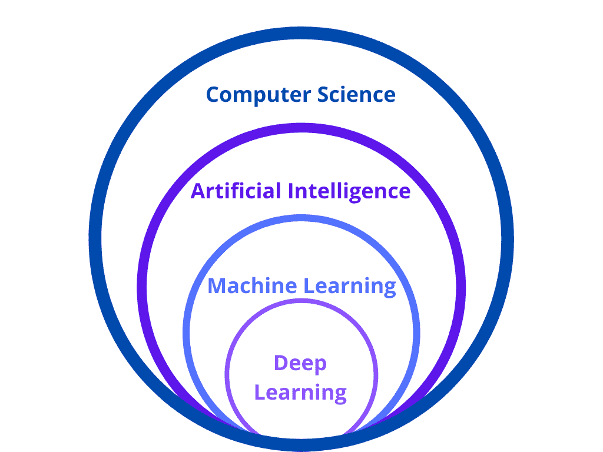
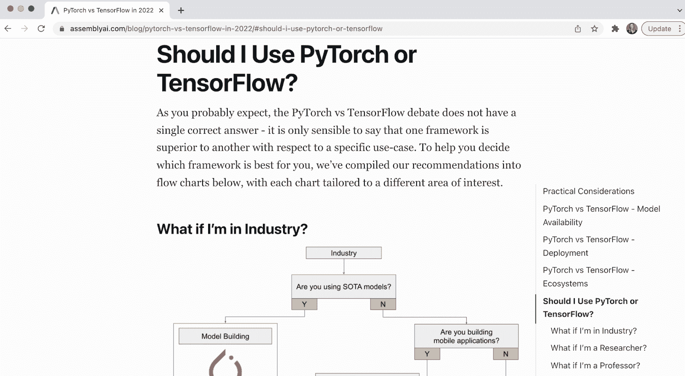
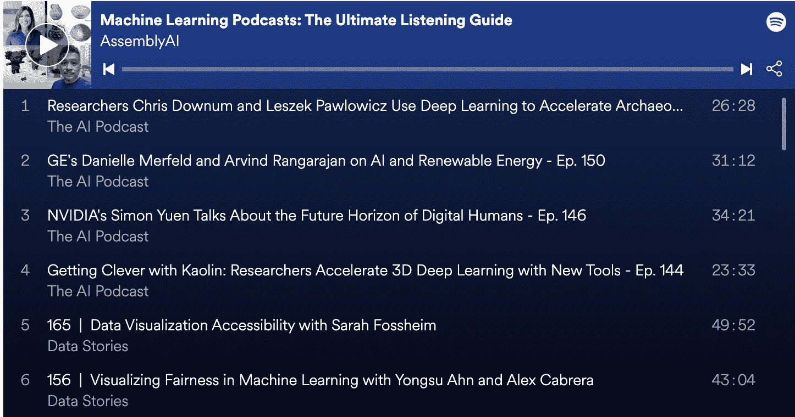
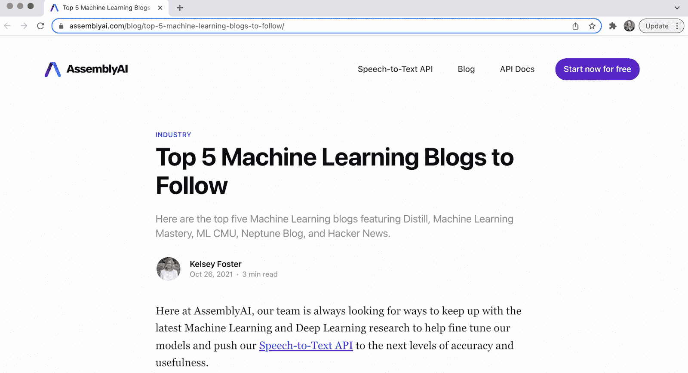
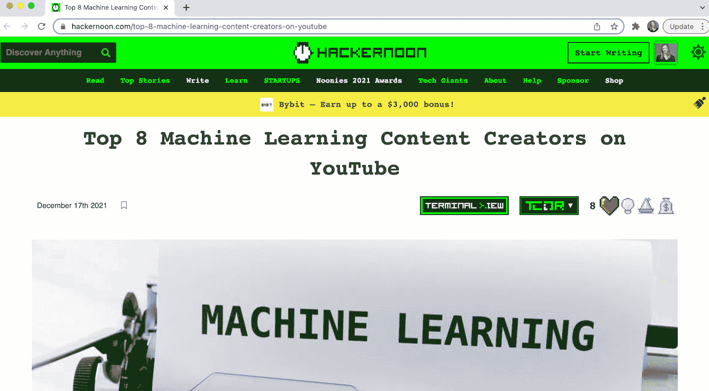
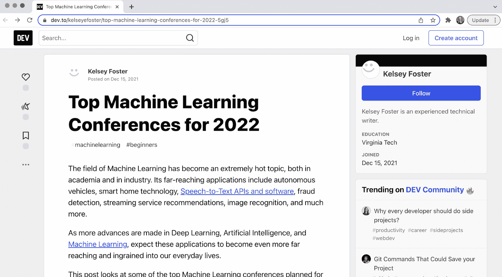

# 初学者的机器学习概念

> 原文：<https://www.assemblyai.com/blog/machine-learning-concepts/>

这门入门课程旨在通过简单易懂的视频讲解和教程，教你基本的机器学习和深度学习概念。

本课程分为三个主要模块:

*   机器学习导论
*   深度学习基础
*   附加 ML 资源

我们已经为轻松消费和概念掌握定出了课程进度，尽管您可以随意以您认为有意义的任何速度进行。如果您在学习过程中有任何问题，请不要犹豫，在我们的 [Discord channel](https://discord.gg/E7shJR5tV8) 上留下您的评论，我们会尽力澄清。

最后，如果您决定继续学习更高级的机器学习概念和应用，我们将为您提供一份附加资源列表。

我们开始吧！

## 机器学习导论

### 什么是机器学习？

机器学习是计算机科学和人工智能(AI)的一个分支，它使用数据和算法通过经验来教授和改进模型，有时受到人类自然学习和推断方式的启发。

机器学习不同于传统的编程建模，它利用大量的训练数据来理解数据中的潜在模式，这一过程被称为“学习”一旦经过训练，机器学习模型就可以对新的、以前从未见过的数据进行推断和预测。机器学习模型需要处理的训练数据越多，这些预测就越准确。

机器学习和深度学习领域的重大进步已经导致该技术广泛集成到日常任务和应用中。现在，你会发现机器学习正在为语音识别系统、[语音转文本 API](https://www.assemblyai.com/blog/the-top-free-speech-to-text-apis-and-open-source-engines/)、智能对话聊天机器人、自动股票交易代理、无人驾驶汽车、图像识别系统等提供动力。

第一个视频教程将涵盖监督机器学习、非监督机器学习、偏差和方差以及评估指标的基础知识。

### 监督机器学习

我们将从监督机器学习开始。这个视频将讨论什么是监督机器学习，例子，数据和训练，类型和算法。

[https://www.youtube.com/embed/Mu3POlNoLdc?start=5&feature=oembed](https://www.youtube.com/embed/Mu3POlNoLdc?start=5&feature=oembed)

### 无监督机器学习

现在你对有监督的机器学习有了一个基本的了解，我们将仔细看看*无监督的*机器学习。这个视频讲述了它是什么以及不同的方法和组件，包括聚类，K-means，离群点检测，潜在变量建模，等等。

[https://www.youtube.com/embed/yteYU_QpUxs?feature=oembed](https://www.youtube.com/embed/yteYU_QpUxs?feature=oembed)

### 最大似然偏差和方差

我们将继续讨论偏差和方差，这是数据科学和机器学习中的两个重要概念。在本视频中，我们将了解它们是什么，当您有高偏差或方差时会发生什么，以及如何解决这些问题。

[https://www.youtube.com/embed/nbY2KqXSsaE?start=2&feature=oembed](https://www.youtube.com/embed/nbY2KqXSsaE?start=2&feature=oembed)

### 评估指标

选择正确的评估指标对于机器学习模型的成功至关重要。此视频解释了不同的类型以及如何根据问题类型选择最佳类型。

[https://www.youtube.com/embed/LbX4X71-TFI?start=1&feature=oembed](https://www.youtube.com/embed/LbX4X71-TFI?start=1&feature=oembed)

## 深度学习基础

现在你对机器学习有了更多的了解，我们也将讨论深度学习的基础知识。虽然有时会与机器学习混淆，但深度学习实际上是机器学习的一个子集，它自动化了机器学习过程的元素，并使机器学习应用程序更具可扩展性。

本节将包括解释什么是深度学习、激活函数和神经网络中的反向传播、正则化和批量归一化的视频。

### 5 分钟深度学习

学习深度学习的基础知识，包括它是什么，它与人工智能和机器学习的关系，以及常见的深度学习应用。

[https://www.youtube.com/embed/dccdadl90vs?start=41&feature=oembed](https://www.youtube.com/embed/dccdadl90vs?start=41&feature=oembed)

### 神经网络中的激活函数

在本视频中，我们将探讨什么是激活功能，有哪些类型的激活功能，以及使用它们的原因和方法。

[https://www.youtube.com/embed/Fu273ovPBmQ?feature=oembed](https://www.youtube.com/embed/Fu273ovPBmQ?feature=oembed)

### 神经网络的反向传播

反向传播是需要理解的最重要的深度学习概念之一。在这段视频中，我们将了解它是什么，它是如何工作的，以及为什么它是训练过程中必不可少的组成部分。

[https://www.youtube.com/embed/LHLrXavT1gQ?feature=oembed](https://www.youtube.com/embed/LHLrXavT1gQ?feature=oembed)

### 神经网络的正则化

在这个视频教程中，我们将学习正则化的基本逻辑和最常用的技术来实现它。

[https://www.youtube.com/embed/EehRcPo1M-Q?feature=oembed](https://www.youtube.com/embed/EehRcPo1M-Q?feature=oembed)

### 神经网络的批量规范化

在我们的最后一个视频中，我们将看看批量标准化——训练神经网络时需要掌握的一个强大工具。

[https://www.youtube.com/embed/yXOMHOpbon8?feature=oembed](https://www.youtube.com/embed/yXOMHOpbon8?feature=oembed)

## 跟上 ML 的发展

在我们的最后一个模块中，我们为您的 ML 之旅留下了额外的资源，包括 Pytorch 和 TensorFlow 的概述，以及我们深度学习团队最喜欢的一些播客、博客和 YouTube 帐户。最后，我们列出了 2022 年顶级大规模会议的名单——如果你受到启发继续探索这个迷人的领域，大多数会议都有虚拟选项。

### 附加 ML 资源

**[该用 Pytorch 还是 TensorFlow？](https://www.assemblyai.com/blog/pytorch-vs-tensorflow-in-2022/#should-i-use-pytorch-or-tensorflow)**

#### [听机器学习播客](https://www.assemblyai.com/blog/machine-learning-podcasts-the-ultimate-listening-guide/)

#### [机器学习博客关注](https://www.assemblyai.com/blog/top-5-machine-learning-blogs-to-follow/)

#### [机器学习内容创作者观看](https://hackernoon.com/top-8-machine-learning-content-creators-on-youtube)

#### [要参加的机器学习会议](https://dev.to/kelseyefoster/top-machine-learning-conferences-for-2022-5gj5)

