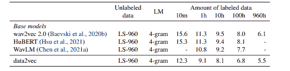

# 综述- data2vec:语音、视觉和语言自我监督学习的一般框架

> 原文：<https://www.assemblyai.com/blog/review-data2vec-a-general-framework-for-self-supervised-learning-in-speech-vision-and-language/>

本周的深度学习论文综述是 [data2vec:语音、视觉和语言自我监督学习的通用框架](https://ai.facebook.com/research/data2vec-a-general-framework-for-self-supervised-learning-in-speech-vision-and-language/)。

## 这篇论文有什么令人兴奋的地方

直到最近，自我监督学习技术(SSL)是在单一模式下开发的。这意味着自我监督学习算法从图像、语音、文本和其他模态中学习的方式存在很大差异。然而，data2vec 不再需要为不同的模态使用不同的方法。它是第一个对语音、NLP 或计算机视觉使用相同学习方法的 SSL 框架，并取得了最先进的结果。

## 主要发现

自我监督学习使计算机能够通过观察然后计算出图像、语音或文本的结构来学习。这种方法在伸缩方面有很多优势，特别是在低数据资源场景中，比如针对不同语言和方言的 [ASR](https://www.assemblyai.com/blog/what-is-asr/) 。今天对自我监督学习的研究几乎总是集中在一个特定的模式上。Data2vec 是第一个适用于不同模式的 SSL 框架。

data2vec 预测包含来自整个输入的信息的上下文化的潜在表示，而不是预测特定模态的目标，如单词、视觉标记或人类语音的局部性质。

Data2vec 通过训练模型来预测它们自己的输入数据的表示，而不考虑模态，从而进行了简化。核心思想是基于使用标准[变压器架构](https://www.assemblyai.com/blog/an-overview-of-transducer-models-for-asr/)的自蒸馏设置中输入的屏蔽视图，预测全部输入数据的潜在表示。通过关注这些表示——神经网络的层——而不是预测视觉符号、单词或声音，单个算法可以处理完全不同类型的输入。这消除了在学习任务中对特定模态目标的依赖。

Data2vec 使用教师网络首先从一幅图像、一段文本或一段语音计算目标表示。然后，他们屏蔽部分输入，用学生网络进行处理，然后预测老师的潜在表现。学生模型必须预测全部输入数据的表示，即使它只有部分信息的视图。教师网络与学生模型相同，但权重稍微有些过时。

例如，在语音方面，最流行的 SSL 方法是 wav2vec 2.0 和 HuBERT。Wav2vec 2.0 和 HuBERT 离散化表示以训练模型。代替这个数据，2vec 直接预测没有量化的上下文化的潜在表示。这导致了比 Librispeech 数据集中当前最先进的结果更好的结果。

## 结果

作为一家语音公司，我们对语音的 SSL 结果非常感兴趣。在 Librispeech test-other 测试集上，Data2vec 的性能似乎优于其他最先进的 SSL 方法。这些模型在来自 Librispeech (LS-960)的 960 小时音频上作为未标记数据进行训练。

在我们看来，data2vec 非常有趣，由于其简单性和可推广性，它具有更大的潜力。

## 参考

*   [https://discount-sjc 3-1 . xx . fbcdn . net/v/t39.8562-6/27974914 _ 4812057492438 _ 42395522333336653600 _ n . pdf？_ NC _ cat = 107&CCB = 1-5&_ NC _ sid = AE 5e 01&_ NC _ OHC = b0n 352 vdpugax 9 uxlyu&_ NC _ ht = discount-sjc 3-1 . xx&oh = 00 _ at _ r4k 587 qukpyi 6 fqtdkax 55 N2 x7](https://scontent-sjc3-1.xx.fbcdn.net/v/t39.8562-6/271974914_483120576492438_4239522333319653600_n.pdf?_nc_cat=107&ccb=1-5&_nc_sid=ae5e01&_nc_ohc=B0n352vDpUgAX9UXlyu&_nc_ht=scontent-sjc3-1.xx&oh=00_AT_r4K587qUKPYI6fQPtdkaX55n2x7WRH6ifbtEe6PyOGw&oe=61F5F211)
*   [https://ai . Facebook . com/blog/the-first-high-performance-self-supervised-algorithm-for-speech-vision-and-text/](https://ai.facebook.com/blog/the-first-high-performance-self-supervised-algorithm-that-works-for-speech-vision-and-text/)
*   [https://ai . Facebook . com/research/data 2 vec-a-general-framework-for-self-supervised-learning-in-speech-vision-and-language](https://ai.facebook.com/research/data2vec-a-general-framework-for-self-supervised-learning-in-speech-vision-and-language)