# 使用 Keras 的变分自动编码器简介

> 原文：<https://www.assemblyai.com/blog/introduction-to-variational-autoencoders-using-keras/>

对**区别性**模型的研究是机器学习领域的一个常见切入点。判别模型学习定义数据集的一个要素如何依赖于其他要素的分布。然后，这种分布可以用于*区分数据点之间的*，例如，通过将数据集划分为类。

除了判别模型，还存在**生成**模型。生成模型不是学习定义数据集的特征如何相互依赖的*分布，而是学习*自己生成*特征的分布。然后，该分布可用于生成与训练数据相似的新*数据*。**变分自动编码器**，一类深度学习架构，是生成模型的一个例子。*

**变型自动编码器**的发明是为了实现数据生成的目标，自 2013 年[推出](https://arxiv.org/abs/1312.6114)以来，由于其令人印象深刻的结果和基本的简单性，受到了极大的关注。下面，你会看到两个人脸的图像。这些图像不是真实的人——它们是使用 [VQ-VAE 2](https://arxiv.org/abs/1906.00446) 生成的，这是一个 DeepMind 变分自动编码器(VAE)模型。

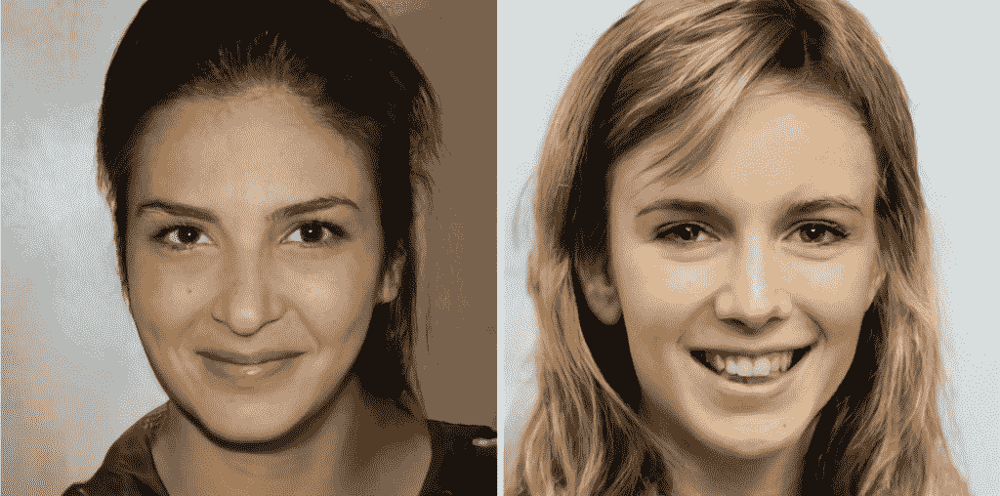

[Image source](https://arxiv.org/abs/1906.00446)

在本教程中，我们将探索**变型自动编码器如何简单而有力地扩展它们的前辈**，普通的自动编码器，以解决数据生成的挑战，然后**用 Keras** 构建并训练 **变型自动编码器，以理解并可视化 VAE 如何学习。我们开始吧！**

如果你想直接跳到代码，你可以这样做[这里](https://www.assemblyai.com/blog/variational-autoencoders-for-dummies/#building-a-variational-autoencoder)。

## 介绍

生成模拟训练集分布的令人信服的数据是一项困难的任务，其中包含的几个特性使其成为一个独特的挑战性问题。这项任务是无人监督的，因此我们必须将数据视为分布的代表*。也就是说，我们需要充分地确定数据的底层结构，以便我们能够利用它来生成令人信服的伪造品，而不是对数据点执行操作，作为点*本身*来完成一些有价值的目标*本身*，例如用 K-Means 进行聚类。给定一百万张人脸图片，我们如何训练一个可以自动输出人脸真实图像的模型？*

回想一下**自动编码器** (AEs)是一种限制身份图学习的方法，目的是找到数据集的低维表示，这对降维和数据压缩都很有用。虽然自动编码器是实现这些目的的强大工具，但它们的学习目标并不是为了让它们能够生成与训练集非常相似的数据。

**变型自动编码器**通过对*如何*学习身份图设置约束，扩展了自动编码器的核心概念。这些约束导致了表征低维空间的 VAEs，称为**潜在空间**，足以使它们**对数据生成**有用。vae 将潜在空间表征为在训练数据中看到的突出特征的*景观，而不是像 AEs 那样作为简单的数据嵌入空间。*

在接下来的章节中，我们将首先探索普通的自动编码器是如何工作的，然后检查它们与变化的自动编码器有何不同。我们将获得为什么这些差异导致 VAEs 非常适合数据生成的直觉，并最终**通过训练一个变分自动编码器使用 MNIST 时装数据集生成服装图像**将我们的知识付诸实践！让我们首先提醒自己什么是*普通*自动编码器。

## 什么是自动编码器？

在许多与数据相关的领域中，学习您正在处理的数据的压缩表示通常是有益的。您可以使用这些低维表示来提高其他机器学习任务的计算效率，或者提高数据存储的空间效率。虽然知道数据集的压缩表示显然是有益的，但是我们如何*发现*实现这种压缩的映射呢？

自动编码器是一类神经网络架构，它学习将输入映射到压缩潜在空间表示的**编码函数**，以及从潜在空间映射回原始空间的**解码函数**。理想情况下，这些功能是彼此完全相反的——将数据通过编码器，然后将结果通过解码器，在所谓的**无损**压缩中完美地重建原始数据。

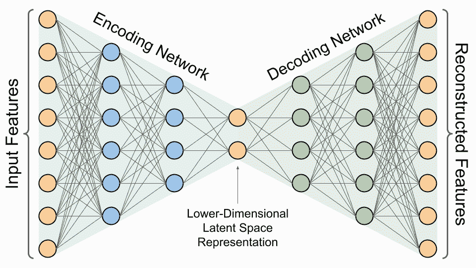

Network Architecture for an Ordinary Autoencoder

关于自动编码器的一个非常方便的事实是，假设它们是神经网络，它们可以利用专门的网络架构。虽然有一些降维方法在受欢迎程度方面已经取代了自动编码器，如 PCA 和随机投影，但自动编码器对于图像压缩等任务仍然有用，在这些任务中，ConvNets 可以捕获数据中的局部关系，而 PCA 不能。

例如，我们可以使用卷积层将 MNIST 手写数字映射为压缩形式。

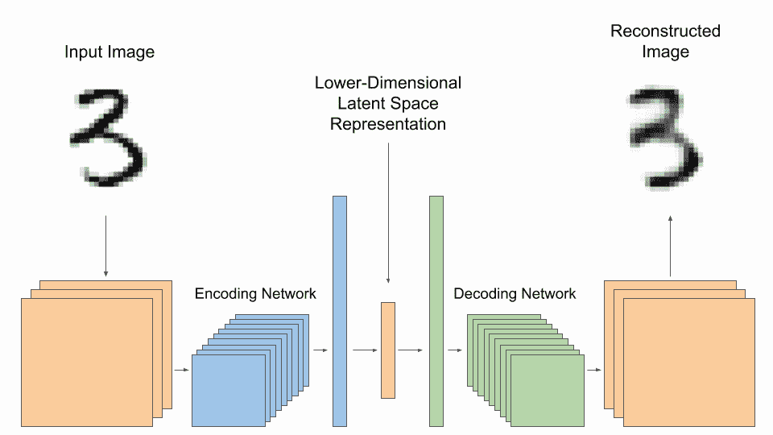

Network Architecture for a Convolutional Ordinary Autoencoder

自动编码器实际上是如何执行这种压缩的？网络中的卷积层**提取每个数字的显著特征**，比如一个 8 是闭的有两个环，一个 9 是开的有一个环。然后，一个完全连接的网络将这些特征映射到一个较低维度的潜在空间，根据图像中哪些特征存在以及在什么程度上存在，将这些特征放置在这个空间中。如果我们已经将图像映射到一个代表性的特征空间，我们能不能不使用这个空间来生成图像*？*

### *自动编码器可以用于数据生成吗？*

*人们可能会假设卷积自动编码器足够充分地表征了潜在空间以生成数据。毕竟，如果我们将数字映射到潜在空间中的“意义”，那么我们所要做的就是在这个潜在空间中选取一个点，并解码它的“意义”，以获得一个生成的图像。*

*可惜这个方法行不通。正如我们将看到的，自动编码器针对**忠实重建**进行了优化。这意味着自动编码器学习使用潜在空间作为嵌入空间来创建最佳压缩，而不是学习将潜在空间全局表征为表现良好的特征景观。我们可以在下图中看到这个模式的简化版本，其中我们的原始空间是三维的，而我们的潜在空间是二维的。请注意，MNIST 数字的原始空间实际上有 784 个维度，但下面使用了三个维度进行可视化。*

*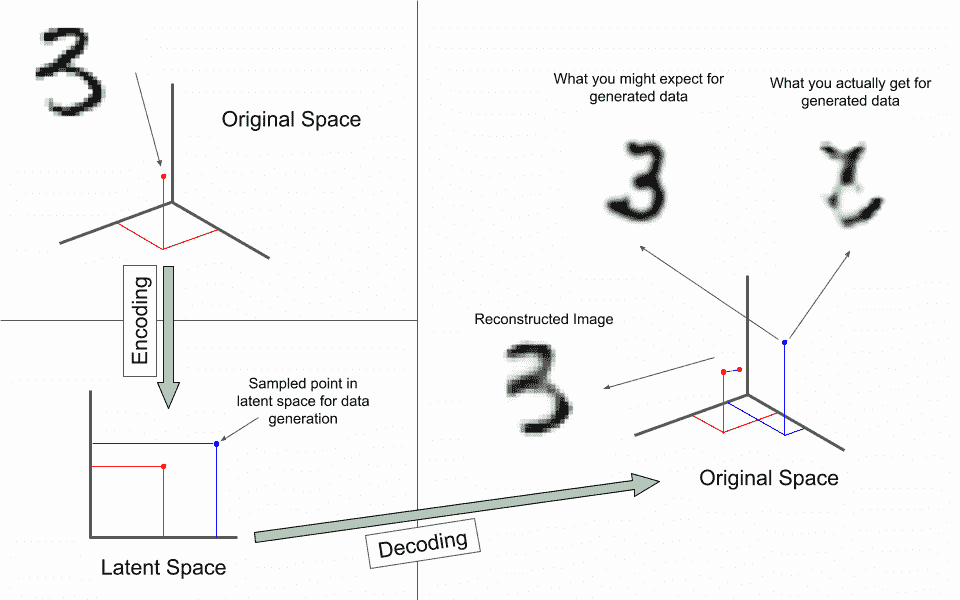

Data Generation Process with Ordinary Autoencoders* 

*我们可以看到，重建的图像没有精确地映射到输入图像在原始空间中的位置。这两点之间的非零距离是重建图像看起来不完全像原始图像的原因。这个距离称为**重建损耗**，用两个红点之间的紫色线表示。*

*我们还可以看到，随机采样潜在空间中的一个点(即*潜在向量*)并将其通过解码器输出的图像看起来不像数字，这与我们的预期相反。*

### *但是*为什么*这个不行？*

*为了理解**为什么**自动编码器不能生成充分模仿训练集的数据，我们将考虑一个例子来发展我们的直觉。考虑以下一组二维数据点:*

*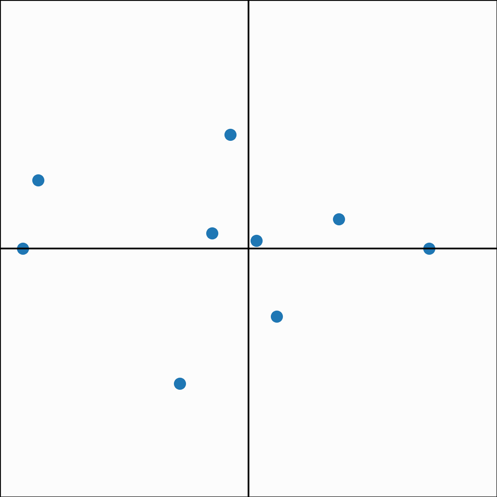

Two-Dimensional Data Points* 

*自动编码器如何学会将这些数据压缩到一维？回想一下，神经网络是连续函数的组合。因此，原则上，神经网络可以表示任何连续函数。假设我们网络的**编码器**学习如下插值点:*

*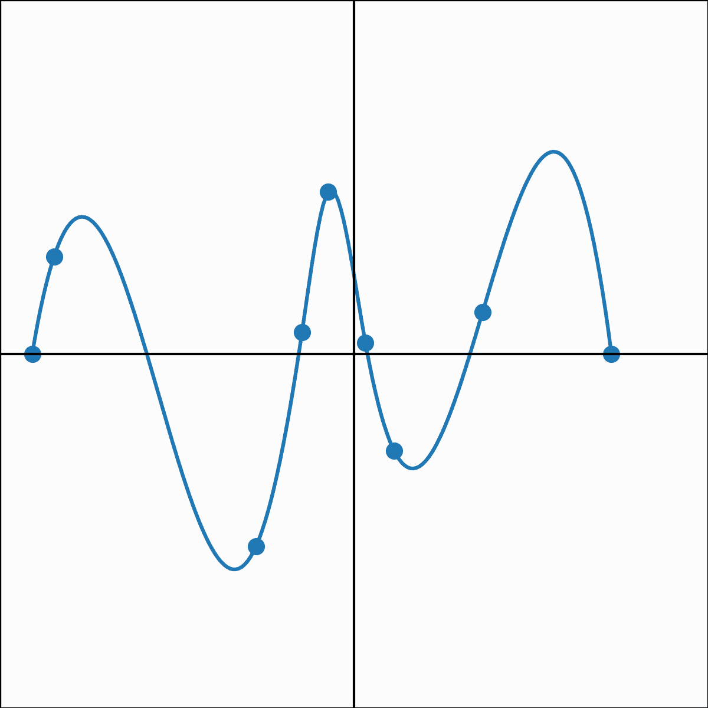

Data Points with Interpolated Curve* 

*然后通过使用沿着该曲线**的点的路径距离**作为它们在一维空间中的位置，通过**将数据压缩到一维。下面你可以看到这是如何工作的。两点的路径距离在左边的二维空间中显示为红色和绿色曲线。这些曲线的长度表示从相同的点到右边一维空间(沿 x 轴)原点的距离。***

*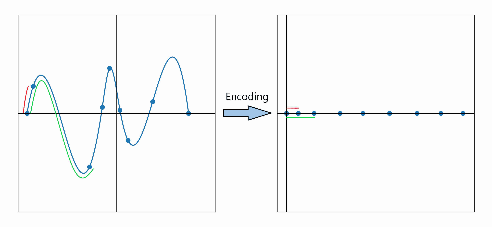

Encoding to One-Dimension Based on Interpolated Curve Path Distance* 

*解码器将学习该映射的逆映射，即将从潜在一维空间中的原点*向后*的距离映射到二维空间中沿着曲线的距离。*

*从这里开始，**生成数据**似乎是一项简单的任务——我们只需选择一个随机的潜在向量，让解码器完成它的工作:*

*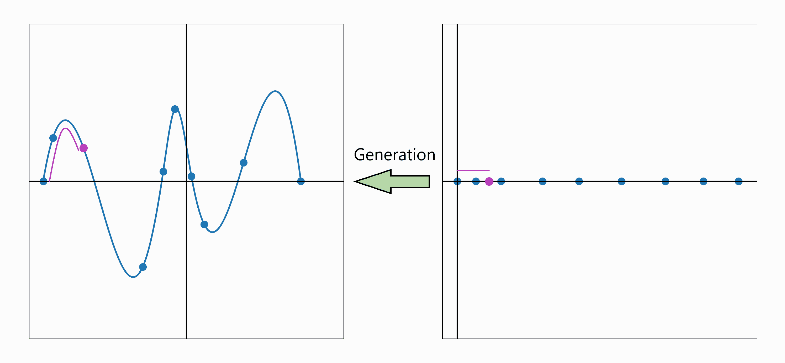

Generation in Two-Dimensions Based on Interpolated Curve Path Distance* 

*就这么简单！对吗？*

*不对。虽然*看起来*像是我们可能击中了要害，**我们只学会了在原始空间**中沿着我们的插值曲线生成点。我们的网络刚刚学习了原始空间中的*一条*这样的曲线，它可以代表数据的*真实*潜在分布。二维空间中有无限多条曲线对我们的数据点进行插值。让我们假设真实的基本分布如下:*

*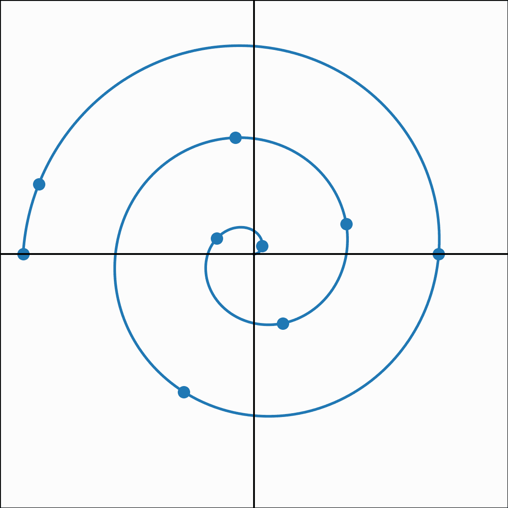

True Underlying Generative Curve* 

*然后我们的编码解码模式*没有理解数据*的底层结构，使得我们的数据生成过程存在固有的缺陷。如果我们取之前生成的数据点，我们可以看到它不在真正的生成曲线上(此处显示为橙色),因此表示生成的数据质量差，没有模拟真正的数据集。如果我们继续从我们的真实曲线(橙色的)*无限采样*，我们将**永远不会**得到生成的点。在*我们可以采样的任何*真实点和我们生成的点之间的距离有一个非零的最大下界。*

*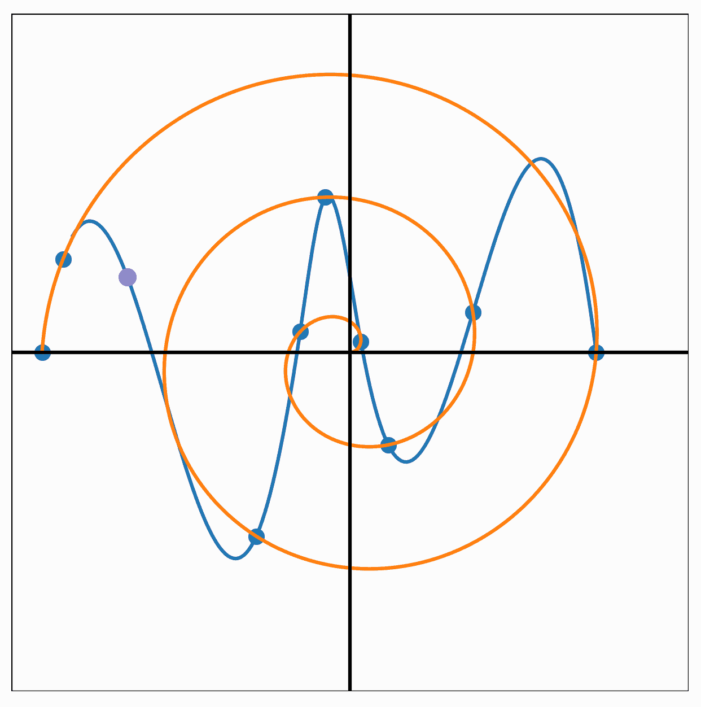

Previous Data Generation Method Fails to Create Convincing Data* 

*在上面的例子中，我们的 Autoencoder 为我们看到的数据学习了一种高效无损的压缩技术，但是这并没有使它对数据生成有用。我们不能保证解码器在整个潜在空间的行为-自动编码器只寻求最小化重建损失。如果我们*知道*数据是从螺旋分布中采样的，我们可以在我们的编码器-解码器网络上设置**约束**来学习更适合数据生成的插值曲线。*

*一般来说，我们不知道构成数据分布的子结构的确切形式，但是我们是否仍然可以使用这种概念来约束学习过程，以便定制对数据生成有用的自动编码器？*

## *什么是变分自动编码器？*

*虽然上面的例子只是一个开发我们直觉的玩具例子，但从中可以得到两个重要的启示。第一个是，在所有可能的对数据压缩有用的编码-解码器序列中，只有其中的一个 T2 子集产生对数据生成有用的解码器。第二个是，一般情况下，我们**并不知道** ***先验*** **数据**的底层结构，以这样一种可利用的方式。我们如何约束我们的网络来克服这些问题？*

*变型自动编码器通过一个简单但至关重要的区分因素来完成这一挑战——它们不是将输入数据映射到潜在空间中的*点*,而是映射到描述*的分布*参数的*,其中*数据根据其特征“应该”被映射(概率上)到潜在空间中。*

*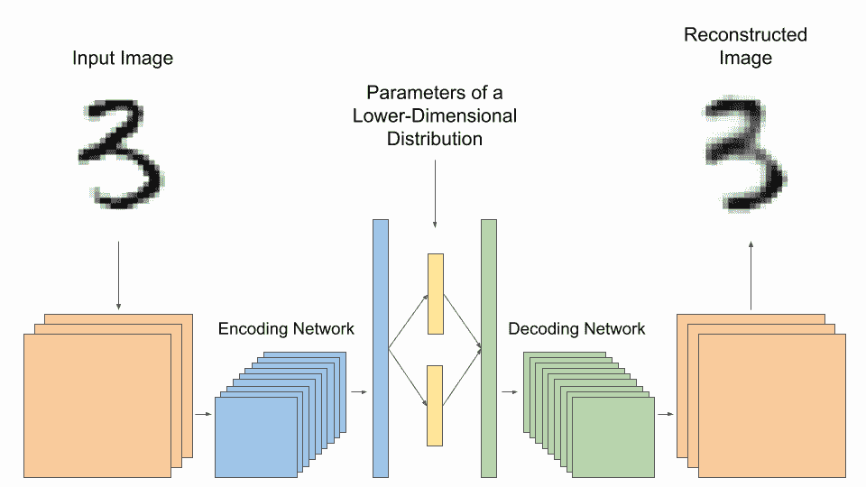

Network Architecture for a Convolutional Variational Autoencoder* 

*因此，VAE 并不简单地试图将数据嵌入潜在空间，而是将潜在空间表征为 T2 特征景观，这一过程使得潜在空间在数据生成方面表现良好。我们不仅可以使用这个场景来生成*新的*数据，我们甚至可以修改*输入*数据的显著特征。例如，我们不仅可以控制*图像中的*人脸是否在微笑，还可以控制微笑的*类型*和*强度*:*

*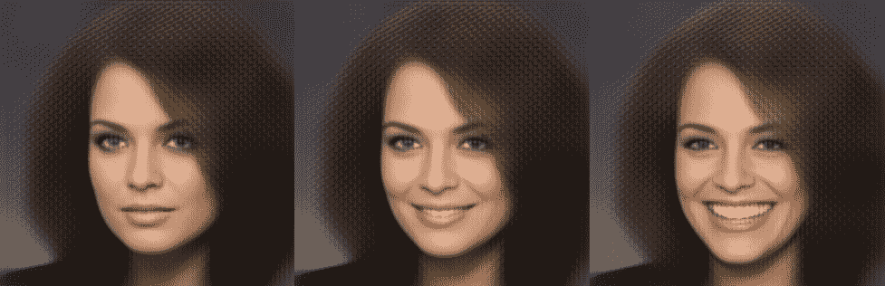

Image adapted from [source](https://arxiv.org/pdf/1609.04468.pdf)* 

## *用 MNIST 理解变分自动编码器*

*为了理解 VAEs 是如何工作的，让我们看一个具体的例子。我们将介绍一个喀拉斯·VAE 是如何学会将潜在空间描述为 MNIST 手写数字数据集的特征景观的。MNIST 数字集包含数万个 28 x 28 像素的数字灰度图像。[这里的](https://camo.githubusercontent.com/01c057a753e92a9bc70b8c45d62b295431851c09cffadf53106fc0aea7e2843f/687474703a2f2f692e7974696d672e636f6d2f76692f3051493378675875422d512f687164656661756c742e6a7067)是一些让你熟悉[1](https://www.assemblyai.com/blog/variational-autoencoders-for-dummies/#footnotes) 的示例图片。让我们从一些基本假设开始。*

### *问题设置*

1.  *首先，让我们假设编码器网络中的**卷积特征提取器**已经被**训练过**。因此，编码器正在学习如何将提取的特征映射到分布参数。*
2.  *最初，潜在向量被解码成无意义的白噪声图像。所以，假设我们的**解码器网络是部分训练的**。这意味着潜在空间被部分表征，因此我们解码的图像清晰可辨，并有一定的意义。*
3.  *我们**将潜在空间的维度设置为等于两个**,这样我们就可以将它可视化。也就是说，生成的图像在我们的 2D 平面中的位置在空间上对应于被解码以产生图像的潜在空间中的点。*
4.  *最后，让我们假设我们的编码器网络映射到具有对角对数协方差矩阵的**多元高斯分布参数**。*

*有了我们的基线假设，我们可以继续理解变分自动编码器如何在引擎盖下学习！*

### *六码训练*

*给定我们的上述假设，让我们假设我们正在将一个[六个](https://www.saraai.cimg/blog/mnist1.png)的图像输入到我们的 Keras VAE 用于训练[2](https://www.assemblyai.com/blog/variational-autoencoders-for-dummies/#footnotes) 。我们的编码器网络从数字中提取显著特征，然后将它们映射到潜在空间中的多元高斯分布参数。在我们的例子中，这些参数是一个**长度的两个均值向量**和一个**长度的两个对数协方差向量**。*

*下面你可以看到我们的二维潜在空间被可视化为一个平面。红点表示我们的输入图像映射到的分布的**平均值**，红色曲线表示该分布的 **1-sigma 曲线**。*

***现在，我们对此分布进行采样，并将结果数据点传入解码器**。相对于这个随机产生的点测量误差*。正是*这种*差异区分了普通的和变化的自动编码器，也使得 VAEs 对数据生成有用。随机采样的点在下图中用绿点表示。**

*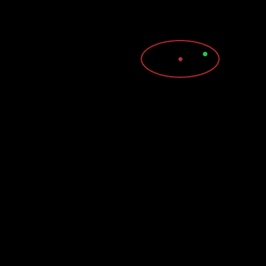

Distribution of Encoded Image (Red), Randomly Sampled Point (Green)* 

*我们假设我们的解码器接受了部分训练。因此，由于“看起来像”6 的输入图像被我们的编码网络映射到该区域，我们的解码网络将学习将该区域与具有在 6 中看到的显著特征的图像(以及类似的数字，这将在后面相关)相关联。**这意味着我们的解码器会将上面随机采样的绿点转换成具有六个**显著特征的图像。下面你可以看到我们已经用相应的解码图像替换了绿点。*

*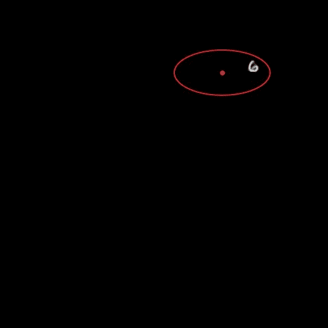

Decoded Image of Randomly Sampled Point* 

*由于这个图像看起来类似于我们的输入图像 6，所以**损失将会很低**，告诉网络它在表征潜在空间的这个区域方面做得很好，它代表了在类似 6 的图像中看到的显著特征。*

### *一对一训练*

*进一步在训练期间，让我们说一个[一个](https://www.researchgate.net/publication/357264093/figure/fig4/AS:1104243293454336@1640283525386/Example-1-of-MNIST-M-1-digit-one.png)的图像被输入到我们的网络 [3](https://www.assemblyai.com/blog/variational-autoencoders-for-dummies/#footnotes) 。出于示例的目的，让我们假设编码器网络将图像的提取特征映射到如下所示的分布参数，其中红点再次表示分布的**均值**，红色曲线表示其 **1-sigma** 曲线。*

*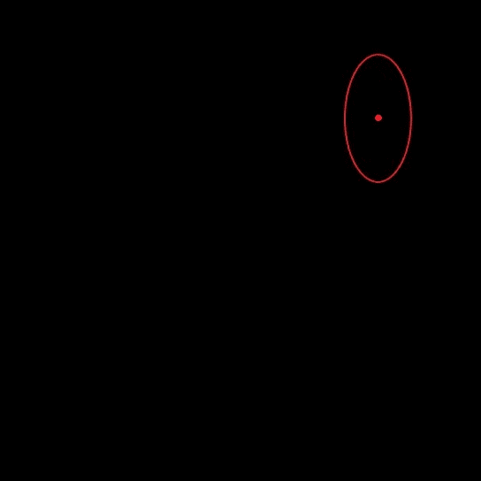

Distribution of Encoded Image* 

*请注意，这些分布参数将大部分分布落在我们之前看到代表(并因此解码为)six-like 图像的区域中。再次，将从该区域随机采样一个点，并传递给解码器以计算损失。记住，解码器并不*先验地*知道该点是从与输入图像相关的分布中采样的。**解码器看到的只是潜在空间区域中的一个点，该点具有在图像中看到的类似“6”的特征**，因此当从该分布中随机采样一个点时，该点将被解码为类似如下:*

*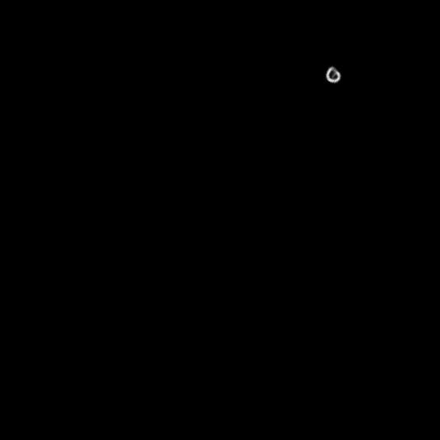*

*回想一下，我们最初的输入是一个**一个**。由于解码图像看起来*不*像 1，**损失将非常高**，并且 VAE 将调整编码器网络以将 1 映射到该区域附近**不**的分布参数。*

### *零起点训练*

*让我们继续最后一个训练示例，假设我们有一个零的输入图像，它再次被编码为分布参数，最终在“类六区域”附近随机采样。假设我们对下面的点进行采样，该点已被解码为相应的图像:*

*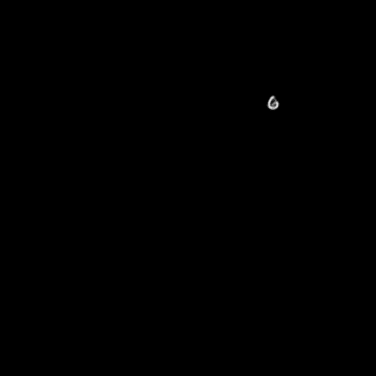*

*“ **6”和“0”在显著特征上比“6”和“1”**要“接近”得多——它们都有一个循环，可以相对容易地从一个连续转换到另一个 [4](https://www.assemblyai.com/blog/variational-autoencoders-for-dummies/#footnotes) 。因此，我们的解码图像**可以合理地解释为 6 或 0**。事实上，如果您仔细观察，您会发现 6 和 0 共享的曲线在解码图像中很强(红色轮廓)，而 0 独有的曲线(蓝色轮廓)和 6 独有的曲线(绿色轮廓)较弱。*

*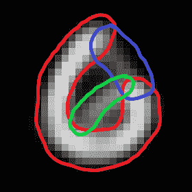*

*鉴于 6 和 0 有许多共同的显著特征，**损失仍然相对较小，**即使该图像可以合理地解释为 6 或 0。*

*因此，潜在空间的这个一般区域将开始代表六和零，因为它们具有相似的特征。在代表“纯”6 和“纯”0 的潜在空间点之间(即明显是 6 的形状，不能被解释为 0，反之亦然)，变分自动编码器将学习将中间点映射到图像，这些图像可以*合理地*被解释为“6”或“0”。中间点的解码产生从一个形状到另一个形状的连续变换的快照。*

*我们最终将得到一个局部补丁，如下图所示，其中这些变换是可以直接观察到的:*

*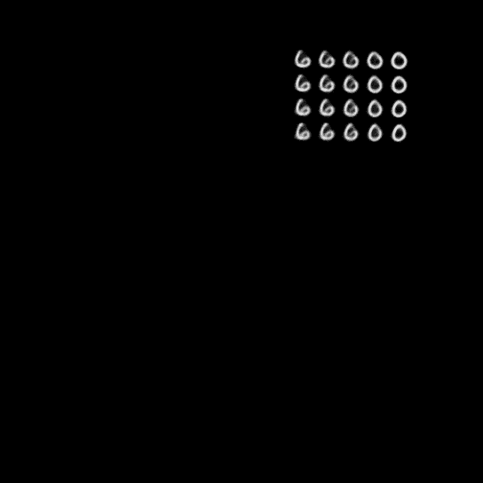*

### *表征其余的潜在空间*

*在整个潜在空间的训练期间，将对每个图像重复上述过程。看起来不像 6 或 0 的图像会被推开，但**会以同样的方式与相似的图像**聚集在一起。下面我们看到一个代表 9 和 7 的补丁，一个代表 8 和 1 的补丁。*

*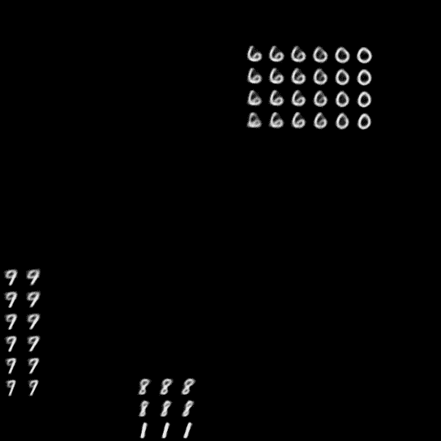*

*当我们在整个数据集上继续这个过程时，我们将观察*全球*组织。我们在上面看到了在*局部*面片上的良好行为是如何出现的，但是这些局部面片必须以在每一点都“工作”的方式修补在一起，这意味着特征区域之间的**连续过渡。因此，我们得到了潜在空间中任意两点之间的路径，沿着该路径在它们的特征之间具有连续的过渡。***

*下面你可以看到一个连接 8 和 6 的路径的例子。路径上的许多点创建了令人信服的数据，包括看起来像五、三和二的图像:*

*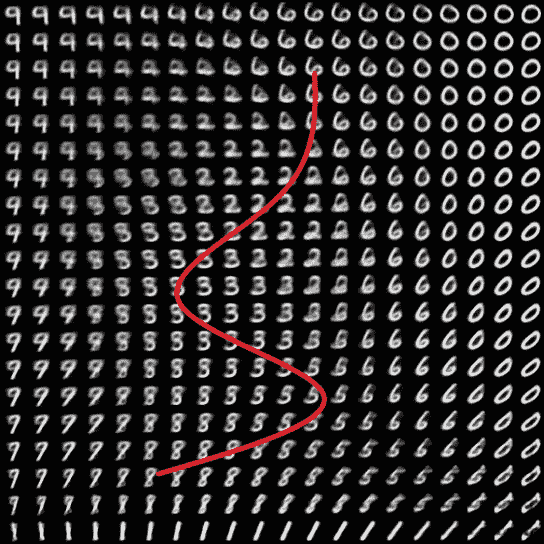*

*我们想再一次强调，我们的潜在空间被描述为一个*特色*景观，**而不是**作为一个*数字*景观。解码器甚至不知道“数字”是什么，因为 MNIST 数据集中的标签信息从未出现在训练过程中，但解码器仍然可以*创建令人信服的数字图像。因此，我们可以得到如下图，其中每个显著特征与一个特定的轨迹相关联:**

*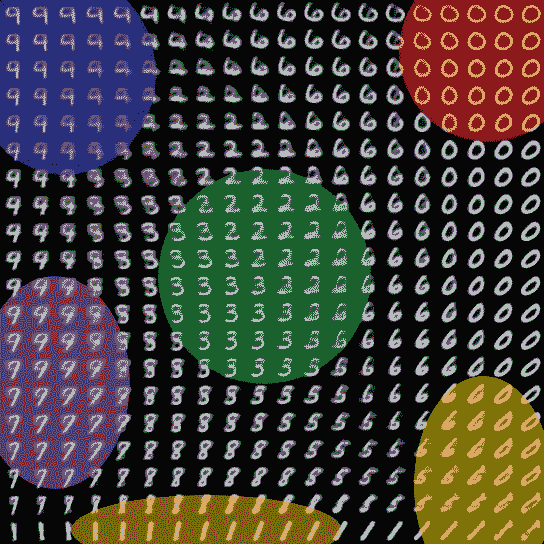*

*这些位点中的一些已经在图像中突出显示。让我们描述一下与每个位点相关的显著特征:*

*   *红色=纯连通回路*
*   *蓝色=用线连接的回路*
*   *绿色=多个开环*
*   *紫色=角形*
*   *橙色=纯垂直线*
*   *黄色=倾斜线，部分打开*

*记住，上面的网格是我们二维潜空间的一个**直接解码**。*在我们的训练数据集中，没有一个网格中的数字图像是直接可见的——它们只是 VAE 学习的数据集中显著特征的代表。**

## *用 Keras 构建变分自动编码器*

*现在我们从概念上理解了变分自动编码器的工作原理，让我们动手用 Keras 构建一个变分自动编码器吧！我们将使用 [**时尚 MNIST 数据集**](https://github.com/zalandoresearch/fashion-mnist) ，而不是使用数字，它有不同服装项目的 28 乘 28 灰度图像。*

### *设置*

*首先，一些进口让我们开始。*

| 来自【ipython】【进口】 【显示】 as【TF】  【进口】【tensorlow _ probability】as |

*让我们使用 TensorFlow 内置的`fashion_mnist`数据集导入数据。我们展示了一个示例图像，在本例中是一只靴子，以了解图像的样子。*

| (train_images，_)，(test_images，_)= TF . keras . datasets . fashion _ mnist . load _ data()    PLT . imshow(train _ images[0，::]，cmap =' gray _ r ')  PLT |

*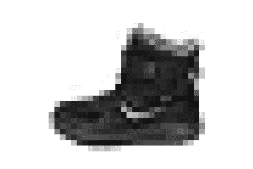*

*我们用伯努利分布对每个像素建模。回想一下，伯努利分布等价于 n=1 的二项式分布，并且它模拟了具有二元结果的实验的单一实现。在这种情况下，随机变量𝝌的值对应于像素是“开”还是“关”。也就是说，𝝌=0 表示全白像素(像素强度= 255)，1 表示全黑像素(像素强度=0)。请注意，上面的颜色映射是颠倒的，所以如果像素值看起来颠倒了，请不要混淆。*

*我们**将我们的像素值**缩放到范围【0，1】内，然后**用** **0.5** 的**阈值将它们二值化**，之后我们显示上面二值化后的示例图像。*

*最后，我们初始化一些相关变量，并从数据中创建数据集对象。dataset 对象将数据打乱，并将其分段成批*

| def 预处理 _ images(images):  images = images . shape(【images . shape】0， 28 ， 28 ，1)/)  returnNP . where(图片>1.00.0)。astype(【float 32】)    train _ images =预处理 _ 图像(train _ images)  test _ images =预处理 _ 图像(test _ images) plt.axis( 【关】 )PLT . tight _ layout()    train _ size = train _ images . shape[0 batch _ size =  test _ size = test _ images . shape[0】shuffle(train_size)。batch(batch _ size))  test _ dataset =(TF . data . dataset . from _ tensor _ slices(test _ images)  。洗牌(test_size)。批处理(batch_size)) |

*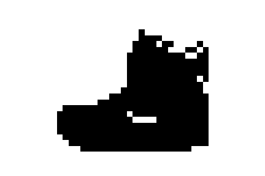*

### *定义可变自动编码器*

#### *编码器网络*

*现在我们可以继续定义 Keras 变分自动编码器模型本身。首先，我们定义编码网络，它是一个简单的具有 ReLU 激活的卷积层序列。注意，最终卷积**没有**激活。具有卷积层的 VAEs 有时被称为“CVAEs”——卷积变分自动编码器。*

*我们网络的最后一层是一个密集层，它的编码是我们潜在空间的两倍。记住，我们是映射到**参数**来定义我们潜在空间的分布，而不是*到*潜在空间本身。对于这些分布，我们使用具有对角对数协方差矩阵的高斯分布。因此，我们的编码器的输出必须产生用于这种分布的参数，即具有相同潜在空间维度的**均值向量**，以及具有相同潜在空间维度的**对数** **方差向量**(其表示对数协方差矩阵的对角线)。*

| 班【cvae】(TF . keras . model):
"    【def】【init _ _ _ _ _ _ _ _ _ init _(【self . latent _ dim = latent _ dim】
【self . encoder = TF . keras . sequential(  )，激活= 【继电器】 ， 【TF . keras . layers . conv 2d |

#### *解码器网络*

*接下来是定义我们的解码器网络。与用于分类网络的完全连接到 softmax 序列不同，我们的解码器网络有效地反映了编码器网络。自动编码器具有令人愉快的对称性——编码器学习映射到潜在空间的函数 *f* ;解码器学习从潜在空间映射回原始空间的反函数 *f-1* 。Conv2DTranspose 层提供可学习的上采样来反转卷积层。*

| self . decoder = TF . keras . sequential(   TF . keras . layer(input _ shape =(latent _ dim)， TF . keras . layers . dense(units =7*7  TF . keras . layers . conv 2d transpose(  filters =64，kernel _ size =3，stamps =2，padding= 【相同】 大步数= 2 ，填充数= 【相同】 激活=【relu】)  |

#### *正向传递函数*

*变分自动编码器的训练不像自动编码器那样简单，在变分自动编码器中，我们通过网络传递输入，获得重建损失，并通过网络反向传播损失。变化的自动编码器需要更复杂的训练过程。这从向前传球开始，我们现在来定义一下。*

##### *编码功能*

*要对图像进行编码，我们只需将图像通过编码器，但要注意我们会将输出分成两部分。回想一下上面的内容，我们正在将输入编码到一个向量中，该向量的维度是潜在空间维度的两倍，因为我们正在映射到定义了如何从潜在空间中采样进行解码的 T2 参数。*

*在操作上，这些参数向量的定义发生在这里——我们**将我们的输出分成两个向量**，每个向量具有相同的潜在空间维度。第一个向量表示我们的多元高斯在潜在空间中的平均值，第二个向量表示同一高斯的对角对数协方差矩阵的方差。*

| defencode【self，x】:  mean，logvar = tf.split(self.encoder(x)，num _ or _ size _ splits =2，axis =1)  |

##### *重新参数化函数*

*回想一下，我们不是直接对编码输入*进行解码*，而是使用编码来定义*我们如何从潜在空间中采样*。相反，我们解码潜在空间中的一个点，该点是根据由我们的编码网络输出的参数定义的分布随机采样的。人们可能想简单地使用`tf.random.normal()`来采样这样一个点；但是请记住，我们正在训练我们的模型，这意味着我们需要执行反向投影。这是有问题的，因为 *backprop 不能流过随机进程*，所以我们必须实现所谓的**重新参数化技巧**:*

*我们定义了另一个随机变量，它在我们的均值和对数方差向量中是**确定的。它将这两个向量作为参数，但它通过对数方差向量与一个向量的 Hadamard 乘积来保持随机性，该向量的分量是从标准正态分布中独立采样的。这个技巧允许我们在采样中保持随机性，同时*仍然允许反向脉冲流过我们的网络*，这样我们就可以训练我们的网络。Backprop 不能流过产生 Hadamard 乘积中使用的随机向量的过程，但这无关紧要，因为我们不需要训练这个过程。***

| def 重新参数化 (self，mean，logvar):  EPS = TF . random . shape  returnEPS * TF . exp(logvar *. 5 |

##### *解码功能*

*给定一个潜在空间点，**解码就像通过解码器网络**传递该点一样简单。我们允许选择直接输出逻辑或其 sigmoid。默认情况下，出于数值稳定性的考虑，我们*而不是*使用 sigmoid，这将在后面强调。*

| defdecode(self，z，apply _ sigmoid = False):  logits = self . decode(z)  ifapply _ sigmoid:  probs = TF . sigmoid |

##### *抽样函数*

*给定分布的重新参数化采样，采样函数只对输入进行解码。如果没有提供这样的输入，它将在从标准正态分布中采样的潜在空间中随机输入 100 个点。*

*用`@tf.function`修饰该函数是为了将函数转换成图形以便更快地执行。*

| @ TF . function  defsample(self，z = None):  ifzNone::) |

### *损失计算*

*我们已经定义了我们的变分自动编码器及其前向传递。为了让网络学习，我们现在必须定义它的损失函数。当训练变分自动编码器时，规范目标是**最大化证据下限**，这是观察给定数据的一组潜在变量的概率的下限。也就是说，它是逼近后验分布的优化标准。*

*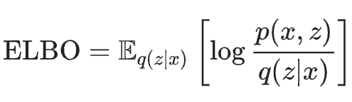

Equation from [Source](https://www.tensorflow.org/tutorials/generative/cvae)* 

*实际上，只计算了 ELBO 的单样本蒙特卡罗估计:*

*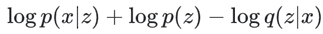

Equation from [Source](https://www.tensorflow.org/tutorials/generative/cvae)* 

*我们首先定义一个辅助函数，即标准对数正态分布的概率分布函数，它将用于最终的损失计算。*

| deflog _ normal _ pdf(sample，mean，logvar，raxis = 1):  log2pi = TF . math . log(2 .* NP . pi)  returnTF . reduce _ sum(  -. 5*((sample-mean)* *2。* TF . exp(-log var)+log var+log2pi)、  axis = raxis) |

*现在我们定义我们的损失函数，它包含以下步骤:*

1.  ***通过编码计算图像的分布参数***
2.  *通过使用重新参数化技巧，使用这些参数从潜在空间以反向传播兼容的方式进行采样*
3.  ***计算输入图像和解码图像之间的** **二值交叉熵***
4.  *计算**条件分布**、**先验潜在分布**(建模为单位高斯)和**近似后验分布**的值。*
5.  ***算出了**T2【埃尔博】的*
6.  ***否定 ELBO** 并返回*

*你可能想知道我们为什么退回 ELBO 的*负数*。我们这样做是因为我们试图*最大化*ELBO，但是梯度下降通过*最小化*损失函数来工作。因此，我们不试图将梯度*实现为*分，而是简单地翻转符号并正常进行，注意稍后要校正符号翻转。*

*最后，我们注意到`tf.nn.sigmoid_cross_entropy_with_logits()`用于数值稳定性，这就是为什么我们计算逻辑并且在解码时不通过 sigmoid 传递它们*

| defcompute _ loss:  mean，log var = model . encode(x)  z = model . reparameterize(mean，log var)  x _ logit = model . decode(z)  ， 0。)  logqz _ x = log _ normal _ pdf(z，mean，log var)  return-TF . reduce _ mean(logpx _ z+logpz-logqz _ x) |

### *训练步骤*

*最后，我们以通常的方式定义我们的训练步骤。我们在`GradientTape`上计算损失，反推计算梯度，然后在给定梯度的情况下使用优化器执行一个步骤。同样，我们将这个方法装饰成一个用于加速的`tf.function`。*

| @ TF . function  deftrain _ step(模型，x，优化器):  【执行一个训练步，返回损失。    该函数计算损失和梯度，并使用后者来  更新模型的参数。   同 tf。gradient tape()astape:  loss = compute _ loss(model，x)  gradients = tape . gradient(loss，model . trainiable _ variables)  optimizer . apply _ gradients(zip(gradients，model . trainible _ variables)) |

### *培养*

#### *设置*

*我们已经完成了对 Keras variable auto encoder 及其方法的定义，所以我们可以继续训练了。我们选择我们的潜在空间的维度为 2，这样我们就可以像上面那样可视化潜在空间。我们将 epochs 的数量设置为 10，并实例化我们的模型。*

| latent_dim = 2历朝历代=10    型号= CVAE(潜伏 _ 暗淡) |

#### *绘图功能*

*下面的绘图功能允许我们跟踪学习过程中潜在空间的特征。函数**获取潜在空间中的点网格，并将它们通过解码器，以生成生成图像**的景观。通过这种方式，我们可以观察潜在空间中的不同区域如何演变以表示特征，以及这些特征区域如何分布在整个空间中，它们之间有连续的过渡。*

| defplot _ latent _ images(model，n，epoch，im_size=28，save=True，first_epoch=False，f _ EP _ count = 0): #创建图像矩阵  image _ width = im _ size * n  image _ height = image _ width  image = NP . zeros((image _ height，image_width))#创建均匀分布的数值列表norm = TFP . distributions . normal(0，1)  grid _ x = norm . quantile(NP . linspace(0.05， 0.95 ，n))  grid _ y#对于潜在空间中网格上的每个点，解码并#将图像复制到图像数组中  为 i， 中的 枚举(grid _ x):  为 j， 中的 枚举(grid _ y):  【T31) im _ size))  image[I * im _ size:(I+1)* im _ size，  j * im _ size:(j+1)* im _ size]= digit . numpy() #剧情图像数组  PLT . fig size =(10，10)  PLT . imshow(image，cmap =【Greys _ r’)  PLT
#潜在保存，如果在第一个纪元  如果 保存 和first _ epoch:  PLT . save fig(【TF _ grid _ at _ epoch _ {:04d }。{:04d}。巴新' 。format(epoch，f _ EP _ count))  elifsave:  PLT . save fig(' TF _ grid _ at _ epoch _ {:04d }。png '。格式(epoch))  【PLT . show() |

#### *训练循环*

*我们终于准备好开始训练了！在我们开始学习和实例化 Adam 优化器之前，我们使用上面的函数保存我们潜在空间的快照。在这之后，我们进入我们的训练循环，简单地说就是遍历每个训练批次并执行`train_step()`。处理完所有批次后，我们使用`compute_loss()`计算测试集上的损失，然后返回平均损失的负值，得出 ELBO。我们在这里返回损失的负平均值，因为我们在我们的`compute_loss()`函数中翻转了符号以使用梯度下降学习。*

*如果我们在第一个时期内，我们每 75 批保存一个潜在空间的快照。这是因为训练发生得如此之快，以至于我们在开始时需要这种粒度级别来观察训练。如果我们不在第一个时期中，我们在每个时期结束时保存潜在空间的快照。*

| TF . config . run _ functions _ 急切( 真实)  plot _ latent _ images(model， 20 ，epoch =0)
optimizer = TF . keras . optimizer . Adam(1e-4)    为 历元 在 范围内( 1 ，历元+1):  优化器)  ifepoch = =1和idx %75= =0: f _ EP _ count = idx)  end _ time = time . time()  loss = TF . keras . metrics . mean()  forTest _ xinTest _ dataset: format(epoch，elbo，end _ time-start _ time))  ifepoch！=1:  plot _ latent _ images(model， 20 ，epoch=epoch) |

### *结果*

*下面的函数允许我们将训练期间的所有快照串成一个 GIF，以便我们可以观察我们的 Keras variable auto encoder 如何学习将不同的特征与潜在空间中的不同区域相关联，并根据相似性组织这些区域，以允许它们之间的连续过渡。*

| anim _ file =【grid . gif】    同imageio . get _ writer(anim _ file，mode =【I’)同writer:  文件名= glob.glob( )png ')  文件名=排序后的(文件名)  为 文件名为 中的文件名:  打印(文件名)  image = imageio . imread |

*以下是使用此函数生成的训练 GIF 示例:*

*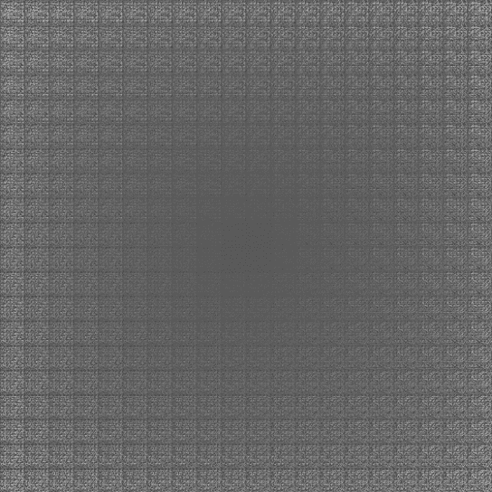*

*这是培训结束时的最后一张快照:*

*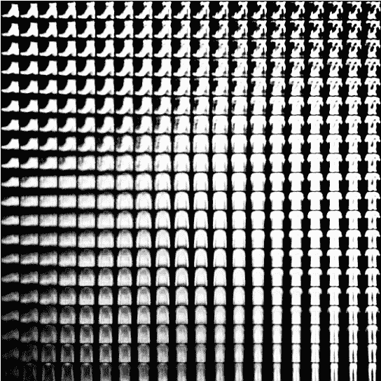*

*正如你所看到的，即使我们的小网络仅用低维潜在空间训练了十个纪元，也能产生强大的 VAE。特征景观被很好地学习，并产生合理的服装实例，尤其是考虑到训练集中不同类别的抽象和多样性。我们看到靴子、鞋子、裤子、t 恤衫和长袖衬衫出现在图像中。很容易看出，即使使用简单的网络架构，使用大型多通道图像和更强大的硬件也能产生令人信服的结果，就像这里展示的那样。*

## *最后的话*

*VAEs 是一种用于生成数据的非常有价值的技术，目前它们与 [GAN](https://www.assemblyai.com/blog/pytorch-lightning-for-dummies/#building-a-gan-with-pytorch-lightning) s 一起主导着数据生成领域。我们看到了自动编码器如何以及为什么无法生成令人信服的数据，以及变化的自动编码器如何简单而有力地扩展了这些体系结构，使其专为图像生成任务而定制。我们用 Python 构建了一个 Keras variable auto encoder，并使用这个 MNIST VAE 来生成看似真实的服装图像。*

 *寻找更多这样的帖子？

订阅我们的时事通讯！

[Subscribe Now](https://assemblyai.us17.list-manage.com/subscribe?u=cb9db7b18b274c2d402a56c5f&id=2116bf7c68)*

## *脚注*

1.  *这张图片来源于 [this](https://github.com/cazala/mnist) GitHub 库*
2.  *图片来源于[本](https://www.saraai.com/blog/tag/mnist)页*
3.  *图片来源于[本](https://www.researchgate.net/figure/Example-1-of-MNIST-M-1-digit-one_fig4_357264093)页*
4.  *这种转换实际上是不连续的，因为我们需要“打破”零，然后将其重新连接到自身的不同部分，但转换的其余部分是连续的*
5.  *这个例子改编自 [TensorFlow 网站](https://www.tensorflow.org/tutorials/generative/cvae)*