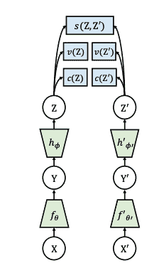
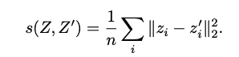
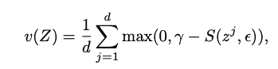
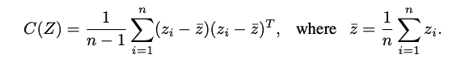
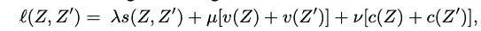
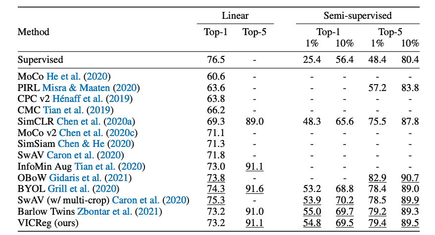

# Review - VICReg:用于自监督学习的方差-不变性-协方差正则化

> 原文：<https://www.assemblyai.com/blog/review-vicreg-variance-invariance-covariance-regularization-for-self-supervised-learning/>

本周深度学习论文综述是 [VICReg:用于自监督学习的方差-不变性-协方差正则化](https://arxiv.org/pdf/2105.04906.pdf)。

## 这篇论文有什么令人兴奋的地方

直到最近，计算机科学中占主导地位的自我监督学习技术(SSL)都是基于对比目标的。这大致意味着模型被训练成 1)最小化相似图像的表示(例如同一源图像的两个增强视图)之间的距离，同时 2)将不同图像的表示的距离推开。

通过这样做，模型在没有标签的情况下学习有用的表示，并且这可以应用于任何特定的下游任务，例如图像分类。

有人可能会问，除了将相似图像的表示集合在一起之外，为什么有必要将不同图像的表示分开。不就是做拉的工作一样好，而且因为简单而更优雅吗？

事实证明，如果只应用拉动项，那么模型将简单地学习问题的简单解决方案——它将为所有输入图像产生相同的表示。包含推动项(这使得客观对比)有效地防止了这种表示崩溃。

然而，最近出现了几种 SSL 技术，它们不再需要对比样本: [BYOL](https://arxiv.org/pdf/2006.07733.pdf) 、[巴洛双胞胎](https://arxiv.org/pdf/2103.03230.pdf)和[维克雷格](https://arxiv.org/pdf/2105.04906.pdf)。三者的性能相似，但我将讨论 VicReg，因为在我看来，它是三者中理论上最合理的。

## 主要发现

首先，这里是问题公式:

给定一个小批图像，我们将应用随机数据扩充两次，以生成两个分支 X 和 X’。设 Z 和 Z’是 X 和 X’的表示(编码器输出)。设 I 表示批索引- zi 和 zi’是同一图像的两个不同增强的表示。设 j 表示特征维数索引——zij 表示表示 zi 的第 j 个特征。

VicReg 代表方差-不变性-协方差正则化。损失目标的名称中包含这三个术语。下图演示了架构和损失术语。请注意，Y 是将用于下游任务的中间表示，而我们正在对最终表示 z 执行 VicReg 损失

1.  不变性:

这个术语只是最小化同一图像的两个不同放大的表示之间的距离。这应该是直观的；但是，请注意，如果没有额外的正则项，这个项本身将导致表示崩溃。

2.差异:

这一项是一个铰链损失，它使一批表示之间的每个特征的方差保持在某个阈值γ以上。直观地说，这意味着:我们希望每个要素的值在批处理中的各个制图表达之间有所不同。这确保了表示不会全部折叠到同一个向量。

3。协方差:

该术语可最小化同一表示的不同要素之间的协方差。当两个变量之间的协方差很小时，这意味着这两个变量不相关。因此，该术语可确保制图表达中的不同要素彼此不相关。

为什么这是一个理想的目标？好吧，假设我们的表示有九个维度，并且假设所有九个特征彼此高度相关(一个特征的值告诉我们其他八个特征的值)。如果是这样的话，我们就没有理由拥有九个特性——只有一个就够了。换句话说，当这些特征相互关联时，在相同的空间量中包含的信息更少。另一方面，通过强制特征不相关，我们鼓励它们编码更多的信息。

总而言之，VicReg 的目标就是这三项的总和。

## 我们的外卖

从经验上看，VicReg 比对比技术表现更好。它的表现只比其他非对比技术(BYOL，SwAV)稍差，但在我看来，它更有趣，并且由于其简单性和理论透明性而具有更大的潜力。

