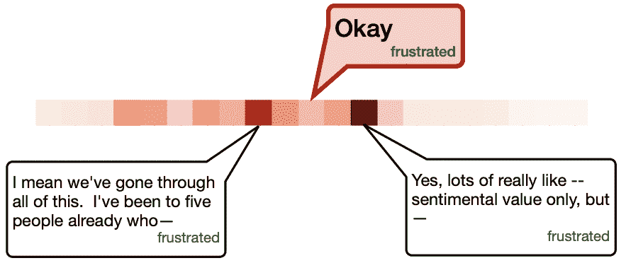
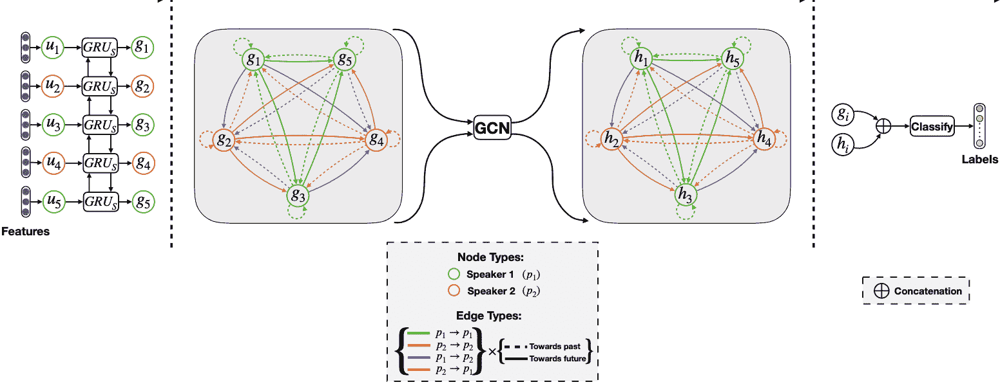

# 综述-用于会话中情感识别的图形卷积神经网络

> 原文：<https://www.assemblyai.com/blog/review-a-graph-convolutional-neural-network-for-emotion-recognition-in-conversation/>

*在本周的深度学习论文综述中，我们看下面这篇论文:**[*DialogueGCN:一个用于会话中情感识别的图卷积神经网络。*](https://aclanthology.org/D19-1015.pdf)*

## ***这篇论文有什么令人兴奋的地方*** 

*本周的论文有趣地利用了自动 ERC(对话中的情感识别)中的关系图卷积网络。它解决了现有作品在多人对话中的局限性。如图 1 所示，来自说话者 1 的“好的”注意到说话者 2 的抱怨。基于 RNNs 的方法会将其分类为中性，因为它忽略了说话者级别的依赖性。这篇论文是令人兴奋的，因为它提供了一种新的解决方案，将话语视为有向图，并用关系转换对它们进行建模。*

*

Fig 1.* 

## ***论文的主要发现*** 

*近年来，图神经网络已被证明在建模图中节点之间的依赖关系方面是有效的。它通过定义边关系和关系图变换，有效地捕捉时间依赖和说话者依赖。从经验上看，它证明了在长时间输入的多方对话中识别情绪的优越性。*

## ***我们的外卖***

*关键是将这些丰富的依赖性编码到话语的表达中。所提出的模型 DialogueGCN 使用 RNNs(在本文中是双向 GRUs)来嵌入基于序列的话语，这些话语然后被用于构建关系图并被传递给 GCN 栈。*

*

Fig 2.* 

*关系图由**{节点，边权重，边关系}** 组成。这些节点是话语表示，它们在一个语境窗口(即从过去的 15 个话语到未来的 15 个话语)内相互连接。边权重是图变换中的可学习权重。最重要的是，基于(1)节点彼此的相对位置来定义边权重(即，第一话语与第三话语具有“朝向过去”的边关系)；(2)节点的说话者类型(即，来自说话者 1 的话语对于来自说话者 2 的话语具有“说话者 1 朝向说话者 2”)。*

*通过关系图变换，节点聚集来自共享相同关系的节点**的邻域信息，这将说话者依赖性和时间依赖性编码到节点特征。最后，GCN 输出被连接到 RNNs 编码输出，并被传递到完全连接的分类器，以获得情感标签。***