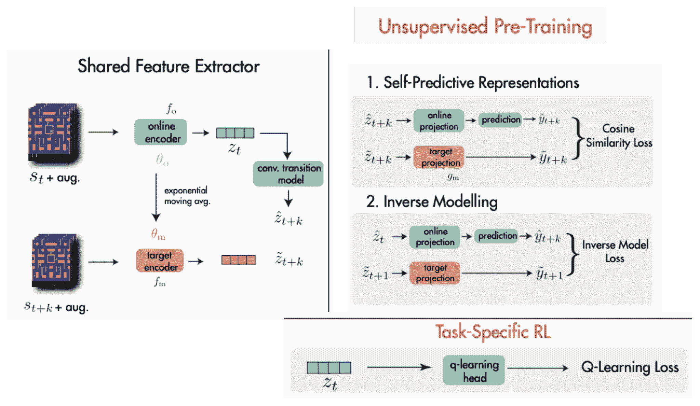
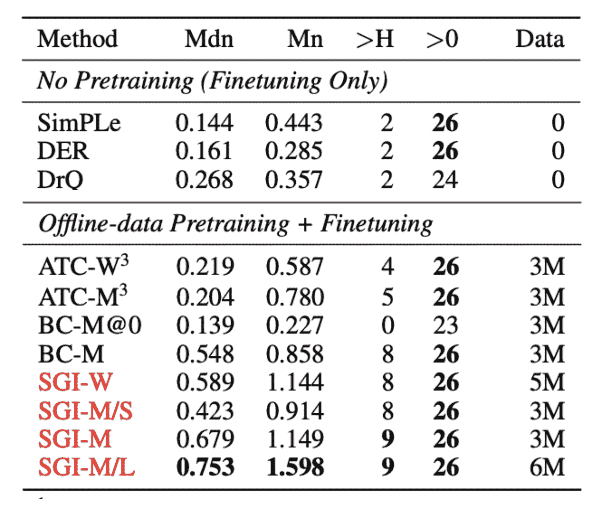

# 用于数据高效强化学习的回顾-预训练表示

> 原文：<https://www.assemblyai.com/blog/pretraining-representations-for-data-efficient-reinforcement-learning/>

*在本周的深度学习论文综述中，我们来看下面这篇论文:[数据高效强化学习的预训练表示](https://arxiv.org/pdf/2106.04799.pdf)。*

## 这篇论文有什么令人兴奋的地方

近年来，预训练已经被证明是在自然语言处理和计算机视觉领域取得成功的重要因素。这个想法是首先以非监督的方式预训练一个通用模型，然后在较小的监督数据集上对其进行微调。这同时使微调部分的数据效率更高，同时实现了卓越的性能。然而，在强化学习领域，预训练还没有成为标准。因此，RL 算法是出了名的数据低效:一个简单的 Atari 游戏需要数千万帧训练数据才能收敛到人类的表现。直觉上，这是因为 RL 代理必须同时学习两个困难的任务:来自原始像素的视觉表示以及学习策略和值函数。

本文介绍了一种称为 SGI 的技术，它将表征学习与强化学习分离开来。首先，使用观察到的轨迹以无监督的方式预训练 RL 代理的编码器；无监督目标包括基于当前状态和动作预测下一个状态，以及预测导致状态转换的动作。这项工作和以前的工作之间的一个关键区别是，下一状态预测纯粹发生在潜在空间中，并避免使用对比样本，因此减轻了对图像重建或大批量的需要(后者对对比学习至关重要)。在预训练之后，下游 RL 代理使用预训练的编码器进行实例化，并在 Atari 任务上进行训练(图 1)。

作者证明:1)与从零开始的代理相比，预训练使 RL 代理在有限的训练数据下实现更好的性能；2)预训练允许 RL 代理利用大得多的编码器，而没有预训练的代理不能有效地学习使用它们。

## **我们的外卖**

这篇论文是令人兴奋的，因为它将 RL 领域推向了构建更一般化的代理的趋势。当我们像人类一样学习一个新的视频游戏时，我们利用我们预先训练的视觉系统和对世界的先验知识来帮助我们。同样，我们认为一个真正通用的人工智能的关键特征是利用现有知识解决新任务的能力。在更实际的层面上，像 SGI 这样的技术可以使 RL 的数据效率更高，这对于大多数现实世界的应用程序来说是很重要的，在这些应用程序中，模拟是不可能的或者计算量很大。