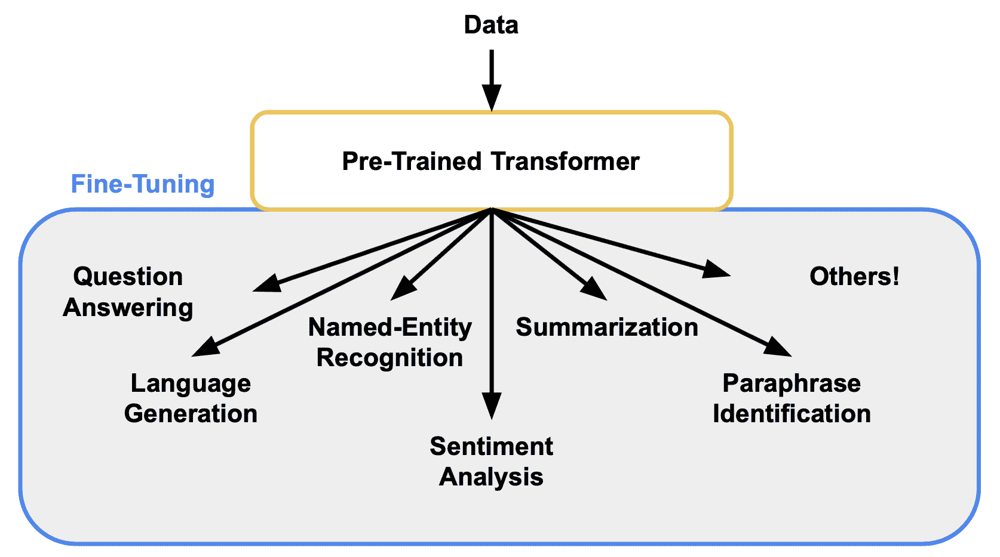
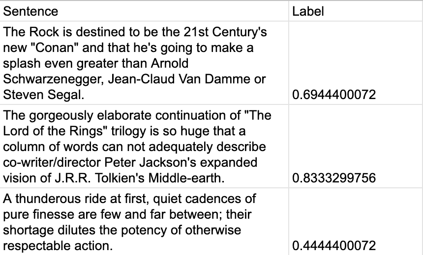
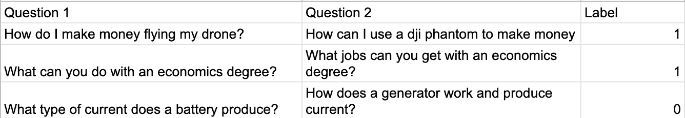
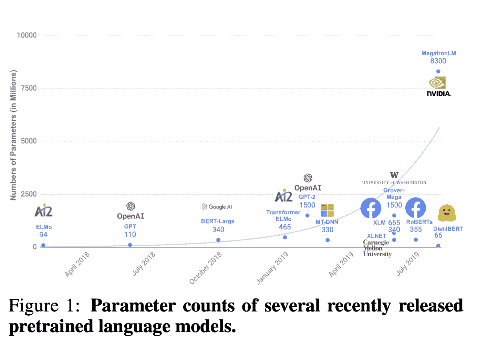
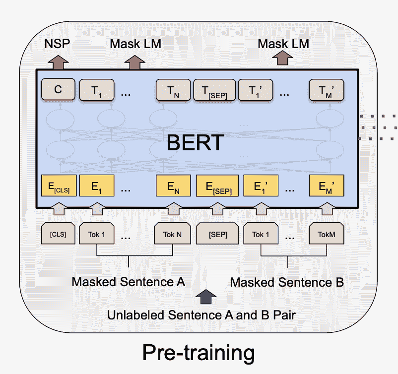
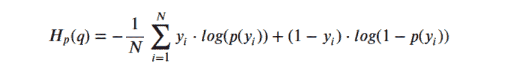

# 用于 NLP 的微调变压器

> 原文：<https://www.assemblyai.com/blog/fine-tuning-transformers-for-nlp/>

在本教程中，我们将展示如何针对两个不同的 NLP 问题(情感分析和重复问题检测)微调两个不同的 transformer 模型，BERT 和 DistilBERT。

你可以在我们的 [Colab 笔记本](https://colab.research.google.com/drive/1bgy5jYOzm3SRfuw5tGVRaZjEFKlyw4sr?undefined=&usp=sharing)中看到一个完整的工作示例，你还可以在 [HuggingFace](https://huggingface.co/assemblyai?undefined) 上和训练过的模特一起玩。让我们跳进来吧！

## 介绍

自从在[中首次开发并发布以来,](https://arxiv.org/abs/1706.03762?undefined)论文[变形金刚](https://jalammar.github.io/illustrated-transformer/?undefined)已经完全重新定义了[自然语言处理(NLP)](https://en.wikipedia.org/wiki/Natural_language_processing?undefined) 领域，在许多任务上设置了最先进的技术，如问题回答、语言生成和命名实体识别。在这里，我们不会过多地讨论什么是变压器，而是如何应用和训练它们来帮助完成手头的一些任务。关于变形金刚，在概念上要记住的主要事情是，它们非常擅长处理顺序数据(文本、语音等)。)，它们充当编码器-解码器框架，其中数据由编码器映射到一些表示空间，然后通过解码器映射到输出，并且它们非常适合并行处理硬件(GPU)。

自然语言处理领域中的转换器已经在大量文本数据上接受了训练，这使得它们能够很好地理解语言的语法和语义。例如，发表在[通过生成性预训练提高语言理解](https://s3-us-west-2.amazonaws.com/openai-assets/research-covers/language-unsupervised/language_understanding_paper.pdf?undefined)中的原始 GPT 模型是在超过 7000 本独特的未出版书籍的 BooksCorpus 上训练的。同样，在论文[中发布的著名的 BERT 模型:用于语言理解的深度双向转换器的预训练](https://arxiv.org/abs/1810.04805?undefined)在图书语料库和英语维基百科上都进行了训练。对于对深入研究变压器的神经网络架构感兴趣的读者来说，[原文](https://arxiv.org/abs/1706.03762?undefined)和[图解变压器](https://jalammar.github.io/illustrated-transformer/?undefined)是两个很好的资源。

变形金刚背后的主要好处，也是我们将在本博客的其余部分看到的，是一旦预先训练好的变形金刚可以针对众多下游任务进行快速微调，并且通常开箱后表现良好。这主要是因为转换器已经理解语言，这允许训练集中于学习如何做问题回答、语言生成、命名实体识别，或者某人为他们的模型想到的任何其他目标。



## 资料组

### 斯坦福情感树库 v2 (SST2)

第一个任务模型将被训练用于情感分析。情感分析是 NLP 领域的一个长期基准，其目标是能够检测某些文本是正面的、负面的还是介于两者之间。这有许多用例，例如根据客户评论检测产品是被正面还是负面看待，或者根据推文检测候选人的支持率是高还是低。我们将用来训练情感分析模型的数据集是[斯坦福情感树库 v2 (SST2)](https://nlp.stanford.edu/sentiment/?undefined) 数据集，它包含 11，855 个电影评论句子。这个任务和数据集是[通用语言理解评估(GLUE)基准](https://gluebenchmark.com/?undefined)的一部分，该基准是用于训练、评估和分析自然语言理解系统的资源集合。

以下是该数据集中的一些例子，其中接近 0 的数字代表消极情绪，接近 1 的数字代表积极情绪:



### Quora 问题对(QQP)

第二个任务模型将被训练用于重复问题检测。同样，这个任务也有各种用例，比如从 Quora 平台上删除类似的问题，以减少用户之间的混淆。我们将用来训练重复问题检测模型的数据集是 [Quora 问题对](https://quoradata.quora.com/First-Quora-Dataset-Release-Question-Pairs?undefined)数据集。这个任务/数据集也是 [GLUE 基准的一部分。](https://gluebenchmark.com/?undefined)

此数据集中的许多示例(其中 0 表示非重复，1 表示重复)如下:



## 模型

将为上述任务/数据集训练两种不同的基于变压器的架构。预训练的模型将从包含 60 多种不同网络类型的[hugging face Transformers Repo](https://github.com/huggingface/transformers?undefined)中加载。[拥抱脸模型中心](https://huggingface.co/models?undefined)也是一个很好的资源，它包含超过 10，000 个不同的预训练变形金刚，可以执行各种各样的任务。

### 蒸馏啤酒



我们将训练的第一个架构是 [DistilBERT](https://huggingface.co/transformers/model_doc/distilbert.html?undefined) ，它是开源的，在 [DistilBERT 中发布，是 BERT 的一个精简版本:更小、更快、更便宜、更轻](https://arxiv.org/abs/1910.01108?undefined)。这个转换器比 BERT 小 40%,同时保留了 97%的语言理解能力，速度也快了 60%。我们将为 SST2 和 QQP 数据集训练这种架构。

### 伯特



我们将训练的第二个架构是 [BERT](https://huggingface.co/transformers/model_doc/bert.html?undefined) 发表在 [BERT:用于语言理解的深度双向转换器的预训练](https://arxiv.org/abs/1810.04805?undefined)中。这是第一个真正展示了这种模型类型在 NLP 领域中的威力的 Transformer，它在发布时在 11 个不同的 NLP 任务上设置了一个新的艺术状态。

我们将仅为 SST2 数据集训练这种架构。

## 微调

有了这个背景，现在让我们看看代码，并训练/微调这些模型！这里我们使用了 [PyTorch](https://pytorch.org/?undefined) 深度学习框架，并且只包含 SST2 数据集的代码。要自己运行这段代码，请随意查看我们的 [Colab 笔记本](https://colab.research.google.com/drive/1bgy5jYOzm3SRfuw5tGVRaZjEFKlyw4sr?undefined=&usp=sharing)，它可以很容易地进行编辑，以适应 QQP 数据集。

### 创建数据集

首先让我们为 SST2 创建我们的 [PyTorch 数据集](https://pytorch.org/tutorials/beginner/basics/data_tutorial.html?undefined)类。该类定义了三个重要的函数，目的如下:

*   ****`__init__`**** :初始化数据集中的类和加载
*   ****`__len__`**** :获取数据集的长度
*   ****`__getitem__`**** :从数据集中随机选择一项

```py
#Libraries needed
import torch
from torch.utils.data import Dataset

#PyTorch dataset class
class  SST_Dataset(Dataset):
	#Name: 		__init__
	#Purpose: 	init function to load the dataset
	#Inputs: 	dataset -> dataset
	#Outputs: 	none
	def  __init__(self, dataset):
		self.dataset = dataset
		return

	#Name: 		__len__
	#Purpose: 	get the length of the dataset
	#Inputs: 	none
	#Outputs: 	length -> length of the dataset
	def  __len__(self):
		return  len(self.dataset)

	#Name: 		__getitem__
	#Purpose: 	get a random text segment and its label from the dataset
	#Inputs: 	idx -> index of the random text segment to load
	#Outputs: 	text -> text segment
	# 			label -> sentiment score
	def  __getitem__(self, idx):
		text =  self.dataset[idx]['sentence']
		label = torch.zeros(2)
		label[round(self.dataset[idx]['label'])] =  1
		return text, label
```

### 助手功能

接下来，让我们创建几个助手函数来完成诸如获取 GPU、向其传输数据等任务。神经网络，尤其是基于变压器的神经网络，几乎总是在 GPU 等加速器硬件上训练得更快，因此如果模型和数据可用，将它们发送到那里进行处理是至关重要的。由于可以利用并行处理能力，这允许显著的训练加速。

```py
#Name: 		get_gpu
#Purpose: 	checks if a GPU device is avaliable
#Input: 	none
#Output: 	GPU -> GPU device if applicable, none if not
def  get_gpu():
	#Check if a GPU is avaliable and if so return it
	GPU  =  None
	if torch.cuda.is_available():
		print("Using GPU")
		GPU  = torch.device("cuda")
	else:
		print("No GPU device avaliable! Using CPU")
	return  GPU

#Name: 		transfer_device
#Purpose: 	transfers model / data to the GPU devie if present
#Inputs: 	GPU -> GPU device if applicable, none if not
# 		 	data -> data to transfer
#Output: 	data -> data that has been transferred if applicable
def  transfer_device(GPU, data):
	if(GPU  !=  None):
		data = data.to(GPU)
	return data

#Name: 		count_correct
#Purpose: 	count the number of correct model predictions in a batch
#Inputs: 	predictions -> model predictions
#		 	targets -> target labels
#Outputs: 	correct -> number of correct model predictions
def  count_correct(predictions, targets):
	#Create variables to store the number of correct predictions along with the index of the prediction in the batch
	correct =  0
	index =  0

	#Loop across all predictions in the batch and count the number correct
	while(index <  len(predictions)):
		#Convert the prediction and target to lists
		prediction =  list(predictions[index])
		target =  list(targets[index])

		#Get the max index indicating the truth value from the prediction and target
		prediction_index = prediction.index(max(prediction))
		target_index = target.index(max(target))

		#If the max indices are the same increment correct
		if(prediction_index == target_index):
			correct +=  1
		index +=  1
	return correct
```

### 定义损失函数

现在我们将定义损失函数...由于我们正在训练一个分类器来预测一个句子是积极还是消极的情绪，或者如果两个问题是重复的，我们将使用二元交叉熵损失函数。这一损失背后的数学原理是:



这里 ****y**** 是真正的标签(0 或 1)，而 ****p(y)**** 是我们的模型预测。通过最小化这个值，我们的网络学会做出更准确的预测。

```py
#Name: 		binary_cross_entropy
#Purpose: 	defines binary cross entropy loss function
#Inputs: 	predictions -> model predictions
# 			targets -> target labels
#Outputs: 	loss -> loss value
def  binary_cross_entropy(predictions, targets):
	loss =  -(targets * torch.log(predictions) + (1  - targets) * torch.log(1  - predictions))
	loss = torch.mean(loss)
	return loss
```

## 模型培训/评估

接下来，让我们编写核心培训/评估逻辑来微调和测试我们的模型，该模型包含 3 个主要功能:

*   `train_model`
*   `train`
*   `evaluate`

`train_model`函数的工作方式是首先评估验证集上的预训练模型，并在进行任何训练之前计算性能。然后，该函数在三个时期内循环，同时在训练集上训练模型，并在验证集上评估其性能。一个历元本质上是某个数据集中所有数据的循环。

`train`功能通过为一个时期训练模型来运行。请注意，在进行任何训练之前，我们的模型会进入训练模式，向 PyTorch 指示需要存储梯度以进行参数更新。然后，通过迭代 [PyTorch 数据加载器](https://pytorch.org/tutorials/beginner/basics/data_tutorial.html?undefined)来循环一个时期中的所有批次。然后，每一批都通过记号赋予器，允许这些记号被发送到模型用于情感得分预测。按照事实上的 PyTorch 训练循环设置，计算损失值，将优化器置零，根据损失导出梯度，并通过采取优化器步骤来更新模型。

`evaluate`函数的设置与`train`相似，只是删除了最终优化器归零、梯度推导和优化器步骤，因为模型不应在验证集上训练。这两个函数之间的其他区别是，这里我们的模型被设置为评估模式，这允许更快的推断，因为梯度不需要被存储。

内置在`train`和`evaluate`函数中的是对`count_correct`的调用，该函数计算每批正确的情感分数预测的数量，从而允许跨整个数据集得出最终的准确度分数。还要注意的是，`softmax`在模型的输出中被调用，将分数映射到概率。

```py
import torch.nn.functional as F 

#Name: 		train_model
#Purpose: 	train the model while evaluating its performance
#Inputs: 	GPU -> GPU device to train / evaluate on
# 			train_dataloader -> training set dataloader
# 			dev_dataloader -> development set dataloader
# 			tokenizer -> text tokenizer for model
# 			model -> model to train / evaluate
# 			optimizer -> optimizer to use to update model parameters
# 			criterion -> criterion to use to compute loss values
#Outputs: 	model -> model after training
def  train_model(GPU, train_dataloader, dev_dataloader, tokenizer, model, optimizer, criterion):
	#Evaluate the performance of the model before training
	valid_loss, valid_accuracy = evaluate(GPU, dev_dataloader, tokenizer, model, criterion)
	print("Pre-training validation loss: "+str(valid_loss)+" --- Accuracy: "+str(valid_accuracy))
	print()

	#Train the model across 3 epochs and evaluate its performance
	for epoch in  range(3):
		model, train_loss, train_accuracy = train(GPU, train_dataloader, tokenizer, model, optimizer, criterion)
		valid_loss, valid_accuracy = evaluate(GPU, dev_dataloader, tokenizer, model, criterion)

		#Print performance stats
		print(" ", end="\r")
		print("Epoch: "+str(epoch+1))
		print("Training loss: "+str(train_loss)+" --- Accuracy: "+str(train_accuracy))
		print("Validation loss: "+str(valid_loss)+" --- Accuracy: "+str(valid_accuracy))
		print()
	return model
```

```py
#Name: 		train
#Purpose: 	train the model over 1 epoch
#Inputs: 	GPU -> GPU device to train on
# 			dataloader -> dataloader
# 			tokenizer -> text tokenizer for model
# 			model -> model to train
# 			optimizer -> optimizer to use to update model parameters
# 			criterion -> criterion to use to compute loss values
#Outputs: 	model -> model after training over the epoch
# 			average_loss -> average loss over the epoch
# 			accuracy -> accuracy over the epoch
def  train(GPU, dataloader, tokenizer, model, optimizer, criterion):
	#Place the network in training mode, create a variable to store the total loss, and create a variable to store the total number of correct predictions
	model.train()
	total_loss =  0
	total_correct =  0

	#Loop through all batches in the dataloader
	for batch_number, (texts, labels) in  enumerate(dataloader):
		#Tokenize the text segments, get the model predictions, compute the loss, and add the loss to the total loss
		tokenized_segments = tokenizer(texts, return_tensors="pt", padding=True, truncation=True)
		tokenized_segments_input_ids, tokenized_segments_attention_mask = tokenized_segments.input_ids, tokenized_segments.attention_mask
		model_predictions = F.softmax(model(input_ids=transfer_device(GPU, tokenized_segments_input_ids), attention_mask=transfer_device(GPU, tokenized_segments_attention_mask))['logits'], dim=1)
		loss = criterion(model_predictions, transfer_device(GPU, labels))
		total_loss += loss.item()

		#Count the number of correct predictions by the model in the batch and add this to the total correct
		correct = count_correct(model_predictions.cpu().detach().numpy(), labels.numpy())
		total_correct += correct

		#Zero the optimizer, compute the gradients, and update the model parameters
		optimizer.zero_grad()
		loss.backward()
		optimizer.step()
		print("Training batch index: "+str(batch_number)+"/"+str(len(dataloader))+  " ( "+str(batch_number/len(dataloader)*100)+"% )", end='\r')

	#Compute the average loss and accuracy across the epoch
	average_loss = total_loss /  len(dataloader)
	accuracy = total_correct / dataloader.dataset.__len__()
	return model, average_loss, accuracy
```

```py
#Name: 		evaluate
#Purpose: 	evaluate the model over 1 epoch
#Inputs: 	GPU -> GPU device to evaluate on
# 			dataloader -> dataloader
# 			tokenizer -> text tokenizer for model
# 			model -> model to evaluate
# 			criterion -> criterion to use to compute loss values
#Outputs: 	average_loss -> average loss over the epoch
# 			accuracy -> accuracy over the epoch
def  evaluate(GPU, dataloader, tokenizer, model, criterion):
	#Place the network in evaluation mode, create a variable to store the total loss, and create a variable to store the total number of correct predictions
	model.eval()
	total_loss =  0
	total_correct =  0

	#Loop through all batches in the dataloader
	for batch_number, (texts, labels) in  enumerate(dataloader):
		#Tokenize the text segments, get the model predictions, compute the loss, and add the loss to the total loss
		tokenized_segments = tokenizer(texts, return_tensors="pt", padding=True, truncation=True)
		tokenized_segments_input_ids, tokenized_segments_attention_mask = tokenized_segments.input_ids, tokenized_segments.attention_mask
		model_predictions = F.softmax(model(input_ids=transfer_device(GPU, tokenized_segments_input_ids), attention_mask=transfer_device(GPU, tokenized_segments_attention_mask))['logits'], dim=1)
		loss = criterion(model_predictions, transfer_device(GPU, labels))
		total_loss += loss.item()

		#Count the number of correct predictions by the model in the batch and add this to the total correct
		correct = count_correct(model_predictions.cpu().detach().numpy(), labels.numpy())
		total_correct += correct
		print("Evaluation batch index: "+str(batch_number)+"/"+str(len(dataloader))+  " ( "+str(batch_number/len(dataloader)*100)+"% )", end='\r')

	#Compute the average loss and accuracy across the epoch
	average_loss = total_loss /  len(dataloader)
	accuracy = total_correct / dataloader.dataset.__len__()
	return average_loss, accuracy
```

## 把所有的放在一起

现在，我们已经定义了训练模型所需的所有函数，我们终于可以对其进行微调，看看会发生什么！请注意，SST2 是存储在 [HuggingFace Datasets](https://huggingface.co/docs/datasets/?undefined) 中的许多数据集之一，这使得它非常容易加载和使用。

```py
from datasets import load_dataset
from torch.utils.data import DataLoader
from transformers import AdamW
from transformers import DistilBertTokenizer, DistilBertForSequenceClassification

#Get the GPU device if it exists, load the SST-2 dataset, and create PyTorch datasets and dataloaders for the training and validation sets
GPU  = get_gpu()
sst2_dataset = load_dataset("sst", "default")
train_dataset = SST_Dataset(sst2_dataset['train'])
valid_dataset = SST_Dataset(sst2_dataset['validation'])
train_dataloader = DataLoader(train_dataset, batch_size=32, shuffle=True, num_workers=4)
valid_dataloader = DataLoader(valid_dataset, batch_size=32, shuffle=False, num_workers=4)

#Create the tokenizer, model, optimizer, and criterion
tokenizer = DistilBertTokenizer.from_pretrained('distilbert-base-uncased')
model = transfer_device(GPU, DistilBertForSequenceClassification.from_pretrained('distilbert-base-uncased'))
optimizer = AdamW(model.parameters(), lr=2e-5)
criterion = binary_cross_entropy

#Train and save the model
model = train_model(GPU, train_dataloader, valid_dataloader, tokenizer, model, optimizer, criterion)
torch.save({
	'tokenizer': tokenizer,
	'model_state_dict': model.state_dict()},
	model+".pt")
return
```

要训练 BERT 模型而不是 DistilBERT，请使用以下内容:

```py
from transformers import BertTokenizer, BertForSequenceClassification
tokenizer = BertTokenizer.from_pretrained('bert-large-uncased')
model = transfer_device(GPU, DistilBertForSequenceClassification.from_pretrained('distilbert-base-uncased')) 
```

## 结果

### SST2

在对 SST2 数据集上的 DistilBERT 和 BERT 进行 3 个时期的微调后，在验证和测试集上评估了它们的性能。下面的数字是 8 次单独模型训练运行的平均准确度分数:

| 资料组 | 蒸馏啤酒 | 伯特 |
| --- | --- | --- |
| 确认 | 83.992% | 87.443% |
| 试验 | 85.056% | 86.997% |

### QQP

尽管 QQP 的培训代码没有在这个博客中显示，我们的 [Colab 笔记本](https://colab.research.google.com/drive/1bgy5jYOzm3SRfuw5tGVRaZjEFKlyw4sr?undefined=&usp=sharing)可以很容易地修改以容纳这些数据。要做的主要更改是编辑 PyTorch 数据集以处理模型的两个文本输入，问题 1 和问题 2，以及调整标记化器的输入。对 QQP 上的 DistilBERT 进行 3 个时期的微调，并在验证集上进行性能评估，结果如下所示。请注意，准确性分数是在 8 次单独的模型训练运行中平均得出的:

| 资料组 | 蒸馏啤酒 |
| --- | --- |
| 确认 | 89.909% |

## 结论

在这篇博客中，我们学习了如何在下游任务中微调转换器，特别是情感分析和重复问题检测。通过微调预先训练好的变压器，可以节省大量时间，而且开箱后性能通常很高。相比之下，从头开始训练需要更长的时间，并使用更多数量级的计算和能源来达到相同的性能指标。

请随意查看本博客附带的 [Colab 笔记本](https://colab.research.google.com/drive/1bgy5jYOzm3SRfuw5tGVRaZjEFKlyw4sr?undefined=&usp=sharing)来亲自进行实验！此外，如果您想下载并使用我们开发的模型，可以在以下位置的 [HuggingFace 模型中心](https://huggingface.co/models?undefined)找到它们:

*   [蒸馏-碱-未加壳-sst2](https://huggingface.co/assemblyai/distilbert-base-uncased-sst2?undefined)
*   [Bert-large-uncated-ss T2](https://huggingface.co/assemblyai/bert-large-uncased-sst2?undefined)
*   [蒸馏-基础-未加壳-qqp](https://huggingface.co/assemblyai/distilbert-base-uncased-qqp?undefined)

### 资源

*[https://arxiv.org/abs/1706.03762](https://arxiv.org/abs/1706.03762?undefined)
*[https://jalammar.github.io/illustrated-transformer/](https://jalammar.github.io/illustrated-transformer/?undefined)
*[https://en.wikipedia.org/wiki/Natural_language_processing](https://en.wikipedia.org/wiki/Natural_language_processing?undefined)
*[https://S3-us-west-2 . Amazon AWS . com/open ai-assets/research-covers/language-unsupervised/language _ understand _ paper . pdf](https://s3-us-west-2.amazonaws.com/openai-assets/research-covers/language-unsupervised/language_understanding_paper.pdf?undefined)
*[https://arxiv.org/abs/1810.04805](https://arxiv.org/abs/1810.04805?undefined)
*[https://nlp.stanford.edu/sentiment/](https://nlp.stanford.edu/sentiment/?undefined)
*[https://gluebenchmark.com](https://gluebenchmark.com/?undefined)
*