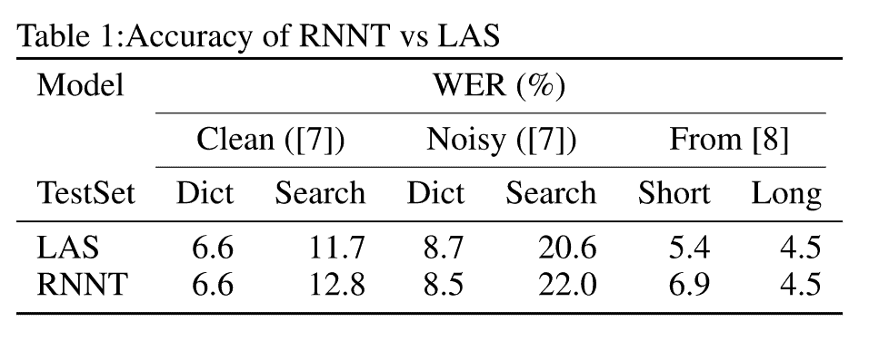
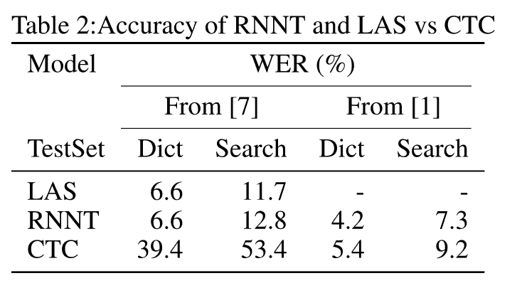
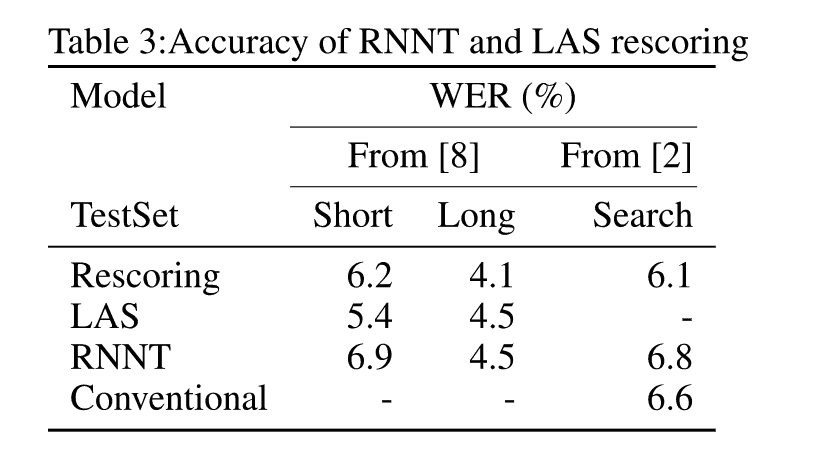
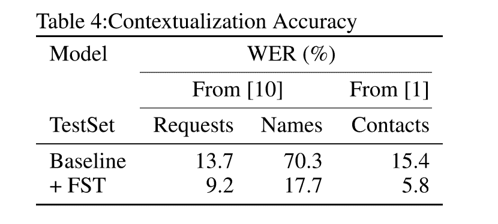

# 比较 2021 年的端到端语音识别架构

> 原文：<https://www.assemblyai.com/blog/a-survey-on-end-to-end-speech-recognition-architectures-in-2021/>

## 概观

准确性是自动语音识别系统最重要的特征。虽然 AssemblyAI 为我们的[语音转文本 API](https://www.assemblyai.com/blog/how-to-choose-the-best-speech-to-text-api-for-your-product/) 提供的生产端到端方法能够提供比其他商业级语音识别系统更好的准确性，但仍然可以进行改进以实现人类性能。作为我们核心研发工作的一部分，我们将继续推动语音识别准确性的发展，在本帖中，我们将探讨在研究和行业环境中日益流行的语音识别架构。

## 1.介绍

随着我们继续我们的核心研发工作，以推动最先进精度的边界，我们开始探索端到端语音识别的架构，这些架构不仅在研究领域，而且在工业生产环境中也越来越受欢迎([1]、[2])。我们特别感兴趣的是那些生产级精度达到或超过传统混合 DNN-HMM ([3]、[4])语音识别系统的架构。考虑到这一点，我们考察了以下两种架构:Listen Attend and Spell (LAS，[5])和递归神经网络转换器(RNNT，[6])。

我们从生产的角度来审视这些新的架构。在第 2 节中，我们报告了对 LAS 和 RNNT 进行的一些最新研究的准确性比较([7]、[8]、[2])。我们还将这些技术与连接主义时间分类(CTC，[9]) ([7]，[1])进行了比较，后者是一种更广为人知的端到端方法，也是 AssemblyAI 的早期版本[语音识别系统](https://www.assemblyai.com)所基于的。我们也看看最近的研究，将 RNNT 和 LAS 结合成一个系统([8]，[2])。

在第 3 节中，我们继续关注产品级语音识别，从特征奇偶校验的角度比较 LAS 和 RNNT 模型。我们重点关注语境化([10]、[1])、反向文本规范化([11]、[1]、[8])、单词时间戳以及进行实时语音识别的可能性([1]、[2])。

我们在第 4 部分结束这篇文章，给出了关于我们调查的高层次结论以及未来博客文章的下一步措施。

## 2.准确(性)

虽然一些研究数据集([12])已经达到了人类同等的语音识别精度，但在具有挑战性的声学环境中，工业生产级应用的单词错误率(WER)远未达到人类水平。这种领域的一个例子是自发的电话交谈，即使在研究数据集中，人类水平的平等还没有实现([13])。

在本节中，我们将重点放在在生产数据上测试的 LAS 和 RNNT 系统上，而不是研究数据集上。我们避免查看研究数据集，因为它们很容易被不能很好地概括真实现场音频信号的模型过度拟合。我们希望专注于包含挑战性特征的数据集，如通道噪声、压缩、环境噪声、串扰、口音和说话者多样性。

### 2.1 LAS 与 RNNT

在比较基于 LAS 和 RNNT 的架构的精度时，一致的看法似乎是 LAS 的精度优于 RNNT。[7]使用 12500 小时的生产语音搜索流量，通过添加噪声和模拟房间声学进行人工失真，比较 LAS 和 RNNT 模型。WER 在听写和语音搜索话语中都有报道。LAS 和 RNNT 都使用相同的编码器神经网络架构和大小。然而，它们的参数是不同的，并且被初始化为具有相同编码器架构的聚合 CTC 训练网络的参数。解码器也具有相同的架构、相同的层数、大小，并输出 26 个小写字母加上数字、空格和标点符号的集合。因此，就参数数量而言，唯一的区别在于 RNNT 联合网络和 LAS 注意机制。LAS 和 RNNT 模型都不使用任何类型的外部语言模型。表 [1](https://www.assemblyai.com/blog/a-survey-on-end-to-end-speech-recognition-architectures-in-2021?undefined#) 总结了他们的结果，显示 LAS 总体表现更好。

Table 1: Accuracy of RNNT vs LAS

[8]还显示 LAS 总体表现更好。他们强调 RNNT 模型在质量上落后，而 LAS 与混合 DNN-HMM 模型相比表现出竞争性能([11])。[8]还比较了 LAS 和 RNNT 的 WERs。与[7]类似，RNNT 和 LAS 的编码器和解码器网络是相同的，不同之处仅在于联合网络和注意力网络。两者都预测了一组 4096 个单词的输出。两种模型使用的训练数据是相同的，由 30，000 小时的语音搜索训练数据组成，被添加的噪声和房间声学破坏。这些模型在两个测试集上进行测试:一个测试集由短于 5.5 秒的话语(短 utt)组成。)和另一个由长于 5.5 秒的话语组成(长 utt。).显示 LAS 性能更好的结果可以在表 1 中看到。LAS 在长话语上表现出降低的准确性，这归因于注意机制，如[14]中所解释的。

虽然[2]没有明确地比较 LAS 和 RNNT 模型的准确率，但他们确实提到，类似于[8]，在低延迟约束下，LAS 的准确率优于传统的 DNN-HMM 模型，而 RNNT 模型则不然。

### 2.2 LAS 和 RNNT 与 CTC

与基于 [CTC 的模型](https://www.assemblyai.com/blog/end-to-end-speech-recognition-pytorch/)进行比较并不像仅在 LAS 和 RNNT 之间进行比较那么简单。主要原因是 CTC 模型高度依赖于外部语言模型的使用来获得可接受的准确性。LAS 和 RNNT 模型不需要外部语言模型，因为模型中存在解码器组件。

[7]比较没有任何外部 LM 的 LAS、RNNT 和 CTC 模型，其中所有三种模型的编码器架构和尺寸都相同。如表 2 所示，在没有任何外部 LM 的情况下，CTC 的精度显著低于 RNNT 和 LAS。其余的实验细节与 2.1 节所述的相同。

[1]比较了 RNNT 和 CTC，但两者在架构上存在显著差异。CTC 模型包括 6 个 LSTM 层，每层具有 1200 个单元和 400 维投影层。该模型通过 softmax 层输出 42 个音素目标。使用 5 克第一遍语言模型和第二遍 LSTM LM 重评分模型来执行解码。RNNT 模型的编码器包括 8 个 LSTM 层，每个层有 2048 个单元和一个 640 维的投影层。在编码器的第二层之后插入因子为 2 的时间缩减层。预测网络有 2 个 LSTM 层，每个层有 2048 个单元格和一个 640 维的投影层。联合网络有 640 个隐藏单元。输出层模拟 4096 个单词块。RNNT 型号的大小是 120MB，而 CTC 型号的大小是 130MB。

[1]使用 27500 小时的语音搜索和听写数据进行训练，这些数据被人为破坏以模拟房间声学和噪声。表 2 显示了他们的 CTC 和 RNNT 模型在语音搜索和听写测试集上的比较，显示 RNNT 模型明显更好。

Table 2: Accuracy of RNNT and LAS vs CTC

### 2.3 结合 LAS 和 RNNT

虽然 LAS 被认为具有更好的准确性，但 RNNT 模型被认为具有生产质量特性，如流功能，这使它们更受欢迎。

为了缩小两种架构之间的精度差距，[8]和[2]开发了 RNNT 和 LAS 模型的组合。RNNT 用于第一遍解码，LAS 用作第二遍重新计分模型。

第 2.1 节描述了[8]中关于独立 RNNT 和 LAS 模型的实验细节。两遍实验对 LAS 和 RNNT 使用相同的架构。参数的数量也是相同的，但是这次编码器参数是在它们之间共享的。训练分三步完成。首先，RNNT 模型被收敛。然后 RNNT 编码器被冻结，并用它来训练 LAS 解码器。最后，使用组合损失来一起重新训练 RNNT 和 LAS 模型(具有共享编码器)。表 [3](https://www.assemblyai.com/blog/a-survey-on-end-to-end-speech-recognition-architectures-in-2021?undefined#) 显示，重新评分方法显著提高了 RNNT 模型的准确性。它还改善了 LAS 在较长话语方面的弱点。

[2]还在第二次通过时实施 LAS 重新计分，其中第一次通过是 RNNT 模型。除了在训练期间使用搜索数据之外，他们还使用来自多个其他域(例如:远场、电话)的数据和来自除美国之外的国家的口音语音。用于训练的小时数没有规定，但是与 LAS 重新评分相关的模型架构细节是相似的:在 RNNT 模型和 LAS 模型之间使用共享编码器，并且 LAS 模型用于对来自 RNNT 模型的假设进行重新评分。他们在共享编码器和 LAS 解码器之间增加了一个额外的 LAS 编码器层。表 3 显示 LAS 重新计分显著提高了 RNNT 精度。

更重要的是，表 3 显示了 RNNT 和 LAS 的组合击败了传统的 HMM-RNN 混合模型。传统模型的声学模型输出依赖于上下文的音素，并且使用具有接近 800，000 个单词的语音词典。在第一遍解码期间使用 5-gram 语言模型，并且在第二遍重新评分时使用 MaxEnt 语言模型。传统型号的总大小约为 87 GBs。RNNT+LASS 模型的大小为 0.18 GBs。RNNT 模型有 1.2 亿个参数，LAS 模型(附加编码器和解码器)有 5700 万个附加参数。参数量化为 8 位定点。

Table 3: Accuracy of RNNT and LAS rescoring

## 3.特征奇偶校验

虽然准确性是语音识别系统最重要的特性，但还有许多其他特性会影响可用性和成本。在本节中，我们将从上下文、反向文本规范化、时间戳和实时语音识别等功能的角度来探讨 LAS 和 RNNT。

### 3.1 语境化

说话者在对话中所说的话取决于说话者所处的语境。例如，如果说话者想给朋友打电话，他很可能会说出朋友的名字。该名称可能由不常见的或外国的单词组成。这些单词在 ASR 系统的训练数据中可能只有很少的样本或没有样本，它们可能不会被正确识别。

ASR 中的语境化是关于将模型偏向属于语境的单词和短语，而不伤害非语境句子的 ASR 性能。

[10]通过将表示上下文信息的动态类结合到语言模型中，在 CTC 系统中实现了这一点。在解码期间，动态类被包含上下文短语和词汇(例如，联系人姓名)的有限状态转换器(FST)替换。然后，对包含对应于那些上下文短语和词汇的 ngrams 的语言模型应用即时重新评分。使用这种类型的上下文机制的准确性效果如表 4 所示。虽然在通用测试集上没有显示结果，但是在上下文测试集上的准确性得到了显著提高。

[1]在 RNNT 模型上实现上下文化。这是通过表示整个上下文 ngram 模型(而不仅仅是词汇和短语)的 FST 来完成的，并且该模型在波束搜索解码期间通过浅层融合与 RNNT 模型内插。表 4 所示的精度改进也非常显著。通用测试集的结果没有显示，但是上下文测试集的改进表明上下文化也可以在 RNNT 框架上成功实现。

[8]还在两遍 RNNT + LAS 记录系统中通过 FSTs 和浅层融合实现了上下文化。由于浅层融合相当于分数的插值，就像重新计分一样，因此可以假设在第一遍 RNNT 解码期间只需要一个单偏 FST。他们的上下文测试集结果用于显示其他调优方法的性能影响，而不是上下文化本身，因此我们在这里不总结这些结果。

关于 LAS，[15]在 LAS 系统的顶部选择性地实现浅层融合。[16]更进一步，以一种全神经的方式在 LAS 框架内实现语境化，称之为 CLAS。使用语境化的准确性提高是显著的，但是是在人工测试集上测量的，这些测试集或者是使用 TTS 生成的，其中语境是从真实转录生成的，因此我们在此不总结这些结果。

### 3.2 反向文本规范化

反向文本规范化将口语领域(例如:“一二三一街”)中的转录转换成书面领域(例如:“123 一街”)。具有传统 DNN-HMM 模型的语音识别系统通常使用单独的模型来实现这一点。ASR 系统的输出在口语领域中，通过一个独立的模型传递，该模型进行到书面领域的转换。

端到端 ASR 系统也可以做到这一点。但接下来的工作表明，单个端到端系统可以学习所有声学、语音、语言和标准化模型。归一化可以通过在它们的模型的输出层中包括数字、空格和标点符号来学习。培训数据必须在书面领域。

Contextualization Accuracy

[11]实现了一个 LAS 系统，能够匹配混合 DNN-HMM 系统的最新精度。这个网络将声学、发音和语言模型合并成一个输出书面文本的单一网络。它明确提到不需要文本标准化组件来标准化识别器的输出。

[1]实现他们的 RNNT 模型的方式是，他们也在书写域中输出文本。他们能够通过在他们的训练数据中包括用文本到语音(TTS)合成产生的数字发音来提高他们的数字输出性能。

[8]对双通 RNNT/LAS 模型和传统模型进行了误差分析比较，认为双通模型能够具有良好准确性的一个原因是因为已经学习了归一化。

### 3.3 单词时间戳

根据应用的不同，另一个非常有用的特性是在语音识别结果中提供时间校准。这些通常以单词时间戳的形式提供，即音频流中已识别单词的开始和结束时间。例如，在播客或视频的字幕应用中，此功能是必需的。

最初形式的 LAS 系统缺乏产生时间戳的能力。如[5]中所述，文本和音频之间的对齐是由注意机制提供的。然而，产生的注意力系数跨越整个音频流。虽然已有关于单调注意机制的研究([17]、[18]、[19])，这在提供单词时间戳方面可能更有前途，但这项研究似乎仍处于早期阶段。

如[6]中所述，RNNT 解码不提供字时间戳。解码过程为波束内的每个假设提供所有时间对准的总概率。然而，在单次对齐中，解码器或者将单词片段(或字形)与输入特征向量对齐，或者决定使用另一个特征向量。通过对[6]中的解码算法进行小的修改，提取时间对准应该是可能的。

[20]研究了两遍系统(如[8]和[2])中的字定时，并认为由字块 RNNT 系统发出的字定时不如低帧速率传统模型(LFR，如[21])中的那些精确。他们通过添加单词边界输出标签来解决这个问题。它们还增加了与对准误差相对应的两项损耗。他们这样做是为了 RNNT 损失和 LAS。在 LAS 中，他们让单个注意头负责预测对齐，其中单词片段的时间对齐对应于该注意头的注意概率向量中的最大值。通过这些修改，他们发现 LAS 在计算单词计时方面是最好的，比 LFR 基线更好。

### 3.4 实时语音识别

实时语音识别受到三个方面的限制:

*   第一个方面由解码算法在消化特征向量时提供语音识别结果的能力来定义，这被称为流式语音识别。这在 LAS 中显然是不可能的，但在 RNNT 中是可能的。这在[8]中有解释。LAS 的注意机制要求编码器在解码器开始发出输出标签之前处理整个音频流([5])。在 RNNT 的情况下，对于每个输入特征向量，发出一个或多个输出标签([6])。
*   第二个方面由解码算法和模型的 CPU 或 GPU 消耗来定义，这可以通过实时因子(RTF)来测量。RTF 是处理一个话语所需时间与话语长度的比值。[1]执行对称参数量化，将移动设备中 RNNT 模型的 RTF 从 1.43 降至 0.51。
*   第三个方面由系统的等待时间定义，即用户从停止说话到收到最终语音识别结果必须等待的时间。在混合 RNNT 和 LAS 重新记录系统中，LAS 计算必须在 RNNT 解码完成后进行。这意味着 LAS 将其所有的时间消耗添加到延迟时间中。[2]通过将部分 LAS 计算移到第一个 RNNT 通道来减少延迟。它还可以并行处理来自 nbest 晶格的弧的 LAS 处理。这几乎消除了 LAS 产生的所有延迟。此外，RNNT 模型的输出层中包括一个语音结束标签，有效地允许模型学习何时预测端点。这消除了对外部端点指示器的需要，并且相对地将 WER 提高了 10%(与使用外部端点指示器相比)。

## 4.结论

我们综述了最近关于听、听、拼和递归神经网络传感器的研究文献。我们保持了与生产精度和生产特性相关的视角。文献表明，RNNT 模型比 CTC 更准确。它还表明，虽然 LAS 可能比 RNNT 更准确，但与混合 RNN-HMM 模型相比，两者的混合可以实现更好的准确性和特征奇偶性。

这些研究文献中使用的测试集可能是独特的，并且不同于其他领域的测试集，但是精度表可以为实验提供良好的指导，这些实验可以在将 LAS 或 RNNT 架构引入我们自己的 ASR 设计的过程中执行。

在这篇博文中，我们已经从较高的层次上了解了准确性和功能对等性，在以后的博文中，我们将重点关注 LAS、RNNT 的实现细节，并将它们与 CTC 进行比较。

## 参考

*   [1] Y. He 等[“面向移动设备的流式端到端语音识别”](https://arxiv.org/pdf/1811.06621.pdf?undefined)。在: *ICASPP* (2019)。
*   [2] T. N. Sainath 等人[“超越服务器端传统模型质量和延迟的流媒体设备端对端模型”](https://arxiv.org/pdf/2003.12710.pdf?undefined)。在: *ICASPP* (2020)。
*   [3] A. Mohamed 等[“使用深度信念网络的声学建模”](http://www.cs.toronto.edu/~asamir/papers/speechDBN_jrnl.pdf?undefined)。在: *IEEE 汇刊* *关于音频、语音和语言处理* 20(1):14-22 (2012)。
*   [4] N. Jaitly 等[“预训练深度神经网络在大词汇量语音识别中的应用”](http://www.cs.toronto.edu/~ndjaitly/jaitly-interspeech12.pdf?undefined)。在:*散点* (2012)。
*   [5] W. Chan 等[《听、听、拼》](https://arxiv.org/pdf/1508.01211.pdf?undefined)。在: *CoRR* abs/1508.01211 (2015)。
*   [6] A .格拉夫。[“用递归神经网络进行序列转导”](https://arxiv.org/pdf/1211.3711.pdf?undefined)。在:*arXiv*arXiv:1211.3711(2012)。
*   [7] R. Prabhavalkar 等人[“语音识别的序列间模型比较”](https://www.isca-speech.org/archive/Interspeech_2017/pdfs/0233.PDF?undefined)。在:*散点* (2017)。
*   [8] T.N. Sainath 等人[“两遍端到端语音识别”](https://arxiv.org/pdf/1908.10992.pdf?undefined)。在:*散点* (2019)。
*   [9] A. Graves 等[“连接主义时间分类:用递归神经网络标记未分段的序列数据”](https://www.cs.toronto.edu/~graves/icml_2006.pdf?undefined)。在: *ICML* (2016)。
*   [10] I. McGraw 等人[“移动设备上的个性化语音识别”](https://arxiv.org/pdf/1603.03185.pdf?undefined)。在: *ICASSP* (2016)。
*   [11] C. Chiu 等人[“采用序列到序列模型的最新语音识别技术”](https://arxiv.org/pdf/1712.01769.pdf?undefined)。在: *ICASSP* (2018)。
*   [12] W. Xiong 等[“在会话语音识别中实现人类对等”](https://arxiv.org/pdf/1610.05256.pdf?undefined)。在: *arXiv:1610.05256* (2016)。
*   [13] G. Saon 等[“人与机器的英语会话式电话语音识别”](https://arxiv.org/pdf/1703.02136.pdf?undefined)。在:*散点* (2017)。
*   [14] J. Chorowski 等[“基于注意力的语音识别模型”](https://arxiv.org/pdf/1506.07503.pdf?undefined)。在: *NIPS* (2015)。
*   [15] I. Williams 等人[“使用波束搜索的端到端神经网络系统中的上下文语音识别”](https://pdfs.semanticscholar.org/3a3f/fecc85870f93dacc995636a48aed9cfb3f6b.pdf?undefined)。在:*散点* (2018)。
*   [16] G.Pundak 等[“深度上下文:端到端上下文语音识别”](https://arxiv.org/pdf/1808.02480.pdf?undefined)。在: *SLT* (2018)。
*   [17] Tjandra 等[“端到端语音和语言处理的局部单调注意机制”](https://arxiv.org/pdf/1705.08091.pdf?undefined)。在: *Proc。第八届国际自然语言处理联合会议。* (2017)。
*   [18] C. Chiu 等[“单调组块注意”](https://arxiv.org/pdf/1712.05382.pdf?undefined)。在: *ICLR* (2018)。
*   [19] A. Merboldt 等[“局部单调注意变量的分析”](https://tinyurl.com/yyh74rq6?undefined)。在:*散点* (2019)。
*   [20] T. N. Sainath 等人，“用端到端模型发射字计时”。in:inter spech(2020)。
*   [21] G.Pundak 等人，“较低帧速率神经网络声学模型”。In: INTERSPEECH (2016)。