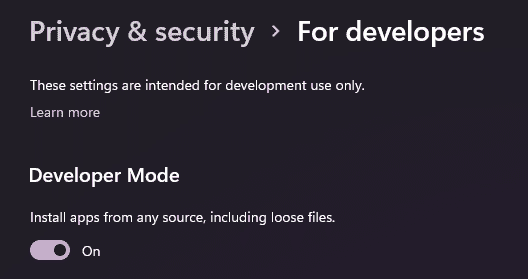
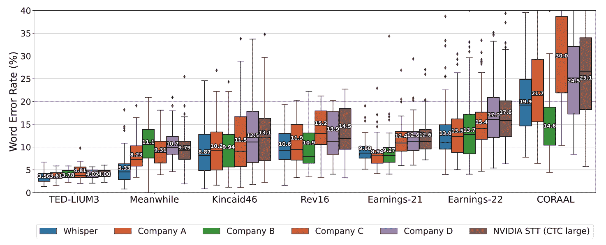
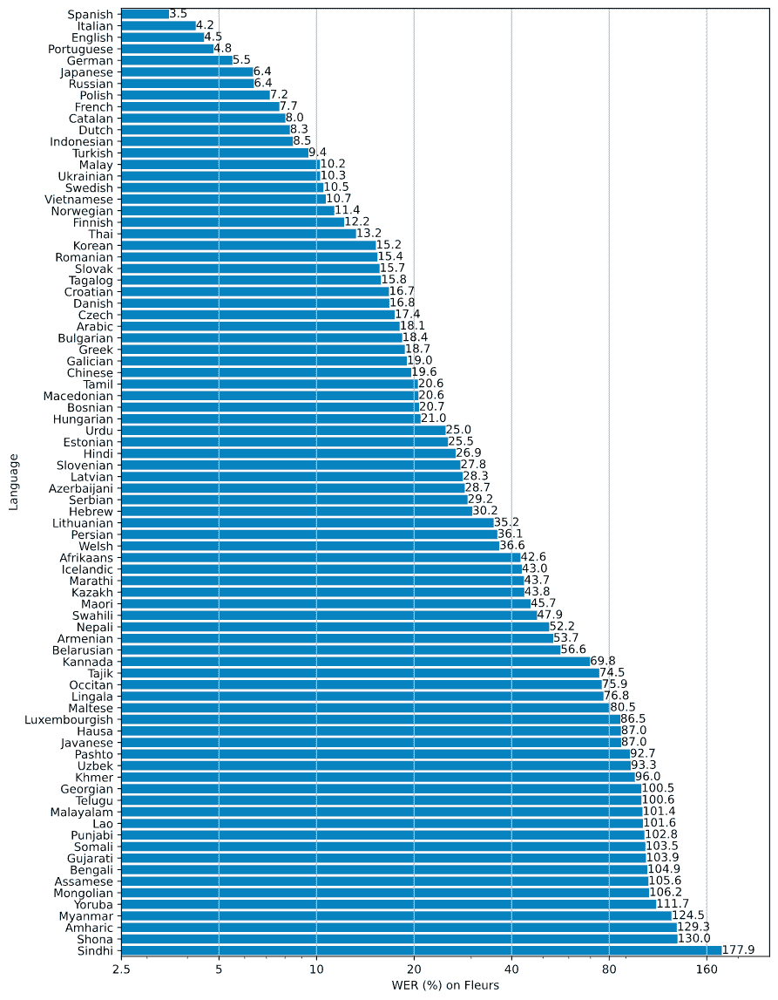
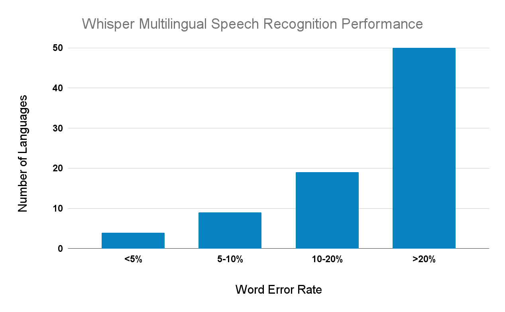
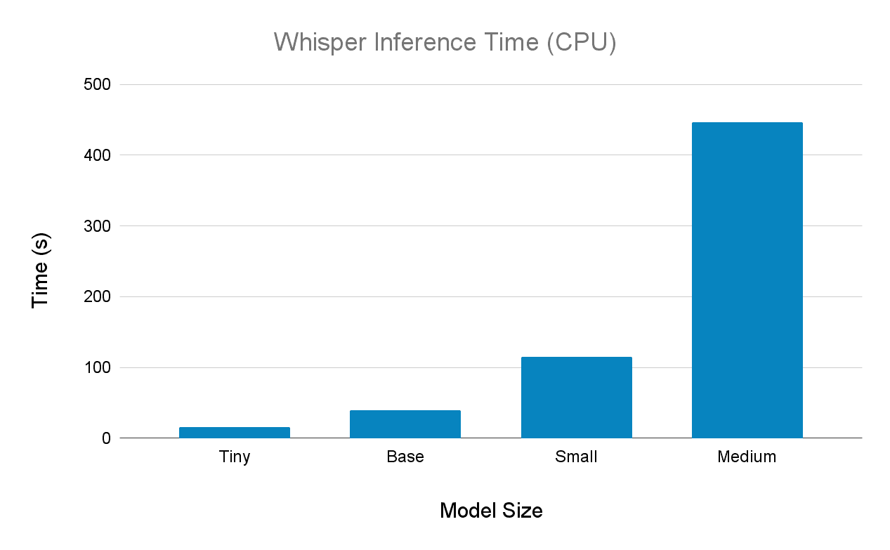
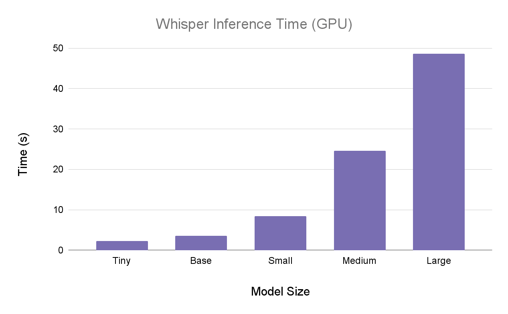
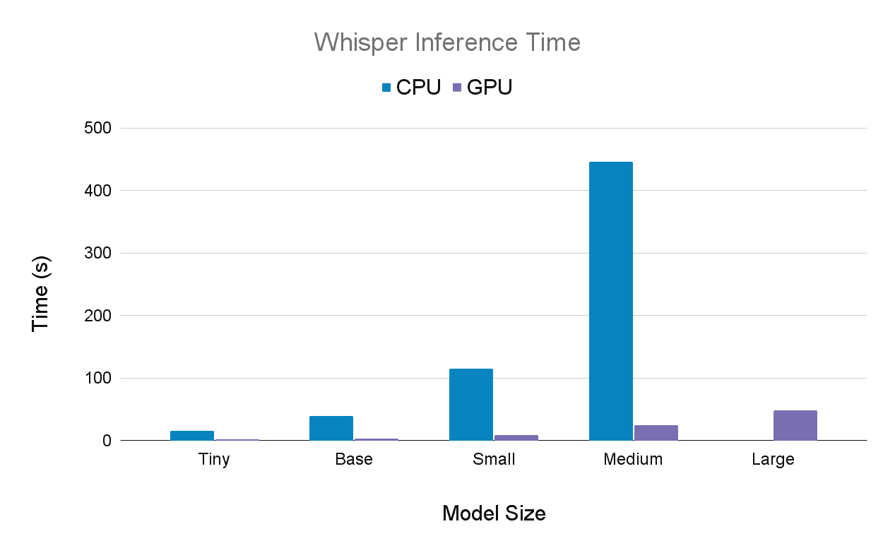
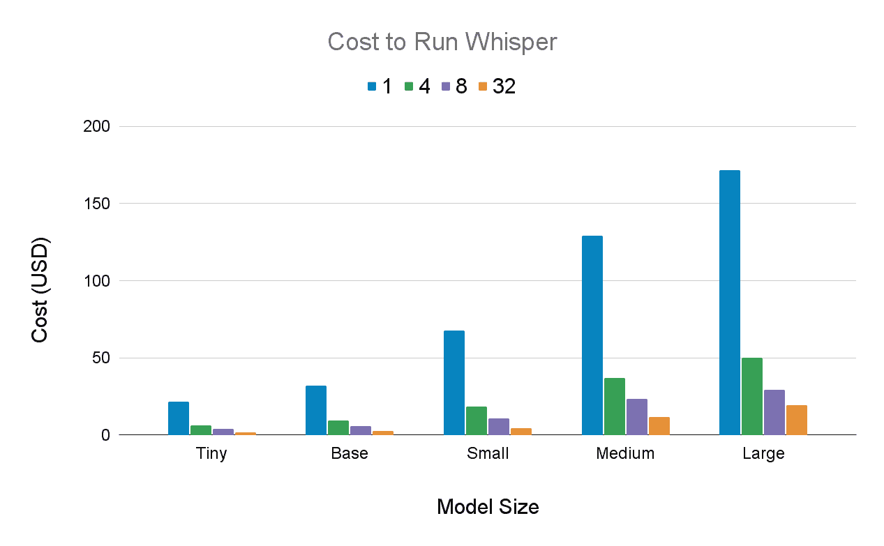

# 如何运行 OpenAI 的耳语语音识别模型

> 原文：<https://www.assemblyai.com/blog/how-to-run-openais-whisper-speech-recognition-model/>

昨天，OpenAI 发布了其 **[耳语](https://openai.com/blog/whisper/)** 语音识别模型。Whisper 加入了当今可用的其他开源语音到文本模型——如 [Kaldi](https://www.assemblyai.com/blog/kaldi-speech-recognition-for-beginners-a-simple-tutorial/) 、Vosk、wav2vec 2.0 等——并匹配语音识别的最先进结果。

在本文中，我们将学习如何**安装和运行 Whisper** ，我们还将对 Whisper 的**准确性**、**推理时间**和**运行成本**进行深入分析。

## 如何运行 OpenAI 的耳语

在本节中，我们将学习如何安装和使用 Whisper。如果你已经开始使用 Whisper，你可以跳到 [Whisper 分析](#openai-whisper-analysis)或者更复杂的 [Whisper 高级用法](#whisper-advanced-usage)。

### 步骤 1:安装依赖项

Whisper 需要 Python3.7+和 PyTorch 的最新版本(我们使用 PyTorch 1.12.1 没有问题)。如果你还没有的话，现在安装 [Python](https://www.python.org/downloads/) 和 [PyTorch](https://pytorch.org/get-started/locally/) 。

Whisper 还需要一个音频处理库 [FFmpeg](https://ffmpeg.org/) 。如果您的机器上尚未安装 FFmpeg，请使用以下命令之一安装它。

```py
# Linux
sudo apt update && sudo apt install ffmpeg

# MacOS
brew install ffmpeg

# Windows
chco install ffmpeg
```

其他详细信息

MacOS 安装命令需要 [Homebrew](https://brew.sh/) ，Windows 安装命令需要 [Chocolatey](https://chocolatey.org/install) ，所以一定要根据需要安装其中一个工具。

最后，如果使用 Windows，请确保启用了开发人员模式。在您的系统设置中，导航到**隐私&安全>开发者**并打开顶部的拨动开关打开开发者模式(如果还没有打开的话)。



### 步骤 2:安装 Whisper

现在我们准备安装 Whisper。打开命令行并执行以下命令来安装 Whisper:

```py
pip install git+https://github.com/openai/whisper.git 
```

### 第三步:运行耳语

#### 命令行

首先，我们将从命令行使用 Whisper。只需打开一个终端，导航到你的音频文件所在的目录。我们将使用一个名为`[audio.wav](https://github.com/AssemblyAI-Examples/audio-intelligence-dashboard/blob/master/gettysburg10.wav)`的文件，这是葛底斯堡演说的第一行。要转录这个文件，我们只需在终端中运行以下命令:

```py
whisper audio.wav
```

输出将显示在终端中:

```py
(venv) C:\Users> whisper audio.wav
Detecting language using up to the first 30 seconds. Use `--language` to specify the language
Detected language: english
[00:00.000 --> 00:10.000]  Four score and seven years ago, our fathers brought forth on this continent a new nation, conceived in liberty, and dedicated to the proposition that all men are created equal.
```

转录也保存到`audio.wav.txt`中，还有一个文件`audio.wav.vtt`用于[的隐藏字幕](https://www.w3.org/TR/webvtt1/)。

#### 计算机编程语言

在 Python 中使用 Whisper 进行转录[非常容易。只需导入 whisper，指定一个型号，并转录音频。](https://github.com/openai/whisper/tree/5f8d4bcc254d4f3e833d353b4cd4454004f5b51a#python-usage)

```py
import whisper

model = whisper.load_model("base")
result = model.transcribe("audio.wav")
```

可以使用`result["text"]`访问转录文本。结果对象本身包含其他有用信息:

```py
{
  "text": " Four score and seven years ago, our fathers brought forth on this continent a new nation, conceived in liberty, and dedicated to the proposition that all men are created equal.",
  "segments": [
    {
      "id": 0,
      "seek": 0,
      "start": 0.0,
      "end": 10.0,
      "text": " Four score and seven years ago, our fathers brought forth on this continent a new nation, conceived in liberty, and dedicated to the proposition that all men are created equal.",
      "tokens": [
        50364,
        7451,
        6175,
        ...,
        2681,
        13,
        50864
      ],
      "temperature": 0.0,
      "avg_logprob": -0.1833780391796215,
      "compression_ratio": 1.3858267716535433,
      "no_caption_prob": 0.05988641083240509
    }
  ],
  "language": "en"
}
```

## OpenAI 耳语分析

来自 [Whisper 论文](https://cdn.openai.com/papers/whisper.pdf) 的下图使用[单词错误率](https://www.assemblyai.com/blog/word-error-rate/) (WER)比较了 Whisper 与当前最先进的语音识别模型的准确性。如您所见，Whisper 报告实现了最先进的结果，这对于语音识别领域来说是一个令人兴奋的发展，尤其是考虑到 Whisper 是一个开源模型。



虽然这些结果令人兴奋，但语音识别仍然是一个未解决的问题，尤其是非英语语言。下图报告了每种支持语言的 Whisper 单词错误率。虽然 Whisper 在几种罗曼语、德语、日语等语言上取得了最先进的效果，但在其他语言上的性能相对较差。



Whisper word error rate as a function of language ([source](https://cdn.openai.com/papers/whisper.pdf))

下面我们看到语言的分布是单词错误率的函数。在上图中的 82 种语言中，50 种语言的单词错误率超过 20%，



### 轶事比较

在组装时，我们的 API 由最先进的 Conformer-CTC 模型提供支持，该模型根据大约 100，000 小时的标记数据进行训练。为了探索 Whisper 的准确性，我们决定将 Whisper 与我们的模型进行几次并排比较。

首先，我们展示了来自 Whisper 公告帖子的微型机器示例的比较:

Micro Machines0:00/0:291×

组装

这是一个微型机器人展示了微型机器人最袖珍的微型车队。这一个有戏剧性的细节，完美的转弯，精确的油漆工作，加上令人难以置信的微型机器口袋的地方说，警察局，消防局，餐馆服务站，等等。完美的便携式口袋可以带去任何地方。而且还有很多微缩的地方可以玩。每一个都有自己的特别版微型机械车和有趣，神奇的功能，奇迹般地感动哦。在机场码头升起无螺栓船，在军事基地的炮塔站岗。在洗车场清洗你的车。升起塔桥。而这些地方合在一起就形成了一个微型机器世界。微型机器口袋地方非常小，非常精确，非常详细，你会想把它们都装进口袋。微型机器是与胶水分开出售的微型装置。越小越好。

谷歌语音转文本

这是迈克尔介绍的微型机器的最袖珍的微型车队，其中一个有戏剧性的细节可怕的当前位置支付工作加上令人难以置信的迈克尔舒马赫的地方，这是有一个警察局消防站餐厅服务站和更完美的桶便携式采取任何地方，还有许多其他地方玩的每一个都有自己的特别版迈克 eruzione 车辆和有趣的神奇功能，奇迹般地移动提高船看着 机场码头士兵军事基地的炮塔在洗车场清洗你的车抬高了收费桥这些游戏装置组合在一起形成了一个微型机器世界就像政体帕克广场一样如此之小如此完美精确如此令人眼花缭乱的细节乔安娜把它们装进口袋我所有的问题都是微型游戏装置与胶水分开出售它们越小越好

低语

这是微型机器人展示的微型机器人车队。每一个都有戏剧性的细节，令人恐怖的修剪，精确的油漆工作，加上令人难以置信的微型机器口袋游戏集。有警察局、消防局、餐馆、服务站等等。完美的便携式口袋，可随身携带。还有许多微型游戏集可以玩，每一个都有自己的特别版微型机器车和有趣的，神奇的功能，奇迹般地移动。在机场码头升起升船机。给军事基地的炮塔配备人员。在洗车场清洗你的车。抬高收费桥。这些游戏装置组合在一起形成了一个微型机器世界。微型机器口袋游戏集，非常小，非常精确，非常详细，你会想把它们都装进口袋。微型机器是与 Galoob 分开出售的微型机器口袋游戏装置。越小越好。

第二个例子是播客中的一个片段

Podcast0:00/1:301×

AssemblyAI

其中之一是我提出了一个主张，我认为大多数文明从简单的细菌之类的东西发展到太空，殖民文明，他们一生中只有很小一部分时间是在我们所处的位置，这一点我可能是错的。另一个我可能错了的是完全不同的陈述，我认为实际上我猜测我们是我们可观测的宇宙中唯一一个光到达我们这里的文明，实际上已经发展到足以发明望远镜的程度。所以让我们依次讨论这两者，因为它们确实不同。第一个，如果你看 N，等于这个星球上的数据。所以我们花了 45 亿年时间在这个星球上为生命奔忙。从智力的角度来看，大部分都是些蹩脚的东西。细菌和恐龙的进化速度大大加快，恐龙在没有发明智能手机的情况下在这里跺了一亿年。最近，我们从牛顿到我们只花了 400 年，对吗？是啊。在技术方面。看看我们都做了些什么。

谷歌语音转文本

其中之一是我提出了一个观点，我认为大多数文明从简单的细菌进化到太空殖民文明，它们只花了很小很小的一部分时间在我们所处的地方。另一个我可能是错的，我可能是错的，关于这个完全不同的陈述，我认为实际上我猜测我们是可观测的宇宙中唯一的文明，生命已经存在了几个星期，或者到目前为止，人类的望远镜已经足够远了，但是如果你看看这个古董，它是我们在这个星球上存在的时间之一，所以我们花了 45 亿年的时间 在这个有生命的星球上，我们得到的大部分东西从智能的角度来看都是很蹩脚的东西。他研究细菌，然后恐龙花了很长时间，到那时已经加速了。恐龙一年花了一亿多时间在这里走来走去，甚至没有发明智能手机。最近，我只花了四百年的时间就技术而言，从牛顿到现在的我们，看看我们都没有

低语

其中之一是，我声称，我认为大多数文明，从，我的意思是，简单的细菌之类的东西到太空殖民文明，他们一生中只有非常非常小的一部分时间在我们这里。我可能弄错了。另一个我可能会错的是完全不同的说法，我认为实际上我猜测我们是我们可观测的宇宙中唯一一个光到达我们这里的文明，它实际上已经发展到足以发明望远镜的程度。所以让我们依次讨论这两者，因为它们确实不同。第一个，如果你看 N 等于 1，我们在这个星球上有一个的日期，对吗？所以我们花了 45 亿年在这个星球上和生命鬼混，对吗？我们得到了，从智能的角度来看，大部分都是很蹩脚的东西，你知道，恐龙已经花了，然后事情实际上被加速了，对吗？那么恐龙已经在这里跺了一亿年了，却没有发明智能手机。最近，你知道，从牛顿到我们只用了四百年，对吗？就技术而言，我们甚至看到了我们所做的。

最后的音频文件是董事会议

Board of Directors Meeting0:00/2:391×

组装

东区宪章。对不起现在就去。好吧。我想召开东区特许学校和纽卡斯尔特许学校董事会的特别联席会议。是 535。我想给这个角色打电话。参加东区特许学校的有斯图尔特女士，索耶先生，戈登博士，黑尔先生，西姆斯女士，小威尔先生，弗图纳托女士，蒂诺女士和汉弗莱先生。参加纽卡斯尔的特许学校。我们有贝利医生、约翰逊女士、泰勒先生、麦克道尔先生、普雷斯顿先生和汉弗莱先生。我想念任何人，并且我不相信任何人在会议线上。因为我们的议程上没有公开的项目。我想要一份纽卡斯尔特许学校董事会的动议，进入管理层讨论，讨论人事问题。我会提出动议。谢谢你，老二先生，普雷斯顿先生。所有特许学校和纽卡斯尔董事会成员赞成，请说赞成。赞成。有人反对吗？动议一致通过。我也会问同样的问题。向东区特许学校提出同样的问题。谢谢 MSN。还有第二种吗？谢谢你，小牛肉先生。所有赞成的人，请说赞成。有人反对吗？好的，我们在 535 从公开会议转到执行会议。我们又回到公开会议了。你刚看了你的留言。好的，我们现在回到 715 的公开会议。没有其他的事情了，我将考虑纽卡斯尔特许学校的延期动议。谢谢你。还有第二种吗？谢谢你。所有赞成的人请说赞成。反对？特许学校。休庭东沃特特许学校。谢谢你。谢谢你米切尔女士。所有赞成的人，请说赞成。反对？动议通过。会议休会。非常感谢大家。

谷歌语音转文本

我想召开东区特许学校董事会特别联席会议是新城特许学校现在是 5 点 35 分我想点名，他们派人去东区特许学校戈登医生修女我很想念他们维尔纽斯·福图纳托·米西亚诺先生和汉弗瑞先生出席新城特许学校我们有贝利医生约翰逊先生泰勒先生麦克道尔小姐普雷斯顿先生和汉弗瑞先生有人和我吗 不要相信任何人都在会议线上我们的议程上没有公开的项目我想要一份来自新城堡特许学校董事会会议的动议进入管理层讨论讨论个人问题打电话给 Turtle Newcastle 董事会成员赞成的请说我特许学校所有赞成的请说我所以我们在 5:35 从公开会议进入管理层会议好的，现在是 750 +你可以离开了吗 现在是 7 点 15 分，没有其他事情了，我在《新城堡》的电影配乐之间休会谢谢，你们都同意吗？请说是我推荐她的，让她知道我将在她的学校做第二次推广，这需要 PPI 动议吗？ /p >

低语

我想宣布纽卡斯尔特许学校东区特许学校董事会召开特别联席会议。是 535。我想给东区特许学校的角色和出席者打电话。我们有斯图尔特先生、索耶先生、戈登医生、海尔先生、泰晤士女士、小牛肉先生、帕尔托女士、迪恩诺女士和汉弗莱先生。参加纽卡斯尔特许学校，我们有贝利医生，约翰逊女士，泰勒先生，麦克道尔先生，普雷斯顿先生和汉弗莱先生。我不相信有人在会议线上。由于我们的议程上没有公开的项目，我希望纽卡斯尔特许学校董事会会议的动议进入管理层讨论，讨论人事问题。我会提出动议。谢谢普雷斯顿先生。所有纽卡斯尔特许学校董事会成员赞成，请说赞成。赞成。赞成。有人反对吗？动议一致通过。我会问东区特许学校同样的问题。谢谢你，泰晤士先生。还有第二种吗？谢谢你，小牛肉先生。所有赞成的人，请说赞成。赞成。有人反对吗？好吧。因此，我们在 535 从公开会议转到执行会议。好了，我们回来了。好吧。现在是 715。我们又回到了公开会议。你只需要拿着我的手机。好吧。所以我们现在回到 715 的公开会议。他们正在进一步发展。然后我将支付纽卡斯尔特许学校的延期动议。谢谢你。还有第二种吗？谢谢你。所有赞成的，请说赞成。赞成。有人反对吗？特许学校停课了。我会像往常一样向东区特许学校提出同样的动议。谢谢你。泰晤士先生，米切尔先生，所有赞成的人，请说赞成。有人反对吗？动议通过。会议休会。非常感谢大家。

正如我们所看到的，Whisper 表现非常好，是当今语音识别可用的最先进选项的一个极好的补充。

### 耳语推理时间

Whisper 有五种尺寸——微型、基本(默认)、小型、中型和大型——尺寸越来越精确。因此，大模型具有最好的准确性，并且是本文和上图中报告的基准中使用的模型。Whisper 在 CPU 和 GPU 上都可以使用；然而，当使用较大的模型时，推理时间在 CPU 上非常慢，所以建议只在 GPU 上运行它们。

在每个模型大小下，使用 Whisper 在 CPU 和 GPU 上转录了 [Micro Machines 示例](https://cdn.openai.com/whisper/draft-20220913a/micro-machines.wav)，推断时间报告如下。首先，我们看到 CPU (i5-11300H)的结果



接下来，我们得到了在 GPU(高内存 GPU Colab 环境)上的结果



这是并列的相同结果



实施细节

如果在 CPU 上使用 Whisper 时碰到 RuntimeError `"slow_conv2d_cpu" not implemented for 'Half'`，那就要用 Python 中的 Whisper 的[底层 API](https://github.com/openai/whisper/tree/5f8d4bcc254d4f3e833d353b4cd4454004f5b51a#python-usage) ，用`options = whisper.DecodingOptions(fp16=False)`代替`options = whisper.DecodingOptions()`。

### 运行 Whisper 的成本

我们提供在 GCP 使用 Whisper(1x A100 40 GB)录制 1，000 小时音频的成本，每个型号使用不同的批量，其值可在图例中找到。



### 最后的话

我们的上述分析表明，Whisper 在多种语言的语音识别方面取得了最先进的结果。与其他开源选项相比，Whisper 将成为研究人员和黑客的一个宝贵工具，因为它的准确性和易用性。Whisper 的性能部分源于其计算强度，因此需要更大、更强大版本的 Whisper 的应用程序应该确保在 GPU 上运行 Whisper，无论是在本地还是在云中。

## 耳语高级用法

我们在上面的[如何运行 OpenAI 的 Whisper](#how-to-run-openais-whisper) 一节中熟悉了 Whisper。对于一个更复杂的例子，我们将回顾一下[多语言 ASR 笔记本](https://github.com/openai/whisper/blob/main/notebooks/Multilingual_ASR.ipynb)的修改版本。执行以下命令下载示例代码并安装必要的要求:

```py
git clone https://github.com/AssemblyAI-Examples/whisper-multilingual.git
cd whisper-multilingual
pip install -r requirements.txt 
```

接下来，只需运行`python main.py`即可将几个韩语音频文件转录并翻译成英语。CPU 处理每个数据大约需要 3 分钟。我们总共使用 10 个数据点，所以让这个过程在后台运行，同时我们检查`main.py`代码。

首先，我们执行所有必要的导入，然后定义一个用于下载和存储音频数据的类。这个类的细节是不相关的，所以为了简洁起见，省略了它们。

```py
import io
import os

import torch
import pandas as pd
import urllib
import tarfile
import whisper

from scipy.io import wavfile
from tqdm import tqdm

class Fleurs(torch.utils.data.Dataset):
	pass
```

接下来，我们用 [pandas](https://pandas.pydata.org/) 设置一些显示结果的参数，设置用于推断的设备，然后设置指定音频语言的变量。第一个是用于下载数据的朝鲜语代码，后者是用于 Whisper 模型的朝鲜语代码。

```py
# Display options for pandas dataset
pd.options.display.max_rows = 100
pd.options.display.max_colwidth = 1000

# Set inference device
device = "cuda" if torch.cuda.is_available() else "cpu"

# Set language (korean)
language_google = "ko_kr"
language_whisper = "korean"
```

现在，我们使用上面定义的类创建数据集，选择 10 个音频文件的子样本以加快处理速度。

```py
# Create dataset object, selecting only 10 examples for brevity
dataset = Fleurs(language_google, subsample_rate=1, device=device)
dataset = torch.utils.data.random_split(dataset, [10, len(dataset)-10])[0]
```

接下来，我们加载将要使用的 Whisper 模型，选择“微小的”模型版本以使推断更快。然后，我们设置转录和翻译选项。

```py
# Load tiny Whisper model
model = whisper.load_model("tiny")

# Set options
options = dict(language=language_whisper, beam_size=5, best_of=5)
transcribe_options = dict(task="transcribe", **options)
translate_options = dict(task="translate", **options)
```

最后，我们遍历数据集，将每个音频文件翻译成韩语，并将每个音频文件翻译成英语。注意，翻译直接在音频数据上发生*，并且不将生成的*转录*翻译成英语。除了用于比较的基本事实参考之外，我们将转录和翻译保存到列表中。*

```py
*`# Run inference
references = []
transcriptions = []
translations = []

for audio, text in tqdm(dataset):
    transcription = model.transcribe(audio, **transcribe_options)["text"]
    translation = model.transcribe(audio, **translate_options)["text"]

    transcriptions.append(transcription)
    translations.append(translation)
    references.append(text)`*
```

*最后，我们创建存储结果的 pandas 数据帧，然后打印结果并保存到 CSV。*

```py
*`# Create dataframe from results and save the data
data = pd.DataFrame(dict(reference=references, transcription=transcriptions, translation=translations))
print(data)
data.to_csv("results.csv")`*
```

*结果如下所示*

*[https://airtable.com/embed/shrsWzrOGuzdC2nNQ?backgroundColor=blue](https://airtable.com/embed/shrsWzrOGuzdC2nNQ?backgroundColor=blue)*