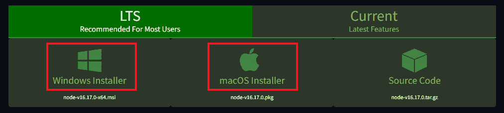
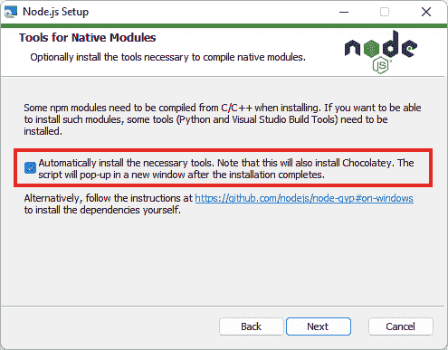
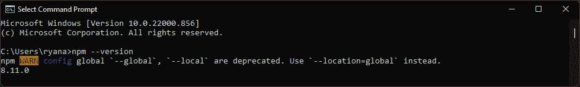
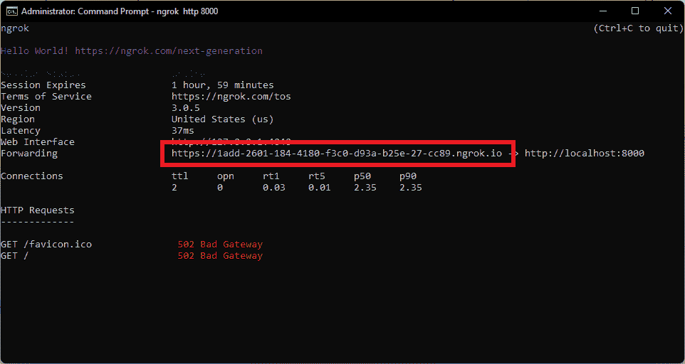
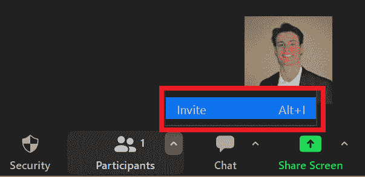
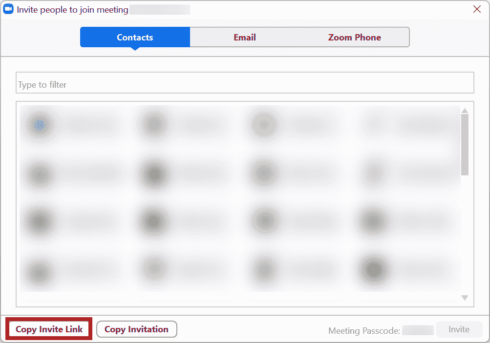
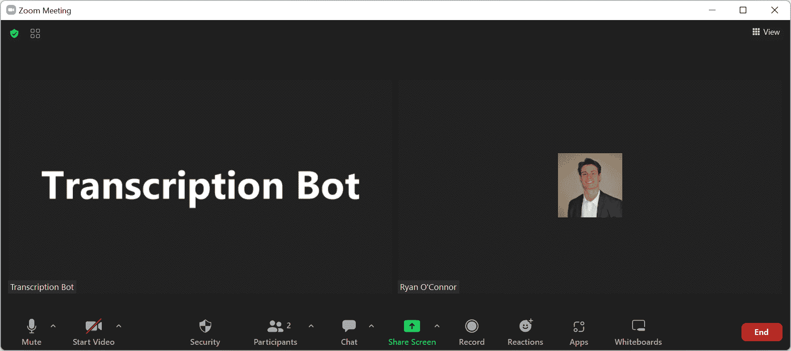
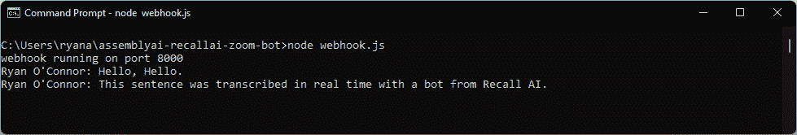

# 如何实时自动转录 Zoom 呼叫

> 原文：<https://www.assemblyai.com/blog/how-to-automatically-transcribe-zoom-calls/>

在当今日益虚拟化的世界中，旧的业务问题需要新的解决方案。随着越来越多的会议通过 Zoom 等平台远程召开，**有效记录会议内容**变得越来越困难。幸运的是，现代的[自动语音识别](https://www.assemblyai.com/blog/what-is-asr/)技术能够自动记录这些远程会议，让你可以自由表达想法和讨论话题，而不必急于记笔记或担心错过重要的东西。

在本教程中，我们将学习如何通过在呼叫中添加一个 **recall.ai** bot 来实时自动转录缩放呼叫。这个机器人将在后台使用 AssemblyAI 实时转录呼叫，在你专注于会议的同时为你处理转录过程的每一步。现在让我们来看看如何实现这个解决方案。

## 什么是 Recall.ai？

[**Recall.ai**](https://www.recall.ai/) **提供单一 API，用于从 Zoom、微软团队、谷歌会议等平台访问实时会议数据**。实时会议集成需要大量移动部件，因此 recall.ai 提供了一个统一的框架来简化这一过程。Recall.ai 可以轻松地根据谁在发言、人们何时加入或离开会议等等触发操作，所有这些都可以通过一个用于每个平台的 API 来帮助降低开发时间和维护成本。该 API 可用于音频和视频流，**甚至用于没有公开 API 的会议平台**。

## 预赛

在我们开始实际实现之前，我们需要确保安装了所有需要的工具。现在，让我们按照安装程序安装我们需要的所有东西。

### 1 -安装 Node.js 和 npm

首先，我们需要一个 JavaScript 运行时 **[Node.js](https://en.wikipedia.org/wiki/Node.js)** 和一个包管理器 **[npm](https://en.wikipedia.org/wiki/Npm_(software))** 。通过打开命令提示符(终端)并输入以下命令，检查是否安装了 Node.js 和/或 npm:

```py
node -v
npm -v
```

如果安装了这些工具，您将在终端中看到它们的版本。在这种情况下，你可以跳到[的下一步](#2install-ngrok)。否则，您将需要安装它们。去[节点网站](https://nodejs.org/en/download/)下载适合你机器的安装程序，可能是 **64 位 Windows 安装程序**或 **64 位 macOS 安装程序**。



一旦安装程序被下载，点击它，并按照安装提示。除了勾选“自动安装必要的工具”复选框之外，您可以继续点击“下一步”来浏览提示，而不改变任何内容**。**



安装完成后，将打开一个终端来安装其他一些工具。允许安装这些工具，之后您的计算机可能会重新启动。重新启动后，通过打开终端并键入`npm --version`来检查安装是否正确，这将显示所安装的 npm 版本。



### 2 - Install Ngrok

接下来，我们需要安装 **ngrok** ，这是一个反向代理，可以让您将本地机器安全地暴露给互联网。使用以下命令之一安装 ngrok，选择适合您的操作系统的命令:

```py
# MacOS
brew install ngrok/ngrok/ngrok

# Windows
choco install ngrok
```

请注意，如果您使用的是 Windows，您可能需要先[安装 chocolatey](https://chocolatey.org/install) 。或者，你可以从 [ngrok 网站](https://ngrok.com/download)下载一个 ZIP 文件，然后在里面运行可执行文件。如果这些命令不起作用，或者如果你使用的是另一个操作系统，比如 GNU/Linux，请在其网站上查找相应的 ngrok 安装程序[。](https://ngrok.com/download)

### 3 -获取 API 密钥

现在我们已经安装了上述工具，我们最终需要获得一个免费的 **recall.ai API key** 。这是一个识别值，它告诉 recall.ai 你是谁，并让你访问它的服务。

要获取密钥，请进入[recall.ai/AssemblyAI 网页](https://www.recall.ai/assemblyai)并点击“获取集成”。目前，这项服务只能通过邀请提供，但只有 AssemblyAI 客户才能使用。

重要的

确保不要对外共享这个 API 密钥。这是您的帐户独有的，应该保密。

## Repo 克隆和环境设置

完成所有预备步骤后，我们可以继续克隆[项目存储库](https://github.com/AssemblyAI/assemblyai-recallai-zoom-bot)并设置我们的环境。首先，克隆 repo，并使用以下终端命令导航到它:

```py
git clone https://github.com/AssemblyAI/assemblyai-recallai-zoom-bot
cd assemblyai-recallai-zoom-bot
```

如果您没有安装 git，那么在运行上面的命令之前，您需要[安装它](https://git-scm.com/downloads)。接下来，安装所有必要的 npm 软件包

```py
npm install
```

最后，通过编辑`.env`文件并用您的 recall.ai API 密钥替换`<YOUR-KEY-HERE>`，将您的 recall.ai API 密钥保存为环境变量。

```py
RECALL_API_KEY=<YOUR-KEY-HERE> 
```

将密钥保存为环境变量省去了将密钥硬编码到脚本中的需要，这是不安全和不优雅的。`.env`文件列在`.gitignore`文件中，以避免密钥意外上传到 GitHub 等；但是如果您想要一个更安全的解决方案，那么将您的密钥作为一个环境变量保存在您的本地机器上。

## 如何自动转录缩放呼叫

现在设置过程已经完成，我们终于可以实时转录缩放调用了。首先，我们将使用 ngrok 为我们的 webhook 生成一个 URL，方法是在终端中输入以下命令:

```py
ngrok http 8000
```

`8000`指定请求将被转发到的端口。上面的命令将向终端输出类似下面的 screencap 的内容。“转发”后的地址是我们需要的公开地址。



通过编辑克隆的 repo 中的 [`.env`文件并用复制的地址替换`<WEBHOOK_URL>`，复制该地址并将其保存为环境变量。](https://github.com/AssemblyAI/assemblyai-recallai-zoom-bot/blob/main/.env)

```py
WEBHOOK_URL=<YOUR-URL-HERE> 
```

让 ngrok 终端保持打开，打开另一个终端，导航到项目 repo，用

```py
cd path/to/repo/assemblyai-recallai-zoom-bot
node webhook.js
```

最后，让**两个**ngrok 和 webhook 终端都打开，打开*另一个*终端，导航到项目 repo，用

```py
cd path/to/repo/assemblyai-recallai-zoom-bot
node zoomBot.js
```

您将在`zoomBot.js`终端看到一个提示，询问您想要添加转录机器人的缩放会议的 URL。要获取此 URL，请进入您的 Zoom 会议，单击“参与者”旁边的箭头，然后单击“邀请”。



然后点击“复制邀请链接”。



将复制的网址粘贴到`zoomBot.js`终端的“你的会议网址是什么？:”提示，点击“回车”。您将看到转录机器人添加到您的缩放会议。



回到`webhook.js`终端，生成会议的实时记录，包括发言者标识符。



这就是实时转录缩放呼叫所需的全部内容！

## 最后的话

在本教程中，我们学习了如何通过几个简单的步骤，使用 **ngrok** 和 **Node.js** 将由 **recall.ai** 和 **AssemblyAI** 驱动的**实时转录机器人**添加到缩放调用中。要了解更多关于 recall.ai 或注册 API 密钥的信息，请访问他们的网站。

如果你正在寻找更多与机器学习相关的内容，比如关于 DALL-E 2 如何实际工作的文章，或者关于 NLP 中的 T2 话题检测的信息，请随时查看我们的 T4 博客！您也可以关注我们的时事通讯，了解即将发布的内容。

喜欢这篇文章吗？

关注我们的时事通讯，了解更多类似的内容！

[Follow](https://assemblyai.us17.list-manage.com/subscribe?u=cb9db7b18b274c2d402a56c5f&id=2116bf7c68)