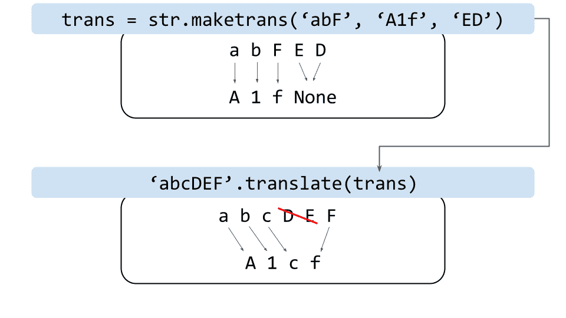

# ESPnet 入门

> 原文：<https://www.assemblyai.com/blog/getting-started-with-espnet/>

也许比起深度学习的其他子领域，语音处理在历史上需要更多的专业知识。例如，将声学语音波转换成文本人类语言是一个困难的问题，这在以前需要几个移动部分，如声学模型、发音模型、语言模型等。

作为 2010 年代深度学习热潮的结果，**端到端神经语音识别系统**已经变得可以训练，并因此得到广泛使用。像 [ESPnet](https://github.com/espnet/espnet) 这样的工具包为研究这样的模型提供了基础，然后这些模型可以被训练并放到外行人的手中，进一步使以前以专家为主的语音处理领域民主化。

在本文中，我们将介绍 ESPnet 并演示如何使用预训练模型进行自动语音识别(ASR)，然后将结果与其他一些流行的 ASR 框架/平台进行比较。让我们开始吧！

## 介绍

如上所述，ESPnet 是一个端到端的语音处理工具包，涵盖了广泛的语音处理应用程序，包括:

1.  自动语音识别(ASR)
2.  文本到语音转换
3.  [扬声器二进制化](https://www.assemblyai.com/blog/top-speaker-diarization-libraries-and-apis-in-2022/)
4.  语音翻译，以及
5.  语音增强

ESPnet 最初建立在另一个开源语音处理工具包 [Kaldi](https://kaldi-asr.org/) 之上。随着 ESPnet 2 的发布，完全不再需要 Kaldi，尽管 ESPnet 2 保持了 Kaldi 风格的数据准备以保持一致性。

想了解更多关于卡尔迪的信息？

查看我们简单易懂的 Kaldi 入门指南。

[Check it out](https://www.assemblyai.com/blog/kaldi-speech-recognition-for-beginners-a-simple-tutorial/)

ESPnet 的伟大之处在于，它是用 Python 编写的**，这是许多机器学习从业者和爱好者的首选语言，而不是用 C++编写的 Kaldi。Kaldi 和 ESPnet 都提供了几个预训练的模型，使得将语音处理的元素结合到应用程序中变得更加容易。现在让我们看看如何在 Python 中利用这样的模型。**

## 如何使用预训练的 ESPnet 模型进行语音识别

在本教程中，我们将转录葛底斯堡演说第一行的音频文件。下面附上音频剪辑:

Gettysburg Address (First Line)0:00/0:101×

不幸的是，ESPnet 可能很难工作，所以对于本教程来说，我们将使用 Ubuntu 18.04.06 LTS ，它的 ISO 可以在[这里](https://releases.ubuntu.com/18.04/)找到。您可以使用此 ISO 在 VMware 中启动虚拟机，并完全按照本教程进行操作。

首先，我们需要安装一些必要的软件包。打开终端并执行以下命令:

```py
sudo apt update
yes | sudo apt upgrade
yes | sudo apt install ffmpeg sox cmake git virtualenv libfreetype6-dev gcc
yes | sudo apt-get install python3-dev libxml2-dev libxmlsec1-dev
```

现在，克隆[教程报告](https://github.com/AssemblyAI-Examples/intro-to-espnet)并导航到其中:

```py
git clone https://github.com/AssemblyAI-Examples/intro-to-espnet.git
cd intro-to-espnet
```

接下来，创建一个 virtualenv 并安装所有必需的软件包:

```py
virtualenv venv -p /usr/bin/python3.6
source venv/bin/activate
pip install --no-cache-dir -r requirements.txt
```

现在我们已经完成了设置，**我们可以通过简单地执行`speech2text.py`将我们的音频文件转录成一行**:

```py
python3 -m speech2text.py
```

基本事实转录和生成转录都将被打印到控制台。我们将在下面检查`speech2text.py`是如何工作的，但首先让我们看看结果，并将它们与其他 ASR 选项进行比较。

### 结果

下面可以看到地面真相转录，以供参考:

#### 地面实况; 真值（机器学习）

八十七年前，我们的先辈在这个大陆上创建了一个新国家，它孕育于自由之中，奉行人人生而平等的原则

接下来我们有由最好的 ESPnet 模型生成的脚本(也是`speech2text.py`中的默认脚本)——一个基于 Transformer 的模型，它产生了 **0 个错误**:

#### 转录(模型 1) - 0% WER

八十七年前，我们的先辈在这个大陆上创建了一个新国家，它孕育于自由之中，奉行人人生而平等的原则

我们还展示了由另一个预训练的 ESPnet 模型生成的副本，在这种情况下，一个基于 Conformer 的模型产生了 **8 个错误**:

#### 转录(模型 2) - 27% WER

七年前，我们的父辈**肉汤和**这片大陆上一个新的**国家为了**自由**献身于**人人生而平等的主张

ESPnet 提供了许多其他可以探索的预训练模型。这些模型中的一些如上所述进行了尝试，但是产生了非常不准确的结果，因此被省略。

### ESPnet 与其他 ASR 解决方案相比如何？

为了了解这种预训练的 ESPnet 模型与其他 ASR 解决方案相比如何，我们首先考虑 Kaldi，我们使用其预训练的[LibriSpeech ASR 模型](https://kaldi-asr.org/models/m13)。关于使用这个模型和开始使用 [Kaldi 语音识别](https://www.assemblyai.com/blog/kaldi-speech-recognition-for-beginners-a-simple-tutorial/)的完整指南，请参见链接文章。

LibriSpeech 预训练 Kaldi 模型产生 **5 个误差**，对应于 **17%的 WER** 。相应的文字记录如下:

七年前，我们的先辈们创建了 T2，在这个大陆上诞生了一个新的国家——T4、自由、T7——奉行人人生而平等的原则

除了 ESPnet 和 Kaldi 的开源选项，我们还测试了几个[云语音转文本 API](https://www.assemblyai.com/blog/the-top-free-speech-to-text-apis-and-open-source-engines/)进行比较。结果总结在下表中:

| **ASR 框架/平台** | **单词错误率** |
| 

* * *

 |
| ESPnet -模型 1 | 0% |
| ESPnet -模型 2 | 27% |
| 卡尔迪-李伯希模型 | 17% |
| 组装 | 0% |
| 亚马逊转录 | 0% |
| 谷歌云语音转文本 | 0% |

正如我们所看到的，从 WER 的角度来看，一些 ESPnet 模型非常强大，可以与其他产品竞争。对于简单的转录，ESPnet 是一个很好的开源选择。对于那些寻求低错误率之外的选项的人来说，比如高可读性或音频智能洞察力，其他选项可能更有成效。

## 代码分解

现在，我们已经看到了如何通过调用一个简单的 Python 脚本来使用 ESPnet 预训练模型，现在让我们来探索脚本本身，以了解幕后发生的事情。注意，`speech2text.py`的 B 元素来自官方 ESPnet Jupyter [笔记本](https://github.com/espnet/notebook)。

### 进口

首先，像往常一样，我们导入所有我们需要的包。ESPnet 的伟大之处在于，当只使用预训练的模型执行推理时，可以通过带有拥抱脸和/或芝诺多的 API 非常容易地使用它。`espnet_model_zoo`包提供了这个功能——我们导入了`ModelDownloader`,它提供了一个简单的方法来获取存储在 Hugging Face 或 Zenodo 中的模型。`espnet2`包为我们提供了适当的二进制文件，我们将需要使用提取的模型进行推理。

```py
import subprocess as s
import os
import string
import soundfile
from espnet_model_zoo.downloader import ModelDownloader
from espnet2.bin.asr_inference import Speech2Text 
```

### 下载预训练模型

在所有导入之后，是时候下载预训练模型了。变量`tag`存储了我们想要下载的模型的位置，如这里的[所列](https://github.com/espnet/espnet_model_zoo/blob/master/espnet_model_zoo/table.csv)。默认情况下，我们使用最好的模型，尽管另外两个模型已经包含在内并被注释掉，以便那些好奇的人尝试其他模型。

指定要下载的模型后，我们创建一个`Speech2Text`推理对象，使用`ModelDownloader`类的一个实例来下载由`tag`指定的模型。剩下的参数只是简单地指定了推理的参数——更多细节见[这里的](https://espnet.github.io/espnet/_modules/espnet2/bin/asr_inference.html)。注意如果用 GPU 的话`device`可以改成`cuda`。

```py
# BEST MODEL:
tag = "Shinji Watanabe/librispeech_asr_train_asr_transformer_e18_raw_bpe_sp_valid.acc.best"
# SECOND BEST MODEL:
#tag = 'Shinji Watanabe/spgispeech_asr_train_asr_conformer6_n_fft512_hop_length256_raw_en_unnorm_bpe5000_valid.acc.ave'
# EXTREMELY POOR MODEL:
#tag = "kamo-naoyuki/wsj"

d = ModelDownloader()
speech2text = Speech2Text(
    **d.download_and_unpack(tag),
    device="cpu", #cuda if gpu
    minlenratio=0.0,
    maxlenratio=0.0,
    ctc_weight=0.3,
    beam_size=10,
    batch_size=0,
    nbest=1
)
```

### 助手功能

在使用我们的推理对象生成脚本之前，我们创建了两个辅助函数。首先，我们创建`text_normalizer()`，它返回大写的输入文本并去掉所有标点符号。

```py
def text_normalizer(text):
    text = text.upper()
    return text.translate(str.maketrans('', '', string.punctuation))
```

其他详细信息

`text_normalizer()`方法利用了一个翻译表。当用三个参数初始化时，转换表将第一个参数中的字符顺序映射到第二个参数中的字符，并将最后一个参数中的字符映射到空字符。未列出的字符被映射到它们自己。然后，`translate`函数将翻译表应用于目标字符串。

下面可以看到一个例子。首先，我们看到了创建翻译表的语法，相应的对象显示在框中。然后，我们看到将这个转换表应用于字符串`abcDEF`的语法，以及在框中可视化的应用它的效果，最终得到字符串`A1cf`



回到`text_normalizer`函数，我们观察到它首先用`text = text.upper()`将文本转换成大写。接下来，它用`str.maketrans('', '', string.punctuation)`创建一个翻译表，简单地将所有标点符号映射到空字符。最后`return text.translate(...)`使用这个翻译表去掉我们的文本并返回它。

其次，我们创建一个函数，在给定音频文件路径的情况下生成并返回脚本。创建一个函数来获取抄本。`soundfile.read()`读入我们的音频数据，然后`speech2text`预测语音。我们用`nbests[0]`分离出最佳预测，然后连同音频文件的采样率一起返回副本。

```py
def get_transcript(path):
    speech, rate = soundfile.read(path)
    nbests = speech2text(speech)
    text, *_ = nbests[0]
    return text, rate
```

### 转录音频文件

定义好助手函数后，我们就可以转录音频文件了。对于我们的`audio`文件夹中的每个文件，我们通过`get_transcript()`函数传递该文件，如果我们的模型只能处理`.wav`文件，那么首先用 ffmpeg 将其转换为`.wav`文件。

```py
path = os.path.join(os.getcwd(), 'egs')
files = os.listdir(path+'/audio')

for file in files:
    if not file.endswith('.wav'):
        # Convert to .wav and change file extension to .wav
        os.chdir(path+'/audio')
        s.run(f"ffmpeg -i {file} {file.split('.')[0]}.wav", shell=True, check=True, universal_newlines=False)
        os.chdir('../..')
        file = file.split('.')[0]+'.wav'

        # Transcribe and delete generated file
        text, est_rate = get_transcript(f'{path}/audio/{file}')
        os.remove(f'{path}/audio/{file}')
    else:
        text, est_rate = get_transcript(f'{path}/audio/{file}')
```

转录后，我们读入每个音频文件的`text`文件夹中的真实对应转录，然后打印出地面真实和假设转录:

```py
 # Fetch true transcript
    label_file = file.split('.')[0]+'.txt'
    with open(f'{path}/text/{label_file}', 'r') as f:
        true_text = f.readline()
    # Print true transcript and hypothesis
    print(f"\n\nReference text: {true_text}")
    print(f"ASR hypothesis: {text_normalizer(text)}\n\n")
```

这就是全部了！在 ESPnet 中使用预先训练的模型非常简单，只需几行代码就可以将语音处理交给普通用户。

## 最后的话

虽然我们在本教程中只研究了 ASR，但 ESPnet 已经为各种其他任务预先训练了模型，包括文本到语音转换、说话者二进制化和降噪。查看 [ESPnet 文档](https://github.com/espnet/espnet)了解更多信息。

要获得更多关于 NLP 和一般机器学习的指南和教程，请随意查看我们的[博客](https://www.assemblyai.com/blog)，或者关注我们的时事通讯。

[Follow the AssemblyAI Newsletter](https://assemblyai.us17.list-manage.com/subscribe?u=cb9db7b18b274c2d402a56c5f&id=2116bf7c68)