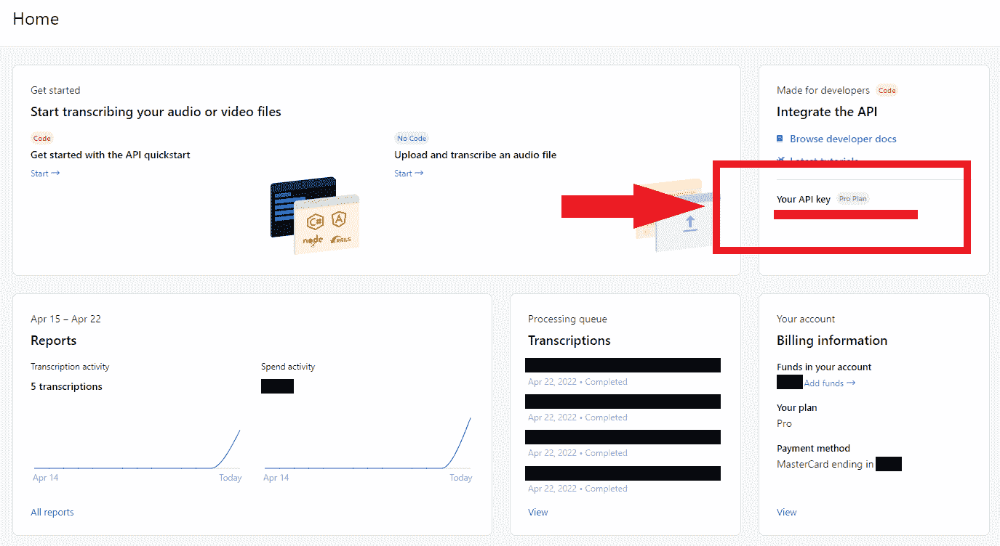
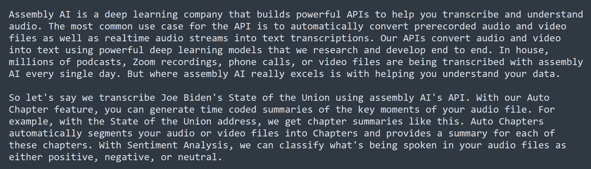

# 用 Python 在 5 分钟内将语音转换成文本

> 原文：<https://www.assemblyai.com/blog/assemblyai-and-python-in-5-minutes/>

在本教程中，**我们将学习如何使用 Python 和 AssemblyAI 的[语音转文本 API](https://www.assemblyai.com/) 在 5 分钟内**完成语音转文本。我们提供了一个很小的库，只需要几行代码就可以转录本地和非本地文件，我们还为那些想了解幕后发生了什么的人提供了库函数的分解。让我们开始吧！

## 入门指南

首先，我们将安装 Python 的`requests`包，它将允许我们与 AssemblyAI API 通信，以便提交文件进行转录。打开一个终端，并使用以下命令安装它:

```py
pip install requests
```

接下来，我们需要为本文克隆[项目存储库](https://github.com/AssemblyAI-Examples/speech-recognition-in-5-minutes-with-python)，它包含了我们需要的所有代码。从 GitHub 下载存储库，或者使用 Git 通过以下终端命令克隆它:

```py
git clone https://github.com/AssemblyAI-Examples/assemblyai-and-python-in-5-minutes
cd assemblyai-and-python-in-5-minutes
```

终端尖端

您可以通过右键单击终端将这些命令粘贴到终端中。

## 如何用 Python 转录音频文件

现在，我们可以开始转录一个音频文件，它可以存储在本地或非本地。项目资源库包括一个名为`audio.mp3`的样本音频文件，它是从我们的 [YouTube 频道](https://www.youtube.com/channel/UCtatfZMf-8EkIwASXM4ts0A)上的 [AssemblyAI 产品概述](https://www.youtube.com/watch?v=rG_VVYtZTpU)视频中分离出来的音频。如果你有一个特定的音频文件，你想转录，**现在把它放在项目文件夹**。

### 获取语音转文本 API 密钥

为了执行转录，我们将使用 AssemblyAI 的免费[语音转文本 API](https://www.assemblyai.com/blog/the-top-free-speech-to-text-apis-and-open-source-engines/) 。如果您还没有帐户，请在这里创建一个[。登录您的账户查看](https://app.assemblyai.com/signup)[仪表盘](https://app.assemblyai.com/)，它提供了您账户的快照。我们现在需要的就是你的 API 密匙。单击仪表板上*您的 API 密钥*部分下的密钥，复制其值。



AssemblyAI Dashboard with API key location highlighted

这个 API 密匙就像与你的账户相关联的指纹，让 API 知道你有使用它的权限。

重要说明

千万不要和任何人分享你的 API 密匙或者上传到 GitHub。您的密钥**与您的帐户唯一关联**，应该保密。

### 存储您的 API 密钥

出于安全和方便的原因，我们希望避免对 API 密钥进行硬编码。对键值进行硬编码很容易导致意外共享或上传到 GitHub，并且作为命令行参数反复传递既麻烦又繁琐。为了克服这些问题，我们将把 API 键存储为一个[环境变量](https://en.wikipedia.org/wiki/Environment_variable)。

回到终端，根据您的操作系统，执行以下命令之一，用先前从 AssemblyAI 仪表板复制的值替换`<YOUR_API_KEY>`:

#### Windows 操作系统

```py
set AAI_API_KEY=<YOUR_API_KEY>
```

#### 类 UNIX 系统

```py
export AAI_API_KEY=<YOUR_API_KEY>
```

该变量只存在于终端进程的范围内，因此在关闭终端时会丢失。要保持此变量，请设置一个永久的用户环境变量。

### 转录音频文件

既然 API 键被保存为环境变量，我们可以用一个终端命令转录音频文件。在项目存储库中打开一个终端，并运行以下命令:

```py
python transcribe.py <AUDIO-FILENAME-OR-URL> [--local]
```

如果是本地的，用音频文件名替换`<AUDIO-FILENAME-OR-URL>`,如果不是本地的，用 URL 替换。对于本地示例，可以使用 repo 附带的默认本地`audio.mp3`文件，或者对于非本地示例，可以尝试使用该文件的 [GitHub URL](https://github.com/AssemblyAI-Examples/speech-recognition-in-5-minutes-with-python/raw/main/audio.mp3) 。如果使用本地文件，请确保包含`--local`标志。

使用限制访问的非本地文件？

查看我们关于在 AssemblyAI 中使用预先设计的 URL 的指南。

[Open Guide](https://www.assemblyai.com/blog/transcribing-audio-files-in-an-s3-bucket-with-assemblyai/)

执行完命令后，只需等待片刻，您的转录就会出现在控制台中，并保存到一个名为`transcript.txt`的文件中。较大的音频文件将需要较长的处理时间。



HTTPS 笔记

与 AssemblyAI API 通信时，必须使用 HTTPS。使用例如 HTTP 代理将导致错误。

这就是使用 AssemblyAI 的语音转文本 API 转录一个文件所需要的全部内容！要了解更多关于引擎盖下发生的事情，请继续阅读[下一节](https://www.assemblyai.com/blog/assemblyai-and-python-in-5-minutes/#code-breakdown)。

或者，查看我们的[文档](https://docs.assemblyai.com/)以获得更多关于 AssemblyAI 入门的信息，或者了解更多关于我们的[音频智能](https://www.assemblyai.com/blog/what-is-audio-intelligence/#:~:text=Built%20using%20the%20latest%20Deep,top%20of%20their%20audio%20data.)功能的信息。也可以随意查看我们的[博客](https://www.assemblyai.com/blog)或者订阅我们的时事通讯，获取关于机器学习的一般内容。

[Get a free API key](https://app.assemblyai.com/signup)

## 代码分解

在上一节中，我们使用了`[transcribe.py](https://github.com/AssemblyAI-Examples/speech-recognition-in-5-minutes-with-python/blob/main/transcribe.py)` Python 文件来自动生成音频文件的副本。现在让我们深入研究这个 Python 文件，以便更好地理解幕后发生的事情。

像往常一样，文件的顶部列出了所有必需的导入。我们包括:

1.  `argparse`，一个本地 Python 库，允许我们解析命令行参数，
2.  `os`，另一个本地 Python 库，它允许我们导入刚刚设置的 API key 环境变量，以及
3.  `utils`，它导入位于项目存储库中的`[utils.py](https://github.com/AssemblyAI-Examples/speech-recognition-in-5-minutes-with-python/blob/main/utils.py)`中的辅助函数库。

```py
import argparse
import os
import utils
```

`main()`函数中的以下代码包含了`transcribe.py`中的所有逻辑。首先，定义并解析`transcribe.py`的命令行参数。`--local`和`--api_key`中的两个破折号表示这些参数是可选的，`action`关键字定义了在提供这些值的情况下应该如何处理它们。

```py
parser = argparse.ArgumentParser()
parser.add_argument('audio_file', help='url to file or local audio filename')
parser.add_argument('--local', action='store_true', help='must be set if audio_file is a local filename')
parser.add_argument('--api_key', action='store',  help='<YOUR-API-KEY>')

args = parser.parse_args()
```

其他详细信息

*   `--local`和`--api_key`中的两个破折号表示这些参数是可选的
*   `action`定义在提供可选参数的情况下，应该如何处理这些可选参数。`--local`作为一个标志，指示一个本地文件正在被传递用于转录(与一个网址相反)，因此我们设置`args.local=True`在`--local`被传递的情况下指示这一点。`--api_key`在`AAI_API_KEY`环境变量未设置的情况下提供 AssemblyAI API 键，所以我们将`args.api_key`设置为与通过`--api_key`参数传入的相应字符串相等
*   最后，`help`提供了关于`transcribe.py`用法的帮助说明。在终端运行`python transcribe.py --help`可以看到帮助信息。

我们将 API 键作为命令行参数传递的选项留了下来；但是，如果没有传递，我们希望程序默认使用存储在`AAI_API_KEY`环境变量中的 API 键。我们用下面的代码来完成这个任务，我们导入`AAI_API_KEY`并将其分配给`args.api_key`。如果没有设置环境变量，并且没有将 API 键作为命令行参数传递，将会引发错误。

```py
if args.api_key is None:
	args.api_key = os.getenv("AAI_API_KEY")
	if args.api_key is None:
		raise RuntimeError("AAI_API_KEY environment variable not set. Try setting it now, or passing in your API key as a command line argument with `--api_key`.")
```

接下来，我们需要创建一个 HTTP 头，它将与我们的 API 请求一起发送。这个头包含关于请求的附加信息，特别是包括用于认证的 API 密钥。

```py
header = {
	'authorization': args.api_key,
	'content-type': 'application/json'
}
```

为了提交一个文件进行转录，我们需要提供一个可以找到该文件的 URL。如果我们想要转录一个本地文件，我们必须首先将它上传到 AssemblyAI 来生成这样一个 URL。我们可以用提供的`utils.upload_file()`函数来做这件事。如果我们为`transcribe.py`提供一个 URL 而不是一个本地文件，我们只需要创建一个字典来存储这个 URL，以实现我们的转录请求的正确格式化。这些步骤封装在下面的代码块中:

```py
if args.local:
    upload_url = utils.upload_file(args.audio_file, header)
else:
    upload_url = {'upload_url': args.audio_file}
```

我们现在准备提交我们的文件进行转录，我们可以用提供的`utils.request_transcript()`函数在一行中简单地完成:

```py
transcript_response = utils.request_transcript(upload_url, header) 
```

既然我们的文件已经提交转录，我们需要等待它完成处理。为了知道转录何时完成，我们需要创建一个[轮询](https://en.wikipedia.org/wiki/Polling_(computer_science))端点，我们可以用它来检查转录状态。我们用提供的`utils.make_polling_endpoint()`函数创建轮询端点:

```py
polling_endpoint = utils.make_polling_endpoint(transcript_response)
```

现在我们有了轮询端点，我们必须实际使用它来检查转录。我们使用提供的`utils.wait_for_completion()`函数来实现这一点，该函数使用轮询端点每 5 秒获取一次更新的转录状态。当返回`completed`转录状态时，该功能将结束执行。

```py
utils.wait_for_completion(polling_endpoint, header) 
```

转录最终完成了，我们可以用提供的`utils.get_paragraphs()`函数获取转录本的段落。这个函数返回一个包含脚本段落的列表。

```py
paragraphs = utils.get_paragraphs(polling_endpoint, header) 
```

现在我们已经有了文字记录段落，剩下要做的就是将它们打印到终端并保存到一个名为`transcript.txt`的文件中:

```py
with open('transcript.txt', 'w') as f:
	for para in paragraphs:
		print(para['text'] + '\n')
		f.write(para['text'] + '\n')
```

所有上述逻辑都包含在`main()`函数中，所以总结一下，如果从终端调用`transcribe.py`，我们只需执行`main()`函数:

```py
if __name__ == '__main__':
    main()
```

这就是 AssemblyAI 在高层次上生成转录的方式。如果你想要更详细的理解，继续到[下一节](https://www.assemblyai.com/blog/assemblyai-and-python-in-5-minutes/#library-functions-breakdown)来学习我们上面使用的助手函数是如何工作的。否则，如果以上解释足以满足您的目的，请继续阅读[的结束语](https://www.assemblyai.com/blog/assemblyai-and-python-in-5-minutes/#final-words)。

## 图书馆功能细分

在这一节中，我们将通过查看`utils.py`文件来深入理解如何生成转录，该文件为我们上面的代码提供了功能。

### 进口

像往常一样，我们从进口开始。我们将使用`requests`来执行我们对 AssemblyAI 的 API 请求，并且我们将使用`time`来帮助定期检查我们的转录是否完成。

```py
import requests
import time 
```

### 定义变量

接下来，我们定义变量，这些变量指定当发送上传或转录音频文件的请求时我们将使用的端点。

```py
upload_endpoint = "https://api.assemblyai.com/v2/upload"
transcript_endpoint = "https://api.assemblyai.com/v2/transcript"
```

### 上传音频文件

`upload_file()`函数将本地音频文件上传到 AssemblyAI，以便生成一个可以在转录请求期间传递的 URL。首先，我们对文件开头定义的`upload_endpoint`执行一个 [POST](https://en.wikipedia.org/wiki/POST_(HTTP)#:~:text=By%20design%2C%20the%20POST%20request,retrieves%20information%20from%20the%20server.) 请求，包括要上传的音频文件和一个适当的头。我们返回一个字典，其中存储了在`upload_url`键下的 URL。

```py
def upload_file(audio_file, header):
    upload_response = requests.post(
        upload_endpoint,
        headers=header, data=_read_file(audio_file)
    )
    return upload_response.json()
```

`_read_file()`助手函数创建一个[生成器](https://wiki.python.org/moin/Generators)，它读取存储在音频文件中的数据。

```py
def _read_file(filename, chunk_size=5242880):
    with open(filename, "rb") as _file:
        while True:
            data = _file.read(chunk_size)
            if not data:
                break
            yield data
```

### 要求一份抄本

`request_transcript()`函数将一个音频文件提交给 AssemblyAI 进行转录。该函数简单地执行一个 POST 请求，将音频上传 URL 发送到我们在文件开头指定的`transcript_endpoint`,然后返回响应。

```py
def request_transcript(upload_url, header):
    transcript_request = {
        'audio_url': upload_url['upload_url']
    }
    transcript_response = requests.post(
        transcript_endpoint,
        json=transcript_request,
        headers=header
    )
    return transcript_response.json()
```

### 等待转录完成

既然音频文件已经提交用于转录，我们需要一种方法来定期检查它以查看它是否完整。为了执行这个检查，我们需要利用轮询端点来完成这个特定的转录。轮询端点为我们提供每个 [GET](https://developer.mozilla.org/en-US/docs/Web/HTTP/Methods/GET) 请求的当前转录状态，返回`queued`、`processing`、`completed`或`error`。我们用`make_polling_endpoint()`来定义这个端点。

```py
def make_polling_endpoint(transcript_response):
    polling_endpoint = "https://api.assemblyai.com/v2/transcript/"
    polling_endpoint += transcript_response['id']
    return polling_endpoint
```

在我们创建轮询端点之后，我们需要使用它来定期检查转录是否已经完成。为此，我们使用了`wait_for_completion()`函数，它每隔 5 秒用一个 GET 请求检查一次转录的状态，直到它是`completed`。

```py
def wait_for_completion(polling_endpoint, header):
    while True:
        polling_response = requests.get(polling_endpoint, headers=header)
        polling_response = polling_response.json()

        if polling_response['status'] == 'completed':
            break

        time.sleep(5)
```

### 归还抄本段落

AssemblyAI API 可以返回许多信息，包括[音频智能](https://docs.assemblyai.com/audio-intelligence)洞察您的音频，如[情感分析](https://www.assemblyai.com/blog/best-apis-for-sentiment-analysis/)和[扬声器二进制化](https://www.assemblyai.com/blog/top-speaker-diarization-libraries-and-apis-in-2022/)。即使只是简单的转录，API 仍然返回许多有用的额外信息，比如每段的开始和结束时间，以及转录的置信度。

我们使用`get_paragraphs()`函数来隔离*和*转录的段落，并将它们存储在一个列表中。该函数执行一个 GET 请求，然后只隔离响应中的段落文本。

```py
def get_paragraphs(polling_endpoint, header):
    paragraphs_response = requests.get(polling_endpoint + "/paragraphs", headers=header)
    paragraphs_response = paragraphs_response.json()

    paragraphs = []
    for para in paragraphs_response['paragraphs']:
        paragraphs.append(para)

    return paragraphs
```

在返回段落之后，我们可以打印它们，在它们之间插入空行，以实现音频文件的高可读性转录。


## 最后的话

用 AssemblyAI 转录一个音频文件就这么简单！要了解如何使用 AssemblyAI API 的更多高级特性，请查看[文档](https://docs.assemblyai.com/)。如果你对更多的机器学习内容感兴趣，可以考虑看看我们的[博客](https://www.assemblyai.com/blog/)的其余部分，并关注我们的时事通讯。如果你喜欢视觉内容，看看我们的 [YouTube](https://www.youtube.com/c/AssemblyAI) 频道。

[Follow the AssemblyAI Newsletter](https://assemblyai.us17.list-manage.com/subscribe?u=cb9db7b18b274c2d402a56c5f&id=2116bf7c68)