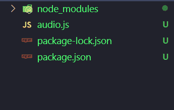
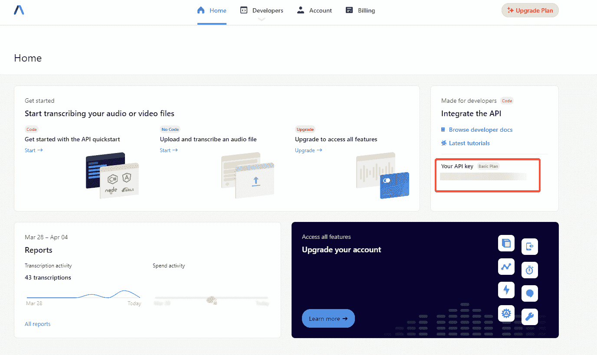

# 如何构建 JavaScript 音频脚本应用程序

> 原文：<https://www.assemblyai.com/blog/javascript-audio-transcript/>

随着**快速准确的自动语音识别技术**的逐步发展，对自动转录的需求比以往任何时候都高。无论是出于可访问性原因，如自动为 YouTube 视频生成字幕，还是出于便利性原因，如自动转录讲座/会议，自动语音识别在所有行业的所有级别都有使用案例。

在本教程中，**我们将学习如何创建一个由 [AssemblyAI 的](https://www.assemblyai.com/) [语音到文本 API](https://www.assemblyai.com/blog/the-top-free-speech-to-text-apis-and-open-source-engines/) 支持的 JavaScript 音频转录**应用程序。本教程中的代码在 [Github](https://github.com/stefanrows/javascript-audio-transcript-aai) 和 [Replit](https://replit.com/@stefanrows/JavaScript-Audio-Transcript#index.js) 上都有。

## 属国

*   [Node.js](https://nodejs.org/en/) ^16.14.2
*   [Axios](https://axios-http.com/docs/intro) ^0.26.1
*   [AssemblyAI API 键](https://app.assemblyai.com/signup)

## 我们在建造什么？

我们将使用 [Node.js](https://nodejs.org/en/) 和 [Axios](https://axios-http.com/docs/intro) 来构建一个简单的 JavaScript 音频脚本应用程序。当提供了指定音频文件位置的 URL 时，应用程序将**将音频转录为文本**并且**将结果作为字符串**存储在变量中。

最终结果将如下所示:


Final Result

## 步骤 1 -创建新应用程序

我们只需要编写一个 JavaScript 文件来创建我们的应用程序。在我们开始编码之前，我们需要安装两个包- **Node.js** 和 **Axios** 。如果 Node.js 没有安装，从 [Node.js 网站](https://nodejs.org/en/)下载并安装，安装过程中一切保持默认。我们将立即安装 Axios。

为了保持有序，创建一个名为`javascript-audio-transcript-aai`的新文件夹，并导航至该文件夹:

```py
mkdir javascript-audio-transcript-aai
cd javascript-audio-transcript-aai 
```

现在创建一个名为`audio.js`的 JavaScript 文件并安装 Axios:

```py
touch audio.js
npm install axios 
```

这个过程会在项目文件夹中自动创建一个`package.json`文件，现在看起来应该是这样的:



Project Folder

既然已经正确设置了应用程序文件夹，我们就可以继续为 AssemblyAI 的 API 设置凭证身份验证了。

## 步骤 2 -设置身份验证

AssemblyAI 的免费语音转文本 API 将实际生成我们音频文件的抄本。要使用 API，我们需要一个 API 密钥。API 密钥与 API 请求一起发送，以确保发出请求的帐户被授权使用 API。

创建一个 [AssemblyAI 账户](https://app.assemblyai.com/signup)并进入 [AssemblyAI 仪表盘](https://app.assemblyai.com/)。在仪表板上，在*你的 API 键*下，复制 API 键的值。**请注意，该密钥的值应该保密，并且与您的账户**唯一关联。



AssemblyAI Dashboard

接下来，在`audio.js`文件中，编写以下代码来用 AssemblyAI 处理[认证](https://docs.assemblyai.com/walkthroughs#authentication)，用刚刚从仪表板复制的密钥值替换`“ASSEMBLY-API-KEY”`的值。

```py
const axios = require("axios")
const audioURL = "https://bit.ly/3yxKEIY"
const APIKey = "ASSEMBLYAI-API-KEY"

const assembly = axios.create({
  baseURL: "https://api.assemblyai.com/v2",
  headers: {
    authorization: APIKey,
    "content-type": "application/json",
  },
}) 
```

audio.js

### 代码分解

*   `const axios = require("axios")`进口 Axios。
*   `const audioURL = "https://bit.ly/3yxKEIY"`创建`audioURL`变量，该变量链接到我们在本例中使用的音频文件。
*   `const APIKey = “ASSEMBLYAI-API-KEY”`保存 AssemblyAI API 密钥的值。确保用 AssemblyAI 仪表板中的实际 API 键值替换它。
*   `const assembly = axios.create({...`处理发送到 AssemblyAI 的每个请求的身份验证。也就是说，它告诉 AssemblyAI 我们被授权访问它的 API。这个变量保存转录 API 端点的`baseURL`和`APIKey`的值。它还将`content-type`设置为`application/json`。我们创建这个变量，这样我们就不需要为每个请求编写大量重复的代码。

### 测试认证

现在我们已经设置了 API 身份验证，我们可以测试我们是否能够使用 AssemblyAI 进行身份验证并实际获得响应。

在现有代码下的`audio.js`底部添加这行代码:

```py
...
assembly
    .post("/transcript", {
        audio_url: audioURL
    })
    .then((res) => console.log(res.data))
    .catch((err) => console.error(err)); 
```

audio.js

这段代码使用 Axios 向 AssemblyAI 语音转文本 API 发送一个使用我们的`audioURL`的 [POST](https://en.wikipedia.org/wiki/POST_(HTTP)) 请求，并返回一个我们登录到控制台的对象。

打开终端并导航到项目文件夹，然后使用以下代码运行 JavaScript 文件:

```py
node audio.js 
```

控制台中的输出是 POST 请求的响应，应该类似于以下内容:

```py
{
  id: 'o49rt8v5ea-bfae-4b39-b276-9eb69d172ade',
  language_model: 'assemblyai_default',
  acoustic_model: 'assemblyai_default',
  language_code: 'en_us',
  status: 'queued',
  audio_url: 'https://bit.ly/3yxKEIY',
  text: null,
  words: null,
  utterances: null,
...
} 
```

Response

在这个对象中，我们可以看到一些我们需要的元素:

*   `id`持有成绩单 id。我们需要这个 id 来检查我们的成绩单的状态。
*   告诉我们转录的当前状态。我们可以向 AssemblyAI 语音转文本 API 发送一个`GET`请求来完成这项工作。可能的状态键有“*排队*”、“*处理*”或“*完成*”。
*   `audio_url`保存`audioURL`，它指定了我们希望转录的音频文件的位置
*   一旦转录完成，将保存转录的文本。

删除我们在本节中添加的仅用于测试的整个代码段，因为我们不再需要它了。

## 步骤 3 -自动获取 JavaScript 音频脚本

为了获得我们的抄本，我们需要发送请求来检查我们的抄本的状态是否已经从“*处理中*变为“*完成*”。

我们将自动执行这个检查过程，而不是通过连续执行 GET 请求直到我们收到一个“ *completed* ”状态来手动完成。有不同的方法来自动化这个过程，比如使用[网钩](https://docs.assemblyai.com/walkthroughs#using-webhooks)或者使用[间隔](https://developer.mozilla.org/en-US/docs/Web/API/setInterval)。在这个例子中，我们介绍了区间方法。

我们将先给`audio.js`添加一些代码，然后在下面分解。完整的代码现在看起来是这样的:

```py
const axios = require("axios")
const audioURL = "https://bit.ly/3yxKEIY"
const APIKey = "ASSEMBLYAI-API-KEY"
const refreshInterval = 5000

// Setting up the AssemblyAI headers
const assembly = axios.create({
  baseURL: "https://api.assemblyai.com/v2",
  headers: {
    authorization: APIKey,
    "content-type": "application/json",
  },
})

const getTranscript = async () => {
  // Sends the audio file to AssemblyAI for transcription
  const response = await assembly.post("/transcript", {
    audio_url: audioURL,
  })

  // Interval for checking transcript completion
  const checkCompletionInterval = setInterval(async () => {
    const transcript = await assembly.get(`/transcript/${response.data.id}`)
    const transcriptStatus = transcript.data.status

    if (transcriptStatus !== "completed") {
      console.log(`Transcript Status: ${transcriptStatus}`)
    } else if (transcriptStatus === "completed") {
      console.log("\nTranscription completed!\n")
      let transcriptText = transcript.data.text
      console.log(`Your transcribed text:\n\n${transcriptText}`)
      clearInterval(checkCompletionInterval)
    }
  }, refreshInterval)
}

getTranscript() 
```

audio.js

### 代码分解

让我们分解代码，以便更好地理解这个 JavaScript 音频脚本应用程序的工作原理:

*   `const refreshInterval = 5000`设置执行转录状态检查的时间间隔(毫秒)。

*   `const getTranscript`是一个包含代码逻辑的异步 JavaScript 函数。因为我们正在使用一个向我们返回数据的 API，所以使用异步函数是一个很好的实践。
    *   向 AssemblyAI 语音转文本 API 发送包含我们的 audioURL 的 POST 请求，并存储其响应。
    *   `const checkCompletionInterval`是另一个异步函数，它利用了内置的`[setInterval](https://developer.mozilla.org/en-US/docs/Web/API/setInterval)` JavaScript 方法。
        *   `const transcript = await assembly.get(`/transcript/${response.data.id}`)`使用我们的脚本的`id`向 AssemblyAI 语音到文本 API 发送 GET 请求，我们在模板字符串变量`${response.data.id}`中定义了这个脚本。响应存储在`transcript`变量中。
        *   `const transcriptStatus = transcript.data.status`存储我们转录的完成`status`。
        *   接下来，`checkCompletetionInterval`包含一个 if/else 语句，用于评估转录是否已经完成。`transcriptStatus`的值为“*排队*”、“*处理*”或“*完成*”。
            *   `if (transcriptStatus !== "completed")`检查抄本是否已经完成；如果还没有，就将`transcriptStatus`记录到控制台。
            *   `else if (transcriptStatus === "completed")`评估`transcriptStatus`是否等于“*完成*，表示转录已经完成。如果转录已经完成:
                *   `console.log("\nTranscription completed!\n")`将完成状态记录到控制台。
                *   `transcriptText = transcript.data.text`将 transcriptText 的值设置为返回的抄本。
                *   `console.log(Your transcribed text:\n\n${transcriptText})`用将转录的文本记录到控制台。两个`\n\n`字符是换行符，在终端中打印时给输出一些空间。
                *   最后，`clearInterval(checkCompletionInterval)`清除间隔，阻止它继续。
    *   `refreshInterval`变量也作为参数添加到`checkCompletionInterval`函数中。这是一个要求，告诉`setInterval`方法多长时间运行一次`setInterval`函数中的代码。要改变这个时间，只需改变代码顶部的`refreshInterval`变量的值。
*   在我们代码的底部，我们调用`getTranscript()`函数来实际调用这个函数。

如果我们现在运行该应用程序，我们将看到类似于本文开头的第一个示例图像的输出。

## 结论

使用 AssemblyAI 的[语音转文本 API](https://www.assemblyai.com/blog/the-top-free-speech-to-text-apis-and-open-source-engines/) 可以轻松创建一个 JavaScript 音频转录应用程序。如今，在应用程序中实现语音识别有很多不同的方法——看看我们的其他文章，关于如何用 Golang 实现[语音到文本，或者如何实现](https://www.assemblyai.com/blog/golang-speech-recognition/) [React 语音识别](https://www.assemblyai.com/blog/react-speech-recognition-with-react-hooks/)。

想要更多这样的内容？

关注我们的时事通讯，确保您不会错过我们的最新文章！

[Follow](https://assemblyai.us17.list-manage.com/subscribe?u=cb9db7b18b274c2d402a56c5f&id=2116bf7c68)