# PyTorch IDE 入门指南

> 原文：<https://www.assemblyai.com/blog/beginners-guide-to-torchstudio-pytorch-only-ide/>

像 PyCharm 这样的 ide 对于通用编码来说很棒，但是如果有人的重点只是深度学习，有没有更好的替代方案？TorchStudio(专门为 PyTorch 及其生态系统构建的 IDE)背后的团队是这样认为的。

在本文中，我们将概述 TorchStudio 是什么，通过一个示例 TorchStudio 工作流来了解我们如何使用它来构建和比较模型，最后概述 TorchStudio 的优缺点，以及一些我们认为会使其更上一层楼的功能建议。让我们开始吧！

<https://www.assemblyai.com/blog/content/media/2022/03/slideshow-2.mp4>

Where TorchStudio fits into the Machine Learning lifecycle, and some images from its GUI

## 火炬工作室是什么？

TorchStudio 是由 [Robin Lobel](https://www.linkedin.com/in/robinlobel/) 开发的一个开源项目，旨在让在 PyTorch 中构建和比较模型变得更加容易，并称其为“PyTorch 及其生态系统的 IDE”。IDE 或集成开发环境是一个应用程序，它提供了一组工具来使编程更快更容易。

虽然像 PyCharm 这样的 ide 拥有数据库工具、安全重构、代码完成、版本控制集成等等，但 TorchStudio 反而专注于加速模型开发过程的工具。

## 火炬工作室与众不同的地方在哪里？

虽然其他工具如 [PyTorch Lightning](https://www.assemblyai.com/blog/pytorch-lightning-for-dummies/) 试图通过提取样板代码来简化 PyTorch 的使用，TorchStudio 采取了独特的方法，将其包装在一个简单易用的**基于 GUI 的 IDE** 中。

使用大量本地模型(或定制模型)，编辑模型就像调整滑块和点击图表一样简单。添加数据处理和模型比较功能，您就有了一个 IDE，可以使机器学习生命周期的几个步骤更加高效。

下面你可以看到从开始到结束进行机器学习项目的步骤，以及 TorchStudio 加速用红色突出显示的步骤。

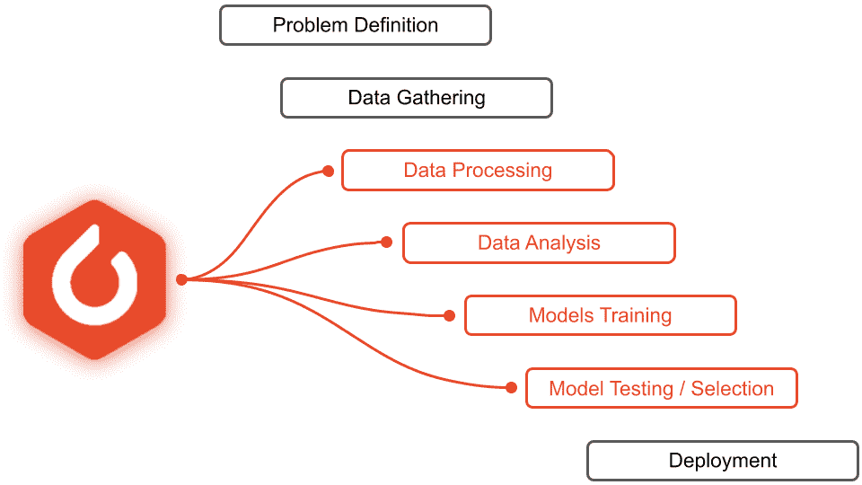

TorchStudio can significantly expedite data modeling & analysis, and model training, testing, & selection to reduce time-to-deploy

让我们通过 TorchStudio 中的一个示例工作流来突出它的关键特性。首先，我们将为那些想跟进的人学习如何安装火炬工作室。接下来，我们将学习如何**加载、转换和子类化** PyTorch `dataset`对象。在此之后，我们将继续进行**训练几个模型**，无论是从零开始还是使用[迁移学习](https://en.wikipedia.org/wiki/Transfer_learning#:~:text=Transfer%20learning%20(TL)%20is%20a,when%20trying%20to%20recognize%20trucks.)，对 CIFAR10 数据集进行分类，然后使用 torch studio**对模型**进行比较。

## 如何安装 TorchStudio

安装 TorchStudio 只需要大约 **10 分钟**和 **6 Gb 到 16 Gb** 的驱动器空间，这取决于你是否想要添加本地 NVIDIA GPU 支持。

要安装 TorchStudio，只需进入 TorchStudio 网站的[下载](https://www.torchstudio.ai/download/)页面，选择您的操作系统，下载`.exe`、`.pkg`或`.deb`文件。从那里，你需要做的就是打开文件并按照提示操作。

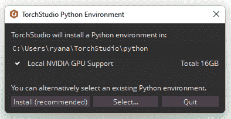

You can choose to include or omit Local NVIDIA GPU support when installing TorchStudio

TorchStudio 将安装一个包含 Python、PyTorch 和附加包/依赖项的新环境。

## 火炬工作室工作流程

为了理解 TorchStudio 的工作流程，我们将通过训练和比较模型来对 [CIFAR10](https://www.cs.toronto.edu/~kriz/cifar.html) 图像进行分类。幸运的是，这个工作流程非常简单直观，所以很容易理解！

## 数据集选项卡

打开 TorchStudio 时，我们会看到一个如下所示的窗口:

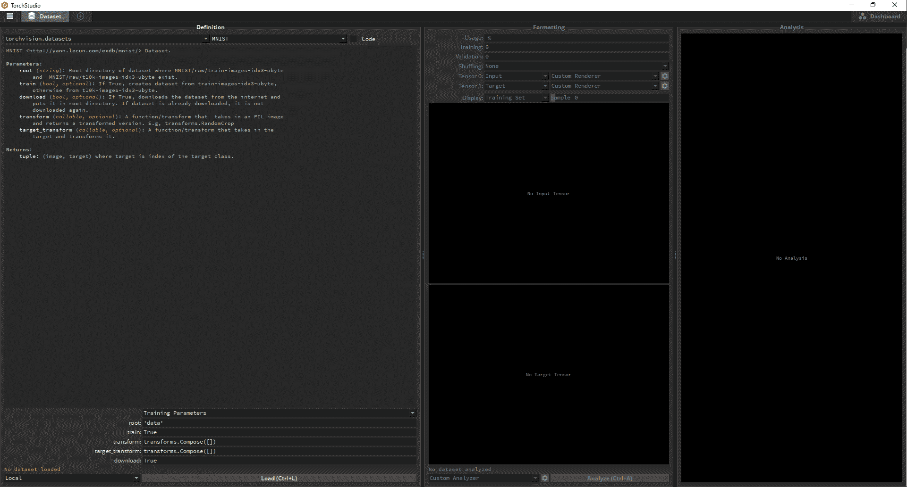

TorchStudio opens to the Dataset tab

这是**数据集选项卡**,其中包含了给定项目数据集的所有信息。一个火炬工作室**项目**只有*一个*数据集，但是可以有几个不同的模型。

### 数据集定义

如上所述，我们将在这个项目中使用 CIFAR10 数据集。屏幕左侧是数据集**定义**框。在将数据加载到 TorchStudio 之前，您可以在这里选择数据集并定义转换。默认情况下，TorchStudio 将向 MNIST 数据集开放。您可以点击定义框左上角的下拉菜单**选择不同的数据集源**，尽管现在我们将坚持使用`torchvision.datasets`。这个下拉列表的右边是另一个下拉列表，其中的**包含了该数据集源**中所有可用的数据集。单击它将数据集从 MNIST 更改为 CIFAR10。

<https://www.assemblyai.com/blog/content/media/2022/03/select_cifar.mp4>

Selecting the CIFAR10 dataset

#### 数据集转换

我们将使用需要 64 x 64 图像的模型对 32 x 32 CIFAR10 图像进行分类，因此我们必须**调整**cifa r10 图像的大小。在定义框架的底部，添加转换`transforms.Resize(64)`来完成这个任务。确保`download`参数设置为`True`，然后加载数据。

<https://www.assemblyai.com/blog/content/media/2022/03/resize_and_load.mp4>

Resizing the CIFAR10 images from 32 x 32 to 64 x 64

在下图中，您可以在左侧看到 CIFAR10 图像的上采样版本，在右侧看到原始图像。默认情况下，使用**双线性插值**对图像进行上采样。

Bilinearly interpolated upsampled image of a frog (left) and the original image (right)

#### 编辑数据集代码

虽然 TorchStudio 非常直观，有一个结构良好的 GUI，但您可以在任何时候单击**代码复选框**来直接定制相关代码。

在下面的例子中，我们编辑`CIFAR10`类的`__getitem__()`函数来返回添加了噪声的**图像** **作为** **输入**，而**原始图像本身作为我们的输入/目标对的目标**。这与默认使用原始图像本身作为输入和相应的类别标签作为目标形成对比。您可能希望以这种方式覆盖默认值，以便**训练去噪自动编码器**而不是分类网络。

<https://www.assemblyai.com/blog/content/media/2022/03/noisy_code_2pt5x_Trim.mp4>

Editing the input/output pairs of the CIFAR10 dataset

下面你可以看到我们的代码编辑的结果，左边是原始的青蛙图像，右边是它的噪声版本:

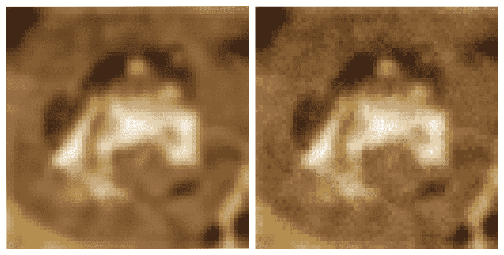

Original CIFAR10 frog image (left) and the same image with noise added (right). Such a pair may be useful for training a denoising autoencoder.

同样，如果要训练重新着色网络，可以将灰度图像和原始图像作为输入/目标对返回:

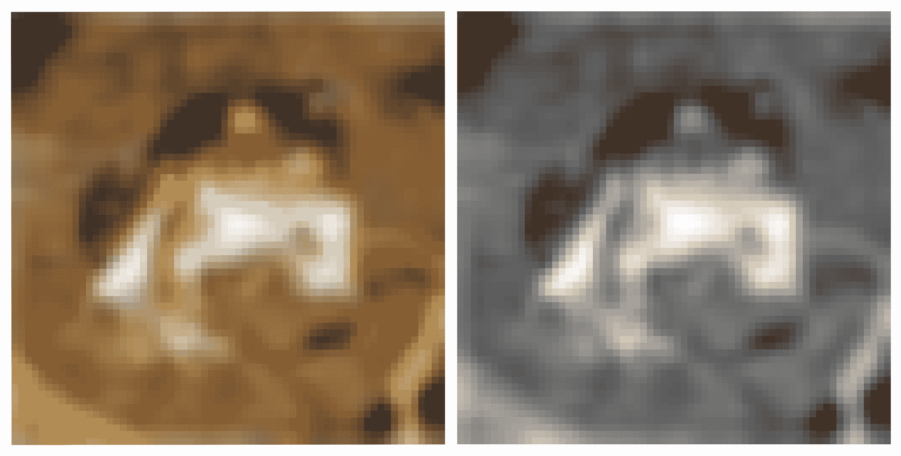

Original CIFAR10 frog image (left) and the same image grayscaled (right). Such a pair may be useful for training a recolorization network.

对于我们的例子，**我们将坚持使用原始图像和它们的标签**作为输入/目标对，以便训练一个分类网络——上面的代码编辑只是为了完整性。

随着上采样数据的加载和我们的类标签目标的准备，我们可以移动到数据集选项卡中的下一帧——数据集格式化。

### 数据集格式

**格式化**框架允许你**探索你的数据，并为训练**准备 **。在“Formatting”框中，您可以调整数据的训练/验证比率，默认情况下使用原始的 CIFAR10 50k 训练图像和 10k 验证图像。您还可以调整*总*数据使用量，这样您就可以在模型上进行粗略训练，以确保在使用所有可用数据开始正式训练之前一切正常。洗牌允许你随机洗牌你的数据。**

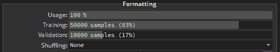

在这些选项下面，TorchStudio 将根据它认为对给定数据有意义的渲染器来显示输入和目标。在这种情况下，TorchStudio 感觉到每个训练数据都是一个 3D 张量，其中一个轴的长度为 3(对应于 RGB 颜色通道)，因此它正确地选择了*位图*渲染器。另一方面，目标只是对应于类的整数，所以选择了正确的*标签*呈现器。

我们只需点击并拖动相关滑块，即可轻松浏览数据:

<https://www.assemblyai.com/blog/content/media/2022/03/data_explore.mp4>

Exploring the CIFAR10 dataset

TorchStudio 自带了其他类型数据的渲染器，如光谱图、体积和边界框。或者，您可以通过单击渲染器下拉列表旁边的齿轮图标来定义自己的渲染器。**在 TorchStudio 的任何地方，齿轮图标意味着你可以实现自己的定制模块**。

### 数据集分析

数据集选项卡中的最后一个框架是**分析**框架，它允许我们通过分析功能生成数据摘要。在这种情况下，我们可以看到类比率和随机性，确定我们的数据集是平衡的。

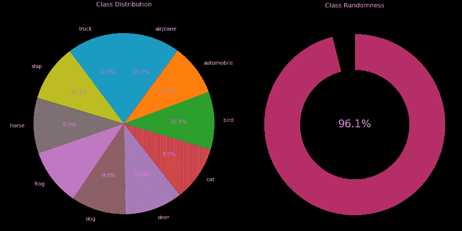

## 在火炬工作室培训模特

现在我们已经有了我们的数据集，我们可以继续用 TorchStudio 训练一个模型。首先，单击屏幕左上角 Dataset 选项卡旁边的六边形图标。这将创建一个新的**模型选项卡**，对于您创建的每个模型都有一个。

### 模型定义

在您创建的新 Model 选项卡中，选择一个模型源，然后从左上角的下拉列表中选择一个模型架构，类似于在 dataset 选项卡中选择数据集的过程。我们将使用 [MobileNetV2](https://arxiv.org/pdf/1801.04381.pdf) 。

<https://www.assemblyai.com/blog/content/media/2022/03/choose_model.mp4>

Choosing a model

模型定义框的左下角是所选模型的参数。默认情况下，MobileNetV2 分类器设计为容纳 1，000 个类。将`num_classes`参数更改为 10(假设 CIFAR10 有 10 个类),其余参数保持不变。最后，点击**构建**来构建这个模型。

<https://www.assemblyai.com/blog/content/media/2022/03/model_params_1-1.mp4>

### 模型图

定义框的右边是**图**框，在其中您可以浏览刚刚定义的模型的图。您可以上下滚动来检查层是如何连接的，或者按住 Ctrl 并滚动来放大和缩小。对于模型的低分辨率视图，也可以将视图类型更改为模块级别 1；对于分辨率更低的视图，也可以更改为模块级别 2。

<https://www.assemblyai.com/blog/content/media/2022/03/graph_exploration.mp4>

### 超参数

图形框的右边是**超参数**框。TorchStudio 再次自动检测它认为最适合当前情况的值。在我们的例子中，我们将 epochs 的数量更改为 15(为了快速训练),其他的都保持不变。您将再次注意到齿轮图标，这意味着您可以设计自定义模块在这里使用。

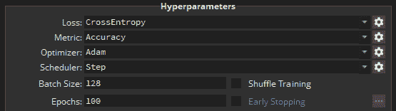

就像在 Dataset 选项卡的 Formatting 框架中一样，您可以调整 Hyperparameters 框架中的滑块来查看不同的输入；然而，在这种情况下，我们看到的是输入图像的**模型的输出，而不是图像的标签。在这种情况下，假设网络没有被训练并且只是被随机初始化，则每个类的概率大致均匀分布。**

<https://www.assemblyai.com/blog/content/media/2022/03/data_exploration.mp4>

Viewing the model output distribution given different inputs

在框架的底部，选择您想要训练的硬件。在我们的例子中，我们在 CPU 上进行本地训练。远程服务器也可以通过进入 TorchStudio 的设置添加到 TorchStudio 进行培训。最后，点击**训练**开始训练过程。

### 分析

在超参数框右侧的**指标**框中，您将看到损失和所选指标(在本例中为精确度)的训练和验证曲线随着模型的训练而动态更新。在任何时候，你都可以暂停，然后继续训练。

<https://www.assemblyai.com/blog/content/media/2022/03/full_train.mp4>

Training curves in TorchStudio

## 使用 TorchStudio 训练多个模型

虽然只训练一个模型对于某些应用来说可能已经足够好了，但是 TorchStudio 的真正强大之处在于它的**速度，在这种速度下你可以实例化和训练多个模型**。让我们再创建两个模型，并在我们的数据集上训练它们。

再次单击 TorchStudio 窗口顶部栏中的小六边形图标，创建一个新模型。每当您创建一个新的模型选项卡，**它将是您当前在**上的模型选项卡的一个副本(或者如果您在数据集选项卡上，则是您在的最后一个)。现在再创建两个模型选项卡。

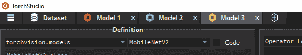

编辑模型参数，点击 **Build** 用新参数重建它们。在我们的例子中，我们选择对模型 2 和模型 3 分别使用`round_nearest=8`和`dropout=0.3`以及`round_nearest=10`和`dropout=0.3`。模型制作完成后，点击每个标签上的**训练**。

由于我们是在 CPU 上训练，所以模型是按顺序训练的。彩色标签图标指示您在培训过程中所处的位置。红色的 Model 1 图标包含一个**停止**符号，这意味着我们已经**暂停或者完成了对该型号的训练**(在本例中是后者)。蓝色的 Model 2 图标包含一个**播放**符号，这意味着 Model 2 正在**训练**。黄色的 Model 3 图标包含一个**暂停**符号，表示 Model 3 正在**队列中等待训练**。

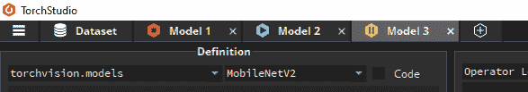

Model tab icons give you an indication of where you are in training

## 在 touchstudio 中使用预训练模型进行迁移学习

我们将创建一个最终模型，在这种情况下，使用 MobileNetV2 的*预训练*版本。创建一个新的选项卡，并从`torchvision.models`源中选择`mobilenet_v2`模型。注意，这里的名字是小写的，而不是未经训练的`MobileNetV2`模型。这适用于 TorchStudio - **中的所有模型，预训练的模型使用小写名称，未训练的模型使用大写名称**。

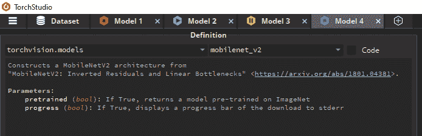

Selecting the pretrained `mobilenet_v2` model

在模型选项中，将`pretrained`的值改为`True`，然后建立模型。

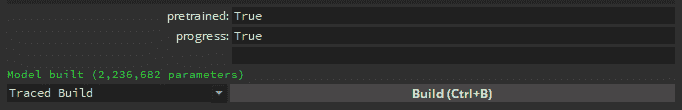

Selected pretrained weights for the `mobilenet_v2` model

### 编辑预训练模型

正如我们上面提到的，MobileNetV2 **默认为 1000 个类别**，这意味着预训练的权重对应于为 1000 个类别设计的模型。我们这次没有`num_classes`参数可以编辑，那么如何让模型适应我们的需求呢？

TorchStudio 使编辑模型变得极其容易，从而克服了这个问题。只需在图形框中向下滚动到模型图形的底部，并点击最后一个`Linear`层。这将打开模型代码，我们可以编辑该代码来更改模型，类似于我们如何编辑数据集代码以在“数据集”选项卡中添加噪声或灰度化 CIFAR10 图像。

单击`Linear`层时，自动插入到代码中的是对应于被单击层的一行，我们可以用它来覆盖模型的类的数量。只需将`out_features`从 1000 更改为 10，然后**构建**模型。

<https://www.assemblyai.com/blog/content/media/2022/03/pretrain_build.mp4>

Editing a pretrained model

虽然`mobilenet_v2`模型有预先训练的权重，但它们不会完美地适用于我们一开始的数据。预训练的权重允许我们将预训练的低级特征提取器转移到我们的任务中，但我们仍然需要在*我们的*数据上训练模型，以有意义地将这些提取的特征映射到 CIFAR10 类。这个过程叫做*迁移学习*。

与其他型号一样，只需点击 **Train** ，然后等待训练完成。

## 比较火炬工作室的跑步记录

现在我们已经有了几个经过训练的模型，我们可以使用**仪表板选项卡**对它们进行比较以获得洞察力。点击 TorchStudio 窗口右上角的仪表板图标。

在左侧，您将看到每个模型的验证损失曲线和每个模型的验证指标曲线重叠在一起，这样您就可以**轻松地比较模型**之间的性能。曲线颜色与模型选项卡图标中显示的颜色相匹配，以便于识别哪个模型映射到哪个性能曲线。在我们的例子中，我们看到(不出所料),经过 15 个训练周期后，具有预训练权重的模型优于从零开始训练的模型。

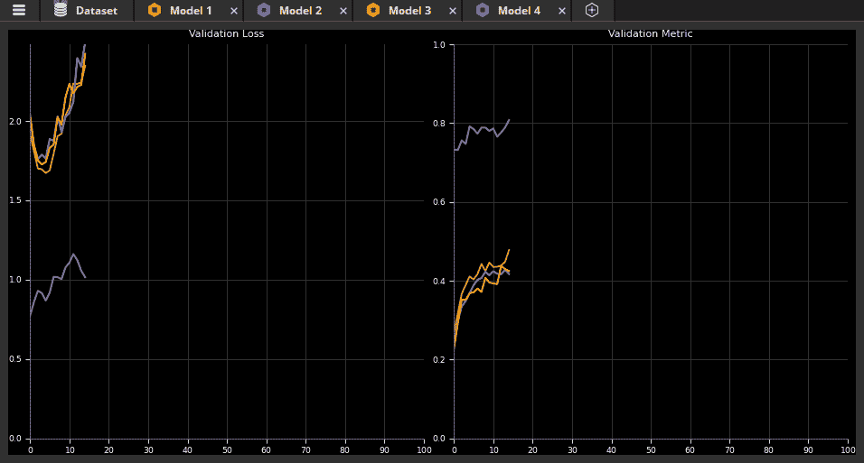

Overlaid validation loss and validation metric curves for all models

在这些图表下面，您将看到每个模型的列表信息，包括架构定义和参数、验证损失指标和培训状态。您可以通过单击列标题对表格进行排序。下面，我们按照验证标准对模型进行了排序。

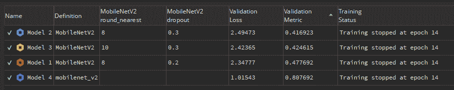

Tabulated model information

仪表板选项卡中的最后一个框架包含列表信息的**可视化，这使得识别架构或其定义参数如何影响验证指标的趋势变得容易。下面我们看到，无论其定义参数如何，具有预训练权重的模型明显优于从零开始训练的模型。**

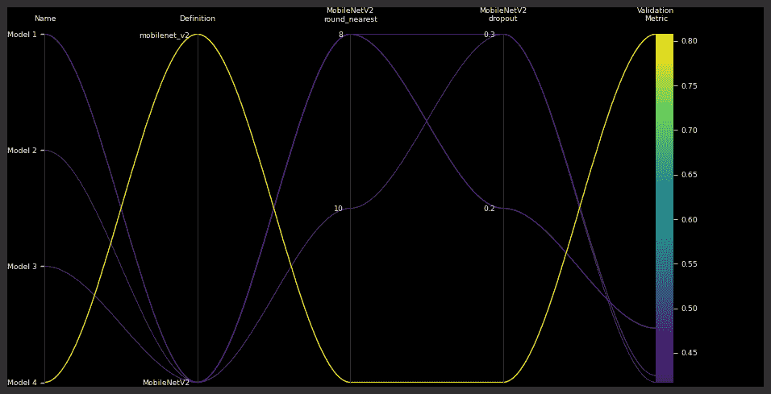

Model information plot

这就是本教程的全部内容！如果你对 TorchStudio 的一些优点、缺点和建议功能感兴趣，请继续阅读！否则，你可以跳到我们的[最后一句话](https://www.assemblyai.com/blog/beginners-guide-to-torchstudio-pytorch-only-ide/#final-words)。

## 火炬工作室有什么好作品

虽然 TorchStudio 的许多好处在检查后是显而易见的，但我们还是列出了几个在 TorchStudio 中运行良好的值得注意的事情，排名不分先后:

1.TorchStudio 让**快速原型化**成为定义明确、广受欢迎的深度学习任务变得很容易。

2.TorchStudio 使得以 **Python** 、 **PyTorch** 或 **ONNX** 格式导出模型变得容易。

3.能够在模型训练时动态地看到模型的输入-输出对可以帮助您**在训练期间识别分类训练失败**。

4.**训练在后台进行**，可以随时暂停，允许模型在定义新模型的同时进行训练。

5. **[HuggingFace](https://www.assemblyai.com/blog/pytorch-vs-tensorflow-in-2022/#huggingface)** 和 **[PyTorch Hub](https://www.assemblyai.com/blog/pytorch-vs-tensorflow-in-2022/#pytorch-1)** 整合即将到来。

6.TorchStudio 有**远程服务器集成**。

## 可以使用工作的 touchstudio 元素

截至发稿时，TorchStudio 正处于[公测阶段](https://www.torchstudio.ai/2022-02-28-torchstudio-open-beta/)，因此可以预计并非一切都完美。我们在使用 TorchStudio 时遇到了一些需要注意的问题:

1.**稳定。测试期间，TorchStudio 崩溃了几次，有时是因为一些无关紧要的事情，比如点击和拖动 MNIST 的图片。**

2.**错误消息。TorchStudio 中的执行失败可能会给你留下一个相对模糊的错误消息，并且很难确定问题出在哪里。TorchStudio 文件夹中有错误日志，但是打开它们并试图解析它们可能会有点令人头疼。找出一种有效的方法来锁定和修复错误将是 TorchStudio 未来版本的一大优势。**

3.**调整绘图大小。**在测试过程中，数据图多次出现大小调整问题，数据图会缩小到可用空间的一小部分。

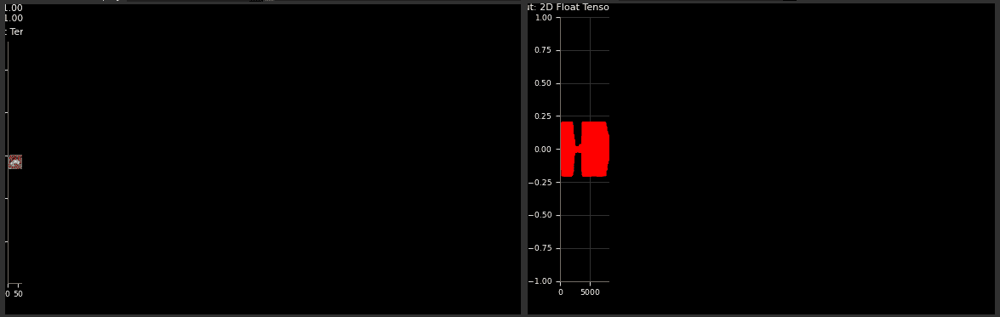

## touchstudio 可以使用的功能

TorchStudio 是一个非常酷的项目，我们已经编辑了几个功能列表，我们认为这些功能将有助于它在即将到来的版本中更上一层楼。请记住，TorchStudio 是一个开源项目，因此社区中的任何人都可以实现其中的任何一项！

**1。GUI 建模**。能够拖放图形元素，如卷积层，池层等。可视化地构建一个模型，然后自动翻译成 PyTorch 代码，这将是 TorchStudio 的一个很好的特性。

**2。更好的错误消息/调试器**。如上所述，确定错误的来源可能有点困难。拥有更好的错误消息和/或调试器将有助于缓解这个问题。

**3。模型选项卡组**。能够根据架构或者其他一些显著的特性将模型分组到选项卡组将会很方便。

**4。** **车型分类**。根据任务将可用的 TorchStudio 模型组织成类是很好的，例如图像分割、图像去噪等。

**5。数据集管理**。能够查看和管理 TorchStudio 已经下载的数据集将会很方便，并且能够取消正在进行的下载。

**6。自动推理**。TorchStudio 可以通过几种方式使用自动推理。第一种方法是在编辑图层时自动推断形状变化。也就是说，如果一行中有两个完全连接的层，更改第一个层的输出形状将会自动更改下一个层的输入形状。第二种方法是根据项目数据集自动推断模型的变化。在上面的例子中，我们必须改变预训练分类器的最后一层，因为数据只有 10 个类，而不是默认的 1000 个。自动推断这种变化将是一个很好的加分。

7 .**。对数据集变化的敏感度**。您可以更改 TorchStudio 项目中正在使用的数据集，但在旧数据集上训练的模型选项卡将保持活动状态。如果这些被自动变灰或者被单独分组到一个选项卡组中就好了，这样你就不会在仪表板中比较在不同数据集上训练的模型

**8。关闭**前的警告。仪表板按钮非常接近关闭 TorchStudio 窗口的按钮，目前 t，这里没有“你确定吗？”关闭窗口时提示。很容易看出工作会因此而意外丢失，因此在关闭之前发出警告提示可以防止这种情况发生。

**9。导出训练图形数据**。如果有一种方法可以方便地导出(I)训练损失/度量图的 png，或者(ii)这些图的数据，以便使用自定义格式进行绘制，那就太好了。

最后，**设置随机种子**和**显示多个指标**的能力将是巨大的优势！

## 最后的话

我们的新手 TorchStudio 指南到此为止！虽然我们在本教程中只介绍了基础知识，但是 TorchStudio 是一个用于简化 PyTorch 开发过程的可扩展系统，对于任何使用 PyTorch 的人来说，它都是值得尝试或关注的。

如果你喜欢这篇文章，请考虑关注我们的时事通讯，了解更多深度学习内容！

寻找更多这样的帖子？

关注我们的时事通讯！

[Follow Now](https://assemblyai.us17.list-manage.com/subscribe?u=cb9db7b18b274c2d402a56c5f&id=2116bf7c68)