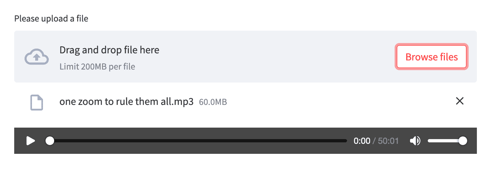
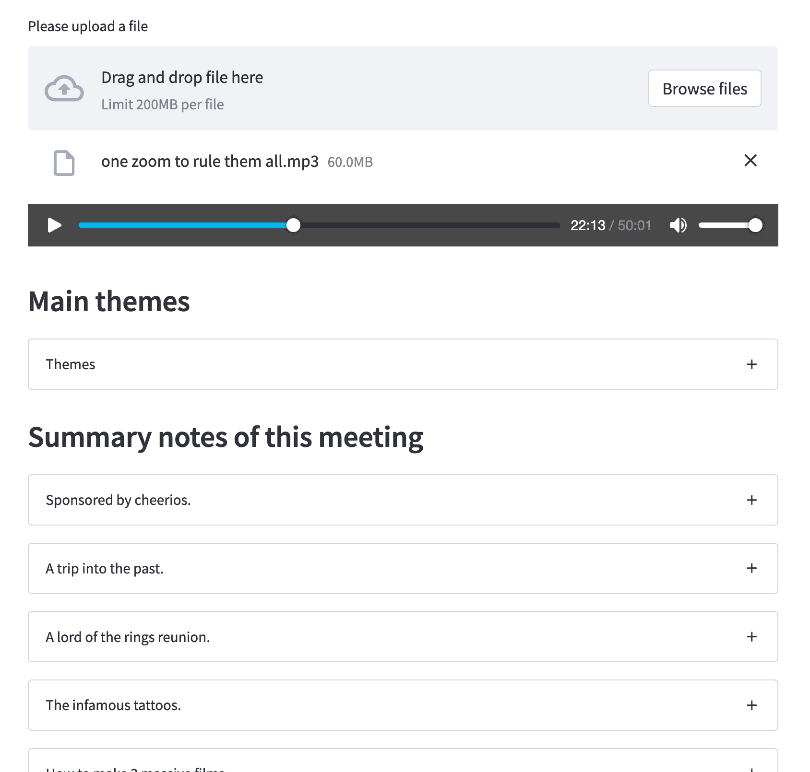
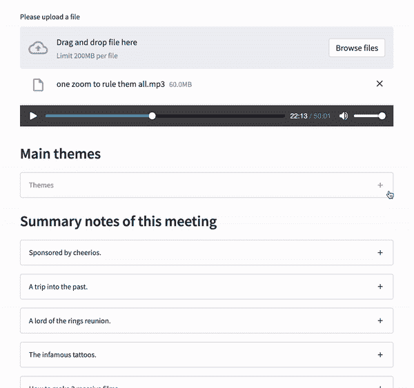

# 用 Python 自动化会议笔记

> 原文：<https://www.assemblyai.com/blog/auto-generating-meeting-notes-with-python/>

在本教程中，我们将构建一个接收会议录音并自动生成会议笔记的 web 应用程序。对于此应用程序，我们需要:

*   细流
*   计算机编程语言
*   AssemblyAI 的语音转文本 API

要跟进，请从我们的 [GitHub 库](https://github.com/AssemblyAI/youtube-tutorials/tree/main/Meeting%20summarizer)获取代码。

## 简化应用程序

作为第一步，让我们设置 Streamlit 应用程序的结构。这将是应用程序面向用户的界面。

```py
import streamlit as st

uploaded_file = st.file_uploader('Please upload a file')

if uploaded_file is not None:
    st.audio(uploaded_file, start_time=0)
```

一旦文件上传和音频播放部件准备就绪，您的应用程序应该看起来如下图所示。



从这一点开始，我们首先需要转录和分析音频文件，然后才能添加新的 Streamlit 部分。

## 获取主题和章节摘要

下一步是将上传的音频文件发送到 AssemblyAI，以便对其进行转录和分析。我们将在这个应用程序中使用 AssemblyAI 的两种不同的 NLP 功能:

*   [话题检测](https://www.assemblyai.com/blog/new-8-better-accuracy-for-topic-detection-and-iab-classification-with-v4-update/)
*   [汽车章节(摘要)](https://www.assemblyai.com/blog/introducing-assemblyai-auto-chapters-summarize-audio-and-video-files/)

AssemblyAI 将检测本次会议中发言的主题，并报告它们所属的最相关类别。除此之外，AssemblyAI 还会将这段录音分成章节。对于每一章，AssembllyAI 将返回一个或长或短的内容摘要，以及该章开始和结束的时间戳。

为了连接到 AssemblyAI，我们需要设置头。

```py
headers = {
    "authorization": auth_token,
    "content-type": "application/json"
}
```

`auth_token`是您从 AssemblyAI 获得的 API 密钥，以便能够使用该 API。

[Get a free API token](https://assemblyai.com)

我们将收集我们需要上传的代码，并开始在一个函数中转录音频。

```py
import requests

def upload_to_AssemblyAI(audio_file):

    transcript_endpoint = "https://api.assemblyai.com/v2/transcript"
    upload_endpoint = 'https://api.assemblyai.com/v2/upload'

    upload_response = requests.post(
        upload_endpoint,
        headers=headers, 
        data=audio_file
    )
    audio_url = upload_response.json()['upload_url']

    json = {
        "audio_url": audio_url,
        "iab_categories": True,
        "auto_chapters": True
    }

    response = requests.post(
    	transcript_endpoint, 
        json=json, 
        headers=headers)

    polling_endpoint = transcript_endpoint + "/" + response.json()['id']
    return polling_endpoint
```

一行一行地，在这个函数中，我们首先定义我们想要在 AssemblyAI 上连接的端点。稍后，我们通过附加身份验证头和从用户处收到的文件向上传端点发出一个`POST`请求。在我们从 AssemblyAI 得到的对这个上传请求的响应中，有一个`upload_url`指向我们刚刚上传的文件。

使用此 URL，我们将提出转录请求。我们向转录端点发出`POST`请求，同时还附带了认证头。不过，这一次，我们还需要附加一个 JSON 变量，指定音频文件的位置以及我们期望从 AssemblyAI 得到的额外结果。

在这个项目中，我们要求类别(`"iab_categories": True`)和章节摘要(`"auto_chapters": True`)。使用我们为转录请求获得的响应，我们可以创建一个轮询端点。轮询端点是我们发送请求以获得转录结果的地方。

## 接收来自汇编的结果

使用上面定义的函数，我们现在可以访问转录的轮询端点。使用这个端点，我们可以查询我们提交的作业的状态。

```py
polling_endpoint = upload_to_AssemblyAI(uploaded_file)
polling_response = requests.get(polling_endpoint, headers=headers)
status = polling_response.json()['status']
```

我们需要等一会儿才能完成转录。这就是为什么设置一个 while 循环来询问作业的状态是一个好主意。或者，您可以添加一个睡眠间隔来等待请求。

```py
import time

while status != 'completed':
    polling_response = requests.get(polling_endpoint, headers=headers)
    status = polling_response.json()['status']

    if status == 'completed':

    	# display results
        ...

    time.sleep(2)
```

## 显示音频智能结果

### 话题检测

显示结果将我们带回简化代码。第一部分将有这次会议的主题。下面是 AssemblyAI 对主题检测的响应。

```py
{
    ...
    "id": "oris9w0oou-f581-4c2e-9e4e-383f91f7f14d",
    "status": "completed",
    "text": "Ted Talks are recorded live at Ted Conference..."
    "iab_categories_result": {
        "status": "success",
        "results": [
            {
                "text": "Ted Talks are recorded live at Ted Conference...",
                "labels": [
                    {
                        "relevance": 0.00561910355463624,
                        "label": "Education>OnlineEducation"
                    },
                    {
                        "relevance": 0.00465833256021142,
                        "label": "MusicAndAudio>TalkRadio"
                    },
                    {
                        "relevance": 0.00039072768413461745,
                        "label": "Television>RealityTV"
                    },
                    {
                        "relevance": 0.00036419558455236256,
                        "label": "MusicAndAudio>TalkRadio>EducationalRadio"
                    }
                ],
                "timestamp": {
                    "start": 8630,
                    "end": 32990
                }
            },
            ...
        ],
        "summary": {
            "MedicalHealth>DiseasesAndConditions>BrainAndNervousSystemDisorders": 1.0,
            "FamilyAndRelationships>Dating": 0.7614801526069641,
            "Shopping>LotteriesAndScratchcards": 0.6330153346061707,
            "Hobbies&Interests>ArtsAndCrafts>Photography": 0.6305723786354065,
            "Style&Fashion>Beauty": 0.5269057750701904,
            "Education>EducationalAssessment": 0.49798518419265747,
            "Style&Fashion>BodyArt": 0.19066567718982697,
            "NewsAndPolitics>Politics>PoliticalIssues": 0.18915779888629913,
            "FamilyAndRelationships>SingleLife": 0.15354971587657928
        }
    },
} 
```

对于这个项目，我们只对摘要部分感兴趣。因为它已经在一个列表中，所以很容易从响应中提取这些信息。

```py
st.subheader('Main themes')
with st.expander('Themes'):
    categories = polling_response.json()['iab_categories_result']['summary']
    for cat in categories:
        st.markdown("* " + cat)
```

我们将结果保存到一个 Python 列表中，并在 Streamlit expander 小部件中将每个结果显示为一个列表项。

### 章节摘要

AssemblyAI 将我们的音频分成章节，并为我们提供每章的标题、要点和摘要。下面是这种反应的样子。

```py
{
    "audio_duration": 1282,
    "confidence": 0.930082104986874,
    "id": "ogskorn5o4-8b98-44d6-98ff-7c42a97e033b",
    "status": "completed",
    "text": "Ted Talks are recorded live at Ted Conference...",
    "chapters": [
        {
            "summary": "In 2 million years, the human brain has nearly tripled in mass. Going from the one and a quarter pound brain of our ancestors here habilis. To the almost three pound meat loaf. One of the main reasons that our brain got so big is because it got a new part called the frontal lobe. And particularly a part called the prefrontal cortex.",
            "headline": "One of the main reasons that our brain got so big is because it got a new part called the frontal lobe, and particularly a part called the prefrontal cortex.",
            "gist": "The big brain."
            "start": 8630,
            "end": 146162,
        }
        ...
    ],
    ...
} 
```

AssemblyAI 回复的所有信息对这个项目都是有用的。为了便于操作，我们可以先将它们导出到熊猫数据框架中。

```py
import pandas as pd

st.subheader('Summary notes of this meeting')
chapters = polling_response.json()['chapters']
```

我们希望在用户界面中显示每章的开始时间。这就是为什么毫秒值需要被解析成分和秒。为了实现这一点，我们使用下面的函数。

```py
def convertMillis(start_ms):
    seconds = int((start_ms / 1000) % 60)
    minutes = int((start_ms / (1000 * 60)) % 60)
    hours = int((start_ms / (1000 * 60 * 60)) % 24)
    btn_txt = ''
    if hours > 0:
        btn_txt += f'{hours:02d}:{minutes:02d}:{seconds:02d}'
    else:
        btn_txt += f'{minutes:02d}:{seconds:02d}'
    return btn_txt

chapters_df['start_str'] = chapters_df['start'].apply(convertMillis)
chapters_df['end_str'] = chapters_df['end'].apply(convertMillis)
```

现在，dataframe 有两个新列，指定了每章的开始和结束时间。

我们将在各自的扩展器中显示每一章，以获得一个整洁的界面。这可以通过迭代 dataframe 并为每章创建一个新的 expander 小部件来轻松完成。

```py
for index, row in chapters_df.iterrows():
    with st.expander(row['gist']):
        st.write(row['summary'])
        st.button(row['start_str'])
```

每一章都将在扩展标题中陈述其要点。一旦展开，用户将能够阅读更长的章节摘要，并看到一个按钮，在音频中说明本章的开始时间。

此时，应用程序应该是这样的:



## 跳到每一章的音频开始

我们需要做的最后一件事是激活章节扩展器中的按钮。为此，我们将使用 Streamlit 会话状态和回调函数。

让我们定义一个名为`start_point`的会话状态变量，它将决定音频播放器的起始点。这个值将用一个名为`update_start`的函数来更新。

```py
if 'start_point' not in st.session_state:
    st.session_state['start_point'] = 0

def update_start(start_t):
    st.session_state['start_point'] = int(start_t/1000)
```

`Update_start`将毫秒值作为参数，将其转换为秒，并用它更新会话状态变量。为了使这一改变生效，我们将更新前一阶段的音频小部件。

```py
st.audio(uploaded_file, start_time=st.session_state['start_point'])
```

现在要做的最后一件事是通过更新按钮创建行从章节按钮调用更新函数。

```py
st.button(row['start_str'], on_click=update_start, args=(row['start'],))
```

一旦完成，按钮将能够改变音频播放器的开始点。



如果你喜欢看这个教程，你可以在这里找到 YouTube 视频。

[https://www.youtube.com/embed/RMBhwwqeDOw?feature=oembed](https://www.youtube.com/embed/RMBhwwqeDOw?feature=oembed)