# 使用 React 挂钩进行 React 语音识别

> 原文：<https://www.assemblyai.com/blog/react-speech-recognition-with-react-hooks/>

语音识别已经成为一个热门话题有一段时间了。它有许多使用案例，而且需求还在增长。在本教程中，我将向您展示如何使用 AssemblyAI 的语音到文本 API 和 React 挂钩创建 React 语音识别应用程序。

## 佐料

*   反应^17.0.2
*   轴^0.26.1
*   麦克风-录音机-mp3 ^2.2.2
*   反应-装载-旋转^6.0.0-0
*   **随意**做出事情**🦄**
*   ^3.0.23 顺风社
*   ^2.8.0 大秀

## 我们在建造什么？

在这个 React 语音识别教程中，我们构建了一个应用程序，它可以记录您对麦克风说话的音频，并自动将音频转录为文本。样式是完全可选的，我们将在我们的 [Github 库](https://github.com/stefanrows/react-speech-recognition-app)中为您提供带有样式的完整代码。

我们希望主教程保持最小化，不要让混乱的风格堵塞代码。下面只是一个例子，如果你添加样式，它会是什么样子。

你可以在这里一窥完成后的应用程序的样子[。](https://react-speech-recognition-aai.netlify.app/)

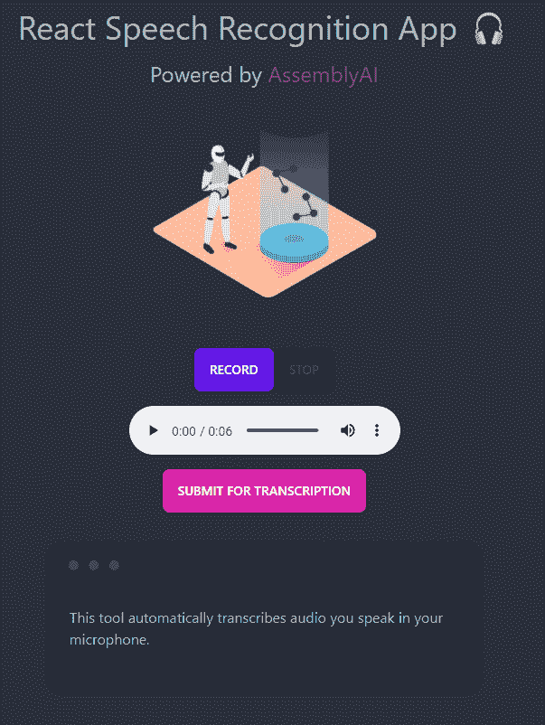

## 步骤 1 -创建新的 React 应用程序

如果您以前使用过 React，您应该对这个经典过程很熟悉。

```py
npx create-react-app@latest react-speech-recognition-app
cd react-speech-recognition-app
code . 
```

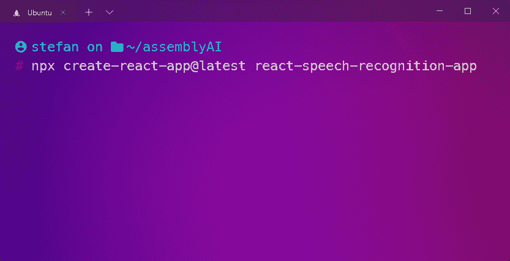

## 第二步-清理

从 **/src** 中删除 **App.css** 、 **App.test.js** 、 **logo.svg** 、 **reportWebVitals.js** 和 **setupTests.js**

删除 **App.js** 中的所有内容，如下所示

```py
function App() {
  return <div></div>
}

export default App 
```

从 **index.js** 中移除`reportWebVitals();`及其导入

删除 **index.css** 中的所有内容

## 步骤 3 -安装依赖项

让我们先把安装部分解决掉。我将包括样式依赖——您可以选择省略它们。

### 核心依赖关系

```py
npm install react-loader-spinner --save
npm install mic-recorder-to-mp3 --save
npm install axios --save 
```

### 样式依赖关系

对于顺风 CSS，从**步骤 2** 到**步骤 4** 遵循这些步骤[。](https://tailwindcss.com/docs/guides/create-react-app)

对于 DaisyUI，请遵循以下步骤。

## 步骤 4 -设置我们的录音机

为了能够创建整个 React 语音识别应用程序，我们首先需要一种记录音频文件的方法。为此，我们使用之前安装的**麦克风录音转 mp3** npm 包。

让我们从导入一些东西开始，添加一些按钮和我们的音频播放器。

```py
import MicRecorder from "mic-recorder-to-mp3"
import { useEffect, useState, useRef } from "react"
import axios from "axios"

const App = () => {
  return (
    <div>
      <h1>React Speech Recognition App</h1>
      <audio controls='controls' />
      <div>
        START
        STOP
        SUBMIT
      </div>
    </div>
  )
}

export default App 
```

它应该看起来像这样

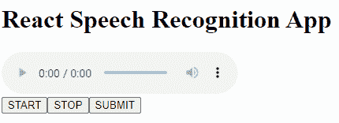

### 录音机逻辑

首先，我们需要创建一些状态，并在应用程序中添加一些代码。下面我来解释。

```py
import MicRecorder from "mic-recorder-to-mp3"
import { useEffect, useState, useRef } from "react"
import axios from "axios"

const App = () => {
  // Mic-Recorder-To-MP3
  const recorder = useRef(null) //Recorder
  const audioPlayer = useRef(null) //Ref for the HTML Audio Tag
  const [blobURL, setBlobUrl] = useState(null)
  const [audioFile, setAudioFile] = useState(null)
  const [isRecording, setIsRecording] = useState(null)

  useEffect(() => {
    //Declares the recorder object and stores it inside of ref
    recorder.current = new MicRecorder({ bitRate: 128 })
  }, [])

  const startRecording = () => {
    // Check if recording isn't blocked by browser
    recorder.current.start().then(() => {
      setIsRecording(true)
    })
  }

  const stopRecording = () => {
    recorder.current
      .stop()
      .getMp3()
      .then(([buffer, blob]) => {
        const file = new File(buffer, "audio.mp3", {
          type: blob.type,
          lastModified: Date.now(),
        })
        const newBlobUrl = URL.createObjectURL(blob)
        setBlobUrl(newBlobUrl)
        setIsRecording(false)
        setAudioFile(file)
      })
      .catch((e) => console.log(e))
  }

  return (
    <div>
      <h1>React Speech Recognition App</h1>
      <audio ref={audioPlayer} src={blobURL} controls='controls' />
      <div>
        
          START
        
        
          STOP
        
        SUBMIT
      </div>
    </div>
  )
}

export default App 
```

这将是一个口，但尽量留在我身边。

首先，我们初始化几个状态变量，如果你以前使用过 [React 钩子](https://reactjs.org/docs/hooks-intro.html)，你应该会很熟悉。

接下来，我们利用 [useEffect](https://reactjs.org/docs/hooks-effect.html) 来声明记录器对象，并将其存储在 [useRef](https://reactjs.org/docs/hooks-reference.html#useref) 函数中。

为什么我们需要这样做？因为`useRef`允许我们在其`.current`属性中存储一个可变值。这意味着即使在重新呈现 DOM 之后，我们也能够访问该属性。

然后我们声明`startRecording`函数，它询问我们是否允许应用程序通过按下**开始**按钮**来访问我们的麦克风**。然后我们将`isRecording`状态设置为`true`。

最后，我们初始化`stopRecording`函数，这里有一堆事情在进行。

按下**停止**按钮，我们调用一堆**麦克风录音到 mp3 的**方法。这里需要注意的重要部分是，我们创建了一个新的 **mp3 文件**，并将其存储在我们的`audioFile`状态变量中。

我们还设置了`blobUrl`，这允许我们使用我们的 HTML 播放器播放我们录制的`audioFile`。我知道这是很多，但一旦你开始玩它，它是有意义的。

## 步骤 5 -麦克风检查🎤

现在让我们检查一下我们的代码到目前为止是否有效！点击**开始**按钮，允许应用程序使用您的麦克风。一旦完成，唱你最喜欢的歌曲，并点击**停止**。你现在应该可以通过按下音频播放器上的▶️按钮来重新播放你的美妙歌曲了。

让我们快速看一下 *audioFile* 对象实际上是什么样子。

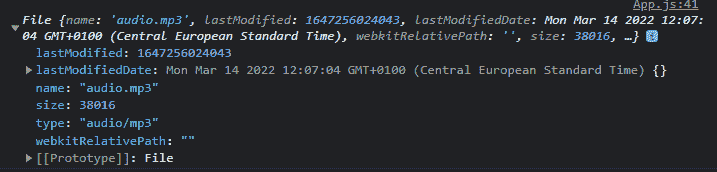

如你所见，里面有一堆信息。

这是我们将要上传到 AssemblyAI 的实际文件，稍后进行转录。请理解`blobURL`是对这个文件的**引用，这样我们就可以使用 HTML 音频播放器来播放它，而`audioFile`是**实际的** audio.mp3 文件。**

好了，现在我们知道了如何录制音频，也知道了音频文件存储在哪里，我们可以开始设置转录了。

## 步骤 6 -启动 AssemblyAI API 连接

接下来，我们需要用 [AssemblyAI](https://app.assemblyai.com/signup) 创建一个帐户。一旦完成，前往你的[仪表盘](https://app.assemblyai.com/)拿起你的 API 密匙。

[Get your API key](https://app.assemblyai.com/signup)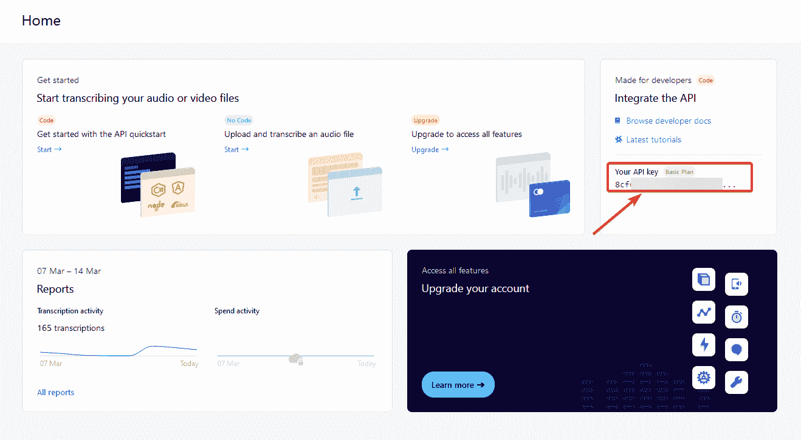

**重要提示:**千万不要和任何人分享这个 API 密匙，也不要把它提交给你的 Github 账户！(稍后将详细介绍)

### 正在向 AssemblyAI 验证

为了能够使用我们的 React 语音识别应用程序与 AssemblyAI 进行通信，我们需要做的第一件事是使用 AssemblyAI 的 API 进行身份验证。你可以在[文档](https://docs.assemblyai.com/walkthroughs#authentication)中查找，里面涵盖了几种语言。

为了能够与 AssemblyAI API 对话，我们需要确保**总是在请求头**中包含我们的 API 键。因为我们想坚持 DRY 原则，所以我们简单地为它创建一个变量，而不是一遍又一遍地输入它。

确保**用您的**实际 API 密钥**替换“your apikey”**。另外，请注意，我们将这个变量**放在了组件的**之外。这与`useEffect()`如何工作有关。

```py
import MicRecorder from "mic-recorder-to-mp3"
import { useEffect, useState, useRef } from "react"
import axios from "axios"

// Set AssemblyAI Axios Header
   const assembly = axios.create({
    baseURL: "https://api.assemblyai.com/v2",
    headers: {
      authorization: "YourAPIKey",
      "content-type": "application/json",
      "transfer-encoding": "chunked",
    },
  })

const App = () => {
  // Mic-Recorder-To-MP3
  const recorder = useRef(null) //Recorder
  const audioPlayer = useRef(null) //Ref for the HTML Audio Tag
  const [blobURL, setBlobUrl] = useState(null)
  const [audioFile, setAudioFile] = useState(null)
  const [isRecording, setIsRecording] = useState(null)

  useEffect(() => {
    //Declares the recorder object and stores it inside of ref
    recorder.current = new MicRecorder({ bitRate: 128 })
  }, [])

  const startRecording = () => {
    // Check if recording isn't blocked by browser
    recorder.current.start().then(() => {
      setIsRecording(true)
    })
  }

  const stopRecording = () => {
    recorder.current
      .stop()
      .getMp3()
      .then(([buffer, blob]) => {
        const file = new File(buffer, "audio.mp3", {
          type: blob.type,
          lastModified: Date.now(),
        })
        const newBlobUrl = URL.createObjectURL(blob)
        setBlobUrl(newBlobUrl)
        setIsRecording(false)
        setAudioFile(file)
      })
      .catch((e) => console.log(e))
  }

  // AssemblyAI API

  return (
    <div>
      <h1>React Speech Recognition App</h1>
      <audio ref={audioPlayer} src={blobURL} controls='controls' />
      <div>
        
          START
        
        
          STOP
        
        SUBMIT
      </div>
    </div>
  )
}

export default App 
```

为了测试认证是否有效，我们可以简单地使用这个[例子](https://docs.assemblyai.com/walkthroughs#submitting-files-for-transcription)进行测试。只需将这段代码粘贴到我们刚刚创建的程序集变量的下方，如下所示:

```py
 ...
// Set AssemblyAI Axios Header
   const assembly = axios.create({
    baseURL: "https://api.assemblyai.com/v2",
    headers: {
      authorization: "YourAPIKey",
      "content-type": "application/json",
      "transfer-encoding": "chunked",
    },
  })

assembly
    .post("/transcript", {
        audio_url: "https://bit.ly/3yxKEIY"
    })
    .then((res) => console.log(res.data))
    .catch((err) => console.error(err))
... 
```

现在刷新浏览器页面(应用程序运行的地方)并检查开发人员控制台(F12)。您应该会看到类似这样的响应:

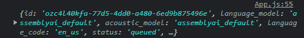

这个响应包括我们在一秒钟内需要的两个重要的东西，即`id`和`status`。

很好。身份验证有效，您可以继续并再次删除测试代码。

## 步骤 7 -上传音频文件并检索上传 URL

接下来，我们需要将我们的音频文件上传到 AssemblyAI API 进行转录。一旦上传，我们会收到一个包含上传 URL 的响应，我们需要将这个 URL 存储在一个状态变量中。

```py
..
const stopRecording = () => {
    recorder.current
      .stop()
      .getMp3()
      .then(([buffer, blob]) => {
        const file = new File(buffer, "audio.mp3", {
          type: blob.type,
          lastModified: Date.now(),
        })
        const newBlobUrl = URL.createObjectURL(blob)
        setBlobUrl(newBlobUrl)
        setIsRecording(false)
        setAudioFile(file)
      })
      .catch((e) => console.log(e))
  }

  // AssemblyAI API

  // State variables
  const [uploadURL, setUploadURL] = useState("")
... 
```

一旦我们有了这个 URL，一旦创建了一个音频文件，我们就利用`useEffect`向 API **发出一个 **POST 请求**。我们`console.log`看看结果是否有效。**

```py
...
// AssemblyAI API

  // State variables
  const [uploadURL, setUploadURL] = useState("")

  // Upload the Audio File and retrieve the Upload URL
  useEffect(() => {
    if (audioFile) {
      assembly
        .post("/upload", audioFile)
        .then((res) => setUploadURL(res.data.upload_url))
        .catch((err) => console.error(err))
    }
  }, [audioFile])

  console.log(uploadURL)
... 
```

一旦你实现了这些代码，**刷新你的页面**，录制一个小的音频文件并查看控制台看看会发生什么。点击**停止**按钮几秒钟后，您应该会收到一个响应，包括您的**上传 URL** ，它现在存储在`uploadURL`中。

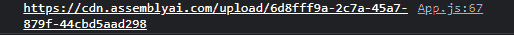

明白了吗？酷毙了。我们继续吧。

安装说明

在 useEffect 钩子中包含[audioFile]的依赖数组确保了只有在 audioFile 状态改变时(在创建音频文件之后)才会发出 POST 请求。

## 步骤 8 -提交音频文件进行转录

现在我们需要将我们的`uploadURL`作为 POST 请求发送给 API，以开始转录过程。为此，现在让我们添加一个简单的按钮来处理这个问题。我们还需要创建更多的状态变量。我们的整个代码现在看起来像这样。

```py
import MicRecorder from "mic-recorder-to-mp3"
import { useEffect, useState, useRef } from "react"
import axios from "axios"

  // Set AssemblyAI Axios Header
  const assembly = axios.create({
    baseURL: "https://api.assemblyai.com/v2",
    headers: {
      authorization: "YourAPIKey",
      "content-type": "application/json",
      "transfer-encoding": "chunked",
    },
  })

const App = () => {
  // Mic-Recorder-To-MP3
  const recorder = useRef(null) //Recorder
  const audioPlayer = useRef(null) //Ref for the HTML Audio Tag
  const [blobURL, setBlobUrl] = useState(null)
  const [audioFile, setAudioFile] = useState(null)
  const [isRecording, setIsRecording] = useState(null)

  useEffect(() => {
    //Declares the recorder object and stores it inside of ref
    recorder.current = new MicRecorder({ bitRate: 128 })
  }, [])

  const startRecording = () => {
    // Check if recording isn't blocked by browser
    recorder.current.start().then(() => {
      setIsRecording(true)
    })
  }

  const stopRecording = () => {
    recorder.current
      .stop()
      .getMp3()
      .then(([buffer, blob]) => {
        const file = new File(buffer, "audio.mp3", {
          type: blob.type,
          lastModified: Date.now(),
        })
        const newBlobUrl = URL.createObjectURL(blob)
        setBlobUrl(newBlobUrl)
        setIsRecording(false)
        setAudioFile(file)
      })
      .catch((e) => console.log(e))
  }

  // AssemblyAI API

  // State variables
  const [uploadURL, setUploadURL] = useState("")
  const [transcriptID, setTranscriptID] = useState("")
  const [transcriptData, setTranscriptData] = useState("")
  const [transcript, setTranscript] = useState("")

  // Upload the Audio File and retrieve the Upload URL
  useEffect(() => {
    if (audioFile) {
      assembly
        .post("/upload", audioFile)
        .then((res) => setUploadURL(res.data.upload_url))
        .catch((err) => console.error(err))
    }
  }, [audioFile])

  // Submit the Upload URL to AssemblyAI and retrieve the Transcript ID
  const submitTranscriptionHandler = () => {
    assembly
      .post("/transcript", {
        audio_url: uploadURL,
      })
      .then((res) => {
        setTranscriptID(res.data.id)
      })
      .catch((err) => console.error(err))
  }

	console.log(transcriptID)

  return (
    <div>
      <h1>React Speech Recognition App</h1>
      <audio ref={audioPlayer} src={blobURL} controls='controls' />
      <div>
        
          START
        
        
          STOP
        
        SUBMIT
      </div>
    </div>
  )
}

export default App 
```

好吧，让我们试一试。刷新页面，再次录制音频文件，按下**停止**后，按下**提交**按钮。提交完成后，您应该会在控制台中收到您的`transcriptID`。

### 检查转录状态

为了能够看到我们的文件是否完成了转录，我们可以使用两种方法之一。**第一个**使用的是[网页钩子](https://docs.assemblyai.com/walkthroughs#using-webhooks)，**第二个**使用的是简单函数。我们在本教程中采用后者，因为它有助于我们理解每一步。

在下面添加`checkStatusHandler`异步函数。另外，将`console.log`改为日志`transcriptData`，并在 HTML 代码中添加**检查状态**按钮。

```py
...
  // Submit the Upload URL to AssemblyAI and retrieve the Transcript ID
  const submitTranscriptionHandler = () => {
    assembly
      .post("/transcript", {
        audio_url: uploadURL,
      })
      .then((res) => {
        setTranscriptID(res.data.id)
      })
      .catch((err) => console.error(err))
  }

  // Check the status of the Transcript and retrieve the Transcript Data
  const checkStatusHandler = async () => {
    try {
      await assembly.get(`/transcript/${transcriptID}`).then((res) => {
        setTranscriptData(res.data)
		setTranscript(transcriptData.text)
      })
    } catch (err) {
      console.error(err)
    }
  }

  console.log(transcriptData)

  return (
    <div>
      <h1>React Speech Recognition App</h1>
      <audio ref={audioPlayer} src={blobURL} controls='controls' />
      <div>
        
          START
        
        
          STOP
        
        SUBMIT
        CHECK STATUS
      </div>
    </div>
  )
}

export default App 
```

好吧，再来一次。刷新，记录，点击**停止**，点击**提交**，然后点击**检查状态**。

您应该会收到响应，告诉您它仍在处理中。

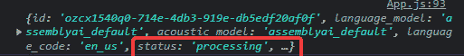

现在，我们如何检查状态是否更改为“已完成”？通过再次点击**检查状态**按钮。别担心，我们很快就会自动完成。

几秒钟后，转录完成。

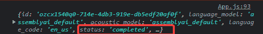

如果您打开此对象并向下滚动，直到找到`text`，您将看到您对着麦克风说出的文本。

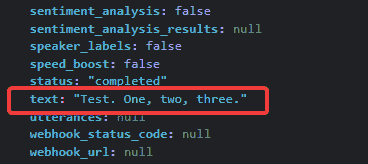

因为我们将这个响应存储在我们的`transcriptData`变量中，所以我们现在可以完全访问它。

### 显示成绩单数据

现在你也可以看到我们将`transcriptData.text`存储在`transcript`变量中。这意味着一旦转录完成，转录变量将保存我们转录的文本。我们现在能够使用条件呈现来显示该文本。

```py
...
return (
    <div>
      <h1>React Speech Recognition App</h1>
      <audio ref={audioPlayer} src={blobURL} controls='controls' />
      <div>
        
          START
        
        
          STOP
        
        SUBMIT
        CHECK STATUS
      </div>
      {transcriptData.status === "completed" ? (
        <p>{transcript}</p>
      ) : (
        <p>{transcriptData.status}</p>
      )}
    </div>
  )
... 
```

这就是一切都做完后的结果。

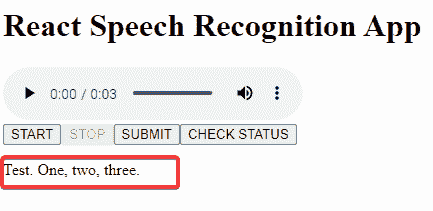

**为了得到最终结果**，我们需要反复按下**检查状态**按钮，直到**音频文件处理完毕**。很高兴，有一个更简单的方法来做到这一点。

## 步骤 9 -自动化流程

现在代码会有很大的变化，但本质上，它会保持不变。我向你解释发生了什么变化。

```py
import MicRecorder from "mic-recorder-to-mp3"
import { useEffect, useState, useRef } from "react"
import axios from "axios"

  // Set AssemblyAI Axios Header
  const assembly = axios.create({
    baseURL: "https://api.assemblyai.com/v2",
    headers: {
      authorization: "YourAPIKey",
      "content-type": "application/json",
      "transfer-encoding": "chunked",
    },
  })

const App = () => {
  // Mic-Recorder-To-MP3
  const recorder = useRef(null) //Recorder
  const audioPlayer = useRef(null) //Ref for the HTML Audio Tag
  const [blobURL, setBlobUrl] = useState(null)
  const [audioFile, setAudioFile] = useState(null)
  const [isRecording, setIsRecording] = useState(null)

  useEffect(() => {
    //Declares the recorder object and stores it inside of ref
    recorder.current = new MicRecorder({ bitRate: 128 })
  }, [])

  const startRecording = () => {
    // Check if recording isn't blocked by browser
    recorder.current.start().then(() => {
      setIsRecording(true)
    })
  }

  const stopRecording = () => {
    recorder.current
      .stop()
      .getMp3()
      .then(([buffer, blob]) => {
        const file = new File(buffer, "audio.mp3", {
          type: blob.type,
          lastModified: Date.now(),
        })
        const newBlobUrl = URL.createObjectURL(blob)
        setBlobUrl(newBlobUrl)
        setIsRecording(false)
        setAudioFile(file)
      })
      .catch((e) => console.log(e))
  }

  // AssemblyAI API

  // State variables
  const [uploadURL, setUploadURL] = useState("")
  const [transcriptID, setTranscriptID] = useState("")
  const [transcriptData, setTranscriptData] = useState("")
  const [transcript, setTranscript] = useState("")
  const [isLoading, setIsLoading] = useState(false)

  // Upload the Audio File and retrieve the Upload URL
  useEffect(() => {
    if (audioFile) {
      assembly
        .post("/upload", audioFile)
        .then((res) => setUploadURL(res.data.upload_url))
        .catch((err) => console.error(err))
    }
  }, [audioFile])

  // Submit the Upload URL to AssemblyAI and retrieve the Transcript ID
  const submitTranscriptionHandler = () => {
    assembly
      .post("/transcript", {
        audio_url: uploadURL,
      })
      .then((res) => {
        setTranscriptID(res.data.id)

        checkStatusHandler()
      })
      .catch((err) => console.error(err))
  }

  // Check the status of the Transcript
  const checkStatusHandler = async () => {
    setIsLoading(true)
    try {
      await assembly.get(`/transcript/${transcriptID}`).then((res) => {
        setTranscriptData(res.data)
      })
    } catch (err) {
      console.error(err)
    }
  }

  // Periodically check the status of the Transcript
  useEffect(() => {
    const interval = setInterval(() => {
      if (transcriptData.status !== "completed" && isLoading) {
        checkStatusHandler()
      } else {
        setIsLoading(false)
        setTranscript(transcriptData.text)

        clearInterval(interval)
      }
    }, 1000)
    return () => clearInterval(interval)
  },)

  return (
    <div>
      <h1>React Speech Recognition App</h1>
      <audio ref={audioPlayer} src={blobURL} controls='controls' />
      <div>
        
          START
        
        
          STOP
        
        SUBMIT
      </div>
      {transcriptData.status === "completed" ? (
        <p>{transcript}</p>
      ) : (
        <p>{transcriptData.status}</p>
      )}
    </div>
  )
}

export default App 
```

你现在应该做的第一件事是再次运行应用程序。你会看到你只需要点击**开始**、**停止**，然后**提交**。现在**处理...**出现在屏幕上。过了一会儿，我们转录的文本出现了。这种神奇是怎么发生的？

首先，我们添加了一个`isLoading`状态变量来检查状态是**“处理中”**还是**“完成”**。

然后，我们创建了一个所谓的间隔来定期运行我们的`checkStatusHandler()`函数，以查看状态是否已经变为**“已完成”**。一旦状态变为“完成”，它将`isLoading`设置为 *false* ，将转录的文本添加到我们的`transcript`变量中，并结束间隔。

```py
 // Periodically check the status of the Transcript
  useEffect(() => {
    const interval = setInterval(() => {
      if (transcriptData.status !== "completed" && isLoading) {
        checkStatusHandler()
      } else {
        setIsLoading(false)
        setTranscript(transcriptData.text)

        clearInterval(interval)
      }
    }, 1000)
    return () => clearInterval(interval)
  }, ) 
```

基本上就是这样了。同样，这是完全没有风格的更好的可视性。在最终版本中，当状态不等于**“完成”**时，我添加了一个加载微调器。

## 结论

正如您所看到的，React 语音识别起初可能会令人困惑，但是一旦您理解了它是如何工作的，它就是您的存储库中的一个很好的工具。

有大量的项目想法可以利用语音识别的能力。看看这些视频中的一些想法吧！

1.  [自动总结你的讲座](https://www.assemblyai.com/blog/python-project-lecture-summaries/)
2.  [自动发布你说的最后一句话](https://www.youtube.com/watch?v=UTRtdIq2xCs)
3.  [自动实时转录电话通话](https://www.youtube.com/watch?v=3XmtJgWcOT0&t=2s)