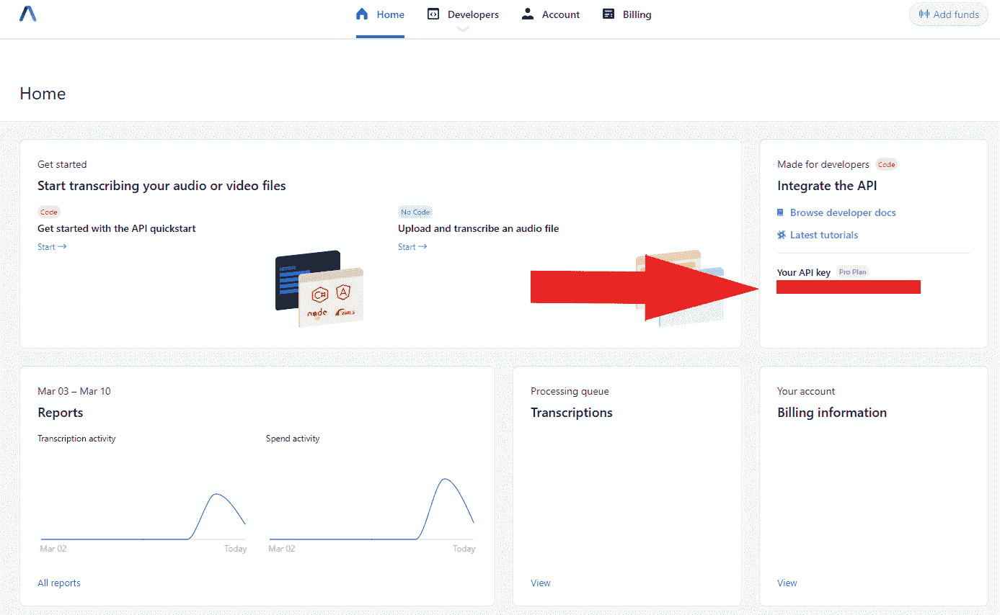
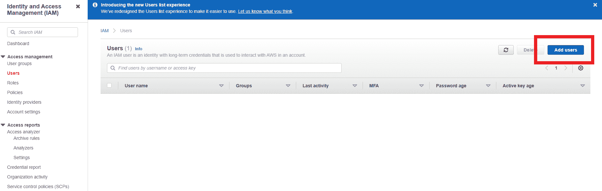
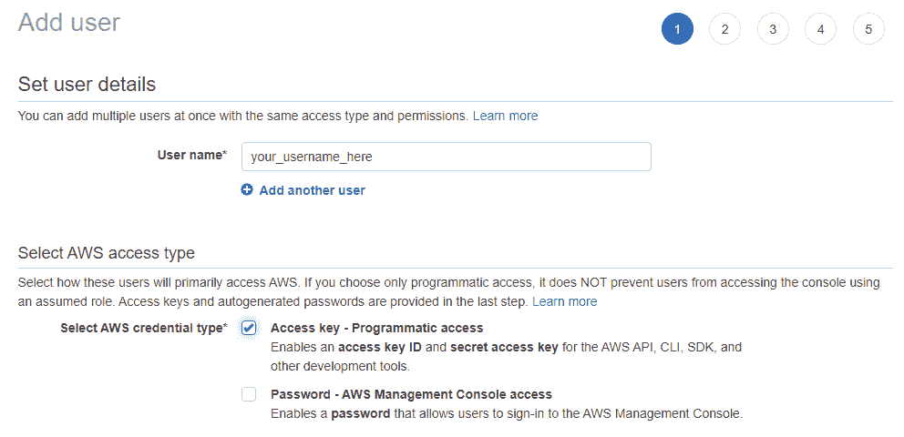
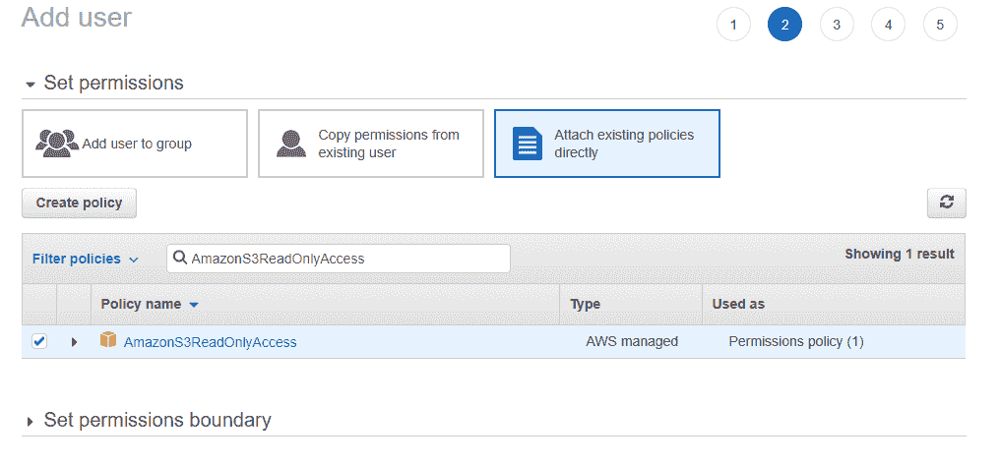
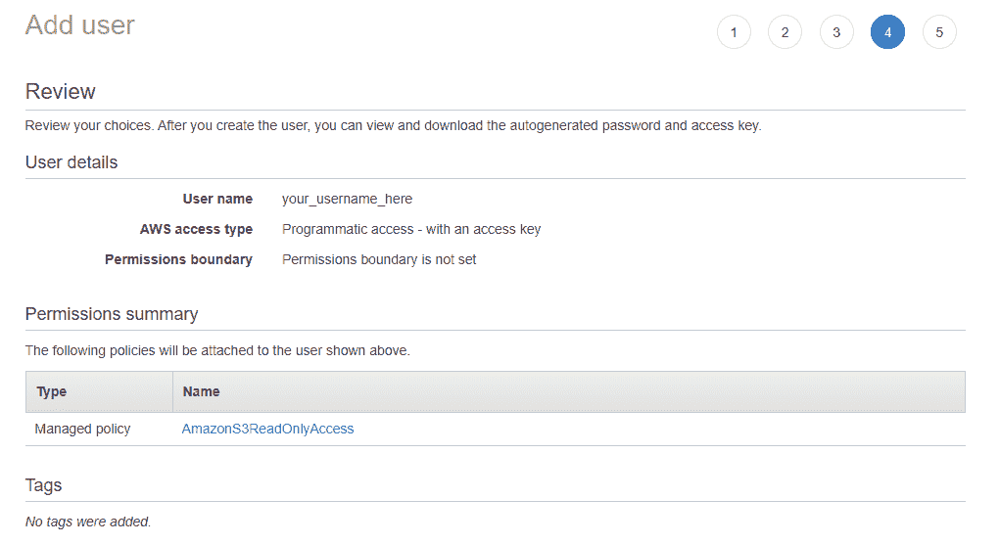

# 用 AssemblyAI 在 S3 桶中转录音频文件

> 原文：<https://www.assemblyai.com/blog/transcribing-audio-files-in-an-s3-bucket-with-assemblyai/>

AssemblyAI 的语音转文本 API 既可以用于本地文件，也可以用于公开访问的在线文件，但如果你想转录一个*受限*访问的音频文件呢？幸运的是，您也可以用 AssemblyAI 来做这件事！

继续阅读，了解如何使用 AssemblyAI 的 API 转录存储在 AWS S3 桶中的音频文件。

## 介绍

为了从 S3 桶转录音频文件，AssemblyAI 将需要临时访问该文件。为了提供这种访问，我们将生成一个**预先指定的 URL** ，它只是一个内置了临时访问权限的 URL。

整个过程如下所示:

1.  使用 [boto](http://boto.cloudhackers.com/en/latest/) 为 S3 音频文件生成一个预先设计的 URL
2.  用 POST 请求将这个 URL 传递给 AssemblyAI 的 API
3.  等待转录完成，然后用 GET 请求获取它


POST a presigned S3 URL to AssemblyAI and then GET the transcript

## 先决条件

为了用 AssemblyAI 转录 S3 音频文件，您需要满足两个先决条件:

### 汇编 AI 帐户

首先，你显然需要一个 AssemblyAI 账户——如果你还没有，你可以在这里注册一个免费账户。

接下来，你需要**记下你的 AssemblyAI API 密钥**，你可以在登录后在你的[仪表板](https://app.assemblyai.com/)上找到它。它将出现在屏幕右侧的*你的 API 键*下



**您稍后将需要这个键的值**，所以让浏览器窗口保持打开，或者将该值复制到一个文本文件中。

### AWS IAM 用户

其次，您需要一个拥有`Programmatic`访问权限和`AmazonS3ReadOnlyAccess`权限的 AWS IAM 用户。如果您已经有了这样一个 IAM 用户，并且知道它的**公钥和私钥**，那么您可以继续下一部分。否则，现在创建一个，如下所示:

首先，以 root 用户或具有适当访问权限的另一个 IAM 用户的身份登录 AWS，然后转到 [IAM 管理控制台](https://us-east-1.console.aws.amazon.com/iamv2/home#/users)添加一个新用户。



设置您想要的用户名，选择*下的*程序化访问*，选择 AWS 访问类型:*



点击*下一步*，然后*直接附加已有保单*。将 *AmazonS3ReadOnlyAccess* 复制并粘贴到*过滤器策略*搜索框中，然后通过单击旁边的复选框添加该权限:



点击下一个的*，并添加标签。然后点击*下一步*，并在点击*创建用户*之前查看 IAM 用户资料以确保一切正常:*



最后，记下 IAM 用户的*访问密钥 ID* 和*秘密访问密钥*。同样，**我们稍后将需要这些值**，所以在继续之前将它们复制到一个文本文件中。

警告

确保复制 IAM 用户的*秘密访问密钥*并将其记录在安全的地方。一旦您关闭了*添加用户*序列的最后一个窗口，您将无法再次访问该密钥，如果您忘记/丢失了原始密钥，则需要重新生成该密钥。

## 克隆程序集 GitHub Repo

现在，我们可以继续实际生成和获取 S3 音频文件的转录！首先，通过在终端输入以下内容，从 [AssemblyAI 的 GitHub](https://github.com/AssemblyAI) 中克隆[关联的 repo](https://github.com/AssemblyAI/transcribe-from-s3-bucket) :

```py
git clone https://github.com/AssemblyAI/transcribe-from-s3-bucket
```

克隆存储库后，创建并激活虚拟环境，然后安装必要的依赖项:

```py
pip install -r requirements.txt
```

## 拿到抄本

要获得 S3 音频文件的转录，打开`transcribe_from_s3.py`并编辑以下变量，使其等同于您应用的相关值:

1.  `bucket_name` -您的 AWS S3 铲斗的名称
2.  `object_name` -您想要转录的 S3 桶中的音频文件的名称
3.  `iam_access_id` -具有程序访问和 S3 读取权限的 IAM 用户的访问 ID
4.  `iam_secret_key`-IAM 用户的密钥
5.  `assembly_key` -您的 AssemblyAI API 密钥

一旦完成，只需运行`transcribe_from_s3.py`来查看控制台中打印的 S3 音频文件的转录！

如果你有兴趣了解引擎盖下发生的事情，请阅读下一部分了解更多。

## 在后台

本节详细介绍了`transcribe_from_s3.py`是如何工作的，因此您可以修改代码来满足您的需要。

首先，导入必要的包并设置相关的变量值:

```py
import boto3
from botocore.exceptions import ClientError
import logging
import requests
import time

# Set relevant values
bucket_name = "<BUCKET_NAME>"
object_name = "<AUDIO_FILE_NAME>"

iam_access_id = "<IAM_ACCESS_ID>"
iam_secret_key = "<IAM_SECRET_KEY>"

assembly_key = "<ASSEMBLYAI_API_KEY>"
```

从这里开始，我们只需遵循本文简介中概述的顺序:

1.  使用 [boto](http://boto.cloudhackers.com/en/latest/) 为 S3 音频文件生成一个预先设计的 URL

```py
# Create a low-level service client with the IAM credentials
s3_client = boto3.client(
    's3', 
    aws_access_key_id=iam_access_id,
    aws_secret_access_key=iam_secret_key)

# Generate a pre-signed URL for the audio file that expires after 30 minutes
try:
    p_url = s3_client.generate_presigned_url(
        ClientMethod='get_object',
        Params={'Bucket': bucket_name, 'Key': object_name},
        ExpiresIn=1800)

except ClientError as e:
    logging.error(e)
```

2.通过 POST 请求将预先签名的 URL 传递给 AssemblyAI 的 API:

```py
# Use your AssemblyAI API Key for authorization
headers = {
    "authorization": assembly_key,
    "content-type": "application/json"
}

# Specify AssemblyAI's transcription API endpoint
upload_endpoint = "https://api.assemblyai.com/v2/transcript"

# Use the presigned URL as the `audio_url` in the POST request
json = {
    "audio_url": p_url
}

# Queue the audio file for transcription with a POST request
post_response = requests.post(upload_endpoint, json=json, headers=headers)
```

3.等待转录完成，然后用 GET 请求获取它:

```py
# Specify the endpoint of the transcription
get_endpoint = upload_endpoint + "/" + post_response.json()['id']

# GET request the transcription
get_response = requests.get(get_endpoint, headers=headers)

# If the transcription has not finished, wait until it has
while get_response.json()['status'] != 'completed':
  get_response = requests.get(get_endpoint, headers=headers)
  time.sleep(5)

# Once the transcription is complete, print it out
print(get_response.json()['text'])
```

## 最后的话

本教程到此为止！

如果你在寻找其他常见问题的答案，你可以查看 AssemblyAI 的帮助中心。

如果你想了解更多关于使用 AssemblyAI 的语音到文本 API 进行构建的信息，包括关于音频智能功能的信息，如自动章节、情感分析和实体检测，请查看[文档](https://docs.assemblyai.com/)。

如果你只是在寻找更多精彩的内容，请查看 [AssemblyAI 博客](https://www.assemblyai.com/blog)并关注我们的时事通讯。

想了解更多关于 ML 的所有事情？

关注我们的时事通讯，获取教程、项目和论文评论。

[Follow](https://assemblyai.us17.list-manage.com/subscribe?u=cb9db7b18b274c2d402a56c5f&id=2116bf7c68)