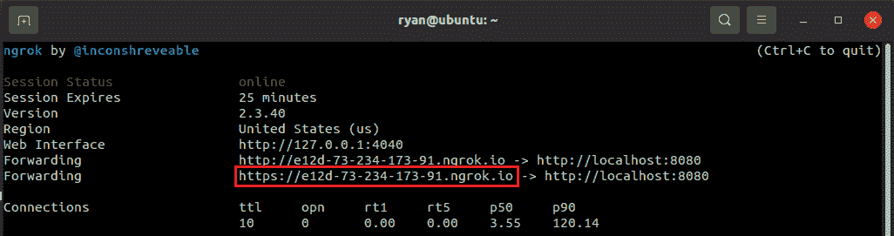
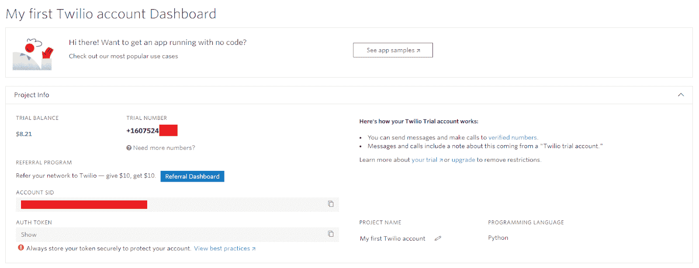
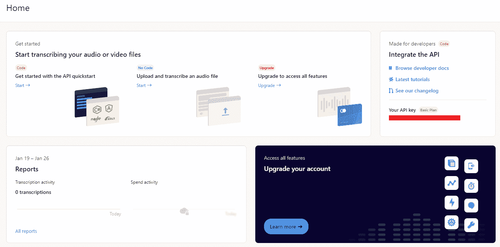

# 用 AssemblyAI 实时转录 Twilio 电话

> 原文：<https://www.assemblyai.com/blog/transcribe-twilio-phone-calls-in-real-time-with-assemblyai/>

[Twilio](https://www.twilio.com/) 是一个领先的客户沟通和互动平台，从定制优惠券到个性化约会提醒，它可以轻松创造个性化的用户体验。但是，如果您不是仅仅将信息从*发送到*，而是想要记录来自客户的信息从传入*会怎么样呢？*

例如，医生可能希望自动记录患者的电话，这样她就可以专注于与患者交流，而不是手忙脚乱地写下笔记。打完电话后，医生可以查看记录以便做出诊断，确信她没有遗漏任何细节。

以这种方式转录电话不仅有用，而且用 AssemblyAI 的[实时转录服务](https://www.assemblyai.com/)也很容易做到。**本教程结束时，你将能够打电话，并看到你的话实时转录在你面前！让我们开始吧。**

## 先决条件

为了跟随本教程，你需要设置一个 [Twilio](https://www.twilio.com/try-twilio) 账户。你还需要有一个 [AssemblyAI](https://app.assemblyai.com/signup) 账户，必须升级才能使用实时转录功能。

本教程中的命令是针对基于 Debian 的系统( [Ubuntu 20.04 LTS](https://ubuntu.com/download/desktop) )，所以你可能需要修改一些命令来适应你的操作系统。

## 装置

首先，你需要确保你已经安装了 [Node.js](https://nodejs.org/en/) 、[节点包管理器](https://www.npmjs.com/)、 [cURL](https://curl.se/) 和 [wget](https://www.gnu.org/software/wget/) 。

| 【Ryan @ Ubuntu】:【sudo apt 安装 nodejs NPM curl wget】 |

附加说明

您可以复制 Bash 命令并粘贴到终端中，方法是在终端中右键单击并选择“粘贴”。

### ngrok

接下来，我们将安装`[ngrok](https://ngrok.com/download)`，它允许我们生成一个面向公众的 URL，我们可以用它将 HTTP 请求从 Twilio 转发到我们的本地主机。

| 【Ryan @ Ubuntu】:$ curl-s https://ngok-agent . S3 . Amazon ws . com/ngok . ASC &#124; sudo 茶/etc/apt/trusted . gpg . d/ngok . ASC |

### Twilio CLI 工具

最后，我们将安装 Twilio 的 [CLI 工具](https://www.twilio.com/docs/twilio-cli/quickstart)，这将允许我们指定我们的 Twilio POST 请求被定向到我们的`ngrok` URL。

| 【Ryan @ Ubuntu】:~$ wget-qo-https://twilio-CLI-prod . S3 . Amazon ws . com/twilio _ pub . ASC \ &#124; sudo apt-key add-sudo touch/ |

系统会提示您使用`twilio login`登录，然后为您的帐户设置一个速记标识符。最后，运行`twilio profiles:use $IDENTIFIER`来使用您的帐户，这里的`$IDENTIFIER`已经被替换为您刚刚为您的帐户设置的简写标识符。

## 正在创建 ngrok 隧道

现在我们已经完成了设置，我们可以继续有趣的事情了！我们要做的第一件事是创建一个`ngrok`隧道。打开一个新的终端并创建一个`ngrok`隧道

| (基地) 瑞安@ Ubuntu:~$ ngrok http 8080 |

其中 8080 指定了`localhost`端口。运行此命令后，终端中将显示几个 URL。复制 HTTPS 转发网址，就像下面用红色圈出的那个。

## 设置 Twilio URL

保持`ngrok`运行并打开一个新的终端。我们需要告诉 Twilio 我们的 Twilio 号码的路由地址是什么。我们的做法如下

| (基) 瑞安@ Ubuntu:~$ TWILIO phone-numbers:update $ TWILIO _ NUMBER-voice-URL $ NGROK _ HTTP _ URL |

其中`$TWILIO_NUMBER`已被替换为您的 Twilio 编号，您可以在 [Twilio 控制台](https://console.twilio.com/)中找到该编号(“试验编号”下的编号)

并且`$NGROK_HTTP_URL`已经被替换为您从上一节复制的 ngrok URL。

## 导出程序集密钥

接下来，转到 [AssemblyAI](https://app.assemblyai.com/) 并复制您的 API 密钥，您会在下面的红框中找到它。

现在，将您的 AssemblyAI API 密钥导出到一个环境变量

| (基地) 瑞安@ Ubuntu:~$ export API KEY = $ YOUR _ KEY |

您已经用刚刚复制的 AssemblyAI API 键替换了`$YOUR_KEY`。

## 启动您的本地主机

接下来，导航到您想要运行转录的目录，然后执行

| (基础) 瑞安@ Ubuntu:~$ NPM 安装快捷 ws wavefile |

以便安装必要的软件包。现在快跑

| (base) 瑞安@ Ubuntu:~$ wget https://raw . githubusercontent . com/assembly ai/twilio-real time-tutorial/master/transcripte . js |

从 AssemblyAI 的 [GitHub](https://github.com/AssemblyAI/twilio-realtime-tutorial/blob/master/transcribe.js) 下载`transcribe.js`。最后，使用以下命令启动服务器

| (基) 瑞安@ Ubuntu:~$ node transcripte . js |

然后拨打您的 Twilio 号码并开始讲话。**你会在控制台看到 AssemblyAI 的转录！**请随意修改`transcribe.js`以满足您的需求——您可以查看[这个](https://www.youtube.com/watch?v=3XmtJgWcOT0)视频，了解上述方法如何工作的深入解释以及如何在浏览器中而不是在控制台中显示您的转录！

## 脚注

1.  AssemblyAI 的 GitHub 上的这个代码可能会帮助你用 JavaScript 在浏览器中动态更新转录
2.  本教程引用了发布在 Twilio 网站上的代码