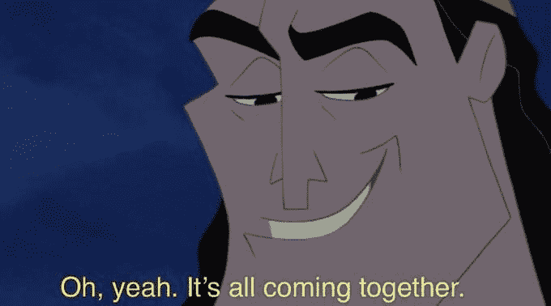

# 傻瓜的深度演讲-教程和概述

> 原文：<https://www.assemblyai.com/blog/deepspeech-for-dummies-a-tutorial-and-overview-part-1/>

什么是 DeepSpeech？ [DeepSpeech 是百度](https://arxiv.org/abs/1412.5567)的一个研究团队首次发布的神经网络架构。2017 年，Mozilla 创建了这篇论文的开源实现——名为“ [Mozilla DeepSpeech](https://github.com/mozilla/DeepSpeech) ”。

来自百度的原始 DeepSpeech 论文普及了“端到端”语音识别模型的概念。“端到端”是指模型接收音频，直接输出字符或单词。这与传统的语音识别模型相比较，如那些用流行的开源库(如 Kaldi 或 CMU 斯芬克斯)构建的模型，这些模型预测音素，然后在稍后的下游过程中将这些音素转换为单词。

像 DeepSpeech 这样的“端到端”模型的目标是将语音识别管道简化为一个单一的模型。此外，百度研究论文介绍的理论是，在大量数据上训练大型深度学习模型，会比经典的语音识别模型产生更好的性能。

今天，Mozilla DeepSpeech 库提供了预训练的语音识别模型，您可以使用这些模型以及工具来训练您自己的 DeepSpeech 模型。另一个很酷的功能是能够通过 [Common Voice](https://commonvoice.mozilla.org/en) 项目为 DeepSpeech 的公共训练数据集做出贡献。

在下面的教程中，我们将带你通过 Mozilla DeepSpeech 库安装和转录音频文件(我们称之为 deep speech forward)。

## 基本深度演讲示例

DeepSpeech 很容易上手。正如我们在 2021 年的 [Python 语音识别概述中所讨论的，您可以使用 Python 的内置包安装程序 pip 下载并开始使用 DeepSpeech。如果你安装了 cURL，你也可以从 DeepSpeech GitHub repo 下载 DeepSpeech 的预训练英语模型文件。请注意，我们在下面下载的文件是。记分员'和'。pbmm '文件。](https://www.assemblyai.com/blog/the-state-of-python-speech-recognition-in-2021)

```py
# Install DeepSpeech
pip3 install deepspeech

# Download pre-trained English model files
curl -LO https://github.com/mozilla/DeepSpeech/releases/download/v0.9.3/deepspeech-0.9.3-models.pbmm
curl -LO https://github.com/mozilla/DeepSpeech/releases/download/v0.9.3/deepspeech-0.9.3-models.scorer
```

快速提醒一下——当使用 DeepSpeech 时，重要的是要考虑到只有 16 千赫兹(kHz)。从 2021 年 9 月下旬开始支持 wav 文件。

让我们来看一些关于如何用 DeepSpeech 异步转录语音的示例代码。如果您使用的是 Unix 发行版，您需要安装 Sound eXchange (sox)。Sox 可以通过使用 Ubuntu/Debian 的“apt”或 Fedora 的“dnf”来安装，如下所示。

```py
sudo apt install sox
```

或者

```py
sudo dnf install sox
```

现在让我们也安装 Python 库，我们将需要它来工作。我们将需要 DeepSpeech 库、用于语音活动检测的 webrtcvad 和用于访问桌面系统上的多媒体(声音)功能的 pyqt5。之前，我们已经安装了 DeepSpeech，我们可以用 pip 安装另外两个库，如下所示:

```py
pip install webrtcvad pyqt5
```

现在我们有了所有的依赖项，让我们创建一个转录器。当我们完成后，我们将能够转录任何。wav '音频文件，就像下面的例子。


在我们开始构建我们的转录器之前，确保我们之前下载的模型文件保存在。/models '目录的工作目录。我们要做的第一件事是创建一个语音活动检测(VAD)功能，并使用它来提取音频文件中有语音活动的部分。

如何创建 VAD 函数？我们需要一个函数来读取。wav '文件，一种生成音频帧的方法，以及一种创建缓冲区来收集具有语音活动的音频部分的方法。音频帧是我们构建的对象，包含音频的字节数据、总音频中的时间戳以及帧的持续时间。让我们从创建 wav 文件阅读器函数开始。

我们需要做的就是打开给定的文件，断言通道、采样宽度、采样速率是我们需要的，最后获取帧，并将数据作为 PCM 数据连同采样速率和持续时间一起返回。我们将使用“contextlib”来打开、读取和关闭 wav 文件。

我们期望音频文件具有 1 个通道，采样宽度为 2，采样速率为 8000、16000 或 32000。我们用帧数除以采样率来计算持续时间。

```py
import contextlib

def read_wave(path):
   """Reads a .wav file.

   Takes the path, and returns (PCM audio data, sample rate).
   """
   with contextlib.closing(wave.open(path, 'rb')) as wf:
       num_channels = wf.getnchannels()
       assert num_channels == 1
       sample_width = wf.getsampwidth()
       assert sample_width == 2
       sample_rate = wf.getframerate()
       assert sample_rate in (8000, 16000, 32000)
       frames = wf.getnframes()
       pcm_data = wf.readframes(frames)
       duration = frames / sample_rate
       return pcm_data, sample_rate, duration
```

既然我们有了读取 wav 文件的方法，让我们创建一个帧生成器来生成包含帧大小、时间戳和持续时间的各个帧。我们将生成帧，以确保我们的音频在合理大小的剪辑中得到处理，并分离出有语音和无语音的片段。

想找更多这样的教程？

订阅我们的时事通讯！

[Subscribe Now](Subscribe to our newsletter!)

以下生成器函数以毫秒为单位的帧持续时间、PCM 音频数据和采样速率作为输入。它使用该数据创建从 0 开始的偏移、帧大小和持续时间。虽然我们还没有产生足够的帧来覆盖整个音频文件，但该函数将继续产生帧并添加到我们的时间戳和偏移量中。

```py
class Frame(object):
   """Represents a "frame" of audio data."""
   def __init__(self, bytes, timestamp, duration):
       self.bytes = bytes
       self.timestamp = timestamp
       self.duration = duration

def frame_generator(frame_duration_ms, audio, sample_rate):
   """Generates audio frames from PCM audio data.

   Takes the desired frame duration in milliseconds, the PCM data, and
   the sample rate.

   Yields Frames of the requested duration.
   """
   n = int(sample_rate * (frame_duration_ms / 1000.0) * 2)
   offset = 0
   timestamp = 0.0
   duration = (float(n) / sample_rate) / 2.0
   while offset + n < len(audio):
       yield Frame(audio[offset:offset + n], timestamp, duration)
       timestamp += duration
       offset += n
```

在能够生成音频帧之后，我们将创建一个名为`vad_collector`的函数来分离有语音和无语音的音频部分。这个函数需要输入采样率、以毫秒为单位的帧持续时间、以毫秒为单位的填充持续时间、`webrtcvad.Vad`对象和一组音频帧。该函数虽然没有明确地这样调用，但也是一个生成器函数，用于生成一系列 PCM 音频数据。

在这个函数中，我们要做的第一件事是获取填充帧的数量，并创建一个带有出列的环形缓冲区。环形缓冲区最常用于缓冲数据流。

我们将有两种状态，触发的和未触发的，以指示 VAD 收集器功能是否应该将帧添加到有声帧的列表中或者产生以字节为单位的列表。

从有声帧的空列表和未触发状态开始，我们循环通过每个帧。如果我们不处于触发状态，并且该帧被确定为语音，则我们将其添加到缓冲区。如果在将新帧添加到缓冲区之后，超过 90%的缓冲区被确定为语音，则我们进入触发状态，将缓冲的帧附加到有声帧并清空缓冲区。

如果当我们处理一个帧时，函数已经处于触发状态，那么我们将该帧附加到有声帧列表，而不管它是否是语音。然后，我们将它以及它是否是语音的真值附加到缓冲区中。在附加到缓冲区之后，如果缓冲区 90%以上是非语音的，那么我们将我们的状态改变为非触发，产生作为字节的有声帧，并且清除有声帧列表和环形缓冲区。如果在帧结束时，有声帧中仍有帧，则将它们作为字节产生。

```py
def vad_collector(sample_rate, frame_duration_ms,
                 padding_duration_ms, vad, frames):
   """Filters out non-voiced audio frames.

   Given a webrtcvad.Vad and a source of audio frames, yields only
   the voiced audio.

   Uses a padded, sliding window algorithm over the audio frames.
   When more than 90% of the frames in the window are voiced (as
   reported by the VAD), the collector triggers and begins yielding
   audio frames. Then the collector waits until 90% of the frames in
   the window are unvoiced to detrigger.

   The window is padded at the front and back to provide a small
   amount of silence or the beginnings/endings of speech around the
   voiced frames.

   Arguments:

   sample_rate - The audio sample rate, in Hz.
   frame_duration_ms - The frame duration in milliseconds.
   padding_duration_ms - The amount to pad the window, in milliseconds.
   vad - An instance of webrtcvad.Vad.
   frames - a source of audio frames (sequence or generator).

   Returns: A generator that yields PCM audio data.
   """
   num_padding_frames = int(padding_duration_ms / frame_duration_ms)
   # We use a deque for our sliding window/ring buffer.
   ring_buffer = collections.deque(maxlen=num_padding_frames)
   # We have two states: TRIGGERED and NOTTRIGGERED. We start in the
   # NOTTRIGGERED state.
   triggered = False

   voiced_frames = []
   for frame in frames:
       is_speech = vad.is_speech(frame.bytes, sample_rate)

       if not triggered:
           ring_buffer.append((frame, is_speech))
           num_voiced = len([f for f, speech in ring_buffer if speech])
           # If we're NOTTRIGGERED and more than 90% of the frames in
           # the ring buffer are voiced frames, then enter the
           # TRIGGERED state.
           if num_voiced > 0.9 * ring_buffer.maxlen:
               triggered = True
               # We want to yield all the audio we see from now until
               # we are NOTTRIGGERED, but we have to start with the
               # audio that's already in the ring buffer.
               for f, s in ring_buffer:
                   voiced_frames.append(f)
               ring_buffer.clear()
       else:
           # We're in the TRIGGERED state, so collect the audio data
           # and add it to the ring buffer.
           voiced_frames.append(frame)
           ring_buffer.append((frame, is_speech))
           num_unvoiced = len([f for f, speech in ring_buffer if not speech])
           # If more than 90% of the frames in the ring buffer are
           # unvoiced, then enter NOTTRIGGERED and yield whatever
           # audio we've collected.
           if num_unvoiced > 0.9 * ring_buffer.maxlen:
               triggered = False
               yield b''.join([f.bytes for f in voiced_frames])
               ring_buffer.clear()
               voiced_frames = []
   # if triggered:
   #     pass
   # If we have any leftover voiced audio when we run out of input,
   # yield it.
   if voiced_frames:
       yield b''.join([f.bytes for f in voiced_frames]) 
```

这就是我们需要做的，以确保我们可以读取我们的 wav 文件，并使用它来生成带有语音活动检测的 PCM 音频剪辑。现在，让我们创建一个段生成器，它不仅会返回音频的字节数据段，还会返回转录它所需的元数据。这个函数只需要一个参数。“wav”文件。它的目的是过滤掉所有检测不到语音的音频帧，并返回带有语音的音频文件部分。该函数返回一组分段、音频文件的采样率和音频文件的长度。

```py
'''
Generate VAD segments. Filters out non-voiced audio frames.
@param waveFile: Input wav file to run VAD on.0

@Retval:
Returns tuple of
   segments: a bytearray of multiple smaller audio frames
             (The longer audio split into multiple smaller ones)
   sample_rate: Sample rate of the input audio file
   audio_length: Duration of the input audio file

'''
def vad_segment_generator(wavFile, aggressiveness):
   print("Caught the wav file @: %s" % (wavFile))
   audio, sample_rate, audio_length = read_wave(wavFile)
   assert sample_rate == 16000, "Only 16000Hz input WAV files are supported for now!"
   vad = webrtcvad.Vad(int(aggressiveness))
   frames = frame_generator(30, audio, sample_rate)
   frames = list(frames)
   segments = vad_collector(sample_rate, 30, 300, vad, frames)

   return segments, sample_rate, audio_length
```

既然我们已经处理了 wav 文件，并创建了将 wav 文件转换为 DeepSpeech 可以处理的有声 PCM 音频数据段所需的所有函数，那么让我们创建一种加载和解析模型的方法。

我们将创建两个名为`load_model`和`resolve_models`的函数。直观地说，`load_model`函数加载一个模型，返回 DeepSpeech 对象、模型加载时间和计分器加载时间。该函数需要一个模型和一个计分器。该函数通过 Python 中的 timer()模块计算加载模型和计分器所需的时间。它还从传入的“模型”参数创建了一个 DeepSpeech“模型”对象。

resolve models 函数采用一个目录名来表示模型所在的目录。然后它抓取第一个以'结尾的文件。pbmm '和第一个以'结尾的文件。“记分员”并将它们作为模型加载。

```py
'''
Load the pre-trained model into the memory
@param models: Output Graph Protocol Buffer file
@param scorer: Scorer file

@Retval
Returns a list [DeepSpeech Object, Model Load Time, Scorer Load Time]
'''
def load_model(models, scorer):
   model_load_start = timer()
   ds = Model(models)
   model_load_end = timer() - model_load_start
   print("Loaded model in %0.3fs." % (model_load_end))

   scorer_load_start = timer()
   ds.enableExternalScorer(scorer)
   scorer_load_end = timer() - scorer_load_start
   print('Loaded external scorer in %0.3fs.' % (scorer_load_end))

   return [ds, model_load_end, scorer_load_end]

'''
Resolve directory path for the models and fetch each of them.
@param dirName: Path to the directory containing pre-trained models

@Retval:
Retunns a tuple containing each of the model files (pb, scorer)
'''
def resolve_models(dirName):
   pb = glob.glob(dirName + "/*.pbmm")[0]
   print("Found Model: %s" % pb)

   scorer = glob.glob(dirName + "/*.scorer")[0]
   print("Found scorer: %s" % scorer)

   return pb, scorer
```

能够从我们的 wav 文件中分割出语音，并加载我们的模型，这是我们在进行实际的语音到文本转换之前所需要的所有预处理。

现在让我们创建一个函数，它将允许我们转录我们的语音片段。这个函数将有三个参数:DeepSpeech 对象(从 load_models 返回)、音频文件和`fs`音频文件的采样率。除了跟踪处理时间，它所做的只是在音频上调用 DeepSpeech 对象的`stt`函数。

```py
'''
Run Inference on input audio file
@param ds: Deepspeech object
@param audio: Input audio for running inference on
@param fs: Sample rate of the input audio file

@Retval:
Returns a list [Inference, Inference Time, Audio Length]

'''
def stt(ds, audio, fs):
   inference_time = 0.0
   audio_length = len(audio) * (1 / fs)

   # Run Deepspeech
   print('Running inference...')
   inference_start = timer()
   output = ds.stt(audio)
   inference_end = timer() - inference_start
   inference_time += inference_end
   print('Inference took %0.3fs for %0.3fs audio file.' % (inference_end, audio_length))

   return [output, inference_time]
```



好了，我们所有的支持功能都准备好了，让我们做实际的语音到文本的转换。

在下面的“main”函数中，我们将直接提供一个路径，指向我们下载并移动到的模型。/models '目录下的工作目录。

我们可以询问用户过滤非语音的积极程度，或者直接自动设置为 1(从 0-3 的范围内)。我们还需要知道音频文件的位置。

之后，我们所要做的就是使用我们之前创建的函数来加载和解析我们的模型，加载音频文件，并对每个音频片段运行语音到文本的推理。下面的代码的其余部分只是为了调试，向您显示文件名、文件的持续时间、在一个段上运行推理需要多长时间，以及模型和计分器的加载时间。

该功能会将您的成绩单保存到。txt '文件，以及在终端中输出转录。

```py
def main():
   # need audio, aggressive, and model
   # Point to a path containing the pre-trained models & resolve ~ if used
   model = './models/v0.9.3'
   dirName = os.path.expanduser(model)

   audio = input("Where is your audio file located?")
   aggressive = 1 #input("What level of non-voice filtering would you like? (0-3)")

   # Resolve all the paths of model files
   output_graph, scorer = resolve_models(dirName)

   # Load output_graph, alphabet and scorer
   model_retval = load_model(output_graph, scorer)

   title_names = ['Filename', 'Duration(s)', 'Inference Time(s)', 'Model Load Time(s)', 'Scorer Load Time(s)']
   print("\n%-30s %-20s %-20s %-20s %s" % (title_names[0], title_names[1], title_names[2], title_names[3], title_names[4]))

   inference_time = 0.0

   waveFile = audio
   segments, sample_rate, audio_length = vad_segment_generator(waveFile, aggressive)
   f = open(waveFile.rstrip(".wav") + ".txt", 'w')
   print("Saving Transcript @: %s" % waveFile.rstrip(".wav") + ".txt")
   for i, segment in enumerate(segments):
       # Run deepspeech on the chunk that just completed VAD
       print("Processing chunk %002d" % (i,))
       audio = np.frombuffer(segment, dtype=np.int16)
       output = stt(model_retval[0], audio, sample_rate)
       inference_time += output[1]
       print("Transcript: %s" % output[0])

       f.write(output[0] + " ")

   # Summary of the files processed
   f.close()

   # Extract filename from the full file path
   filename, ext = os.path.split(os.path.basename(waveFile))
   print("************************************************************************************************************")
   print("%-30s %-20s %-20s %-20s %s" % (title_names[0], title_names[1], title_names[2], title_names[3], title_names[4]))
   print("%-30s %-20.3f %-20.3f %-20.3f %-0.3f" % (filename + ext, audio_length, inference_time, model_retval[1], model_retval[2]))
   print("************************************************************************************************************")
   print("%-30s %-20.3f %-20.3f %-20.3f %-0.3f" % (filename + ext, audio_length, inference_time, model_retval[1], model_retval[2]))

if __name__ == '__main__':
   main()
```

就是这样！这就是我们使用 DeepSpeech 对音频文件进行语音识别所要做的全部工作。这是令人惊讶的大量代码。不久前，我还写了一篇文章，介绍如何使用 AssemblyAI 语音转文本 API 以更少的代码实现这一点。如果你不想使用 DeepSpeech 的话，你可以在 25 行代码内阅读关于如何用 Python 进行语音识别的内容。

## 基本的 DeepSpeech 实时语音识别示例

[https://www.youtube.com/embed/clhcJgp-ciM?feature=oembed](https://www.youtube.com/embed/clhcJgp-ciM?feature=oembed)

现在我们已经看到了如何使用 DeepSpeech 进行异步语音识别，让我们也构建一个实时语音识别示例。就像以前一样，我们将从安装正确的需求开始。与上面的异步示例类似，我们将需要 webrtcvad，但是我们还需要 pyaudio、halo、numpy 和 scipy。

Halo 表示节目正在流式播放，numpy 和 scipy 用于以正确的采样率对音频进行重新采样。

```py
pip install deepspeech webrtcvad pyaudio halo numpy scipy
```

我们如何用 DeepSpeech 构建一个实时语音识别程序？正如我们在上面的例子中所做的那样，我们需要将检测到声音活动的音频段与没有声音活动的音频段分开。如果音频帧有声音活动，那么我们会将其输入 DeepSpeech 模型进行转录。

让我们为我们的声音活动检测音频帧创建一个对象，我们称之为 VADAudio(声音活动检测音频)。首先，我们将为我们的类定义格式、速率、通道数和每秒帧数。

```py
class VADAudio(object):
   """Filter & segment audio with voice activity detection."""

   FORMAT = pyaudio.paInt16
   # Network/VAD rate-space
   RATE_PROCESS = 16000
   CHANNELS = 1
   BLOCKS_PER_SECOND = 50
```

每个类都需要一个`__init__`函数。下面定义的 VADAudio 类的`__init__`函数将接受四个参数:一个回调、一个设备、一个输入速率和一个文件。除了 input_rate 之外，如果在创建时没有传递它们，那么它们将默认为 None。

输入采样速率将是我们在上面的类中定义的速率采样过程。当我们初始化我们的类时，我们还将创建一个名为`proxy_callback`的实例方法，它返回一个无元组和 pyAudio 信号以继续，但在它返回之前，它调用回调函数，因此得名`proxy_callback`。

初始化时，我们做的第一件事是将“callback”设置为一个函数，该函数将数据放入属于对象实例的缓冲队列中。我们为实例的缓冲队列初始化一个空队列。我们将设备和输入速率设置为传入的值，将采样速率设置为类的采样速率。然后，我们将我们的块大小和块大小输入分别导出为类的采样速率和输入速率的商除以每秒的块数。块是我们将要处理的音频数据的离散片段。

接下来，我们创建一个 PyAudio 对象并声明一组关键字参数。关键字参数是`format`，设置为我们之前声明的 VADAudio 类的格式值`channels`，设置为类的通道值`rate`，设置为输入速率`input`，设置为 true，`frames_per_buffer`设置为之前计算的块大小输入，`stream_callback`，设置为我们之前创建的`proxy_callback`实例函数。我们还会将过滤背景噪音的积极性设置为传入的积极性，默认值为 3，即最高的过滤器。
我们现在将块大小设置为无。如果有一个设备被传递到初始化的对象中，我们设置一个新的关键字参数，`input_device_index`给这个设备。该设备是所使用的输入设备，但是我们实际传递的将是 pyAudio 定义的设备的*索引*，只有当您想要使用不是计算机默认输入设备的输入设备时，这才是必要的。如果没有传入设备，而我们传入了一个文件对象，我们将块大小更改为 320，并打开文件以字节读取。最后，我们用我们创建的关键字参数字典打开并启动一个 PyAudio 流。

```py
def __init__(self, callback=None, device=None, input_rate=RATE_PROCESS, file=None, aggressiveness=3):
       def proxy_callback(in_data, frame_count, time_info, status):
           if self.chunk is not None:
               in_data = self.wf.readframes(self.chunk)
           callback(in_data)
           return (None, pyaudio.paContinue)
       if callback is None: callback = lambda in_data: self.buffer_queue.put(in_data)
       self.buffer_queue = queue.Queue()
       self.device = device
       self.input_rate = input_rate
       self.sample_rate = self.RATE_PROCESS
       self.block_size = int(self.RATE_PROCESS / float(self.BLOCKS_PER_SECOND))
       self.block_size_input = int(self.input_rate / float(self.BLOCKS_PER_SECOND))
       self.pa = pyaudio.PyAudio()
       self.vad = webrtcvad.Vad(aggressiveness)

       kwargs = {
           'format': self.FORMAT,
           'channels': self.CHANNELS,
           'rate': self.input_rate,
           'input': True,
           'frames_per_buffer': self.block_size_input,
           'stream_callback': proxy_callback,
       }

       self.chunk = None
       # if not default device
       if self.device:
           kwargs['input_device_index'] = self.device
       elif file is not None:
           self.chunk = 320
           self.wf = wave.open(file, 'rb')

       self.stream = self.pa.open(**kwargs)
       self.stream.start_stream() 
```

我们的 VADAudio 类将有 6 个函数:重采样，读 _ 重采样，读，写 _wav，一个帧生成器，和一个声音活动检测段收集器。让我们从创建重采样函数开始。由于技术的限制，并不是所有的麦克风都支持 DeepSpeech 的原生处理采样率。该函数接收音频数据和输入采样速率，并返回一串重采样为 16 kHz 的数据。

```py
def resample(self, data, input_rate):
       """
       Microphone may not support our native processing sampling rate, so
       resample from input_rate to RATE_PROCESS here for webrtcvad and
       deepspeech

       Args:
           data (binary): Input audio stream
           input_rate (int): Input audio rate to resample from
       """
       data16 = np.fromstring(string=data, dtype=np.int16)
       resample_size = int(len(data16) / self.input_rate * self.RATE_PROCESS)
       resample = signal.resample(data16, resample_size)
       resample16 = np.array(resample, dtype=np.int16)
       return resample16.tostring()
```

接下来，我们将把`read`和`read_resampled`函数放在一起，因为它们基本上做同样的事情。`read`功能“读取”音频数据，而`read_resampled`功能将读取重新采样的音频数据。`read_resampled`功能将用于读取最初没有以正确的采样率采样的音频。

```py
def read_resampled(self):
       """Return a block of audio data resampled to 16000hz, blocking if necessary."""
       return self.resample(data=self.buffer_queue.get(),
                            input_rate=self.input_rate)

   def read(self):
       """Return a block of audio data, blocking if necessary."""
       return self.buffer_queue.get()
```

`write_wav`函数接受一个文件名和数据。它打开一个文件名为的文件，允许写入采样宽度为 2、帧速率等于实例采样速率的字节，并在关闭 wave 文件之前将数据作为帧写入。

```py
def write_wav(self, filename, data):
       logging.info("write wav %s", filename)
       wf = wave.open(filename, 'wb')
       wf.setnchannels(self.CHANNELS)
       # wf.setsampwidth(self.pa.get_sample_size(FORMAT))
       assert self.FORMAT == pyaudio.paInt16
       wf.setsampwidth(2)
       wf.setframerate(self.sample_rate)
       wf.writeframes(data)
       wf.close()
```

在创建我们的帧生成器之前，我们将使用实例的块大小和采样率来设置一个以毫秒为单位的帧持续时间属性。

```py
frame_duration_ms = property(lambda self: 1000 * self.block_size // self.sample_rate)
```

现在，让我们创建我们的帧生成器。帧生成器将从麦克风/文件中产生原始数据，或者使用 Audio 类中的 read 和 read_resampled 函数产生重新采样的数据。如果输入速率等于默认速率，那么它将简单地读入原始数据，否则它将返回重新采样的数据。

```py
def frame_generator(self):
       """Generator that yields all audio frames from microphone."""
       if self.input_rate == self.RATE_PROCESS:
           while True:
               yield self.read()
       else:
           while True:
               yield self.read_resampled()
```

我们在 VADAudio 中需要的最后一个函数是收集音频帧的方法。这个函数接受一个以毫秒为单位的填充，一个控制函数何时“触发”的比率(类似于上面基本异步示例中的比率),以及一组默认为 None 的帧。

padding_ms 的默认值为 300，比率的默认值为 0.75。填充是为了填充音频段，这里的比率 0.75 意味着如果缓冲区中 75%的音频是语音，我们将进入触发状态。如果没有传入帧，我们将调用之前创建的帧生成器函数。我们将把填充帧的数量定义为以毫秒为单位的填充除以我们之前导出的以毫秒为单位的帧持续时间。

本例的环形缓冲区将使用最大长度为填充帧数的出列。我们将以非触发状态开始。我们将循环遍历每一帧，如果遇到长度小于 640 的帧，则返回。只要帧的长度超过 640，我们就检查音频是否包含语音。

现在，我们执行与上述基本示例相同的算法，以收集包含语音的音频帧。当没有被触发时，我们将语音帧附加到环形缓冲区，如果语音帧占总帧的数量高于我们之前传递的阈值或比率，则触发该状态。

一旦被触发，我们就让出缓冲区中的每一帧并清空缓冲区。在触发状态下，我们立即让出该帧，然后将该帧附加到环形缓冲区。然后，我们检查环形缓冲区中非语音帧与语音帧的比率，如果该比率超过了我们预定义的比率，我们将取消触发，产生一个 None 帧，然后清除缓冲区。

```py
def vad_collector(self, padding_ms=300, ratio=0.75, frames=None):
       """Generator that yields series of consecutive audio frames comprising each utterence, separated by yielding a single None.
           Determines voice activity by ratio of frames in padding_ms. Uses a buffer to include padding_ms prior to being triggered.
           Example: (frame, ..., frame, None, frame, ..., frame, None, ...)
                     |---utterence---|        |---utterence---|
       """
       if frames is None: frames = self.frame_generator()
       num_padding_frames = padding_ms // self.frame_duration_ms
       ring_buffer = collections.deque(maxlen=num_padding_frames)
       triggered = False

       for frame in frames:
           if len(frame) < 640:
               return

           is_speech = self.vad.is_speech(frame, self.sample_rate)

           if not triggered:
               ring_buffer.append((frame, is_speech))
               num_voiced = len([f for f, speech in ring_buffer if speech])
               if num_voiced > ratio * ring_buffer.maxlen:
                   triggered = True
                   for f, s in ring_buffer:
                       yield f
                   ring_buffer.clear()

           else:
               yield frame
               ring_buffer.append((frame, is_speech))
               num_unvoiced = len([f for f, speech in ring_buffer if not speech])
               if num_unvoiced > ratio * ring_buffer.maxlen:
                   triggered = False
                   yield None
                   ring_buffer.clear()
```

好了——我们已经完成了为音频类创建的所有函数，我们将使用这些函数流式传输到我们的 DeepSpeech 模型，并获得实时语音到文本的转录。现在是时候创建一个 main 函数了，我们将运行它来实际执行我们的流转录。

首先，我们将为我们的主函数提供模型和计分器的位置。然后，我们将创建一个传入了积极性、设备、速率和文件的 VADAudio 对象。

使用我们之前创建的`vad_collector`函数，我们获得帧并设置微调器/指示器。我们使用从通过参数传递的模型创建的 DeepSpeech 模型来创建流。在初始化一个名为`wav_data`的空字节数组后，我们遍历每一帧。

对于每一帧，如果该帧不是 None，我们显示一个旋转器旋转，然后将音频内容输入到我们的流中。如果我们发送了保存为. wav 文件的参数，那么该文件也会被扩展。如果帧是一个 None 对象，那么我们结束“话语”并保存。wav 文件创建，如果我们创建了一个，并清除字节数组。然后我们关闭流，并打开一个新的。

```py
def main():
   # Load DeepSpeech model
   model = 'models/v0.9.3/deepspeech-0.9.3-models.pbmm'
   scorer = 'models/v0.9.3/deepspeech-0.9.3-models.scorer'

   print('Initializing model...')
   print("model: %s", model)
   model = deepspeech.Model(model)
   if scorer:
       print("scorer: %s", scorer)
       model.enableExternalScorer(scorer)

   # Start audio with VAD
   vad_audio = VADAudio(aggressiveness=3,
                        device=None,
                        input_rate=DEFAULT_SAMPLE_RATE,
                        file=None)
   print("Listening (ctrl-C to exit)...")
   frames = vad_audio.vad_collector()

   # Stream from microphone to DeepSpeech using VAD
   spinner = Halo(spinner='line')
   stream_context = model.createStream()
   wav_data = bytearray()
   for frame in frames:
       if frame is not None:
           if spinner: spinner.start()
           stream_context.feedAudioContent(np.frombuffer(frame, np.int16))
       else:
           if spinner: spinner.stop()
           print("end utterence")
           text = stream_context.finishStream()
           print("Recognized: %s" % text)
           stream_context = model.createStream()

if __name__ == '__main__':
   DEFAULT_SAMPLE_RATE = 16000
   main()
```

就像异步语音到文本转录一样，实时转录需要大量代码来进行实时语音识别。如果你不想管理所有这些代码，你可以查看我们的指南[如何使用 AssemblyAI 语音转文本 API 用更少的代码在 Python](https://www.assemblyai.com/blog/real-time-speech-recognition-with-python/) 中进行实时语音识别。

## 结论

我们的 DeepSpeech 概述和教程的第一部分到此结束。在本教程中，我们复习了如何在. wav 文件上进行基本的语音识别，以及如何使用 DeepSpeech 进行实时语音识别。第二部分将是关于用 DeepSpeech 训练你自己的模型，以及它的表现有多准确。它很快就要来了——所以要保持警惕！

更多信息请在推特上关注我们 [@assemblyai](https://www.twitter.com/assemblyai) 和[@于坚 _ 唐](https://www.twitter.com/yujian_tang)。-订阅[我们的时事通讯](https://assemblyai.us17.list-manage.com/subscribe?u=cb9db7b18b274c2d402a56c5f&id=2116bf7c68)。