# 播客能预测股市吗？

> 原文：<https://www.assemblyai.com/blog/can-podcasts-predict-the-stock-market/>

每个人都想知道如何预测股市。大家也知道基本不可能。在 AssemblyAI，我们想知道新闻播客中的负面事件是否能以某种方式预测股市。在本帖中，我们将介绍如何比较播客数据和股市数据，以及去年两个著名新闻播客[、](https://www.listennotes.com/podcasts/the-daily-the-new-york-times-xp7nhsmSkX2/?undefined)和[首先](https://www.listennotes.com/podcasts/up-first-npr-e0zpMGZKNYd/?undefined)对去年股市的负面评价，特别是道琼斯工业平均指数、纳斯达克指数和皇家黄金指数。

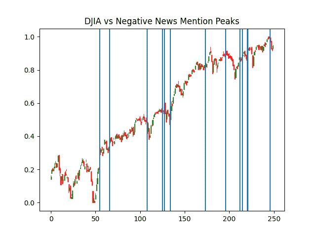

## 我们是如何利用播客中的负面新闻来预测市场的？

我们首先获取了每日播客的音频文件，并用 AssemblyAI 的自动语音到文本转录 API 转录它们。 [AssemblyAI](https://assemblyai.com/?undefined) 的语音转文本 API 还提供了[启用检测负面新闻的内容安全评级](https://docs.assemblyai.com/guides/content-safety-detection?undefined)的选项。我们在将音频文件传递到语音到文本 API 端点时使用了这个选项，以检测每个播客片段中的负面新闻。带有此选项的 AssemblyAI API 返回的响应如下所示:

```py
{
    "text": "Five terms. Speaker Joe Straus says he will not run for reelection state representative next year from San Antonio. And in late 2017, he announces that he'll step down before the 2019 session. From now on, far right. Republicans will have more sway. It's virtually the end of any sort of moderate strain of Republicanism in Texas. As one professor put it, the political center of the state collapsed today. Wow. That sounds like a real end of an era.",
    "labels": [
        {
            "confidence": 0.949425995349884,
            "label": "negative_news"
        }
    ],
    "timestamp": {
        "start": 665780,
        "end": 695530
    }
}
```

返回的每个段落都有一个标签，标签上有置信度得分和时间戳。

我们用等于音频文件中负面新闻比例的负面评级来标记每一集，例如，如果有 50 个文本块被返回，并且有 5 个负面新闻被提及(85%以上的置信度)，则音频文件的负面评级为 0.1。

## 主要发现

从图表来看，我们最负面的消息出现在黄金上涨和市场下跌的前 1-3 天。我们可以放大并通过下图确认这是真的。几乎每一条蓝线——划分一个有特别负面消息的日期——之后是 DJIA 和 NDAQ 的下降或一系列红色日，然后是 RGLD 的上升或一系列绿色日。

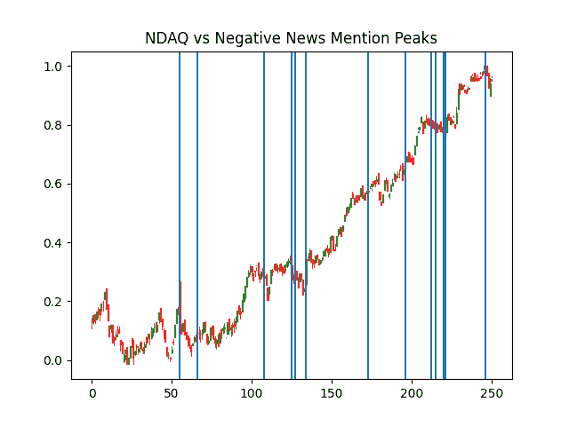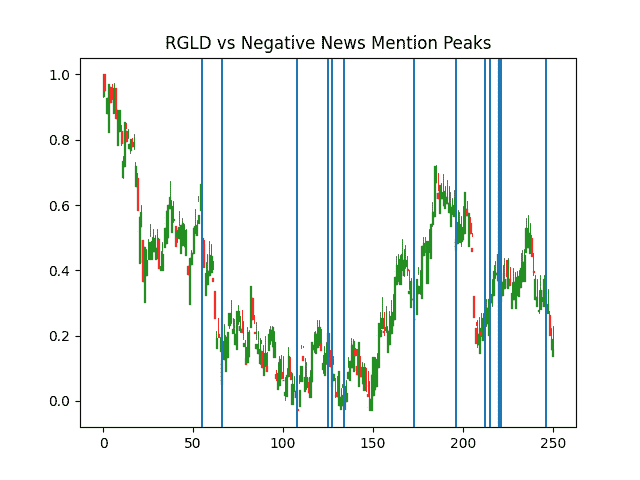

那么这对你实际上意味着什么呢？如果你听到非常负面的消息，也许你想在未来 1-3 天内买入，除非你关注黄金价格。如果您想自己探索这个问题，我们将深入研究代码，这样您就可以自己完成这个过程。

## 步伐

1.  创建一个 Python 网络爬虫来收集音频文件的链接
2.  用 AssemblyAI 的语音转文本 API 转录音频文件
3.  计算和编制负面新闻评级
4.  下载股票数据
5.  根据 DJIA、NDAQ 和 RGLD 绘制负面新闻评级图
6.  ？？？
7.  利润

## 创建一个 Python 网络爬虫来收集音频文件的链接

我们将使用 [Selenium](https://selenium-python.readthedocs.io/?undefined) 抓取收听笔记并获取每日播客的链接(在这个示例代码中，链接是 to Up First)。

要安装 Selenium，请运行:

```py
pip install selenium
```

我们将使用 Selenium 和 Chromedriver 来打开 Chrome 中的链接。然后，我们将寻找“加载更多”按钮，并点击它 36 次，以获取去年的所有播客。在我们扩展了页面之后，我们将通过点击“更多”按钮获得“下载”链接，并获得“下载”按钮链接的“href”值。我们将所有这些保存在一个. csv 文件中，并在以后使用它来转录我们的链接。

```py
"""
Downloads a specified number of podcasts from a specific podcast
using Selenium
"""
from selenium import webdriver
from selenium.webdriver.common.keys import Keys
from selenium.webdriver import ActionChains
from time import sleep
from random import randint

# download last 365 the daily podcasts
# download last 365 up first podcasts

chromedriver_path = './chromedriver'
driver = webdriver.Chrome(executable_path=chromedriver_path)
sleep(randint(1, 3))
driver.get('https://www.listennotes.com/podcasts/up-first-npr-e0zpMGZKNYd/#podcast')
sleep(randint(2, 3))

dl = 0
links = []
for i in range(37):
   actions = ActionChains(driver)
   load_more = driver.find_element_by_xpath("//button[contains(., 'Load more')]")
   actions.move_to_element(load_more).click().perform()
   sleep(randint(1, 3))
while dl < 366:
   more_button = driver.find_elements_by_link_text("MORE")
   for link in more_button:
       actions = ActionChains(driver)
       actions.move_to_element(link).click().perform()
       dl += 1
       sleep(randint(1, 3))

dlinks = driver.find_elements_by_css_selector("a[title*='Download audio file']")
for dlink in dlinks:
   links.append(dlink.get_attribute("href")[:-1]+'.mp3')

with open('upfirst_links.csv', 'w') as _file:
   for link in links:
       _file.write(link)
       _file.write(",")
```

完成后，您应该有一个类似如下的. csv 文件:

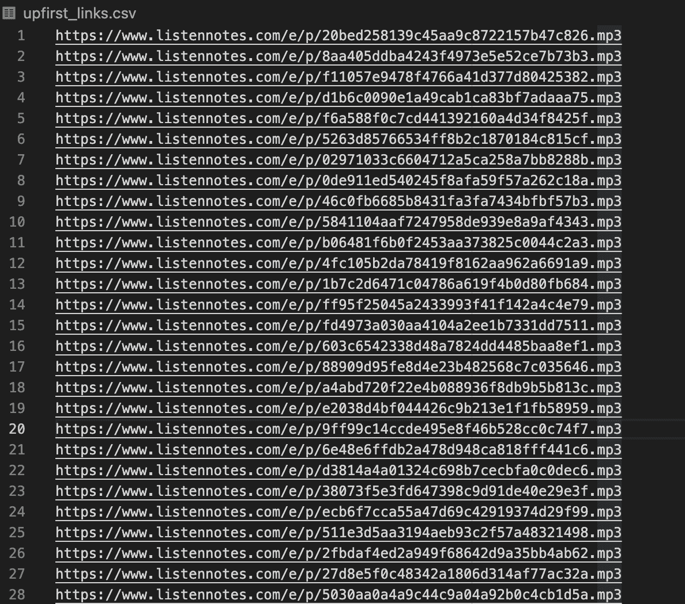

## 用 AssemblyAI 的语音转文本 API 转录音频文件

现在我们已经有了链接，我们将使用 AssemblyAI 的人工智能自动语音识别 API 端点，并为我们的每个播客获得内容安全评级。这里需要注意的是，我们正在通过运行大量的音频。我们在大约 700 个播客上运行人工智能转录，每个半小时，至少 300 小时的音频。一个人大概需要 13 天，甚至更长时间才能转录出来。我们将在一天内用 AssemblyAI 的自动语音转文本 API 来完成。我们需要注册一个 [AssemblyAI API key](https://assemblyai.com/?undefined) ，它将位于我在图片中画出的位置。

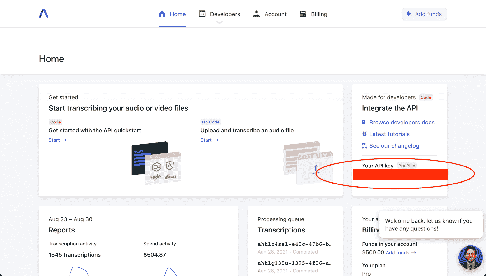

在我们得到 API 密匙后，我们将创建一个函数来转录代码。为此，我们将创建多个函数。首先，我们将创建一个函数，允许我们使用 AssemblyAI 的语音转文本 API 转录音频文件。我们需要脚本端点、授权头和一些常量来帮助我们运行程序——一个让我们知道脚本处理的状态，另一个帮助我们一次运行多个脚本。我们还将创建一些函数来轮询 AssemblyAI 语音转文本 API，并在抄本状态为完成时将抄本保存到一个文件中。

```py
import requests
from config import auth_key
import json
import os
import csv

transcript_endpoint = "https://api.assemblyai.com/v2/transcript"
headers = {
   "authorization": auth_key,
   "content-type": "application/json"
}
INCOMPLETE = 'Incomplete'
NUMBER = 20

# Parameters: audio_url - link to audio
# Returns: transcript_id - transcript id corresponding to AssemblyAI transcription id
# send a transcription request to the AssemblyAI transcript endpoint
# this one contains true for content safety so we can get negative news labels
def transcribe(audio_url):
   transcript_request = {
       'audio_url': audio_url,
       'content_safety': 'True'
   }
   transcript_response = requests.post(
       transcript_endpoint,
       json=transcript_request,
       headers=headers)
   transcript_id = transcript_response.json()['id']
   return transcript_id

# Parameters: transcript_id - transcript id corresponding to AssemblyAI transcription id
# Returns: transcript_id (same) or INCOMPLETE status
# polls the transcription endpoint of the id to see if the transcription is done
# will also return an exception if there is an error
def poll(transcript_id):
   polling_endpoint = transcript_endpoint + "/" + transcript_id
   print("Transcribing at", polling_endpoint)
   try:
       polling_response = requests.get(
           polling_endpoint,
           headers=headers)
       if polling_response.json()['status'] == 'completed':
           save_transcript(polling_response)
           return transcript_id
       else:
           return INCOMPLETE
   except Exception as err:
       print(f"Exception occured {err}")

# edit before running for each podcast
# Parameters: response - a response object from AssemblyAI
# saves the content safety labels returned from AssemblyAI to the folder
# of the podcast that we are currently processing
def save_transcript(response):
   transcript_id = response.json()['id']
   content_filename = transcript_id + '_content.json'
   with open('./upfirst_transcripts/' + content_filename, 'w') as f:
       f.write(json.dumps(response.json()['content_safety_labels']))
   print('Content safety saved to', content_filename)
```

既然我们已经创建了通过 AssemblyAI 的语音识别 API 来处理转录音频的函数，我们需要创建一些函数来处理运行如此多的文件。我们将创建一个函数，将文件附加到一个. csv 文件中，该文件跟踪我们已经检查并转录的链接，我们将创建一个函数，跟踪当前通过 AssemblyAI 的语音到文本 API 处理的转录 id。然后是剧本。

我们的脚本将打开一个包含播客音频文件链接的 csv 文件。它将检查我们是否已经为检查的链接创建了 csv，并检查当前运行的脚本 id 的 csv。如果选中链接的数量等于总链接的数量，我们就完成了。如果没有，我们从链接列表中删除选中的链接。

```py
# Parameters: link - the link to the audio file we have processed
# writes link as a new row to the csv
def append_file(link):
   with open('checked_links.csv', 'a') as _file:
       writer = csv.writer(_file, delimiter=',')
       writer.writerow([link])

# Parameters: transcript_ids - a list of AssemblyAI transcription ids
# saves the current batch of transcripts being processed
def write_transcripts(transcript_ids):
   with open('transcript_ids.csv', 'w') as _file:
       writer = csv.writer(_file, delimiter=',')
       for transcript_id in transcript_ids:
           writer.writerow([transcript_id])

# read the links we have for the podcast
with open('upfirst_links.csv', newline="") as _file:
   reader = csv.reader(_file)
   links = list(reader)
# read which links we have that have already been checked
if os.path.exists('checked_links.csv'):
   with open('checked_links.csv', newline="") as _file:
       reader = csv.reader(_file)
       checked_links = list(reader)
else:
   checked_links = []
# check if we have any existing files being transcribed
if os.path.exists('transcript_ids.csv'):
   with open('transcript_ids.csv', newline="") as _file:
       reader = csv.reader(_file)
       transcript_ids = list(reader)
else:
   transcript_ids = []

# check if we've already checked all the links
if len(checked_links) == len(links):
   print("Done")
   exit()
# remove items in checked_links from links
for checked in checked_links:
   links.remove(checked)
```

如果我们已经有了 AssemblyAI 的语音到文本转录 API 的一组转录 id，我们将轮询状态。我们将计算完成的文件数量，然后按顺序替换它们。当然，这不会总是保持时间顺序，但我们实际上可以通过轮询来做到这一点，在这种速率下，我们可以预期所有的音频都已经被转录。AssemblyAI 的语音到文本 AI 转录服务的转录时间可以安全地估计为音频文件长度的⅓。

```py
# this is a list of one element lists
# transcript_ids should just be the first NUMBER elements in links
if transcript_ids:
   poll_responses = [poll(transcript_id[0]) for transcript_id in transcript_ids]
   _completed_indices = []
   for index, res in enumerate(poll_responses):
       if res != INCOMPLETE:
           _completed_indices.append(index)
   # remove completed indices
   print(f"These are the completed indices {_completed_indices}")
   if _completed_indices:
       if len(_completed_indices) != NUMBER:
           transcript_ids = [id for index, id in enumerate(transcript_ids) if index not in _completed_indices]
           current_links = links[:NUMBER]
           processed_links = [link for index, link in enumerate(current_links) if index in _completed_indices]
       else:
           transcript_ids = []
           processed_links = links[:NUMBER]
       # add x new transcripts
       added_links = links[NUMBER:NUMBER+len(_completed_indices)]
       # add each processed link to checked links and write to csv
       for link in processed_links:
           append_file(link[0])
       # request new transcripts for added links
       for link in added_links:
           transcript_ids.append(transcribe(link[0]))
       write_transcripts(transcript_ids)
else:
   current_links = links[:NUMBER]
   for link in current_links:
       transcript_ids.append(transcribe(link[0]))
   write_transcripts(transcript_ids)
```

我们多次运行这个脚本，直到我们完成了文件中所有链接的转录。在我们转录完我们的链接后，我们应该会得到一个包含 JSON 文件的文件夹，这些文件包含如下所示的文本块。

```py
{
    "text": "Five terms. Speaker Joe Straus says he will not run for reelection state representative next year from San Antonio. And in late 2017, he announces that he'll step down before the 2019 session. From now on, far right. Republicans will have more sway. It's virtually the end of any sort of moderate strain of Republicanism in Texas. As one professor put it, the political center of the state collapsed today. Wow. That sounds like a real end of an era.",
    "labels": [
        {
            "confidence": 0.949425995349884,
            "label": "negative_news"
        }
    ],
    "timestamp": {
        "start": 665780,
        "end": 695530
    }
}
```

## 计算和编制负面新闻评级

在通过 AssemblyAI 的语音转文本 API 运行我们所有的音频文件并获得带有内容安全标签的 JSON 文件后，我们现在可以开始计算和编辑负面新闻评级。这部分有点复杂，不完全精确，所以扣好安全带。我犯了一个不幸的错误，在我最初下载播客时没有保存相应的日期，我认为我注定要失败，但后来我意识到我可以按照我下载它们的顺序倒填日期，从 2021 年 8 月 21 日开始。我们要做的第一件事是获得每个新闻播客的负面评价列表。这个列表将按时间顺序排列。我们将用来获得这些负面评价的函数是:

```py
def negativity_ratings(content_files):
   neg_ratings = []
   for filename in content_files:
       with open(filename, 'r') as _file:
           content = json.load(_file)
       negative_news_mentions = 0
       total = 0
       for result in content['results']:
           total += 1
           for entry in result['labels']:
               if entry['confidence'] > 0.85 and entry['label'] == 'negative_news':
                   negative_news_mentions+=1

       if total == 0:
           print(f"Error with {filename}")
           continue
       neg_ratings.append(negative_news_mentions/total)
   return neg_ratings
```

我们将创建三个负面评级，首先在每日运行，然后创建第三个，合并他们的评级。我们还将把我们的数据标准化到 0 到 1 之间，并把它变成新闻负面性的衡量标准，0 是最负面的日子，1 是最不负面的日子，而不是 0 是没有提到负面新闻，1 是完全负面的播客。

```py
daily_negs = negativity_ratings(daily_content_files)
upfirst_negs = negativity_ratings(upfirst_content_files)
congregate = [i + j for i, j in zip(upfirst_negs, daily_negs)]

_max = max(congregate)
normed_congregate = [1-float(e)/_max for e in congregate]
_max = max(upfirst_negs)
normed_upfirst = [1-float(e)/_max for e in upfirst_negs]
_max = max(daily_negs)
normed_daily = [1-float(e)/_max for e in daily_negs]
```

我们将使用一个返回 10 个最小索引的函数来查找与这三个列表中的最小值相对应的索引。然后我们会把这些指数结合起来，并把它们与道琼斯工业平均指数、纳斯达克指数和皇家黄金指数进行对比。

```py
def get_min_indices(normed_function):
   min_indices = []
   vals = sorted(set(normed_function))
   for i in range(10):
       index = normed_function.index(vals[i])
       min_indices.append(index)
   return min_indices
min_congregate_indices = sorted(get_min_indices(normed_congregate))
min_daily_indices = sorted(get_min_indices(normed_daily))
min_upfirst_indices = sorted(get_min_indices(normed_upfirst))
```

整理这些日子，我们发现它们是:

*   2021 年 8 月 13 日
*   2021 年 7 月 14、15 和 16 日
*   2021 年 7 月 8 日
*   2021 年 7 月 3 日
*   2021 年 6 月 1 日
*   2021 年 5 月 4 日
*   2021 年 3 月 18 日
*   2021 年 2 月 14 日
*   2021 年 1 月 25 日
*   2020 年 10 月 21 日

## 下载股票数据

我们可以用雅虎财经的 Python SDK 下载股票数据。您可以通过运行以下命令来安装 yfinance:

```py
pip install yfinance 
```

然后我们可以像这样下载去年的股市数据

```py
start = datetime.datetime(2020,8,21)
end = datetime.datetime(2021,8,21)

symbol = 'DJIA'
try:
   stock = yf.download(symbol, start=start, end=end, progress=False)
   stock['Name'] = symbol
   stock.to_csv(f'./stocks/{symbol}.csv', index=False)
except Exception as err:
   print(f"Error occurred {err}")
```

## 根据 DJIA、NDAQ 和 RGLD 绘制负面新闻评级图

我们将使用 Python 创建一些蜡烛图，这样我们就可以绘制我们的股票数据。为此，我们需要 pandas、matplotlib 和 mplfinance。要下载这些，您可以运行

```py
pip install matplotlib mplfinance
```

我们将读入文件并添加标签。

```py
import csv
import pandas as pd
def get_ohlc(filename):
   with open(filename, newline="") as _file:
       reader = csv.reader(_file)
       arr = pd.DataFrame(reader)
       ohlc = arr.loc[1:,0:3]

   ohlc.columns = ['Open', 'High', 'Low', 'Close']
   try:
       ohlc = ohlc.astype(float).dropna()
   except ValueError as err:
       print(err)
       return [], []
   dates = [i for i in range(0, len(ohlc))]
   ohlc.insert(0, 'Dates', dates)

   return ohlc
```

在我们绘制这个图之前，我们需要标准化我们的数据。

```py
fig, ax = plt.subplots()
ohlc = get_ohlc(entry)
# add 1 to make sure there's no "drop off" candlesticks that disappear
ohlc['Open'] -= min(ohlc['Open'])+1
ohlc['Open'] /= max(ohlc['Open'])
ohlc['Close'] -= min(ohlc['Close'])+1
ohlc['Close'] /= max(ohlc['Close'])
ohlc['High'] -= min(ohlc['High'])+1
ohlc['High'] /= max(ohlc['High'])
ohlc['Low'] -= min(ohlc['Low'])+1
ohlc['Low'] /= max(ohlc['Low'])
candlestick_ohlc(ax, ohlc.values, width=0.6, colorup='green', colordown='red', alpha=0.8)
```

现在我们回到我们确定的每天最消极的日期，首先是我们用 AssemblyAI 的语音转文本 API 转录的播客，并把它们绘制成垂直线，像这样

```py
for i in z: plt.axvline(i)
```

然后我们应该会看到类似下图的图表。

### 如何阅读这些图表

这些蜡烛图放大了特定负面新闻的日期。y 轴的标度从 0 到 1，因为 a)将一组非负数归一化到这个标度是一种形状保持变换，b)如果我们愿意，我们可以根据这个标度绘制播客中负面新闻的频率，并查看它如何以更绝对的方式排列。我选择不包括这些图表，因为它们比我包括的那些更难阅读。负面新闻峰值用蓝色竖线标出。

让我们拉近镜头，审视那些围绕着我们特别负面的新闻的日子。正如我之前所说的，看起来黄金价格与负面消息峰值负相关，价格会在随后几天上涨，看起来 T2 和 DJIA 与负面消息峰值直接相关，价格会在随后几天下跌。

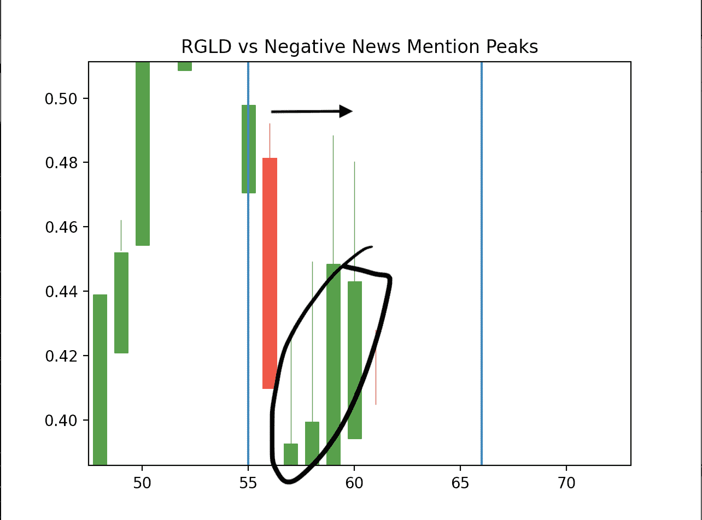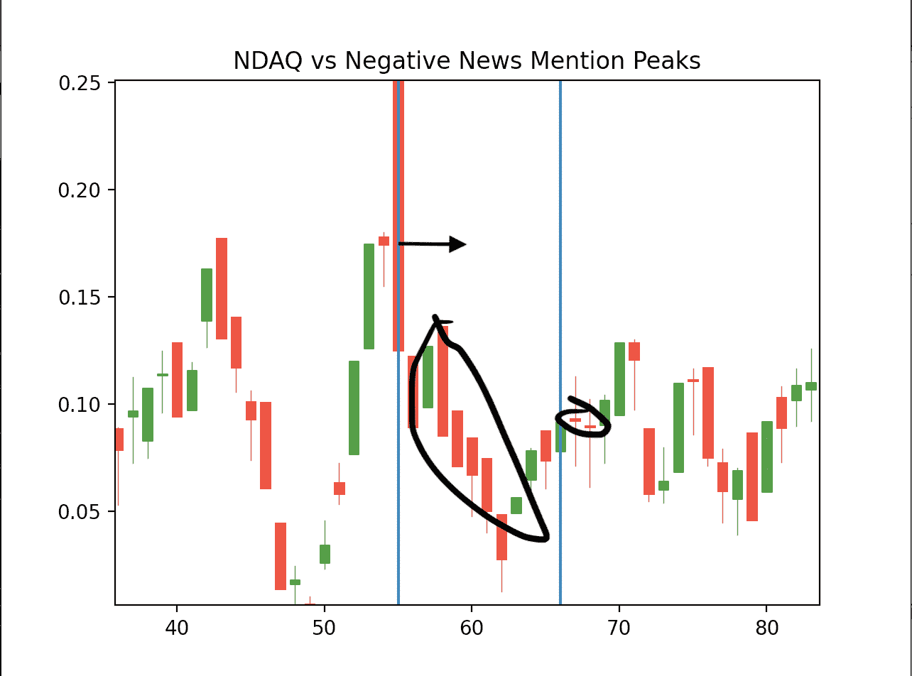

在第一张图中，我们看到黄金价格在负面消息峰值后一天大幅上涨，第二天又突然下跌。我们还可以看到，纳斯达克指数在随后的几天里大幅下跌。DJIA 没有反映太多的下降，所以我没有包括图表。这是谷歌面临反垄断问题和全球抗议的时候。

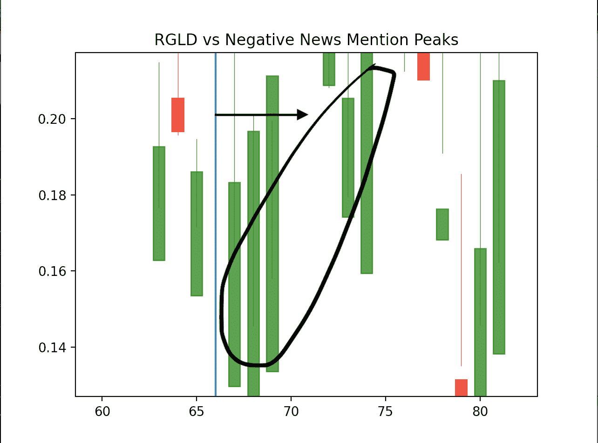

这张图表向我们展示了在这个负面消息日之后，黄金价格的又一次上涨。我已经在上面的图表中包括了纳斯达克的这个日期，DJIA 再次显示没有剧烈的变化。我想这是在选举前后。

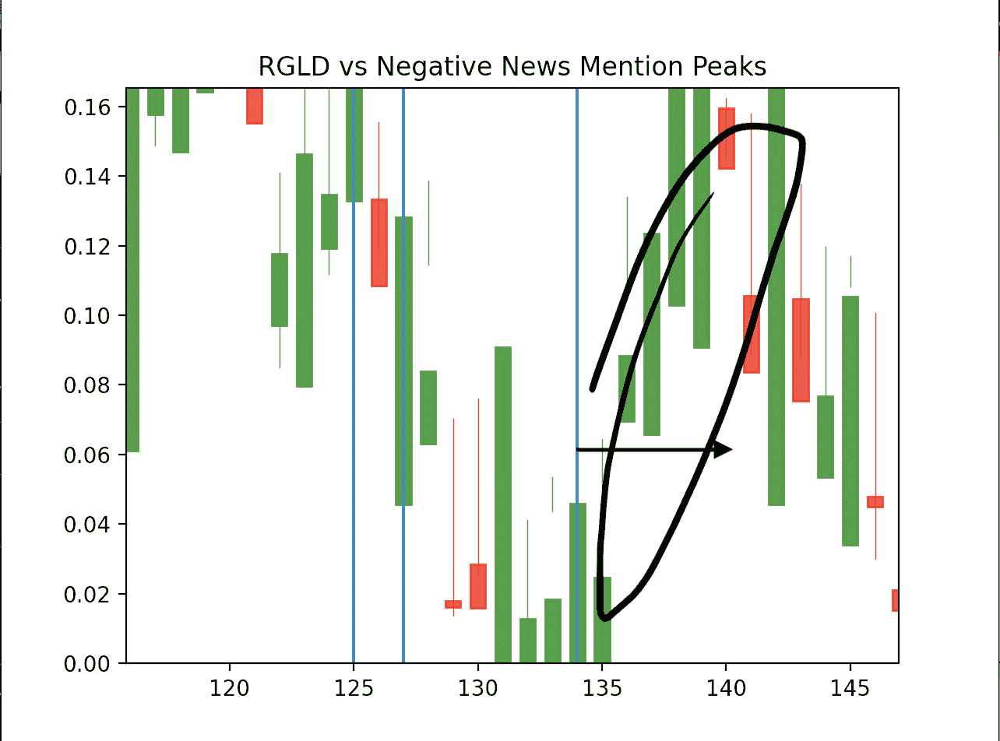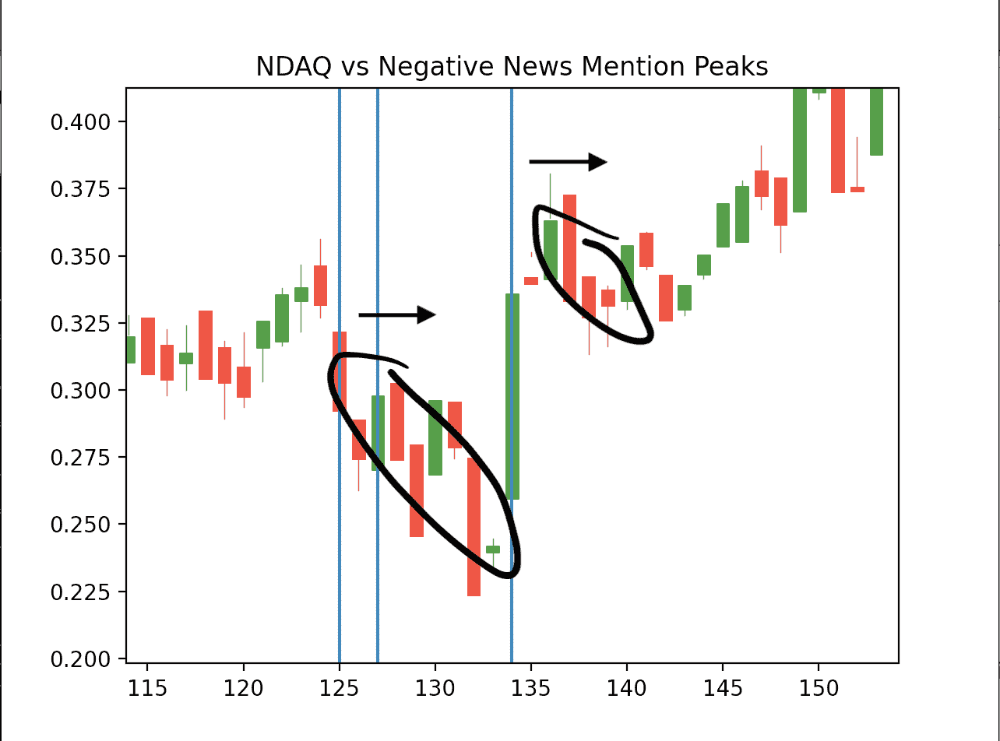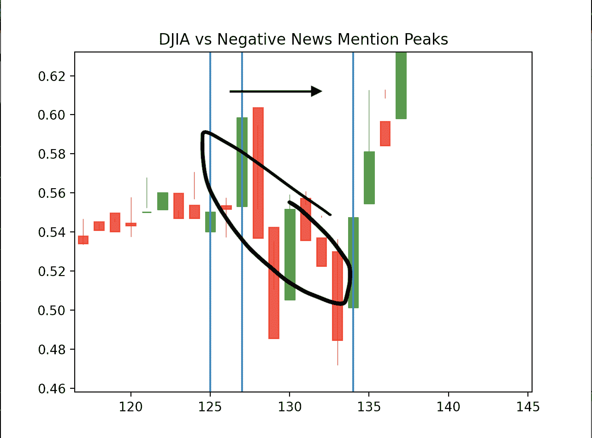

在这里，我们看到黄金价格在另一个负面消息高峰后的几天里出现了相当大的上涨。这一次，我们可以看到 DJIA 和纳斯达克都做出了回应，在这一系列负面消息之后的几天里，这两个指数的价格都出现了下跌。我相信这些新闻点是在德克萨斯州发生疫苗争议和针对亚裔美国人的种族暴力上升的时候。

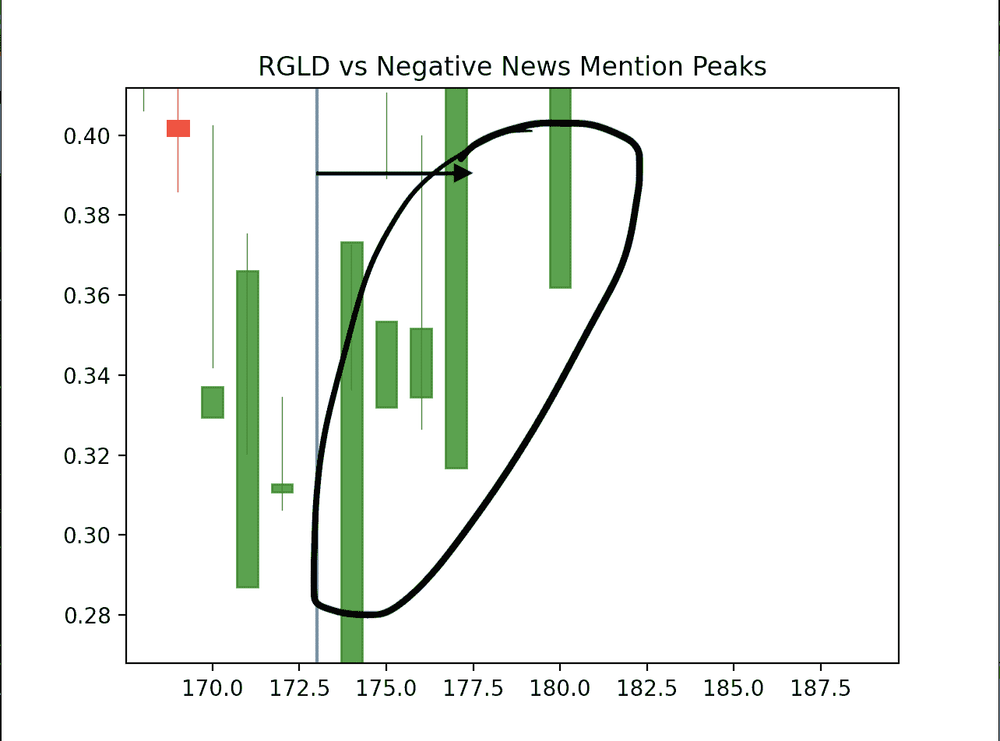

在又一个负面消息高峰之后，黄金价格又一次上涨。纳斯达克和 DJIA 没有对这一负面消息做出强烈反应。大约在那个时候，美国发生了许多针对种族暴力的抗议活动。

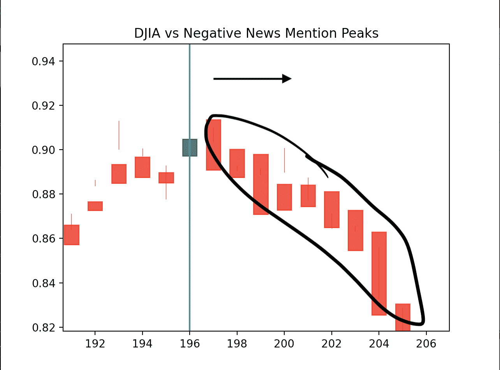

黄金价格在负面消息后的上涨大约是在 COVID delta 变体变得更加普遍的时候。我们可以看到，DJIA 和纳斯达克在接下来的几天里也对这一消息作出了下跌的反应，DJIA 在此之后也确实下跌了。

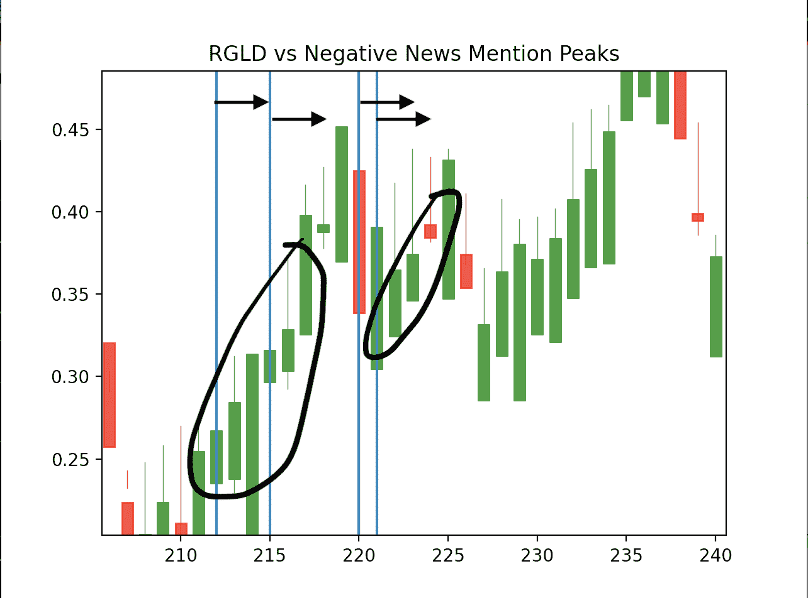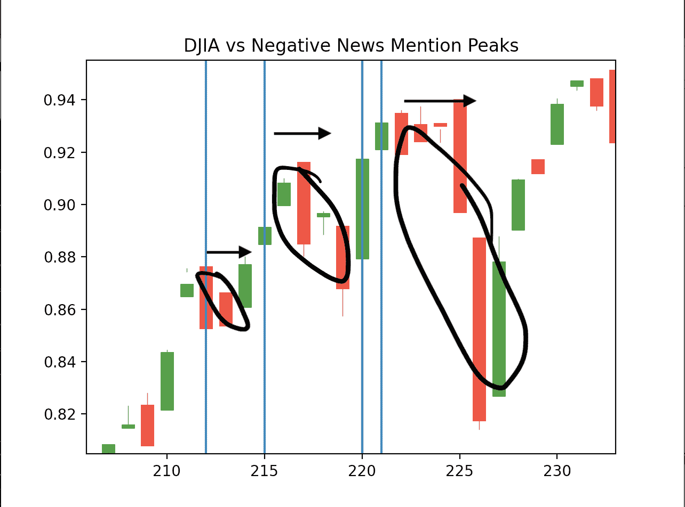

最后一张图显示了黄金价格在 2021 年 7 月下旬左右的上涨。我们可以看到纳斯达克和 DJIA 都对此做出了反应，并在随后的几天下跌。这是围绕着西部的野火和对气候变化的更多关注。我不相信购买黄金会保护任何人免受气候变化的影响，但作为对负面消息的恐惧反应，大宗商品价格上涨总是有道理的。

### 结论

可以用播客预测股市吗？大多数时候不会，但在有特别坏消息的日子里，你可以期待在接下来的 1-3 天里看到股票市场的下跌。特别坏是多坏？我随意选择了过去一年中最糟糕的 10 天，并将其中的两组组合起来，发现这些日子确实预测了下跌。通过 AssemblyAI 在语音转文本 API 上的内容安全选项，他们的负面评级都超过了 0.7。想了解更多关于语音转文本和其他酷教程的信息，请在 Twitter 上关注我们 [@assemblyai](https://twitter.com/AssemblyAI?undefined) 和[@于坚 _ 唐](https://twitter.com/yujian_tang?undefined)！