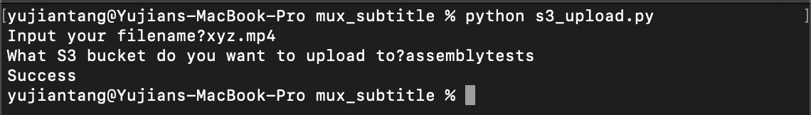
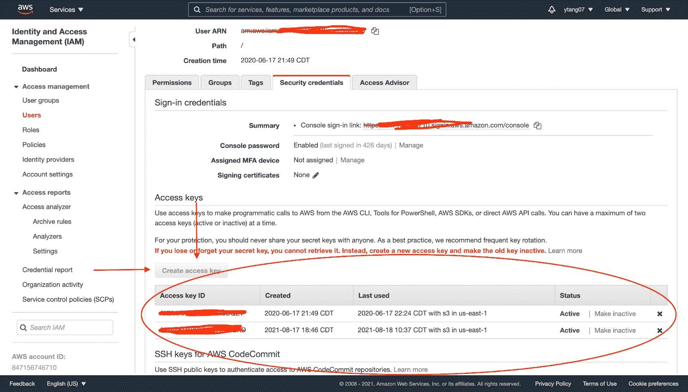
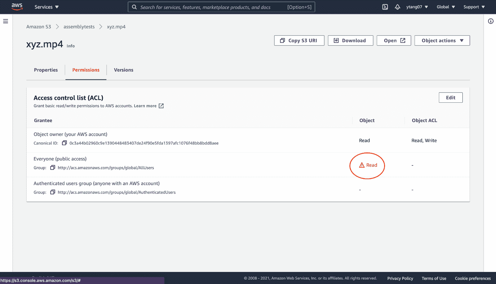
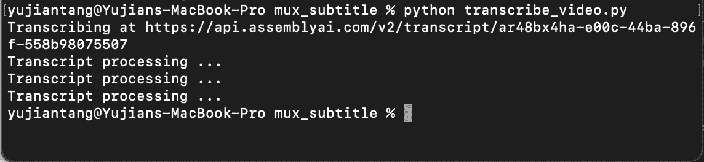
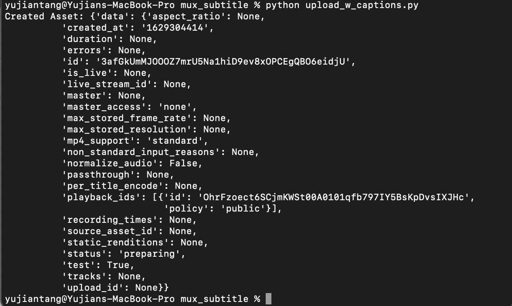
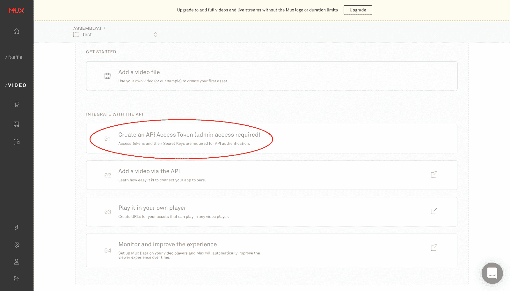
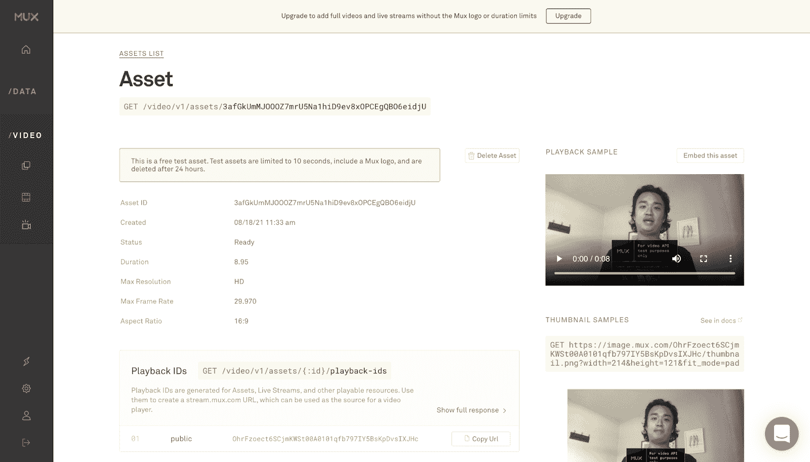
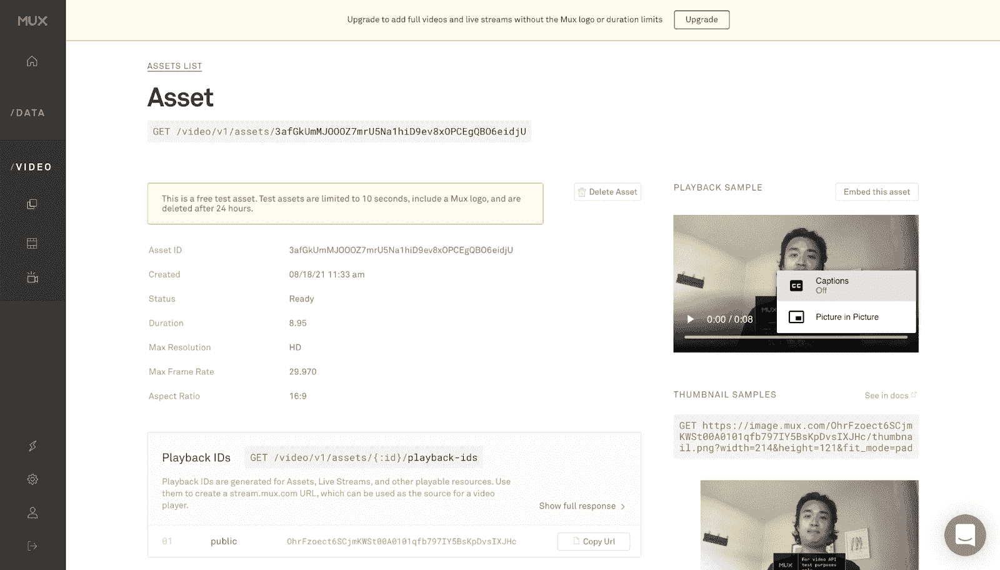

# 如何用 Python 给 Mux 视频添加字幕

> 原文：<https://www.assemblyai.com/blog/how-to-add-subtitles-to-your-mux-videos-with-python/>

## 概观

想简化为 Mux 视频添加字幕的过程吗？在本教程中，我们将介绍如何使用 [AssemblyAI 的语音转文本 API](https://www.assemblyai.com) 以编程方式创建字幕轨道，并使用 [Mux 的视频 API](https://docs.mux.com/api-reference/video?undefined) 将其添加到 Mux 视频中。

AssemblyAI 是一个用于快速、准确、自动转录视频文件的 API。使用 AssemblyAI API，您可以在几秒钟内完全自动地为您的视频快速生成`.srt`或`.vtt`格式的字幕文档。

视频托管提供商有很多选择；对于本教程，我们使用 S3 作为视频和`.srt`文件的存储服务。你可以在 [GitHub](https://github.com/ytang07/mux_subtitles) 上找到本教程的完整源代码。

[https://www.youtube.com/embed/V_8yZMNaBjo?enablejsapi=1&origin=https://www.assemblyai.com](https://www.youtube.com/embed/V_8yZMNaBjo?enablejsapi=1&origin=https://www.assemblyai.com)

## 先决条件

要完成本教程，您需要

*   带有语音的 mp4 文件
*   AWS 帐户
*   用于 Mux 和 AWS 的 Python 库

假设你已经有一个 mp4 视频，首先我们必须下载 Mux 和 AWS 的库。您可以安装这些

```py
pip install boto3
pip install git+https://github.com/muxinc/mux-python.git
```

## 步伐

在我们为 AWS 和 Mux Video API 安装了库之后，我们可以自动为 Mux Video 添加字幕。我们需要依次完成以下步骤

1.  上传 mp4 文件到 S3
2.  使用 AssemblyAI 的自动语音到文本自动转录来转录视频和下载字幕文件
3.  上传字幕文件到 S3
4.  使用 Mux 的视频 API 将视频上传到 Mux

## 上传到 S3

首先，我们将通过 boto 3(AWS Python SDK)将文件上传到 S3。当我们完成这部分的脚本时，这就是我们完成这个脚本后的样子。



Upload your mp4 to S3

首先，我们将从 AWS 导入我们的访问密钥和秘密密钥，您可以通过 IAM 控制台获得，如图所示。如果您没有存储访问密钥和秘密密钥，您必须单击创建访问密钥并保存您的信息。



Where to find your AWS security keys

我把我的放在 AWS 配置文件中，但是您也可以使用环境变量。对于这个脚本，我们将要求文件名， ****确保文件与脚本**** 在同一个文件夹中，以及我们想要上传到的 S3 桶。在获得我们上传的文件的位置和我们想要上传到的 bucket 之后，我们将使用 boto3 创建一个 s3 客户端。最后，我们将上传我们的对象和它的对象访问控制列表，这将使它公开可读。

```py
import boto3
import logging
from botocore.exceptions import ClientError
from aws_config import access_key, secret_key

filename = input("Input your filename?")
bucket = input("What S3 bucket do you want to upload to?")

s3_client = boto3.client('s3',
   aws_access_key_id = access_key,
   aws_secret_access_key = secret_key)

try:
   response = s3_client.upload_file(filename, bucket, filename)
   s3_client.put_object_acl(ACL='public-read', Bucket=bucket, Key=filename)
except ClientError as e:
   logging.error(e)
   print("Error")

print("Success")
```

‍After 上传文件后，我们应该导航到 S3 控制台，检查我们的对象是否是公共可读的。单击 mp4 对象的权限，确保它授予公共读取权限，如图所示。



Make sure your object is publicly readable

## 使用 AssemblyAI 的自动语音转文本 API 来转录视频

现在我们已经上传了我们的文件，是时候通过 AssemblyAI 的语音转文本 API 为它获取字幕了。如果你还没有 AssemblyAI 账户，注册使用他们的免费[语音到文本 API](https://www.assemblyai.com) 。你需要得到一个 API 密匙，它应该在你的控制台中，如图所示。


How to find your AssemblyAI speech to text API token

在我们最近的帖子中，例如[25 行以下的 Python 语音识别](https://www.assemblyai.com/blog/python-speech-recognition-in-under-25-lines-of-code)和[如何获得 YouTube 视频的副本](https://www.assemblyai.com/blog/how-to-get-the-transcript-of-a-youtube-video)，我们已经使用 AssemblyAI 的自动语音识别(ASR)对我们上传的本地文件进行了转录。这一次，我们将传递一个 URL 来转录。当我们完成这个脚本时，它应该看起来像下面的图片。



Use AssemblyAI's automatic speech to text API to turn your mp4 into a subtitle file with timestamps

首先，我们将创建一个请求，发送到 AssemblyAI 的 STT 自动转录端点。一旦我们发出请求，我们将定期轮询我们的端点，我将每隔 5 秒轮询一次。然后，我们将向 AssemblyAI 的语音转文本 API 自动创建的字幕端点发出请求，以获取。srt 和。vtt 文件。您应该将 video_url 更改为上传视频的位置。

```py
import requests
from mux_config import auth_key
from time import sleep

video_url = "<link to your video>"
transcript_endpoint = "https://api.assemblyai.com/v2/transcript"
headers = {
   "authorization": auth_key,
   "content-type": "application/json"
}
transcript_request = {
   "audio_url": video_url
}

transcript_response = requests.post(transcript_endpoint, json=transcript_request, headers=headers)
transcript_id = transcript_response.json()['id']
polling_endpoint = transcript_endpoint + "/" + transcript_id
print("Transcribing at", polling_endpoint)
polling_response = requests.get(polling_endpoint, headers=headers)
while polling_response.json()['status'] != 'completed':
   sleep(5)
   print("Transcript processing ...")
   try:
       polling_response = requests.get(polling_endpoint, headers=headers)
   except:
       print("Expected to wait 30 percent of the length of your video")
       print("After wait time is up, call poll with id", transcript_id)

srt_endpoint = polling_endpoint + "/srt"
srt_response = requests.get(srt_endpoint, headers=headers)
# print(srt_response.text)
with open("text_track.srt", "w") as _file:
   _file.write(srt_response.text)

vtt_endpoint = polling_endpoint + "/vtt"
vtt_response = requests.get(vtt_endpoint, headers=headers)
# print(vtt_response.text)
with open("text_track.vtt", "w") as _file:
   _file.write(vtt_response.text)
```

## 上传字幕文件到 S3

我们可以像上传视频一样上传字幕文件到 S3。


Upload your text files to S3

我上传了。vtt 和。我们通过 AssemblyAI 的 ASR 转录下载的 srt 文件。你可以下载或上传任何一个文件，Mux 接受两种格式，唯一的区别是。srt 被标记为隐藏字幕，而。vtt 不是。

## 使用 Mux 的视频 API 将视频上传到 Mux

现在我们已经使用 AssemblyAI 的自动语音识别端点转录了我们的视频，以免费在线转录音频到文本并获取字幕文件，我们可以将我们的视频和字幕上传到 Mux。当我们完成并运行这个脚本时，我们应该会看到如下所示的输出。



Upload your mp4 and subtitles from AssemblyAI to Mux

首先，我们必须创建一个资产 API 客户端，Python 将使用它来与 Mux 交互，而不是发送直接请求。我们需要来自 Mux 的令牌 id 和秘密 id，并将它们保存为配置用户名和密码。您需要在新的 Mux 环境中单击“Create an API key”来获得如图所示的内容。我将凭证保存在 mux_config.py 文件中，然后导入它们。您也可以使用环境变量。



Get your Mux credentials

创建资产 API 对象后，我们需要创建一个对象来创建跟踪请求。我们需要向这个对象传递我们的文本轨道的 url、轨道类型(文本)、文本类型(字幕)、语言(无论你的语言是什么，我们将使用 en-US)、文件是否应该被标记为隐藏字幕(对。srt 文件，对于。vtt 文件)和轨道的名称。在代码中，我展示了如何创建？vtt 或。srt 文件请求。一旦我们为从 AssemblyAI 的语音转文本 API 获得的字幕文件创建了请求，我们就必须为 Mux 创建一些输入设置。我们的输入设置将是一个列表，其中包含我们的视频和我们的创建跟踪请求对象的 url。

然后我们将创建一个资产请求发送到 Mux 的视频 API 来添加我们的字幕文件。我包括了公共播放的选项，并确保 mp4 支持设置为标准。一旦我们创建了这个请求，我们就使用我们的资产 API 对象向 Mux 发送一个请求。

```py
import mux_python
from mux_config import token_id, secret_id

configuration = mux_python.Configuration()

configuration.username = token_id
configuration.password = secret_id

assets_api = mux_python.AssetsApi(mux_python.ApiClient(configuration))

add_captions = mux_python.CreateTrackRequest(url="<link to your .srt file>", type="text", text_type="subtitles", language_code="en-US", closed_captions=True, name="English")
# add_captions = mux_python.CreateTrackRequest(url="<link to your .vtt file>", type="text", text_type="subtitles", language_code="en-US", closed_captions=False, name="English")
input_settings = [mux_python.InputSettings(url='<link to your video>'), add_captions]
create_asset_request = mux_python.CreateAssetRequest(input=input_settings, playback_policy=[mux_python.PlaybackPolicy.PUBLIC],mp4_support='standard')
create_asset_response = assets_api.create_asset(create_asset_request)
print("Created Asset: " + str(create_asset_response))
assert create_asset_response != None
assert create_asset_response.data.id != None
```

一旦我们的资产被创建，我们可以去 Mux 并检查我们的资产。



Mux video asset

我们可以点击视频播放器上的三个点，然后看到一个“隐藏字幕”的标志，如果我们点击它，我们应该能够看到我们通过 AssemblyAI 的自动 AI 转录功能转录的字幕



Turn on subtitles

打开字幕并观看视频后，您应该会在页面顶部看到链接的 YouTube 视频中的字幕。

## 包扎

在本教程中，我们讨论了如何使用 AssemblyAI 的语音转文本 API 来进行自动语音识别，从而为 Mux 视频创建字幕。我们创建了三个脚本，一个将我们的对象上传到 AWS，另一个将云语音转换为 mp4 文件的文本，另一个将我们的 mp4 和字幕文本轨道上传到 Mux。

更多关于如何免费在线进行语音转文本的信息，请查看 [AssemblyAI](https://www.assemblyai.com) ，在 Twitter 上关注我们 [@assemblyai](https://twitter.com/AssemblyAI?undefined) ，并关注作者[@于坚 _ 唐](https://twitter.com/yujian_tang?undefined)