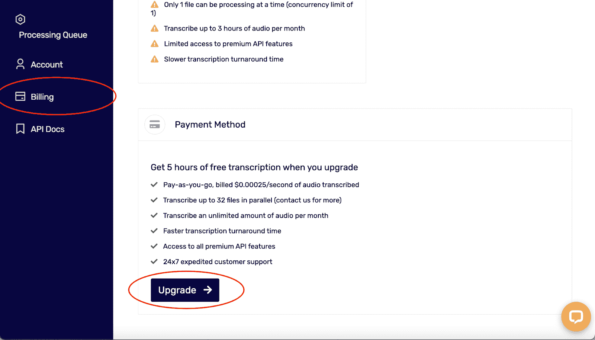

# 用 Python 实现实时语音识别

> 原文：<https://www.assemblyai.com/blog/real-time-speech-recognition-with-python/>

[https://www.youtube.com/embed/TQcQgU5iECM?enablejsapi=1&origin=https://www.assemblyai.com](https://www.youtube.com/embed/TQcQgU5iECM?enablejsapi=1&origin=https://www.assemblyai.com)

## 概观

在本教程中，我们将使用 AssemblyAI 的实时转录功能从麦克风实时转录。请注意，这是*付费*功能。我们将使用 Python PyAudio 库来传输来自麦克风的声音。我们将使用 python websockets 库来连接 AssemblyAI 的流式 websocket 端点。

首先我们将讨论如何安装 Python PyAudio 和 websockets。然后，我们将介绍如何使用 PyAudio、websockets 和 asyncio 来实时转录我们的麦克风音频。

## 先决条件

*   安装 PyAudio
*   安装 Websockets

## 安装 PyAudio

#### 如何在 Mac 上安装 PyAudio

您可能会收到无法找到 portaudio 的错误消息。您可以使用安装 portaudio

```py
brew install portaudio
```

安装 portaudio 后，您应该能够像这样安装 PyAudio:

```py
pip install pyaudio
```

#### 如何在 Windows 上安装 PyAudio

您可能会得到一个关于 Microsoft C++的错误消息，在这种情况下，您需要在网上找到正确的 wheel 并安装该 wheel，安装方式同上，但将“pyaudio”替换为您的。whl 文件。

## 安装网络套接字

我们可以用

```py
pip install websockets
```

## 获取您的 AssemblyAI API 密钥

安装 pyaudio 和 webhooks 后，我们需要从 Assembly 中获取 API 密钥。你会在控制台上找到你的钥匙，我在下面做了标记。


如果你想学习本教程，并且你有一个免费帐户，你可以通过点击下面的升级按钮进行升级。



## 步骤:

1.  用 Python PyAudio 打开一个流
2.  创建一个异步函数来发送和接收数据
3.  使用 async 循环运行(1 分钟后自动超时)
4.  在终端中运行它并说话

## 用 Python PyAudio 打开一个流

我们要做的第一件事是使用我们刚刚安装的 Python 的 PyAudio 库打开一个流。为此，我们需要指定每个缓冲区的帧数、格式、通道数和采样率。我们的自定义流将使用每个缓冲区 3200 帧、PyAudio 的 16 位格式、1 个通道和 16000 Hz 的采样率。

```py
import pyaudio

FRAMES_PER_BUFFER = 3200
FORMAT = pyaudio.paInt16
CHANNELS = 1
RATE = 16000
p = pyaudio.PyAudio()

# starts recording
stream = p.open(
   format=FORMAT,
   channels=CHANNELS,
   rate=RATE,
   input=True,
   frames_per_buffer=FRAMES_PER_BUFFER
)
```

## 创建一个异步函数来发送和接收数据

现在我们已经打开了 Python PyAudio 流，我们可以将音频从麦克风传输到我们的程序，我们需要将它连接到 AssemblyAI 实时 websocket 来转录它。我们将从创建一个异步函数开始，该函数将同时调度发送和接收数据。为此，我们需要在函数内部打开一个 websocket 连接，并创建另外两个使用 open websocket 的异步函数。我们将使用 Python asyncio 的 gather 函数同时等待发送和接收函数的执行。

我们的异步发送函数将不断尝试以我们打开 Python PyAudio 流时的每个缓冲区帧数的速率传输数据，将该数据转换为 base64，解码为字符串格式，并在请求中将格式化的数据发送到 AssemblyAI websocket 端点(断开连接的情况除外)。我们的异步接收函数将不断尝试打印出从端点接收的数据(如果有的话)。然后我们使用`asyncio.gather`来等待两个函数并发执行。

```py
import websockets
import asyncio
import base64
import json
from configure import auth_key

# the AssemblyAI endpoint we're going to hit
URL = "wss://api.assemblyai.com/v2/realtime/ws?sample_rate=16000"

async def send_receive():
   print(f'Connecting websocket to url ${URL}')
   async with websockets.connect(
       URL,
       extra_headers=(("Authorization", auth_key),),
       ping_interval=5,
       ping_timeout=20
   ) as _ws:
       await asyncio.sleep(0.1)
       print("Receiving SessionBegins ...")
       session_begins = await _ws.recv()
       print(session_begins)
       print("Sending messages ...")
       async def send():
           while True:
               try:
                   data = stream.read(FRAMES_PER_BUFFER)
                   data = base64.b64encode(data).decode("utf-8")
                   json_data = json.dumps({"audio_data":str(data)})
                   await _ws.send(json_data)
               except websockets.exceptions.ConnectionClosedError as e:
                   print(e)
                   assert e.code == 4008
                   break
               except Exception as e:
                   assert False, "Not a websocket 4008 error"
               await asyncio.sleep(0.01)

           return True

       async def receive():
           while True:
               try:
                   result_str = await _ws.recv()
                   print(json.loads(result_str)['text'])
               except websockets.exceptions.ConnectionClosedError as e:
                   print(e)
                   assert e.code == 4008
                   break
               except Exception as e:
                   assert False, "Not a websocket 4008 error"

       send_result, receive_result = await asyncio.gather(send(), receive())
```

## 使用 async 循环运行(1 分钟后自动超时)

我们已经完成了函数的编写，该函数将从我们的 PyAudio 流向 AssemblyAI websocket 异步发送和接收数据。现在我们将使用 asyncio 在一个循环中运行它，直到我们使用下面的代码行得到一个超时或错误。

```py
asyncio.run(send_receive())
```

## 在终端中运行它并说话

这就是我们需要做的所有编码。现在，我们打开终端，运行我们的程序。应该和本文开头链接的视频很像！

准备好自己尝试了吗？

获得免费的 API 令牌！！

[Get It Now](Get a free API Token!!)