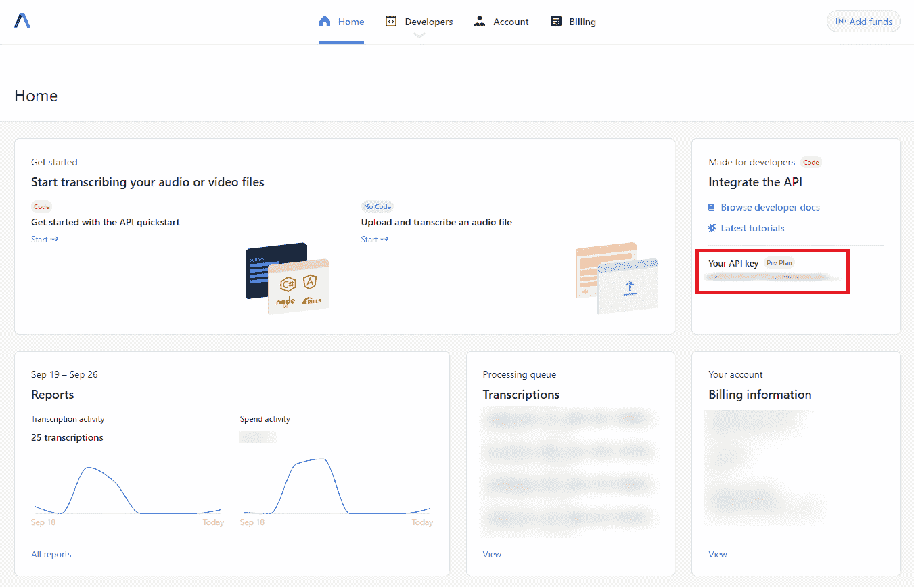
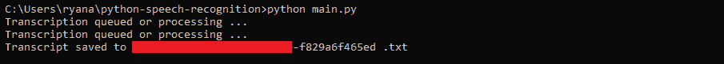

# 30 行代码的 Python 语音识别

> 原文：<https://www.assemblyai.com/blog/python-speech-recognition-in-30-lines-of-code/>

如今，在 Python 中有许多方法来执行语音识别。开源库和框架，如 [Kaldi](https://www.assemblyai.com/blog/kaldi-speech-recognition-for-beginners-a-simple-tutorial/) 、 [ESPNet](https://www.assemblyai.com/blog/getting-started-with-espnet/) 、DeepSpeech 和 [Whisper](https://www.assemblyai.com/blog/how-to-run-openais-whisper-speech-recognition-model/) 为开发人员提供了实现语音到文本功能的方法，而不必构建、训练和维护复杂的机器学习模型。

然而，这些开源工具可能需要大量的设置和计算，并且精确度各不相同。此外，实现更丰富的功能，如扬声器二进制化，需要将各种不同的工具缝合在一起。出于这些原因，许多开发人员选择使用语音到文本 API，它提供即插即用的语音到文本功能。在本教程中，我们将学习如何使用 AssemblyAI API 来转录只有 30 行 Python 代码的音频文件。

## 先决条件

在我们开始编码之前，我们需要得到一个 AssemblyAI API 密匙——你可以在这里免费得到一个。您的 API 密钥对您的帐户是唯一标识的，并告诉 AssemblyAI 的服务您被授权使用它们。

安全说明

任何使用你的 API 密匙的人都会以你的身份出现来组装 AI 的服务，所以**确保不要共享你的 API 密匙**。特别是，不要将它的值硬编码或意外上传到 GitHub。

AssemblyAI 仪表板为您提供了帐户的快照。您可以通过点击屏幕右侧的 API 密匙(下面红色方框中)来复制它。



接下来，我们需要这个教程的`[requests](https://requests.readthedocs.io/en/latest/)`库，所以如果你还没有的话，现在就用下面的命令安装它。

```py
pip install requests
```

## Python 语音识别代码

现在我们可以看看如何使用 Python 只用 25 行代码来执行语音识别。您可以使用下面的命令下载[项目库](https://github.com/AssemblyAI-Examples/python-speech-recognition):

```py
git clone https://github.com/AssemblyAI-Examples/python-speech-recognition.git
```

`main.py`文件包含了本教程所需的所有代码——现在让我们来看看。首先，我们导入我们需要的两个库- `requests`和`time`。

```py
import requests
import time
```

接下来，我们定义两个端点。第一个是`UPLOAD_ENDPOINT`，我们将用它上传一个音频文件到 AssemblyAI。第二个是`TRANSCRIPTION_ENDPOINT`，我们将使用它向 AssemblyAI 请求转录。

```py
UPLOAD_ENDPOINT = "https://api.assemblyai.com/v2/upload"
TRANSCRIPTION_ENDPOINT = "https://api.assemblyai.com/v2/transcript"
```

现在我们可以定义两个需要在 HTTP 请求中使用的变量——一个`headers`字典和您的`api_key`“解锁”AssemblyAI 的服务。我们在这里硬编码 API 密匙，因为这只是一个例子，但是当你从测试转移到真正的应用程序时，确保使用 **[环境变量](https://www.nylas.com/blog/making-use-of-environment-variables-in-python/)** ，以防止意外共享你的 API 密匙。

```py
api_key = "<YOUR-API-KEY-HERE>"
headers = {"authorization": api_key, "content-type": "application/json"}
```

接下来，我们定义`read_file`，它返回一个我们用来读取音频文件的生成器。值`5242880`是用于将待读取的数据分割成小块的块大小。

```py
def read_file(filename):
   with open(filename, 'rb') as _file:
       while True:
           data = _file.read(5242880)
           if not data:
               break
           yield data
```

现在我们将使用 [POST](https://developer.mozilla.org/en-US/docs/Web/HTTP/Methods/POST) 请求上传我们的音频文件到 AssemblyAI。这里我们使用项目存储库中的样本音频文件`audio.wav`，但是您可以用您想要转录的任何文件的文件路径替换`'audio.wav'`字符串。从请求的响应中，我们提取可以访问上传音频的 URL，并将其保存到一个名为`audio_url`的变量中。

```py
upload_response = requests.post(UPLOAD_ENDPOINT, headers=headers, data=read_file('audio.wav'))
audio_url = upload_response.json()["upload_url"]
```

现在我们准备向 AssemblyAI 申请一份抄本！我们执行另一个 POST 请求，将刚刚收到的上传 URL 放入一个字典中，该字典作为 POST 请求的 JSON 传入。从响应中，我们将脚本 ID 保存到一个名为`_id`的变量中。

```py
transcript_request = {'audio_url': audio_url}
transcript_response = requests.post(TRANSCRIPTION_ENDPOINT, json=transcript_request, headers=headers)
_id = transcript_response.json()["id"]
```

最后，我们用轮询端点反复探测转录的状态，一旦完成就将转录保存到一个`.txt`文件中。

```py
while True:
    polling_response = requests.get(TRANSCRIPTION_ENDPOINT + "/" + _id, headers=headers)

    if polling_response.json()['status'] == 'completed':
       with open(f'{_id}.txt', 'w') as f:
           f.write(polling_response.json()['text'])
       print('Transcript saved to', _id, '.txt')
       break
    elif polling_response.json()['status'] == 'error':
        raise Exception("Transcription failed. Make sure a valid API key has been used.")
    else:
       print("Transcription queued or processing ...")
    time.sleep(5)
```

更详细地说，我们首先请求更新的转录信息，将响应保存在`polling_response`中。然后，我们检查响应中的`'status'`。如果状态是`'completed'`，我们将脚本保存到一个`.txt`文件，并退出我们的`while`循环来终止程序。

如果`'status'`是`'error'`，我们抛出一个异常，让用户知道转录失败了。否则，转录要么排队，要么正在处理，所以我们在终端中指示，然后等待 5 秒钟再重复。

代码到此为止！要获得您的转录，在项目目录中打开一个终端并简单地执行

```py
python main.py
```

终端中的结果将如下所示:



保存的抄本可以在与`main.py`相同的文件夹中找到。我们提供了提交存储库附带的`audio.wav`文件产生的示例输出抄本`transcript.txt`。

```py
Four score and seven years ago our fathers brought forth on this continent a new nation conceived in liberty and dedicated to the proposition that all men are created equal.
```

这就是在 Python 中执行语音识别所需的全部内容，只需 30 行代码！如果你喜欢这个教程，可以看看我们的其他文章，比如[DALL-E 2 实际上是如何工作的](https://www.assemblyai.com/blog/how-dall-e-2-actually-works/)或者[机器学习扩散模型介绍](https://www.assemblyai.com/blog/diffusion-models-for-machine-learning-introduction/)。或者，随时查看我们的 [YouTube 频道](https://www.youtube.com/c/AssemblyAI)或关注我们的时事通讯，以便在新内容减少时保持及时了解。

喜欢这篇文章吗？

关注我们的时事通讯，了解更多类似的内容！

[Follow](https://assemblyai.us17.list-manage.com/subscribe?u=cb9db7b18b274c2d402a56c5f&id=2116bf7c68)