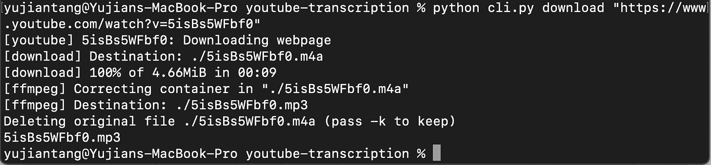
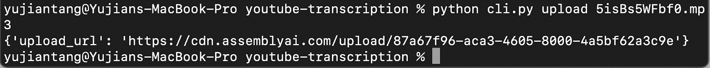
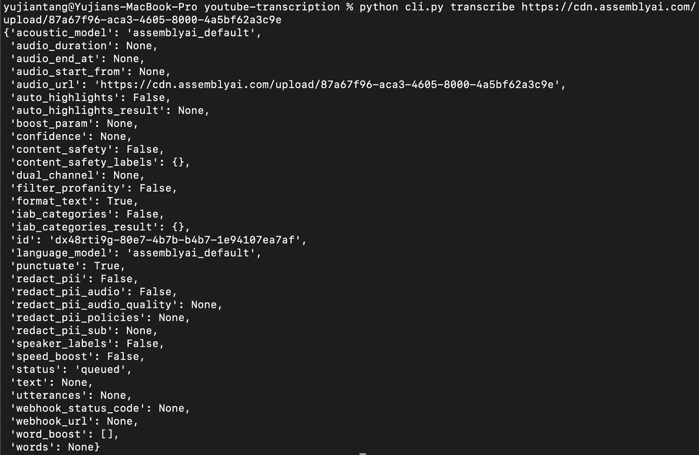
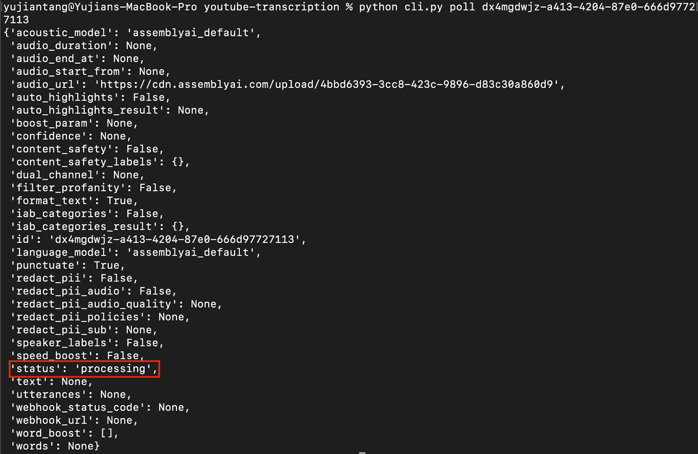
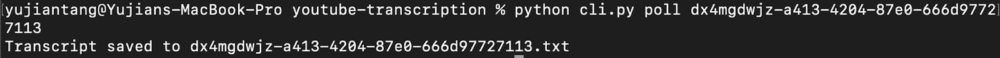
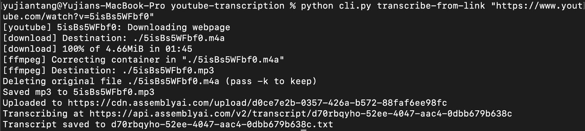
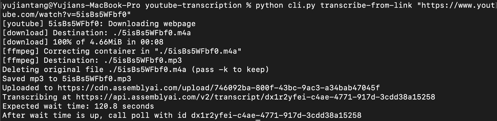

# 如何获得 YouTube 视频抄本

> 原文：<https://www.assemblyai.com/blog/how-to-get-the-transcript-of-a-youtube-video/>

你曾经需要在 YouTube 视频讲座上做笔记吗？在大学的时候，我有一些很难的课程，我必须使用大量的 YouTube 大学，并从我找到的一些 YouTube 视频中做笔记。很多时候，我不得不停下来，倒带，回放很多次来做笔记，因为速度太快了。今天，我将向您展示一个惊人的方法来解决这个问题，通过 AssemblyAI 的转录 API 获得视频的转录。你可以在这里找到源代码[。](https://github.com/ytang07/youtube-transcription/blob/main/cli.py?undefined)

## 先决条件

我将向您展示如何构建一个命令行工具，它将从 YouTube 链接下载一个视频，并通过 Python 3 中的 AssemblyAI 为您提取脚本。你需要:

*   youtube-dl
*   ffmpeg, ffprobe, ffplay
*   一个程序集 AI API 密钥
*   单击(python 库)
*   互联网接入

AssemblyAI 是一个用于快速、自动语音到文本转换的 API。我们将使用 AssemblyAI API 来转录我们下载的 YouTube 视频。要获得一个 AssemblyAI API 密钥，请访问 [AssemblyAI](https://assemblyai.com/?undefined) 并注册，你会看到你的 API 密钥清楚地显示出来，我已经圈出了它应该在图片中的位置。


AssemblyAI Portal, API Token Circled

接下来我们必须下载 Python 的 youtube-dl。Youtube-dl 是一个开源库，可以方便地下载 Youtube 视频。有多种方法可以做到这一点，但我建议使用画中画

```py
pip install youtube_dl
```

接下来是安装 ffmpeg。FFmpeg 是一个用于处理视频、音频和其他多媒体文件的开源免费软件。我们将结合 youtube-dl 使用它来将我们下载的视频转换成音频文件。这一部分对于 Windows 和 OSX 用户是不同的。首先，我们将从[https://ffbinaries.com/downloads](https://ffbinaries.com/downloads?undefined)下载二进制文件

如果你是 Windows 用户，你需要做的是下载二进制文件并解压。您将看到我们需要的三个 ffbinaries，ffmpeg，ffprobe 和 ffplay 的可执行文件。将每个可执行文件复制到一个文件夹中，并确保您知道该文件夹在哪里。出于本教程的目的，我将它复制到我从运行 python 程序的同一个文件夹*。稍后，我们将在发送给 youtube_dl 的请求中添加一个选项，告诉它在哪里可以找到该程序。*

如果您是 OSX 用户，您会希望访问该站点并下载二进制文件，然后将下载位置添加到 PATH 变量中。像这样:

```py
1\. Run

sudo cp ./ffmpeg ./ffplay ./ffprobe /usr/local/bin

2\. Open up ~/.zshrc with whatever text editor you’d like, I just run 

vim ~/.zshrc

3\. Add the line 

PATH=”/usr/local/bin:$PATH”
```

安装的最后一个先决条件是单击。Click 是一个 Python 库，是“命令行界面创建工具包”的简称。Click 的三个主要兴趣点是任意命令嵌套、自动帮助页面生成和运行时子命令的延迟加载。我只需在终端中安装 Click with pip，如下所示:

```py
pip install click
```

至此，我们已经完成了构建应用程序的所有先决步骤，现在让我们开始设置。需要注意的一点是，我有一个 configure.py 文件，其中存储了来自 AssemblyAI 的 auth key，您也需要创建一个。整个文件可以是这样的:

```py
auth_key = '<Your AssemblyAI API key here>'
```

## 设置

对于我们的设置，我们需要知道一些事情:

1.  传递给 youtube_dl 的选项有哪些
2.  程序集端点
3.  其他一些常数

对于 youtube_dl 选项，我们希望下载视频并提取音频，因此我们将使用 bestaudio 作为我们的格式选项。然后，因为我们需要获得音频，我们需要通过一个后处理器，这就是 ffmpeg 的用武之地。你会注意到我还添加了一个 ffmpeg 位置。/'这是给那些已经把 ff 二进制文件移到你的程序所在的文件夹的 Windows 用户的。我还添加了一个 outtmpl(输出模板),并将文件名设置为视频的 YouTube id，这完全是可选的，我这样做是因为我发现在某些设置中，文件的标题可能会变得很长而且很麻烦，特别是如果其中有空格的话。

```py
ydl_opts = {
   'format': 'bestaudio/best',
   'postprocessors': [{
       'key': 'FFmpegExtractAudio',
       'preferredcodec': 'mp3',
       'preferredquality': '192',
   }],
   'ffmpeg-location': './',
   'outtmpl': "./%(id)s.%(ext)s",
}
```

我们将在这里与 AssemblyAI 的两个端点进行交互，一个用来上传 YouTube 视频的音频，另一个用来获取转录。我们将在代码中这样定义它们:

```py
transcript_endpoint = "https://api.assemblyai.com/v2/transcript"
upload_endpoint = 'https://api.assemblyai.com/v2/upload'
```

最后，我们将设置几个常量，与 AssemblyAI API 交互时需要发送的头，以及读取文件时所需的块大小。我们将这样设置:

```py
headers_auth_only = {'authorization': auth_key}
headers = {
   "authorization": auth_key,
   "content-type": "application/json"
}
CHUNK_SIZE = 5242880
```

我们已经安装了必备的库，并设置了常数，现在是时候开始制作应用程序了。

让我们把它分成四个步骤(方便的还有四个命令):

1.  从 YouTube 下载音频(下载)
2.  将音频文件上传到程序集(上传)
3.  通过汇编转录音频文件(转录)
4.  获取转录的文本文件(投票)

## 从 YouTube 下载音频

我们这一步的最终目标是创建一个函数，它获取一个链接，下载它，然后将下载位置返回给我们。完成后，它应该看起来像这样:



首先，让我们初始化我们的 CLI，我们将导入 clicks 库并定义一个 api 组。

```py
import click

@click.group()
def apis():
   """A CLI for getting transcriptions of YouTube videos"""
def main():
   apis(prog_name='apis')

if __name__ == '__main__':
   main()
```

现在让我们制作我们的下载函数。YouTube_dl 通过获取 YouTube 视频的 *id* 来工作，所以当我们传入一个链接时，我们将想要首先剥离它，然后将其传递给 youtube_dl。之后，我们将使用 youtube_dl 和我们之前为它设置的选项来保存视频和打印，并返回保存位置。

```py
import youtube_dl

@click.argument('link')
@apis.command()
def download(link):
   _id = link.strip()
   meta = youtube_dl.YoutubeDL(ydl_opts).extract_info(_id)
   save_location = meta['id'] + ".mp3"
   print(save_location)
   return save_location
```

## 将音频上传到程序集

酷，现在我们可以下载一个 YouTube 视频，并在本地将音频文件保存为. mp3。现在，我们需要将这个音频文件上传到某个地方进行在线托管。幸运的是，Assembly 提供了一个易于使用的上传端点和存储。在这一步的最后，我们将得到类似这样的东西。



要上传一个文件，我们必须创建一个可以读取数据并在上传请求中作为“数据”发送的函数。当我们得到上传响应时，我们简单地打印出来，然后返回 url。

```py
import requests

@click.argument('filename')
@apis.command()
def upload(filename):
   def read_file(filename):
       with open(filename, 'rb') as _file:
           while True:
               data = _file.read(CHUNK_SIZE)
               if not data:
                   break
               yield data

   upload_response = requests.post(
       upload_endpoint,
       headers=headers_auth_only, data=read_file(filename)
   )
   print(upload_response.json())
   return upload_response.json()['upload_url']
```

## 通过汇编转录音频

好了，现在我们已经上传了音频，我们可以通过汇编 API 转录它。当我们完成后，在发送请求时，我们应该得到类似这样的东西。



在这一步中，我们要做的是创建一个转录请求，并将该请求发送到 AssemblyAI 转录端点。然后，我们坐着等。我在这里输入 pprint 是为了让打印输出看起来更好，如果你想要一个更简洁的视觉效果，你可以使用常规打印。我还包含了一个*选项*来传递一个标志，这个标志要么是-c 要么是- categories，它控制我们是否包含一个从 AssemblyAI 转录中获取与文本相关的类别的请求。

```py
import pprint

@click.argument('audio_url')
@click.option('-c', '--categories', is_flag=True, help="Pass if you want to get the categories of this transcript back")
@apis.command()
def transcribe(audio_url, categories: bool):

   transcript_request = {
       'audio_url': audio_url,
       'iab_categories': 'True' if categories else 'False',
   }

   transcript_response = requests.post(transcript_endpoint, json=transcript_request, headers=headers)
   pprint.pprint(transcript_response.json())
   return transcript_response.json()['id'] 
```

## 获取转录的文本文件

我们就要到了，这是我们要写的最后一个命令。这个命令用于轮询我们的转录端点，以检查我们的转录是否完成。汇编人工智能的文件说，预计 15-30%的视频长度转录时间-[https://docs.assemblyai.com/overview/processing-times](https://docs.assemblyai.com/overview/processing-times?undefined)。在这一步结束时，如果响应的*状态*为‘正在处理’,如图中红色所示，轮询命令将返回与转录命令完全相同的内容。



或者如果返回的响应的状态是“完成”,它将返回本地保存转录的位置。‍



对于这个函数，我们要做的是通过转录端点和上面返回的“id”参数(在本例中是 dx 4 mgdwjz-a413-4204-87 E0-666d 97727113)构造端点以进行轮询，创建文件名以保存转录的文本，最后检查响应以查看我们是否应该显示 AssemblyAI 模型仍在处理中(请注意第一个图像中的状态:正在处理)或者 AssemblyAI 模型是否已经完成，然后我们只保存文件。

```py
@click.argument('transcript_id')
@apis.command()
def poll(transcript_id):
   polling_endpoint = transcript_endpoint + "/" + transcript_id
   polling_response = requests.get(polling_endpoint, headers=headers)
   filename = transcript_id + '.txt'
   if polling_response.json()['status'] != 'completed':
       pprint.pprint(polling_response.json())
   else:
       with open(filename, 'w') as f:
           f.write(polling_response.json()['text'])
       print('Transcript saved to', filename)
       return filename
```

## 奖金回合

如果你不需要任何中间步骤(除了投票)作为独立的函数，我们可以只做一个大函数，它将做所有的事情，从下载 YouTube 视频到上传到汇编，再到通过汇编转录。有时 DNS 会超时，所以我们将使用 try，但如果请求失败，将返回等待时间。当我们完成时，它应该看起来像这样:



或者:



然后，我们等待大约 120.8 秒，并调用 poll 命令来获取我们的转录，瞧！

```py
@click.argument('link')
@click.option('-c', '--categories', is_flag=True, help="Pass True if you want to get the categories of this transcript back")
@apis.command()
def transcribe_from_link(link, categories: bool):
   _id = link.strip()
   def get_vid(_id):
       with youtube_dl.YoutubeDL(ydl_opts) as ydl:
           return ydl.extract_info(_id)
   meta = get_vid(_id)
   save_location = meta['id'] + ".mp3"
   duration = meta['duration']
   print('Saved mp3 to', save_location)
   def read_file(filename):
       with open(filename, 'rb') as _file:
           while True:
               data = _file.read(CHUNK_SIZE)
               if not data:
                   break
               yield data

   upload_response = requests.post(
       upload_endpoint,
       headers=headers_auth_only, data=read_file(save_location)
   )
   audio_url = upload_response.json()['upload_url']
   print('Uploaded to', audio_url)
   transcript_request = {
       'audio_url': audio_url,
       'iab_categories': 'True' if categories else 'False',
   }

   transcript_response = requests.post(transcript_endpoint, json=transcript_request, headers=headers)
   transcript_id = transcript_response.json()['id']
   polling_endpoint = transcript_endpoint + "/" + transcript_id
   print("Transcribing at", polling_endpoint)
   polling_response = requests.get(polling_endpoint, headers=headers)
   while polling_response.json()['status'] != 'completed':
       sleep(30)
       try:
           polling_response = requests.get(polling_endpoint, headers=headers)
       except:
           print("Expected wait time:", duration*2/5, "seconds")
           print("After wait time is up, call poll with id", transcript_id)
           return transcript_id
   _filename = transcript_id + '.txt'
   with open(_filename, 'w') as f:
       f.write(polling_response.json()['text'])
   print('Transcript saved to', _filename)
```

## 包扎

概括地说，我们刚刚制作了自己的命令行界面，用于使用 youtube-dl 下载 YouTube 视频，并使用 Python 通过 AssemblyAI 转录它们。AssemblyAI 是一个简单易用、快速且功能强大的语音转文本 API。可以在 Twitter 关注 assembly ai[@ assembly ai](https://twitter.com/AssemblyAI?undefined)也可以关注我[@于坚 _ 唐](https://twitter.com/yujian_tang?undefined)。