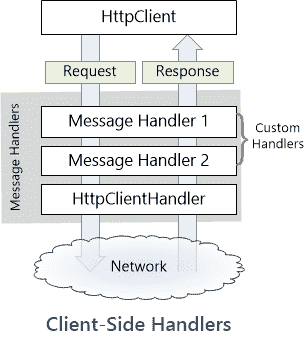

# C#和中的 HttpClientFactory 入门。网络 5

> 原文：<https://www.assemblyai.com/blog/getting-started-with-httpclientfactory-in-c-sharp-and-net-5/>

`HttpClientFactory`已经逛完了。NET 生态系统已经有几年了。

在本帖中，我们将看看`HttpClientFactory`的 3 个基本实现:

*   基础
*   命名的
*   打字

这篇文章中的所有代码都可以在这个 [GitHub 库](https://github.com/AssemblyAI/StartingHttpClientFactory?undefined)中找到。

首先，让我们了解一下`HttpClient`是什么，如何将`HttpClientFactory`融入图片中，以及为什么我们想要使用它。

## ‍Why 我就不能用`**HttpClient**`吗？

你当然可以只使用`HttpClient`，但是让我们更仔细地看看`HttpClient`实际上在做什么。

来自微软文档的下图显示了客户端和处理程序之间的关系:



默认处理程序`HttpClientHandler`实际上通过网络发送请求，并从服务器获得响应。如果需要，可以将自定义消息处理程序插入到客户端管道中。

在您的 web 项目中，您可能熟悉类似于下面的`HttpClient`实现:

```py
using (var httpClient = new HttpClient())
  {
      httpClient.BaseAddress = new Uri("https://api.twilio.com/2010-04-01/");
      httpClient.DefaultRequestHeaders.Accept.Add(new MediaTypeWithQualityHeaderValue("application/json"));

      var responseMessage = await httpClient
              .GetAsync(apiEndPoint);   
  }
```

当孤立地考虑时，上面的代码本身并没有什么错误。

`HttpClient`实现了`IDisposable`,看到许多开发者在一个`using`块中创建它。那么一旦超出范围，就会被妥善处理。然而，在博客[“你使用 HttpClient 是错误的，它破坏了你的软件”](https://aspnetmonsters.com/2016/08/2016-08-27-httpclientwrong/?undefined)在“ASP。你可以看到这不是一个理想的前进方式。

现在因为`HttpClient`一般是[线程安全的](https://docs.microsoft.com/en-us/archive/blogs/ericlippert/what-is-this-thing-you-call-thread-safe?undefined)。这可能会导致一些开发人员将客户端创建为单例，这实际上是 [HttpClient 文档](https://docs.microsoft.com/en-us/dotnet/api/system.net.http.httpclient?undefined=&view=netframework-4.7.2)中的建议。

然而，这也带来了一系列的问题。例如，客户端将在应用程序的生命周期内保持连接打开，它不会遵守 [DNS TTL](https://en.wikipedia.org/wiki/Time_to_live?undefined) 设置，并且它永远不会获得 DNS 更新。所以这也不是一个完美的解决方案。

## 什么是 HttpClientFactory？‍

主要和权威的参考资料来自[微软文档](https://docs.microsoft.com/en-us/dotnet/architecture/microservices/implement-resilient-applications/use-httpclientfactory-to-implement-resilient-http-requests.?undefined)。

该文档将`HttpClientFactory`描述为“一个自以为是的工厂，用于创建在您的应用程序中使用的`HttpClient`实例”。

中间件的创建部分是为了解决上面提到的一些问题。

## HttpClientFactory 主要功能

那么有哪些关键特征呢？再次利用参考资料，我们可以了解到:

*   它提供了一个命名和配置我们的`HttpClients`的中心位置。
*   委托`HttpClient`中的处理程序并实现[基于 Polly 的中间件](http://www.thepollyproject.org/?undefined)，以利用 Polly 的弹性策略。
*   HTTP 客户端在工厂中注册
*   可以使用 Polly 处理程序，该处理程序允许使用 Polly 策略以获得更好的弹性
*   它管理`HttpClientHandlers`的生命周期，以避免前面提到的试图自己处理`HttpClient`生命周期的问题

在这篇博客中，我们将看看使用 [AssemblyAI API](https://docs.assemblyai.com/overview/getting-started?undefined) *:* 实现`HttpClientFactory` 的几种方法

*   直接使用`HttpClientFactory`
*   使用命名客户端
*   使用类型化客户端

## 基本 HttpClientFactory 用法

一个基本的`HttpClientFactory`可以通过依赖注入来实例化。

首先，我们需要将下面的代码添加到`ConfigureServices`方法中的`Startup`类中:

```py
// File: Startup.cs
public class Startup
{
// Code deleted for brevity.

    public void ConfigureServices(IServiceCollection services)
    {
        services.AddHttpClient();
        // Remaining code deleted for brevity.
    }
// Code deleted for brevity.
}
```

然后，在您希望进行 REST 调用的班级中，您可以请求`HttpClientFactory`。我们将在 API 控制器中展示这一点:

```py
[ApiController]
public class ExampleController : Controller
{
        private readonly IHttpClientFactory _clientFactory;

	public ExampleController(IHttpClientFactory clientFactory)
	{
		_clientFactory = clientFactory;
	}

	[HttpPost]
	public async Task Basic()
	{
		var json = new
		{
			audio_url = "https://s3-us-west-2.amazonaws.com/blog.assemblyai.com/audio/8-7-2018-post/7510.mp3"
		};

		string jsonString = JsonSerializer.Serialize(json);
		var payload =  new StringContent(jsonString, Encoding.UTF8, "application/json");

		var client = _clientFactory.CreateClient();
		client.DefaultRequestHeaders.Add("Authorization", "YOUR_ASSEMBLY_AI_TOKEN");

		HttpResponseMessage response = await client.PostAsync("https://api.assemblyai.com/v2/transcript", payload);			

		string responseJson = await response.Content.ReadAsStringAsync();

	}
}
```

客户端工厂将处理上面代码中创建的`HttpClient`的处置。

## 命名的 HttpClientFactory 客户端

前面的代码使您能够在使用时定义`HttpClient`。然而，客户端配置，比如 API 端点 URL，可以在`Startup`类中的一个地方定义。然后可以通过依赖注入来请求指定的客户端，使代码更加可重用。如果您有许多不同的`HttpClient`用途，或者如果您有许多配置不同的客户端，这是非常好的。

下面的代码展示了我们如何在`Startup`类中命名和定义一个`HttpClient`。

```py
// File: Startup.cs
public class Startup
{
// Code deleted for brevity.

    public void ConfigureServices(IServiceCollection services)
    {
     services.AddHttpClient("AssemblyAIClient", client =>
			{
				client.BaseAddress = new Uri("https://api.assemblyai.com/v2/transcript");
				client.DefaultRequestHeaders.Add("Authorization", "YOUR_ASSEMBLY_AI_TOKEN");
			});

 // Remaining code deleted for brevity.
    }
// Code deleted for brevity.
}
```

命名的`HttpClient`以与基本方法相似的方式使用，只是这次我们需要从工厂请求命名的实例。我们也使用`SendAsync` API，所以设置请求有点不同。

```py
[ApiController]
public class NamedController : Controller
{
	private readonly IHttpClientFactory _clientFactory;

	public NamedController(IHttpClientFactory clientFactory)
	{
		_clientFactory = clientFactory;
	}

	[HttpPost]
	public async Task Post()
	{
		var json = new
		{
			audio_url = "https://s3-us-west-2.amazonaws.com/blog.assemblyai.com/audio/8-7-2018-post/7510.mp3"
		};

		string jsonString = JsonSerializer.Serialize(json);
		var payload =  new StringContent(jsonString, Encoding.UTF8, "application/json");

		var client = _clientFactory.CreateClient("AssemblyAIClient");

		var request = new HttpRequestMessage(HttpMethod.Post, string.Empty);

		var response = await client.SendAsync(request);			

		string responseJson = await response.Content.ReadAsStringAsync();

	}
}
```

每当我们调用`_clientFactory.CreateClient("AssemblyAIClient");`时，一个带有所有预定义配置的新客户机被创建，因此不需要在发出请求的方法中定义它。

## 类型化的 HttpClientFactory 客户端

类型化客户端与命名客户端非常相似，但是我们没有使用字符串作为键，而是利用了强类型。这通过避免使用潜在的脆弱字符串改进了我们的代码，也意味着在创建客户端时可以使用智能感知和编译器支持。

类型化客户端是封装所有逻辑的好方法，因此保持了`Startup`类的整洁，易于阅读和维护。

要创建一个类型化的客户端，我们需要首先创建一个用来封装我们的逻辑的类。在这种情况下，我们称之为`AssemblyAiService`。

```py
public class AssemblyAiService
{
	public HttpClient Client { get; }

	public AssemblyAiService(HttpClient client)
	{
		client.BaseAddress = new Uri("https://api.assemblyai.com/");
		client.DefaultRequestHeaders.Add("Authorization", "YOUR_ASSEMBLY_AI_TOKEN");

		Client = client;
	}

	public async Task<string> UploadAudioFile(StringContent payload)
	{
		HttpResponseMessage response = await Client.PostAsync("v2/transcript", payload);

		string responseJson = await response.Content.ReadAsStringAsync();

		return responseJson;
	}
}
```

在上面的代码中，我们创建了一个简单的方法，该方法接受`StringContent`，然后将其发送到 AssemblyAI 端点。该方法返回 JSON 字符串响应。

我们需要在`Startup`类中配置客户端，就像我们在前面的例子中所做的那样。

```py
// File: Startup.cs
public class Startup
{
// Code deleted for brevity.

    public void ConfigureServices(IServiceCollection services)
    {
services.AddHttpClient<AssemblyAiService>();
 // Remaining code deleted for brevity.
    }
// Code deleted for brevity.
}
```

‍As 你可以看到，当使用类型化的`HttpClient`时，阅读和理解添加了什么服务变得容易多了。

控制器中的客户端消费也被很好地封装，将大量样板代码提取到服务中。

```py
[ApiController]
public class TypedController : Controller
{
	private readonly AssemblyAiService _assemblyAiService;

	public TypedController(AssemblyAiService assemblyAiService)
	{
		_assemblyAiService = assemblyAiService;
	}

	[HttpPost]
	public async Task Post()
	{
		var json = new
			{
			audio_url = "https://s3-us-west-2.amazonaws.com/blog.assemblyai.com/audio/8-7-2018-post/7510.mp3"
			};

		string jsonString = JsonSerializer.Serialize(json);
		var payload =  new StringContent(jsonString, Encoding.UTF8, "application/json");

		string responseJson = await _assemblyAiService.UploadAudioFile(payload);

	}
}
```

‍The 以上的代码也更易测试，因为它更紧密地遵循了[坚实的原则](https://en.wikipedia.org/wiki/SOLID?undefined)。

## 结论

我希望上面的代码能启发你在下一个项目中尝试`HttpClientFactory`。

`HttpClientFactories`还有很多好处，比如使用 Polly Register 中的策略进行策略管理，以及将第三方库合并到生成的客户端中。

想找更多这样的教程？

订阅我们的时事通讯！

[Subscribe Now](Subscribe to our newsletter!)