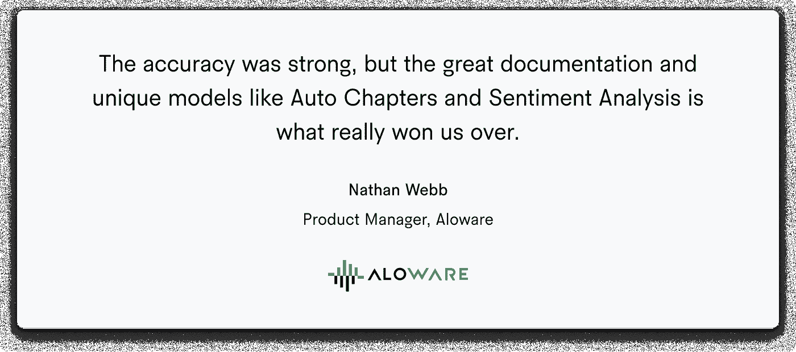
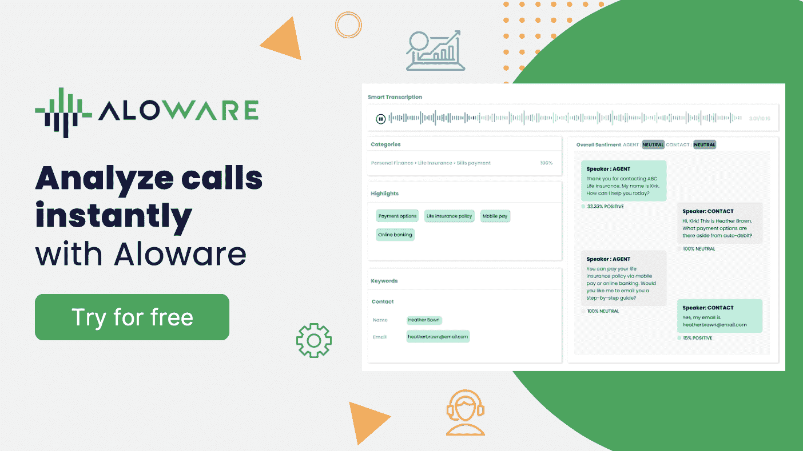
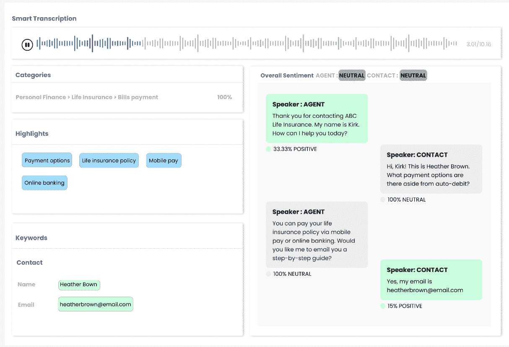
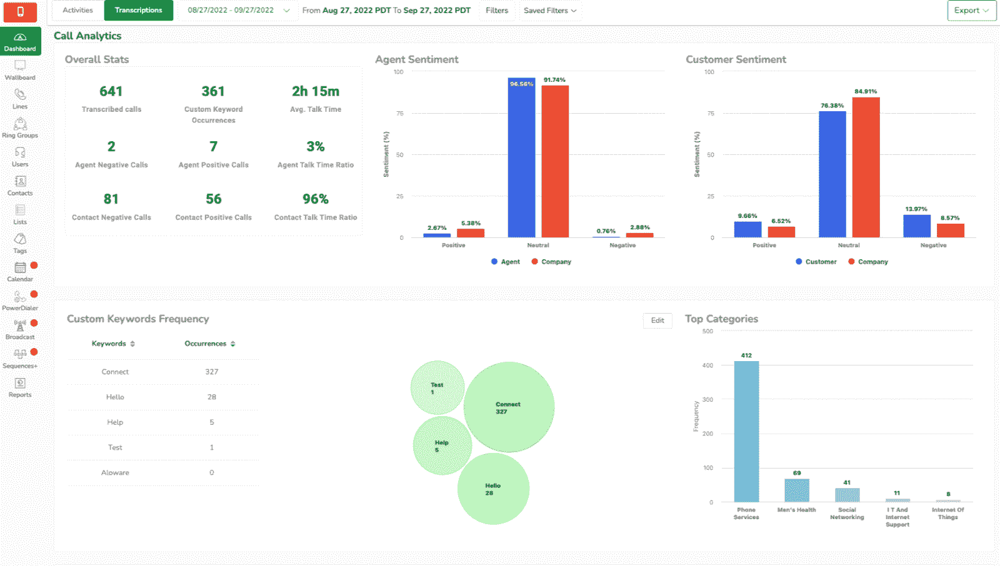

# Aloware 如何在 6 周内推出人工智能智能转录和问答

> 原文：<https://www.assemblyai.com/blog/aloware-shipped-ai-powered-smart-transcription-qa-6-weeks/>



作为一个联络中心软件即服务，Aloware 专门帮助公司将更多的线索转化为全球公司的交易。Aloware 还支持公司合规性和效率计划，并帮助拨打了 2000 多万个电话，发送了 3000 多万条短信/彩信，联系了 1500 多万名联系人。​



为客户电话和信息提供便利是一个很好的起点。但是这些电话和消息产生了大量未使用的非结构化数据。Aloware 的产品团队想知道人工智能模型是否能有所帮助。

得益于机器学习和深度学习的最新进展，今天的人工智能模型比以往任何时候都更加准确。最复杂的模型是当今最令人印象深刻的技术背后的大脑，如自动驾驶汽车、自动化欺诈检测、个性化推荐等。这些模型背后的原理也正在被集成到语音识别和自动文本分析等技术中。

考虑到这一点，Aloware 开始为他们的用例寻找合适的人工智能技术。他们的产品团队知道自动、准确的转录非常适合他们的产品路线图，但想知道他们还可以用这些转录数据做什么。产品团队的部署时间也很短，因此需要一个单一的 API 来满足他们的所有需求。

Aloware 的搜索让他们找到了 AssemblyAI。AssemblyAI 的[语音转文本](https://www.assemblyai.com/blog/the-top-free-speech-to-text-apis-and-open-source-engines/)和[音频智能](https://www.assemblyai.com/blog/what-is-audio-intelligence/)API 帮助产品团队应用最新的人工智能模型来构建新功能，为他们的客户带来胜利的结果——在性能、生产力和效率方面。

## 仅用 6 周时间部署人工智能

利用 AssemblyAI 的人工智能模型，Aloware 能够在短短 6 周内为其客户提供[智能转录](https://aloware.com/smart-transcription/)。现在，Aloware 平台上的大多数 QA 任务都是自动化的，帮助他们的客户更快地进行 QA。

有了 AssemblyAI，Aloware 收到的每一个呼叫都会被自动转录，并且具有接近人类水平的准确性。在过去，电话呼叫的自动转录是可用的，但准确率较低-传统的语音转录模型只能以大约 70%的准确率转录。他们还会省略基本的标点符号、大小写和格式，这使得抄本难以阅读。

下面是未格式化的文字稿的一个片段，以转录的采访为例:

```py
When i'm gone for a while but hes always supportive so that always 
takes a lot of stress off and lets me play and its a lot easier sure 
wow well back to your college and pro career i know you are a usc 
player and im sure that was an amazing team experience but a lot of 
college players dont go on to go pro even though theyre incredible 
players and the college level is very high its a shame that there isnt 
much more interest in college tennis but how do you talk about mindset 
shift from choosing tennis as a career versus like business or coding 
or something you know and then making that decision from usc to just go 
pro one of my goals when I was little was to always play professional i 
think maybe some people just want to go to college or get a scholarship 
and then end there but i knew i always wanted to continue my tennis
```

令人欣慰的是，现代人工智能模型，如 AssemblyAI，包括[自动标点和大小写](https://www.assemblyai.com/docs/core-transcription#automatic-punctuation-and-casing)、[段落检测](https://www.assemblyai.com/docs/core-transcription#exporting-paragraphs-and-sentences)和[说话人双音化](https://www.assemblyai.com/blog/top-speaker-diarization-libraries-and-apis-in-2022//)，这使得最终用户更容易阅读抄本。

下面是应用了上述模型的相同脚本的样子:

```py
<Speaker A> When I'm gone for a while, but he's always supportive, so 
that always takes a lot of stress off and lets me play, and it's a lot 
easier.

<Speaker B> Sure. Wow. Well, back to your college and pro career. I 
know you are a USC player and I'm sure that was an amazing team 
experience but a lot of college players don't go on to go pro, even 
though they're incredible players and the college level is very high. 
It's a shame that there isn't much more interest in college tennis. But 
how do you talk about mindset shift from choosing tennis as a career 
versus, like, business or coding or something, you know, and then 
making that decision from USC to just go pro?

<Speaker A> One of my goals when I was little was to always play 
professional. I think maybe some people just want to go to college or 
get a scholarship and then end there, but I knew I always wanted to 
continue my tennis.
```

Aloware 能够应用这些模型为其最终用户打包一个高价值的智能转录工具:



AssemblyAI 还提供了一套 AI 模型，帮助产品团队在音频数据的基础上构建高 ROI 工具。对于 Aloware 来说，这些模型——特别是汽车章节和情感分析——帮助其团队填补了当前向最终用户提供的产品中的关键空白。这包括构建新的工具，帮助他们的客户深入了解客户情绪、销售代表的表现和电话分析，以改善客户体验和互动。

Aloware 还喜欢这些人工智能模型来自单一提供商，使工具更容易、更快地构建。

“精确度很高，”Aloware 的产品经理内森·韦伯解释说。但“伟大的文档和独特的模型，如汽车章节和情绪分析，才是真正赢得我们的原因，”他继续说道。

Auto Chapters 是一个[文本摘要](https://www.assemblyai.com/blog/text-summarization-nlp-5-best-apis/)模型，可以自动显示音频和视频流中的关键亮点和摘要。自动章节模式的工作原理是首先将音频/视频流分割成逻辑的、带有时间戳的章节，或谈话主题自然变化的点。然后，该模型为这些章节中的每一章生成一个简短的摘要。结果类似于启用自动章节时 YouTube 在视频下方显示的内容。

对于一个软件，Auto Chapters 模型通过使通话记录更容易消化和处理来加快质量保证(QA)。

Webb 解释说:“ **Auto Chapters 对希望快速、智能地对录音电话进行质量 QA** 的客户特别有帮助。”



[情绪分析](https://www.assemblyai.com/blog/best-apis-for-sentiment-analysis/)，AssemblyAI 的另一个人工智能模型，检测并标记语音片段中的积极、消极和中性情绪。情绪分析对于跟踪不同地点、时区、产品、支持代理等的客户意见和态度非常有用。

最后，Webb 解释说，AssemblyAI 通过其人工智能研究对持续模型和功能改进的承诺是与初创公司的服务相匹配的一个重要决定因素。

## 将人工智能注入联络中心

Aloware 对精确的转录和人工智能功能感到兴奋，它现在可以为客户提供 AssemblyAI 最先进的人工智能模型。

此外，与 AssemblyAI 的合作进展顺利，Webb 说:“持续的支持一直很强，AssemblyAI 继续像真正的合作伙伴一样行事，而不仅仅是供应商。”

Aloware 的结果同样令人印象深刻。“AssemblyAI 是我们开发并提供给客户的第一个真正的机器学习功能，”Webb 解释道。“它为我们的客户节省了接听长时间电话的时间。此外，该工具为电话回访打开了一个新的世界，提供了不可预见的洞察力和绩效跟踪。他继续说道:“客户不断告诉我,**这是 Aloware 有史以来最酷的产品之一。**

AssemblyAI 的人工智能模型也帮助 Aloware 通过其新的自动呼叫 QA 功能赢得了更多客户。

Aloware 的下一步是什么？“在不久的将来，我们的团队正在为经理开发汇总报告，以快速查看代理呼叫性能，”Webb 说。“从长远来看，我们希望使用 AssemblyAI 为相关的糟糕通话质量提供即时通知。可能会有更多令人兴奋的功能出现。”

那些想了解更多关于 Aloware 的信息或注册其智能转录服务的人可以在这里注册。

了解更多关于 AssemblyAI 可以为 CCaaS 平台做些什么

阅读我们关于人工智能模型如何帮助建立基于云的智能联络中心的最新博文

[Learn more](https://www.assemblyai.com/blog/building-intelligent-cloud-based-contact-center-how-asr-nlp-and-nlu-tools-can-help/)