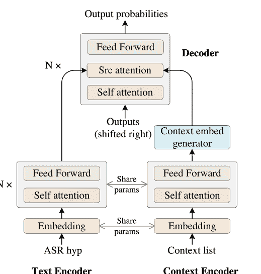
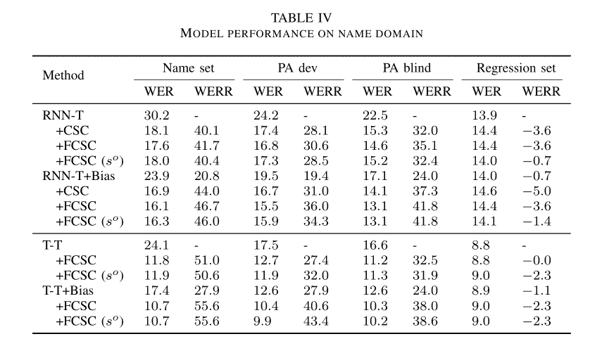

# 人工智能研究评论-拼写和 ASR

> 原文：<https://www.assemblyai.com/blog/ai-research-review-spelling-and-asr/>

本周的人工智能研究综述是 [*面向端到端语音识别系统定制的上下文拼写校正*](https://arxiv.org/abs/2203.00888) *。*

### 这篇论文有什么令人兴奋的地方

[本文](https://arxiv.org/abs/2203.00888)提出了一种通用的 [ASR](https://www.assemblyai.com/blog/what-is-asr/) 偏置解决方案，该方案对域不敏感，可以在不同的场景中采用。

自回归模型在稀有词或专有名词上实现了 51%的相对单词错误率(WER)减少。

作者提出了一种在训练和推理过程中处理大型上下文短语列表的新方法，以提高效率和可扩展性。

### 主要发现

这是一个 seq2seq 模型，它通过关注 ASR 假设和外部上下文单词/短语来纠正罕见单词或专有名词的拼写。作者提出了一种在训练和推理过程中处理大型上下文短语列表的新方法，以提高效率和可扩展性。

[Source](https://arxiv.org/abs/2203.00888)

通过结合浅层融合和上下文拼写校正实现了最佳的 WER 减少。该模型在高 OOV 率测试集上工作得非常好，这表明该模型在子词级别而不是词级别学习错误模式。

[Source](https://arxiv.org/abs/2203.00888)

### 我们的外卖

与偏置 ASR 编码器(例如，上下文 RNN-T，CLAS)相比，作为后处理的 ASR 偏置是改善端到端 ASR 中专有名词检测的合理选择。

虽然 AR 和 NAR 解决方案都很好地减少了专有名词 WER，但 NAR 模型将推理速度提高了 2.1 倍。

