# 泊松流生成模型简介

> 原文：<https://www.assemblyai.com/blog/an-introduction-to-poisson-flow-generative-models/>

在过去的几年里，生成式人工智能模型取得了长足的进步。受物理学启发的扩散模型已经在几个领域达到了最先进的性能，为像 T2 稳定扩散模型、T4 扩散模型、达尔-E 2 扩散模型和图像模型提供了动力。

麻省理工学院的研究人员最近公布了一个新的*受物理学启发的生成模型，这次是从**电动力学**领域汲取灵感。这种新型的模型——**泊松流生成模型([PFGM](https://arxiv.org/pdf/2209.11178.pdf))**——将数据点视为*带电粒子*。通过跟踪数据点产生的电场，PFGMs 可以创建全新的数据。下面我们看到了 PFGM 生成的人脸图像:*

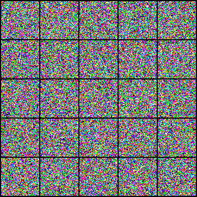

[CelebA](https://mmlab.ie.cuhk.edu.hk/projects/CelebA.html) images generated with a PFGM (video provided by the PFGM authors)

PFGMs 为新的研究途径奠定了令人兴奋的基础，特别是考虑到它们在图像生成任务上比扩散模型快 10-20 倍，性能相当。

在本文中，在学习如何使用 PFGMs 对 **[进行训练和采样](#training-and-sampling-with-pfgms)** 之前，我们将在 PFGM 理论上对****进行一个高级的观察。在那之后，我们将再看一遍理论，这次从基本原理开始进行 **[深度探讨](#poisson-flow-generative-modelsa-deep-dive)** 。然后，我们将看看 PFGMs 如何与其他模型和其他 **[结果](#results)** 相比较，然后以一些 **[最终结果](#final-words)** 结束。让我们开始吧！****

## ****介绍****

****在人工智能的发展过程中，已经进化出了几个生成模型家族。一些方法，如[标准化流程](https://arxiv.org/abs/1908.09257)，提供了样本可能性的明确估计。其他方法，像 [GANs](https://arxiv.org/abs/2001.06937) ，不能明确计算可能性，但是*可以*生成非常高质量的样本。****

****在过去的几年中，已经进行了大量的研究工作来开发[扩散模型](https://www.assemblyai.com/blog/diffusion-models-for-machine-learning-introduction/)。扩散模型从物理学中获得灵感，特别是**热力学/统计物理学**，注意到例如气体的任何局部分布将最终通过随机运动均匀地扩散到整个空间。****

****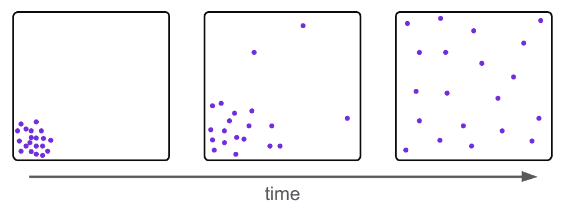

A localized gas (purple particles) will spread out to evenly fill a room over time simply through random motion**** 

****也就是说，随着时间的推移，任何初始分布都将转换为均匀分布。扩散模型从这个想法中获得灵感，并将图像放在一个“高维空间”中，以类似的方式用随机噪声破坏它们。****

****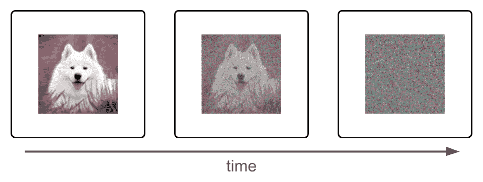

The pixels in an image can be viewed as a localized cloud of particles that we "diffuse" into random noise over time**** 

****目标是训练一个机器学习模型，学习如何通过时间倒退*，逆转这一腐败过程。如果我们能够成功地学习这样的映射，那么我们就有了从简单分布(高斯分布，在扩散模型的情况下)到数据分布的转换。然后，我们可以简单地通过从高斯分布中采样并应用学习到的变换来生成数据。*****

******泊松流生成模型**的灵感来自于与扩散模型非常相似的方式，但是它们来自于**电动力学领域**而不是热力学领域。基本和基础的发现是*超平面中电子的任何*分布产生电场，该电场**将该分布转换成均匀的角度分布**，因为该分布根据场定义的动力学随时间演化。****

****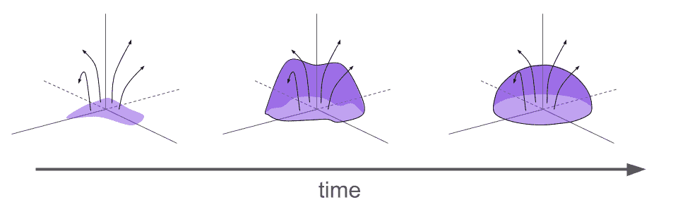

Treating a data distribution as a *charge* distribution defines an electric field that transforms the distribution into a uniform hemisphere over time**** 

****如果我们知道分布产生的电场(又名**泊松场**)，那么我们可以*从半球上均匀采样的点开始*，并以相反的时间运行动态以恢复原始数据分布。因此,**物理定律**提供了简单分布和数据分布之间的可逆映射，产生了一种生成类似于标准化流的新数据的方法。****

****有了 PFGMs 的总体工作原则，现在让我们更仔细地看看这一工作原则在实践中是如何体现的。****

## ****泊松流生成模型-概述****

****如上所述，PFGMs 的性能取决于(几乎)由超平面中的任何分布产生的泊松场在足够远的距离处导致均匀的角度分布的结果。直觉上，我们来考虑一下为什么会这样。****

****考虑由任意电荷分布产生的电场。非常接近分布，电场将非常复杂，并且通常具有高曲率。****

****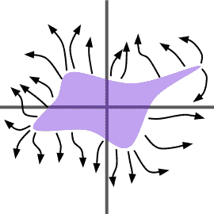

A charge distribution (purple) and the electric field lines (black) it generates**** 

****然而，在离电荷分布非常远的距离 **d** 处，场要简单得多。在这样的距离下，电荷分布中的所有点离 **d** 的距离大致相同。这意味着电荷分布可以被认为是“塌陷”到一点，将其所有电荷集中在这一点上。点电荷的电场非常简单——方向呈放射状，大小与点电荷的距离成反比:****

****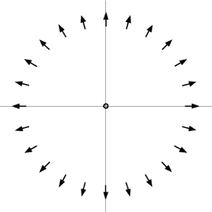

At a far distance, the charge distribution "looks like" a point charge, with a correspondingly simple electric (Poisson) field**** 

****因此，当我们从电荷分布中“缩小”时，它看起来越来越像具有相应电场的点电荷:****

****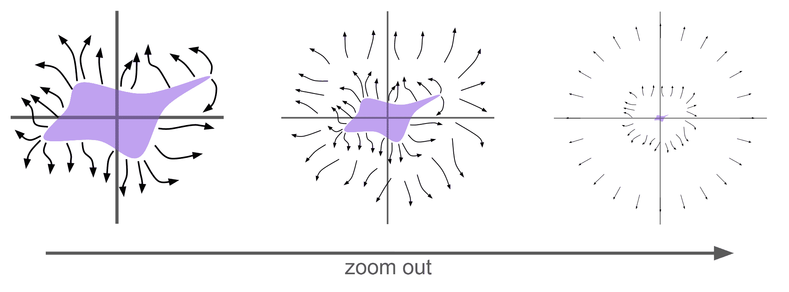****

****一般来说，物理场表现良好，电磁场也不例外。因此，分布附近的局部复杂电场(或*源*)必须以平滑的方式连接到远离分布的电场，我们已经看到它是纯径向的，因此电场线看起来像这样:****

****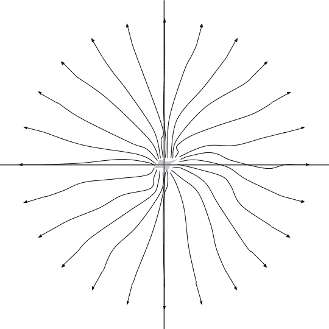****

****假设电场在很远的距离上是径向的，那么在这个距离上与电场相切的表面是球形的。PFGM 的作者证明，不仅这个表面是球形的，而且它的通量密度是均匀的。下面我们看到一个心形电荷分布在 *z=0* 平面，以及它产生的一些电场线(黑色箭头)。通过封闭半球面的通量密度(几乎)是均匀的。****

 ****证明直觉

感兴趣的读者可以在 [PFGM](https://arxiv.org/pdf/2209.11178.pdf) 论文的附录 A.1 中找到这一说法的完整证明——我们在这里只提供一个草图。

考虑电荷分布正上方的一小块区域 dA。将 dA 沿磁场扫过半球上的区域 dP 所产生的体积称为表面积为 s 的 V，证明取决于以下事实:( i) V 不含电荷,( ii) P 根据定义与磁场正交。因此，通过 dA 的流入流量必须等于通过 dP 的流出流量。假设无限小的流入和流出通量相等，我们发现 dP/dA 与电荷分布成正比。**** ****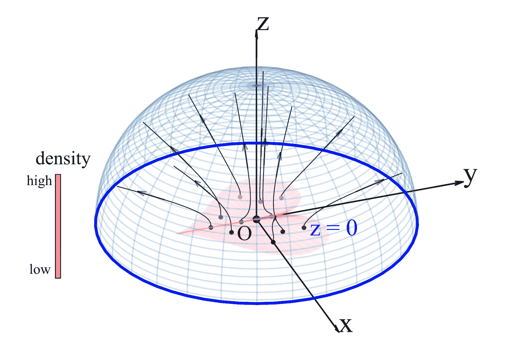

([source](https://arxiv.org/pdf/2209.11178.pdf))

因此，如果我们让电荷分布沿着电场线发展**，它将转变成均匀的半球形分布。**

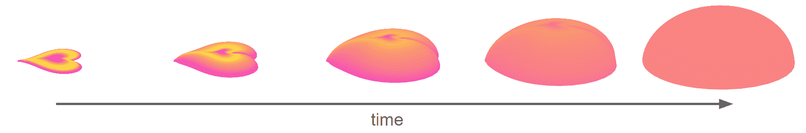

By following the electric field lines it generates, a heart-shaped distribution evolves into a uniform angular distribution over time (modified from [source](https://arxiv.org/pdf/2209.11178.pdf))

如果我们学习高维空间中的泊松场，例如图像数据分布，那么我们可以简单地从高维半球均匀地采样点，并在相反的时间运行动力学，以从数据分布生成图像:

Uniformly sampled points on the hemisphere can be transformed into samples from the data distribution by evolving them backwards through the Poisson field generated by the data distribution (modified from [source](https://arxiv.org/pdf/2209.11178.pdf))

我们如何着手学习和使用由数据分布产生的泊松场？

### 学习泊松场

我们试图在由数据分布产生的泊松场的影响下模拟粒子的动力学。现在来看看我们是怎么学习这个泊松场的。

术语注释

作者定义了术语**泊松场**来区分高维场和特殊的三维场，三维场有时保留了术语“电场”。我们将互换使用这些术语，在画有物理意义的平行线时强调使用术语“电场”，而在更抽象的讨论中强调使用术语“泊松场”。

#### 步骤 1 -扩充数据

下面我们看到一个视频，显示“PFGM”根据它产生的泊松场演化。特别地，我们注意到数据分布位于一个 **2** 维的平面上，但是被映射到一个 **3** 维的半球上

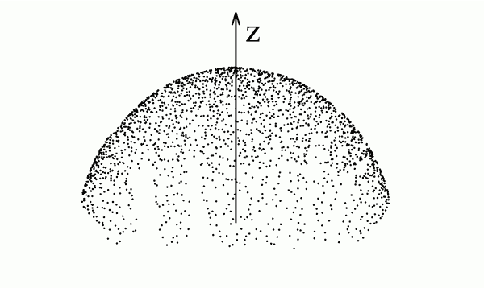

Animation provided by the authors

这通常对于 PFGMs 来说是真实的- N 维数据被用额外的维度 *z* 扩充**，并且被放置在新的(N+1)维空间的 *z=0* 超平面中。然后将数据映射到(N+1)维半球。**

这种空间增大的原因是为了避免**模式崩溃**。下面我们看到 XY 平面上均匀圆盘产生的(负)泊松场。我们的采样过程包括在空间中随机选择点，并沿着场回到数据分布。正如我们所看到的，所有的轨迹都汇聚到原点，这意味着我们的模型将生成没有变化的图像，因此会遭受模式崩溃。

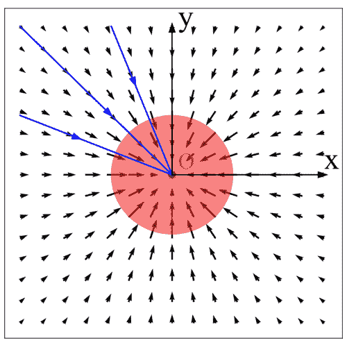

Without augmenting the data with an additional dimension, all trajectories converge to the origin resulting in mode collapse ([source](https://arxiv.org/pdf/2209.11178.pdf))

用一个额外的维度来扩充数据可以避免这个问题。下面我们从上面看到同样的二维均匀圆盘，现在在 XY 平面上，增加了维度 z。

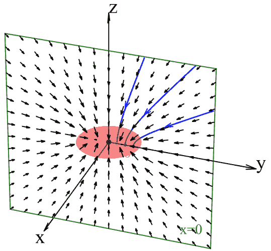

After augmenting the data with an additional dimension, many more trajectories are available that intersect with different points in the distribution, therefore avoiding mode collapse ([source](https://arxiv.org/pdf/2209.11178.pdf))

虽然我们仍然有一个固有的二维数据分布，但它现在被嵌入到一个三维空间中，从而生成一个 **3** 维泊松场。如果我们现在对这个 3 维空间中的点进行采样，例如从 YZ 平面，并沿着它们的轨迹穿过场到达 *XY* ，我们得到一系列新的轨迹，这些轨迹不再折叠到原点，而是与数据分布中的不同点相交。也就是说，**我们的模型不再遭受模式崩溃**。

#### 步骤 2 -计算经验场

要使用 PFGMs 进行采样，我们必须知道泊松场。为了准确地了解泊松场*和*，我们需要准确地了解数据分布*和*，但是数据分布正是我们想要从中取样的。如果我们首先已经知道分布的解析形式，我们就不会关心它产生的泊松场。

我们将学习由被视为点电荷的训练数据产生的**经验**场，而不是试图学习*精确的*泊松场。一些读者可能会注意到，这种方法让人想起我们在介绍可微编程时遇到的运动学问题。

[Differentiable Programming - A Simple Introduction](https://www.assemblyai.com/blog/differentiable-programming-a-simple-introduction/)

下面是一个示例分布(浅紫色)，我们试图为其生成数据，以及从该分布中采样的几个数据点(紫色点)。此外，在空间中有一个随机选择的点(红点)，我们试图在这个点上估计泊松场(或者等价地，计算经验场)。

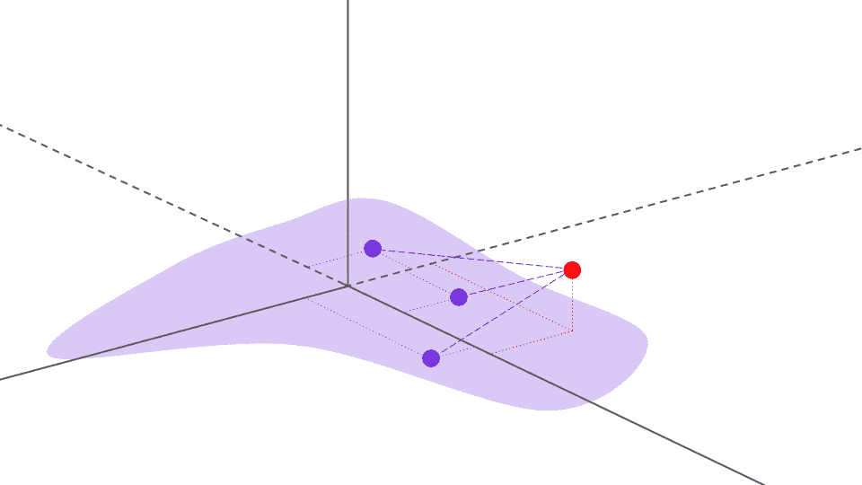

为了计算经验电场，我们**将每个数据点电荷**产生的电场相加，由于[叠加原理](https://en.wikipedia.org/wiki/Superposition_principle)，该电场相当于该点的总经验电场。每个单独的数据点的场贡献可以在下面看到一个紫色箭头，以及一个红色箭头表示的净场。

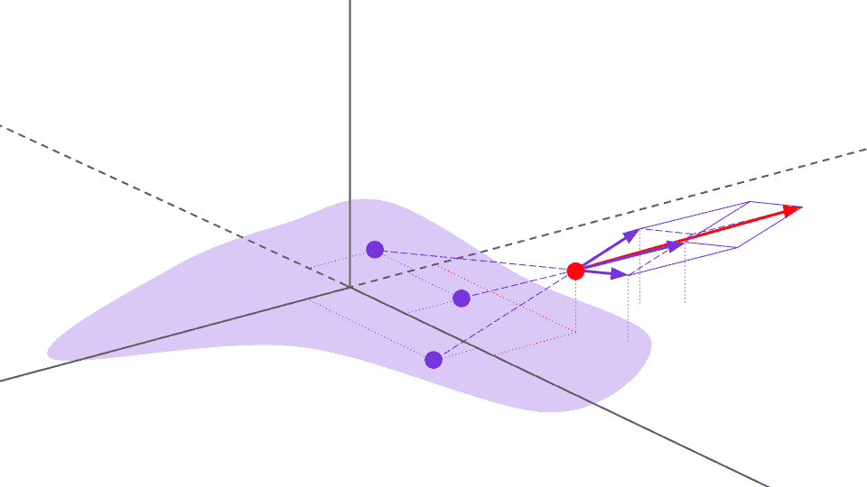

**我们计算了空间**中许多随机采样点的经验场，采样优先选择靠近数据点的点，因为场的曲率在这些区域会更显著，因此需要更高的分辨率来充分逼近。

#### 步骤 3 -计算损失并更新函数近似值

为了使用 PFGMs 进行采样，我们需要泊松场的*连续* *解析*表示，而不仅仅是像上面计算的那些离散点的值。因此，我们必须在这些点上为经验场训练一个函数逼近器。这个近似器应该是什么样子的？

函数逼近器必须接受一个 N+1 维向量，表示我们的扩充空间中的一个点，并返回一个 N+1 维向量，表示该点的经验场。这种映射的自然选择是 PFGM 作者实现的 U-Net 架构。

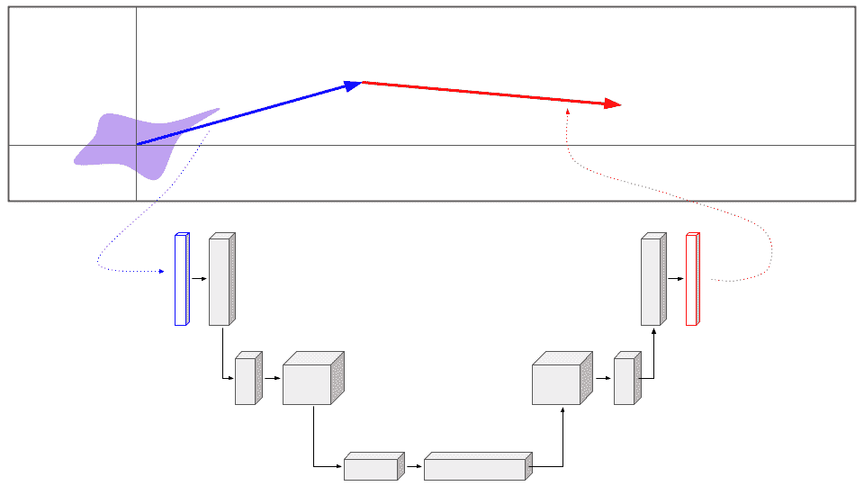

A U-Net (block diagram) accepts a point in space (blue vector) and returns the approximate empirical field at that point (red vector) generated by data points sampled from the data/charge distribution (purple)

为了训练 U-Net，我们只需**计算批次**的平均 L2 损失，然后用 Adam 等基于梯度的优化器进行训练。就是这样！

### 使用 PFGMs 采样

在上一节中，我们学习了如何为被视为带电粒子的许多数据点生成的经验场训练函数逼近器。在训练了现场估计量之后，我们实际上如何使用该估计量从原始数据分布中进行采样？

回想一下泊松场轨迹构成了数据分布和均匀半球之间的双射。因此，为了从数据分布中采样数据点，我们从均匀的角度分布中采样点，然后使它们沿着泊松场向后移动*直到我们到达数据分布所在的 *z=0* 超平面。相应的微分方程是:*

这个方程表示，在每一时刻，点应该在负泊松场的方向上移动。因此，对应的解将是沿着泊松场向后追溯到 *z=0* 数据分布超平面的轨迹。

**在实践**中，为了使用泊松场生成模型生成数据，我们:

1.  在一个大半球上均匀采样数据
2.  使用 **ODE 解算器**沿着泊松场向后演化这些点
3.  **向后进化**，直到我们到达 *z=0* ，此时我们已经从训练分布中生成了新的数据

实施说明

实际上，学习和采样过程要比这复杂得多，但是我们将这个讨论保留到下面的[深度探讨](#poisson-flow-generative-modelsa-deep-dive)部分。

就是这样！下面我们可以看到粒子沿着泊松场向前和向后移动，形成我们上面看到的心形分布。

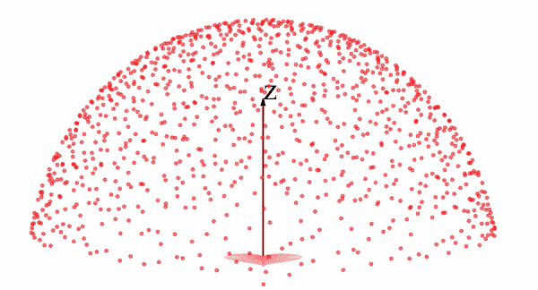

Video courtesy of the authors

在视觉空间中，采样过程的向后演变如下所示:

Video courtesy of the authors

现在我们已经了解了 PFGMs 的工作原理，让我们看看如何使用它们来生成图像。或者，你可以跳到[深潜](##poisson-flow-generative-modelsa-deep-dive)部分进行更深入的治疗。

## 使用 PFGMs 生成图像

要了解如何使用 PFGMs 生成图像，请遵循下面的 Colab 笔记本。

[Poisson Flow Generative Models in Colab](https://colab.research.google.com/drive/1neY6OovzZELul9t2OTdThUitptNVnuHR?usp=sharing)

该笔记本显示了如何为 Colab 设置本地环境，如何下载可用的预训练模型，以及如何使用它们从 [CIFAR-10](https://www.cs.toronto.edu/~kriz/cifar.html) 、 [CelebA](https://mmlab.ie.cuhk.edu.hk/projects/CelebA.html) (62 x 64)和 [LSUN bedroom](https://www.tensorflow.org/datasets/catalog/lsun) 数据集采样图像。

想更多地了解 JAX 吗？

PFGM 存储库需要安装 JAX -在我们简单易懂的概述中了解你需要了解的关于 JAX 的一切。

[Check it out](https://www.assemblyai.com/blog/why-you-should-or-shouldnt-be-using-jax-in-2022/)

继续下一节，深入了解 PFGMs 的理论，或者跳到[结果](#results)来看看 PFGMs 的表现。

## 泊松流生成模型——深度探讨

在本节中，我们将从基本原理开始，对 PFGMs 进行更深入的研究，以阐明它们的内部工作原理。我们从讨论高斯定律开始。

### 高斯定律和势函数

在 PFGMs 中，我们试图通过将数据分布转换为*电荷*分布并利用其产生的电场定义的动态来对其进行采样。电荷分布和它产生的场之间的关系由[高斯定律](https://en.wikipedia.org/wiki/Gauss%27s_law)定义，如下所示(省略常数)，其中 **E** 加粗表示它是一个矢量场。

我们定义一个**势函数**为负梯度为电场的任何函数。也就是说，φ是 **E** 的势函数，如果

虽然势函数有许多应用，但在我们的例子中，我们感兴趣的是用势函数来描述高斯定律。

### 泊松方程和格林函数

让我们用势的定义把它代入高斯定律:

结果称为[泊松方程](https://en.wikipedia.org/wiki/Poisson%27s_equation)，是一个定义了势函数和产生它的电荷密度函数之间关系的方程。泊松方程不属于电动力学，它渗透到物理学和工程学的许多领域。高斯定律的这种等价形式有什么特别之处？

如果我们更仔细地观察这个结构，我们会看到三个部分。一个运算符( ***L** )* ，一个运算符作用于其上的标量函数( ***y*** )，以及另一个作为该运算结果的标量函数( ***f*** )。

特别地，德尔平方算子被称为 **[拉普拉斯算子](https://en.wikipedia.org/wiki/Laplace_operator#:~:text=In%20mathematics%2C%20the%20Laplace%20operator,scalar%20function%20on%20Euclidean%20space.)** ，并且是**线性[微分算子](https://en.wikipedia.org/wiki/Differential_operator)** 。也就是说，拉普拉斯的应用导致线性微分方程。给定***L******f***恢复 ***y*** 的问题是物理和工程中非常常见的问题。

我们如何着手解决这个问题？也就是说，**对于给定的电荷分布，我们如何找到它产生的势函数**？为此，我们将利用运算符的**线性**。让我们试着把电荷分布分割成几个小块作为近似，用一个有限的，单位高度的均匀分布作为例子。

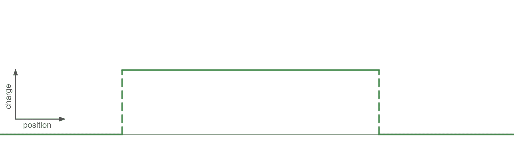

我们用点电荷来近似这个连续分布，在这种情况下用 4。

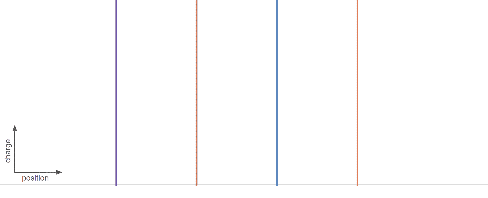

点电荷由[狄拉克δ](https://en.wikipedia.org/wiki/Dirac_delta_function)函数表示。对于那些不熟悉的人来说，狄拉克δ函数(或简称为“δ”)代表点电荷的电荷密度，因此函数上的**积分等于单位电荷**。通过这种近似，我们有

这个近似值有什么帮助？回想一下，拉普拉斯算子是一个**线性**微分算子——我们现在将利用这种线性。特别的，我们把第 I 个点电荷的势函数叫做\( \varphi_i \)。那么我们有

其中作为拉普拉斯的线性的结果，最后的等式是有效的*。因此，我们有(对于一组给定的边界条件)*

我们发现，我们可以通过对点电荷的电势求和来近似电势**-这是一个非常有用的结果，直接源于拉普拉斯的线性。**

下面我们绘制了上述每个点电荷的电势(其形式我们将在后面推导)，以及点*x’*的估计电势。我们通过对该点的每个单独电位的值求和来获得该估计值，其中每个贡献可以在图中用与相关电位相同的颜色看到

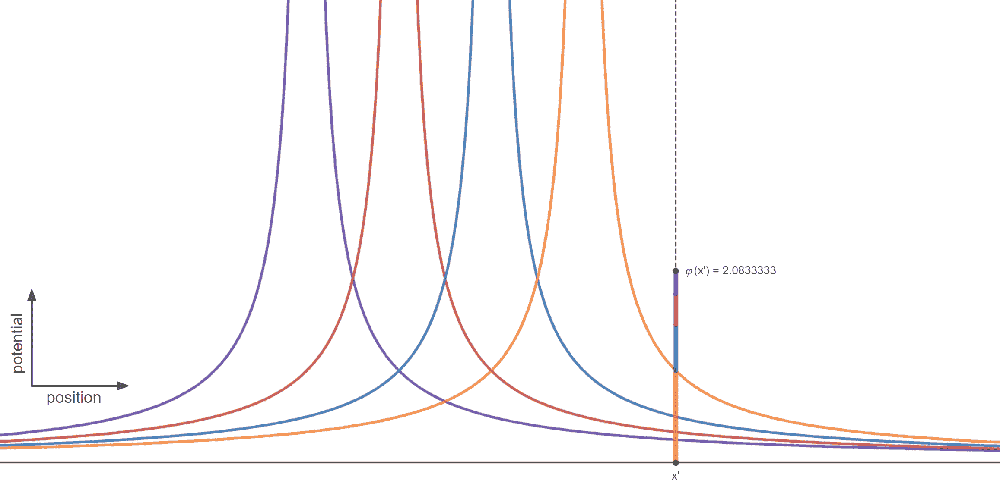

我们可以更简洁地表达这一点，将\( \varphi ' \)定义为以下等式的解:

也就是说，给定空间中的位置 **i** ，\( \varphi ' \)给出空间中任意点的电势 **x** ，该电势由以 **i** 为中心的狄拉克δ电荷分布产生。使用这个新定义的函数，让我们通过增加用来近似分布的点电荷的数量来改进我们对连续电荷分布产生的真实电势的估计。对于空间中的任意点集，我们有

也就是说，电势已经被近似为以 **I** 中的点为中心的任意数量的点电荷电势的总和。现在让我们将点的数量增加到无穷大，将离散和转化为积分:

在这种情况下，我们的近似不再是近似，并且*精确地*为真(如果我们只在非零电荷密度的区域上积分)，但是有一个警告。回想一下，我们的δ函数代表一个*单位*点电荷的电荷密度。因此，在上面的积分中，我们隐含地假设我们有一个单位电荷密度。对于上面的电荷密度示例，这很好，但如果我们有不同的电荷密度，比如:

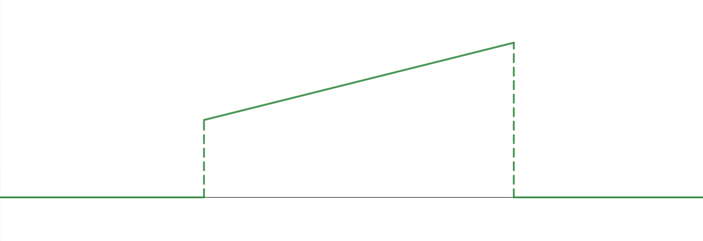

我们现在必须考虑这个分布中变化的电荷密度。在这种情况下，我们简单地将 **乘以积分中的电荷密度**，通过电荷分布缩放每个点处的*单位*电荷密度，以在积分结束时给出适当的值。我们也用符号 **G** 代替\( \varphi '\)，得到积分的最终形式:

这是一个非常重要的结果。它说，为了求解任意电荷密度的泊松方程来计算它的电势，这可能需要求解一个非常复杂的微分方程，**简单地求解点电荷的泊松方程就足够了。只有*这个解和上面的方程，我们原则上可以计算出*任何*电荷分布的*精确*电势。上面的函数 **G** 被称为 **[格林函数](https://en.wikipedia.org/wiki/Green%27s_function)** ，并且*每个*线性微分算子都有一个对应的格林函数(也称为[脉冲响应](https://en.wikipedia.org/wiki/Impulse_response))，该函数就是当被算子作用时产生δ函数的函数。***

总而言之，要找到任何电荷分布的精确势，我们要做的就是找到点电荷的势，原则上，我们可以计算任何电荷分布的精确势。

### 拉普拉斯格林函数和电场

如上所述，每个线性微分算子都有自己的格林函数。拉普拉斯算子的格林函数为

其中 N 是空间的维数，S 是单位半径的[(N-1)-球体](https://en.wikipedia.org/wiki/N-sphere)的表面积。

我们与 PFGMs 的目标；但是，**是学习泊松场**，*而不是*的势函数。我们的直觉可能会告诉我们，上述论点，即势函数可以被认为是点电荷势的总和，也适用于泊松场。这种直觉确实是正确的，我们可以从数学上看到如下

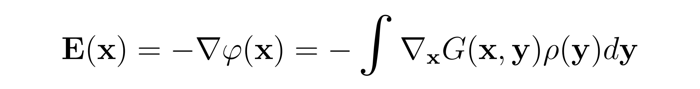

其中， **x** 下标表示相对于 **x** 的梯度，因此与积分互换没有问题。也就是说，**将泊松场估计为点电荷产生的泊松场之和**是有效的。

在我们的例子中，格林函数(即点电荷产生的泊松场)的梯度为

证明

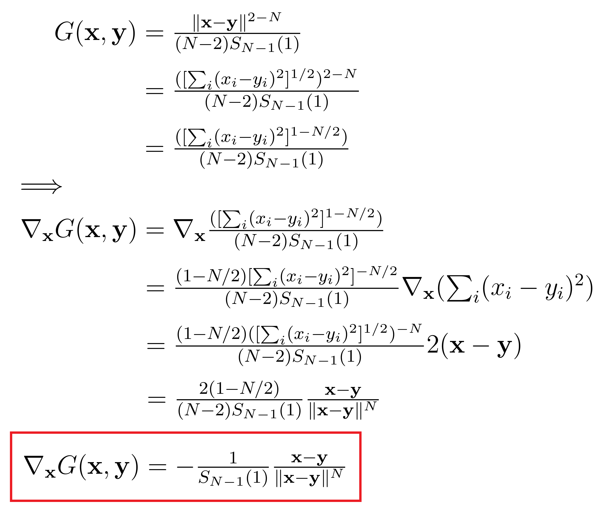

假设我们可以利用这个事实来估计泊松场，那么我们如何使用这个场来生成数据呢？

### PFGM 粒子动力学

从物理学中，我们知道力 **F** 和动量 **p** 的关系:

假设质量不是随时间变化的量，我们得到更常见的公式，其中 *m* 是质量， **v** 是速度:

独立地，电场 **E** 中带电荷 *q* 的粒子上的力 **F** 由下式给出

因此，我们可能倾向于用规范的牛顿方式来定义动力学:

我们把电荷和质量统一起来。然而，我们需要沿着电场线行进*，以便将我们的数据分布适当地转换成均匀的角度分布。也就是说，**我们必须从画面中移除惯性**。惯性是物体在外力的影响下避免运动变化的趋势，因此在没有惯性的情况下，粒子将沿着力场线移动。*

直觉

考虑一个物体(紫色球)在 XY 平面上以恒定的向上速度运动。在上半平面(y > 0 ),有一个指向 X 轴正方向的均匀力场。

如果物体在真空中移动，那么它在进入上半平面时将受到力场的作用，这样它的速度的 X 分量将线性增加，而它的速度的 Y 分量将保持不受影响。所以物体的轨迹会是一条抛物线，如下图。

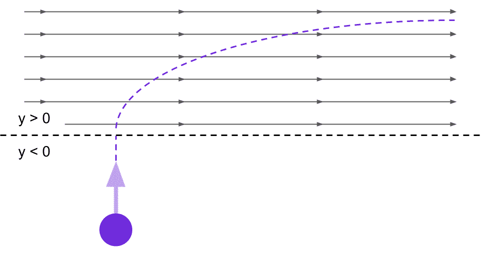

现在考虑如果上半平面充满像水一样的粘性流体会发生什么。在进入上半平面时，物体将像以前一样受到力场的作用，但这次将会有一个减速力，其分量在 X 和 Y 两个方向上。因此，物体速度的 Y 分量将不断减小，没有力来抵抗这种减速力。因此，物体的轨迹将不再是抛物线，而是如下图所示的曲线:

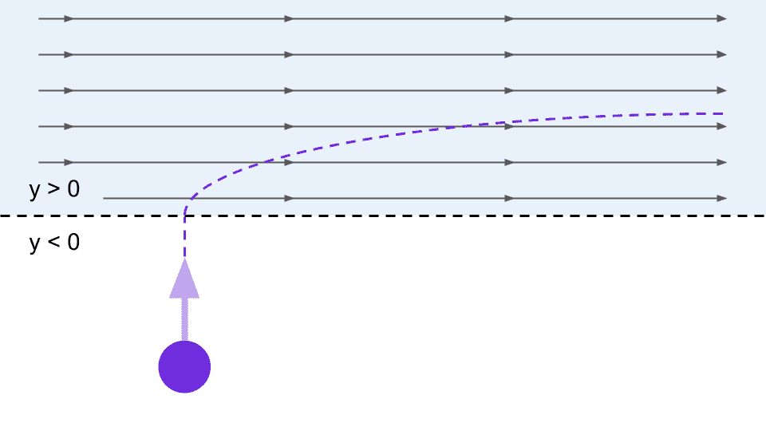

让我们提高这种液体的粘度，把它从水变成例如糖蜜。在这种情况下，减速力会更大，更快地抑制速度的 Y 分量，进一步“压缩”轨迹:

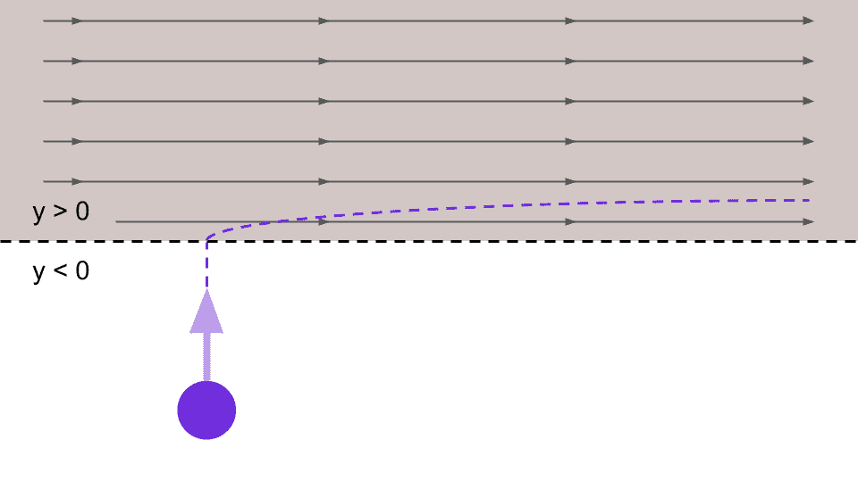

在极限情况下，在进入磁场时，物体的垂直速度将被完全消除，但仍有一个力作用在 X 方向。因此，物体将进入上半平面，并且**立即**开始跟随力场线。

请注意，物体速度的 X 分量将不会不受流体的影响——该方向的运动也将受到抑制，但重要的事实是，有一个恒定的力来对抗减速力，从而产生一个跟随场的轨迹，*,而不管物体沿着该轨迹*实际需要多长时间。

因此，我们将泊松场设置为不等于*速度*的时间导数，而是等于*位移*的时间导数。

也就是说，我们使用*一阶*导数，而不是将场设置为等于位移对时间的*二阶*导数。这将导致我们的粒子精确地沿着场线*，这是一个数学关系，一般适用于任何向量场。从物理角度来看，这种情况对应于所谓的**阻尼**运动，类似于粒子在泊松场的作用力下穿过粘性流体。*

 *PFGM 流动模型解释

对于那些感兴趣的人来说，同样值得注意的是，PFGMs 可以作为直接在概率密度上操作的**流模型。通用连续性方程可以表示为**

对于某些体积密度ρ，通量 **j** 和发电率σ。在我们的例子中，我们正在描述一个概率流，因此**发生率为零**，因为概率必须守恒。通量 **j** 就是分布乘以泊松场，留给我们

上面的方程是福克-普朗克方程的特例。[福克-普朗克方程](https://en.wikipedia.org/wiki/Fokker%E2%80%93Planck_equation)将随机变量的*概率分布*的(确定性)偏微分方程提供给由 [It & ocirc 过程](https://en.wikipedia.org/wiki/It%C3%B4_calculus)定义的相应随机微分方程。

上述方程是福克-普朗克方程的一个特例的原因是，它没有扩散项，因此有一个相应的 T2 确定性微分方程，而不是 T4 随机微分方程，在这种情况下是简单的

因此，从物理解释和概率流的角度来看，我们都得到了相同的正向微分方程。*  *假设粒子动力学完全由这个确定性过程定义，为了从 *z=0* 超平面中的任意紧凑分布映射到均匀的角度分布，**我们只需要计算(或估计)该分布产生的泊松场**。现在是时候从*实际*的角度重新审视我们上面的*理论*关于从一组点电荷估计泊松场的结果了。

### 估计泊松场

如前所述，将 N 维数据映射到 N 维半球的 PFGM 方法在采样过程中会出现模式崩溃。相反，作者引入了一个额外的维度 *z* ，将数据嵌入到 N+1 维空间的 *z=0* 超平面上。因此，扩充空间中的数据分布是

其中我们将原始数据分布乘以狄拉克δ函数。我们通过将被视为点电荷的每个数据点所产生的场相加，来计算该分布所产生的经验场:

正如我们在上面看到的，由于拉普拉斯的线性，这个等式是有效的。该场由**缩放 c** 是数值稳定性的乘数，这是完全有效的，并且仅通过时间上的重新缩放来修改动力学。

由于粒子遵循泊松场线，我们实际上并不关心这些线上任何一点的场的*大小*(只关心方向)。因此，我们将场标准化，以便将其转换为更有利于神经学习的形式。我们将**负归一化场**定义为

在这里，我们添加了负号，使字段指向数据分布。**负的归一化场是我们的神经网络将要学习的**。

我们随机采样空间中的许多点，因此我们可以计算真实经验场和我们的神经网络预测之间的损失。我们只是扰乱数据点。假设泊松场的曲率在数据分布附近比在远处更高，则空间中更接近数据分布的点被给予采样偏好，以便我们的函数逼近器更紧密地匹配该区域中的经验场。PFGM 的作者选择了以下方法对训练点进行抽样:

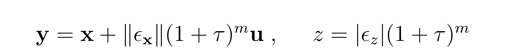

在哪里

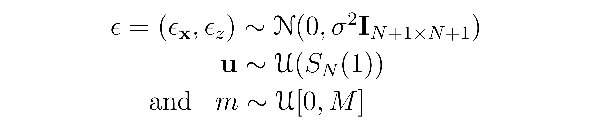

通俗地说，我们通过在随机方向上扰动数据点来创建训练数据点，从卡方分布(高斯的范数)中采样扰动的距离，总是确保在 *z* 方向上的扰动是正的。Tau 是一个超参数，它在学习数据分布附近的结构和远离数据分布的结构之间提供了一个折衷，tau 值越大，从远离数据分布的点采样的概率就越大。 *M* 定义了我们关心的建模数据分布的最大距离，在 PFGM 论文中从[0，300]均匀采样。

此过程的伪代码如下所示:

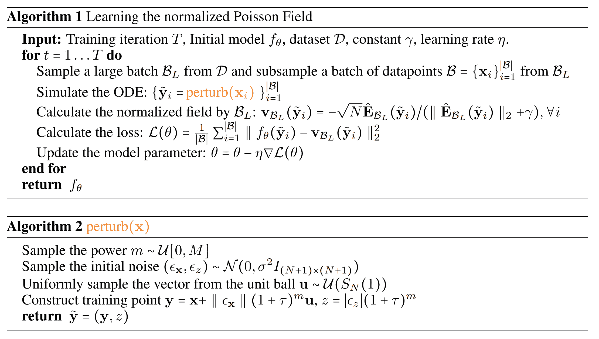

([source](https://arxiv.org/pdf/2209.11178.pdf))

如上所述，我们使用一个 **U-Net** 作为神经网络。它接受空间中的一个 N+1 维点，并返回该点的预测 N+1 维负归一化场。**损失**简单地说就是批量的平均 L2 损失，并且基于梯度的优化用于训练模型。

现在我们有了一种方法来训练经验场的函数逼近器，我们如何使用它来生成数据呢？

### 锚定向后的颂歌

回想一下上面定义前进动力的前进颂歌:

我们使用以下反向 ODE 进行采样:

关于标志的说明

到目前为止，我们已经在反向颂中放置了一个负号来表示我们正沿着田野向后行进。在这一点上的正向和反向 ode 被统一到使用负归一化场的上述等式中。沿着场线的方向可以简单地通过翻转积分边界来改变。

其中它被定义在增广空间上，并且真实泊松场 **E** 被负的归一化经验场 **v** 代替。现在我们有了定义反向动力学(以及采样过程)的 ODE，我们可能会认为问题已经解决了——只需将 ODE 插入 ODE 解算器来生成数据。

问题是**我们不知道每个轨迹**的开始和结束时间。也就是说，每个粒子在一个大半球上开始，并通过在 *z=0* 平面上的数据分布的反向演化，但我们不知道这个过程需要多长时间。为了避免这个问题，我们**将**固定到物理上有意义的变量 *z* 的 ODE，如下所示，其中 **v** 的下标表示场的分量。

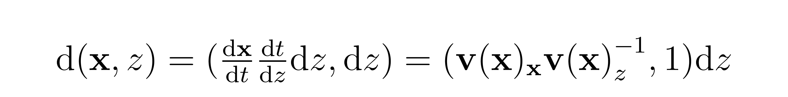

既然 ODE 是按照 *z* 来铸造的，我们知道每个粒子的终点是当它到达数据分布所在的 *z=0* 超平面时。粒子的起点是什么？

### 确定先验分布

在一个半球上均匀采样并使用产生的 *z* 分量作为 ODE 的起点是很容易的，但是有一个*的小问题。许多 ODE 求解器要求整批都具有相同的初始值。位于半球上的点有*许多不同的 z 值，*，所以这是一个小障碍。*

为了规避这个问题，半球上的均匀分布被**投影**到与半球顶部重合的超平面上，\( z_{max} \)。该投影是一个简单的**径向**投影，因为当 **x** 接近无穷大时，泊松场是纯径向的。我们可以在下面的 2D 看到一个示意图，红线将球体上的紫色点连接到它们在绿线上的投影点。

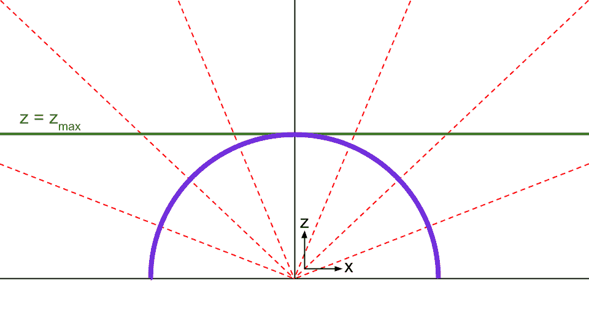

Radial projection of a 2-dimensional hemisphere

这种变换构成了超平面和半球之间的同胚映射——下面我们可以看到同胚映射在三维空间中的作用:

<https://www.assemblyai.com/blog/content/media/2022/10/output.mp4>

Radial projection of a 3-dimensional hemisphere

从这个投影中，我们得到超平面上的**先验分布，它告诉我们如何从\( z_{max} \)超平面中采样，其方式**等价于从半球中均匀采样**:**

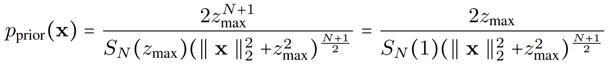

### 从数据分布中取样

现在，我们已经具备了使用 PFGM 从数据分布中生成样本所需的所有要素。首先，我们从上面定义的先验分布中对粒子群进行采样。因为分布是旋转对称的，所以从下面的分布中均匀地采样范数就足够了

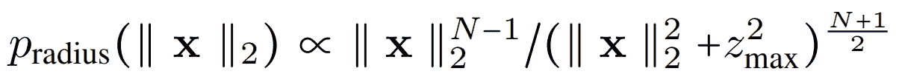

然后**从\( 0 \)到\( 2\pi \)均匀采样角度**。然后，作者改变变量以实现 z 维度上的**指数衰减**，用*t’*替换 *z* ，根据

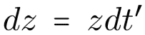

这是通过以下方式解决的

轨迹终点

注意，这种变量的变化将我们的起始 *\( z_{max} \)* 和结束 *\( z=0 \)* 分别转换为-log( *\( z_{max} \)* )和-log( *\( z_{min} \)* )，其中 *\( z_{min} \)* 是一个微小的正数，因为\( 0)的对数没有定义。

根据经验，变量的这种变化导致**的采样速度加快了 2 倍**,而不会损害样本质量。此外，直觉上讲，在 *z=0* 超平面附近采取较小的步长是明智的，以便更好地导航数据分布附近存在的更复杂的泊松场。

变量改变后相应的反向 ODE 是

其中 **v** 是负的归一化经验场，我们使用 U-Net 作为近似。**从这里开始，一个 ODE 求解器被用来**通过像 [RK45](https://en.wikipedia.org/wiki/Runge%E2%80%93Kutta%E2%80%93Fehlberg_method) 或[欧拉方法](https://en.wikipedia.org/wiki/Euler_method#:~:text=The%20Euler%20method%20is%20a,proportional%20to%20the%20step%20size.)这样的方法来求解 ODE。

### 摘要

我们将 PFGMs 的理论逻辑和实践细节总结如下:

1.  我们在 *z=0* 超平面中有一个连续、紧凑的数据分布。
2.  当被视为电荷分布时，该分布产生泊松场，其具有接近无穷大的**均匀角通量** **密度**。
3.  泊松场由数据分布唯一地生成**(给定良好的边界条件)。因此，沿着场线回到 *z=0* 超平面给了我们一种从数据分布中采样的方法。**
4.  **对应于随后的场线的正向 ODE 可以简单地通过将位移的时间导数设置为等于泊松场来获得。因此，泊松场是我们需要从数据分布中取样的唯一缺失部分。**
5.  **虽然我们无法得到泊松场的精确分析形式，但是我们可以通过从数据分布中采样的一组数据点来估计泊松场。泊松场大约是由每个被视为点电荷的数据点产生的场的总和，由于拉普拉斯算子是一个*线性*微分算子而被证明是合理的。我们称这种近似为**经验场**。**
6.  **我们试图训练一个神经网络来学习经验场。**
7.  **我们随机采样空间中的点，优先选择数据分布附近的点，因为泊松场在那里更复杂。在每个点上，我们计算*真实*经验场，其中点电荷的泊松场是通过对拉普拉斯的格林函数取负梯度而获得的。我们还计算神经网络在采样点的预测。**
8.  **我们将损耗计算为采样点上真实的和预测的归一化经验场之间的平均 L2 损耗。该损失与基于梯度的优化一起用于训练神经网络，在这种情况下，神经网络是 U-网( [DDPM++](https://openreview.net/pdf/ef0eadbe07115b0853e964f17aa09d811cd490f1.pdf) 主干)。**
9.  **在训练神经网络之后，我们使用 **ODE 解算器**沿着泊松场反向进化大半球上的均匀粒子群(从先前分布等效采样),直到我们到达数据分布的超平面，从该分布生成样本。**

## **结果**

**PFGMs 的早期结果令人印象深刻，充满希望。下面列出了将 PFGMs 应用于图像生成任务的一些要点:**

1.  **在 CIFAR-10 的[标准化流程模型](#flow-interpretation-dropdown)中，PFGMs 获得**最佳初始分数** (9.68)和**最佳 FID 分数** (2.35)。**
2.  **PFGMs 的推理速度比采用类似架构的 SDE 方法快**10-20 倍**，同时保持**可比的样本质量**。**
3.  **PFGM 容纳了许多不同的建筑。**
4.  **PFGMs 展示了**对更高分辨率图像生成的可扩展性****

**下面是 CIFAR-10 的结果表，将 PFGMs 与各种其他方法进行了比较:**

**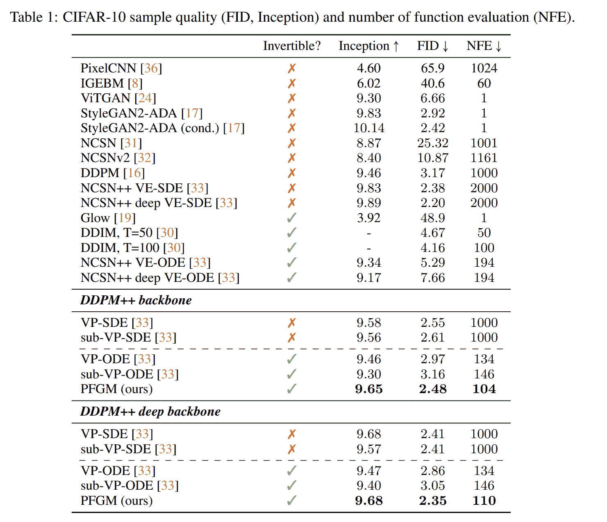

([source](https://arxiv.org/pdf/2209.11178.pdf))** 

### **PFGM 架构鲁棒性**

**作者使用 [DDPM++](https://openreview.net/pdf/ef0eadbe07115b0853e964f17aa09d811cd490f1.pdf) 架构获得最佳结果，这是早期扩散模型中使用的 [U-Net 架构](https://arxiv.org/pdf/2006.11239.pdf)的修改版本。然而，作者指出，PFGM 方法对不同架构的使用是稳健的。例如，Song et 中使用的方差保持(VP)和子方差保持(子 VP) ODEs 和 SDEs。艾尔。的工作在[基于分数的模型](https://openreview.net/pdf/ef0eadbe07115b0853e964f17aa09d811cd490f1.pdf)上展示了使用 DDPM++主干的强大性能，但受到 NCSNv2 架构的影响，在 CIFAR-10 上 FID 分数超过 90。另一方面，PFGMs 在 NCSNv2 中仍然表现良好。**

**PFGM 的作者假设，这一结果源于在基于分数的模型的训练中看到的强常模-方差相关性导致了这一问题。下图(a)显示了视频采样期间的范数-σ关系，图(b)显示了 PFGM 采样期间的范数-z 关系。阴影区域对应于标准的标准偏差。我们可以看到与 VE-ODE 有很强的相关性，但与 PFGM 没有相关性。**

**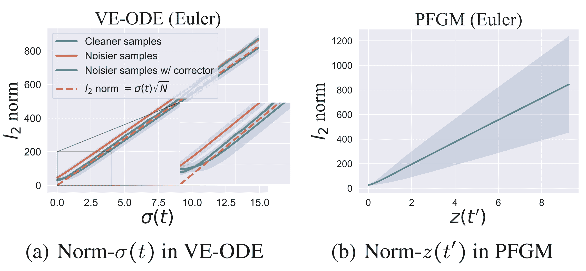

([source](https://arxiv.org/pdf/2209.11178.pdf))** 

**如果我们将这些规范的分布视为时间的函数(通过 PFGM 的 *z* 和 VE-ODE 的 *sigma* ，我们会看到以下内容:**

**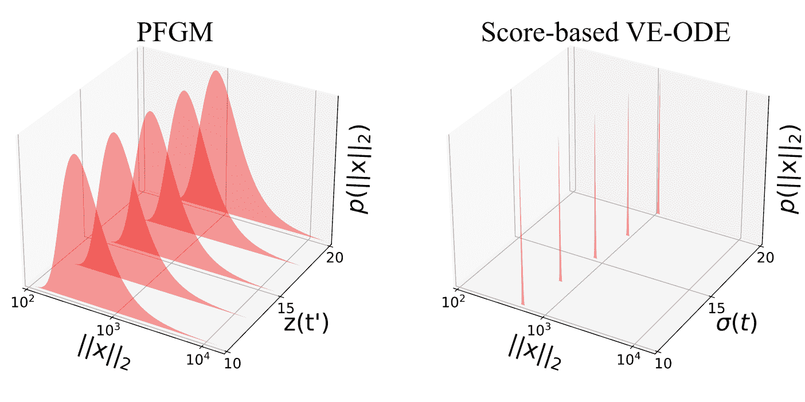

([source](https://arxiv.org/pdf/2209.11178.pdf))** 

**作者注意到，对于基于分数的模型，扰动训练样本的 L2 范数和高斯噪声的标准偏差是强相关的。这种观察导致了合理的假设，即如果轨迹在采样期间偏离这种相关性(绝大多数训练样本都遵循这种相关性)，那么性能将会下降。另一方面，PFGMs 中的标准分布在各种各样的值上，因为给定的半球获得许多不同的*z*-值。因此，与上述类似的逻辑导致了相应的假设，即 PFGMs 对于大范围的轨迹是**鲁棒的**。参见第节。4.2 在 [PFGM 的论文](https://arxiv.org/pdf/2209.11178.pdf)中了解更多详情。**

### **PFGM 步长鲁棒性**

**作者还指出，在像欧拉法这样的数值求解器中，PFGMs 对步长(或者，等价地，函数求值的次数)的变化是鲁棒的。他们指出，这为**在现实世界部署中用计算效率来权衡样本质量提供了一种便利的机制**。下图显示了几种不同生成方法的函数求值次数(NFE)与 CIFAR-10 上的 FID 分数。**

**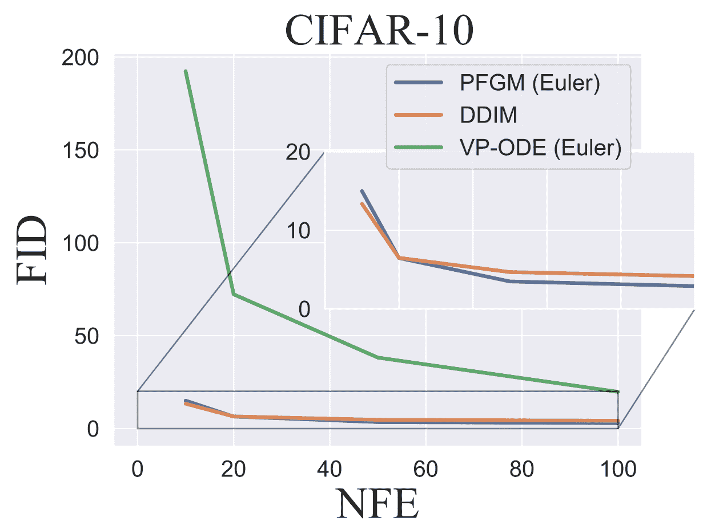**

### **PFGM 似然估计**

**PFGMs 构成了数据空间和具有已知先验的潜在空间之间的可逆映射(甚至更强的同胚映射)。显式地，映射 *M* 由下式给出**

**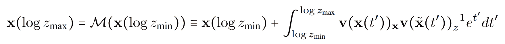**

****该映射的可逆性实现了可能性评估**。作者使用变量的瞬时变化公式来评估数据的可能性。该值以 bits/dim 为单位，与负离散对数似然成正比(更多细节见[此处](https://arxiv.org/pdf/1705.07057.pdf#page=12))。因此，我们寻求*最小化*这个值。PFGM 的作者报告了许多方法在(统一去量化的)CIFAR-10 测试集上的 bits/dim，报告如下**

**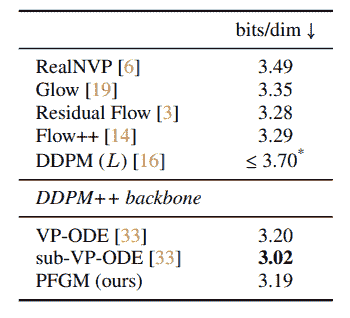**

**子 VP-ODE 显示了最好的结果，尽管它的样本质量比 VP-ODE 和 PFGM 差。作者将可能性和质量之间的权衡留给了未来的工作。**

### **PFGM 潜在操纵**

**考虑到 *M* 的可逆性，作者还指出，样本被唯一地识别为它们的潜在表征，这允许我们通过它们的潜在表征来操纵图像。例如，简单地对潜在空间中的线性插值点进行解码产生了一种在图像之间进行插值的简单方法，下面使用 CelebA 图像进行了演示:**

**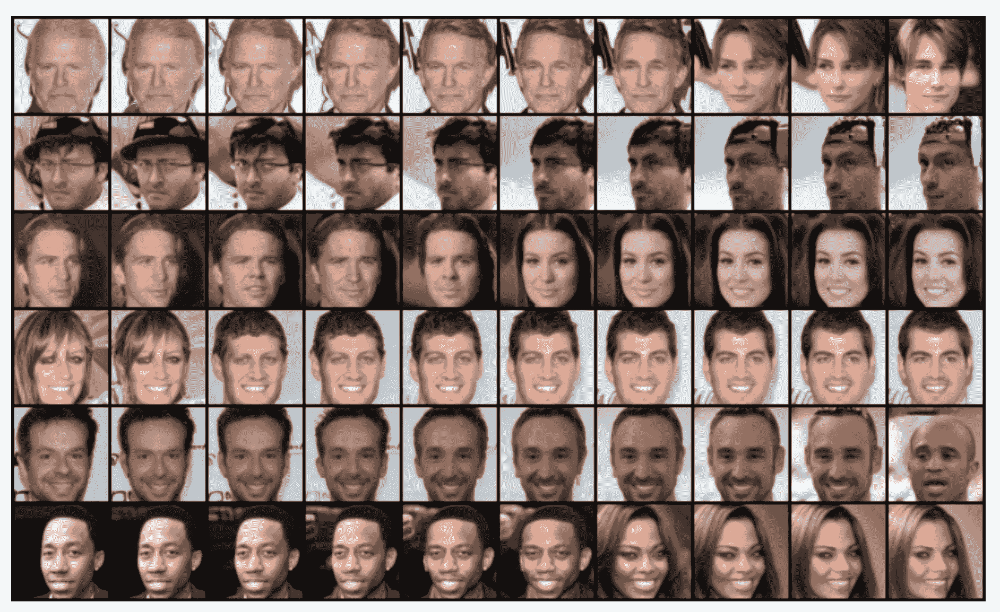**

**类似地，我们可以执行其他操作，如温度缩放，如下所示，再次使用 CelebA 数据集:**

**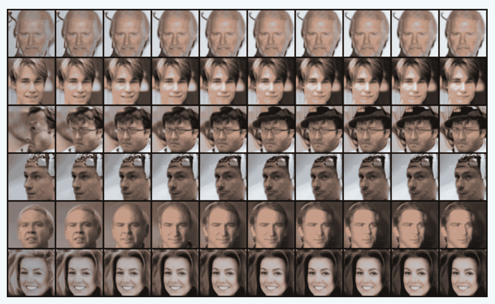**

### **有待改进的领域**

**PFGMs 为新的研究途径提供了一个非常有前途的基础。这里列出了两种这样的途径。**

**第一个途径是一个次要的细节，但有利于数学的一致性。为了数学上的方便，PFGM 模型假设连续的**紧凑的**分布。虽然这一要求在实践中不成问题，但最好证明这些结果也适用于非紧分布，这在给定有限积分值(这是概率密度的保证)的情况下似乎是直观合理的。**

**第二个需要改进的地方是提高分辨率。虽然作者证明了 PFGMs 在 256x256 LSUN 卧室图像的更高分辨率下产生合理的结果，但是在更高分辨率(如 512 x 512 或 1024 x 1024)下产生高质量图像的能力尚未得到证明。**

**一个潜在的研究途径是将 PFGMs 和扩散模型结合成一个更大模型的组成部分。例如，**用 PFGM** 替换 [Imagen](https://www.assemblyai.com/blog/minimagen-build-your-own-imagen-text-to-image-model/) 中的初始基本扩散模型，但保持扩散模型超分辨率链不变，这可能是一个强大的修改(更多细节请参见[此处](https://www.assemblyai.com/blog/how-imagen-actually-works/#how-imagen-works-a-birds-eye-view))。正如 PFGM 的作者指出的，扩散模型可能需要许多函数评估，并且不像 PFGMs 那样提供可逆性。因此，这些弱点可以通过使用 PFGM 来解决，同时保持超分辨率链完整无缺地放大图像。**

## **最后的话**

**PFGMs 为生成模型领域提供了有价值的贡献，早期结果是有希望的。在扩散模型和 PFGMs 的情况下，分别利用预先存在的领域知识、热力学和电动力学的创新模型，为新的机器学习方法的持续发展提供了一种有前途的方法。**

**对于更多的机器学习内容，请随时查看我们的[博客](https://www.assemblyai.com/blog/)教程，如关于[构建自己的文本到图像模型](https://www.assemblyai.com/blog/minimagen-build-your-own-imagen-text-to-image-model/)和[运行稳定扩散](https://www.assemblyai.com/blog/how-to-run-stable-diffusion-locally-to-generate-images/)的教程。**

**或者，查看我们的 [YouTube](https://www.youtube.com/c/AssemblyAI) 频道的内容，比如我们的[机器从头学习](https://www.youtube.com/watch?v=p1hGz0w_OCo)系列，或者在[推特](https://twitter.com/AssemblyAI)上关注我们，以了解我们未来放弃的内容。**

 **喜欢这篇文章吗？

关注我们的时事通讯，了解更多类似的内容！

[Follow](https://assemblyai.us17.list-manage.com/subscribe?u=cb9db7b18b274c2d402a56c5f&id=2116bf7c68)*******