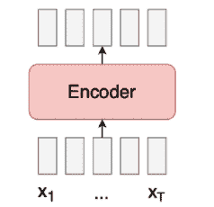
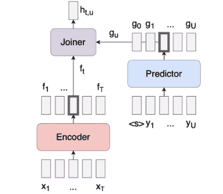
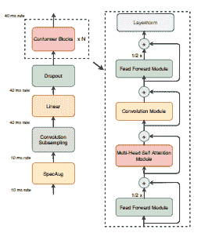

# ASR 传感器模型综述

> 原文：<https://www.assemblyai.com/blog/an-overview-of-transducer-models-for-asr/>

在深度学习和语音识别的背景下，有三种主要类型的神经网络架构被广泛使用:连接主义者时间分类(CTC)、听-听-拼(LAS)模型和转换器(如果仅使用递归神经网络及其变体，也称为 RNNTs)。

换能器最近已经成为大多数 ASR 任务中性能最好的模型架构，并且[已经超过了 CTC 和 LAS 模型](https://paperswithcode.com/task/speech-recognition)，尽管每种架构都有其优缺点。在本文中，我们将更仔细地研究传感器架构。

## 传感器原点

RNNTs 或递归神经网络传感器是由 Alex Graves 在 2012 年的论文“[用递归神经网络进行序列转导](https://arxiv.org/abs/1211.3711)”中首次提出的。Alex Graves 还(令人印象深刻地)撰写了著名的 CTC 论文，“[连接主义时间分类:用递归神经网络](https://www.cs.toronto.edu/~graves/icml_2006.pdf)标记未分段的序列数据”，发表于 2006 年。

RNNTs 受到 CTC 高度依赖外部语言模型来良好运行的局限性的启发。然而，RNNTs 并没有得到任何真正的重视，直到 2018 年的论文“[面向移动设备的端到端语音识别流](https://arxiv.org/pdf/1811.06621.pdf)，该论文展示了在移动设备上使用 RNNTs 进行准确语音识别的能力。

本文重新对传感器架构进行了研究，推动传感器模型在过去几年中实现了最先进的精度。

## RNNTs

为了理解传感器，我们可以参考亚历克斯·格雷夫斯的原始论文“递归神经网络的序列转导”创建 RNNTs 是为了解决 CTC 模型的一些缺点，CTC 模型需要外部语言模型才能很好地运行。

CTC 模型有一个模块，即编码器，用于模拟声学特征。

[CTC model architecture](https://lorenlugosch.github.io/posts/2020/11/transducer/)

假设 CTC 模型预测是相互独立的。为了使这个概念更加具体，我们来看一个简单的例子。

想象一个 CTC 模型输出抄本`"I have for apples"`。作为一个阅读本文的人，您可以立即发现错误。`"I have for apples"`应该是`"I have four apples"`。

对于 CTC 模型来说,`"for"`和`"four"`一样敏感，因为它们在发音上是相似的。由于 CTC 模型的输出有条件地相互独立，所以单词`"for"`的输出没有考虑单词`"I have ... apples"`的周围环境。

这个缺陷是 CTC 损失函数的固有属性。为了帮助缓解这个问题，某些神经网络层，如递归神经网络或变压器，可以在内部学习根据声学特征对周围环境进行建模。然而，因为 CTC 损失函数仍然是有条件独立的，所以 CTC 模型仍然会犯这些类型的语言错误，并且理论上总体上不太准确，因为 CTC 损失函数没有结合上下文。

由于这些缺点，CTC 模型需要一个外部语言模型，对数百万到数十亿个句子进行单独训练，以纠正 CTC 模型可能输出的任何语言错误。

与 CTC 模型相比，RNNT 模型有三个联合训练的模块:编码器、预测器和联合网络。这三者各有其目的。

[RNNT model architecture](https://lorenlugosch.github.io/posts/2020/11/transducer/)

编码器模拟语音的声学特征，预测器充当语言模型，从训练数据中学习语言信息。最后，联合网络接收来自编码器和预测器的预测以产生标签。

预测器和加入者网络是有条件依赖的，因此下一个预测依赖于前一个预测。共同训练的模块的这些组合使得不需要外部语言模型来获得高准确度。

在 AssemblyAI，我们最近将我们的核心转录模型从 CTC 模型过渡到传感器模型，并实现了[大幅提高的准确性](https://www.assemblyai.com/blog/releasing-our-v8-transcription-model-major-accuracy-improvements/)。然而，我们用变压器，特别是变压器的构象变体来代替递归神经网络。

## 变压器传感器

在 Alex Graves 的原始论文“用递归神经网络进行[序列转导”中，在模型架构中使用了 RNN 层。](https://arxiv.org/abs/1211.3711)

递归神经网络已经不再是建模顺序数据的首选架构。在论文“[注意力是你所需要的全部](https://arxiv.org/abs/1706.03762)”中首次介绍的变形金刚，在谈到 NLP 和语音研究时，一直处于人们关注的中心。

变形金刚从连续数据中模拟全局特征的能力是它如此强大的原因。然而，对于语音，不仅查看音频数据中的全局特征，而且查看局部特征是有意义的，因为声学特征更有可能与相邻特征相关，而不是与远处的特征相关。

Conformer 是在论文“ [Conformer:用于语音识别的卷积增强转换器](https://arxiv.org/pdf/2005.08100.pdf)”中首次介绍的转换器的变体。这篇论文的主题是，通过在变压器的自关注层之间插入卷积神经网络层，该模型被迫同时关注局部和全局特征，从而获得两个世界的最佳效果！

[Conformer module, image taken from the paper [Conformer: Convolution-augmented Transformers for Speech Recognition](https://arxiv.org/pdf/2005.08100.pdf)]

## 我们在 CTC 和传感器实验中学到了什么

CTC 模型和传感器在现实世界中都表现良好。然而，传感器类型的模型显然是一条路要走，因为它们在准确性方面领先于 CTC 和 LAS 语音识别架构。在过去的几年里，通过数百次实验，我们发现了 CTC 相对于传感器的一些优点和缺点。

### CTC 优势

*   **CTC 车型更容易训练！**CTC 型号只有一个模块，即编码器。这种简单性使得 CTC 很容易训练。
*   有更多资源可用于 CTC 型号。由于长期以来 CTC 模型一直是最受欢迎的语音识别架构，因此有大量的研究和开源工具来帮助您快速构建和训练它们。

### CTC 的缺点

*   **CTC 车型收敛较慢！**虽然 CTC 模型更容易训练，但我们注意到它们的收敛速度比传感器模型慢得多。当训练 CTC 模型时，总是需要比换能器更多的迭代来获得类似的结果。
*   **CTC 机型用专有名词更差。**说到专有名词，CTC 模型似乎不太准确。专有名词是训练语料库中可能有也可能没有的罕见单词。
*   **CTC 模型需要一个外部语言模型** (LM)才能运行良好。

### 传感器优势

*   **传感器型号收敛速度更快！**通过更快的收敛，我们能够进行更多的实验，减少深度学习研究的反馈回路。
*   **传感器模型更精确，即使参数更少。**总的来说，我们发现转换器模型对专有名词更准确(+24.47%)，整体转录准确性(+18.72%)，即使它比类似的 CTC 模型更小。

### 传感器缺点

*   传感器模型更难训练。必须联合训练三个网络的复杂性增加了 bug 的表面积！
*   **传感器型号具有更大的内存足迹**，使得训练更大的型号更加困难。
*   **传感器型号可利用的在线资源**较少。在一致性和传感器模型方面，我们几乎处于最前沿，所以在网上搜索答案通常不会得到任何结果。

根据我们的经验，对于传感器来说，利大于弊。通过在 AssemblyAI 切换到使用传感器，我们的研究团队已经能够探索 ASR 研究的前沿，并通过我们的[语音到文本 API](https://www.assemblyai.com/) 为我们的客户和开发人员提供最先进的准确性。

想要更多这样的帖子吗？

订阅我们的每周时事通讯。

[Sign-up now](https://assemblyai.us17.list-manage.com/subscribe?u=cb9db7b18b274c2d402a56c5f&id=2116bf7c68)