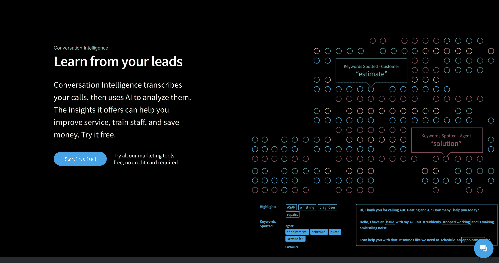

# CallRail 通过 AssemblyAI 的语音转文本 API 增强了对话智能的领导力

> 原文：<https://www.assemblyai.com/blog/callrail-amplifies-conversation-intelligence-leadership-with-assemblyais-speech-to-text-api/>

## 挑战

CallRail 是面向中小型企业和营销机构的领先 SaaS 解决方案，提供营销分析产品，包括呼叫跟踪、表单跟踪和对话智能以及集中式业务通信解决方案。CallRail 帮助他们的客户了解哪些营销活动推动了与潜在客户的最佳对话，以及改善客户服务的实时数据，以便他们可以有效地投资预算并达成更多业务。

为了扩展这些一流的营销分析功能，CallRail 希望与现代的[语音转文本 API](https://www.assemblyai.com/blog/how-to-choose-the-best-speech-to-text-api-for-your-product/) 合作，以提高[对话智能](https://www.callrail.com/conversation-intelligence/)转录的准确性和质量。

然而，该公司的需求超出了基本的通话记录。为了在对话智能领域处于领先地位，CallRail 还希望提升其 PII 修订功能、总体报告准确性以及数据分类和资格认证方式。

CallRail 前产品总监迈克尔·坎特雷尔(Michael Cantrell)解释说:“对我们的许多客户来说，知道有对话是第一步。“能够一眼就知道对话的内容，这可以让他们真正了解自己的业务以及客户对他们的看法。它可以帮助我们的客户用他们正在使用的语言更好地达成交易，并改进他们的营销工作。”

## 解决方案

CallRail 的搜索让他们找到了 AssemblyAI，一个高精度的语音转文本 API，一个[广泛的功能列表](https://www.assemblyai.com/features)，并在电话行业取得了成功。

CallRail 最初的实现集中在两个主要的 AssemblyAI 特性上:[自动副本高亮显示](https://docs.assemblyai.com/guides/auto-detecting-key-phrases-words-in-the-transcription-text)和 [PII 修订](https://docs.assemblyai.com/guides/redact-pii-from-transcriptions)。

AssemblyAI 的自动转录突出显示功能可以自动检测转录文本中的关键短语和单词。这一功能使 CallRail 能够在给客户的电话中自动呈现和定义关键内容，例如特定的客户请求、常见问题以及常用的关键字和短语。它还能让 CallRail 用户“一目了然”地更好地理解电话内容

AssemblyAI 的 PII 密文功能会自动检测并删除抄本文本中的敏感数据。这可能包括社会安全号、信用卡号、个人地址等等。

总之，这些功能使 CallRail 能够为其客户提供强大的对话智能解决方案。

CallRail 同样很高兴能在 AssemblyAI 找到合作伙伴，assembly ai 的开发人员和深度学习工程师团队与该公司密切合作，优化 API 以满足 CallRail 的需求。

“我们能够在首次展示时直接与 AssemblyAI 合作，并且实现了相对简单的切换，”Cantrell 解释道。“持续的支持过去是，现在仍然是出色的。AssemblyAI 自始至终都觉得自己是一个真正的合作伙伴。”

## 结果呢

借助 AssemblyAI，CallRail 的通话记录准确率**提高了 23%,使用其产品**的客户数量增加了一倍。

两家公司之间的反馈循环也是一个巨大的积极因素。例如，当新冠肺炎·疫情开始出现在对话中时，这个新术语不在 AssemblyAI 的模型词汇表中。CallRail 将这些信息传递给 AssemblyAI，assembly ai 的团队能够添加这些信息，并通过快速周转提高整体转录准确性。AssemblyAI 的 API 产生的高级自动标点和大小写也对 CallRail 的抄本的可读性产生了重大影响。

作为一家深度学习公司，AssemblyAI 致力于持续改进和创新。其专门的内部研究团队每周向 production weekly 推送精度更新，包括最近对递归神经网络传感器(RNNT)模型架构的[更新，将精度](https://www.assemblyai.com/blog/releasing-our-v8-transcription-model-major-accuracy-improvements/)提高到行业最佳水平。

“这种方法让我们放心，我们的产品将始终提供出色的转录。我们可以利用更新的功能为我们的客户带来更强大的分析，”Cantrell 说。

这包括计划在不久的将来将 AssemblyAI 的新主题检测和内容安全检测功能集成到 CallRail 平台，为客户提供更多信心，相信他们有能力通过该解决方案改善客户体验和呼叫转化率。