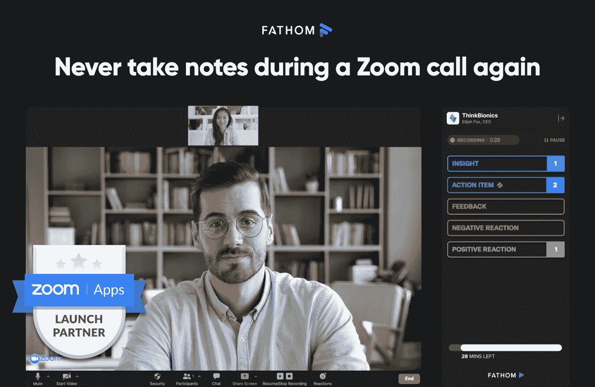
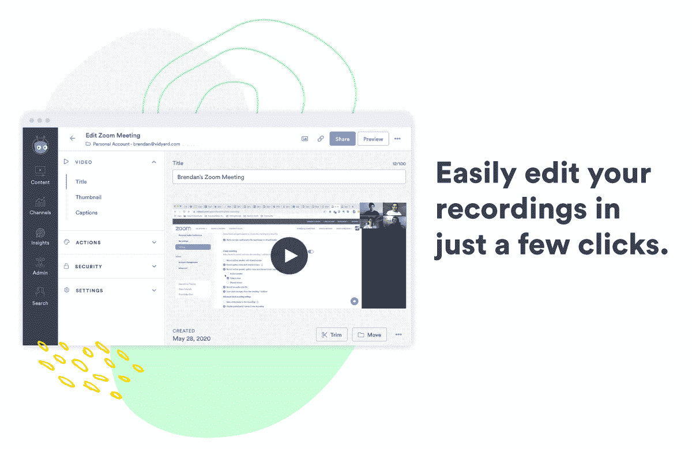
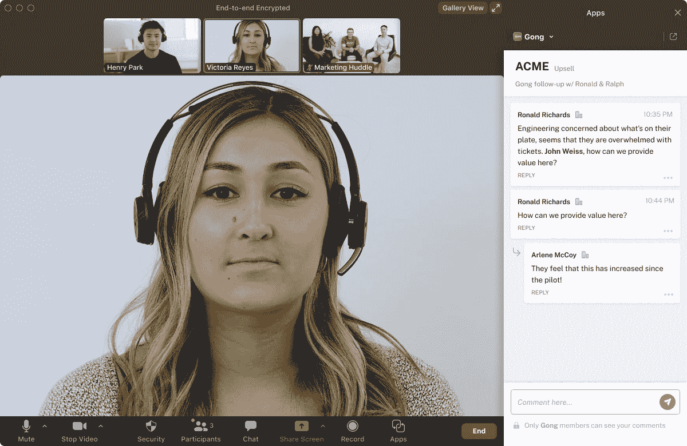

# 比较语音到文本 API 之间的缩放转录准确性

> 原文：<https://www.assemblyai.com/blog/comparing-zoom-transcription-accuracy-across-speech-to-text-apis/>

Zoom 每年托管 3.3 万亿份会议纪要，比去年同季度增长 3，300%。这大约是今年世界上每个人使用 Zoom 进行 7 小时会议的时间。

很明显，Zoom 正在改变我们的学习和工作方式，许多新的软件公司通过在 Zoom 基础上构建他们的解决方案来进一步推动这种采用。最近推出的 [Zoom Apps](https://marketplace.zoom.us/?undefined) 让我们更容易利用这些新的集成从对话中获得更多信息，一些例子包括:

### [英寻](https://marketplace.zoom.us/apps/JgSwuY4ZSGim6_OPRZV0Ig?undefined)

记录、转录并突出显示 Zoom 电话中的关键时刻，这样您就可以专注于谈话，而不是做笔记



### 维德亚德

****‍**** 自动将您的缩放会议和网络研讨会录像发送到一个视频平台，您可以在该平台上主持、编辑和安全地共享您的视频



### [龚](https://marketplace.zoom.us/apps/67fty21DScCagk_WUOjfkQ?undefined)

在会议期间，撰写评论并与贵公司的其他 Gong 用户进行实时协作



Zoom 及其所有的集成合作伙伴正在丰富我们正在进行的虚拟对话；帮助我们记住我们讨论的内容，并强调我们可能没有意识到的见解(如谁说得更多，讨论了什么主题等)。

自动语音识别(ASR)是这些平台的核心，转录准确性是这些公司的产品经理和开发人员的首要任务，以确保他们建立尽可能最好的功能。

在这份基准报告中，我们发现了各种使用案例中的变焦记录，从产品演示和内部业务会议，到学校和健身房的在线直播课程。然后，我们将 AssemblyAI、Google Cloud 语音转文本和 AWS Transcribe 之间哪些 ASR 模型的转录准确率最高进行了并排比较。

我们还使用 AssemblyAI 的丰富模型来分享这些相同缩放记录的结果，这些模型用于[主题检测](https://docs.assemblyai.com/guides/iab-categorization?undefined)、[关键词检测](https://docs.assemblyai.com/guides/auto-detecting-key-phrases-words-in-the-transcription-text?undefined)、 [PII 编辑](https://docs.assemblyai.com/guides/redact-pii-from-transcriptions?undefined)和[内容安全检测](https://docs.assemblyai.com/enterprise/content-safety-detection?undefined)。

## 语音识别准确性

### 我们的数据集

为了给出全面的准确性结果，我们使用了销售演示、网络研讨会、在线课堂、烹饪教程和健身小组课程的变焦记录。这提供了各种口音、音频质量、扬声器数量和特定于行业的词汇。

以下是关于我们数据集的更多信息:

[https://airtable.com/embed/shryTf4jiTKYs9lRP?backgroundColor=blue&viewControls=on](https://airtable.com/embed/shryTf4jiTKYs9lRP?backgroundColor=blue&viewControls=on)

### 我们如何计算精确度

1.  首先，我们通过 API(assembly ai、Google 和 AWS)自动转录数据集中的文件。
2.  第二，我们由人类转录员转录数据集中的文件，准确率接近 100%。
3.  最后，我们将 API 的转录与我们的人类转录进行比较，以计算单词错误率(WER)——更多内容见下文。

下面，我们概述了每个转录 API 在每个音频文件上实现的准确度分数。每个结果都超级链接到人类转录本与每个 API 自动生成的转录本之间的差异。这有助于突出人工转录和自动转录之间的关键差异。

### 准确性结果

[https://airtable.com/embed/shrstbrzRH0RSaPl0?backgroundColor=blue&viewControls=on](https://airtable.com/embed/shrstbrzRH0RSaPl0?backgroundColor=blue&viewControls=on)

### 精确度平均值

[https://airtable.com/embed/shry7FIqxgytxJsJJ?backgroundColor=blue&viewControls=on](https://airtable.com/embed/shry7FIqxgytxJsJJ?backgroundColor=blue&viewControls=on)

### WER 方法论

使用单词错误率(WER)计算上述准确度分数。WER 是计算自动语音识别系统准确度的行业标准度量。WER 将每个文件的 API 生成的转录与人类转录进行比较，计算自动化系统进行的插入、删除和替换的数量，以导出 WER。

在计算特定文件的 WER 之前，真实(人工转录)和自动转录都必须被规范化为相同的格式。这是团队经常错过的一步，最终导致误导性的 WER 数字。那是因为根据 WER 算法，“你好”和“你好！”是两个不同的词，因为一个有感叹号，而另一个没有。这就是为什么，为了执行最准确的 WER 分析，所有标点符号和大小写都从人工和自动抄本中删除，并且所有数字都被转换为口语格式，如下所述。

为了 example:‍

**真相:** `Hi my name is Bob I am 72 years old.`

****常态化真相**:**

## 装配富集

### 话题检测

我们的[主题检测](https://docs.assemblyai.com/enterprise/iab-categorization?undefined=)功能使用 IAB 分类法，可以对多达 698 个可能主题的转录文本进行分类。例如，在 Zoom 上流式传输的特斯拉发布事件将被分类为`"Automobiles>SelfDrivingCars"`主题等。

您可以在 [AssemblyAI 文档](https://docs.assemblyai.com/guides/iab-categorization?undefined)中找到可以检测到的所有主题类别的列表。

### 关键词检测

AssemblyAI 还可以根据转录文本自动提取关键字和短语。下面是一个示例，展示了该模型如何在一个小型转录文本样本上工作。

原始转录:

```py
Hi I'm joy. Hi I'm Sharon. Do you have kids in school? I have grandchildren in school. Okay, well, my kids are in middle school in high school. Do you think there is anything wrong with the school system?
```

检测到的关键字:

```py
"high school"
"middle school"
"kids"
```

使用相同的数据集，我们包括了在以下每个文件中自动检测到的主题和关键字:

[https://airtable.com/embed/shrsNq5T6nm76gy4Z?backgroundColor=blue&viewControls=on](https://airtable.com/embed/shrsNq5T6nm76gy4Z?backgroundColor=blue&viewControls=on)

### PII 修订版

缩放会议可能包含敏感的客户信息，如信用卡号、地址和电话号码。其他敏感信息，如出生日期和医疗信息也可以存储在录音和文字记录中。AssemblyAI 为通过我们的 API 运行的抄本和音频文件提供了 PII 检测和编辑。

你可以在 [AssemblyAI 文档](https://docs.assemblyai.com/guides/redact-pii-from-transcriptions?undefined)中了解更多关于这是如何工作的。我们的 PII 检测和编辑功能可以检测的完整信息列表如下:

[https://airtable.com/embed/shrG1wmEi19uQ4o3w?backgroundColor=blue&viewControls=on](https://airtable.com/embed/shrG1wmEi19uQ4o3w?backgroundColor=blue&viewControls=on)

启用 PII 检测和修订后，我们通过我们的 API 运行上面的缩放记录，为每个记录生成一个修订的副本。下面是其中一段录音的摘录，下面是完整转录的链接。

```py
Good afternoon. My name is [PERSON_NAME] and I will be your
[OCCUPATION] [OCCUPATION] today. Hey, everyone, welcome to the
[ORGANIZATION] one on one webinar. Before I get started, let's
quickly cover  a few housekeeping items. If you have any questions,
we will have a Q and A session at the end, so please submit questions
that pops up during the webinar. I have several colleagues on the
line to help you answer questions during the Webinar. We have
[OCCUPATION], [OCCUPATION], [OCCUPATION] [OCCUPATION], [OCCUPATION]
[OCCUPATION], and so on. Everyone on here is on mute except me, so
please use the Q amp a feature. This session is up to an hour long, so
if you need to drop off, this webinar is recorded and will be shared
with you later on. So it's up to you if you'd like to  follow along with
my examples or sit back and enjoy the show. So my name is [PERSON_NAME]
[PERSON_NAME] and I'm the [OCCUPATION]  OCCUPATION] at [ORGANIZATION].
You're probably wondering  what's our [OCCUPATION] [OCCUPATION] I work
in our [ORGANIZATION] [ORGANIZATION] [ORGANIZATION] and I serve as an
expert on the key use cases and features of the [ORGANIZATION] platform.
```

[https://airtable.com/embed/shrC1ZYS5IeN3T9nw?backgroundColor=blue&viewControls=on](https://airtable.com/embed/shrC1ZYS5IeN3T9nw?backgroundColor=blue&viewControls=on)

### 内容安全检测

此功能可以标记包含敏感内容(如仇恨言论、公司财务、赌博、武器或暴力)的 Zoom 转录部分。AssemblyAI API 将标记的内容的完整列表可以在 [API 文档](https://docs.assemblyai.com/guides/content-safety-detection?undefined)中找到。

试图自动化这一过程的遗留软件采用“黑名单”方法——寻找特定的词(例如，“枪”)，以便标记敏感内容。这种方法非常容易出错，而且很脆弱。以“玉米煎饼被炸了”为例。

由于 AssemblyAI 的内容安全检测模型是使用最先进的深度学习模型构建的，因此我们的模型在决定何时标记一段内容时会查看一个单词/句子的整个上下文——我们不依赖于容易出错的反向列表方法。

下面我们回顾一下 AssemblyAI 的内容安全检测功能对上述数据集的检测结果:

[https://airtable.com/embed/shrBvaBub2sHKQQmd?backgroundColor=blue&viewControls=on](https://airtable.com/embed/shrBvaBub2sHKQQmd?backgroundColor=blue&viewControls=on)

## 基准测试您的数据

提供商之间的准确性基准测试需要时间和金钱来运行您的内容。我们为任何寻求转录解决方案的团队提供免费的基准报告。要开始使用免费的基准测试报告，您可以点击[这里](https://www.assemblyai.com/benchmark)。