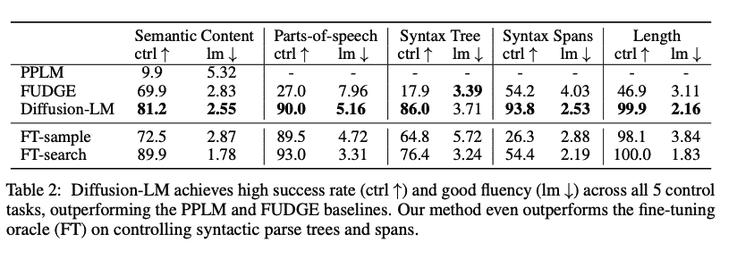
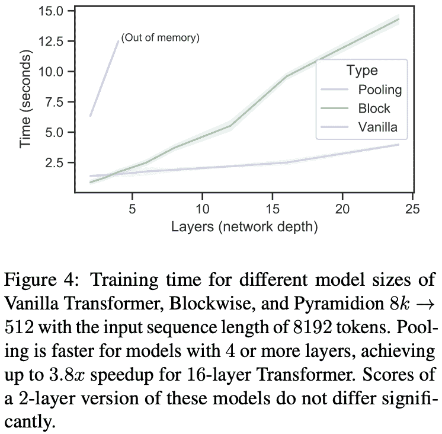

# 深度学习论文摘要-扩散和变压器模型

> 原文：<https://www.assemblyai.com/blog/deep-learning-paper-recap-diffusion-and-transformer-models/>

本周深度学习论文点评是 [*Diffusion-LM 改进可控文本生成*](https://arxiv.org/abs/2205.14217) 和 [*使用可训练表示池*](https://arxiv.org/pdf/2009.05169v4.pdf) *稀疏化变压器模型。*

## 扩散 LM 改进了可控的文本生成

### 这篇论文有什么令人兴奋的地方

[本文](https://arxiv.org/abs/2205.14217)是*连续* [扩散模型](https://www.assemblyai.com/blog/diffusion-models-for-machine-learning-introduction/)首次应用于可控 NLG(自然语言生成)的任务，允许使用基于梯度的方法。

在马尔可夫链的末尾增加了创新的“舍入”和“嵌入”步骤，将一个*离散的*问题转换为一个*连续的*问题。

### 主要发现

在各种可控的文本生成任务上，如语义内容、词性、语法树、语法跨度、长度和左/右上下文，作者能够胜过现有的方法，如 [PPLM](https://openreview.net/forum?id=H1edEyBKDS) 和[忽悠](https://aclanthology.org/2021.naacl-main.276/)。

扩散 LM 无法像 LM(语言模型)一样对每个任务进行微调，但是在这里，LM 被冻结，允许相同的 LM 用于各种任务。

[Source](https://arxiv.org/abs/2205.14217)

### 我们的外卖

进一步的研究是必要的，但令人兴奋的是看到扩散建模技术被用于 NLG 领域，并在图像/音频合成领域取得成功。

然而，必须解决的一个主要瓶颈是解码速度慢。Diffusion-LM 比自回归文本生成慢大约 7 倍，只有最少数量的扩散步骤(200，而大约 2000 更典型)。

## 使用可训练表示池来稀疏化变压器模型

### 这篇论文有什么令人兴奋的地方

[本文](https://arxiv.org/pdf/2009.05169v4.pdf)提出了一种稀疏化变压器架构的新方法，实现了次线性时间和存储复杂度。这种方法被称为*表示池*，它根据下游任务的优势学习选择最佳表示。

本文还提出了一种逐次减半的 Top-k 算子，它在逼近质量和速度方面都优于以前的方法。

作者提供了它的差分性质的详细分析，并证明它是可以以端到端的方式训练的。

### 主要发现

使用可训练表示池的实验在训练期间实现了 1.8 倍的加速，在推理期间实现了 4.5 倍的加速。

长文档摘要任务的结果表明，即使是简单的基线也能与当前的 SOTA 相媲美。

[Source](https://arxiv.org/pdf/2009.05169v4.pdf)

### 我们的外卖

表示池与带有可训练参数的评分函数相结合，可以帮助减少 transformer 体系结构的时间和存储复杂性，同时保持长文档摘要的高质量性能。

然而，这种技术对于输入序列长度较短的任务(如句子级翻译)可能不太有用。

