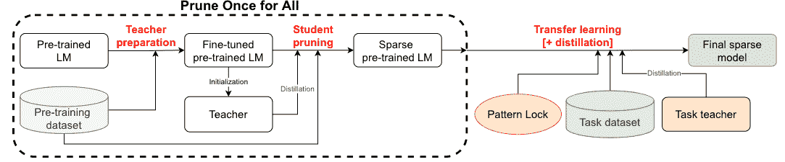
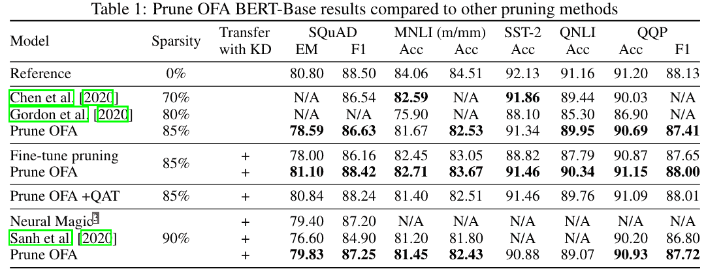

# 深度学习论文摘要-语言模型

> 原文：<https://www.assemblyai.com/blog/deep-learning-paper-recap-language-models/>

本周的深度学习论文回顾是 [*一劳永逸:稀疏预训练语言模型*](https://arxiv.org/pdf/2111.05754.pdf)

### **这篇论文有什么令人兴奋的地方？**

模型剪枝是压缩深度学习模型的关键方法之一，剪枝技术因模型架构而异。[本文](https://arxiv.org/pdf/2111.05754.pdf)介绍了一种训练稀疏预训练语言模型的架构不可知方法。

这种方法使我们能够在预训练阶段只修剪一次，而不用担心微调期间的修剪。研究人员还提出了一种微调机制，该机制利用蒸馏来实现最佳的压缩比和准确率。

### **主要发现**

微调修剪(稀疏)模型通常会导致较差的结果或较低的稀疏率。这就是为什么像渐进幅度修剪(GMP)这样的现代修剪方法在微调阶段应用修剪。

但是这种方法的问题是，每次我们进行微调时，我们都必须考虑任务和模型架构来选择修剪技术。

利用所提出的预训练和微调机制，我们可以通过仅修剪一次来节省时间。下面是整个管道的样子:

[*Source*](https://arxiv.org/pdf/2111.05754.pdf)

这种技术可以为基于 BERT、BERT-Large 和 distal-BERT 带来最佳的压缩比和精确度。使用 85%和 90%的权重修剪获得了最好的分数。

[*Source*](https://arxiv.org/pdf/2111.05754.pdf)

他们还尝试了 85%修剪的量化感知训练(QAT ),这导致了比 90%修剪模型更精确和更小的模型。

### **我们的外卖**

这些预训练的修剪模型可用于获得微调的修剪模型，而没有特定任务修剪的负担。

这种方法节省了我们修剪模型的时间和精力，类似于许多预先训练的深度学习模型，我们不必从头开始训练。在这种情况下，我们只是使用修剪模型进行微调。