# DeepMind 的阿尔法张量解释了

> 原文：<https://www.assemblyai.com/blog/deepminds-alphatensor-explained/>

为文本到图像模型等令人难以置信的技术提供动力的深度学习的基础是矩阵乘法。不管采用的具体架构如何，几乎每个神经网络都依赖于有效的矩阵乘法来学习和推断。**找到高效快速的矩阵乘法算法**因此至关重要，因为它们将增强每个神经网络，潜在地允许我们运行当前硬件限制所禁止的模型。

最近，DeepMind 设计了一种方法来**自动发现新的更快的矩阵乘法算法**。该方法采用了 **[AlphaTensor](https://www.nature.com/articles/s41586-022-05172-4)** ，一种基于人工智能的系统，对深度强化学习进行操作。

在本文中，我们将强调 AlphaTensor 的主要影响，并了解它在幕后是如何工作的。

## 介绍

更快的矩阵乘法算法的发现具有深远的影响。即使在神经网络的特定环境之外，矩阵乘法也是许多现代计算的基础，在计算机图形学、数字通信和科学计算中起着重要作用。这些领域中的每一个都可以从新的、更有效的算法中显著受益。

AlphaTensor 是一个能够自主搜索**可证明正确的**矩阵乘法算法的系统。在其成就中，以下是一些亮点:

*   AlphaTensor **自动重新发现了当前最先进的**矩阵乘法算法，并且**在几种情况下改进了 best know 复杂度的**。
*   AlphaTensor 可以被训练来搜索为特定硬件定制的高效算法**，而无需任何先验知识**。
*   AlphaTensor 利用 AlphaZero 用于下棋的工具，探索潜在算法的(巨大)搜索空间。从数学的角度来看，AlphaTensor 发现的大量有效的新算法意味着这个空间比以前已知的空间更加丰富。这代表了一种搜索这种性质的大型组合空间的新方法。

虽然这些结果令人印象深刻，但 AlphaTensor 发现的新算法的改进并不代表矩阵乘法复杂性的一般问题的重大突破，我们将在后面讨论。AlphaTensor 最令人兴奋的部分不在于它的结果，而在于它引入的新思想，以及进一步扩展的潜力。

### 算法发现的潜在蓝图

α张量的潜在应用不一定局限于矩阵乘法的细节。该系统的基础设计是一个通用架构，由于其灵活性，它可以适用于搜索其他类型的算法，这些算法可以优化各种不同的指标。

这种度量的例子有:速度、内存、数值稳定性、能量使用，甚至给定算法对特定目标硬件的适应性。特别是最后一个，在本文中被实现来优化 Nvidia V100 GPU 和 Google 的 TPU v2 的矩阵乘法的一个例子。结果如下图所示:

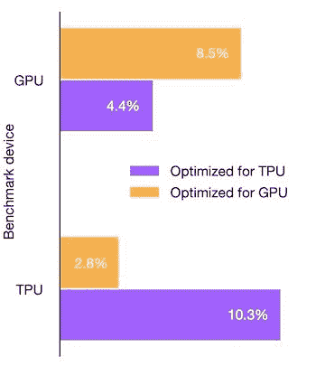

Hardware-tailored speedups: GPU vs TPU – a case study implemented in the paper ([source](https://www.nature.com/articles/s41586-022-05172-4))

AlphaTensor 的出发点是用**张量**的语言重新表述矩阵乘法(我们将在下面的部分解释这是如何工作的以及张量是什么)。因为张量可以表示任何[双线性运算](https://en.wikipedia.org/wiki/Bilinear_map)，例如结构化矩阵乘法、多项式乘法，或者在特定计算领域使用的更多自定义双线性运算，针对其他数学问题的 AlphaTensor 的进一步扩展可以**为复杂性理论和其他数学领域的研究**开启新的可能性。

### AlphaTensor 如何搜索新算法？

现在，让我们把张量想象成一种魔方的抽象模拟，如下图所示:

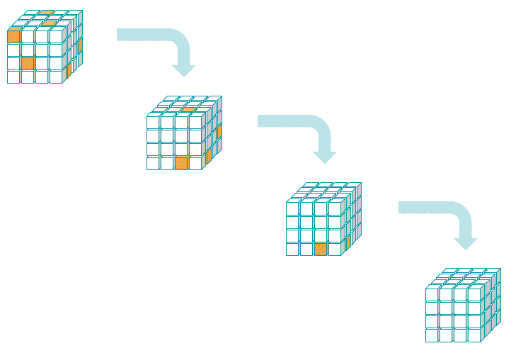

AlphaTensor 能够自学如何玩一款名为 **TensorGame** 的单人游戏，玩家以某种方式操纵给定的输入张量，从而产生一组代表新乘法算法的指令。

TensorGame 是通过利用和改进自学棋盘游戏(如国际象棋或围棋)的技术来玩的，DeepMind 的 [AlphaZero](https://youtu.be/7L2sUGcOgh0) 模型解决了这个问题。请注意，张量游戏的自由度数量，即玩家每步可能采取的行动数量，比国际象棋或围棋的**高出几个数量级**，这使得这个问题变得极其困难。在下面的[部分有更多关于 TensorGame 的细节。](#tensorgame)

下面将给出 AlphaTensor 如何操作的[高级概述](#model-overview),随后是其各个组件的一些扩展细节。

在此之前，我们先来给以下几个自然问题一个答案:

*   矩阵乘法到底能不能提高？
*   什么是张量？张量分解在何种意义上等同于矩阵乘法算法？

## 为什么矩阵乘法不是最优的

两个矩阵相乘的标准方法不是一个非常有效的算法。原因很简单:对于计算机来说,(两个数的)乘法是一种比加法计算量更大(更慢)的运算。这是因为二进制形式的两个数的相加是并行工作的——在位上只有一个周期——而乘法意味着一系列加法和[位移位操作](https://youtu.be/x-SvmFpkER0)，因此需要几个周期。

因此，减少任何计算任务所需的乘法总数(即使以增加加法/减法的数量为代价)，也能有效地加速整个过程，并产生更快的实现。

一个简单的例子:计算两个数字(a)和(b)的平方差的两种不同算法如下图所示。两种算法返回相同的结果，但第二种算法更有效，需要的乘法次数是第一种算法的一半。

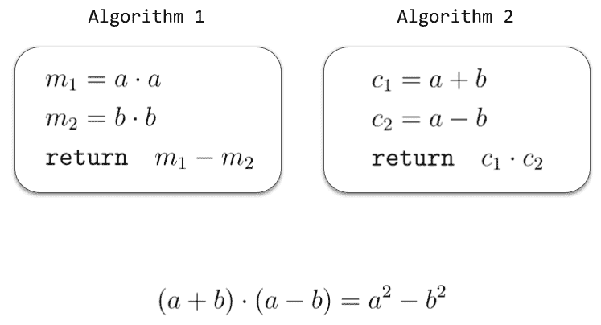

两个矩阵相乘需要多少次乘法？这既取决于矩阵的大小，也取决于所选择的实现方式。对于两个大小为(2 乘 2)的矩阵，标准算法需要 8 次乘法，如下图所示。

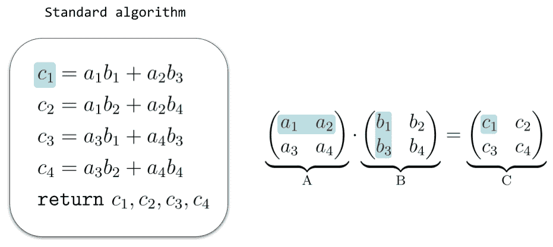

更一般地，为了用标准算法将两个(兼容的)矩阵\(A\)和\(B\)相乘，必须将\(A\)的每一行与\(B\)的每一列相乘，并且每个这样的操作需要\(n\)次乘法，其中\(n\)是\(A\)的行向量的长度。因此，我们总共需要:\[ ( \text{num。的行} A)\次(\text{num。的列} B)\次(\text{num。在大小为\(n\乘以 n \)的方阵的情况下，这成为\(n^3\)，因此有人说标准算法在输入矩阵大小上具有*立方复杂度*，写为\( O(n^{3}) \)。

有没有可能想出一种更快的矩阵乘法算法？

答案是肯定的，这要追溯到 1969 年德国数学家 Volker Strassen 的一项重要发现。他是第一个意识到标准算法不是最优的人，并且发现了一种在(2 乘以 2)的情况下只需要(7)次乘法的算法。

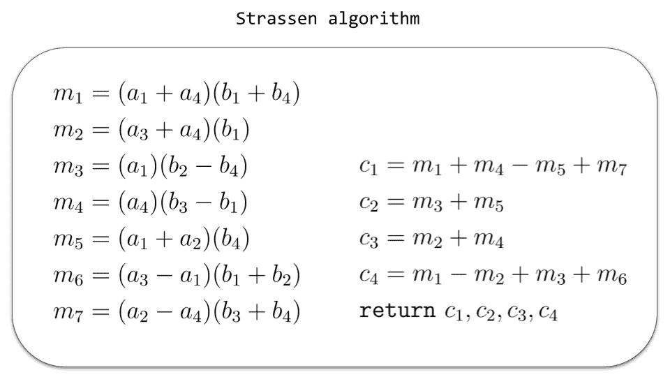

Strassen's algorithm requires only 7 multiplications. Note that it can be applied recursively to matrices of higher size – for example, for two 4x4 matrices it reduces the number of multiplications from 64 (standard algorithm) to only 49.

虽然 Strassen 的发现极其重要，但它没有提供任何搜索新矩阵乘法算法的系统方法。测试所有可能的组合在实践中是不可行的，即使对于在最快的可用机器上运行的强力计算机程序也是如此，因为对于小尺寸矩阵来说，这种组合的数量是完全不可及的。例如，在(4 乘 4)的情况下，可接受的算法的数量已经比(3 乘 3)的情况增加了\(10^{10}\倍。

那么，我们如何系统地寻找新的乘法算法呢？事实证明，一个非常聪明的做法是在不同的背景下重新表述这个问题:张量分解。

## 作为高维矩阵的张量

张量是矩阵概念的推广。如果我们认为矩阵(A)是由一系列数字组成的

由两个索引\(i\)和\(j\)(每个索引在给定的范围内运行)索引的 3D 张量\( \mathcal{T} \)由一列数字给出

由三个索引\(i，j，k\)索引。添加更多的指数，这很快推广到 4D，5D，甚至更高维张量的概念。这样，我们看到矩阵实际上只是张量的一个特殊例子:**矩阵是 2D 张量**。

就像矩阵(或 2D 张量)可以被形象化为一个数字的“方桌”(或更一般的矩形桌子)，很自然地将一个三维张量形象化为一个三维数字盒子。此外，如果张量的唯一可能条目是 0 和 1，我们可以只使用彩色框来表示值 1，其余的为零，如下图所示:

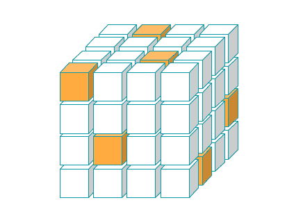

An illustration of a 3D-tensor taking only 0 and 1 as possible entries. Coloured boxes (orange) correspond to a value of 1 in the tensor, and the rest (white) are 0.

## 矩阵乘法算法是张量分解

出发点是下面的观察:一旦矩阵大小固定，就有一个唯一的 3D 张量\(\mathcal{T}\)(只包含 0 和 1)，它表示给定大小的任何一对矩阵\(A\)和\(B\)的乘积\(AB = C\)。更真实的情况是:对\(\mathcal{T}\)(见下面的例子)的任何*分解*都会自动产生一组新的指令，说明如何进行这种乘法运算，即一种特定的乘法算法。结论是:寻找新的矩阵乘法算法**等同于寻找相应张量的分解**。

为了解释这是如何工作的，让我们举例说明\(2\乘以 2 \)的情况:

该图显示了在\(2\乘以 2 \)情况下表示矩阵乘法的张量\(\mathcal{T}\)。\(\mathcal{T}\)(前面突出显示)的第一部分包含用\(A\)和\(B\)的系数表示矩阵\(C\)的第一个系数\(c_1\)的方法。类似地，其他切片对\(C\)的剩余系数做同样的事情。

一旦\(A\)和\(B\)的大小固定，张量\(\mathcal{T}\)的构造就是一个简单的操作。现在的关键点是\(\mathcal{T}\)可以根据三个向量的[外积](https://en.wikipedia.org/wiki/Outer_product)的和进行几种不同的分解，即以下形式:

A tensor decomposition of the tensor T. The number of summands R is called the *rank* of the decomposition and equals the total number of multiplications in the matrix multiplication algorithm corresponding to this decomposition.

每个单独的因子\(\ mathbf { u } \ otimes \ mathbf { v } \ otimes \ mathbf { w } \)相当于对应于这种分解的算法中的一个乘法步骤。下图说明了这种机制在 Strassen 算法中的工作原理:

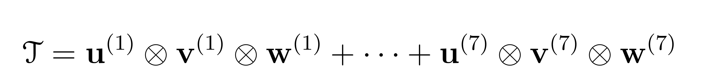

The figure shows how to reconstruct a matrix multiplication algorithm given a tensor decomposition. The vectors u's and v's dictate the multiplication steps. The vectors w’s are grouped in a matrix whose rows yield the instructions for how to combine the different multiplications m’s in order to get the output coefficients c’s of the matrix C.

总之，为了找到一个新的算法(正好有\(R\)个乘法)，找到张量\(\mathcal{T}\)的分解作为上面的正好\(R\)个乘积\(\ mathbf { u } \ otimes \ mathbf { v } \ otitimes \ mathbf { w } \)的和就足够了。问题是所有这些分解的数量是巨大的——事实上，就像矩阵乘法算法的数量一样大。为了探索这个组合空间，需要一些复杂的策略。AlphaTensor 的方法是玩一个名为 TensorGame 的三维棋盘游戏。

## 张量游戏

张量分解可以被重新表述为强化学习问题，将环境建模为单人 3D 棋盘游戏 TensorGame。

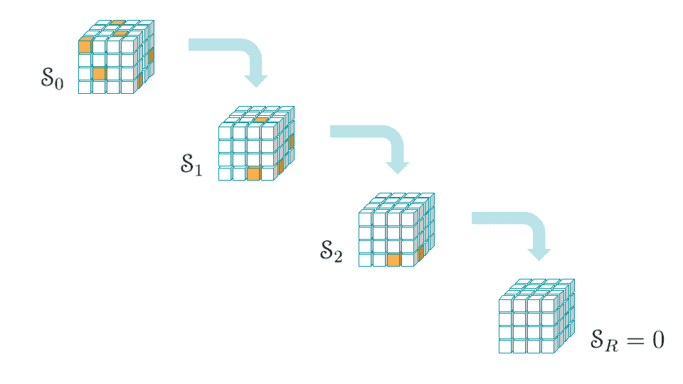

**游戏目标**:给定任意张量\(\mathcal{T}\)，我们要找到\(\mathcal{T}\)的一个分解为\(R\)与\(R\)的外积之和(如上一节所述)，它对应于算法中的乘法次数，尽可能小。

游戏的玩法如下:

*   **第零步** (t = 0):初始状态设置为我们要分解的目标张量:

*   **步骤 t** (t = 1，2，3，...):玩家选择三个向量:

并且新状态被递归地更新为:

*   游戏结束:R 步后，玩家到达零张量:

在这种情况下，这会产生初始张量的张量分解\(\mathcal{T}\)。在每一步\(t\)都有一个负奖励，鼓励更少的步骤达到零。只允许预设的最大移动次数:如果玩家在此限制后以非零向量终止游戏，将会获得额外的负奖励。

## AlphaTensor -模型概述

AlphaTensor 是围绕一个[深度强化学习](https://www.assemblyai.com/blog/reinforcement-learning-with-deep-q-learning-explained/)范式构建的:一个代理能够通过玩张量游戏来搜索张量分解的空间。使用策略和奖励函数来采取行动，并且将所玩的游戏输入到神经网络中，该神经网络更新和改进策略和奖励。更具体地说，整个过程由以下步骤组成:

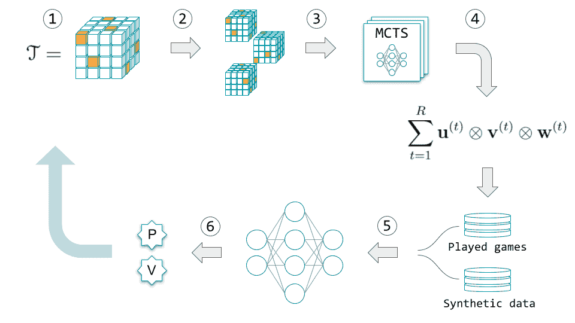

1.  **TensorGame 开始**:输入乘法\(AB = C\)对应的 3D 张量\( \mathcal{T}\)。
2.  数据扩充步骤:\(\mathcal{T}\)通过随机的基变化样本进行变换(这些是根据不同的参考系来表示相同张量的等效方式)。AlphaTensor 被迫在所有基地并行进行游戏。关键的一点是，在*中找到任意*个基的分解就足够了。这也自动地给游戏注入了多样性。
3.  一连串的[蒙特卡罗树搜索](https://en.wikipedia.org/wiki/Monte_Carlo_tree_search) (MCTS)步骤结合强化学习来决定下一个*动作*，直到剧集结束。MCTS 在*政策*功能和*价值*功能的指引下运作。策略函数用于决定采取哪些步骤来沿着树向下。价值函数用于估计所选路径的回报。
4.  输出是一个玩过的游戏，相当于\(\mathcal{T}\)的分解，并被添加到一个玩过的游戏列表中。
5.  **深度强化学习开始**:从玩过的游戏列表或准备好的合成数据列表中随机抽取一个状态，并将其输入神经网络，训练该网络来学习和更新 MCTS 中使用的策略和价值函数。
6.  该模型用新的策略和值函数进行了更新。新的迭代可以开始。

这些点代表了 AlphaTensor 模型中起作用的主要组件的示意图。让我们仔细看看其中的一些组件。

### 数据扩充策略

AlphaTensor 使用一些有趣的数据扩充策略，利用问题的各种对称性以及应用线性代数的技巧。

在每个游戏情节的开始，输入张量通过应用基数变化的样本而增加，如上面概述中提到的。具体地说，基的**变化由应用于原始张量的三个可逆矩阵的(采样)选择来确定。如果玩家找到任何一个变换张量的张量分解，那么直接把这样的分解转换成原始(规范)基的分解。分解的*秩* \(R\)在这个过程中被保留。在实际操作中，这些随机生成的碱基数量在 10 万左右，AlphaTensor 在所有的碱基中并行进行游戏。**

另一个策略涉及一个准备好的**合成数据**列表。虽然张量分解是一个 [NP-hard](https://en.wikipedia.org/wiki/NP-hardness) 问题，但是从它的因子构造张量的逆任务是基本的。因此，通过对\(t=1，\dots，r \)取向量三元组(\(\mathbf{u}^{(t)}，\mathbf{v}^{(t)}，\mathbf{w}^{(t)}\)的随机样本，然后将它们的乘积加在一起以构造随机张量\(\mathcal{T}\)，可以容易地生成张量分解的合成数据集。这产生了可用于监督学习的张量分解对的大列表。事实上，AlphaTensor 的神经网络采用了一种**混合训练策略**:使用标准强化学习损失在目标张量上同时训练，使用监督损失在随机张量上训练。

从每个玩的游戏中，通过用最后一个动作交换随机动作，利用张量分解中加法的可交换性，提取额外的张量分解对。这在每次迭代中为监督学习产生了额外的一对。

### 基于样本的蒙特卡罗树搜索(MCTS)在行动

玩 TensorGame 时，每走一步，你都可以指定一个可能的[搜索树](https://en.wikipedia.org/wiki/Search_tree)。具体来说，搜索由一系列 TensorGame 的模拟轨迹组成，这些轨迹聚集在一棵树中。因此，搜索树由表示状态的节点\( (\mathcal{S}_t) \)和表示动作的边组成。一个动作对应于三个向量的选择\(\mathbf{u}、\mathbf{v}、\mathbf{w}\)，这导致树的每一层都有大量的可能性。

MCTS 没有遍历整个树并访问每个节点，而是对树的一个子集进行采样。基于策略函数对动作进行采样，并选择具有最高潜在回报的动作。价值函数用于评估给定的动作序列，即沿树向下的给定轨迹。

### 一种基于变压器的神经网络结构

AlphaTensor 使用深度神经网络来指导蒙特卡罗树搜索。让我们突出它的架构的主要特征。

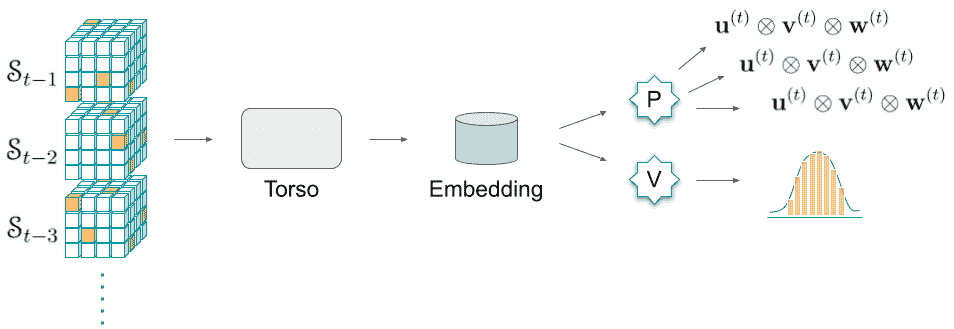

神经网络由一个普通的*躯干*(充当编码器)，后面是一个双头。更具体地说:

*   输入是当前状态，以及先前状态的历史。
*   躯干是基于**变形金刚**的修改，它利用了一种特殊形式的注意力机制，称为[轴向注意力](https://arxiv.org/abs/1912.12180)。它的目的是创建一个对政策和价值头脑都有用的输入的[表示嵌入](https://datascience.stackexchange.com/questions/53995/what-does-embedding-mean-in-machine-learning/)。
*   政策负责人的目的是预测潜在行动的分布。它使用 transformers 架构来模拟一个**自回归策略**。这里的自回归意味着模型通过测量先前时间步的观察值之间的相关性来预测输出(类似于语言模型中的[解码器架构](https://youtu.be/d_ixlCubqQw))。
*   价值头由一个[多层感知器](https://en.wikipedia.org/wiki/Multilayer_perceptron)组成，并被训练来预测当前状态的回报分布(累积回报)。

## α张量结果综述

对于小尺寸的矩阵，先前已知的矩阵乘法算法的复杂度与由 AlphaTensor 发现的算法的复杂度之间的比较如下表所示:

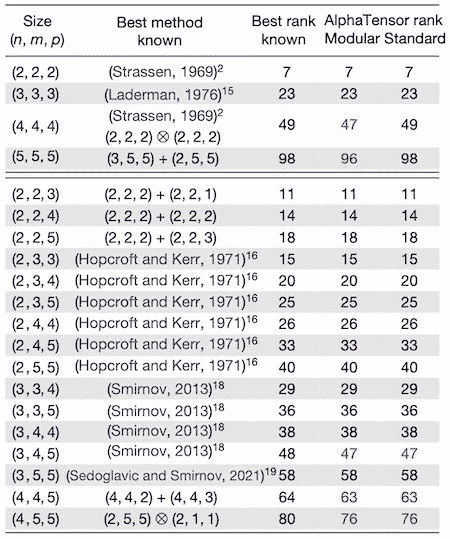

Table of AlphaTensor's results from the original paper ([source](https://www.nature.com/articles/s41586-022-05172-4))

第一列显示了所考虑的矩阵的*大小*:例如(4，4，5)指的是一个 4 x 4 矩阵乘以一个 4 x 5 矩阵的问题。这里的单词*秩*指的是算法中使用的标量乘法的总数。这是衡量复杂性的方法。最后两列分别显示了 AlphaTensor 在[模运算](https://en.wikipedia.org/wiki/Modular_arithmetic)(具体来说:模二)和标准运算中得到的秩。

对于所考虑的正方形矩阵的情况(表中的第一行), AlphaTensor 仅针对模运算改进了最佳已知秩。在适用于实矩阵的非正方形情况下，也有 3 个改进。在第二个表中(参见[原始论文](https://www.nature.com/articles/s41586-022-05172-4)中的*扩展数据表 1* )，作者能够组合一些低规模算法，并在几个情况下获得优于最佳已知秩的改进，大小达到(11，12，12)。

值得注意的是，AlphaTensor 在每种情况下都会自动重新发现当前最先进的算法。另一方面，虽然这些结果令人印象深刻，但这些改进并不代表矩阵乘法问题的重大突破。

论文中报道的标准算法的加速大多在 1%到 6%之间，而且似乎只是在合成数据上测量的。据推测，这些算法已经在随机生成的矩阵上进行了测试，尽管作者没有具体说明。应在机器学习研究论文中建立明确描述测试集结构的最佳实践，以避免与[数据泄露](https://en.wikipedia.org/wiki/Leakage_(machine_learning))相关的任何风险，并确保结果的可重复性。

还值得注意的是，现实应用中出现的矩阵往往带有非常特殊的结构，新算法对这类数据的改进还有待论证。例如，在[稀疏矩阵](https://en.wikipedia.org/wiki/Sparse_matrix)(在应用中无处不在)上测试新算法，或者更一般地分析实际案例研究，如计算机图形学、科学模拟或神经网络训练，将是非常有趣的。不幸的是，作者没有报告在这些环境下进行的任何测试。

虽然算法可以递归地应用于更大尺寸的矩阵(例如，4 x 4 算法可以应用于任何尺寸等于 4 的幂的方阵),并且优势变得明显，但这通常意味着天文数字般大的矩阵，在现实应用中很少见到。

另一方面，值得注意的是，对于矩阵乘法的实际应用来说，速度通常不是最重要的特征。数值稳定性在许多计算任务中被认为是最重要的。虽然α张量可以被设置为针对这样的度量，但是在该论文中没有出现在这个方向上的实验，并且没有报道新发现的算法的数值误差界限。

## 最后的话

矩阵乘法是线性代数中的基本运算。它构成了许多其他矩阵运算的基础，并广泛应用于应用数学、计算机科学以及工程和科学计算的若干领域。对矩阵乘法复杂性的理论理解和快速实用算法的开发都是令人感兴趣的。

AlphaTensor 是一个基于深度强化学习的 AI 系统，可以独立地为复杂的数学任务找到新颖的*可证明正确的*算法。经过专门针对矩阵乘法问题的训练，它已经显示出非常有趣的结果，并且它在自动算法设计中进一步扩展和应用到其他任务的潜力看来是有希望的。

喜欢这篇文章吗？

关注我们的时事通讯，了解更多类似的内容！

[Follow](https://subscribe.assemblyai.com/)