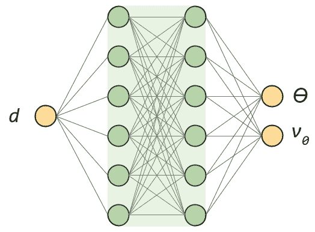
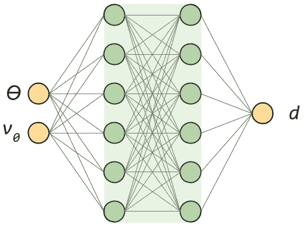
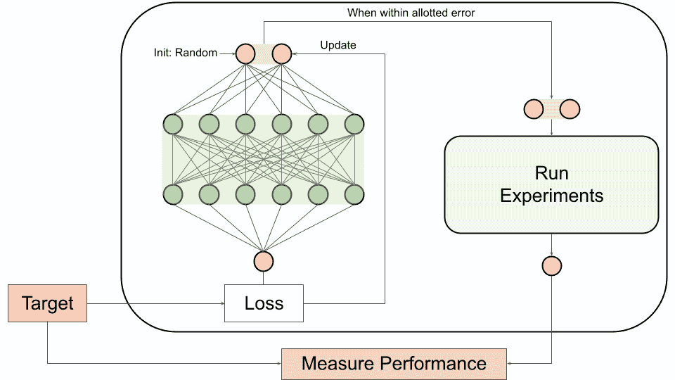
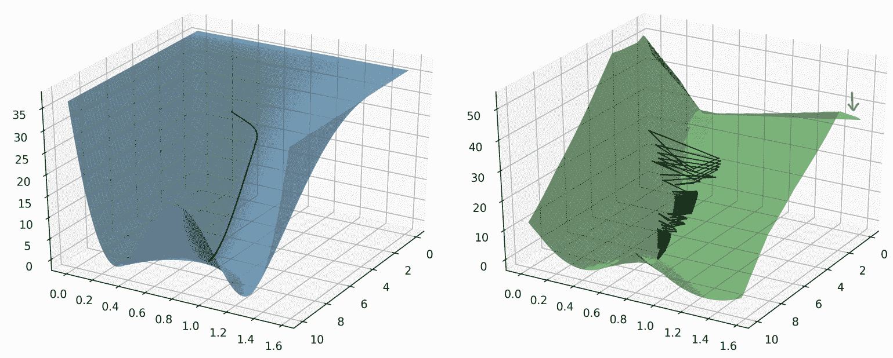
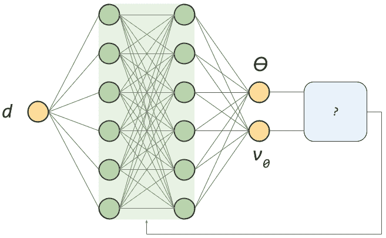

# 可微规划——简单介绍

> 原文：<https://www.assemblyai.com/blog/differentiable-programming-a-simple-introduction/>

**可微分编程**是一个相对较新的术语，经常与深度学习混为一谈。虽然深度学习确实与差异化编程重叠，但深度学习是差异化编程的*子集*。

在本文中，我们将解释什么是可区分编程，以及它与深度学习有何不同，特别是关于它更大的通用性。我们将通过三种方式(越来越聪明)解决一个基于物理的问题来学习。我们开始吧！

## 微分规划简介

许多机器学习技术的核心归结为最小化某个损失函数，以学习一个非常适合解决某个问题的模型。深度学习建立在这个中心思想的基础上，对模型本身提出了两个要求——一个**网络架构**和通过**自动微分进行训练。**相比之下，**可微分编程**只需要*这些要求中的一个*-通过自动微分进行训练。

可微分编程是指以某种方式利用自动微分，允许程序优化其参数，以便更好地完成某项任务。它只需要三样东西:

1.  待优化的**参数化函数** /方法/模型
2.  适用于衡量绩效的**损失**,以及
3.  (自动)**待优化对象的可区分性**

虽然深度学习肯定会选中这些框，但它并不是唯一一个这样做的领域。可微分编程可以应用于其他领域的各种任务，包括概率编程、贝叶斯推理、机器人和物理学。

## 问题是:瞄准大炮

我们将通过考虑以下问题来探讨差异化编程的主题:

> 给定一个已知距离的目标，如何调整大炮的角度和弹射速度才能击中目标？

我们将以三种方式解决这个问题——首先使用**纯深度学习**方法，其次使用**纯牛顿**方法，最后使用**混合牛顿深度学习**方法。

## 神经网络方法

我们将首先在假设我们对物理学一无所知的情况下，仅使用神经网络来解决这个问题。相反，我们只是有一门大炮，我们可以发射很多很多次，以收集大量的数据，记录发射角度，弹射速度，以及每个数据对应的着陆距离。我们的目标是了解**我们如何利用这种经验数据，以便在*另一个*方向**上前进，也就是将*从*一个目标距离*映射到*合适的控制参数，这将使我们的射弹降落在期望的目标上。

乍一看，我们可能会认为这个问题很简单。我们希望输入距离和输出控制参数，因此我们可以使用我们收集的所有数据训练一个模型来执行此映射。

A first attempt at solving this problem might involve creating a Neural Network to map from distances to corresponding control parameters

不幸的是，这种方法行不通，因为我们不知道如何测量损失。我们可以输入一个目标距离并得到假设的控制参数，但是*我们如何确定这些是否是“好的”控制参数*？假设的和真实的控制参数之间的平均平均误差合适吗？如果有多种解决方案呢(在本例中确实有)？请记住，在这种情况下，我们对物理学一无所知！

相反，我们在**另一个方向**、*绘制从*控制参数*到*的结果距离，因为损失很容易计算——我们只需测量我们预测的距离和真实差异之间的差异(并对其求平方以获得可微性)[[1](https://www.assemblyai.com/blog/differentiable-programming-a-simple-introduction#footnotes)。

Mapping instead from control parameters to the resulting projectile distance provides a simple and intuitive way to measure loss

我们来训练这样一个神经网络。下面你可以看到 1000 个数据点的训练结果，其中蓝色表面是我们试图复制的真正基础功能。

<https://www.assemblyai.com/blog/content/media/2022/02/NN_fitting.mp4>

Neural Network learning on data (green) to approximate the true underlying function (blue) over 100 epochs

经过训练后，我们有了一个神经网络，它已经学会了从控制参数到最终距离的映射。让我们看看在下图中，随着目标距离的变化，损失面是如何变化的。*x*-轴为弹丸初速(范围从 *0* 到最大*10m/s*),*y*-轴为射击角度(范围从 *0* 到*π/2 弧度*，不含)，而 *z* 轴为所得距离与目标距离之间的 MSE。

<https://www.assemblyai.com/blog/content/media/2022/02/nn_loss_anim.mp4>

The empirical loss surface (as a function of initial velocity and launch angle) changes form depending on target distance

现在我们有了一个神经网络来近似从控制参数*到*最终距离的映射*，我们如何为给定的目标距离获得合适的控制参数呢？记得我们想要*输入*一个目标距离，*输出*控制参数，但是我们的神经网络映射到另一个方向。*

正如我们在上面的图中看到的，我们有一个损失面，它是控制参数的函数，其形状由我们的目标距离参数化；所以我们可以简单的用**渐变下降**[2](https://www.assemblyai.com/blog/differentiable-programming-a-simple-introduction#footnotes)！虽然我们首先使用梯度下降以便*学习*控制参数到距离映射的近似，但是我们现在使用梯度下降来*最小化*由我们的输入目标距离参数化的该映射的相应损失表面。现在让我们执行这个梯度下降:

<https://www.assemblyai.com/blog/content/media/2022/02/nn_grad_desc_rotation.mp4>

Path of gradient descent towards empirical loss function minimum curve

我们从最初的猜测开始，并成功地学习了更好的控制参数，使我们更接近我们的目标。下面你可以看到下降过程中不同轨迹的动画，总共花费了数百次迭代。

<https://www.assemblyai.com/blog/content/media/2022/02/nn_trajectories.mp4>

During gradient descent, the landing spot tends towards the target

我说学习到的控制参数是*更好*，而不是*正确，*故意的。请记住，尽管我们通过梯度下降使损失最小化(事实上可能达到零损失)，但这种损失是相对于真正的基本函数的近似形式而言的，该函数定义了控制参数和最终距离之间的关系。虽然我们*可能*学到了更好的控制参数，但我们不知道它们是完美的或者*甚至是足够的*。事实上，上面动画中的最终轨迹与目标有 **20 厘米**的误差，即使我们将梯度下降设置为最大 **5 厘米**的误差。相对于*近似*模型，误差最多为 5 厘米，但相对于*真实*模型，误差在技术上不受限制。

为了限制误差，我们需要输入一个目标，使用梯度下降(在固定的神经模型上)来学习控制参数，使用这些控制参数来运行实验并收集*真实的*结果距离，然后将该距离与输入的目标距离进行比较，对大量数据进行一些统计分析。

Gradient descent to optimize the control parameters happens with respect to the empirical model - to determine its performance, the results need to be compared to real experimentation.

虽然这整个过程似乎是劳动密集型和不充分的，特别是考虑到预测性能和真实性能之间的差异的无界性，但这确实是我们在这种情况下所能做的最好的事情(省去了在更多数据上训练神经网络)。我们如何改进我们的方法？

## 牛顿方法

到现在为止，你应该已经注意到了我们上述方法的一个非常明显的问题——我们没有利用数百年来物理学为我们提供的对手头问题的洞察力，这种洞察力被方便地封装在我们可以利用的数学关系的形式中。

上面，我们对从控制参数到最终投射距离的映射进行了近似，但是如果我们知道运动定律*，为什么我们要用神经网络*来近似这个函数呢？在这种情况下，一个非常简单的运动学分析为我们提供了真实的基本映射，这反过来又为我们提供了真实的损失面，同样作为初始速度和喷射角的函数，并由目标距离参数化。让我们再来看看这个损失面是如何随着目标距离参数的变化而变化的。

<https://www.assemblyai.com/blog/content/media/2022/02/loss_evolution.mp4>

How the *true* loss surface (which our Neural Network sought to approximate in the last section) changes as parameterized by target distance

真实损失面和近似模型损失面之间容易观察到的形式差异有助于我们突出前面方法的问题——最小化扰动损失面会产生不完美的控制参数。你会注意到，尽管表面趋势相同，但定义真实模型(蓝色)**中最小曲线的**抛物线与神经模型**(绿色)的最小曲线并不相同。也就是说，即使我们在经验损失面上适当地最小化，产生的控制参数也可能不在真实的解曲线上。**

<https://www.assemblyai.com/blog/content/media/2022/03/comparison.mp4>

Gradient descent on the empirical loss surface compared to the true loss surface. Note that the projections of the minimum curves of the empirical and true loss surfaces onto the control parameter plane would not perfectly align.

给定我们的真实损失面，我们可以像以前一样进行梯度下降。你可以在下面的图中看到梯度下降路径。

<https://www.assemblyai.com/blog/content/media/2022/02/grad_path.mp4>

Path of gradient descent on true loss function

如果我们检查抛射体在下降过程中的轨迹，我们可以看到一个缓慢但稳定的调整到足够的控制参数。

<https://www.assemblyai.com/blog/content/media/2022/02/output.mp4>

Gradient descent of the true loss function takes fewer iterations to reach suitable control parameters

真实损失表面具有全局更平滑的优点，产生更少的迭代和更稳健的下降。此外，与经验损失面相比，我们不必担心病态，如果我们在右上角(红色箭头)初始化，我们的下降会导致非常不正确的控制参数。与此相关，使用真实损失表面的好处是确保找到的解决方案实际上是正确的(只要我们的物理模型实际上反映了现实，但这是科学而不是机器学习的范围)。

The true loss surface (blue, left) is globally smooth and provides more robust and accurate gradient descent when compared to the empirical (green, right) loss surface

在这一点上，你可能想知道*为什么我们首先要提出神经网络*。如果我们可以简单地对真实损失函数执行梯度下降，为什么我们不首先这样做呢？答案是，*最佳*方法实际上结合了前两种方法，产生了一种混合牛顿神经网络方法，也就是**可微规划**方法。

## 微分规划方法

在上述两种情况下，我们都需要执行梯度下降。这意味着，如果我们要部署这样一个模型，我们将不得不担心未知的运行时间、不良的学习率、陷入局部极小值等等。基于梯度的优化需求最终源于我们无法设计一种方法来测量与输出控制参数相关的**损失**:

Previously, in our physics-blind method, we did not know how to measure loss with respect to output control parameters

这种无法设计合适的损失导致我们翻转输入和输出，给我们一个可感知的损失作为目标距离和预测距离之间的 MSE，然后执行梯度下降以获得足够的控制参数。虽然我们可以利用我们的物理知识以这种方式优化真实损失表面，但我们可以通过使用物理模型生成可感知损失函数来做得更好。

结果是一种**可微分编程方法**，其中我们将从到目标距离*的*映射到*相应的控制参数，然后从这些参数得到的*到*的真实距离。结果是**实际上是一个自动编码网络**，其中神经网络学习物理模型的“逆”[3](https://www.assemblyai.com/blog/differentiable-programming-a-simple-introduction#footnotes) ，该物理模型从控制参数映射到结果距离:*

<https://www.assemblyai.com/blog/content/media/2022/02/model_transitions.mp4>

We incorporate prior domain-specific knowledge to create an "autoencoding" network which we can backpropagate through to train our approximation network

由于我们的物理模型由可微分函数组成，我们可以通过网络反向传播，并更新神经网络的参数进行学习。

结果是一个预测网络，它将目标距离的**映射到合适的控制参数**，这是我们一直以来的目标。一旦我们使用它来生成预测的控制参数，物理模型就可以用来*验证*控制参数产生的着陆距离在我们目标距离的允许误差之内。

如果着陆距离不合适，我们可以再次**在真实模型上执行梯度下降**，但是这次**使用预测的控制参数作为起点，而不是随机初始化**。因此，使用差异化编程方法，我们有:

1.  预先训练好的 神经模型**，能够在给定目标距离的情况下快速提供控制参数估计值**
2.  验证这些控制参数确实会使抛射体充分接近目标的方法**,以及**
3.  如果控制参数*不足*，则**调整**控制参数的快速方法(平均需要比随机初始化少得多的迭代)。

我们可以在下图中看到整个系统:

Complete schematic of the Differentiable Programming approach to solving the Cannon Problem

想学习如何构建这样一个可微分的编程模型吗？

我们将很快发布一篇关于如何用[谷歌的 JAX](https://www.assemblyai.com/blog/why-you-should-or-shouldnt-be-using-jax-in-2022/) 做到这一点的文章，所以一定要关注我们的时事通讯，这样你就不会错过它了！

[Subscribe](https://assemblyai.us17.list-manage.com/subscribe?u=cb9db7b18b274c2d402a56c5f&id=2116bf7c68)

## 最后的话

虽然我们为混合神经-物理模型提供了一个简单、高级的可微分编程用例，但它的应用远远超出了这个例子。利用差异化编程[4](https://www.assemblyai.com/blog/differentiable-programming-a-simple-introduction/#footnotes) 为他们的项目注入人工智能的一些领域有:

*   卫生保健
    *   [定量系统药理学](https://www.cell.com/trends/pharmacological-sciences/fulltext/S0165-6147(20)30211-X)
    *   [基于生理的药代动力学](https://www.cell.com/trends/pharmacological-sciences/fulltext/S0165-6147(20)30211-X)
    *   患者反应预测
*   活力
    *   [自动气候参数化](https://arxiv.org/abs/2010.12559)
    *   建筑物的加速能效模型
    *   电池供电飞机材料的最佳化
*   [科学机器学习](https://arxiv.org/abs/2001.04385)
*   [普适微分方程](https://sciml.ai/)
*   [概率编程](https://turing.ml/stable/)
*   [强化学习](https://github.com/jonathan-laurent/AlphaZero.jl)

对于那些对更高级的用例感兴趣的人来说， [Julia 编程语言](https://julialang.org/)的团队有一些关于差异化编程[4](https://www.assemblyai.com/blog/differentiable-programming-a-simple-introduction#footnotes)的很棒的资源。

如需更多学习资源，请随时查看我们的[博客](https://www.assemblyai.com/blog/)或 [YouTube](https://www.youtube.com/c/AssemblyAI) 频道。或者，关注我们的[时事通讯](https://assemblyai.us17.list-manage.com/subscribe?u=cb9db7b18b274c2d402a56c5f&id=2116bf7c68)或[推特](https://twitter.com/AssemblyAI)以便在我们发布新内容时保持关注。

## 脚注

1.  请注意，我们正在进行纯机器学习——我们可能对手头的情况一无所知，只将数据视为 3 列数字 *a、b、*和 c，只要我们被告知 MSE 是一个适当的损失函数，训练模型仍然是成功的。
2.  这里应该注意的是，即使底层的真实模型是不可微的或者甚至是连续的，近似模型也*保证*是可微的，因此我们可以确定梯度下降是一种可行的优化方法。这种保证源于神经网络是可微函数的组合，因此它本身是全局可微的。
3.  这在数学意义上不是真正的逆，因为从控制参数到结果距离的正向映射不是内射的。它只是一个逆过程，在这个意义上，它通过正向映射的最小化级别曲线找到一条路径，作为目标距离的函数。
4.  涵盖这些主题的讲座可以在[这里](https://www.youtube.com/watch?v=rF2QAJLM730)找到，并且是本文中大炮问题的灵感来源。