# 机器学习的扩散模型介绍

> 原文：<https://www.assemblyai.com/blog/diffusion-models-for-machine-learning-introduction/>

扩散模型是生成模型，在过去的几年中已经获得了显著的流行，并且有很好的理由。仅在 21 世纪 20 年代发表的几篇开创性论文*就向世界展示了扩散模型的能力，比如在图像合成上击败甘斯[6](https://www.assemblyai.com/blog/diffusion-models-for-machine-learning-introduction/#references) 。最近，从业者将会看到扩散模型在 [DALL-E 2](https://www.assemblyai.com/blog/how-dall-e-2-actually-works/) 中使用，这是 OpenAI 上个月发布的图像生成模型。*

*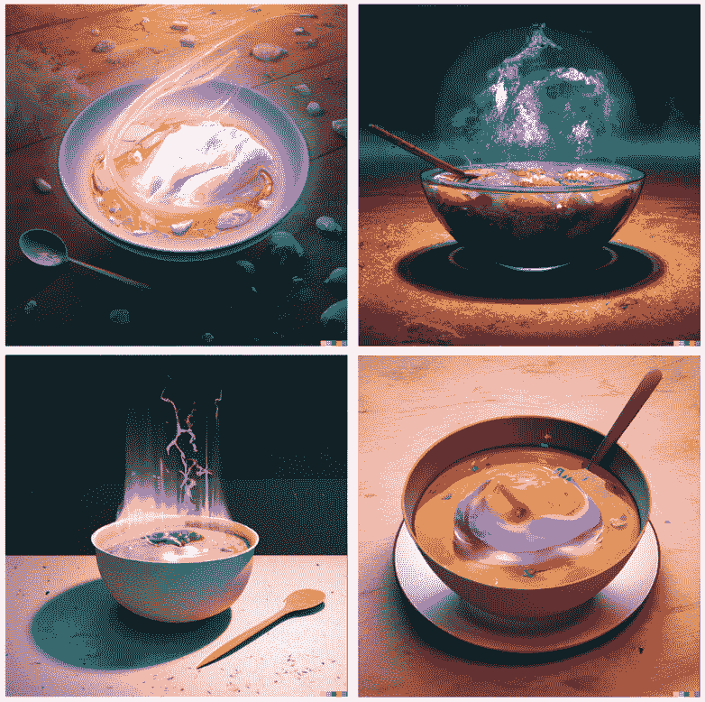

Various images generated by DALL-E 2 ([source](https://openai.com/dall-e-2/)).* 

*鉴于最近扩散模型的成功浪潮，许多机器学习实践者肯定对它们的内部工作方式感兴趣。在本文中，我们将检查扩散模型的理论基础，然后演示如何在 PyTorch 中使用 T2 扩散模型生成图像。让我们开始吧！*

## *扩散模型-简介*

*扩散模型是**生成型**模型，这意味着它们用于生成与它们被训练的数据相似的数据。从根本上来说，扩散模型的工作原理是**通过连续添加高斯噪声来破坏训练数据**，然后**通过*逆转*这个噪声过程来学习恢复**数据。训练后，我们可以使用扩散模型来生成数据，只需**将随机采样的噪声通过学习的去噪过程**。*

*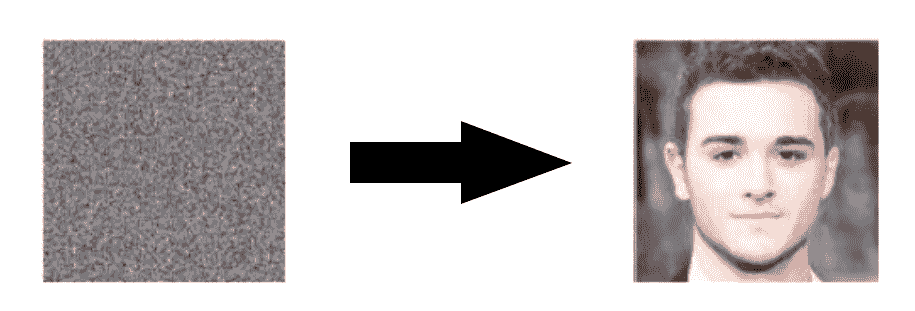

Diffusion Models can be used to generate images from noise (adapted from [source](https://arxiv.org/pdf/2006.11239.pdf))* 

*更具体地，扩散模型是使用固定马尔可夫链映射到潜在空间的潜在变量模型。这个链逐渐向数据中添加噪声，以便获得近似后验\(q(\ textbf { x } _ { 1:T } | \ textbf { x } _ 0)\)，其中\( \textbf{x}_1，...，\textbf{x}_T \)是与\( \textbf{x}_0 \)具有相同维数的潜在变量。在下图中，我们看到了图像数据的马尔可夫链。*

*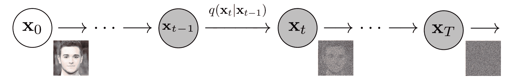

(Modified from [source](https://arxiv.org/pdf/2006.11239.pdf))* 

*最终，图像被渐近地转换为纯高斯噪声。训练一个扩散模型的**目标**是学习**逆**过程——即训练\( p_\theta(x_{t-1}|x_t) \)。通过沿着这条链向后遍历，我们可以生成新的数据。*

*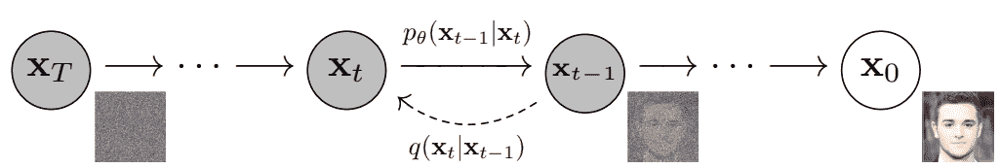

(Modified from [source](https://arxiv.org/pdf/2006.11239.pdf))* 

### *扩散模型的好处*

*如上所述，近年来对扩散模型的研究呈爆炸式增长。受非平衡热力学[1](https://www.assemblyai.com/blog/diffusion-models-for-machine-learning-introduction/#references)的启发，扩散模型目前产生**最先进的图像质量**，其示例如下:*

*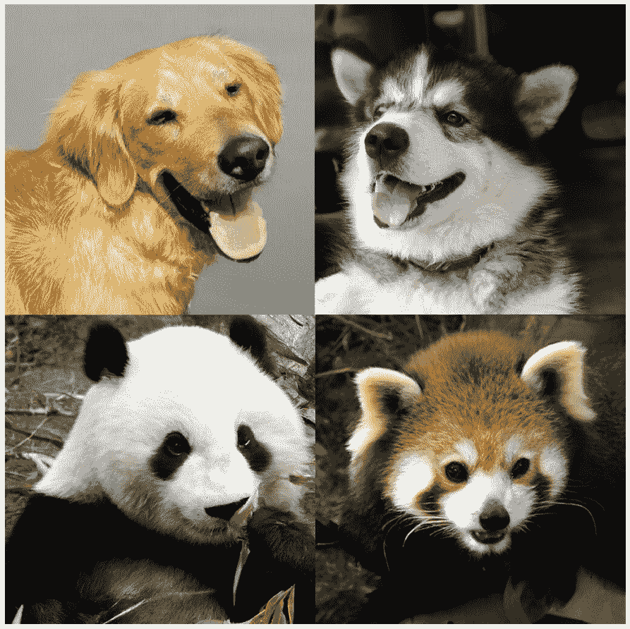

(adapted from [source](https://arxiv.org/pdf/2105.05233.pdf))* 

*除了尖端的图像质量，扩散模型还有许多其他好处，包括**不需要对抗训练**。对抗性训练的困难是有据可查的；而且，如果存在非对抗性的替代方案，表现和训练效率相当，通常最好利用它们。关于训练效率的话题，扩散模型也有额外的好处**可扩展性和并行性。***

*虽然扩散模型似乎是凭空产生结果，但有许多仔细而有趣的数学选择和细节为这些结果提供了基础，最佳实践仍在文献中不断发展。现在让我们更详细地看看支撑扩散模型的数学理论。*

## *扩散模型——深潜*

*如上所述，扩散模型由一个**正向过程**(或**扩散过程**)和一个**反向过程**(或**反向扩散过程**)组成，在正向过程中，一个数据(通常是一幅图像)被渐进地噪声化，在反向过程中，噪声被从目标分布转换回样本。*

*当噪声水平足够低时，正向过程中的采样链转换可以设置为条件高斯型。将这一事实与马尔可夫假设相结合，导致正向过程的简单参数化:*

*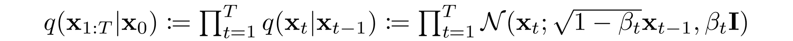* *数学笔记

我们一直在讨论通过添加高斯噪声来破坏数据，但是一开始可能不清楚我们在哪里执行这种添加。根据上述等式，在链中的每一步，我们简单地从高斯分布中采样，其平均值是链中的前一个值(即图像)。

这两种说法是等价的。即

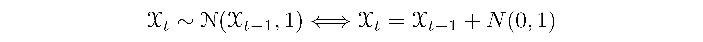

为了理解其中的原因，我们将通过断言来稍微滥用符号


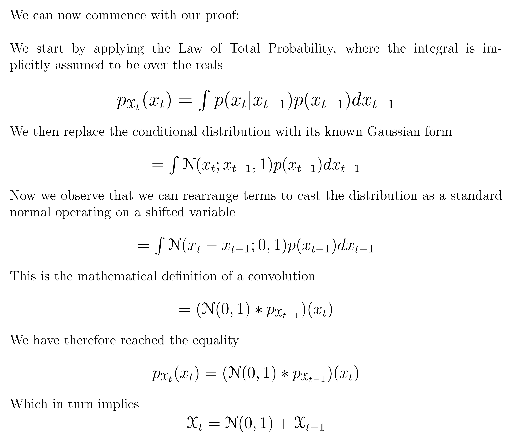

其中最终的含义源于随机变量之和及其分布的卷积之间的数学等价性——更多信息参见[维基百科页面](https://en.wikipedia.org/wiki/Convolution_of_probability_distributions)。

换句话说，我们已经证明，通过高斯分布的平均值断言以前一个时间步长为条件的时间步长的分布等同于断言给定时间步长的分布是前一个时间步长的分布加上高斯噪声。为了简单起见，我们省略了由方差表引入的标量，并且示出了一维标量，但是类似的证明适用于多元高斯分布。* 

*其中\( \beta_1，...，\beta_T \)是一个方差调度(学习的或固定的)，如果表现良好，**确保** \( x_T \) **对于足够大的 T** 接近各向同性高斯。*

*

Given the Markov assumption, the joint distribution of the latent variables is the product of the Gaussian conditional chain transitions (modified from [source](https://arxiv.org/pdf/2006.11239.pdf)).* 

*如前所述，扩散模型的“魔力”来自于**逆过程**。在训练期间，该模型学习反转这种扩散过程，以便生成新数据。从纯高斯噪声\(p(\ textbf { x } _ { T }):= \ mathcal { N }(\ textbf { x } _ T，\textbf{0}，\textbf{I}) \)开始，模型将联合分布\( p_\theta(\textbf{x}_{0:T}) \)学习为*

*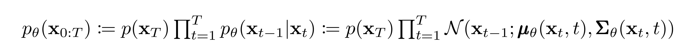*

*其中学习高斯跃迁的时间相关参数。特别要注意的是，马尔可夫公式断言给定的反向扩散转移分布仅取决于前一时间步(或后一时间步，取决于你如何看待它):*

*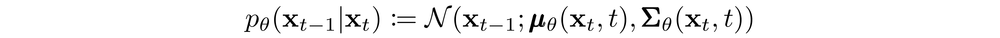**

(Modified from [source](https://arxiv.org/pdf/2006.11239.pdf))*  *想学习如何在 PyTorch 中建立扩散模型？

查看我们的 MinImagen 项目，在这里我们将构建一个文本到图像模型 Imagen 的最小实现！

[Check it out](https://www.assemblyai.com/blog/minimagen-build-your-own-imagen-text-to-image-model/)*

### *培养*

*通过**寻找使训练数据**的可能性最大化的反向马尔可夫转移来训练扩散模型。实际上，训练等价地包括最小化负对数似然的变分上限。*

*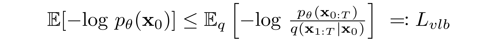* *符号细节

注意，L[vlb] 在技术上是一个*上*界(ELBO 的负值),我们试图将其最小化，但为了与文献一致，我们将其称为 L[vlb] 。* 

*我们寻求根据 **Kullback-Leibler (KL)散度**重写\( L_{vlb} \)。KL 散度是一种不对称的统计距离度量，用于衡量一个概率分布 *P* 与参考分布 *Q* 的差异程度。我们对用 KL 散度来公式化\( L_{vlb} \)感兴趣，因为我们的马尔可夫链中的转移分布是高斯分布，并且**高斯分布之间的 KL 散度具有封闭形式**。*

 *#### 什么是 KL 背离？* 

*连续分布的 KL 散度的数学形式是*

*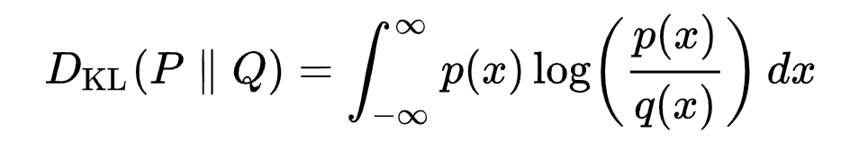

The double bars indicate that the function is *not* symmetric with respect to its arguments.* 

*下面你可以看到变化分布 *P* (蓝色)与参考分布 *Q* (红色)的 KL 散度。绿色曲线表示上述 KL 散度定义中积分内的函数，曲线下的总面积表示在任何给定时刻 *P* 与 *Q* 的 KL 散度值，该值也用数字显示。*

*<https://www.assemblyai.com/blog/content/media/2022/05/KL_Divergence.mp4>

* *#### 用 KL 散度刻画\( L_{vlb} \)* 

*如前所述，根据 KL 散度，[1](https://www.assemblyai.com/blog/diffusion-models-for-machine-learning-introduction/#references) 几乎完全重写\( L_{vlb} \)是可能的:*

*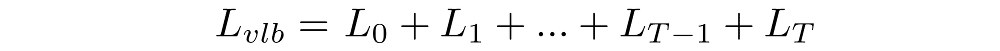*

*在哪里*

*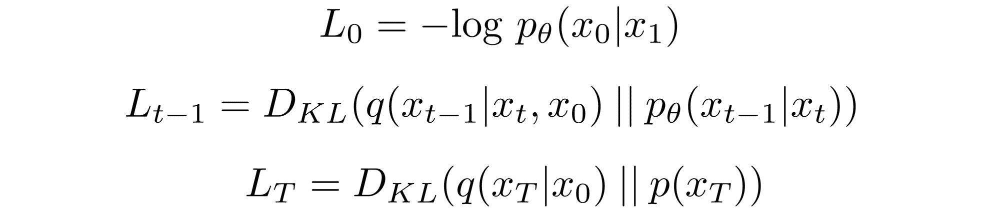* *派生详细信息

变分界限等于

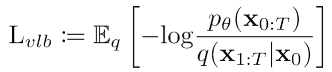

给定马尔可夫假设，用它们的定义替换分布，我们得到

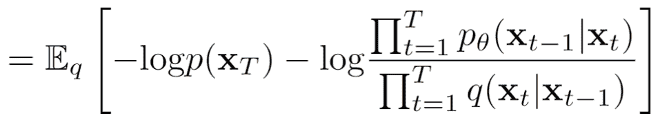

我们使用对数规则将表达式转换成对数的总和，然后我们取出第一项

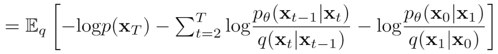

使用贝叶斯定理和我们的马尔可夫假设，这个表达式变成

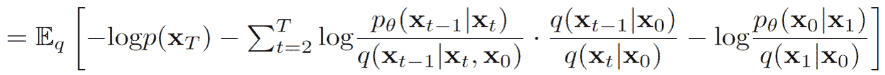

然后，我们使用对数规则拆分中间项

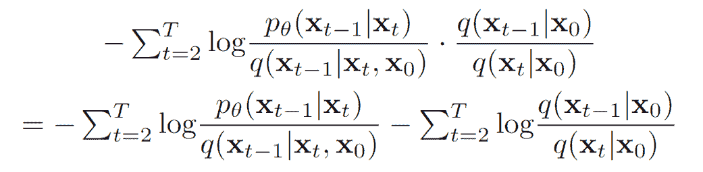

孤立第二项，我们看到


将此代入我们的 L[vlb] 方程，我们得到

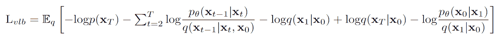

使用日志规则，我们重新排列

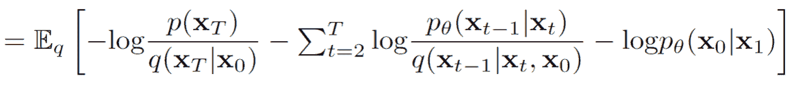

接下来，我们注意到任何两个分布的 KL 散度的以下等价性:

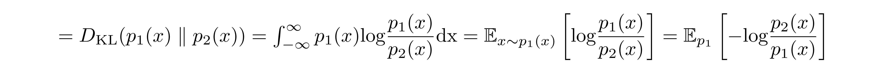

最后，将这个等价关系应用于前面的表达式，我们得到

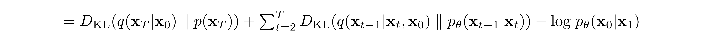*

*在\( L_{t-1} \)中以\( x_0 \)为条件的前向过程后验导致一种易处理的形式，这种形式导致**所有 KL 发散都是高斯分布**之间的比较。这意味着可以用封闭形式的表达式而不是用蒙特卡罗估计[3](https://www.assemblyai.com/blog/diffusion-models-for-machine-learning-introduction/#references) 来精确计算离差。*

### *型号选择*

*随着我们的目标函数的数学基础的建立，我们现在需要就如何实现我们的扩散模型做出几个选择。对于前进过程，唯一需要的选择是定义差异计划，其值通常在前进过程中增加。*

*对于相反的过程，我们更多地选择高斯分布参数化/模型架构。请注意扩散模型提供的**高度灵活性**—*对我们架构的唯一*要求是其输入和输出具有相同的维度。*

*我们将在下面更详细地探讨这些选择的细节。*

 *#### 正向过程和(L_T \)* 

*如上所述，关于推进过程，我们必须定义差异时间表。特别是，我们将它们设置为**与时间相关的常数**，忽略了它们可以被学习的事实。例如[3](https://www.assemblyai.com/blog/diffusion-models-for-machine-learning-introduction/#references) ，可以使用从\(\beta_1=10^{-4}\到\(\beta_T=0.2\)的线性时间表，或者可能是几何级数。*

*不管选择的具体值如何，方差时间表是固定的这一事实导致\( L_{T} \)相对于我们的一组可学习参数成为常数，从而允许我们在涉及训练时忽略它。*

*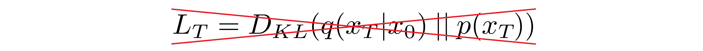* *#### 逆过程和\( L_{1:T-1} \)* 

*现在我们讨论定义反向过程所需的选择。回想一下，我们将反向马尔可夫转移定义为高斯:*

*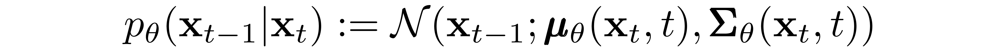*

*我们现在必须定义\( \pmb{\mu}_\theta \)或\(\ PMB { \适马}_\theta \)的函数形式。虽然有更复杂的方法来参数化\(\ PMB { \适马}_\theta \)[5](https://www.assemblyai.com/blog/diffusion-models-for-machine-learning-introduction/#references) ，我们简单地设置*

*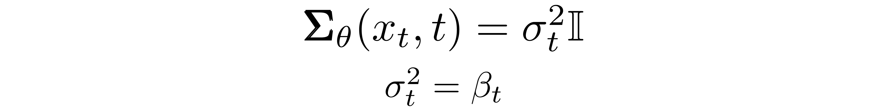*

*也就是说，我们假设多元高斯是具有相同方差的独立高斯的乘积，方差值可以随时间变化。我们**将这些差异设置为等同于我们的正向流程差异计划**。*

*给定这个新的公式\(\ PMB { \适马}_\theta \)，我们有*

*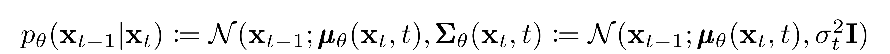*

*这让我们能够转变*

*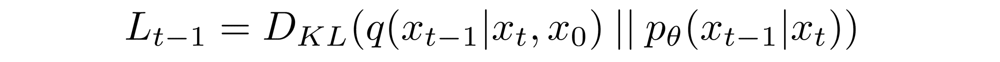*

*到*

*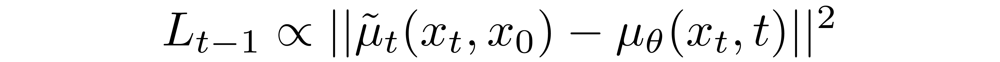*

*其中，差中的第一项是\(x_t\)和\(x_0\)的线性组合，这取决于方差调度\(\beta_t\)。该函数的确切形式与我们的目的无关，但可以在[ [3](https://www.assemblyai.com/blog/diffusion-models-for-machine-learning-introduction/#references) 中找到。*

*以上比例的意义在于，**最直接的参数化\( \mu_\theta \)简单地预测了扩散后验均值**。重要的是，[ [3](https://www.assemblyai.com/blog/diffusion-models-for-machine-learning-introduction/#references) 的作者实际上发现，训练\(\mu_\theta\)来预测任何给定时间步长的*噪声*分量会产生更好的结果。特别是，让*

*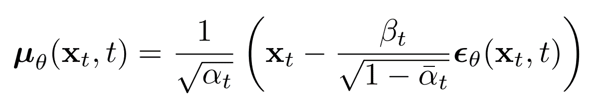*

*在哪里*

*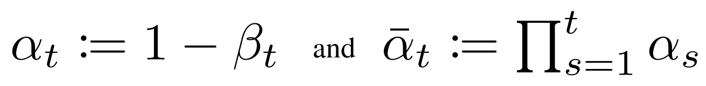*

***这导致了下面的替代损失函数**,【[3](https://www.assemblyai.com/blog/diffusion-models-for-machine-learning-introduction/#references)的作者发现这导致了更稳定的训练和更好的结果:*

*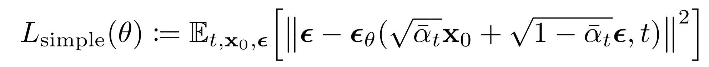*

*[3](https://www.assemblyai.com/blog/diffusion-models-for-machine-learning-introduction/#references) 的作者也注意到了扩散模型的这种公式化与基于朗之万动力学的分数匹配生成模型的联系。事实上，似乎扩散模型和基于分数的模型可能是同一枚硬币的两面，类似于基于波的量子力学和基于矩阵的量子力学的独立和并行发展，揭示了同一现象的两个等效公式[ [2](www.assemblyai.com/blog/diffusion-models-for-machine-learning-introduction/#references) 。*

 *#### 网络体系结构* 

*虽然我们的简化损失函数试图训练一个模型\( \pmb{\epsilon}_\theta \)，但我们仍未定义该模型的架构。注意，模型的唯一要求是输入和输出维度相同。*

*鉴于这种限制，图像扩散模型通常用类似 U-Net 的架构来实现就不足为奇了。*

*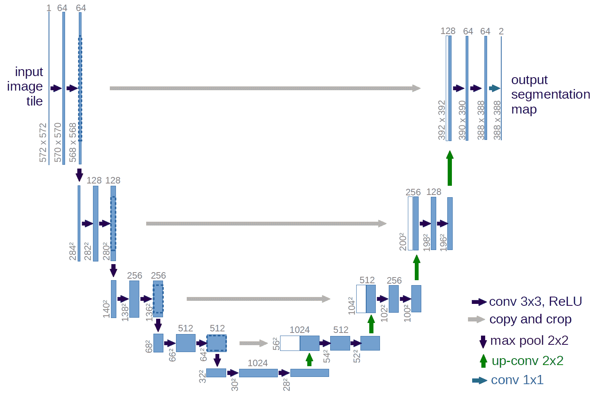

Architecture of U-Net ([source](https://lmb.informatik.uni-freiburg.de/people/ronneber/u-net/))*  *#### 逆过程解码器和(l0)* 

*沿着相反过程的路径由连续条件高斯分布下的许多变换组成。在反向过程的最后，回想一下我们试图产生一个由整数像素值组成的**图像**。因此，我们必须设计一种方法来获得所有像素中每个可能像素值的**离散(对数)可能性**。*

*实现这一点的方法是将反向扩散链中的最后一个转换设置到一个**独立的离散解码器**。为了确定给定图像\(x_0\)给定\(x_1\)的可能性，我们首先在数据维度之间施加独立性:*

*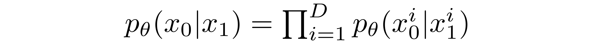*

*其中 D 是数据的维度，上标 *i* 表示一个坐标的提取。现在的目标是在给定时间(t=1)时轻微噪声图像中相应像素的可能值的分布的情况下，确定每个整数值对于给定像素*的可能性:**

*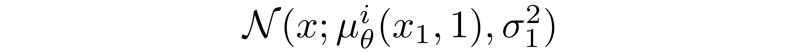*

*其中\(t=1\)的像素分布从下面的多变量高斯分布中导出，其对角协方差矩阵允许我们将分布分割为单变量高斯分布的乘积，每个数据维度一个:*

*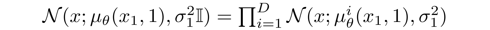*

*我们假设图像由\({0，1，...，255}\)(如标准 RGB 图像一样)，这些图像已被线性缩放为\([-1，1]\)。然后，我们将实际行分解成小“桶”，其中，对于给定的缩放像素值 *x* ，该范围的桶为\([x-1/255，x+1/255]\)。给定\(x_1\)中相应像素的单变量高斯分布，像素值 *x，*的概率是以 *x* 为中心的桶内该单变量高斯分布下的**面积。***

*下面你可以看到每个桶的面积和它们的概率，在这种情况下，对应于平均像素值为\(255/2\)(半亮度)的分布。红色曲线表示特定像素在 *t=1* 图像中的分布，面积给出了相应像素值在 *t=0* 图像中的概率。*

*<https://www.assemblyai.com/blog/content/media/2022/05/buckets_Trim.mp4>

* *技术说明

第一个和最后一个桶扩展到-inf 和+inf，以保持总概率。* 

*给定每个像素的一个 *t=0* 像素值，\( p_\theta(x_0 | x_1) \)的值就是它们的乘积。这个过程可以简单地概括为以下等式:*

*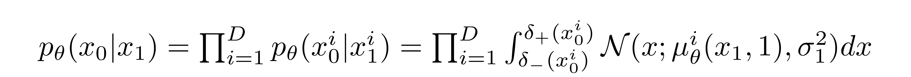*

*在哪里*

*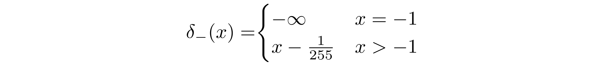*

*和*

*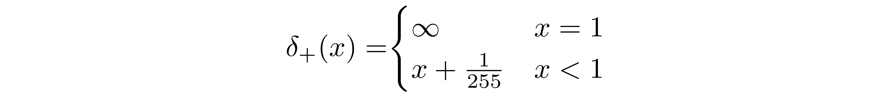*

*给定\( p_\theta(x_0 | x_1) \)的这个方程，我们可以计算\(L_{vlb}\)的最后一项，它不是用 KL 散度来表示的:*

*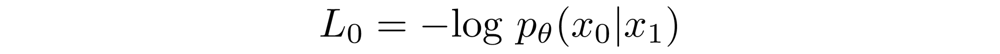*

### *最终目标*

*正如上一节所提到的，[ [3](https://www.assemblyai.com/blog/diffusion-models-for-machine-learning-introduction/#references) 的作者发现，在给定的时间步长预测图像的噪声成分会产生最好的结果。最终，他们使用以下目标:*

*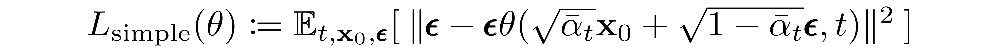*

*因此，我们的扩散模型的训练和采样算法可以在下图中简洁地捕捉到:*

*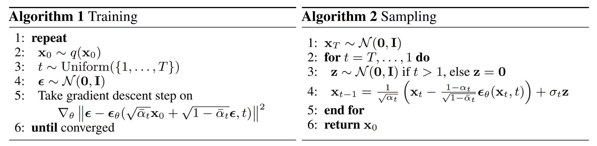

([source](https://arxiv.org/pdf/2006.11239.pdf))* 

### *扩散模型理论综述*

*在这一节中，我们详细探讨了扩散模型的理论。人们很容易陷入数学细节，因此我们在下面的章节中记录了最重要的几点，以便从鸟瞰的角度保持我们自己的方向:*

1.  *我们的扩散模型被参数化为一个**马尔可夫链**，意味着我们的潜在变量\(x_1，...，x_T\)仅依赖于前一个(或后一个)时间步长。*
2.  *马尔可夫链中的**转移分布**为**高斯**，其中正向过程需要方差调度，反向过程参数学习。*
3.  *扩散过程确保\(x_T\)对于足够大的 T,**渐近分布为各向同性高斯分布**。*
4.  *在我们的例子中，**差异计划是固定的**，但是也可以学习。对于固定时间表，遵循几何级数可能比线性级数提供更好的结果。在这两种情况下，方差通常在序列中随时间增加(即\(\ beta _ I<\ beta _ j \)for \(I<j \))。*
5.  *扩散模型**高度灵活**，允许*使用任何输入和输出维度相同的*架构。许多实现使用类似 **U-Net 的**架构。*
6.  ***训练目标**是最大化训练数据的可能性。这表现为将模型参数调整到**最小化数据**的负对数似然的变化上限。*
7.  *作为我们的马尔可夫假设的结果，目标函数中的几乎所有项都可以被转换为 **KL 散度**。这些值**在计算**时变得成立，因为我们使用了高斯分布，因此省略了执行蒙特卡罗近似的需要。*
8.  *最终，使用**简化的训练目标**来训练预测给定潜在变量的噪声分量的函数，产生最佳和最稳定的结果。*
9.  ***离散解码器**用于获得像素值的对数似然，作为反向扩散过程的最后一步。*

*有了这个对扩散模型的高级概述，让我们继续看如何在 PyTorch 中使用扩散模型。*

## *PyTorch 中的扩散模型*

*虽然扩散模型还没有普及到与机器学习中的其他旧架构/方法相同的程度，但仍然有可供使用的实现。在 PyTorch 中使用扩散模型最简单的方法是使用`denoising-diffusion-pytorch`包，它实现了一个像本文中讨论的图像扩散模型。要安装该软件包，只需在终端中键入以下命令:*

```py
*`pip install denoising_diffusion_pytorch`*
```

### *最小示例*

*为了训练模型并生成图像，我们首先导入必要的包:*

```py
*`import torch
from denoising_diffusion_pytorch import Unet, GaussianDiffusion`* 
```

*接下来，我们定义我们的网络架构，在这种情况下是 U-Net。`dim`参数指定在第一次下采样之前特征图的数量，并且`dim_mults`参数提供该值和后续下采样的被乘数:*

```py
*`model = Unet(
    dim = 64,
    dim_mults = (1, 2, 4, 8)
)`*
```

*既然我们的网络架构已经定义，我们需要定义扩散模型本身。我们传入刚刚定义的 U-Net 模型以及几个参数——要生成的图像的大小，扩散过程中的时间步长数，以及在 L1 和 L2 规范之间的选择。*

```py
*`diffusion = GaussianDiffusion(
    model,
    image_size = 128,
    timesteps = 1000,   # number of steps
    loss_type = 'l1'    # L1 or L2
)`*
```

*既然定义了扩散模型，就该训练了。我们生成随机数据进行训练，然后以通常的方式训练扩散模型:*

```py
*`training_images = torch.randn(8, 3, 128, 128)
loss = diffusion(training_images)
loss.backward()`* 
```

*一旦模型训练完毕，我们就可以通过使用`diffusion`对象的`sample()`方法最终生成图像。这里，我们生成了 4 幅图像，这些图像只是噪声，因为我们的训练数据是随机的:*

```py
*`sampled_images = diffusion.sample(batch_size = 4)`*
```

*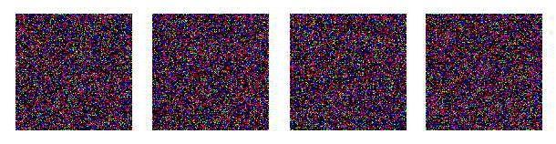*

### *关于自定义数据的培训*

*`denoising-diffusion-pytorch`包也允许你在一个特定数据集上训练一个扩散模型。只需用下面的`Trainer()`对象中的数据集目录路径替换`'path/to/your/images'`字符串，并将`image_size`更改为适当的值。之后，只需运行代码来训练模型，然后像以前一样进行采样。注意为了使用`Trainer`类，PyTorch 必须在启用 CUDA 的情况下编译:*

```py
*`from denoising_diffusion_pytorch import Unet, GaussianDiffusion, Trainer

model = Unet(
    dim = 64,
    dim_mults = (1, 2, 4, 8)
).cuda()

diffusion = GaussianDiffusion(
    model,
    image_size = 128,
    timesteps = 1000,   # number of steps
    loss_type = 'l1'    # L1 or L2
).cuda()

trainer = Trainer(
    diffusion,
    'path/to/your/images',
    train_batch_size = 32,
    train_lr = 2e-5,
    train_num_steps = 700000,         # total training steps
    gradient_accumulate_every = 2,    # gradient accumulation steps
    ema_decay = 0.995,                # exponential moving average decay
    amp = True                        # turn on mixed precision
)

trainer.train()`*
```

*下面您可以看到从多元高斯噪声到 MNIST 数字的渐进去噪，类似于反向扩散:*

**

## *最后的话*

*扩散模型是一种概念上简单而优雅的数据生成方法。他们最先进的成果与非对抗性训练相结合，使他们达到了很高的水平，鉴于他们的新生状态，预计在未来几年还会有进一步的改进。特别是，已经发现扩散模型对于像 [DALL-E 2](https://www.assemblyai.com/blog/how-dall-e-2-actually-works/) 这样的尖端模型的性能至关重要。*

 *你喜欢这篇文章吗？

考虑关注我们的时事通讯，以确保您将来不会错过此类内容。

[Follow](https://assemblyai.us17.list-manage.com/subscribe?u=cb9db7b18b274c2d402a56c5f&id=2116bf7c68)*

## *参考*

*[1] [利用非平衡热力学的深度无监督学习](https://arxiv.org/abs/1503.03585)*

*[2] [通过估计数据分布的梯度进行生成建模](https://arxiv.org/abs/1907.05600)*

*[3] [去噪扩散概率模型](https://arxiv.org/abs/2006.11239)*

*[4] [训练基于分数的生成模型的改进技术](https://arxiv.org/abs/2006.09011)*

*[5] [改进的去噪扩散概率模型](https://arxiv.org/abs/2102.09672)*

*[6] [扩散模型在图像合成上击败了甘斯](https://arxiv.org/abs/2105.05233)*

*[7] [GLIDE:利用文本引导扩散模型实现真实感图像生成和编辑](https://arxiv.org/abs/2112.10741)*

*[8] [具有剪辑潜在时间的分层文本条件图像生成](https://arxiv.org/abs/2204.06125)*