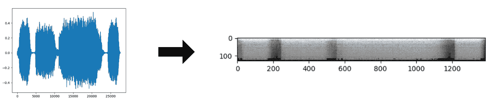
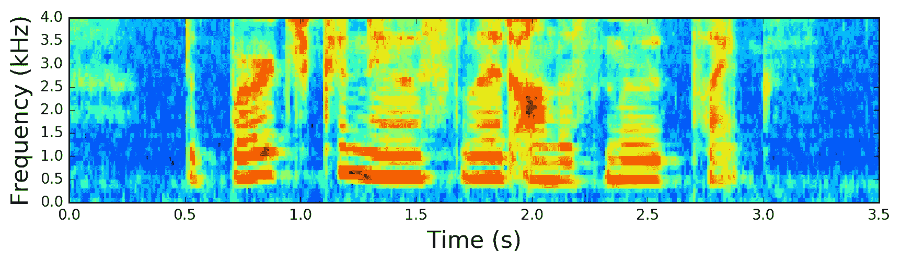
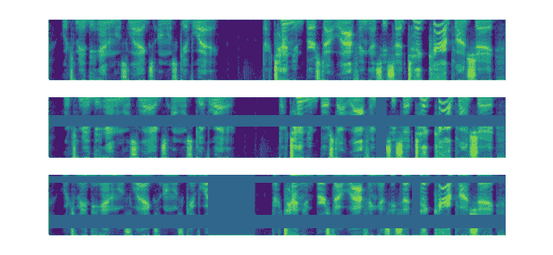
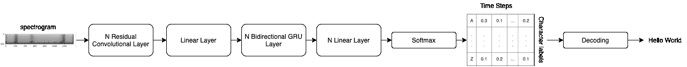
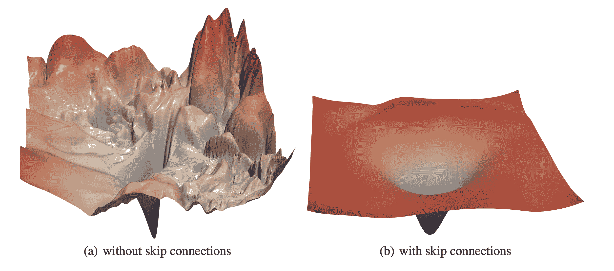
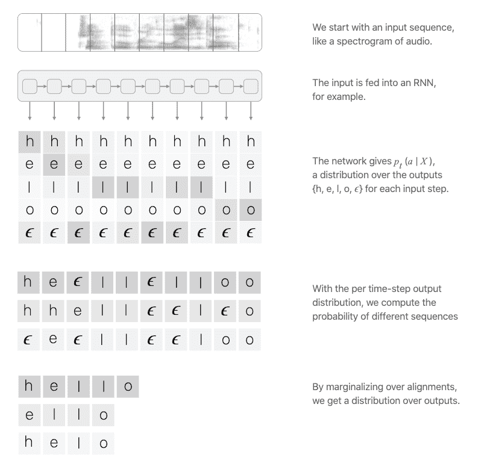
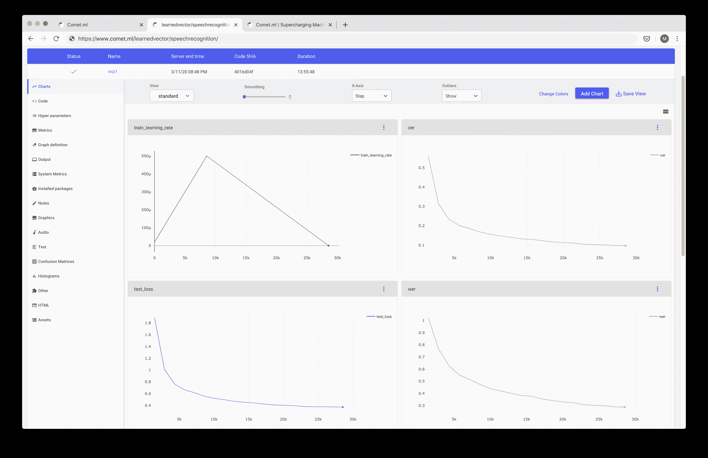
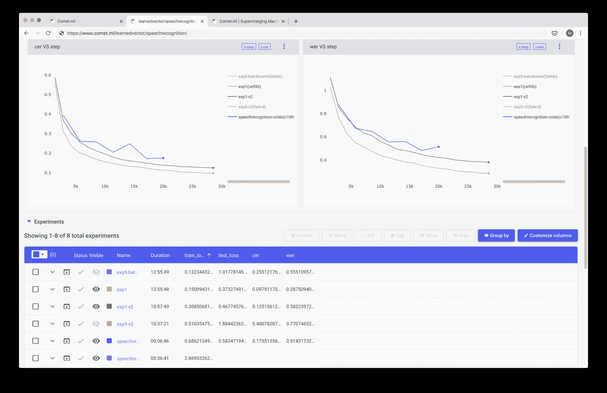

# 在 PyTorch 中构建端到端语音识别模型

> 原文：<https://www.assemblyai.com/blog/end-to-end-speech-recognition-pytorch/>

深度学习随着端到端模型的引入，改变了[自动语音识别](https://www.assemblyai.com/blog/what-is-asr/)的游戏。这些模型接收音频，并直接输出转录。今天最受欢迎的两个端到端模型是百度的 Deep Speech 和谷歌的 Listen Attend Spell (LAS)。深度语音和 LAS 都是基于递归神经网络(RNN)的架构，具有不同的建模语音识别的方法。深度语音使用连接主义者时间分类(CTC)损失函数来预测语音转录本。LAS 使用序列对网络体系结构进行序列预测。

这些模型通过利用深度学习系统从大型数据集学习的能力，简化了语音识别管道。有了足够的数据，从理论上讲，你应该能够建立一个超级健壮的语音识别模型，它可以考虑语音中的所有细微差别，而不必花费大量的时间和精力手工设计声学特征，或者处理更老式的 GMM-HMM 模型架构中的复杂管道。

深度学习是一个快速发展的领域，深度语音和 LAS 风格的架构已经很快过时了。你可以在下面的最新进展部分了解该行业的发展方向。

## 如何在 PyTorch 中构建自己的端到端语音识别模型

让我们看看如何在 PyTorch 中构建自己的端到端语音识别模型。我们将构建的模型受到 Deep Speech 2(百度对其著名模型的第二次修订)的启发，并对架构进行了一些个人改进。该模型的输出将是字符的概率矩阵，我们将使用该概率矩阵来解码音频中最有可能说出的字符。你可以找到完整的代码，也可以在谷歌合作实验室运行它。

## 准备数据管道

数据是语音识别最重要的方面之一。我们将原始音频波转换成 Mel 光谱图。



你可以从这篇精彩的文章[这里](https://haythamfayek.com/2016/04/21/speech-processing-for-machine-learning.html?undefined)阅读更多关于这一转变的细节。在这篇文章中，你可以把 Mel 声谱图想象成声音的图像。



为了处理音频数据，我们将使用一个非常有用的工具`torchaudio`，它是 PyTorch 团队专门为音频数据构建的库。我们将在 [LibriSpeech](http://www.openslr.org/12/?undefined) 的子集上进行训练，这是一个从有声读物中获得的阅读英语语音数据的语料库，包括 100 个小时的转录音频数据。您可以使用`torchaudio`轻松下载该数据集:

```py
import torchaudio

train_dataset = torchaudio.datasets.LIBRISPEECH("./", url="train-clean-100", download=True)
test_dataset = torchaudio.datasets.LIBRISPEECH("./", url="test-clean", download=True) 
```

数据集的每个样本都包含波形、音频的采样率、话语/标签以及关于样本的更多元数据。你可以从源代码[这里](https://github.com/pytorch/audio/blob/master/torchaudio/datasets/librispeech.py#L40)查看每个样本的样子。

## 数据增长-预测增长

数据扩充是一种用于人为增加数据集多样性以增加数据集大小的技术。当数据不足或模型过拟合时，这种策略尤其有用。对于语音识别，您可以使用标准的增强技术，如改变音调、速度、注入噪声以及给音频数据添加混响。

我们发现谱图增强(SpecAugment)是一种更简单、更有效的方法。SpecAugment 首次在论文 [SpecAugment:一种用于自动语音识别的简单数据扩充方法](https://arxiv.org/abs/1904.08779?undefined)中介绍，其中作者发现，简单地剪切连续时间和频率维度的随机块可以显著提高模型的泛化能力！



在 PyTorch 中，您可以使用`torchaudio`函数`FrequencyMasking`屏蔽频率维度，使用`TimeMasking`屏蔽时间维度。

```py
torchaudio.transforms.FrequencyMasking()
torchaudio.transforms.TimeMasking()
```

现在我们有了数据，我们需要将音频转换成 Mel 频谱图，并将每个音频样本的字符标签映射成整数标签:

```py
char_map_str = """
 ' 0
 <SPACE> 1
 a 2
 b 3
 c 4
 d 5
 e 6
 f 7
 g 8
 h 9
 i 10
 j 11
 k 12
 l 13
 m 14
 n 15
 o 16
 p 17
 q 18
 r 19
 s 20
 t 21
 u 22
 v 23
 w 24
 x 25
 y 26
 z 27
 """

 class TextTransform:
    """Maps characters to integers and vice versa"""
    def __init__(self):
        char_map_str = char_map_str
        self.char_map = {}
        self.index_map = {}
        for line in char_map_str.strip().split('\n'):
            ch, index = line.split()
            self.char_map[ch] = int(index)
            self.index_map[int(index)] = ch
        self.index_map[1] = ' '

    def text_to_int(self, text):
        """ Use a character map and convert text to an integer sequence """
        int_sequence = []
        for c in text:
            if c == ' ':
                ch = self.char_map['']
            else:
                ch = self.char_map[c]
            int_sequence.append(ch)
        return int_sequence

    def int_to_text(self, labels):
        """ Use a character map and convert integer labels to an text sequence """
        string = []
        for i in labels:
            string.append(self.index_map[i])
        return ''.join(string).replace('', ' ')

train_audio_transforms = nn.Sequential(
    torchaudio.transforms.MelSpectrogram(sample_rate=16000, n_mels=128),
    torchaudio.transforms.FrequencyMasking(freq_mask_param=15),
    torchaudio.transforms.TimeMasking(time_mask_param=35)
)

valid_audio_transforms = torchaudio.transforms.MelSpectrogram()

text_transform = TextTransform()

def data_processing(data, data_type="train"):
    spectrograms = []
    labels = []
    input_lengths = []
    label_lengths = []
    for (waveform, _, utterance, _, _, _) in data:
        if data_type == 'train':
            spec = train_audio_transforms(waveform).squeeze(0).transpose(0, 1)
        else:
            spec = valid_audio_transforms(waveform).squeeze(0).transpose(0, 1)
        spectrograms.append(spec)
        label = torch.Tensor(text_transform.text_to_int(utterance.lower()))
        labels.append(label)
        input_lengths.append(spec.shape[0]//2)
        label_lengths.append(len(label))

    spectrograms = nn.utils.rnn.pad_sequence(spectrograms, batch_first=True).unsqueeze(1).transpose(2, 3)
    labels = nn.utils.rnn.pad_sequence(labels, batch_first=True)

    return spectrograms, labels, input_lengths, label_lengths
```

## 定义模型-深度演讲 2(但更好)

我们的模型将类似于 Deep Speech 2 架构。该模型将具有两个主要的神经网络模块- N 层残差卷积神经网络(ResCNN)以学习相关的音频特征，以及一组双向递归神经网络(BiRNN)以利用所学习的 ResCNN 音频特征。该模型以一个完全连接的层结束，该层用于在每个时间步长对角色进行分类。



卷积神经网络(CNN)擅长提取抽象特征，我们将把同样的特征提取能力应用于音频频谱图。我们选择使用残留的 CNN 层，而不是普通的 CNN 层。残差连接(又名跳过连接)首次在论文[图像识别的深度残差学习](https://arxiv.org/abs/1512.03385?undefined)中介绍，作者发现，如果你将这些连接添加到 CNN 中，你可以建立具有良好精度增益的真正深度网络。添加这些剩余连接也有助于模型更快地学习和更好地概括。论文[可视化神经网络的损失景观](https://arxiv.org/abs/1712.09913?undefined)表明，具有剩余连接的网络具有“更平坦”的损失表面，使模型更容易浏览损失景观，并找到更低和更可概括的最小值。



递归神经网络(RNN)天生擅长序列建模问题。RNN 一步一步地处理音频特征，对每一帧进行预测，同时使用前一帧的上下文。我们使用 BiRNN 是因为我们不仅想要每一步之前的帧的上下文，还想要每一步之后的帧的上下文。这可以帮助模型做出更好的预测，因为在做出预测之前，音频中的每一帧都将具有更多信息。我们使用 RNN 的门控循环单元(GRU 的)变体，因为它比 LSTM 的需要更少的计算资源，并且在某些情况下工作得一样好。

该模型输出字符的概率矩阵，我们将使用该矩阵输入到我们的解码器中，以提取模型认为最有可能说出的字符。

```py
class CNNLayerNorm(nn.Module):
    """Layer normalization built for cnns input"""
    def __init__(self, n_feats):
        super(CNNLayerNorm, self).__init__()
        self.layer_norm = nn.LayerNorm(n_feats)

    def forward(self, x):
        # x (batch, channel, feature, time)
        x = x.transpose(2, 3).contiguous() # (batch, channel, time, feature)
        x = self.layer_norm(x)
        return x.transpose(2, 3).contiguous() # (batch, channel, feature, time) 

class ResidualCNN(nn.Module):
    """Residual CNN inspired by https://arxiv.org/pdf/1603.05027.pdf
        except with layer norm instead of batch norm
    """
    def __init__(self, in_channels, out_channels, kernel, stride, dropout, n_feats):
        super(ResidualCNN, self).__init__()

        self.cnn1 = nn.Conv2d(in_channels, out_channels, kernel, stride, padding=kernel//2)
        self.cnn2 = nn.Conv2d(out_channels, out_channels, kernel, stride, padding=kernel//2)
        self.dropout1 = nn.Dropout(dropout)
        self.dropout2 = nn.Dropout(dropout)
        self.layer_norm1 = CNNLayerNorm(n_feats)
        self.layer_norm2 = CNNLayerNorm(n_feats)

    def forward(self, x):
        residual = x  # (batch, channel, feature, time)
        x = self.layer_norm1(x)
        x = F.gelu(x)
        x = self.dropout1(x)
        x = self.cnn1(x)
        x = self.layer_norm2(x)
        x = F.gelu(x)
        x = self.dropout2(x)
        x = self.cnn2(x)
        x += residual
        return x # (batch, channel, feature, time)

class BidirectionalGRU(nn.Module):

    def __init__(self, rnn_dim, hidden_size, dropout, batch_first):
        super(BidirectionalGRU, self).__init__()

        self.BiGRU = nn.GRU(
            input_size=rnn_dim, hidden_size=hidden_size,
            num_layers=1, batch_first=batch_first, bidirectional=True)
        self.layer_norm = nn.LayerNorm(rnn_dim)
        self.dropout = nn.Dropout(dropout)

    def forward(self, x):
        x = self.layer_norm(x)
        x = F.gelu(x)
        x, _ = self.BiGRU(x)
        x = self.dropout(x)
        return x

class SpeechRecognitionModel(nn.Module):
    """Speech Recognition Model Inspired by DeepSpeech 2"""

    def __init__(self, n_cnn_layers, n_rnn_layers, rnn_dim, n_class, n_feats, stride=2, dropout=0.1):
        super(SpeechRecognitionModel, self).__init__()
        n_feats = n_feats//2
        self.cnn = nn.Conv2d(1, 32, 3, stride=stride, padding=3//2)  # cnn for extracting heirachal features

        # n residual cnn layers with filter size of 32
        self.rescnn_layers = nn.Sequential(*[
            ResidualCNN(32, 32, kernel=3, stride=1, dropout=dropout, n_feats=n_feats) 
            for _ in range(n_cnn_layers)
        ])
        self.fully_connected = nn.Linear(n_feats*32, rnn_dim)
        self.birnn_layers = nn.Sequential(*[
            BidirectionalGRU(rnn_dim=rnn_dim if i==0 else rnn_dim*2,
                             hidden_size=rnn_dim, dropout=dropout, batch_first=i==0)
            for i in range(n_rnn_layers)
        ])
        self.classifier = nn.Sequential(
            nn.Linear(rnn_dim*2, rnn_dim),  # birnn returns rnn_dim*2
            nn.GELU(),
            nn.Dropout(dropout),
            nn.Linear(rnn_dim, n_class)
        )

    def forward(self, x):
        x = self.cnn(x)
        x = self.rescnn_layers(x)
        sizes = x.size()
        x = x.view(sizes[0], sizes[1] * sizes[2], sizes[3])  # (batch, feature, time)
        x = x.transpose(1, 2) # (batch, time, feature)
        x = self.fully_connected(x)
        x = self.birnn_layers(x)
        x = self.classifier(x)
        return x
```

## 选择正确的优化器和调度器——AdamW 具有超强的收敛性

优化器和学习率计划在让我们的模型收敛到最佳点方面起着非常重要的作用。选择正确的优化器和调度器还可以节省您的计算时间，并帮助您的模型更好地推广到现实世界的用例。对于我们的模型，我们将使用 ****AdamW**** 和 ****单周期学习率调度器**** 。 ****Adam**** 是一个广泛使用的优化器，它可以帮助你的模型更快地收敛，从而节省计算时间，但它因不能像 ****随机梯度下降**** 又名 ****SGD**** 一样泛化而臭名昭著。

****AdamW**** 最早是在[解耦权重衰减正则化](https://arxiv.org/abs/1711.05101?undefined)中引入的，被认为是对 ****Adam**** 的“修正”。文章指出，原 ****Adam**** 算法有一个错误的权重衰减实现，对此 ****AdamW**** 试图修复。这个修正有助于解决亚当 的泛化问题。

****单周期学习率调度器**** 在[超收敛:使用大学习率的神经网络非常快速的训练](https://arxiv.org/abs/1708.07120?undefined)一文中首次介绍。这篇论文表明，使用一个简单的技巧，你可以训练神经网络的速度提高一个数量级，同时保持它们的泛化能力。你从一个低的学习速率开始，升温到一个大的最大学习速率，然后线性衰减到你最初开始的同一点。


因为最大学习率比最小学习率高很多，所以您也获得了一些正则化的好处，这有助于您的模型在数据集较少的情况下更好地进行概化。

对于 PyTorch，这两个方法已经是包的一部分了。

```py
optimizer = optim.AdamW(model.parameters(), hparams['learning_rate'])
scheduler = optim.lr_scheduler.OneCycleLR(optimizer,
	max_lr=hparams['learning_rate'],
	steps_per_epoch=int(len(train_loader)),
	epochs=hparams['epochs'],
	anneal_strategy='linear')
```

## CTC 丢失功能-将音频与抄本对齐

我们的模型将被训练来预测我们馈入模型的声谱图中每一帧(即时间步长)字母表中所有字符的概率分布。



传统的语音识别模型会要求你在训练之前将抄本文本与音频对齐，并且该模型会被训练来预测特定帧处的特定标签。

CTC 丢失功能的创新之处在于它允许我们跳过这一步。我们的模型将在训练过程中学习对齐脚本本身。这其中的关键是由 CTC 引入的“空白”标签，它使模型能够说某个音频帧没有产生一个字符。你可以从[这篇出色的帖子](https://distill.pub/2017/ctc/?undefined)中看到关于 CTC 及其工作原理的更详细的解释。

PyTorch 还内置了 CTC 丢失功能。

```py
criterion = nn.CTCLoss(blank=28).to(device)
```

## 评估你的语音模型

在评估您的语音识别模型时，行业标准使用单词错误率(WER)作为度量标准。单词错误率确实如其所言——它获取模型输出的转录和真实转录，并测量它们之间的错误。你可以在这里看到这是如何实现的[。另一个有用的指标叫做字符错误率(CER)。CER 测量模型输出和真实标签之间的字符误差。这些指标有助于衡量模型的性能。](https://colab.research.google.com/drive/1IPpwx4rX32rqHKpLz7dc8sOKspUa-YKO?undefined)

对于本教程，我们将使用“贪婪”解码方法将模型的输出处理成字符，这些字符可以组合起来创建副本。“贪婪”解码器接收模型输出，该模型输出是字符的 softmax 概率矩阵，并且对于每个时间步长(谱图帧)，它选择具有最高概率的标签。如果标签是空白标签，我们会将其从最终抄本中删除。

```py
def GreedyDecoder(output, labels, label_lengths, blank_label=28, collapse_repeated=True):
    arg_maxes = torch.argmax(output, dim=2)
    decodes = []
    targets = []
    for i, args in enumerate(arg_maxes):
        decode = []
        targets.append(text_transform.int_to_text(labels[i][:label_lengths[i]].tolist()))
        for j, index in enumerate(args):
            if index != blank_label:
                if collapse_repeated and j != 0 and index == args[j -1]:
                    continue
                decode.append(index.item())
        decodes.append(text_transform.int_to_text(decode))
    return decodes, targets
```

## 使用 Comet.ml 训练和监控您的实验

[Comet.ml](https://www.comet.ml/site/?undefined) 提供了一个平台，允许深度学习研究人员跟踪、比较、解释和优化他们的实验和模型。Comet.ml 提高了我们在 AssemblyAI 的工作效率，我们强烈推荐团队使用这个平台进行任何类型的数据科学实验。Comet.ml 设置起来超级简单。只需几行代码就能完成。

```py
# initialize experiment object
experiment = Experiment(api_key=comet_api_key, project_name=project_name)
experiment.set_name(exp_name)

# track metrics
experiment.log_metric('loss', loss.item())
```

Comet.ml 为您提供了一个非常高效的仪表板，您可以在其中查看和跟踪模型的进度。



您可以使用 Comet 来跟踪度量、代码、超级参数、您的模型的图表，以及其他许多东西！Comet 提供的一个非常方便的特性是能够将您的实验与许多其他实验进行比较。



Comet 有丰富的特性集，我们不会在这里一一介绍，但是我们强烈建议使用它来提高生产率和健全性。最后，这是我们培训脚本的其余部分。

```py
class IterMeter(object):
    """keeps track of total iterations"""
    def __init__(self):
        self.val = 0

    def step(self):
        self.val += 1

    def get(self):
        return self.val

def train(model, device, train_loader, criterion, optimizer, scheduler, epoch, iter_meter, experiment):
    model.train()
    data_len = len(train_loader.dataset)
    with experiment.train():
        for batch_idx, _data in enumerate(train_loader):
            spectrograms, labels, input_lengths, label_lengths = _data 
            spectrograms, labels = spectrograms.to(device), labels.to(device)

            optimizer.zero_grad()

            output = model(spectrograms)  # (batch, time, n_class)
            output = F.log_softmax(output, dim=2)
            output = output.transpose(0, 1) # (time, batch, n_class)

            loss = criterion(output, labels, input_lengths, label_lengths)
            loss.backward()

            experiment.log_metric('loss', loss.item(), step=iter_meter.get())
            experiment.log_metric('learning_rate', scheduler.get_lr(), step=iter_meter.get())

            optimizer.step()
            scheduler.step()
            iter_meter.step()
            if batch_idx % 100 == 0 or batch_idx == data_len:
                print('Train Epoch: {} [{}/{} ({:.0f}%)]\tLoss: {:.6f}'.format(
                    epoch, batch_idx * len(spectrograms), data_len,
                    100\. * batch_idx / len(train_loader), loss.item()))

def test(model, device, test_loader, criterion, epoch, iter_meter, experiment):
    print('\nevaluating…')
    model.eval()
    test_loss = 0
    test_cer, test_wer = [], []
    with experiment.test():
        with torch.no_grad():
            for I, _data in enumerate(test_loader):
                spectrograms, labels, input_lengths, label_lengths = _data 
                spectrograms, labels = spectrograms.to(device), labels.to(device)

                output = model(spectrograms)  # (batch, time, n_class)
                output = F.log_softmax(output, dim=2)
                output = output.transpose(0, 1) # (time, batch, n_class)

                loss = criterion(output, labels, input_lengths, label_lengths)
                test_loss += loss.item() / len(test_loader)

                decoded_preds, decoded_targets = GreedyDecoder(output.transpose(0, 1), labels, label_lengths)
                for j in range(len(decoded_preds)):
                    test_cer.append(cer(decoded_targets[j], decoded_preds[j]))
                    test_wer.append(wer(decoded_targets[j], decoded_preds[j]))

    avg_cer = sum(test_cer)/len(test_cer)
    avg_wer = sum(test_wer)/len(test_wer)
    experiment.log_metric('test_loss', test_loss, step=iter_meter.get())
    experiment.log_metric('cer', avg_cer, step=iter_meter.get())
    experiment.log_metric('wer', avg_wer, step=iter_meter.get())

    print('Test set: Average loss: {:.4f}, Average CER: {:4f} Average WER: {:.4f}\n'.format(test_loss, avg_cer, avg_wer))

def main(learning_rate=5e-4, batch_size=20, epochs=10,
        train_url="train-clean-100", test_url="test-clean",
        experiment=Experiment(api_key='dummy_key', disabled=True)):

    hparams = {
        "n_cnn_layers": 3,
        "n_rnn_layers": 5,
        "rnn_dim": 512,
        "n_class": 29,
        "n_feats": 128,
        "stride": 2,
        "dropout": 0.1,
        "learning_rate": learning_rate,
        "batch_size": batch_size,
        "epochs": epochs
    }

    experiment.log_parameters(hparams)

    use_cuda = torch.cuda.is_available()
    torch.manual_seed(7)
    device = torch.device("cuda" if use_cuda else "cpu")

    if not os.path.isdir("./data"):
        os.makedirs("./data")

    train_dataset = torchaudio.datasets.LIBRISPEECH("./data", url=train_url, download=True)
    test_dataset = torchaudio.datasets.LIBRISPEECH("./data", url=test_url, download=True)

    kwargs = {'num_workers': 1, 'pin_memory': True} if use_cuda else {}
    train_loader = data.DataLoader(dataset=train_dataset,
                                batch_size=hparams['batch_size'],
                                shuffle=True,
                                collate_fn=lambda x: data_processing(x, 'train'),
                                **kwargs)
    test_loader = data.DataLoader(dataset=test_dataset,
                                batch_size=hparams['batch_size'],
                                shuffle=False,
                                collate_fn=lambda x: data_processing(x, 'valid'),
                                **kwargs)

    model = SpeechRecognitionModel(
        hparams['n_cnn_layers'], hparams['n_rnn_layers'], hparams['rnn_dim'],
        hparams['n_class'], hparams['n_feats'], hparams['stride'], hparams['dropout']
        ).to(device)

    print(model)
    print('Num Model Parameters', sum([param.nelement() for param in model.parameters()]))

    optimizer = optim.AdamW(model.parameters(), hparams['learning_rate'])
    criterion = nn.CTCLoss(blank=28).to(device)
    scheduler = optim.lr_scheduler.OneCycleLR(optimizer, max_lr=hparams['learning_rate'], 
                                            steps_per_epoch=int(len(train_loader)),
                                            epochs=hparams['epochs'],
                                            anneal_strategy='linear')

    iter_meter = IterMeter()
    for epoch in range(1, epochs + 1):
        train(model, device, train_loader, criterion, optimizer, scheduler, epoch, iter_meter, experiment)
        test(model, device, test_loader, criterion, epoch, iter_meter, experiment)
```

训练函数根据完整的数据时段训练模型。测试函数在每个时期之后对测试数据评估模型。它得到模型的检验损失以及 cer 和 wer。您现在可以在 [Google 联合实验室](https://colab.research.google.com/drive/1IPpwx4rX32rqHKpLz7dc8sOKspUa-YKO?undefined)的 GPU 支持下开始运行训练脚本。

## 如何提高准确率

语音识别需要大量的数据和计算资源。展示的示例是在 LibriSpeech (100 小时的音频)的子集和单个 GPU 上训练的。为了获得最先进的结果，你需要对分布在许多机器上的数十个 GPU 上的数千小时的数据进行分布式训练。

另一种大幅提高精度的方法是使用语言模型和 CTC 波束搜索算法解码 CTC 概率矩阵。CTC 类型的模型非常依赖于这个解码过程来获得好的结果。幸运的是，有一个方便的[开源库](https://github.com/parlance/ctcdecode?undefined)可以让你这么做。

本教程更容易理解，因此与 BERT(3.4 亿个参数)相比，它是一个相对较小的模型(2300 万个参数)。看起来你的网络越大，它的表现就越好，尽管回报是递减的。然而，正如 OpenAI 的研究 [Deep Double Descent](https://openai.com/blog/deep-double-descent/) 所证明的那样，更大的模型等同于更好的性能并不总是如此。

这个模型有 3 个剩余的 CNN 层和 5 个双向 GRU 层，这应该允许您在一个至少有 11GB 内存的 GPU 上训练一个合理的批量大小。您可以调整 main 函数中的一些 hyper 参数，以根据您的用例和计算可用性来减少或增加模型大小。

## 深度学习语音识别的最新进展

深度学习是一个快速发展的领域。似乎你不能一个星期没有一些新的技术得到最先进的结果。在语音识别的世界里，这里有一些值得探索的东西。

### 变形金刚(电影名)

变形金刚席卷了自然语言处理世界！在论文中第一次介绍了[注意力是你所需要的全部](https://arxiv.org/abs/1706.03762?undefined)，变形金刚已经采取和修改击败了几乎所有现有的 NLP 任务，淘汰了 RNN 的类型架构。转换器看到序列数据的完整上下文的能力也可以转换成语音。

### 无监督预训练

如果你密切关注深度学习，你可能听说过伯特、GPT 和 GPT2。这些 Transformer 模型首先与带有未标记文本数据的语言建模任务相关，然后在各种 NLP 任务上进行微调，并获得最先进的结果！在预训练期间，模型学习语言统计的一些基本知识，并利用这种能力在其他任务中表现出色。我们相信这项技术在语音数据上也有很大的前景。

### 单词片段模型

我们上面定义的模型输出字符。这样做的一些好处是，在对语音进行推理时，该模型不必担心词汇以外的单词。所以对于单词 c h a t，每个字符都有自己的标签。使用字符的缺点是效率低，而且模型容易出错，因为您一次只能预测一个字符。已经探索了使用整个单词作为标签，并取得了一定程度的成功。使用这种方法，整个单词 chat 将成为标签。但是使用全词，您将不得不保存所有可能词汇的索引来进行预测，这是内存低效的，在预测期间可能会用完词汇。最佳点是使用单词片段或子单词单元作为标签。您可以将单词分割成子单词单元，并将其用作标签，而不是单个标签的字符，即 ch at。这解决了词汇表之外的问题，并且更有效，因为它需要比使用字符更少的解码步骤，并且不需要所有可能单词的索引。单词片段已经成功地用于许多 NLP 模型，如 BERT，并且也可以自然地用于语音识别问题。

想找更多这样的教程？

订阅我们的时事通讯！

[Subscribe Now](Subscribe to our newsletter!)